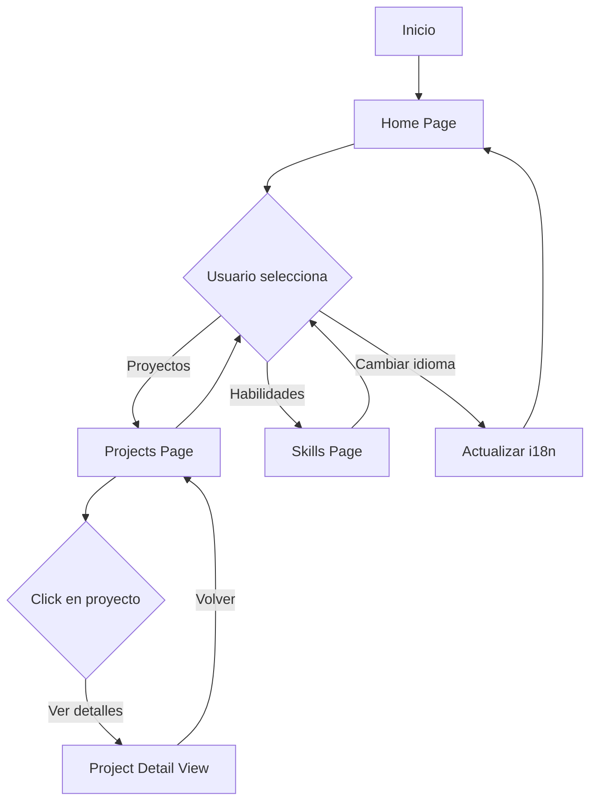

# Documento de Diseño Técnico - Portafolio Web Personal

## Visión General

Este documento define el diseño técnico para el portafolio web personal de Daniel Navarro. El sistema será un sitio web estático bilingüe (Español/Inglés) construido con tecnologías modernas, optimizado para rendimiento y accesibilidad, y desplegado en GitHub Pages.

### Objetivos del Diseño

- Crear una arquitectura simple y mantenible basada en componentes
- Facilitar la gestión de contenido mediante archivos de configuración
- Garantizar rendimiento óptimo y experiencia de usuario fluida
- Implementar soporte bilingüe robusto y eficiente
- Asegurar compatibilidad con GitHub Pages

### Decisiones Técnicas Clave

**Stack Tecnológico:** React con Vite
- React proporciona una arquitectura de componentes reutilizables ideal para las tres secciones del portafolio
- Vite ofrece desarrollo rápido y optimización de producción automática
- Ecosistema maduro con excelente soporte para i18n, routing y optimización de imágenes

**Gestión de Contenido:** Archivos JSON + Markdown
- JSON para datos estructurados (proyectos, habilidades, información personal)
- Markdown para contenido largo (descripciones de proyectos)
- Permite actualización sin conocimientos técnicos avanzados
- Compatible con control de versiones Git

**Internacionalización:** react-i18next
- Biblioteca estándar para i18n en React
- Soporte para carga dinámica de traducciones
- Persistencia de preferencia de idioma en localStorage

**Routing:** React Router
- Navegación SPA sin recargas de página
- Soporte para rutas anidadas y parámetros dinámicos
- Compatible con GitHub Pages mediante HashRouter

## Arquitectura

### Arquitectura General

El sistema sigue una arquitectura de Single Page Application (SPA) con las siguientes capas:

```
┌─────────────────────────────────────────────────────────────┐
│                     Capa de Presentación                     │
│  ┌──────────────┐  ┌──────────────┐  ┌──────────────┐      │
│  │   Home       │  │  Projects    │  │   Skills     │      │
│  │   Page       │  │   Page       │  │   Page       │      │
│  └──────────────┘  └──────────────┘  └──────────────┘      │
└─────────────────────────────────────────────────────────────┘
                            │
┌─────────────────────────────────────────────────────────────┐
│                   Capa de Componentes                        │
│  ┌──────────┐  ┌──────────┐  ┌──────────┐  ┌──────────┐   │
│  │ Header   │  │ Project  │  │  Skill   │  │ Language │   │
│  │          │  │  Card    │  │  Card    │  │ Selector │   │
│  └──────────┘  └──────────┘  └──────────┘  └──────────┘   │
└─────────────────────────────────────────────────────────────┘
                            │
┌─────────────────────────────────────────────────────────────┐
│                    Capa de Servicios                         │
│  ┌──────────────┐  ┌──────────────┐  ┌──────────────┐      │
│  │   Content    │  │     i18n     │  │   Image      │      │
│  │   Loader     │  │   Service    │  │   Optimizer  │      │
│  └──────────────┘  └──────────────┘  └──────────────┘      │
└─────────────────────────────────────────────────────────────┘
                            │
┌─────────────────────────────────────────────────────────────┐
│                    Capa de Datos                             │
│  ┌──────────────┐  ┌──────────────┐  ┌──────────────┐      │
│  │  projects/   │  │   skills/    │  │   locales/   │      │
│  │  *.json      │  │   *.json     │  │   *.json     │      │
│  └──────────────┘  └──────────────┘  └──────────────┘      │
└─────────────────────────────────────────────────────────────┘
```

### Flujo de Datos

1. **Carga Inicial:** La aplicación carga archivos de configuración JSON al iniciar
2. **Selección de Idioma:** El servicio i18n carga las traducciones correspondientes
3. **Renderizado:** Los componentes consumen datos y traducciones para renderizar la UI
4. **Navegación:** React Router gestiona las transiciones entre páginas sin recargas
5. **Interacción:** Los eventos de usuario actualizan el estado local de React

### Diagrama de Flujo de Navegación



## Componentes e Interfaces

### Estructura de Componentes

#### 1. App (Componente Raíz)
```typescript
interface AppProps {}

// Responsabilidades:
// - Configurar React Router
// - Inicializar i18n
// - Cargar datos de contenido
// - Proporcionar contexto global
```

#### 2. Layout
```typescript
interface LayoutProps {
  children: React.ReactNode;
}

// Responsabilidades:
// - Renderizar Header con navegación
// - Renderizar Footer
// - Gestionar estructura de página común
```

#### 3. Header
```typescript
interface HeaderProps {
  currentLanguage: 'es' | 'en';
  onLanguageChange: (lang: 'es' | 'en') => void;
}

// Responsabilidades:
// - Mostrar navegación principal
// - Renderizar selector de idioma
// - Resaltar página activa
```

#### 4. LanguageSelector
```typescript
interface LanguageSelectorProps {
  currentLanguage: 'es' | 'en';
  onChange: (lang: 'es' | 'en') => void;
}

// Responsabilidades:
// - Mostrar idioma actual
// - Permitir cambio de idioma
// - Persistir preferencia en localStorage
```

#### 5. HomePage
```typescript
interface HomePageProps {}

// Responsabilidades:
// - Mostrar foto y resumen personal
// - Mostrar enlaces de contacto
// - Mostrar preview de últimos 3 proyectos
// - Mostrar resumen de 6 habilidades principales
```

#### 6. ProjectsPage
```typescript
interface ProjectsPageProps {}

// Responsabilidades:
// - Cargar lista de proyectos
// - Renderizar ProjectCard para cada proyecto
// - Ordenar proyectos por fecha (más reciente primero)
```

#### 7. ProjectCard
```typescript
interface ProjectCardProps {
  project: Project;
  onClick: () => void;
}

interface Project {
  id: string;
  title: LocalizedString;
  shortDescription: LocalizedString;
  fullDescription: LocalizedString;
  image: string;
  technologies: string[];
  date: string;
  links?: {
    github?: string;
    demo?: string;
  };
}

// Responsabilidades:
// - Mostrar información resumida del proyecto
// - Manejar click para ver detalles
// - Mostrar imagen optimizada
```

#### 8. ProjectDetail
```typescript
interface ProjectDetailProps {
  projectId: string;
  onBack: () => void;
}

// Responsabilidades:
// - Mostrar información completa del proyecto
// - Renderizar descripción en Markdown
// - Mostrar galería de imágenes
// - Proporcionar enlaces a código/demo
```

#### 9. SkillsPage
```typescript
interface SkillsPageProps {}

// Responsabilidades:
// - Mostrar habilidades técnicas por categorías
// - Mostrar formación académica
// - Mostrar certificaciones
// - Mostrar experiencia laboral
```

#### 10. SkillCard
```typescript
interface SkillCardProps {
  skill: Skill;
}

interface Skill {
  id: string;
  name: LocalizedString;
  category: string;
  level: 'basic' | 'intermediate' | 'advanced' | 'expert';
  icon?: string;
}

// Responsabilidades:
// - Mostrar nombre de habilidad
// - Mostrar nivel de dominio visualmente
// - Mostrar icono si está disponible
```

### Tipos Compartidos

```typescript
// Tipos de datos comunes

type LocalizedString = {
  es: string;
  en: string;
};

interface PersonalInfo {
  name: string;
  photo: string;
  summary: LocalizedString;
  contacts: {
    email: string;
    linkedin: string;
    github: string;
  };
}

interface Education {
  id: string;
  institution: LocalizedString;
  degree: LocalizedString;
  year: string;
}

interface Certification {
  id: string;
  name: LocalizedString;
  issuer: LocalizedString;
  year: string;
}

interface Experience {
  id: string;
  company: LocalizedString;
  position: LocalizedString;
  period: string;
  description: LocalizedString;
}
```

## Modelos de Datos

### Estructura de Archivos de Contenido

```
public/
├── content/
│   ├── personal.json          # Información personal
│   ├── projects/
│   │   ├── project-1.json     # Proyecto individual
│   │   ├── project-2.json
│   │   └── ...
│   ├── skills/
│   │   ├── technical.json     # Habilidades técnicas
│   │   ├── education.json     # Formación académica
│   │   ├── certifications.json # Certificaciones
│   │   └── experience.json    # Experiencia laboral
│   └── images/
│       ├── profile.jpg
│       ├── projects/
│       └── ...
```

### Esquemas de Datos

#### personal.json
```json
{
  "name": "Daniel Navarro",
  "photo": "/content/images/profile.jpg",
  "summary": {
    "es": "Resumen profesional en español...",
    "en": "Professional summary in English..."
  },
  "contacts": {
    "email": "daniel@example.com",
    "linkedin": "https://linkedin.com/in/daniel-navarro",
    "github": "https://github.com/danielnavarro"
  },
  "featuredSkills": ["skill-1", "skill-2", "skill-3", "skill-4", "skill-5", "skill-6"]
}
```

#### projects/project-1.json
```json
{
  "id": "project-1",
  "title": {
    "es": "Análisis de Datos de Ventas",
    "en": "Sales Data Analysis"
  },
  "shortDescription": {
    "es": "Descripción breve en español (máx 100 palabras)",
    "en": "Short description in English (max 100 words)"
  },
  "fullDescription": {
    "es": "Descripción completa en español...",
    "en": "Full description in English..."
  },
  "image": "/content/images/projects/project-1.jpg",
  "images": [
    "/content/images/projects/project-1-1.jpg",
    "/content/images/projects/project-1-2.jpg"
  ],
  "technologies": ["Python", "Pandas", "Matplotlib", "Jupyter"],
  "date": "2024-01-15",
  "featured": true,
  "links": {
    "github": "https://github.com/danielnavarro/project-1",
    "demo": "https://demo.example.com"
  }
}
```

#### skills/technical.json
```json
{
  "categories": [
    {
      "id": "data-science",
      "name": {
        "es": "Ciencia de Datos",
        "en": "Data Science"
      },
      "skills": [
        {
          "id": "skill-1",
          "name": {
            "es": "Python",
            "en": "Python"
          },
          "level": "expert",
          "icon": "python"
        }
      ]
    }
  ]
}
```

#### skills/education.json
```json
{
  "education": [
    {
      "id": "edu-1",
      "institution": {
        "es": "Universidad Nacional",
        "en": "National University"
      },
      "degree": {
        "es": "Licenciatura en Ciencias de la Computación",
        "en": "Bachelor of Computer Science"
      },
      "year": "2020"
    }
  ]
}
```

#### skills/certifications.json
```json
{
  "certifications": [
    {
      "id": "cert-1",
      "name": {
        "es": "Certificación en Data Science",
        "en": "Data Science Certification"
      },
      "issuer": {
        "es": "Coursera",
        "en": "Coursera"
      },
      "year": "2023"
    }
  ]
}
```

#### skills/experience.json
```json
{
  "experience": [
    {
      "id": "exp-1",
      "company": {
        "es": "Empresa Tech",
        "en": "Tech Company"
      },
      "position": {
        "es": "Analista de Datos",
        "en": "Data Analyst"
      },
      "period": "2021-2023",
      "description": {
        "es": "Descripción del rol en español",
        "en": "Role description in English"
      }
    }
  ]
}
```

### Validación de Datos

El sistema validará los archivos de configuración durante el build:

- **Campos requeridos:** Verificar que todos los campos obligatorios estén presentes
- **Formato de fechas:** Validar formato ISO 8601 (YYYY-MM-DD)
- **URLs:** Validar formato de URLs en enlaces
- **Imágenes:** Verificar que las rutas de imágenes existan
- **Traducciones:** Asegurar que ambos idiomas (es/en) estén presentes
- **Niveles de habilidad:** Validar que sean valores permitidos (basic, intermediate, advanced, expert)

Si la validación falla, el build mostrará errores descriptivos indicando el archivo y campo problemático.


## Implementación de Características Clave

### Sistema de Internacionalización (i18n)

**Configuración de react-i18next:**

```typescript
// src/i18n/config.ts
import i18n from 'i18next';
import { initReactI18next } from 'react-i18next';
import LanguageDetector from 'i18next-browser-languagedetector';

i18n
  .use(LanguageDetector)
  .use(initReactI18next)
  .init({
    resources: {
      es: {
        translation: require('./locales/es.json')
      },
      en: {
        translation: require('./locales/en.json')
      }
    },
    fallbackLng: 'es',
    detection: {
      order: ['localStorage', 'navigator'],
      caches: ['localStorage']
    },
    interpolation: {
      escapeValue: false
    }
  });

export default i18n;
```

**Archivos de traducción:**

```
src/i18n/locales/
├── es.json    # Traducciones en español
└── en.json    # Traducciones en inglés
```

Estructura de traducciones:
```json
{
  "nav": {
    "home": "Inicio",
    "projects": "Proyectos",
    "skills": "Habilidades"
  },
  "home": {
    "greeting": "Hola, soy",
    "contact": "Contacto",
    "featuredProjects": "Proyectos Destacados",
    "mainSkills": "Habilidades Principales"
  },
  "projects": {
    "title": "Mis Proyectos",
    "viewDetails": "Ver Detalles",
    "backToList": "Volver a Proyectos",
    "technologies": "Tecnologías",
    "links": "Enlaces"
  },
  "skills": {
    "title": "Habilidades y Experiencia",
    "technical": "Habilidades Técnicas",
    "education": "Formación Académica",
    "certifications": "Certificaciones",
    "experience": "Experiencia Laboral",
    "level": {
      "basic": "Básico",
      "intermediate": "Intermedio",
      "advanced": "Avanzado",
      "expert": "Experto"
    }
  }
}
```

### Sistema de Routing

**Configuración de React Router:**

```typescript
// src/App.tsx
import { HashRouter, Routes, Route } from 'react-router-dom';

function App() {
  return (
    <HashRouter>
      <Layout>
        <Routes>
          <Route path="/" element={<HomePage />} />
          <Route path="/projects" element={<ProjectsPage />} />
          <Route path="/projects/:projectId" element={<ProjectDetail />} />
          <Route path="/skills" element={<SkillsPage />} />
        </Routes>
      </Layout>
    </HashRouter>
  );
}
```

**Nota:** Se usa HashRouter en lugar de BrowserRouter para compatibilidad con GitHub Pages, que no soporta configuración de servidor para rutas SPA.

### Cargador de Contenido

**Servicio para cargar datos:**

```typescript
// src/services/contentLoader.ts

export class ContentLoader {
  private static cache: Map<string, any> = new Map();

  static async loadPersonalInfo(): Promise<PersonalInfo> {
    return this.loadJSON('/content/personal.json');
  }

  static async loadProjects(): Promise<Project[]> {
    const projectFiles = await this.getProjectFiles();
    const projects = await Promise.all(
      projectFiles.map(file => this.loadJSON(`/content/projects/${file}`))
    );
    return projects.sort((a, b) => 
      new Date(b.date).getTime() - new Date(a.date).getTime()
    );
  }

  static async loadProject(id: string): Promise<Project> {
    return this.loadJSON(`/content/projects/${id}.json`);
  }

  static async loadSkills(): Promise<SkillsData> {
    const [technical, education, certifications, experience] = await Promise.all([
      this.loadJSON('/content/skills/technical.json'),
      this.loadJSON('/content/skills/education.json'),
      this.loadJSON('/content/skills/certifications.json'),
      this.loadJSON('/content/skills/experience.json')
    ]);
    return { technical, education, certifications, experience };
  }

  private static async loadJSON(path: string): Promise<any> {
    if (this.cache.has(path)) {
      return this.cache.get(path);
    }
    const response = await fetch(path);
    if (!response.ok) {
      throw new Error(`Failed to load ${path}: ${response.statusText}`);
    }
    const data = await response.json();
    this.cache.set(path, data);
    return data;
  }

  private static async getProjectFiles(): Promise<string[]> {
    // En build time, Vite puede generar un índice de archivos
    // O se puede mantener un manifest.json con la lista de proyectos
    const manifest = await this.loadJSON('/content/projects/manifest.json');
    return manifest.files;
  }
}
```

### Optimización de Imágenes

**Estrategia de optimización:**

1. **Formato:** Usar WebP con fallback a JPEG
2. **Tamaños responsivos:** Generar múltiples tamaños (thumbnail, medium, large)
3. **Lazy loading:** Cargar imágenes solo cuando entran en viewport
4. **Compresión:** Optimizar calidad vs tamaño (80% quality)

**Componente de imagen optimizada:**

```typescript
// src/components/OptimizedImage.tsx

interface OptimizedImageProps {
  src: string;
  alt: string;
  sizes?: string;
  className?: string;
  loading?: 'lazy' | 'eager';
}

export function OptimizedImage({ 
  src, 
  alt, 
  sizes = '100vw',
  className,
  loading = 'lazy'
}: OptimizedImageProps) {
  const webpSrc = src.replace(/\.(jpg|jpeg|png)$/, '.webp');
  
  return (
    <picture>
      <source srcSet={webpSrc} type="image/webp" />
      
    </picture>
  );
}
```

### Sistema de Diseño y Estilos

**Tecnología:** Tailwind CSS
- Utilidad-first CSS framework
- Configuración de tema personalizado
- Purge automático de CSS no utilizado
- Soporte para dark mode (opcional para futuro)

**Configuración de tema:**

```javascript
// tailwind.config.js
module.exports = {
  content: ['./src/**/*.{js,jsx,ts,tsx}'],
  theme: {
    extend: {
      colors: {
        primary: {
          50: '#f0f9ff',
          100: '#e0f2fe',
          500: '#0ea5e9',
          600: '#0284c7',
          700: '#0369a1',
        },
        secondary: {
          500: '#8b5cf6',
          600: '#7c3aed',
        }
      },
      fontFamily: {
        sans: ['Inter', 'system-ui', 'sans-serif'],
        heading: ['Poppins', 'sans-serif'],
      },
      spacing: {
        '18': '4.5rem',
        '88': '22rem',
      },
      animation: {
        'fade-in': 'fadeIn 0.3s ease-in',
        'slide-up': 'slideUp 0.4s ease-out',
      },
      keyframes: {
        fadeIn: {
          '0%': { opacity: '0' },
          '100%': { opacity: '1' },
        },
        slideUp: {
          '0%': { transform: 'translateY(20px)', opacity: '0' },
          '100%': { transform: 'translateY(0)', opacity: '1' },
        }
      }
    },
  },
  plugins: [],
};
```

**Paleta de colores:**
- Primary: Azul (#0ea5e9) - Para enlaces y elementos interactivos
- Secondary: Púrpura (#8b5cf6) - Para acentos y destacados
- Neutral: Grises - Para texto y fondos
- Success: Verde - Para indicadores de nivel experto
- Warning: Amarillo - Para indicadores de nivel intermedio

### Diseño Responsivo

**Breakpoints:**
- Mobile: < 768px
- Tablet: 768px - 1024px
- Desktop: > 1024px

**Estrategias por dispositivo:**

**Mobile:**
- Navegación hamburger menu
- Tarjetas de proyecto en columna única
- Imágenes full-width
- Tipografía reducida (16px base)

**Tablet:**
- Navegación horizontal
- Tarjetas de proyecto en 2 columnas
- Imágenes con padding lateral
- Tipografía estándar (18px base)

**Desktop:**
- Navegación horizontal con hover effects
- Tarjetas de proyecto en 3 columnas
- Layout con max-width de 1280px centrado
- Tipografía ampliada (18px base)

### Accesibilidad

**Implementaciones clave:**

1. **Navegación por teclado:**
   - Todos los elementos interactivos accesibles con Tab
   - Focus visible con outline personalizado
   - Skip to main content link

2. **ARIA labels:**
   - Botones con aria-label descriptivo
   - Navegación con role="navigation"
   - Regiones con landmarks apropiados

3. **Contraste de color:**
   - Texto normal: mínimo 4.5:1
   - Texto grande: mínimo 3:1
   - Validación con herramientas automáticas

4. **Texto alternativo:**
   - Todas las imágenes con alt descriptivo
   - Imágenes decorativas con alt=""

5. **Anuncios dinámicos:**
   - Cambios de idioma anunciados con aria-live
   - Carga de contenido con loading states

### SEO y Metadatos

**React Helmet para gestión de meta tags:**

```typescript
// src/components/SEO.tsx
import { Helmet } from 'react-helmet-async';
import { useTranslation } from 'react-i18next';

interface SEOProps {
  title?: string;
  description?: string;
  image?: string;
  url?: string;
}

export function SEO({ title, description, image, url }: SEOProps) {
  const { t, i18n } = useTranslation();
  const lang = i18n.language;
  
  const siteTitle = 'Daniel Navarro - Portfolio';
  const fullTitle = title ? `${title} | ${siteTitle}` : siteTitle;
  const defaultDescription = t('meta.description');
  const defaultImage = '/content/images/og-image.jpg';
  
  return (
    <Helmet>
      <html lang={lang} />
      <title>{fullTitle}</title>
      <meta name="description" content={description || defaultDescription} />
      
      {/* Open Graph */}
      <meta property="og:title" content={fullTitle} />
      <meta property="og:description" content={description || defaultDescription} />
      <meta property="og:image" content={image || defaultImage} />
      <meta property="og:url" content={url || window.location.href} />
      <meta property="og:type" content="website" />
      
      {/* Twitter Card */}
      <meta name="twitter:card" content="summary_large_image" />
      <meta name="twitter:title" content={fullTitle} />
      <meta name="twitter:description" content={description || defaultDescription} />
      <meta name="twitter:image" content={image || defaultImage} />
      
      {/* Structured Data */}
      <script type="application/ld+json">
        {JSON.stringify({
          "@context": "https://schema.org",
          "@type": "Person",
          "name": "Daniel Navarro",
          "url": url || window.location.href,
          "image": image || defaultImage,
          "jobTitle": "Data Scientist",
          "description": description || defaultDescription
        })}
      </script>
    </Helmet>
  );
}
```

**Archivos adicionales:**

```xml
<!-- public/sitemap.xml -->
<?xml version="1.0" encoding="UTF-8"?>
<urlset xmlns="http://www.sitemaps.org/schemas/sitemap/0.9">
  <url>
    <loc>https://[username].github.io/[repo]/</loc>
    <changefreq>monthly</changefreq>
    <priority>1.0</priority>
  </url>
  <url>
    <loc>https://[username].github.io/[repo]/#/projects</loc>
    <changefreq>weekly</changefreq>
    <priority>0.8</priority>
  </url>
  <url>
    <loc>https://[username].github.io/[repo]/#/skills</loc>
    <changefreq>monthly</changefreq>
    <priority>0.8</priority>
  </url>
</urlset>
```

```
# public/robots.txt
User-agent: *
Allow: /
Sitemap: https://[username].github.io/[repo]/sitemap.xml
```

### Despliegue en GitHub Pages

**Configuración de GitHub Actions:**

```yaml
# .github/workflows/deploy.yml
name: Deploy to GitHub Pages

on:
  push:
    branches: [ main ]
  workflow_dispatch:

permissions:
  contents: read
  pages: write
  id-token: write

jobs:
  build:
    runs-on: ubuntu-latest
    steps:
      - uses: actions/checkout@v3
      
      - name: Setup Node.js
        uses: actions/setup-node@v3
        with:
          node-version: '18'
          cache: 'npm'
      
      - name: Install dependencies
        run: npm ci
      
      - name: Build
        run: npm run build
        env:
          NODE_ENV: production
      
      - name: Upload artifact
        uses: actions/upload-pages-artifact@v2
        with:
          path: ./dist

  deploy:
    environment:
      name: github-pages
      url: ${{ steps.deployment.outputs.page_url }}
    runs-on: ubuntu-latest
    needs: build
    steps:
      - name: Deploy to GitHub Pages
        id: deployment
        uses: actions/deploy-pages@v2
```

**Configuración de Vite para GitHub Pages:**

```typescript
// vite.config.ts
import { defineConfig } from 'vite';
import react from '@vitejs/plugin-react';

export default defineConfig({
  plugins: [react()],
  base: process.env.NODE_ENV === 'production' 
    ? '/[repository-name]/' 
    : '/',
  build: {
    outDir: 'dist',
    assetsDir: 'assets',
    sourcemap: false,
    minify: 'terser',
    rollupOptions: {
      output: {
        manualChunks: {
          vendor: ['react', 'react-dom', 'react-router-dom'],
          i18n: ['react-i18next', 'i18next']
        }
      }
    }
  },
  optimizeDeps: {
    include: ['react', 'react-dom', 'react-router-dom']
  }
});
```


## Propiedades de Corrección

*Una propiedad es una característica o comportamiento que debe mantenerse verdadero en todas las ejecuciones válidas de un sistema - esencialmente, una declaración formal sobre lo que el sistema debe hacer. Las propiedades sirven como puente entre las especificaciones legibles por humanos y las garantías de corrección verificables por máquinas.*

### Propiedad 1: Renderizado completo de tarjetas de proyecto

*Para cualquier* proyecto en la lista de proyectos, la tarjeta renderizada debe contener título, descripción breve, imagen y lista de tecnologías visibles.

**Valida: Requisitos 3.2, 3.3, 3.4, 3.5**

### Propiedad 2: Ordenamiento cronológico de proyectos

*Para cualquier* lista de proyectos con fechas, los proyectos deben estar ordenados del más reciente al más antiguo (orden descendente por fecha).

**Valida: Requisitos 3.6**

### Propiedad 3: Renderizado completo de vista detallada de proyecto

*Para cualquier* proyecto seleccionado, la vista detallada debe mostrar título completo, descripción completa, imágenes, tecnologías y enlaces (cuando estén disponibles).

**Valida: Requisitos 4.2, 4.3, 4.4, 4.5, 4.6**

### Propiedad 4: Renderizado completo de habilidades técnicas

*Para cualquier* habilidad técnica, debe mostrarse su nombre, categoría y nivel de dominio de forma visible.

**Valida: Requisitos 5.1, 5.2**

### Propiedad 5: Renderizado completo de formación académica

*Para cualquier* entrada de formación académica, debe mostrarse institución, título y año.

**Valida: Requisitos 5.3**

### Propiedad 6: Renderizado completo de certificaciones

*Para cualquier* certificación, debe mostrarse nombre, emisor y año.

**Valida: Requisitos 5.4**

### Propiedad 7: Renderizado completo de experiencia laboral

*Para cualquier* entrada de experiencia laboral, debe mostrarse empresa, puesto y período.

**Valida: Requisitos 5.5**

### Propiedad 8: Localización correcta de contenido

*Para cualquier* contenido con traducciones, cuando se selecciona un idioma (español o inglés), todo el contenido visible debe mostrarse en ese idioma.

**Valida: Requisitos 6.2, 6.3**

### Propiedad 9: Persistencia de preferencia de idioma (Round-trip)

*Para cualquier* cambio de idioma realizado por el usuario, la preferencia debe guardarse en localStorage y recuperarse correctamente al recargar la página.

**Valida: Requisitos 6.5**

### Propiedad 10: Carga válida de archivos de proyecto

*Para cualquier* archivo JSON de proyecto que contenga todos los campos requeridos (título en ambos idiomas, descripción breve, descripción completa, tecnologías y fecha), el sistema debe cargarlo exitosamente y mostrarlo en la lista de proyectos.

**Valida: Requisitos 7.1, 7.2, 7.3**

### Propiedad 11: Validación de archivos de proyecto inválidos

*Para cualquier* archivo JSON de proyecto que carezca de campos requeridos o tenga formato inválido, el sistema debe generar un error descriptivo durante la compilación indicando el problema específico.

**Valida: Requisitos 7.4**

### Propiedad 12: Carga válida de archivos de habilidad

*Para cualquier* archivo JSON de habilidad que contenga todos los campos requeridos (nombre en ambos idiomas, categoría y nivel de dominio), el sistema debe cargarlo exitosamente y mostrarlo en la página de habilidades.

**Valida: Requisitos 8.1, 8.2, 8.3**

### Propiedad 13: Validación de archivos de habilidad inválidos

*Para cualquier* archivo JSON de habilidad que carezca de campos requeridos o tenga formato inválido, el sistema debe generar un error descriptivo durante la compilación indicando el problema específico.

**Valida: Requisitos 8.4**

### Propiedad 14: Optimización de formato de imágenes

*Para cualquier* imagen utilizada en el sitio, debe estar en formato WebP o JPEG optimizado con tamaño apropiado para web.

**Valida: Requisitos 12.2**

### Propiedad 15: Lazy loading de imágenes

*Para cualquier* imagen que no esté en el viewport inicial, debe tener el atributo loading="lazy" configurado.

**Valida: Requisitos 12.4**

### Propiedad 16: Texto alternativo en imágenes

*Para cualquier* elemento de imagen renderizado, debe incluir un atributo alt con texto descriptivo (o alt="" para imágenes decorativas).

**Valida: Requisitos 13.1**

### Propiedad 17: Uso de HTML semántico

*Para cualquier* página renderizada, debe utilizar etiquetas HTML semánticas apropiadas (header, nav, main, section, article, footer) en lugar de divs genéricos para estructura principal.

**Valida: Requisitos 13.4**

### Propiedad 18: Atributos ARIA en elementos interactivos

*Para cualquier* elemento interactivo (botones, enlaces, controles), debe incluir atributos ARIA apropiados cuando el HTML semántico no sea suficiente para describir su función.

**Valida: Requisitos 13.5**

### Propiedad 19: Meta tags completos por página

*Para cualquier* página del sitio, debe incluir meta tags de descripción, Open Graph, y título único descriptivo.

**Valida: Requisitos 14.1, 14.2, 14.5**

### Propiedad 20: Structured data JSON-LD

*Para cualquier* página relevante (home, proyectos), debe incluir structured data en formato JSON-LD con información apropiada de Person o CreativeWork.

**Valida: Requisitos 14.6**


## Manejo de Errores

### Categorías de Errores

#### 1. Errores de Carga de Contenido

**Escenario:** Fallo al cargar archivos JSON de configuración

**Manejo:**
- Mostrar mensaje de error amigable al usuario
- Registrar error detallado en consola para debugging
- Proporcionar fallback con contenido de ejemplo cuando sea posible
- No bloquear la carga de otras secciones

**Implementación:**
```typescript
try {
  const projects = await ContentLoader.loadProjects();
  setProjects(projects);
} catch (error) {
  console.error('Error loading projects:', error);
  setError({
    type: 'content-load',
    message: t('errors.projectsLoadFailed'),
    details: error.message
  });
  // Mostrar UI de error pero permitir navegación a otras secciones
}
```

#### 2. Errores de Validación de Datos

**Escenario:** Archivos JSON con formato inválido o campos faltantes

**Manejo:**
- Validar durante el build time (no en runtime)
- Generar errores descriptivos que indiquen:
  - Archivo problemático
  - Campo faltante o inválido
  - Valor esperado vs valor recibido
- Detener el build para evitar despliegue de contenido inválido

**Implementación:**
```typescript
// scripts/validate-content.ts
function validateProject(project: any, filename: string): ValidationResult {
  const errors: string[] = [];
  
  if (!project.id) errors.push(`Missing required field: id`);
  if (!project.title?.es || !project.title?.en) {
    errors.push(`Missing required translations for title`);
  }
  if (!project.date || !isValidDate(project.date)) {
    errors.push(`Invalid or missing date (expected ISO 8601 format)`);
  }
  
  if (errors.length > 0) {
    return {
      valid: false,
      file: filename,
      errors
    };
  }
  
  return { valid: true };
}
```

#### 3. Errores de Imágenes

**Escenario:** Imagen no encontrada o fallo al cargar

**Manejo:**
- Mostrar imagen placeholder
- Registrar warning en consola
- No bloquear renderizado del resto del contenido
- Validar existencia de imágenes durante build

**Implementación:**
```typescript
function ProjectCard({ project }: ProjectCardProps) {
  const [imageError, setImageError] = useState(false);
  
  return (
     setImageError(true)}
      loading="lazy"
    />
  );
}
```

#### 4. Errores de Navegación

**Escenario:** Usuario intenta acceder a proyecto inexistente

**Manejo:**
- Redirigir a página 404 personalizada
- Proporcionar enlaces para volver a secciones principales
- Sugerir proyectos relacionados o recientes

**Implementación:**
```typescript
function ProjectDetail() {
  const { projectId } = useParams();
  const [project, setProject] = useState<Project | null>(null);
  const [notFound, setNotFound] = useState(false);
  
  useEffect(() => {
    ContentLoader.loadProject(projectId)
      .then(setProject)
      .catch(() => setNotFound(true));
  }, [projectId]);
  
  if (notFound) {
    return <NotFoundPage type="project" />;
  }
  
  // Renderizar proyecto...
}
```

#### 5. Errores de Internacionalización

**Escenario:** Traducción faltante para un idioma

**Manejo:**
- Usar fallback al idioma por defecto (español)
- Registrar warning indicando la clave faltante
- No mostrar claves de traducción al usuario

**Configuración i18next:**
```typescript
i18n.init({
  fallbackLng: 'es',
  saveMissing: true,
  missingKeyHandler: (lng, ns, key) => {
    console.warn(`Missing translation: ${key} for language: ${lng}`);
  }
});
```

### Estrategia de Logging

**Desarrollo:**
- Logs detallados en consola
- Stack traces completos
- Información de estado para debugging

**Producción:**
- Logs mínimos en consola
- Mensajes de error amigables al usuario
- Considerar integración con servicio de error tracking (opcional)

### Boundary de Errores en React

Implementar Error Boundaries para capturar errores de renderizado:

```typescript
class ErrorBoundary extends React.Component<
  { children: React.ReactNode },
  { hasError: boolean; error?: Error }
> {
  constructor(props) {
    super(props);
    this.state = { hasError: false };
  }

  static getDerivedStateFromError(error: Error) {
    return { hasError: true, error };
  }

  componentDidCatch(error: Error, errorInfo: React.ErrorInfo) {
    console.error('Error caught by boundary:', error, errorInfo);
  }

  render() {
    if (this.state.hasError) {
      return (
        <div className="error-container">
          <h2>Algo salió mal</h2>
          <p>Por favor, recarga la página o intenta más tarde.</p>
          <button onClick={() => window.location.reload()}>
            Recargar página
          </button>
        </div>
      );
    }

    return this.props.children;
  }
}
```

## Estrategia de Testing

### Enfoque Dual de Testing

El proyecto implementará un enfoque dual que combina:

1. **Tests Unitarios:** Para casos específicos, ejemplos concretos y casos edge
2. **Tests Basados en Propiedades:** Para verificar propiedades universales con múltiples inputs generados

Ambos tipos de tests son complementarios y necesarios para cobertura completa.

### Biblioteca de Property-Based Testing

**Biblioteca seleccionada:** fast-check (para JavaScript/TypeScript)

**Justificación:**
- Biblioteca madura y bien mantenida para JavaScript/TypeScript
- Excelente integración con Jest y Vitest
- Generadores incorporados para tipos comunes
- Soporte para shrinking (reducción de casos de fallo)
- Documentación completa y comunidad activa

**Instalación:**
```bash
npm install --save-dev fast-check
```

### Configuración de Tests

**Framework de testing:** Vitest
- Más rápido que Jest
- Mejor integración con Vite
- API compatible con Jest
- Soporte nativo para ESM

**Configuración:**
```typescript
// vitest.config.ts
import { defineConfig } from 'vitest/config';
import react from '@vitejs/plugin-react';

export default defineConfig({
  plugins: [react()],
  test: {
    globals: true,
    environment: 'jsdom',
    setupFiles: './src/test/setup.ts',
    coverage: {
      provider: 'v8',
      reporter: ['text', 'json', 'html'],
      exclude: [
        'node_modules/',
        'src/test/',
        '**/*.d.ts',
        '**/*.config.*',
        '**/mockData.ts'
      ]
    }
  }
});
```

### Tests Basados en Propiedades

**Configuración mínima:** 100 iteraciones por test de propiedad

**Formato de etiquetas:**
```typescript
// Feature: portfolio-web-daniel-navarro, Property 1: Renderizado completo de tarjetas de proyecto
```

#### Ejemplo de Test de Propiedad 1: Renderizado completo de tarjetas de proyecto

```typescript
import { describe, it, expect } from 'vitest';
import fc from 'fast-check';
import { render, screen } from '@testing-library/react';
import { ProjectCard } from './ProjectCard';

// Feature: portfolio-web-daniel-navarro, Property 1: Renderizado completo de tarjetas de proyecto
describe('Property 1: Complete project card rendering', () => {
  it('should render all required fields for any project', () => {
    fc.assert(
      fc.property(
        fc.record({
          id: fc.string(),
          title: fc.record({
            es: fc.string({ minLength: 1 }),
            en: fc.string({ minLength: 1 })
          }),
          shortDescription: fc.record({
            es: fc.string({ minLength: 1, maxLength: 500 }),
            en: fc.string({ minLength: 1, maxLength: 500 })
          }),
          image: fc.webUrl(),
          technologies: fc.array(fc.string(), { minLength: 1 }),
          date: fc.date().map(d => d.toISOString().split('T')[0])
        }),
        (project) => {
          const { container } = render(<ProjectCard project={project} />);
          
          // Verificar que el título está presente
          expect(screen.getByText(project.title.es)).toBeInTheDocument();
          
          // Verificar que la descripción está presente
          expect(screen.getByText(project.shortDescription.es)).toBeInTheDocument();
          
          // Verificar que la imagen está presente
          const img = container.querySelector('img');
          expect(img).toBeInTheDocument();
          expect(img?.src).toContain(project.image);
          
          // Verificar que las tecnologías están presentes
          project.technologies.forEach(tech => {
            expect(screen.getByText(tech)).toBeInTheDocument();
          });
        }
      ),
      { numRuns: 100 }
    );
  });
});
```

#### Ejemplo de Test de Propiedad 2: Ordenamiento cronológico

```typescript
// Feature: portfolio-web-daniel-navarro, Property 2: Ordenamiento cronológico de proyectos
describe('Property 2: Chronological ordering of projects', () => {
  it('should order any list of projects from newest to oldest', () => {
    fc.assert(
      fc.property(
        fc.array(
          fc.record({
            id: fc.string(),
            date: fc.date({ min: new Date('2020-01-01'), max: new Date('2024-12-31') })
              .map(d => d.toISOString().split('T')[0]),
            title: fc.record({ es: fc.string(), en: fc.string() })
          }),
          { minLength: 2, maxLength: 20 }
        ),
        (projects) => {
          const sorted = sortProjectsByDate(projects);
          
          // Verificar que cada proyecto es más reciente o igual que el siguiente
          for (let i = 0; i < sorted.length - 1; i++) {
            const currentDate = new Date(sorted[i].date);
            const nextDate = new Date(sorted[i + 1].date);
            expect(currentDate.getTime()).toBeGreaterThanOrEqual(nextDate.getTime());
          }
        }
      ),
      { numRuns: 100 }
    );
  });
});
```

#### Ejemplo de Test de Propiedad 9: Persistencia de idioma (Round-trip)

```typescript
// Feature: portfolio-web-daniel-navarro, Property 9: Persistencia de preferencia de idioma
describe('Property 9: Language preference persistence', () => {
  it('should persist and retrieve any language preference correctly', () => {
    fc.assert(
      fc.property(
        fc.constantFrom('es', 'en'),
        (language) => {
          // Guardar preferencia
          saveLanguagePreference(language);
          
          // Recuperar preferencia
          const retrieved = getLanguagePreference();
          
          // Verificar round-trip
          expect(retrieved).toBe(language);
        }
      ),
      { numRuns: 100 }
    );
  });
});
```

### Tests Unitarios

Los tests unitarios se enfocan en:
- Casos específicos y ejemplos concretos
- Casos edge conocidos
- Integración entre componentes
- Comportamiento de UI específico

#### Ejemplo de Tests Unitarios

```typescript
describe('HomePage - Unit Tests', () => {
  it('should display exactly 3 featured projects', () => {
    const projects = createMockProjects(10);
    render(<HomePage projects={projects} />);
    
    const featuredProjects = screen.getAllByTestId('featured-project');
    expect(featuredProjects).toHaveLength(3);
  });
  
  it('should display exactly 6 main skills', () => {
    const skills = createMockSkills(20);
    render(<HomePage skills={skills} />);
    
    const mainSkills = screen.getAllByTestId('main-skill');
    expect(mainSkills).toHaveLength(6);
  });
  
  it('should display profile photo', () => {
    render(<HomePage />);
    
    const photo = screen.getByAltText(/Daniel Navarro/i);
    expect(photo).toBeInTheDocument();
  });
  
  it('should display contact links', () => {
    render(<HomePage />);
    
    expect(screen.getByLabelText(/email/i)).toBeInTheDocument();
    expect(screen.getByLabelText(/linkedin/i)).toBeInTheDocument();
    expect(screen.getByLabelText(/github/i)).toBeInTheDocument();
  });
});

describe('LanguageSelector - Unit Tests', () => {
  it('should default to Spanish', () => {
    render(<LanguageSelector />);
    
    expect(screen.getByText('Español')).toHaveClass('active');
  });
  
  it('should change language on click', () => {
    render(<LanguageSelector />);
    
    const englishButton = screen.getByText('English');
    fireEvent.click(englishButton);
    
    expect(englishButton).toHaveClass('active');
  });
});

describe('ContentLoader - Unit Tests', () => {
  it('should throw error for missing required fields in project', () => {
    const invalidProject = {
      id: 'test',
      // Missing title
      shortDescription: { es: 'test', en: 'test' }
    };
    
    expect(() => validateProject(invalidProject)).toThrow(/Missing required field: title/);
  });
  
  it('should validate date format', () => {
    const invalidProject = {
      id: 'test',
      title: { es: 'test', en: 'test' },
      date: 'invalid-date'
    };
    
    expect(() => validateProject(invalidProject)).toThrow(/Invalid date format/);
  });
});
```

### Tests de Validación de Contenido

Tests específicos para validar archivos de configuración:

```typescript
describe('Content Validation', () => {
  it('should validate all project files', async () => {
    const projectFiles = await getProjectFiles();
    
    for (const file of projectFiles) {
      const project = await loadJSON(`/content/projects/${file}`);
      const result = validateProject(project, file);
      
      expect(result.valid).toBe(true);
      if (!result.valid) {
        console.error(`Validation errors in ${file}:`, result.errors);
      }
    }
  });
  
  it('should ensure all images exist', async () => {
    const projects = await ContentLoader.loadProjects();
    
    for (const project of projects) {
      const imageExists = await checkImageExists(project.image);
      expect(imageExists).toBe(true);
    }
  });
  
  it('should verify sitemap.xml exists', () => {
    const sitemapExists = fs.existsSync('public/sitemap.xml');
    expect(sitemapExists).toBe(true);
  });
  
  it('should verify robots.txt exists', () => {
    const robotsExists = fs.existsSync('public/robots.txt');
    expect(robotsExists).toBe(true);
  });
});
```

### Tests de Accesibilidad

```typescript
import { axe, toHaveNoViolations } from 'jest-axe';

expect.extend(toHaveNoViolations);

describe('Accessibility Tests', () => {
  it('should have no accessibility violations on HomePage', async () => {
    const { container } = render(<HomePage />);
    const results = await axe(container);
    expect(results).toHaveNoViolations();
  });
  
  it('should have no accessibility violations on ProjectsPage', async () => {
    const { container } = render(<ProjectsPage />);
    const results = await axe(container);
    expect(results).toHaveNoViolations();
  });
});
```

### Cobertura de Tests

**Objetivos de cobertura:**
- Líneas: > 80%
- Funciones: > 80%
- Branches: > 75%
- Statements: > 80%

**Áreas prioritarias:**
- Lógica de negocio (validación, ordenamiento, filtrado)
- Servicios de carga de contenido
- Componentes de UI críticos
- Funciones de utilidad

**Comando para ejecutar tests:**
```bash
npm run test              # Ejecutar todos los tests
npm run test:coverage     # Ejecutar con reporte de cobertura
npm run test:ui           # Ejecutar con interfaz visual de Vitest
```

### Integración Continua

Los tests se ejecutarán automáticamente en GitHub Actions antes del despliegue:

```yaml
# .github/workflows/test.yml
name: Run Tests

on: [push, pull_request]

jobs:
  test:
    runs-on: ubuntu-latest
    steps:
      - uses: actions/checkout@v3
      - uses: actions/setup-node@v3
        with:
          node-version: '18'
      - run: npm ci
      - run: npm run test:coverage
      - name: Upload coverage
        uses: codecov/codecov-action@v3
        with:
          files: ./coverage/coverage-final.json
```

---

## Resumen de Decisiones Técnicas

1. **Stack:** React + Vite + TypeScript + Tailwind CSS
2. **Routing:** React Router con HashRouter (compatibilidad GitHub Pages)
3. **i18n:** react-i18next con persistencia en localStorage
4. **Gestión de contenido:** Archivos JSON + Markdown con validación en build time
5. **Testing:** Vitest + fast-check para property-based testing
6. **Optimización:** Lazy loading, WebP, code splitting, minificación
7. **Accesibilidad:** HTML semántico, ARIA, contraste de color, navegación por teclado
8. **SEO:** Meta tags, Open Graph, JSON-LD, sitemap.xml
9. **Despliegue:** GitHub Actions + GitHub Pages

Este diseño proporciona una base sólida, mantenible y escalable para el portafolio web personal, con énfasis en rendimiento, accesibilidad y facilidad de actualización de contenido.
