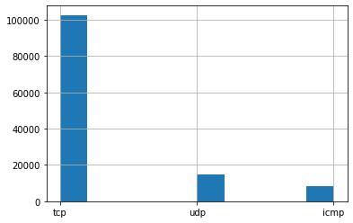
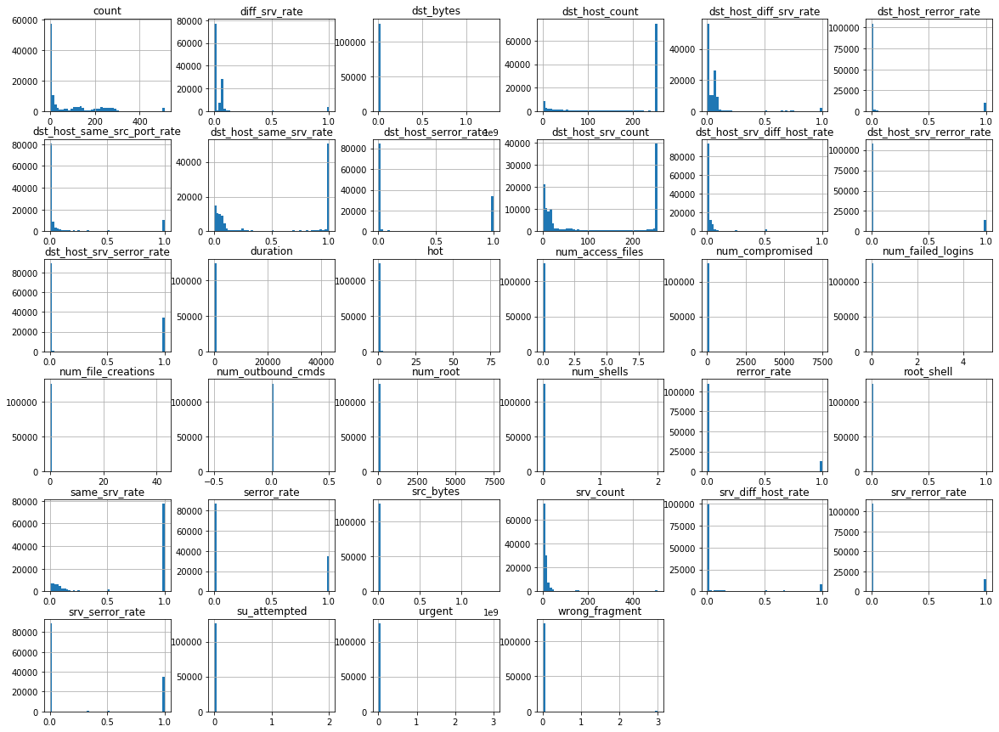
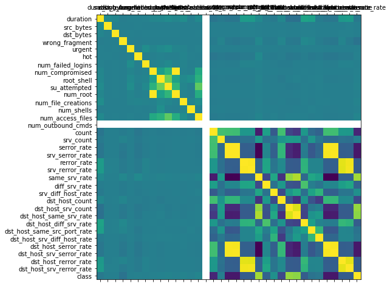
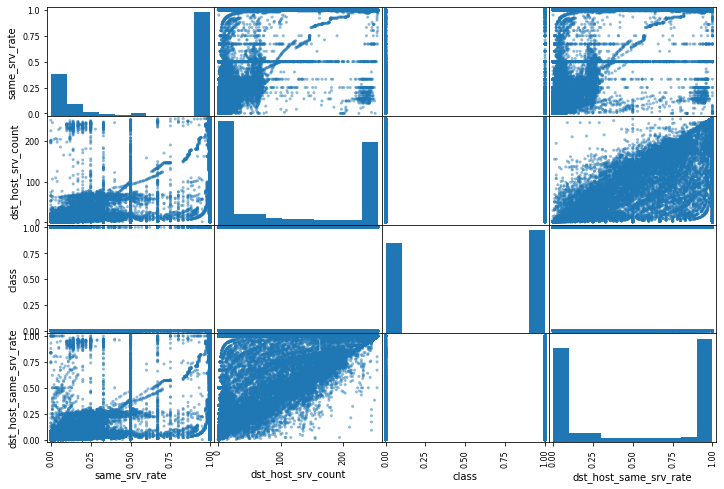

# Visualización del conjunto de datos

En este notebook se muestran algunos de los mecanismos más utilizados para la visualización del conjunto de datos.

## Conjunto de datos

### Descripción
NSL-KDD is a data set suggested to solve some of the inherent problems of the KDD'99 data set which are mentioned in. Although, this new version of the KDD data set still suffers from some of the problems discussed by McHugh and may not be a perfect representative of existing real networks, because of the lack of public data sets for network-based IDSs, we believe it still can be applied as an effective benchmark data set to help researchers compare different intrusion detection methods. Furthermore, the number of records in the NSL-KDD train and test sets are reasonable. This advantage makes it affordable to run the experiments on the complete set without the need to randomly select a small portion. Consequently, evaluation results of different research work will be consistent and comparable.

### Ficheros de datos
* <span style="color:green">**KDDTrain+.ARFF**: The full NSL-KDD train set with binary labels in ARFF format</span>
* <span style="color:green">**KDDTrain+.TXT**: The full NSL-KDD train set including attack-type labels and difficulty level in CSV format</span>
* KDDTrain+_20Percent.ARFF:	A 20% subset of the KDDTrain+.arff file
* KDDTrain+_20Percent.TXT:	A 20% subset of the KDDTrain+.txt file
* KDDTest+.ARFF:	The full NSL-KDD test set with binary labels in ARFF format
* KDDTest+.TXT:	The full NSL-KDD test set including attack-type labels and difficulty level in CSV format
* KDDTest-21.ARFF:	A subset of the KDDTest+.arff file which does not include records with difficulty level of 21 out of 21
* KDDTest-21.TXT:	A subset of the KDDTest+.txt file which does not include records with difficulty level of 21 out of 21

### Descarga de los ficheros de datos
https://iscxdownloads.cs.unb.ca/iscxdownloads/NSL-KDD/#NSL-KDD

### Referencias adicionales sobre el conjunto de datos
_M. Tavallaee, E. Bagheri, W. Lu, and A. Ghorbani, “A Detailed Analysis of the KDD CUP 99 Data Set,” Submitted to Second IEEE Symposium on Computational Intelligence for Security and Defense Applications (CISDA), 2009._

## 1. Lectura del conjunto de datos

```python
# Lectura del conjunto de datos mediante funciones de Python
with open("datasets/NSL-KDD/KDDTrain+.txt") as train_set:
    df = train_set.readlines()
df
```

```text
['0,tcp,ftp_data,SF,491,0,0,0,0,0,0,0,0,0,0,0,0,0,0,0,0,0,2,2,0.00,0.00,0.00,0.00,1.00,0.00,0.00,150,25,0.17,0.03,0.17,0.00,0.00,0.00,0.05,0.00,normal,20\n',
 '0,udp,other,SF,146,0,0,0,0,0,0,0,0,0,0,0,0,0,0,0,0,0,13,1,0.00,0.00,0.00,0.00,0.08,0.15,0.00,255,1,0.00,0.60,0.88,0.00,0.00,0.00,0.00,0.00,normal,15\n',
 '0,tcp,private,S0,0,0,0,0,0,0,0,0,0,0,0,0,0,0,0,0,0,0,123,6,1.00,1.00,0.00,0.00,0.05,0.07,0.00,255,26,0.10,0.05,0.00,0.00,1.00,1.00,0.00,0.00,neptune,19\n',
 '0,tcp,http,SF,232,8153,0,0,0,0,0,1,0,0,0,0,0,0,0,0,0,0,5,5,0.20,0.20,0.00,0.00,1.00,0.00,0.00,30,255,1.00,0.00,0.03,0.04,0.03,0.01,0.00,0.01,normal,21\n',
 '0,tcp,http,SF,199,420,0,0,0,0,0,1,0,0,0,0,0,0,0,0,0,0,30,32,0.00,0.00,0.00,0.00,1.00,0.00,0.09,255,255,1.00,0.00,0.00,0.00,0.00,0.00,0.00,0.00,normal,21\n',
 '0,tcp,private,REJ,0,0,0,0,0,0,0,0,0,0,0,0,0,0,0,0,0,0,121,19,0.00,0.00,1.00,1.00,0.16,0.06,0.00,255,19,0.07,0.07,0.00,0.00,0.00,0.00,1.00,1.00,neptune,21\n',
 '0,tcp,private,S0,0,0,0,0,0,0,0,0,0,0,0,0,0,0,0,0,0,0,166,9,1.00,1.00,0.00,0.00,0.05,0.06,0.00,255,9,0.04,0.05,0.00,0.00,1.00,1.00,0.00,0.00,neptune,21\n',
 '0,tcp,private,S0,0,0,0,0,0,0,0,0,0,0,0,0,0,0,0,0,0,0,117,16,1.00,1.00,0.00,0.00,0.14,0.06,0.00,255,15,0.06,0.07,0.00,0.00,1.00,1.00,0.00,0.00,neptune,21\n',
 '0,tcp,remote_job,S0,0,0,0,0,0,0,0,0,0,0,0,0,0,0,0,0,0,0,270,23,1.00,1.00,0.00,0.00,0.09,0.05,0.00,255,23,0.09,0.05,0.00,0.00,1.00,1.00,0.00,0.00,neptune,21\n',
 '0,tcp,private,S0,0,0,0,0,0,0,0,0,0,0,0,0,0,0,0,0,0,0,133,8,1.00,1.00,0.00,0.00,0.06,0.06,0.00,255,13,0.05,0.06,0.00,0.00,1.00,1.00,0.00,0.00,neptune,21\n',
 '0,tcp,private,REJ,0,0,0,0,0,0,0,0,0,0,0,0,0,0,0,0,0,0,205,12,0.00,0.00,1.00,1.00,0.06,0.06,0.00,255,12,0.05,0.07,0.00,0.00,0.00,0.00,1.00,1.00,neptune,21\n',
 '0,tcp,private,S0,0,0,0,0,0,0,0,0,0,0,0,0,0,0,0,0,0,0,199,3,1.00,1.00,0.00,0.00,0.02,0.06,0.00,255,13,0.05,0.07,0.00,0.00,1.00,1.00,0.00,0.00,neptune,21\n',
 '0,tcp,http,SF,287,2251,0,0,0,0,0,1,0,0,0,0,0,0,0,0,0,0,3,7,0.00,0.00,0.00,0.00,1.00,0.00,0.43,8,219,1.00,0.00,0.12,0.03,0.00,0.00,0.00,0.00,normal,21\n',
 '0,tcp,ftp_data,SF,334,0,0,0,0,0,0,1,0,0,0,0,0,0,0,0,0,0,2,2,0.00,0.00,0.00,0.00,1.00,0.00,0.00,2,20,1.00,0.00,1.00,0.20,0.00,0.00,0.00,0.00,warezclient,15\n',
 '0,tcp,name,S0,0,0,0,0,0,0,0,0,0,0,0,0,0,0,0,0,0,0,233,1,1.00,1.00,0.00,0.00,0.00,0.06,0.00,255,1,0.00,0.07,0.00,0.00,1.00,1.00,0.00,0.00,neptune,19\n',
 '0,tcp,netbios_ns,S0,0,0,0,0,0,0,0,0,0,0,0,0,0,0,0,0,0,0,96,16,1.00,1.00,0.00,0.00,0.17,0.05,0.00,255,2,0.01,0.06,0.00,0.00,1.00,1.00,0.00,0.00,neptune,18\n',
 '0,tcp,http,SF,300,13788,0,0,0,0,0,1,0,0,0,0,0,0,0,0,0,0,8,9,0.00,0.11,0.00,0.00,1.00,0.00,0.22,91,255,1.00,0.00,0.01,0.02,0.00,0.00,0.00,0.00,normal,21\n',
 '0,icmp,eco_i,SF,18,0,0,0,0,0,0,0,0,0,0,0,0,0,0,0,0,0,1,1,0.00,0.00,0.00,0.00,1.00,0.00,0.00,1,16,1.00,0.00,1.00,1.00,0.00,0.00,0.00,0.00,ipsweep,18\n',
 '0,tcp,http,SF,233,616,0,0,0,0,0,1,0,0,0,0,0,0,0,0,0,0,3,3,0.00,0.00,0.00,0.00,1.00,0.00,0.00,66,255,1.00,0.00,0.02,0.03,0.00,0.00,0.02,0.00,normal,21\n',
 '0,tcp,http,SF,343,1178,0,0,0,0,0,1,0,0,0,0,0,0,0,0,0,0,9,10,0.00,0.00,0.00,0.00,1.00,0.00,0.20,157,255,1.00,0.00,0.01,0.04,0.00,0.00,0.00,0.00,normal,21\n',
 '0,tcp,mtp,S0,0,0,0,0,0,0,0,0,0,0,0,0,0,0,0,0,0,0,223,23,1.00,1.00,0.00,0.00,0.10,0.05,0.00,255,23,0.09,0.05,0.00,0.00,1.00,1.00,0.00,0.00,neptune,18\n',
 '0,tcp,private,S0,0,0,0,0,0,0,0,0,0,0,0,0,0,0,0,0,0,0,280,17,1.00,1.00,0.00,0.00,0.06,0.05,0.00,238,17,0.07,0.06,0.00,0.00,0.99,1.00,0.00,0.00,neptune,18\n',
 '0,tcp,http,SF,253,11905,0,0,0,0,0,1,0,0,0,0,0,0,0,0,0,0,8,10,0.00,0.00,0.00,0.00,1.00,0.00,0.20,87,255,1.00,0.00,0.01,0.02,0.00,0.00,0.00,0.00,normal,21\n',
 '5607,udp,other,SF,147,105,0,0,0,0,0,0,0,0,0,0,0,0,0,0,0,0,1,1,0.00,0.00,0.00,0.00,1.00,0.00,0.00,255,1,0.00,0.85,1.00,0.00,0.00,0.00,0.00,0.00,normal,21\n',
 '0,tcp,mtp,S0,0,0,0,0,0,0,0,0,0,0,0,0,0,0,0,0,0,0,248,2,1.00,1.00,0.00,0.00,0.01,0.06,0.00,255,2,0.01,0.06,0.00,0.00,1.00,1.00,0.00,0.00,neptune,19\n',
 '507,tcp,telnet,SF,437,14421,0,0,0,0,0,1,3,0,0,0,0,0,1,0,0,0,1,1,0.00,0.00,0.00,0.00,1.00,0.00,0.00,255,25,0.10,0.05,0.00,0.00,0.53,0.00,0.02,0.16,normal,20\n',
 '0,tcp,private,S0,0,0,0,0,0,0,0,0,0,0,0,0,0,0,0,0,0,0,279,7,1.00,1.00,0.00,0.00,0.03,0.06,0.00,255,13,0.05,0.07,0.00,0.00,1.00,1.00,0.00,0.00,neptune,21\n',
 '0,tcp,http,SF,227,6588,0,0,0,0,0,1,0,0,0,0,0,0,0,0,0,0,5,22,0.00,0.00,0.00,0.00,1.00,0.00,0.18,43,255,1.00,0.00,0.02,0.14,0.00,0.00,0.56,0.57,normal,21\n',
 '0,tcp,http,SF,215,10499,0,0,0,0,0,1,0,0,0,0,0,0,0,0,0,0,14,14,0.00,0.00,0.00,0.00,1.00,0.00,0.00,255,255,1.00,0.00,0.00,0.00,0.00,0.00,0.00,0.00,normal,21\n',
 '0,tcp,http,SF,241,1400,0,0,0,0,0,1,0,0,0,0,0,0,0,0,0,0,33,33,0.00,0.00,0.03,0.03,1.00,0.00,0.00,255,255,1.00,0.00,0.00,0.00,0.00,0.00,0.00,0.00,normal,21\n',
 '0,icmp,eco_i,SF,8,0,0,0,0,0,0,0,0,0,0,0,0,0,0,0,0,0,1,12,0.00,0.00,0.00,0.00,1.00,0.00,1.00,1,53,1.00,0.00,1.00,0.51,0.00,0.00,0.00,0.00,ipsweep,17\n',
 '0,tcp,finger,S0,0,0,0,0,0,0,0,0,0,0,0,0,0,0,0,0,0,0,57,16,1.00,1.00,0.00,0.00,0.28,0.07,0.00,255,59,0.23,0.04,0.01,0.00,1.00,1.00,0.00,0.00,neptune,20\n',
 '0,tcp,http,SF,303,555,0,0,0,0,0,1,0,0,0,0,0,0,0,0,0,0,9,9,0.00,0.00,0.00,0.00,1.00,0.00,0.00,9,255,1.00,0.00,0.11,0.01,0.00,0.00,0.00,0.00,normal,21\n',
 '0,tcp,private,REJ,0,0,0,0,0,0,0,0,0,0,0,0,0,0,0,0,0,0,2,1,0.00,0.00,1.00,1.00,0.50,1.00,0.00,255,1,0.00,0.31,0.28,0.00,0.00,0.00,0.29,1.00,portsweep,20\n',
 '0,udp,domain_u,SF,45,45,0,0,0,0,0,0,0,0,0,0,0,0,0,0,0,0,181,181,0.00,0.00,0.00,0.00,1.00,0.00,0.00,255,250,0.98,0.01,0.00,0.00,0.00,0.00,0.00,0.00,normal,18\n',
 '1,udp,private,SF,105,147,0,0,0,0,0,0,0,0,0,0,0,0,0,0,0,0,2,2,0.00,0.00,0.00,0.00,1.00,0.00,0.00,41,5,0.12,0.05,0.05,0.00,0.00,0.00,0.00,0.00,normal,19\n',
 '0,udp,domain_u,SF,43,43,0,0,0,0,0,0,0,0,0,0,0,0,0,0,0,0,122,202,0.00,0.00,0.00,0.00,1.00,0.00,0.01,255,255,1.00,0.00,0.01,0.00,0.00,0.00,0.00,0.00,normal,18\n',
 '0,tcp,supdup,S0,0,0,0,0,0,0,0,0,0,0,0,0,0,0,0,0,0,0,205,17,1.00,1.00,0.00,0.00,0.08,0.06,0.00,255,17,0.07,0.07,0.00,0.00,1.00,1.00,0.00,0.00,neptune,19\n',
 '0,tcp,http,SF,324,2302,0,0,0,0,0,1,0,0,0,0,0,0,0,0,0,0,22,28,0.00,0.00,0.00,0.00,1.00,0.00,0.14,255,255,1.00,0.00,0.00,0.00,0.00,0.00,0.00,0.00,normal,21\n',
 '0,tcp,uucp_path,S0,0,0,0,0,0,0,0,0,0,0,0,0,0,0,0,0,0,0,228,13,1.00,1.00,0.00,0.00,0.06,0.07,0.00,255,13,0.05,0.07,0.00,0.00,1.00,1.00,0.00,0.00,neptune,20\n',
 '0,tcp,ftp_data,S0,0,0,0,0,0,0,0,0,0,0,0,0,0,0,0,0,0,0,50,11,1.00,1.00,0.00,0.00,0.22,0.08,0.00,255,63,0.25,0.02,0.01,0.00,1.00,1.00,0.00,0.00,neptune,19\n',
 '0,tcp,Z39_50,S0,0,0,0,0,0,0,0,0,0,0,0,0,0,0,0,0,0,0,262,12,1.00,1.00,0.00,0.00,0.05,0.06,0.00,255,9,0.04,0.07,0.00,0.00,1.00,1.00,0.00,0.00,neptune,18\n',
 '2,tcp,smtp,SF,1591,372,0,0,0,0,0,1,0,0,0,0,0,0,0,0,0,0,1,2,0.00,0.00,0.00,0.00,1.00,0.00,1.00,181,147,0.81,0.02,0.01,0.00,0.00,0.00,0.00,0.00,normal,21\n',
 '9052,udp,other,SF,146,105,0,0,0,0,0,0,0,0,0,0,0,0,0,0,0,0,4,2,0.00,0.00,0.00,0.00,0.50,0.50,0.00,255,2,0.01,0.66,0.99,0.00,0.00,0.00,0.00,0.00,normal,21\n',
 '0,tcp,http,SF,290,3006,0,0,0,0,0,1,0,0,0,0,0,0,0,0,0,0,11,11,0.00,0.00,0.00,0.00,1.00,0.00,0.00,255,255,1.00,0.00,0.00,0.00,0.00,0.00,0.00,0.00,normal,21\n',
 '0,tcp,csnet_ns,S0,0,0,0,0,0,0,0,0,0,0,0,0,0,0,0,0,0,0,108,11,1.00,1.00,0.00,0.00,0.10,0.08,0.00,255,11,0.04,0.07,0.00,0.00,1.00,1.00,0.00,0.00,neptune,18\n',
 '0,udp,private,SF,28,0,0,3,0,0,0,0,0,0,0,0,0,0,0,0,0,0,80,80,0.00,0.00,0.00,0.00,1.00,0.00,0.00,255,80,0.31,0.02,0.31,0.00,0.00,0.00,0.00,0.00,teardrop,16\n',
 '0,tcp,http,SF,255,861,0,0,0,0,0,1,0,0,0,0,0,0,0,0,0,0,44,44,0.02,0.02,0.00,0.00,1.00,0.00,0.00,255,255,1.00,0.00,0.00,0.00,0.00,0.00,0.00,0.00,normal,21\n',
 '0,tcp,ftp_data,SF,334,0,0,0,0,0,0,1,0,0,0,0,0,0,0,0,0,0,2,2,0.00,0.00,0.00,0.00,1.00,0.00,0.00,4,38,1.00,0.00,1.00,0.18,0.00,0.00,0.00,0.00,warezclient,12\n',
 '0,tcp,ftp_data,S0,0,0,0,0,0,0,0,0,0,0,0,0,0,0,0,0,0,0,258,17,1.00,1.00,0.00,0.00,0.07,0.05,0.00,255,5,0.02,0.07,0.00,0.00,1.00,1.00,0.00,0.00,neptune,18\n',
 '0,tcp,http,SF,302,498,0,0,0,0,0,1,0,0,0,0,0,0,0,0,0,0,10,10,0.00,0.00,0.00,0.00,1.00,0.00,0.00,131,255,1.00,0.00,0.01,0.04,0.00,0.00,0.00,0.00,normal,21\n',
 '0,tcp,private,REJ,0,0,0,0,0,0,0,0,0,0,0,0,0,0,0,0,0,0,61,4,0.00,0.00,1.00,1.00,0.07,0.10,0.00,255,4,0.02,0.08,0.00,0.00,0.00,0.00,1.00,1.00,neptune,21\n',
 '0,udp,private,SF,28,0,0,3,0,0,0,0,0,0,0,0,0,0,0,0,0,0,2,2,0.00,0.00,0.00,0.00,1.00,0.00,0.00,255,2,0.01,0.02,0.01,0.00,0.00,0.00,0.77,0.00,teardrop,15\n',
 '0,tcp,http,SF,220,1398,0,0,0,0,0,1,0,0,0,0,0,0,0,0,0,0,26,42,0.00,0.00,0.00,0.00,1.00,0.00,0.05,26,255,1.00,0.00,0.04,0.03,0.00,0.00,0.00,0.00,normal,21\n',
 '0,udp,domain_u,SF,43,69,0,0,0,0,0,0,0,0,0,0,0,0,0,0,0,0,120,120,0.00,0.00,0.00,0.00,1.00,0.00,0.00,255,245,0.96,0.01,0.01,0.00,0.00,0.00,0.00,0.00,normal,18\n',
 '0,udp,domain_u,SF,44,133,0,0,0,0,0,0,0,0,0,0,0,0,0,0,0,0,73,75,0.00,0.00,0.00,0.00,1.00,0.00,0.03,122,212,0.88,0.02,0.88,0.01,0.00,0.00,0.08,0.00,normal,21\n',
 '0,icmp,eco_i,SF,8,0,0,0,0,0,0,0,0,0,0,0,0,0,0,0,0,0,1,15,0.00,0.00,0.00,0.00,1.00,0.00,1.00,2,46,1.00,0.00,1.00,0.26,0.00,0.00,0.00,0.00,nmap,17\n',
 '0,tcp,uucp,S0,0,0,0,0,0,0,0,0,0,0,0,0,0,0,0,0,0,0,135,9,1.00,1.00,0.00,0.00,0.07,0.06,0.00,255,11,0.04,0.07,0.00,0.00,1.00,1.00,0.00,0.00,neptune,20\n',
 '0,tcp,finger,S0,0,0,0,0,0,0,0,0,0,0,0,0,0,0,0,0,0,0,24,12,1.00,1.00,0.00,0.00,0.50,0.08,0.00,255,59,0.23,0.04,0.00,0.00,1.00,1.00,0.00,0.00,neptune,18\n',
 '0,udp,domain_u,SF,43,43,0,0,0,0,0,0,0,0,0,0,0,0,0,0,0,0,148,228,0.00,0.00,0.00,0.00,1.00,0.00,0.01,255,255,1.00,0.00,0.01,0.00,0.00,0.00,0.00,0.00,normal,18\n',
 '0,tcp,ftp_data,SF,641,0,0,0,0,0,0,1,0,0,0,0,0,0,0,0,0,0,2,2,0.00,0.00,0.00,0.00,1.00,0.00,0.00,175,48,0.25,0.02,0.25,0.04,0.00,0.00,0.00,0.00,normal,21\n',
 '0,tcp,private,REJ,0,0,0,0,0,0,0,0,0,0,0,0,0,0,0,0,0,0,206,4,0.00,0.00,1.00,1.00,0.02,0.06,0.00,255,4,0.02,0.08,0.00,0.00,0.00,0.00,1.00,1.00,neptune,21\n',
 '0,tcp,private,REJ,0,0,0,0,0,0,0,0,0,0,0,0,0,0,0,0,0,0,175,1,0.10,0.00,0.89,1.00,0.01,1.00,0.00,255,1,0.00,0.84,0.00,0.00,0.07,0.00,0.62,1.00,satan,18\n',
 '0,tcp,http,SF,310,2794,0,0,0,0,0,1,0,0,0,0,0,0,0,0,0,0,4,4,0.00,0.00,0.00,0.00,1.00,0.00,0.00,255,255,1.00,0.00,0.00,0.00,0.00,0.00,0.00,0.00,normal,21\n',
 '0,tcp,private,REJ,0,0,0,0,0,0,0,0,0,0,0,0,0,0,0,0,0,0,63,10,0.00,0.00,1.00,1.00,0.16,0.08,0.00,255,10,0.04,0.07,0.00,0.00,0.00,0.00,1.00,1.00,neptune,21\n',
 '0,tcp,smtp,SF,696,333,0,0,0,0,0,1,0,0,0,0,0,0,0,0,0,0,1,1,0.00,0.00,0.00,0.00,1.00,0.00,0.00,109,133,0.39,0.04,0.01,0.02,0.00,0.00,0.00,0.00,normal,21\n',
 '0,tcp,netbios_dgm,RSTR,0,0,0,0,0,0,0,0,0,0,0,0,0,0,0,0,0,0,1,1,0.00,0.00,1.00,1.00,1.00,0.00,0.00,236,1,0.00,0.58,0.58,0.00,0.00,0.00,0.58,1.00,portsweep,14\n',
 '0,tcp,http,S0,0,0,0,0,0,0,0,0,0,0,0,0,0,0,0,0,0,0,52,19,1.00,1.00,0.00,0.00,0.37,0.08,0.00,255,67,0.26,0.02,0.00,0.00,1.00,1.00,0.00,0.00,neptune,19\n',
 '0,tcp,netbios_dgm,REJ,0,0,0,0,0,0,0,0,0,0,0,0,0,0,0,0,0,0,125,7,0.00,0.00,1.00,1.00,0.06,0.06,0.00,255,6,0.02,0.07,0.00,0.00,0.00,0.00,1.00,1.00,neptune,20\n',
 '0,tcp,supdup,S0,0,0,0,0,0,0,0,0,0,0,0,0,0,0,0,0,0,0,168,21,1.00,1.00,0.00,0.00,0.12,0.06,0.00,255,21,0.08,0.06,0.00,0.00,1.00,1.00,0.00,0.00,neptune,19\n',
 '0,tcp,http,SF,221,2878,0,0,0,0,0,1,0,0,0,0,0,0,0,0,0,0,1,1,0.00,0.00,0.00,0.00,1.00,0.00,0.00,21,58,1.00,0.00,0.05,0.03,0.00,0.00,0.00,0.00,normal,21\n',
 '0,tcp,private,S0,0,0,0,0,0,0,0,0,0,0,0,0,0,0,0,0,0,0,145,16,1.00,1.00,0.00,0.00,0.11,0.06,0.00,255,31,0.12,0.05,0.00,0.00,1.00,1.00,0.00,0.00,neptune,18\n',
 '0,icmp,urp_i,SF,181,0,0,0,0,0,0,0,0,0,0,0,0,0,0,0,0,0,3,2,0.00,0.00,0.00,0.00,0.67,0.67,0.00,255,93,0.36,0.01,0.46,0.00,0.00,0.00,0.00,0.00,normal,21\n',
 '0,udp,domain_u,SF,42,42,0,0,0,0,0,0,0,0,0,0,0,0,0,0,0,0,9,14,0.00,0.00,0.00,0.00,1.00,0.00,0.21,84,83,0.99,0.02,0.01,0.00,0.00,0.00,0.00,0.00,normal,21\n',
 '0,tcp,private,S0,0,0,0,0,0,0,0,0,0,0,0,0,0,0,0,0,0,0,138,6,1.00,1.00,0.00,0.00,0.04,0.06,0.00,255,6,0.02,0.07,0.00,0.00,1.00,1.00,0.00,0.00,neptune,21\n',
 '0,tcp,ftp_data,SF,12,0,0,0,0,0,0,1,0,0,0,0,0,0,0,0,0,0,1,1,0.00,0.00,0.00,0.00,1.00,0.00,0.00,44,47,0.55,0.07,0.55,0.04,0.00,0.00,0.00,0.00,normal,20\n',
 '0,tcp,auth,S0,0,0,0,0,0,0,0,0,0,0,0,0,0,0,0,0,0,0,276,9,1.00,1.00,0.00,0.00,0.03,0.06,0.00,255,9,0.04,0.06,0.00,0.00,1.00,1.00,0.00,0.00,neptune,19\n',
 '0,tcp,http,SF,210,2790,0,0,0,0,0,1,0,0,0,0,0,0,0,0,0,0,10,27,0.00,0.00,0.00,0.00,1.00,0.00,0.11,48,255,1.00,0.00,0.02,0.09,0.00,0.00,0.00,0.00,normal,21\n',
 '0,tcp,http,SF,321,5683,0,0,0,0,0,1,0,0,0,0,0,0,0,0,0,0,10,10,0.00,0.00,0.00,0.00,1.00,0.00,0.00,168,255,1.00,0.00,0.01,0.04,0.00,0.00,0.00,0.00,normal,21\n',
 '0,tcp,private,REJ,0,0,0,0,0,0,0,0,0,0,0,0,0,0,0,0,0,0,248,8,0.00,0.00,1.00,1.00,0.03,0.06,0.00,255,8,0.03,0.07,0.00,0.00,0.00,0.00,1.00,1.00,neptune,21\n',
 '0,tcp,http,SF,329,3982,0,0,0,0,0,1,0,0,0,0,0,0,0,0,0,0,2,31,0.00,0.00,0.00,0.00,1.00,0.00,0.10,24,255,1.00,0.00,0.04,0.05,0.00,0.00,0.00,0.00,normal,21\n',
 '0,tcp,uucp_path,REJ,0,0,0,0,0,0,0,0,0,0,0,0,0,0,0,0,0,0,135,7,0.00,0.00,1.00,1.00,0.05,0.07,0.00,255,7,0.03,0.07,0.00,0.00,0.00,0.00,1.00,1.00,neptune,19\n',
 '0,tcp,domain,S0,0,0,0,0,0,0,0,0,0,0,0,0,0,0,0,0,0,0,220,19,1.00,1.00,0.00,0.00,0.09,0.05,0.00,255,2,0.01,0.07,0.00,0.00,1.00,1.00,0.00,0.00,neptune,18\n',
 '0,icmp,eco_i,SF,8,0,0,0,0,0,0,0,0,0,0,0,0,0,0,0,0,0,1,44,0.00,0.00,0.00,0.00,1.00,0.00,1.00,1,95,1.00,0.00,1.00,0.51,0.00,0.00,0.00,0.00,ipsweep,15\n',
 '0,tcp,http,SF,320,379,0,0,0,0,0,1,0,0,0,0,0,0,0,0,0,0,9,9,0.00,0.00,0.00,0.00,1.00,0.00,0.00,123,255,1.00,0.00,0.01,0.02,0.00,0.00,0.00,0.00,normal,21\n',
 '0,tcp,private,S0,0,0,0,0,0,0,0,0,0,0,0,0,0,0,0,0,0,0,212,7,1.00,1.00,0.00,0.00,0.03,0.05,0.00,72,7,0.10,0.11,0.01,0.00,0.97,1.00,0.00,0.00,neptune,18\n',
 '0,tcp,http,SF,225,3762,0,0,0,0,0,1,0,0,0,0,0,0,0,0,0,0,10,10,0.00,0.00,0.00,0.00,1.00,0.00,0.00,255,255,1.00,0.00,0.00,0.00,0.00,0.00,0.00,0.00,normal,21\n',
 '0,tcp,ftp,S0,0,0,0,0,0,0,0,0,0,0,0,0,0,0,0,0,0,0,250,13,1.00,1.00,0.00,0.00,0.05,0.06,0.00,255,1,0.00,0.07,0.00,0.00,1.00,1.00,0.00,0.00,neptune,19\n',
 '0,tcp,private,REJ,0,0,0,0,0,0,0,0,0,0,0,0,0,0,0,0,0,0,132,15,0.00,0.00,1.00,1.00,0.11,0.05,0.00,255,15,0.06,0.06,0.00,0.00,0.00,0.00,1.00,1.00,neptune,21\n',
 '315,udp,other,SF,146,105,0,0,0,0,0,0,0,0,0,0,0,0,0,0,0,0,3,2,0.00,0.00,0.00,0.00,0.67,0.67,0.00,117,2,0.02,0.54,0.78,0.00,0.00,0.00,0.00,0.00,normal,21\n',
 '0,tcp,http,SF,247,1416,0,0,0,0,0,1,0,0,0,0,0,0,0,0,0,0,11,11,0.00,0.00,0.00,0.00,1.00,0.00,0.00,156,255,1.00,0.00,0.01,0.09,0.00,0.00,0.46,0.61,normal,21\n',
 '0,tcp,http,SF,353,1483,0,0,0,0,0,1,0,0,0,0,0,0,0,0,0,0,3,9,0.00,0.00,0.00,0.00,1.00,0.00,0.33,255,255,1.00,0.00,0.00,0.00,0.00,0.00,0.00,0.00,normal,21\n',
 '0,udp,domain_u,SF,44,44,0,0,0,0,0,0,0,0,0,0,0,0,0,0,0,0,109,189,0.00,0.00,0.00,0.00,0.99,0.02,0.01,255,254,1.00,0.01,0.01,0.00,0.00,0.00,0.00,0.00,normal,18\n',
 '0,tcp,private,REJ,0,0,0,0,0,0,0,0,0,0,0,0,0,0,0,0,0,0,146,18,0.00,0.00,1.00,1.00,0.12,0.05,0.00,255,10,0.04,0.08,0.00,0.00,0.00,0.00,1.00,1.00,neptune,21\n',
 '0,tcp,csnet_ns,S0,0,0,0,0,0,0,0,0,0,0,0,0,0,0,0,0,0,0,300,6,1.00,1.00,0.00,0.00,0.02,0.06,0.00,255,3,0.01,0.07,0.00,0.00,1.00,1.00,0.00,0.00,neptune,18\n',
 '2,tcp,smtp,SF,3065,331,0,0,0,0,0,1,0,0,0,0,0,0,0,0,0,0,1,2,0.00,0.00,0.00,0.00,1.00,0.00,1.00,243,119,0.48,0.02,0.00,0.02,0.01,0.02,0.00,0.00,normal,21\n',
 '0,udp,other,SF,102,102,0,0,0,0,0,0,0,0,0,0,0,0,0,0,0,0,1,1,0.00,0.00,0.00,0.00,1.00,0.00,0.00,7,1,0.14,0.29,0.14,0.00,0.00,0.00,0.00,0.00,normal,21\n',
 '0,tcp,http,SF,259,750,0,0,0,0,0,1,0,0,0,0,0,0,0,0,0,0,4,5,0.00,0.00,0.00,0.00,1.00,0.00,0.40,4,255,1.00,0.00,0.25,0.03,0.00,0.00,0.00,0.00,normal,21\n',
 '1082,udp,other,SF,147,105,0,0,0,0,0,0,0,0,0,0,0,0,0,0,0,0,2,2,0.00,0.00,0.00,0.00,1.00,0.00,0.00,255,2,0.01,0.42,0.86,0.00,0.00,0.00,0.00,0.00,normal,21\n',
 '0,tcp,private,S0,0,0,0,0,0,0,0,0,0,0,0,0,0,0,0,0,0,0,129,16,1.00,1.00,0.00,0.00,0.12,0.05,0.00,255,12,0.05,0.05,0.00,0.00,1.00,1.00,0.00,0.00,neptune,21\n',
 '0,tcp,http,SF,0,354,0,0,0,0,0,0,0,0,0,0,0,0,0,0,0,0,32,32,0.03,0.03,0.00,0.00,1.00,0.00,0.00,255,255,1.00,0.00,0.00,0.00,0.00,0.00,0.00,0.00,normal,20\n',
 '0,tcp,http,SF,309,306,0,0,0,0,0,1,0,0,0,0,0,0,0,0,0,0,1,1,0.00,0.00,0.00,0.00,1.00,0.00,0.00,66,255,1.00,0.00,0.02,0.02,0.00,0.00,0.00,0.00,normal,21\n',
 '0,tcp,http,REJ,0,0,0,0,0,0,0,0,0,0,0,0,0,0,0,0,0,0,1,2,0.00,0.00,1.00,1.00,1.00,0.00,1.00,1,247,1.00,0.00,1.00,0.15,0.00,0.00,1.00,0.68,normal,21\n',
 '0,tcp,http,SF,278,7227,0,0,0,0,0,1,0,0,0,0,0,0,0,0,0,0,3,3,0.00,0.00,0.00,0.00,1.00,0.00,0.00,153,255,1.00,0.00,0.01,0.05,0.00,0.00,0.00,0.00,normal,21\n',
 '0,udp,private,SF,28,0,0,3,0,0,0,0,0,0,0,0,0,0,0,0,0,0,82,82,0.00,0.00,0.00,0.00,1.00,0.00,0.00,255,182,0.71,0.29,0.71,0.00,0.09,0.00,0.20,0.00,teardrop,16\n',
 '0,tcp,http,SF,313,761,0,0,0,0,0,1,0,0,0,0,0,0,0,0,0,0,1,1,0.00,0.00,0.00,0.00,1.00,0.00,0.00,43,255,1.00,0.00,0.02,0.03,0.00,0.00,0.00,0.00,normal,21\n',
 '0,tcp,http,SF,219,1212,0,0,0,0,0,1,0,0,0,0,0,0,0,0,0,0,15,15,0.00,0.00,0.00,0.00,1.00,0.00,0.00,242,255,1.00,0.00,0.00,0.01,0.00,0.00,0.00,0.00,normal,21\n',
 '0,tcp,http,SF,245,9165,0,0,0,0,0,1,0,0,0,0,0,0,0,0,0,0,2,3,0.00,0.00,0.00,0.00,1.00,0.00,0.67,10,255,1.00,0.00,0.10,0.05,0.00,0.00,0.00,0.00,normal,21\n',
 '0,tcp,http,SF,328,2243,0,0,0,0,0,1,0,0,0,0,0,0,0,0,0,0,21,21,0.00,0.00,0.00,0.00,1.00,0.00,0.00,21,255,1.00,0.00,0.05,0.04,0.00,0.00,0.00,0.00,normal,21\n',
 '0,tcp,http,REJ,0,0,0,0,0,0,0,0,0,0,0,0,0,0,0,0,0,0,1,1,0.00,0.00,1.00,1.00,1.00,0.00,0.00,23,249,1.00,0.00,0.04,0.10,0.00,0.00,1.00,0.96,normal,21\n',
 '0,tcp,http,SF,251,301,0,0,0,0,0,1,0,0,0,0,0,0,0,0,0,0,3,7,0.00,0.00,0.00,0.00,1.00,0.00,0.29,255,252,0.99,0.01,0.00,0.00,0.00,0.00,0.00,0.00,normal,21\n',
 '0,tcp,smtp,SF,2089,335,0,0,0,0,0,1,0,0,0,0,0,0,0,0,0,0,2,2,0.00,0.00,0.00,0.00,0.50,1.00,1.00,255,152,0.60,0.03,0.00,0.00,0.01,0.02,0.00,0.01,normal,20\n',
 '0,tcp,http,REJ,0,0,0,0,0,0,0,0,0,0,0,0,0,0,0,0,0,0,1,1,0.00,0.00,1.00,1.00,1.00,0.00,0.00,6,255,1.00,0.00,0.17,0.21,0.00,0.00,1.00,0.88,normal,21\n',
 '0,tcp,http,SF,237,511,0,0,0,0,0,1,0,0,0,0,0,0,0,0,0,0,1,1,0.00,0.00,0.00,0.00,1.00,0.00,0.00,3,255,1.00,0.00,0.33,0.01,0.00,0.00,0.00,0.00,normal,21\n',
 '0,tcp,http,SF,324,431,0,0,0,0,0,1,0,0,0,0,0,0,0,0,0,0,4,5,0.00,0.00,0.00,0.00,1.00,0.00,0.40,107,255,1.00,0.00,0.01,0.02,0.00,0.00,0.00,0.00,normal,21\n',
 '25950,tcp,private,RSTR,1,0,0,0,0,0,0,0,0,0,0,0,0,0,0,0,0,0,2,2,0.00,0.00,1.00,1.00,1.00,0.00,0.00,255,2,0.01,0.69,1.00,0.00,0.00,0.00,1.00,1.00,portsweep,15\n',
 '0,tcp,Z39_50,REJ,0,0,0,0,0,0,0,0,0,0,0,0,0,0,0,0,0,0,110,17,0.00,0.00,1.00,1.00,0.15,0.05,0.00,255,17,0.07,0.07,0.00,0.00,0.00,0.00,1.00,1.00,neptune,18\n',
 '0,udp,private,SF,105,145,0,0,0,0,0,0,0,0,0,0,0,0,0,0,0,0,4,1,0.00,0.00,0.00,0.00,0.25,0.50,0.00,255,239,0.94,0.01,0.00,0.00,0.00,0.00,0.00,0.00,normal,18\n',
 '0,tcp,http,SF,218,974,0,0,0,0,0,1,0,0,0,0,0,0,0,0,0,0,6,6,0.00,0.00,0.00,0.00,1.00,0.00,0.00,6,255,1.00,0.00,0.17,0.02,0.00,0.01,0.00,0.00,normal,21\n',
 '0,tcp,http,SF,325,2649,0,0,0,0,0,1,0,0,0,0,0,0,0,0,0,0,7,7,0.00,0.00,0.00,0.00,1.00,0.00,0.00,107,255,1.00,0.00,0.01,0.01,0.00,0.00,0.00,0.00,normal,21\n',
 '0,tcp,uucp_path,REJ,0,0,0,0,0,0,0,0,0,0,0,0,0,0,0,0,0,0,246,20,0.00,0.00,1.00,1.00,0.08,0.07,0.00,255,20,0.08,0.07,0.00,0.00,0.00,0.00,1.00,1.00,neptune,19\n',
 '0,tcp,bgp,REJ,0,0,0,0,0,0,0,0,0,0,0,0,0,0,0,0,0,0,272,19,0.00,0.00,1.00,1.00,0.07,0.07,0.00,255,19,0.07,0.08,0.00,0.00,0.00,0.00,1.00,1.00,neptune,19\n',
 '0,tcp,csnet_ns,S0,0,0,0,0,0,0,0,0,0,0,0,0,0,0,0,0,0,0,259,8,1.00,1.00,0.00,0.00,0.03,0.07,0.00,255,8,0.03,0.08,0.00,0.00,1.00,1.00,0.00,0.00,neptune,20\n',
 '240,tcp,http,SF,328,275,0,0,0,0,0,1,0,0,0,0,0,0,0,0,0,0,9,10,0.00,0.00,0.00,0.10,1.00,0.00,0.20,255,250,0.98,0.01,0.00,0.00,0.00,0.00,0.00,0.00,normal,21\n',
 '0,tcp,bgp,S0,0,0,0,0,0,0,0,0,0,0,0,0,0,0,0,0,0,0,294,6,1.00,1.00,0.00,0.00,0.02,0.05,0.00,255,8,0.03,0.07,0.00,0.00,1.00,1.00,0.00,0.00,neptune,18\n',
 '0,tcp,finger,SF,9,138,0,0,0,0,0,0,0,0,0,0,0,0,0,0,0,0,1,1,0.00,0.00,0.00,0.00,1.00,0.00,0.00,195,10,0.03,0.03,0.01,0.20,0.01,0.00,0.01,0.00,normal,21\n',
 '0,udp,domain_u,SF,46,46,0,0,0,0,0,0,0,0,0,0,0,0,0,0,0,0,96,178,0.00,0.00,0.00,0.00,1.00,0.00,0.02,255,254,1.00,0.01,0.01,0.00,0.00,0.00,0.00,0.00,normal,18\n',
 '1,tcp,smtp,SF,1079,334,0,0,0,0,0,1,0,0,0,0,1,0,0,0,0,0,1,1,0.00,0.00,0.00,0.00,1.00,0.00,0.00,138,167,0.57,0.03,0.01,0.01,0.00,0.00,0.00,0.00,normal,21\n',
 '0,udp,domain_u,SF,45,139,0,0,0,0,0,0,0,0,0,0,0,0,0,0,0,0,79,159,0.00,0.00,0.00,0.00,1.00,0.00,0.01,255,254,1.00,0.01,0.00,0.00,0.00,0.00,0.00,0.00,normal,19\n',
 '26,tcp,ftp,SF,273,903,0,0,0,5,0,1,0,0,0,0,0,0,0,0,0,1,1,1,0.00,0.00,0.00,0.00,1.00,0.00,0.00,176,49,0.28,0.02,0.01,0.00,0.01,0.02,0.00,0.00,normal,21\n',
 '0,tcp,private,S0,0,0,0,0,0,0,0,0,0,0,0,0,0,0,0,0,0,0,190,20,1.00,1.00,0.00,0.00,0.11,0.06,0.00,255,20,0.08,0.08,0.00,0.00,1.00,1.00,0.00,0.00,neptune,21\n',
 '0,tcp,ldap,REJ,0,0,0,0,0,0,0,0,0,0,0,0,0,0,0,0,0,0,135,5,0.00,0.00,1.00,1.00,0.04,0.06,0.00,255,1,0.00,0.07,0.00,0.00,0.00,0.00,1.00,1.00,neptune,19\n',
 '0,tcp,http,SF,237,138,0,0,0,0,0,1,0,0,0,0,0,0,0,0,0,0,2,2,0.00,0.00,0.00,0.00,1.00,0.00,0.00,2,2,1.00,0.00,0.50,0.00,0.00,0.00,0.00,0.00,normal,20\n',
 '0,tcp,http,SF,225,1357,0,0,0,0,0,1,0,0,0,0,0,0,0,0,0,0,1,1,0.00,0.00,0.00,0.00,1.00,0.00,0.00,5,255,1.00,0.00,0.20,0.02,0.00,0.00,0.00,0.00,normal,21\n',
 '0,tcp,private,S0,0,0,0,0,0,0,0,0,0,0,0,0,0,0,0,0,0,0,123,7,1.00,1.00,0.00,0.00,0.06,0.06,0.00,255,7,0.03,0.08,0.00,0.00,1.00,1.00,0.00,0.00,neptune,21\n',
 '0,tcp,supdup,S0,0,0,0,0,0,0,0,0,0,0,0,0,0,0,0,0,0,0,245,20,1.00,1.00,0.00,0.00,0.08,0.06,0.00,255,7,0.03,0.07,0.00,0.00,1.00,1.00,0.00,0.00,neptune,18\n',
 '0,udp,other,SF,147,0,0,0,0,0,0,0,0,0,0,0,0,0,0,0,0,0,3,1,0.00,0.00,0.00,0.00,0.33,0.67,0.00,255,1,0.00,0.61,0.97,0.00,0.00,0.00,0.00,0.00,normal,21\n',
 '0,tcp,http,SF,262,1011,0,0,0,0,0,1,0,0,0,0,0,0,0,0,0,0,3,4,0.00,0.00,0.00,0.00,1.00,0.00,0.50,94,255,1.00,0.00,0.02,0.01,0.00,0.00,0.00,0.00,normal,21\n',
 '0,icmp,ecr_i,SF,1032,0,0,0,0,0,0,0,0,0,0,0,0,0,0,0,0,0,263,263,0.00,0.00,0.00,0.00,1.00,0.00,0.00,255,255,1.00,0.00,1.00,0.00,0.00,0.00,0.00,0.00,smurf,20\n',
 '0,tcp,private,S0,0,0,0,0,0,0,0,0,0,0,0,0,0,0,0,0,0,0,109,13,1.00,1.00,0.00,0.00,0.12,0.06,0.00,255,7,0.03,0.06,0.00,0.00,1.00,1.00,0.00,0.00,neptune,21\n',
 '0,tcp,http,SF,261,8412,0,0,0,0,0,1,0,0,0,0,0,0,0,0,0,0,9,9,0.00,0.00,0.00,0.00,1.00,0.00,0.00,255,255,1.00,0.00,0.00,0.00,0.00,0.00,0.00,0.00,normal,21\n',
 '0,tcp,bgp,REJ,0,0,0,0,0,0,0,0,0,0,0,0,0,0,0,0,0,0,145,8,0.00,0.00,1.00,1.00,0.06,0.08,0.00,255,8,0.03,0.09,0.00,0.00,0.00,0.00,1.00,1.00,neptune,18\n',
 '0,tcp,netbios_dgm,REJ,0,0,0,0,0,0,0,0,0,0,0,0,0,0,0,0,0,0,250,2,0.00,0.00,1.00,1.00,0.01,0.07,0.00,255,2,0.01,0.07,0.00,0.00,0.00,0.00,1.00,1.00,neptune,20\n',
 '0,tcp,http,SF,294,1719,0,0,0,0,0,1,0,0,0,0,0,0,0,0,0,0,8,8,0.00,0.00,0.00,0.00,1.00,0.00,0.00,108,255,1.00,0.00,0.01,0.01,0.00,0.00,0.00,0.00,normal,21\n',
 '0,tcp,http,SF,221,981,0,0,0,0,0,1,0,0,0,0,0,0,0,0,0,0,2,3,0.00,0.00,0.00,0.00,1.00,0.00,0.67,50,82,1.00,0.00,0.02,0.04,0.00,0.00,0.00,0.00,normal,21\n',
 '0,tcp,http,SF,284,10352,0,0,0,0,0,1,0,0,0,0,0,0,0,0,0,0,2,2,0.00,0.00,0.00,0.00,1.00,0.00,0.00,11,255,1.00,0.00,0.09,0.07,0.00,0.00,0.00,0.00,normal,21\n',
 '0,tcp,gopher,SH,0,0,0,0,0,0,0,0,0,0,0,0,0,0,0,0,0,0,1,1,1.00,1.00,0.00,0.00,1.00,0.00,0.00,255,1,0.00,1.00,1.00,0.00,1.00,1.00,0.00,0.00,nmap,18\n',
 '0,tcp,http,SF,309,16096,0,0,0,0,0,1,0,0,0,0,0,0,0,0,0,0,3,3,0.00,0.00,0.00,0.00,1.00,0.00,0.00,31,129,1.00,0.00,0.03,0.02,0.00,0.00,0.00,0.00,normal,21\n',
 '0,tcp,ftp_data,SF,334,0,0,0,0,0,0,1,0,0,0,0,0,0,0,0,0,0,2,2,0.00,0.00,0.00,0.00,1.00,0.00,0.00,6,26,1.00,0.00,1.00,0.19,0.00,0.00,0.00,0.00,warezclient,11\n',
 '0,tcp,telnet,S0,0,0,0,0,0,0,0,0,0,0,0,0,0,0,0,0,0,0,13,4,1.00,1.00,0.00,0.00,0.31,0.31,0.00,255,64,0.25,0.02,0.01,0.00,1.00,1.00,0.00,0.00,neptune,19\n',
 '0,tcp,private,S0,0,0,0,0,0,0,0,0,0,0,0,0,0,0,0,0,0,0,87,1,1.00,1.00,0.00,0.00,0.01,0.07,0.00,255,1,0.00,0.06,0.00,0.00,1.00,1.00,0.00,0.00,neptune,21\n',
 '0,tcp,http,SF,214,283,0,0,0,0,0,1,0,0,0,0,0,0,0,0,0,0,2,2,0.00,0.00,0.00,0.00,1.00,0.00,0.00,27,255,1.00,0.00,0.04,0.05,0.00,0.01,0.00,0.00,normal,21\n',
 '0,tcp,vmnet,S0,0,0,0,0,0,0,0,0,0,0,0,0,0,0,0,0,0,0,292,13,1.00,1.00,0.00,0.00,0.04,0.05,0.00,255,14,0.05,0.08,0.00,0.00,1.00,1.00,0.00,0.00,neptune,20\n',
 '0,tcp,systat,S0,0,0,0,0,0,0,0,0,0,0,0,0,0,0,0,0,0,0,295,18,1.00,1.00,0.00,0.00,0.06,0.05,0.00,255,1,0.00,0.08,0.00,0.00,1.00,1.00,0.00,0.00,neptune,18\n',
 '0,tcp,http_443,S0,0,0,0,0,0,0,0,0,0,0,0,0,0,0,0,0,0,0,143,15,1.00,1.00,0.00,0.00,0.10,0.06,0.00,255,15,0.06,0.05,0.00,0.00,1.00,1.00,0.00,0.00,neptune,20\n',
 '0,udp,domain_u,SF,46,78,0,0,0,0,0,0,0,0,0,0,0,0,0,0,0,0,278,277,0.00,0.00,0.00,0.00,1.00,0.01,0.00,255,254,1.00,0.01,0.00,0.00,0.00,0.00,0.00,0.00,normal,18\n',
 '0,tcp,ftp_data,SF,748,0,0,0,0,0,0,1,0,0,0,9,0,0,0,0,0,0,1,1,0.00,0.00,0.00,0.00,1.00,0.00,0.00,6,92,0.83,0.33,0.83,0.03,0.00,0.00,0.00,0.00,normal,20\n',
 '0,tcp,efs,S0,0,0,0,0,0,0,0,0,0,0,0,0,0,0,0,0,0,0,102,19,1.00,1.00,0.00,0.00,0.19,0.06,0.00,255,18,0.07,0.06,0.00,0.00,1.00,1.00,0.00,0.00,neptune,19\n',
 '0,icmp,eco_i,SF,8,0,0,0,0,0,0,0,0,0,0,0,0,0,0,0,0,0,1,46,0.00,0.00,0.00,0.00,1.00,0.00,1.00,1,15,1.00,0.00,1.00,0.53,0.00,0.00,0.00,0.00,ipsweep,17\n',
 '0,tcp,whois,S0,0,0,0,0,0,0,0,0,0,0,0,0,0,0,0,0,0,0,251,3,1.00,1.00,0.00,0.00,0.01,0.07,0.00,255,3,0.01,0.08,0.00,0.00,1.00,1.00,0.00,0.00,neptune,19\n',
 '0,tcp,http,SF,329,8437,0,0,0,0,0,1,0,0,0,0,0,0,0,0,0,0,4,4,0.00,0.00,0.00,0.00,1.00,0.00,0.00,83,255,1.00,0.00,0.01,0.04,0.00,0.00,0.00,0.00,normal,21\n',
 '0,tcp,ftp_data,SF,9,0,0,0,0,0,0,1,0,0,0,0,0,0,0,0,0,0,2,2,0.00,0.00,0.00,0.00,1.00,0.00,0.00,185,119,0.50,0.38,0.50,0.02,0.00,0.00,0.37,0.01,normal,20\n',
 '0,udp,domain_u,SF,46,128,0,0,0,0,0,0,0,0,0,0,0,0,0,0,0,0,222,302,0.00,0.00,0.00,0.00,1.00,0.00,0.01,255,253,0.99,0.01,0.00,0.00,0.00,0.00,0.00,0.00,normal,18\n',
 '0,tcp,ftp_data,SF,1766,0,0,0,0,0,0,1,0,0,0,0,0,0,0,0,0,0,2,2,0.00,0.00,0.00,0.00,1.00,0.00,0.00,255,6,0.02,0.02,0.02,0.00,0.00,0.00,0.83,0.00,normal,17\n',
 '0,tcp,remote_job,S0,0,0,0,0,0,0,0,0,0,0,0,0,0,0,0,0,0,0,260,4,1.00,1.00,0.00,0.00,0.02,0.06,0.00,255,4,0.02,0.07,0.00,0.00,1.00,1.00,0.00,0.00,neptune,21\n',
 '9015,tcp,other,RSTR,1,0,0,0,0,0,0,0,0,0,0,0,0,0,0,0,0,0,2,2,0.00,0.00,1.00,1.00,1.00,0.00,0.00,255,2,0.01,0.74,1.00,0.00,0.00,0.00,1.00,1.00,portsweep,15\n',
 '7,tcp,finger,SF,8,135,0,0,0,0,0,0,0,0,0,0,0,0,0,0,0,0,1,1,0.00,0.00,0.00,0.00,1.00,0.00,0.00,196,6,0.03,0.03,0.01,0.33,0.00,0.00,0.01,0.00,normal,21\n',
 '0,tcp,http,SF,266,529,0,0,0,0,0,1,0,0,0,0,0,0,0,0,0,0,1,6,0.00,0.00,0.00,0.00,1.00,0.00,0.67,94,255,1.00,0.00,0.01,0.02,0.00,0.00,0.00,0.00,normal,21\n',
 '0,tcp,ftp_data,SF,245,0,0,0,0,0,0,0,0,0,0,0,0,0,0,0,0,0,3,2,0.00,0.00,0.00,0.00,0.67,0.67,0.00,99,68,0.32,0.06,0.32,0.03,0.00,0.00,0.00,0.00,normal,21\n',
 '0,tcp,http,SF,295,465,0,0,0,0,0,1,0,0,0,0,0,0,0,0,0,0,11,12,0.00,0.00,0.00,0.00,1.00,0.00,0.17,69,255,1.00,0.00,0.01,0.04,0.00,0.00,0.00,0.00,normal,21\n',
 '0,tcp,gopher,S0,0,0,0,0,0,0,0,0,0,0,0,0,0,0,0,0,0,0,44,12,1.00,1.00,0.00,0.00,0.27,0.11,0.00,255,12,0.05,0.08,0.00,0.00,1.00,1.00,0.00,0.00,neptune,18\n',
 '0,tcp,http,SF,228,6834,0,0,0,0,0,1,0,0,0,0,0,0,0,0,0,0,2,7,0.00,0.00,0.00,0.00,1.00,0.00,0.57,18,19,1.00,0.00,0.06,0.11,0.00,0.00,0.00,0.00,normal,21\n',
 '0,icmp,ecr_i,SF,1032,0,0,0,0,0,0,0,0,0,0,0,0,0,0,0,0,0,511,511,0.00,0.00,0.00,0.00,1.00,0.00,0.00,255,212,0.83,0.02,0.83,0.00,0.00,0.00,0.00,0.00,smurf,18\n',
 '0,tcp,imap4,REJ,0,0,0,0,0,0,0,0,0,0,0,0,0,0,0,0,0,0,272,15,0.00,0.00,1.00,1.00,0.06,0.06,0.00,255,15,0.06,0.07,0.00,0.00,0.00,0.00,1.00,1.00,neptune,19\n',
 '0,tcp,private,S0,0,0,0,0,0,0,0,0,0,0,0,0,0,0,0,0,0,0,122,19,0.99,1.00,0.00,0.00,0.16,0.07,0.00,255,19,0.07,0.05,0.00,0.00,1.00,1.00,0.00,0.00,neptune,21\n',
 '0,tcp,whois,S0,0,0,0,0,0,0,0,0,0,0,0,0,0,0,0,0,0,0,287,3,1.00,1.00,0.00,0.00,0.01,0.05,0.00,255,3,0.01,0.05,0.00,0.00,1.00,1.00,0.00,0.00,neptune,18\n',
 '0,tcp,http,REJ,0,0,0,0,0,0,0,0,0,0,0,0,0,0,0,0,0,0,1,3,0.00,0.00,1.00,1.00,1.00,0.00,1.00,118,195,1.00,0.00,0.01,0.02,0.00,0.00,0.74,0.84,normal,21\n',
 '0,tcp,other,REJ,0,0,0,0,0,0,0,0,0,0,0,0,0,0,0,0,0,0,486,1,0.08,0.00,0.89,1.00,0.00,0.95,0.00,255,1,0.00,0.91,0.00,0.00,0.11,0.00,0.89,1.00,satan,18\n',
 '0,udp,other,SF,1,0,0,0,0,0,0,0,0,0,0,0,0,0,0,0,0,0,22,6,0.00,0.00,0.00,0.00,0.27,0.09,0.00,255,6,0.02,0.06,1.00,0.00,0.00,0.00,0.00,0.00,satan,20\n',
 '0,tcp,iso_tsap,S0,0,0,0,0,0,0,0,0,0,0,0,0,0,0,0,0,0,0,286,9,1.00,1.00,0.00,0.00,0.03,0.06,0.00,255,11,0.04,0.07,0.00,0.00,1.00,1.00,0.00,0.00,neptune,19\n',
 '0,icmp,ecr_i,SF,30,0,0,0,0,0,0,0,0,0,0,0,0,0,0,0,0,0,1,1,0.00,0.00,0.00,0.00,1.00,0.00,0.00,247,247,1.00,0.00,1.00,0.00,0.00,0.00,0.00,0.00,normal,16\n',
 '1,tcp,smtp,SF,2078,333,0,0,0,0,0,1,0,0,0,0,0,0,0,0,0,0,1,2,0.00,0.00,0.00,0.00,1.00,0.00,1.00,89,117,0.31,0.03,0.01,0.02,0.00,0.00,0.00,0.00,normal,21\n',
 '0,tcp,ftp_data,SF,19,0,0,0,0,0,0,0,0,0,0,0,0,0,0,0,0,0,1,1,0.00,0.00,0.00,0.00,1.00,0.00,0.00,201,5,0.02,0.04,0.02,0.00,0.00,0.00,0.00,0.00,normal,18\n',
 '0,tcp,smtp,SF,661,329,0,0,0,0,0,1,0,0,0,0,0,0,0,0,0,0,1,1,0.00,0.00,0.00,0.00,1.00,0.00,0.00,163,69,0.36,0.02,0.01,0.03,0.00,0.00,0.00,0.00,normal,21\n',
 '0,udp,private,SF,28,0,0,3,0,0,0,0,0,0,0,0,0,0,0,0,0,0,35,34,0.00,0.00,0.03,0.00,0.97,0.06,0.00,255,34,0.13,0.02,0.13,0.00,0.00,0.00,0.67,0.00,teardrop,15\n',
 '0,tcp,ftp_data,S0,0,0,0,0,0,0,0,0,0,0,0,0,0,0,0,0,0,0,28,2,1.00,1.00,0.00,0.00,0.07,0.14,0.00,255,42,0.16,0.03,0.00,0.00,1.00,1.00,0.00,0.00,neptune,18\n',
 '0,tcp,private,S0,0,0,0,0,0,0,0,0,0,0,0,0,0,0,0,0,0,0,108,18,1.00,1.00,0.00,0.00,0.17,0.07,0.00,255,18,0.07,0.07,0.00,0.00,1.00,1.00,0.00,0.00,neptune,21\n',
 '0,tcp,private,S0,0,0,0,0,0,0,0,0,0,0,0,0,0,0,0,0,0,0,101,5,1.00,1.00,0.00,0.00,0.05,0.06,0.00,255,15,0.06,0.07,0.00,0.00,1.00,1.00,0.00,0.00,neptune,21\n',
 '0,tcp,smtp,SF,1075,364,0,0,0,0,0,1,0,0,0,0,0,0,0,0,0,0,1,2,0.00,0.00,0.00,0.00,1.00,0.00,1.00,255,100,0.39,0.17,0.00,0.00,0.00,0.00,0.00,0.00,normal,21\n',
 '0,tcp,http,SF,223,656,0,0,0,0,0,1,0,0,0,0,0,0,0,0,0,0,12,21,0.00,0.00,0.00,0.00,1.00,0.00,0.14,172,255,1.00,0.00,0.01,0.02,0.00,0.00,0.00,0.00,normal,21\n',
 '15159,tcp,ftp,SF,350,1185,0,0,0,6,0,1,0,0,0,0,0,0,0,0,0,1,1,2,0.00,0.00,0.00,0.00,1.00,0.00,1.00,255,142,0.56,0.02,0.00,0.00,0.00,0.00,0.00,0.00,warezclient,2\n',
 '0,tcp,http,SF,233,2470,0,0,0,0,0,1,0,0,0,0,0,0,0,0,0,0,10,10,0.00,0.00,0.00,0.00,1.00,0.00,0.00,32,255,1.00,0.00,0.03,0.01,0.00,0.00,0.00,0.00,normal,21\n',
 '0,tcp,private,S0,0,0,0,0,0,0,0,0,0,0,0,0,0,0,0,0,0,0,223,10,1.00,1.00,0.00,0.00,0.04,0.07,0.00,255,9,0.04,0.05,0.00,0.00,1.00,1.00,0.00,0.00,neptune,21\n',
 '0,tcp,echo,S0,0,0,0,0,0,0,0,0,0,0,0,0,0,0,0,0,0,0,223,17,1.00,1.00,0.00,0.00,0.08,0.06,0.00,255,17,0.07,0.06,0.00,0.00,1.00,1.00,0.00,0.00,neptune,19\n',
 '0,tcp,http,SF,201,1938,0,0,0,0,0,1,0,0,0,0,0,0,0,0,0,0,19,34,0.00,0.00,0.00,0.00,1.00,0.00,0.06,44,255,1.00,0.00,0.02,0.03,0.00,0.00,0.00,0.00,normal,21\n',
 '0,tcp,http,SF,271,4781,0,0,0,0,0,1,0,0,0,0,0,0,0,0,0,0,4,7,0.00,0.00,0.00,0.00,1.00,0.00,0.29,11,28,1.00,0.00,0.09,0.25,0.00,0.00,0.00,0.00,normal,21\n',
 '0,tcp,ftp_data,SF,14416,0,0,0,0,0,0,1,0,0,0,0,0,0,0,0,0,0,1,1,0.00,0.00,0.00,0.00,1.00,0.00,0.00,205,50,0.19,0.02,0.19,0.04,0.00,0.00,0.00,0.00,normal,21\n',
 '0,tcp,http,SF,227,11564,0,0,0,0,0,1,0,0,0,0,0,0,0,0,0,0,5,6,0.00,0.00,0.00,0.00,1.00,0.00,0.33,41,52,1.00,0.00,0.02,0.04,0.00,0.00,0.00,0.00,normal,21\n',
 '0,tcp,private,REJ,0,0,0,0,0,0,0,0,0,0,0,0,0,0,0,0,0,0,406,1,0.00,0.00,1.00,1.00,0.00,0.52,0.00,255,1,0.00,0.52,1.00,0.00,0.00,0.00,1.00,1.00,portsweep,18\n',
 '0,tcp,http,SF,225,2445,0,0,0,0,0,1,0,0,0,0,0,0,0,0,0,0,4,5,0.00,0.00,0.00,0.00,1.00,0.00,0.40,255,255,1.00,0.00,0.00,0.00,0.00,0.00,0.00,0.00,normal,21\n',
 '0,tcp,http,SF,176,426,0,0,0,0,0,1,0,0,0,0,0,0,0,0,0,0,6,6,0.00,0.00,0.00,0.00,1.00,0.00,0.00,255,255,1.00,0.00,0.00,0.00,0.00,0.00,0.00,0.00,normal,21\n',
 '0,tcp,klogin,S0,0,0,0,0,0,0,0,0,0,0,0,0,0,0,0,0,0,0,143,14,1.00,1.00,0.00,0.00,0.10,0.06,0.00,255,14,0.05,0.06,0.00,0.00,1.00,1.00,0.00,0.00,neptune,21\n',
 '0,tcp,http,SF,227,762,0,0,0,0,0,1,0,0,0,0,0,0,0,0,0,0,17,17,0.00,0.00,0.00,0.00,1.00,0.00,0.00,202,255,1.00,0.00,0.00,0.02,0.00,0.00,0.00,0.00,normal,21\n',
 '0,tcp,smtp,SF,855,575,0,0,0,0,0,1,0,0,0,0,0,0,0,0,0,0,1,1,0.00,0.00,0.00,0.00,1.00,0.00,0.00,255,20,0.08,0.02,0.00,0.00,0.00,0.00,0.00,0.00,normal,21\n',
 '0,tcp,smtp,SF,944,330,0,0,0,0,0,1,0,0,0,0,0,0,0,0,0,0,1,1,0.00,0.00,0.00,0.00,1.00,0.00,0.00,214,166,0.63,0.02,0.00,0.01,0.00,0.00,0.00,0.00,normal,21\n',
 '0,tcp,smtp,SF,954,326,0,0,0,0,0,1,0,0,0,0,0,0,0,0,0,0,2,1,0.00,0.00,0.00,0.00,0.50,1.00,0.00,28,104,0.71,0.11,0.04,0.02,0.00,0.00,0.00,0.00,normal,21\n',
 '0,tcp,uucp_path,S0,0,0,0,0,0,0,0,0,0,0,0,0,0,0,0,0,0,0,201,18,1.00,1.00,0.00,0.00,0.09,0.06,0.00,255,18,0.07,0.07,0.00,0.00,1.00,1.00,0.00,0.00,neptune,18\n',
 '0,tcp,http,SF,166,34660,0,0,0,0,0,1,0,0,0,0,0,0,0,0,0,0,1,1,0.00,0.00,0.00,0.00,1.00,0.00,0.00,16,255,1.00,0.00,0.06,0.06,0.00,0.00,0.00,0.00,normal,21\n',
 '0,tcp,http,SF,306,2698,0,0,0,0,0,1,0,0,0,0,0,0,1,0,0,0,4,5,0.00,0.00,0.00,0.20,1.00,0.00,0.40,255,240,0.94,0.01,0.00,0.00,0.00,0.00,0.01,0.00,normal,21\n',
 '0,tcp,netbios_ns,S0,0,0,0,0,0,0,0,0,0,0,0,0,0,0,0,0,0,0,124,19,1.00,1.00,0.00,0.00,0.15,0.05,0.00,255,19,0.07,0.05,0.00,0.00,1.00,1.00,0.00,0.00,neptune,20\n',
 '0,tcp,private,REJ,0,0,0,0,0,0,0,0,0,0,0,0,0,0,0,0,0,0,162,1,0.05,0.00,0.94,1.00,0.01,1.00,0.00,255,1,0.00,0.80,0.00,0.00,0.03,0.00,0.61,1.00,satan,18\n',
 '0,icmp,ecr_i,SF,1480,0,0,1,0,0,0,0,0,0,0,0,0,0,0,0,0,0,2,4,0.00,0.00,0.00,0.00,1.00,0.00,0.50,2,38,1.00,0.00,1.00,0.50,0.00,0.00,0.00,0.00,pod,14\n',
 '0,tcp,iso_tsap,S0,0,0,0,0,0,0,0,0,0,0,0,0,0,0,0,0,0,0,277,17,1.00,1.00,0.00,0.00,0.06,0.05,0.00,255,17,0.07,0.07,0.00,0.00,1.00,1.00,0.00,0.00,neptune,20\n',
 '0,tcp,http,SF,313,8549,0,0,0,0,0,1,0,0,0,0,0,0,0,0,0,0,4,4,0.00,0.00,0.00,0.00,1.00,0.00,0.00,255,255,1.00,0.00,0.00,0.00,0.00,0.00,0.00,0.00,normal,21\n',
 '0,tcp,link,S0,0,0,0,0,0,0,0,0,0,0,0,0,0,0,0,0,0,0,274,22,1.00,1.00,0.00,0.00,0.08,0.05,0.00,255,22,0.09,0.05,0.00,0.00,1.00,1.00,0.00,0.00,neptune,18\n',
 '0,tcp,sunrpc,S0,0,0,0,0,0,0,0,0,0,0,0,0,0,0,0,0,0,0,141,12,1.00,1.00,0.00,0.00,0.09,0.06,0.00,255,16,0.06,0.06,0.00,0.00,1.00,1.00,0.00,0.00,neptune,20\n',
 '0,tcp,http,SF,285,6008,0,0,0,0,0,1,0,0,0,0,0,0,0,0,0,0,3,3,0.00,0.00,0.00,0.00,1.00,0.00,0.00,128,255,1.00,0.00,0.01,0.01,0.00,0.00,0.01,0.00,normal,21\n',
 '0,tcp,http,SF,226,1411,0,0,0,0,0,1,0,0,0,0,0,0,0,0,0,0,8,23,0.00,0.00,0.00,0.00,1.00,0.00,0.13,37,255,1.00,0.00,0.03,0.02,0.00,0.00,0.00,0.00,normal,21\n',
 '0,tcp,http,SF,256,12984,0,0,0,0,0,1,0,0,0,0,0,0,0,0,0,0,1,1,0.00,0.00,0.00,0.00,1.00,0.00,0.00,34,255,1.00,0.00,0.03,0.04,0.00,0.00,0.00,0.00,normal,21\n',
 '1,tcp,smtp,SF,3740,449,0,0,0,0,0,1,0,0,0,0,0,0,0,0,0,0,1,3,0.00,0.00,0.00,0.00,1.00,0.00,1.00,193,185,0.68,0.02,0.01,0.01,0.00,0.00,0.00,0.00,normal,21\n',
 '0,tcp,http,SF,224,449,0,0,0,0,0,1,0,0,0,0,0,0,0,0,0,0,10,11,0.10,0.09,0.00,0.00,1.00,0.00,0.18,39,255,1.00,0.00,0.03,0.04,0.03,0.00,0.00,0.00,normal,21\n',
 '0,tcp,login,S0,0,0,0,0,0,0,0,0,0,0,0,0,0,0,0,0,0,0,103,3,1.00,1.00,0.00,0.00,0.03,0.07,0.00,255,3,0.01,0.07,0.00,0.00,1.00,1.00,0.00,0.00,neptune,21\n',
 '4,tcp,ftp_data,SF,832,0,0,0,0,0,0,1,0,0,0,0,0,0,0,0,0,0,1,1,0.00,0.00,0.00,0.00,1.00,0.00,0.00,3,28,1.00,0.00,1.00,0.18,0.00,0.00,0.00,0.00,warezclient,12\n',
 '0,tcp,finger,S0,0,0,0,0,0,0,0,0,0,0,0,0,0,0,0,0,0,0,246,20,1.00,1.00,0.00,0.00,0.08,0.06,0.00,255,20,0.08,0.07,0.00,0.00,1.00,1.00,0.00,0.00,neptune,20\n',
 '0,icmp,eco_i,SF,8,0,0,0,0,0,0,0,0,0,0,0,0,0,0,0,0,0,1,50,0.00,0.00,0.00,0.00,1.00,0.00,1.00,1,25,1.00,0.00,1.00,0.56,0.00,0.00,0.00,0.00,ipsweep,15\n',
 '0,tcp,http,SF,201,169,0,0,0,0,0,1,0,0,0,0,0,0,0,0,0,0,7,7,0.00,0.00,0.00,0.00,1.00,0.00,0.00,29,255,1.00,0.00,0.03,0.04,0.03,0.00,0.00,0.00,normal,21\n',
 '0,tcp,http,SF,285,304,0,0,0,0,0,1,0,0,0,0,0,0,0,0,0,0,32,34,0.00,0.00,0.00,0.00,1.00,0.00,0.09,101,255,1.00,0.00,0.01,0.03,0.00,0.00,0.00,0.00,normal,21\n',
 '0,tcp,kshell,S0,0,0,0,0,0,0,0,0,0,0,0,0,0,0,0,0,0,0,125,24,1.00,1.00,0.00,0.00,0.19,0.05,0.00,255,24,0.09,0.05,0.00,0.00,1.00,1.00,0.00,0.00,neptune,18\n',
 '0,tcp,ftp_data,SF,7422,0,0,0,0,0,0,1,0,0,0,0,0,0,0,0,0,0,8,8,0.00,0.00,0.00,0.00,1.00,0.00,0.00,255,44,0.17,0.02,0.17,0.00,0.00,0.00,0.72,0.00,normal,18\n',
 '0,tcp,http,SF,198,12884,0,0,0,0,0,1,0,0,0,0,0,0,0,0,0,0,2,2,0.00,0.00,0.00,0.00,1.00,0.00,0.00,2,2,1.00,0.00,0.50,0.00,0.00,0.00,0.00,0.00,normal,20\n',
 '20,tcp,smtp,SF,2310,328,0,0,0,0,0,1,0,0,0,0,0,0,0,0,0,0,1,3,0.00,0.00,0.00,0.00,1.00,0.00,1.00,255,157,0.62,0.02,0.00,0.00,0.00,0.00,0.00,0.00,normal,21\n',
 '0,tcp,http,SF,331,955,0,0,0,0,0,1,0,0,0,0,0,0,0,0,0,0,6,6,0.00,0.00,0.00,0.00,1.00,0.00,0.00,38,255,1.00,0.00,0.03,0.01,0.00,0.00,0.00,0.00,normal,21\n',
 '0,icmp,urp_i,SF,65,0,0,0,0,0,0,0,0,0,0,0,0,0,0,0,0,0,9,2,0.00,0.00,0.00,0.00,0.22,0.22,0.00,255,16,0.06,0.01,0.06,0.00,0.00,0.00,0.00,0.00,normal,18\n',
 '0,udp,private,SF,28,0,0,3,0,0,0,0,0,0,0,0,0,0,0,0,0,0,4,4,0.00,0.00,0.00,0.00,1.00,0.00,0.00,255,71,0.28,0.01,0.28,0.00,0.00,0.00,0.00,0.00,teardrop,15\n',
 '0,udp,domain_u,SF,45,77,0,0,0,0,0,0,0,0,0,0,0,0,0,0,0,0,171,173,0.00,0.00,0.00,0.00,1.00,0.00,0.01,255,232,0.91,0.01,0.00,0.00,0.00,0.00,0.00,0.00,normal,18\n',
 '0,tcp,ftp,RSTO,0,0,0,0,0,0,0,0,0,0,0,0,0,0,0,0,0,0,250,3,0.00,0.00,1.00,1.00,0.01,0.06,0.00,255,3,0.01,0.07,0.00,0.00,0.00,0.00,1.00,1.00,neptune,20\n',
 '0,tcp,auth,S0,0,0,0,0,0,0,0,0,0,0,0,0,0,0,0,0,0,0,238,7,1.00,1.00,0.00,0.00,0.03,0.07,0.00,255,7,0.03,0.07,0.00,0.00,1.00,1.00,0.00,0.00,neptune,20\n',
 '0,tcp,kshell,S0,0,0,0,0,0,0,0,0,0,0,0,0,0,0,0,0,0,0,102,2,1.00,1.00,0.00,0.00,0.02,0.07,0.00,255,2,0.01,0.06,0.00,0.00,1.00,1.00,0.00,0.00,neptune,21\n',
 '0,tcp,finger,SF,9,142,0,0,0,0,0,0,0,0,0,0,0,0,0,0,0,0,1,1,0.00,0.00,0.00,0.00,1.00,0.00,0.00,235,12,0.05,0.03,0.00,0.00,0.00,0.00,0.00,0.00,normal,21\n',
 '0,tcp,http,SF,283,912,0,0,0,0,0,1,0,0,0,0,0,0,0,0,0,0,2,2,0.00,0.00,0.00,0.00,1.00,0.00,0.00,75,255,1.00,0.00,0.01,0.03,0.00,0.00,0.00,0.00,normal,21\n',
 '0,tcp,http,SF,221,1789,0,0,0,0,0,1,0,0,0,0,0,0,0,0,0,0,2,10,0.50,0.10,0.00,0.10,1.00,0.00,0.40,73,255,1.00,0.00,0.01,0.02,0.01,0.00,0.00,0.00,normal,18\n',
 '0,icmp,eco_i,SF,18,0,0,0,0,0,0,0,0,0,0,0,0,0,0,0,0,0,1,1,0.00,0.00,0.00,0.00,1.00,0.00,0.00,1,123,1.00,0.00,1.00,1.00,0.00,0.00,0.00,0.00,ipsweep,15\n',
 '0,tcp,vmnet,S0,0,0,0,0,0,0,0,0,0,0,0,0,0,0,0,0,0,0,281,2,1.00,1.00,0.00,0.00,0.01,0.06,0.00,255,3,0.01,0.07,0.00,0.00,1.00,1.00,0.00,0.00,neptune,18\n',
 '0,tcp,telnet,S0,0,0,0,0,0,0,0,0,0,0,0,0,0,0,0,0,0,0,30,2,1.00,1.00,0.00,0.00,0.07,0.13,0.00,255,52,0.20,0.03,0.00,0.00,1.00,1.00,0.00,0.00,neptune,18\n',
 '0,tcp,ftp_data,S0,0,0,0,0,0,0,0,0,0,0,0,0,0,0,0,0,0,0,276,8,1.00,1.00,0.00,0.00,0.03,0.06,0.00,255,8,0.03,0.06,0.00,0.00,1.00,1.00,0.00,0.00,neptune,20\n',
 '0,tcp,http,SF,302,1380,0,0,0,0,0,1,0,0,0,0,0,0,0,0,0,0,5,5,0.00,0.00,0.00,0.00,1.00,0.00,0.00,212,187,0.88,0.02,0.00,0.00,0.00,0.01,0.00,0.01,normal,21\n',
 '0,tcp,private,S0,0,0,0,0,0,0,0,0,0,0,0,0,0,0,0,0,0,0,163,9,1.00,1.00,0.00,0.00,0.06,0.09,0.00,255,9,0.04,0.10,0.00,0.00,1.00,1.00,0.00,0.00,neptune,21\n',
 '0,icmp,eco_i,SF,8,0,0,0,0,0,0,0,0,0,0,0,0,0,0,0,0,0,1,21,0.00,0.00,0.00,0.00,1.00,0.00,1.00,2,60,1.00,0.00,1.00,0.50,0.00,0.00,0.00,0.00,ipsweep,17\n',
 '0,tcp,private,S0,0,0,0,0,0,0,0,0,0,0,0,0,0,0,0,0,0,0,301,20,1.00,1.00,0.00,0.00,0.07,0.06,0.00,255,19,0.07,0.05,0.00,0.00,1.00,1.00,0.00,0.00,neptune,21\n',
 '0,tcp,http,SF,355,870,0,0,0,0,0,1,0,0,0,0,0,0,0,0,0,0,28,28,0.00,0.00,0.00,0.00,1.00,0.00,0.00,255,255,1.00,0.00,0.00,0.00,0.00,0.00,0.00,0.00,normal,21\n',
 '0,icmp,eco_i,SF,8,0,0,0,0,0,0,0,0,0,0,0,0,0,0,0,0,0,1,23,0.00,0.00,0.00,0.00,1.00,0.00,1.00,1,63,1.00,0.00,1.00,0.51,0.00,0.00,0.00,0.00,ipsweep,18\n',
 '18,tcp,telnet,SF,106,1468,0,0,0,0,0,0,0,0,0,0,0,0,0,0,0,0,1,1,0.00,0.00,0.00,0.00,1.00,0.00,0.00,117,1,0.01,0.04,0.01,0.00,0.00,0.00,0.00,0.00,normal,19\n',
 '0,tcp,http,SF,286,1423,0,0,0,0,0,1,0,0,0,0,0,0,0,0,0,0,16,16,0.00,0.00,0.00,0.00,1.00,0.00,0.00,64,255,1.00,0.00,0.02,0.05,0.00,0.00,0.00,0.00,normal,21\n',
 '9235,tcp,other,RSTR,1,0,0,0,0,0,0,0,0,0,0,0,0,0,0,0,0,0,2,2,0.00,0.00,1.00,1.00,1.00,0.00,0.00,255,2,0.01,0.74,1.00,0.00,0.00,0.00,1.00,1.00,portsweep,15\n',
 '0,tcp,sql_net,SH,0,0,0,0,0,0,0,0,0,0,0,0,0,0,0,0,0,0,1,1,1.00,1.00,0.00,0.00,1.00,0.00,0.00,255,1,0.00,1.00,1.00,0.00,1.00,1.00,0.00,0.00,nmap,19\n',
 '0,icmp,ecr_i,SF,1032,0,0,0,0,0,0,0,0,0,0,0,0,0,0,0,0,0,46,46,0.00,0.00,0.00,0.00,1.00,0.00,0.00,255,46,0.18,0.02,0.18,0.00,0.00,0.00,0.00,0.00,smurf,17\n',
 '0,tcp,http,SF,168,9551,0,0,0,0,0,1,0,0,0,0,0,0,0,0,0,0,1,2,0.00,0.00,0.00,0.00,1.00,0.00,1.00,230,255,1.00,0.00,0.01,0.01,0.00,0.00,0.00,0.00,normal,21\n',
 '0,tcp,http,SF,238,864,0,0,0,0,0,1,0,0,0,0,0,0,0,0,0,0,39,39,0.00,0.00,0.00,0.00,1.00,0.00,0.00,137,255,1.00,0.00,0.01,0.01,0.00,0.00,0.00,0.00,normal,21\n',
 '0,tcp,private,RSTR,0,0,0,0,0,0,0,0,0,0,0,0,0,0,0,0,0,0,1,1,0.00,0.00,1.00,1.00,1.00,0.00,0.00,255,1,0.00,0.38,0.36,0.00,0.00,0.00,0.37,1.00,portsweep,18\n',
 '0,tcp,http,SF,291,10369,0,0,0,0,0,1,0,0,0,0,0,0,0,0,0,0,6,6,0.00,0.00,0.00,0.00,1.00,0.00,0.00,13,255,1.00,0.00,0.08,0.05,0.00,0.00,0.00,0.00,normal,21\n',
 '0,tcp,vmnet,S0,0,0,0,0,0,0,0,0,0,0,0,0,0,0,0,0,0,0,211,22,1.00,1.00,0.00,0.00,0.10,0.05,0.00,255,22,0.09,0.05,0.00,0.00,1.00,1.00,0.00,0.00,neptune,18\n',
 '0,tcp,smtp,SF,749,330,0,0,0,0,0,1,0,0,0,0,0,0,0,0,0,0,1,1,0.00,0.00,0.00,0.00,1.00,0.00,0.00,27,129,0.74,0.11,0.04,0.02,0.00,0.00,0.00,0.00,normal,21\n',
 '0,tcp,http,SF,198,6924,0,0,0,0,0,1,0,0,0,0,0,0,0,0,0,0,12,12,0.00,0.00,0.00,0.00,1.00,0.00,0.00,230,255,1.00,0.00,0.00,0.01,0.00,0.00,0.01,0.01,normal,21\n',
 '0,tcp,mtp,REJ,0,0,0,0,0,0,0,0,0,0,0,0,0,0,0,0,0,0,280,11,0.00,0.00,1.00,1.00,0.04,0.06,0.00,255,11,0.04,0.07,0.00,0.00,0.00,0.00,1.00,1.00,neptune,20\n',
 '0,tcp,http,SF,167,709,0,0,0,0,0,1,0,0,0,0,0,0,0,0,0,0,1,4,0.00,0.00,0.00,0.25,1.00,0.00,0.75,5,255,1.00,0.00,0.20,0.02,0.00,0.00,0.00,0.00,normal,21\n',
 '0,tcp,http,SF,241,851,0,0,0,0,0,1,0,0,0,0,0,0,0,0,0,0,17,35,0.00,0.00,0.00,0.00,1.00,0.00,0.06,127,255,1.00,0.00,0.01,0.03,0.00,0.00,0.00,0.00,normal,21\n',
 '0,tcp,http,SF,337,3360,0,0,0,0,0,1,0,0,0,0,0,0,0,0,0,0,6,6,0.00,0.00,0.00,0.00,1.00,0.00,0.00,255,255,1.00,0.00,0.00,0.00,0.00,0.00,0.00,0.00,normal,21\n',
 '0,tcp,smtp,SF,729,328,0,0,0,0,0,1,0,0,0,0,0,0,0,0,0,0,1,1,0.00,0.00,0.00,0.00,1.00,0.00,0.00,106,156,0.41,0.04,0.01,0.01,0.00,0.01,0.00,0.00,normal,21\n',
 '0,icmp,eco_i,SF,8,0,0,0,0,0,0,0,0,0,0,0,0,0,0,0,0,0,1,44,0.00,0.00,0.00,0.00,1.00,0.00,1.00,1,111,1.00,0.00,1.00,0.51,0.00,0.00,0.00,0.00,ipsweep,15\n',
 '0,tcp,csnet_ns,S0,0,0,0,0,0,0,0,0,0,0,0,0,0,0,0,0,0,0,201,1,1.00,1.00,0.00,0.00,0.00,0.06,0.00,255,4,0.02,0.07,0.00,0.00,1.00,1.00,0.00,0.00,neptune,20\n',
 '0,tcp,http,SF,222,1483,0,0,0,0,0,1,0,0,0,0,0,0,0,0,0,0,3,3,0.00,0.00,0.00,0.00,1.00,0.00,0.00,255,255,1.00,0.00,0.01,0.00,0.00,0.00,0.00,0.00,normal,21\n',
 '0,tcp,auth,REJ,0,0,0,0,0,0,0,0,0,0,0,0,0,0,0,0,0,0,276,14,0.00,0.00,1.00,1.00,0.05,0.06,0.00,255,14,0.05,0.07,0.00,0.00,0.00,0.00,1.00,1.00,neptune,19\n',
 '0,tcp,http,REJ,0,0,0,0,0,0,0,0,0,0,0,0,0,0,0,0,0,0,1,1,0.00,0.00,1.00,1.00,1.00,0.00,0.00,7,255,1.00,0.00,0.14,0.24,0.00,0.00,1.00,0.91,normal,21\n',
 '0,udp,domain_u,SF,46,134,0,0,0,0,0,0,0,0,0,0,0,0,0,0,0,0,145,225,0.00,0.00,0.00,0.00,1.00,0.00,0.01,255,255,1.00,0.00,0.00,0.00,0.00,0.00,0.00,0.00,normal,18\n',
 '0,tcp,http,SF,246,2719,0,0,0,0,0,1,0,0,0,0,0,0,0,0,0,0,1,1,0.00,0.00,0.00,0.00,1.00,0.00,0.00,1,255,1.00,0.00,1.00,0.07,0.00,0.00,0.00,0.00,normal,21\n',
 '0,tcp,http,SF,222,771,0,0,0,0,0,1,0,0,0,0,0,0,0,0,0,0,8,8,0.00,0.00,0.00,0.00,1.00,0.00,0.00,45,255,1.00,0.00,0.02,0.02,0.00,0.00,0.00,0.00,normal,21\n',
 '0,tcp,vmnet,S0,0,0,0,0,0,0,0,0,0,0,0,0,0,0,0,0,0,0,258,10,1.00,1.00,0.00,0.00,0.04,0.05,0.00,255,10,0.04,0.05,0.00,0.00,1.00,1.00,0.00,0.00,neptune,20\n',
 '0,tcp,private,S0,0,0,0,0,0,0,0,0,0,0,0,0,0,0,0,0,0,0,256,12,1.00,1.00,0.00,0.00,0.05,0.06,0.00,255,10,0.04,0.07,0.00,0.00,1.00,1.00,0.00,0.00,neptune,21\n',
 '409,tcp,telnet,SF,279,9598,0,0,0,0,0,1,2,0,0,0,0,0,0,0,0,0,1,1,0.00,0.00,0.00,0.00,1.00,0.00,0.00,251,113,0.45,0.01,0.00,0.00,0.80,0.88,0.00,0.00,normal,11\n',
 '0,tcp,http,SF,226,651,0,0,0,0,0,1,0,0,0,0,0,0,0,0,0,0,12,12,0.00,0.00,0.00,0.00,1.00,0.00,0.00,255,255,1.00,0.00,0.01,0.00,0.00,0.00,0.00,0.00,normal,21\n',
 '0,tcp,http,SF,299,447,0,0,0,0,0,1,0,0,0,0,0,0,0,0,0,0,26,44,0.00,0.00,0.00,0.00,1.00,0.00,0.07,255,255,1.00,0.00,0.00,0.00,0.00,0.00,0.00,0.00,normal,21\n',
 '0,tcp,http,S0,0,0,0,0,0,0,0,0,0,0,0,0,0,0,0,0,0,0,14,6,1.00,1.00,0.00,0.00,0.43,0.29,0.00,94,26,0.28,0.04,0.01,0.00,1.00,1.00,0.00,0.00,neptune,18\n',
 '0,tcp,ftp_data,SF,12,0,0,0,0,0,0,1,0,0,0,0,0,0,0,0,0,0,2,2,0.00,0.00,0.00,0.00,1.00,0.00,0.00,11,88,0.36,0.27,0.36,0.02,0.00,0.01,0.00,0.00,normal,20\n',
 '0,tcp,http,SF,281,1951,0,0,0,0,0,1,0,0,0,0,0,0,0,0,0,0,30,31,0.00,0.00,0.00,0.00,1.00,0.00,0.06,77,255,1.00,0.00,0.01,0.03,0.00,0.01,0.00,0.00,normal,21\n',
 '0,tcp,bgp,S0,0,0,0,0,0,0,0,0,0,0,0,0,0,0,0,0,0,0,138,25,1.00,1.00,0.00,0.00,0.18,0.05,0.00,255,25,0.10,0.05,0.00,0.00,1.00,1.00,0.00,0.00,neptune,18\n',
 '0,udp,domain_u,SF,42,42,0,0,0,0,0,0,0,0,0,0,0,0,0,0,0,0,4,6,0.00,0.00,0.00,0.00,1.00,0.00,0.50,255,245,0.96,0.01,0.01,0.00,0.00,0.00,0.00,0.00,normal,21\n',
 '0,tcp,ftp,S0,0,0,0,0,0,0,0,0,0,0,0,0,0,0,0,0,0,0,300,7,1.00,1.00,0.00,0.00,0.02,0.06,0.00,255,7,0.03,0.07,0.00,0.00,1.00,1.00,0.00,0.00,neptune,18\n',
 '0,tcp,time,S0,0,0,0,0,0,0,0,0,0,0,0,0,0,0,0,0,0,0,199,9,1.00,1.00,0.00,0.00,0.05,0.07,0.00,255,9,0.04,0.07,0.00,0.00,1.00,1.00,0.00,0.00,neptune,18\n',
 '0,tcp,http,SF,263,453,0,0,0,0,0,1,0,0,0,0,0,0,0,0,0,0,15,15,0.00,0.00,0.00,0.00,1.00,0.00,0.00,255,255,1.00,0.00,0.00,0.00,0.00,0.00,0.00,0.00,normal,21\n',
 '36613,tcp,private,RSTR,1,0,0,0,0,0,0,0,0,0,0,0,0,0,0,0,0,0,2,2,0.00,0.00,1.00,1.00,1.00,0.00,0.00,255,2,0.01,0.50,1.00,0.00,0.00,0.00,1.00,1.00,portsweep,15\n',
 '0,tcp,ftp,RSTO,0,0,0,0,0,0,0,0,0,0,0,0,0,0,0,0,0,0,1,1,0.00,0.00,1.00,1.00,1.00,0.00,0.00,212,43,0.20,0.02,0.00,0.00,0.00,0.00,0.06,0.12,normal,13\n',
 '0,tcp,private,S0,0,0,0,0,0,0,0,0,0,0,0,0,0,0,0,0,0,0,144,15,1.00,1.00,0.00,0.00,0.10,0.06,0.00,255,30,0.12,0.06,0.00,0.00,1.00,1.00,0.00,0.00,neptune,18\n',
 '0,tcp,sql_net,S0,0,0,0,0,0,0,0,0,0,0,0,0,0,0,0,0,0,0,104,4,1.00,1.00,0.00,0.00,0.04,0.07,0.00,255,18,0.07,0.07,0.00,0.00,1.00,1.00,0.00,0.00,neptune,19\n',
 '0,tcp,http,SF,283,1980,0,0,0,0,0,1,0,0,0,0,0,0,0,0,0,0,18,18,0.00,0.00,0.00,0.00,1.00,0.00,0.00,18,255,1.00,0.00,0.06,0.03,0.00,0.00,0.00,0.00,normal,21\n',
 '0,tcp,http,SF,161,5530,0,0,0,0,0,1,0,0,0,0,0,0,0,0,0,0,2,2,0.00,0.00,0.00,0.00,1.00,0.00,0.00,2,255,1.00,0.00,0.50,0.05,0.00,0.00,0.00,0.00,normal,21\n',
 '0,tcp,http,SF,211,321,0,0,0,0,0,1,0,0,0,0,0,0,0,0,0,0,7,11,0.00,0.00,0.00,0.00,1.00,0.00,0.27,211,255,1.00,0.00,0.00,0.01,0.00,0.00,0.00,0.00,normal,21\n',
 '0,tcp,http,SF,201,1701,0,0,0,0,0,1,0,0,0,0,0,0,0,0,0,0,7,7,0.00,0.00,0.00,0.00,1.00,0.00,0.00,32,255,1.00,0.00,0.03,0.04,0.00,0.00,0.00,0.00,normal,21\n',
 '0,icmp,eco_i,SF,8,0,0,0,0,0,0,0,0,0,0,0,0,0,0,0,0,0,1,25,0.00,0.00,0.00,0.00,1.00,0.00,1.00,4,112,1.00,0.00,1.00,0.25,0.00,0.00,0.00,0.00,nmap,15\n',
 '0,udp,other,SF,147,0,0,0,0,0,0,0,0,0,0,0,0,0,0,0,0,0,3,1,0.00,0.00,0.00,0.00,0.33,0.67,0.00,255,1,0.00,0.67,0.95,0.00,0.00,0.00,0.00,0.00,normal,21\n',
 '0,tcp,private,S0,0,0,0,0,0,0,0,0,0,0,0,0,0,0,0,0,0,0,74,16,1.00,1.00,0.00,0.00,0.22,0.05,0.00,255,5,0.02,0.06,0.00,0.00,1.00,1.00,0.00,0.00,neptune,19\n',
 '0,tcp,ftp_data,SF,567,0,0,0,0,0,0,0,0,0,0,0,0,0,0,0,0,0,1,1,0.00,0.00,0.00,0.00,1.00,0.00,0.00,53,38,0.25,0.09,0.25,0.05,0.00,0.00,0.00,0.00,normal,20\n',
 '0,tcp,hostnames,REJ,0,0,0,0,0,0,0,0,0,0,0,0,0,0,0,0,0,0,225,2,0.00,0.00,1.00,1.00,0.01,0.07,0.00,255,2,0.01,0.08,0.00,0.00,0.00,0.00,1.00,1.00,neptune,19\n',
 '0,tcp,telnet,S0,0,0,0,0,0,0,0,0,0,0,0,0,0,0,0,0,0,0,66,16,0.97,1.00,0.03,0.00,0.24,0.09,0.00,255,52,0.20,0.04,0.00,0.00,1.00,1.00,0.00,0.00,neptune,18\n',
 '5043,tcp,ftp_data,SF,5131424,0,0,0,0,4,0,1,0,0,0,0,0,0,0,0,0,0,1,7,0.00,0.14,0.00,0.00,1.00,0.00,0.29,7,42,1.00,0.00,1.00,0.14,0.00,0.02,0.00,0.00,warezclient,12\n',
 '0,tcp,http,SF,320,420,0,0,0,0,0,1,0,0,0,0,0,0,0,0,0,0,7,7,0.00,0.00,0.00,0.00,1.00,0.00,0.00,255,255,1.00,0.00,0.01,0.00,0.00,0.00,0.00,0.00,normal,21\n',
 '0,icmp,eco_i,SF,8,0,0,0,0,0,0,0,0,0,0,0,0,0,0,0,0,0,1,35,0.00,0.00,0.00,0.00,1.00,0.00,1.00,1,61,1.00,0.00,1.00,0.51,0.00,0.00,0.00,0.00,ipsweep,18\n',
 '0,tcp,smtp,S0,0,0,0,0,0,0,0,0,0,0,0,0,0,0,0,0,0,0,2,2,0.50,0.50,0.00,0.00,1.00,0.00,0.00,160,101,0.40,0.05,0.01,0.02,0.01,0.02,0.00,0.00,normal,17\n',
 '0,tcp,http,SF,204,1229,0,0,0,0,0,1,0,0,0,0,0,0,0,0,0,0,4,4,0.00,0.00,0.00,0.00,1.00,0.00,0.00,54,255,1.00,0.00,0.02,0.04,0.00,0.00,0.00,0.00,normal,21\n',
 '0,tcp,time,RSTR,0,0,0,0,0,0,0,0,0,0,0,0,0,0,0,0,0,0,1,1,0.00,0.00,1.00,1.00,1.00,0.00,0.00,255,1,0.00,0.16,0.15,0.00,0.00,0.00,0.15,1.00,portsweep,14\n',
 '0,tcp,ftp_data,SF,10389,0,0,0,0,0,0,1,0,0,0,0,0,0,0,0,0,0,1,1,0.00,0.00,0.00,0.00,1.00,0.00,0.00,255,81,0.32,0.02,0.31,0.00,0.00,0.00,0.00,0.00,normal,21\n',
 '0,tcp,uucp,S0,0,0,0,0,0,0,0,0,0,0,0,0,0,0,0,0,0,0,139,13,1.00,1.00,0.00,0.00,0.09,0.06,0.00,255,13,0.05,0.07,0.00,0.00,1.00,1.00,0.00,0.00,neptune,21\n',
 '0,tcp,http,SF,344,573,0,0,0,0,0,1,0,0,0,0,0,0,0,0,0,0,28,60,0.04,0.03,0.00,0.00,1.00,0.00,0.08,255,255,1.00,0.00,0.00,0.00,0.00,0.00,0.00,0.00,normal,21\n',
 '0,tcp,exec,RSTO,0,0,0,0,0,0,0,0,0,0,0,0,0,0,0,0,0,0,144,16,0.00,0.00,1.00,1.00,0.11,0.06,0.00,255,9,0.04,0.06,0.00,0.00,0.00,0.00,1.00,1.00,neptune,18\n',
 '0,tcp,netbios_dgm,S0,0,0,0,0,0,0,0,0,0,0,0,0,0,0,0,0,0,0,241,19,1.00,1.00,0.00,0.00,0.08,0.05,0.00,255,19,0.07,0.07,0.00,0.00,1.00,1.00,0.00,0.00,neptune,20\n',
 '0,tcp,http,SF,243,821,0,0,0,0,0,1,0,0,0,0,0,0,0,0,0,0,15,19,0.00,0.00,0.00,0.00,1.00,0.00,0.11,107,255,1.00,0.00,0.01,0.01,0.00,0.00,0.00,0.00,normal,21\n',
 '0,icmp,ecr_i,SF,1032,0,0,0,0,0,0,0,0,0,0,0,0,0,0,0,0,0,213,213,0.00,0.00,0.00,0.00,1.00,0.00,0.00,255,255,1.00,0.00,1.00,0.00,0.00,0.00,0.00,0.00,smurf,19\n',
 '0,icmp,eco_i,SF,8,0,0,0,0,0,0,0,0,0,0,0,0,0,0,0,0,0,1,45,0.00,0.00,0.00,0.00,1.00,0.00,1.00,1,11,1.00,0.00,1.00,0.55,0.00,0.00,0.00,0.00,ipsweep,15\n',
 '0,tcp,private,REJ,0,0,0,0,0,0,0,0,0,0,0,0,0,0,0,0,0,0,36,1,0.17,0.00,0.83,1.00,0.03,1.00,0.00,255,1,0.00,0.47,0.00,0.00,0.02,0.00,0.13,1.00,satan,20\n',
 '0,udp,private,SF,105,146,0,0,0,0,0,0,0,0,0,0,0,0,0,0,0,0,3,2,0.00,0.00,0.00,0.00,0.67,0.67,0.00,255,239,0.94,0.01,0.01,0.00,0.00,0.00,0.00,0.00,normal,21\n',
 '0,tcp,private,S0,0,0,0,0,0,0,0,0,0,0,0,0,0,0,0,0,0,0,254,17,1.00,1.00,0.00,0.00,0.07,0.05,0.00,255,17,0.07,0.06,0.00,0.00,1.00,1.00,0.00,0.00,neptune,21\n',
 '1,tcp,smtp,SF,1080,327,0,0,0,0,0,1,0,0,0,0,0,0,0,0,0,0,1,2,0.00,0.00,0.00,0.00,1.00,0.00,1.00,202,154,0.58,0.02,0.00,0.01,0.00,0.00,0.00,0.00,normal,21\n',
 '0,tcp,telnet,S0,0,0,0,0,0,0,0,0,0,0,0,0,0,0,0,0,0,0,295,7,1.00,1.00,0.00,0.00,0.02,0.05,0.00,255,7,0.03,0.05,0.00,0.00,1.00,1.00,0.00,0.00,neptune,19\n',
 '0,tcp,private,S0,0,0,0,0,0,0,0,0,0,0,0,0,0,0,0,0,0,0,171,3,1.00,1.00,0.00,0.00,0.02,0.07,0.00,255,14,0.05,0.07,0.00,0.00,1.00,1.00,0.00,0.00,neptune,19\n',
 '0,tcp,Z39_50,S0,0,0,0,0,0,0,0,0,0,0,0,0,0,0,0,0,0,0,179,2,1.00,1.00,0.00,0.00,0.01,0.06,0.00,255,5,0.02,0.07,0.00,0.00,1.00,1.00,0.00,0.00,neptune,18\n',
 '0,tcp,smtp,SF,657,326,0,0,0,0,0,1,0,0,0,0,0,0,0,0,0,0,2,1,0.00,0.00,0.00,0.00,0.50,1.00,0.00,255,11,0.04,0.60,0.00,0.00,0.00,0.09,0.00,0.00,normal,19\n',
 '0,tcp,http_443,S0,0,0,0,0,0,0,0,0,0,0,0,0,0,0,0,0,0,0,101,7,1.00,1.00,0.00,0.00,0.07,0.06,0.00,255,3,0.01,0.07,0.00,0.00,1.00,1.00,0.00,0.00,neptune,21\n',
 '0,tcp,http,SF,284,765,0,0,0,0,0,1,0,0,0,0,0,0,0,0,0,0,9,9,0.00,0.00,0.00,0.00,1.00,0.00,0.00,255,255,1.00,0.00,0.01,0.00,0.00,0.00,0.00,0.00,normal,21\n',
 '0,tcp,http,SF,261,15455,0,0,0,0,0,1,0,0,0,0,0,0,0,0,0,0,22,22,0.00,0.00,0.00,0.00,1.00,0.00,0.00,255,255,1.00,0.00,0.00,0.00,0.00,0.00,0.00,0.00,normal,21\n',
 '0,tcp,http,SF,317,315,0,0,0,0,0,1,0,0,0,0,0,0,0,0,0,0,1,2,0.00,0.00,0.00,0.00,1.00,0.00,1.00,255,255,1.00,0.00,0.00,0.00,0.00,0.00,0.00,0.00,normal,21\n',
 '0,udp,domain_u,SF,33,0,0,0,0,0,0,0,0,0,0,0,0,0,0,0,0,0,8,8,0.00,0.00,0.00,0.00,1.00,0.00,0.00,255,36,0.14,0.03,0.14,0.00,0.00,0.00,0.00,0.00,normal,21\n',
 '0,tcp,private,REJ,0,0,0,0,0,0,0,0,0,0,0,0,0,0,0,0,0,0,2,1,0.00,0.00,1.00,1.00,0.50,1.00,0.00,255,1,0.00,0.60,0.56,0.00,0.01,0.00,0.57,1.00,portsweep,18\n',
 '0,tcp,private,RSTR,0,0,0,0,0,0,0,0,0,0,0,0,0,0,0,0,0,0,1,1,0.00,0.00,1.00,1.00,1.00,0.00,0.00,255,1,0.00,0.64,0.64,0.00,0.00,0.00,0.64,1.00,portsweep,18\n',
 '0,udp,domain_u,SF,44,70,0,0,0,0,0,0,0,0,0,0,0,0,0,0,0,0,195,197,0.00,0.00,0.00,0.00,1.00,0.00,0.01,255,234,0.92,0.01,0.01,0.00,0.00,0.00,0.00,0.00,normal,18\n',
 '0,tcp,http,SF,215,584,0,0,0,0,0,1,0,0,0,0,0,0,0,0,0,0,4,9,0.00,0.00,0.00,0.00,1.00,0.00,0.56,255,255,1.00,0.00,0.00,0.00,0.00,0.00,0.00,0.00,normal,21\n',
 '0,tcp,private,S0,0,0,0,0,0,0,0,0,0,0,0,0,0,0,0,0,0,0,260,9,1.00,1.00,0.00,0.00,0.03,0.07,0.00,255,7,0.03,0.07,0.00,0.00,1.00,1.00,0.00,0.00,neptune,21\n',
 '0,tcp,http,SF,332,2844,0,0,0,0,0,1,0,0,0,0,0,0,0,0,0,0,14,14,0.00,0.00,0.00,0.00,1.00,0.00,0.00,142,255,1.00,0.00,0.01,0.03,0.00,0.00,0.00,0.00,normal,21\n',
 '1,tcp,smtp,SF,978,334,0,0,0,0,0,1,0,0,0,0,0,0,0,0,0,0,1,3,0.00,0.00,0.00,0.00,1.00,0.00,1.00,128,164,0.75,0.03,0.01,0.02,0.00,0.00,0.00,0.00,normal,21\n',
 '0,tcp,http,SF,296,5670,0,0,0,0,0,1,0,0,0,0,0,0,0,0,0,0,10,10,0.00,0.00,0.00,0.00,1.00,0.00,0.00,69,255,1.00,0.00,0.01,0.02,0.00,0.00,0.00,0.00,normal,21\n',
 '0,tcp,telnet,S0,0,0,0,0,0,0,0,0,0,0,0,0,0,0,0,0,0,0,125,13,1.00,1.00,0.00,0.00,0.10,0.06,0.00,255,8,0.03,0.07,0.00,0.00,1.00,1.00,0.00,0.00,neptune,18\n',
 '0,tcp,private,REJ,0,0,0,0,0,0,0,0,0,0,0,0,0,0,0,0,0,0,139,10,0.00,0.00,1.00,1.00,0.07,0.06,0.00,255,6,0.02,0.09,0.00,0.00,0.00,0.00,1.00,1.00,neptune,21\n',
 '0,tcp,http,SF,214,9986,0,0,0,0,0,1,0,0,0,0,0,0,0,0,0,0,10,11,0.00,0.00,0.00,0.00,1.00,0.00,0.18,66,255,1.00,0.00,0.02,0.02,0.00,0.00,0.00,0.00,normal,21\n',
 '0,tcp,private,S0,0,0,0,0,0,0,0,0,0,0,0,0,0,0,0,0,0,0,251,7,1.00,1.00,0.00,0.00,0.03,0.07,0.00,255,2,0.01,0.07,0.00,0.00,1.00,1.00,0.00,0.00,neptune,21\n',
 '0,udp,ntp_u,SF,48,48,0,0,0,0,0,0,0,0,0,0,0,0,0,0,0,0,1,1,0.00,0.00,0.00,0.00,1.00,0.00,0.00,42,23,0.55,0.05,0.55,0.00,0.00,0.00,0.00,0.00,normal,21\n',
 '0,tcp,http,SF,226,1301,0,0,0,0,0,1,0,0,0,0,0,0,0,0,0,0,5,5,0.00,0.00,0.00,0.00,1.00,0.00,0.00,14,255,1.00,0.00,0.07,0.03,0.00,0.00,0.00,0.00,normal,21\n',
 '0,tcp,bgp,S0,0,0,0,0,0,0,0,0,0,0,0,0,0,0,0,0,0,0,211,17,1.00,1.00,0.00,0.00,0.08,0.07,0.00,255,12,0.05,0.08,0.00,0.00,1.00,1.00,0.00,0.00,neptune,20\n',
 '0,icmp,urp_i,SF,78,0,0,0,0,0,0,0,0,0,0,0,0,0,0,0,0,0,20,8,0.00,0.00,0.00,0.00,0.40,0.10,0.00,255,16,0.06,0.01,0.06,0.00,0.00,0.00,0.00,0.00,normal,18\n',
 '0,tcp,private,S0,0,0,0,0,0,0,0,0,0,0,0,0,0,0,0,0,0,0,208,2,1.00,1.00,0.00,0.00,0.01,0.07,0.00,255,5,0.02,0.07,0.00,0.00,1.00,1.00,0.00,0.00,neptune,21\n',
 '0,tcp,http,REJ,0,0,0,0,0,0,0,0,0,0,0,0,0,0,0,0,0,0,1,1,0.00,0.00,1.00,1.00,1.00,0.00,0.00,8,38,1.00,0.00,0.12,0.18,0.00,0.00,1.00,1.00,normal,21\n',
 '0,tcp,discard,S0,0,0,0,0,0,0,0,0,0,0,0,0,0,0,0,0,0,0,268,19,1.00,1.00,0.00,0.00,0.07,0.06,0.00,255,19,0.07,0.07,0.00,0.00,1.00,1.00,0.00,0.00,neptune,20\n',
 '0,tcp,private,REJ,0,0,0,0,0,0,0,0,0,0,0,0,0,0,0,0,0,0,1,1,0.00,0.00,1.00,1.00,1.00,0.00,0.00,37,2,0.03,1.00,0.03,1.00,0.00,0.00,0.86,1.00,ipsweep,16\n',
 '0,tcp,private,REJ,0,0,0,0,0,0,0,0,0,0,0,0,0,0,0,0,0,0,2,1,0.00,0.00,1.00,1.00,0.50,1.00,0.00,255,1,0.00,0.53,0.51,0.00,0.00,0.00,0.51,1.00,portsweep,18\n',
 '0,tcp,http,SF,294,3327,0,0,0,0,0,1,0,0,0,0,0,0,0,0,0,0,1,19,0.00,0.00,0.00,0.00,1.00,0.00,0.16,57,255,1.00,0.00,0.02,0.04,0.00,0.00,0.00,0.00,normal,21\n',
 '0,tcp,supdup,S0,0,0,0,0,0,0,0,0,0,0,0,0,0,0,0,0,0,0,286,3,1.00,1.00,0.00,0.00,0.01,0.05,0.00,255,3,0.01,0.05,0.00,0.00,1.00,1.00,0.00,0.00,neptune,18\n',
 '0,tcp,http,SF,220,1249,0,0,0,0,0,1,0,0,0,0,0,0,0,0,0,0,7,7,0.00,0.00,0.00,0.00,1.00,0.00,0.00,159,255,1.00,0.00,0.01,0.03,0.00,0.00,0.00,0.00,normal,21\n',
 '0,tcp,other,REJ,0,0,0,0,0,0,0,0,0,0,0,0,0,0,0,0,0,0,425,1,0.08,0.00,0.91,1.00,0.00,1.00,0.00,255,1,0.00,1.00,0.00,0.00,0.08,0.00,0.92,1.00,satan,18\n',
 '0,tcp,http,SF,196,3282,0,0,0,0,0,1,0,0,0,0,0,0,0,0,0,0,8,9,0.00,0.00,0.00,0.00,1.00,0.00,0.22,255,255,1.00,0.00,0.00,0.00,0.00,0.00,0.00,0.00,normal,21\n',
 '0,tcp,http,S0,0,0,0,0,0,0,0,0,0,0,0,0,0,0,0,0,0,0,272,30,1.00,0.43,0.00,0.00,0.05,0.06,0.10,255,13,0.05,0.08,0.00,0.00,1.00,1.00,0.00,0.00,neptune,18\n',
 '0,tcp,http,SF,327,4482,0,0,0,0,0,1,0,0,0,0,0,0,0,0,0,0,4,8,0.00,0.00,0.00,0.00,1.00,0.00,0.25,58,255,1.00,0.00,0.02,0.02,0.00,0.00,0.00,0.00,normal,21\n',
 '0,tcp,uucp_path,REJ,0,0,0,0,0,0,0,0,0,0,0,0,0,0,0,0,0,0,241,3,0.00,0.00,1.00,1.00,0.01,0.07,0.00,255,3,0.01,0.07,0.00,0.00,0.00,0.00,1.00,1.00,neptune,18\n',
 '0,tcp,ftp_data,SF,319,0,0,0,0,0,0,0,0,0,0,0,0,0,0,0,0,0,2,2,0.00,0.00,0.00,0.00,1.00,0.00,0.00,6,2,0.33,0.50,0.33,0.00,0.00,0.00,0.00,0.00,normal,20\n',
 '0,tcp,smtp,SF,1087,302,0,0,0,0,0,1,0,0,0,0,0,0,0,0,0,0,1,1,0.00,0.00,0.00,0.00,1.00,0.00,0.00,246,64,0.24,0.29,0.00,0.03,0.00,0.00,0.26,0.00,normal,18\n',
 '0,tcp,http,SF,210,3754,0,0,0,0,0,1,0,0,0,0,0,0,0,0,0,0,18,18,0.00,0.00,0.00,0.00,1.00,0.00,0.00,62,255,1.00,0.00,0.02,0.02,0.00,0.01,0.00,0.00,normal,21\n',
 '0,tcp,sql_net,S0,0,0,0,0,0,0,0,0,0,0,0,0,0,0,0,0,0,0,125,19,1.00,1.00,0.00,0.00,0.15,0.06,0.00,255,18,0.07,0.07,0.00,0.00,1.00,1.00,0.00,0.00,neptune,21\n',
 '0,tcp,http,REJ,0,0,0,0,0,0,0,0,0,0,0,0,0,0,0,0,0,0,1,1,0.00,0.00,1.00,1.00,1.00,0.00,0.00,12,255,1.00,0.00,0.08,0.15,0.00,0.00,1.00,0.79,normal,21\n',
 '0,tcp,http,SF,234,6282,0,0,0,0,0,1,0,0,0,0,0,0,0,0,0,0,6,6,0.00,0.00,0.00,0.00,1.00,0.00,0.00,106,255,1.00,0.00,0.01,0.03,0.00,0.00,0.00,0.00,normal,21\n',
 '0,icmp,eco_i,SF,8,0,0,0,0,0,0,0,0,0,0,0,0,0,0,0,0,0,1,18,0.00,0.00,0.00,0.00,1.00,0.00,1.00,2,255,1.00,0.00,1.00,0.50,0.00,0.00,0.00,0.00,ipsweep,18\n',
 '0,tcp,http,SF,54540,8314,0,0,0,2,0,1,1,0,0,0,0,0,0,0,0,0,1,1,0.00,0.00,0.00,0.00,1.00,0.00,0.00,251,251,1.00,0.00,0.00,0.00,0.00,0.00,0.02,0.02,back,13\n',
 '0,tcp,http,SF,237,1461,0,0,0,0,0,1,0,0,0,0,0,0,0,0,0,0,3,3,0.00,0.00,0.00,0.00,1.00,0.00,0.00,59,255,1.00,0.00,0.02,0.02,0.00,0.00,0.00,0.00,normal,21\n',
 '0,tcp,ftp_data,S0,0,0,0,0,0,0,0,0,0,0,0,0,0,0,0,0,0,0,42,10,1.00,1.00,0.00,0.00,0.24,0.10,0.00,124,62,0.24,0.03,0.01,0.03,0.98,0.48,0.00,0.00,neptune,18\n',
 '0,tcp,private,S0,0,0,0,0,0,0,0,0,0,0,0,0,0,0,0,0,0,0,274,10,1.00,1.00,0.00,0.00,0.04,0.06,0.00,255,10,0.04,0.07,0.00,0.00,1.00,1.00,0.00,0.00,neptune,21\n',
 '0,tcp,http,SF,200,955,0,0,0,0,0,1,0,0,0,0,0,0,0,0,0,0,3,3,0.00,0.00,0.00,0.00,1.00,0.00,0.00,250,255,1.00,0.00,0.00,0.01,0.00,0.00,0.00,0.00,normal,21\n',
 '0,tcp,http,SF,219,657,0,0,0,0,0,1,0,0,0,0,0,0,0,0,0,0,7,9,0.00,0.00,0.00,0.00,1.00,0.00,0.33,28,255,1.00,0.00,0.04,0.01,0.00,0.00,0.00,0.00,normal,21\n',
 '0,tcp,http,SF,284,5921,0,0,0,0,0,1,0,0,0,0,0,0,0,0,0,0,1,1,0.00,0.00,0.00,0.00,1.00,0.00,0.00,49,255,1.00,0.00,0.02,0.07,0.00,0.00,0.00,0.00,normal,21\n',
 '0,tcp,nntp,S0,0,0,0,0,0,0,0,0,0,0,0,0,0,0,0,0,0,0,196,12,1.00,1.00,0.00,0.00,0.06,0.07,0.00,255,12,0.05,0.08,0.00,0.00,1.00,1.00,0.00,0.00,neptune,20\n',
 '0,tcp,http,SF,325,426,0,0,0,0,0,1,0,0,0,0,0,0,0,0,0,0,5,5,0.00,0.00,0.00,0.00,1.00,0.00,0.00,187,255,1.00,0.00,0.01,0.01,0.00,0.00,0.00,0.00,normal,21\n',
 '0,tcp,courier,S0,0,0,0,0,0,0,0,0,0,0,0,0,0,0,0,0,0,0,111,6,1.00,1.00,0.00,0.00,0.05,0.07,0.00,255,6,0.02,0.07,0.00,0.00,1.00,1.00,0.00,0.00,neptune,18\n',
 '0,icmp,eco_i,SF,30,0,0,0,0,0,0,0,0,0,0,0,0,0,0,0,0,0,1,1,0.00,0.00,0.00,0.00,1.00,0.00,0.00,247,247,1.00,0.00,1.00,0.00,0.00,0.00,0.00,0.00,normal,20\n',
 '0,tcp,http,SF,335,7902,0,0,0,0,0,1,0,0,0,0,0,0,0,0,0,0,1,8,0.00,0.00,0.00,0.00,1.00,0.00,0.88,1,255,1.00,0.00,1.00,0.04,0.00,0.00,0.00,0.00,normal,21\n',
 '0,udp,domain_u,SF,36,0,0,0,0,0,0,0,0,0,0,0,0,0,0,0,0,0,2,4,0.00,0.00,0.00,0.00,1.00,0.00,0.75,67,171,1.00,0.00,1.00,0.01,0.00,0.00,0.00,0.00,normal,21\n',
 '0,tcp,private,S0,0,0,0,0,0,0,0,0,0,0,0,0,0,0,0,0,0,0,168,3,1.00,1.00,0.00,0.00,0.02,0.08,0.00,255,3,0.01,0.08,0.00,0.00,1.00,1.00,0.00,0.00,neptune,21\n',
 '0,udp,domain_u,SF,43,43,0,0,0,0,0,0,0,0,0,0,0,0,0,0,0,0,122,188,0.00,0.00,0.00,0.00,1.00,0.00,0.01,255,255,1.00,0.00,0.01,0.00,0.00,0.00,0.00,0.00,normal,18\n',
 '0,tcp,courier,S0,0,0,0,0,0,0,0,0,0,0,0,0,0,0,0,0,0,0,108,8,1.00,1.00,0.00,0.00,0.07,0.06,0.00,255,8,0.03,0.07,0.00,0.00,1.00,1.00,0.00,0.00,neptune,18\n',
 '0,tcp,http,REJ,0,0,0,0,0,0,0,0,0,0,0,0,0,0,0,0,0,0,1,1,0.00,0.00,1.00,1.00,1.00,0.00,0.00,6,55,1.00,0.00,0.17,0.24,0.00,0.00,1.00,1.00,normal,21\n',
 '0,tcp,private,S0,0,0,0,0,0,0,0,0,0,0,0,0,0,0,0,0,0,0,36,12,1.00,1.00,0.00,0.00,0.33,0.14,0.00,255,12,0.05,0.10,0.00,0.00,1.00,1.00,0.00,0.00,neptune,21\n',
 '0,tcp,private,S0,0,0,0,0,0,0,0,0,0,0,0,0,0,0,0,0,0,0,143,19,1.00,1.00,0.00,0.00,0.13,0.06,0.00,255,4,0.02,0.06,0.00,0.00,1.00,1.00,0.00,0.00,neptune,21\n',
 '0,tcp,http,SF,216,1956,0,0,0,0,0,1,0,0,0,0,0,0,0,0,0,0,1,21,0.00,0.00,0.00,0.00,1.00,0.00,0.10,12,255,1.00,0.00,0.08,0.05,0.00,0.00,0.00,0.00,normal,21\n',
 '0,tcp,uucp,S0,0,0,0,0,0,0,0,0,0,0,0,0,0,0,0,0,0,0,132,8,1.00,1.00,0.00,0.00,0.06,0.05,0.00,255,8,0.03,0.05,0.00,0.00,1.00,1.00,0.00,0.00,neptune,20\n',
 '0,udp,domain_u,SF,44,78,0,0,0,0,0,0,0,0,0,0,0,0,0,0,0,0,139,139,0.00,0.00,0.00,0.00,1.00,0.00,0.00,255,166,0.65,0.01,0.00,0.00,0.00,0.00,0.00,0.00,normal,18\n',
 '0,tcp,http,SF,347,8113,0,0,0,0,0,1,0,0,0,0,0,0,0,0,0,0,7,7,0.00,0.00,0.00,0.00,1.00,0.00,0.00,255,255,1.00,0.00,0.00,0.00,0.01,0.01,0.02,0.02,normal,21\n',
 '1,tcp,smtp,SF,570,280,0,0,0,0,0,1,0,0,0,0,0,0,0,0,0,0,1,1,0.00,0.00,0.00,0.00,1.00,0.00,0.00,126,104,0.44,0.05,0.01,0.02,0.01,0.01,0.01,0.00,normal,20\n',
 '0,tcp,http,SF,219,17540,0,0,0,0,0,1,0,0,0,0,0,0,0,0,0,0,8,8,0.00,0.00,0.00,0.00,1.00,0.00,0.00,36,255,1.00,0.00,0.03,0.05,0.00,0.00,0.00,0.00,normal,21\n',
 '0,udp,other,SF,146,0,0,0,0,0,0,0,0,0,0,0,0,0,0,0,0,0,3,1,0.00,0.00,0.00,0.00,0.33,1.00,0.00,255,1,0.00,0.53,0.88,0.00,0.00,0.00,0.00,0.00,normal,20\n',
 '0,tcp,ftp,S0,0,0,0,0,0,0,0,0,0,0,0,0,0,0,0,0,0,0,222,1,1.00,1.00,0.00,0.00,0.00,0.06,0.00,255,1,0.00,0.06,0.00,0.00,1.00,1.00,0.00,0.00,neptune,20\n',
 '0,tcp,private,S0,0,0,0,0,0,0,0,0,0,0,0,0,0,0,0,0,0,0,260,8,1.00,1.00,0.00,0.00,0.03,0.05,0.00,120,8,0.07,0.08,0.01,0.00,0.98,1.00,0.00,0.00,neptune,18\n',
 '0,tcp,private,S0,0,0,0,0,0,0,0,0,0,0,0,0,0,0,0,0,0,0,237,15,1.00,1.00,0.00,0.00,0.06,0.07,0.00,255,1,0.00,0.08,0.00,0.00,1.00,1.00,0.00,0.00,neptune,21\n',
 '0,tcp,private,S0,0,0,0,0,0,0,0,0,0,0,0,0,0,0,0,0,0,0,132,15,1.00,1.00,0.00,0.00,0.11,0.06,0.00,255,16,0.06,0.05,0.00,0.00,1.00,1.00,0.00,0.00,neptune,21\n',
 '31401,tcp,private,RSTR,1,0,0,0,0,0,0,0,0,0,0,0,0,0,0,0,0,0,2,2,0.00,0.00,1.00,1.00,1.00,0.00,0.00,255,2,0.01,0.82,1.00,0.00,0.00,0.00,1.00,1.00,portsweep,15\n',
 '0,tcp,private,S0,0,0,0,0,0,0,0,0,0,0,0,0,0,0,0,0,0,0,57,11,1.00,1.00,0.00,0.00,0.19,0.11,0.00,255,11,0.04,0.07,0.00,0.00,1.00,1.00,0.00,0.00,neptune,21\n',
 '0,icmp,eco_i,SF,18,0,0,0,0,0,0,0,0,0,0,0,0,0,0,0,0,0,1,1,0.00,0.00,0.00,0.00,1.00,0.00,0.00,4,200,1.00,0.00,1.00,0.25,0.00,0.00,0.00,0.00,ipsweep,15\n',
 '0,tcp,time,SF,0,4,0,0,0,0,0,0,0,0,0,0,0,0,0,0,0,0,1,1,0.00,0.00,0.00,0.00,1.00,0.00,0.00,25,25,1.00,0.00,0.04,0.00,0.08,0.08,0.04,0.04,normal,20\n',
 '0,tcp,http,SF,233,581,0,0,0,0,0,1,0,0,0,0,0,0,0,0,0,0,13,26,0.00,0.00,0.00,0.00,1.00,0.00,0.08,255,255,1.00,0.00,0.00,0.00,0.00,0.00,0.00,0.00,normal,21\n',
 '0,tcp,finger,S0,0,0,0,0,0,0,0,0,0,0,0,0,0,0,0,0,0,0,257,19,1.00,1.00,0.00,0.00,0.07,0.05,0.00,255,19,0.07,0.07,0.00,0.00,1.00,1.00,0.00,0.00,neptune,20\n',
 '0,tcp,ftp_data,SF,276,0,0,0,0,0,0,0,0,0,0,0,0,0,0,0,0,0,1,1,0.00,0.00,0.00,0.00,1.00,0.00,0.00,76,24,0.17,0.08,0.17,0.08,0.00,0.00,0.00,0.00,normal,20\n',
 '0,udp,domain_u,SF,44,139,0,0,0,0,0,0,0,0,0,0,0,0,0,0,0,0,77,157,0.00,0.00,0.00,0.00,1.00,0.00,0.01,255,242,0.95,0.01,0.00,0.00,0.00,0.00,0.00,0.00,normal,19\n',
 '0,icmp,eco_i,SF,8,0,0,0,0,0,0,0,0,0,0,0,0,0,0,0,0,0,1,27,0.00,0.00,0.00,0.00,1.00,0.00,1.00,1,41,1.00,0.00,1.00,0.51,0.00,0.00,0.00,0.00,ipsweep,16\n',
 '7805,tcp,telnet,SF,1828,148722,0,0,0,1,2,1,19,0,1,10,8,0,0,0,0,0,1,1,0.00,0.00,0.00,0.00,1.00,0.00,0.00,51,7,0.14,0.08,0.02,0.00,0.00,0.00,0.00,0.00,normal,20\n',
 '0,tcp,http,SF,200,764,0,0,0,0,0,1,0,0,0,0,0,0,0,0,0,0,2,12,0.00,0.00,0.00,0.00,1.00,0.00,0.33,23,255,1.00,0.00,0.04,0.02,0.00,0.00,0.00,0.00,normal,21\n',
 '0,udp,domain_u,SF,46,46,0,0,0,0,0,0,0,0,0,0,0,0,0,0,0,0,11,20,0.00,0.00,0.00,0.00,1.00,0.00,0.15,255,255,1.00,0.00,0.00,0.00,0.00,0.00,0.00,0.00,normal,21\n',
 '0,tcp,private,S0,0,0,0,0,0,0,0,0,0,0,0,0,0,0,0,0,0,0,257,19,1.00,1.00,0.00,0.00,0.07,0.05,0.00,255,2,0.01,0.09,0.00,0.00,1.00,1.00,0.00,0.00,neptune,21\n',
 '0,tcp,telnet,S0,0,0,0,0,0,0,0,0,0,0,0,0,0,0,0,0,0,0,13,13,1.00,1.00,0.00,0.00,1.00,0.00,0.00,135,75,0.56,0.01,0.01,0.00,0.99,0.97,0.00,0.00,neptune,18\n',
 '0,tcp,http,SF,216,5284,0,0,0,0,0,1,0,0,0,0,0,0,0,0,0,0,9,9,0.00,0.00,0.00,0.00,1.00,0.00,0.00,123,255,1.00,0.00,0.01,0.02,0.00,0.00,0.44,0.29,normal,21\n',
 '0,tcp,exec,RSTO,0,0,0,0,0,0,0,0,0,0,0,0,0,0,0,0,0,0,137,9,0.00,0.00,1.00,1.00,0.07,0.06,0.00,255,4,0.02,0.06,0.00,0.00,0.00,0.00,1.00,1.00,neptune,20\n',
 '0,tcp,http,SF,234,997,0,0,0,0,0,1,0,0,0,0,0,0,0,0,0,0,28,28,0.00,0.00,0.00,0.00,1.00,0.00,0.00,255,255,1.00,0.00,0.00,0.00,0.00,0.00,0.00,0.00,normal,21\n',
 '0,tcp,http,SF,220,1643,0,0,0,0,0,1,0,0,0,0,0,0,0,0,0,0,12,25,0.00,0.04,0.00,0.00,1.00,0.00,0.08,25,255,1.00,0.00,0.04,0.04,0.00,0.01,0.00,0.00,normal,21\n',
 '0,tcp,login,S0,0,0,0,0,0,0,0,0,0,0,0,0,0,0,0,0,0,0,132,3,1.00,1.00,0.00,0.00,0.02,0.06,0.00,255,14,0.05,0.07,0.00,0.00,1.00,1.00,0.00,0.00,neptune,18\n',
 '0,udp,private,SF,105,146,0,0,0,0,0,0,0,0,0,0,0,0,0,0,0,0,7,1,0.00,0.00,0.00,0.00,0.14,0.29,0.00,255,226,0.89,0.01,0.01,0.00,0.00,0.00,0.00,0.00,normal,18\n',
 '0,tcp,http,REJ,0,0,0,0,0,0,0,0,0,0,0,0,0,0,0,0,0,0,1,1,0.00,0.00,1.00,1.00,1.00,0.00,0.00,12,255,1.00,0.00,0.08,0.04,0.00,0.00,0.08,0.02,normal,20\n',
 '0,tcp,Z39_50,S0,0,0,0,0,0,0,0,0,0,0,0,0,0,0,0,0,0,0,290,16,1.00,1.00,0.00,0.00,0.06,0.06,0.00,255,11,0.04,0.08,0.00,0.00,1.00,1.00,0.00,0.00,neptune,20\n',
 '0,tcp,private,S0,0,0,0,0,0,0,0,0,0,0,0,0,0,0,0,0,0,0,203,2,1.00,1.00,0.00,0.00,0.01,0.06,0.00,255,9,0.04,0.06,0.00,0.00,1.00,1.00,0.00,0.00,neptune,21\n',
 '0,tcp,private,S0,0,0,0,0,0,0,0,0,0,0,0,0,0,0,0,0,0,0,290,8,1.00,1.00,0.00,0.00,0.03,0.06,0.00,255,9,0.04,0.08,0.00,0.00,1.00,1.00,0.00,0.00,neptune,21\n',
 '0,tcp,http,SF,288,2881,0,0,0,0,0,1,0,0,0,0,0,0,0,0,0,0,14,16,0.00,0.00,0.00,0.00,1.00,0.00,0.12,14,255,1.00,0.00,0.07,0.05,0.00,0.00,0.00,0.00,normal,21\n',
 '0,tcp,uucp,RSTO,0,0,0,0,0,0,0,0,0,0,0,0,0,0,0,0,0,0,116,3,0.00,0.00,1.00,1.00,0.03,0.07,0.00,255,3,0.01,0.08,0.00,0.00,0.00,0.00,1.00,1.00,neptune,20\n',
 '0,tcp,private,S0,0,0,0,0,0,0,0,0,0,0,0,0,0,0,0,0,0,0,260,6,1.00,1.00,0.00,0.00,0.02,0.07,0.00,255,5,0.02,0.07,0.00,0.00,1.00,1.00,0.00,0.00,neptune,21\n',
 '0,udp,private,SF,1,0,0,0,0,0,0,0,0,0,0,0,0,0,0,0,0,0,12,1,0.00,0.00,0.00,0.00,0.08,0.17,0.00,255,24,0.09,0.20,0.60,0.00,0.00,0.00,0.34,0.00,satan,17\n',
 '0,udp,private,SF,28,0,0,3,0,0,0,0,0,0,0,0,0,0,0,0,0,0,21,21,0.00,0.00,0.00,0.00,1.00,0.00,0.00,255,21,0.08,0.02,0.08,0.00,0.00,0.00,0.00,0.00,teardrop,15\n',
 '0,tcp,http,SF,279,494,0,0,0,0,0,1,0,0,0,0,0,0,0,0,0,0,2,2,0.00,0.00,0.00,0.00,1.00,0.00,0.00,255,255,1.00,0.00,0.00,0.00,0.00,0.00,0.00,0.00,normal,21\n',
 '0,icmp,ecr_i,SF,1032,0,0,0,0,0,0,0,0,0,0,0,0,0,0,0,0,0,486,486,0.00,0.00,0.00,0.00,1.00,0.00,0.00,255,255,1.00,0.00,1.00,0.00,0.00,0.00,0.00,0.00,smurf,20\n',
 '0,tcp,ftp_data,SF,192,0,0,0,0,0,0,1,0,0,0,0,0,0,0,0,0,0,2,3,0.00,0.00,0.00,0.00,1.00,0.00,0.67,255,115,0.45,0.01,0.45,0.00,0.00,0.00,0.00,0.00,normal,21\n',
 '7,tcp,telnet,SF,105,1401,0,0,0,0,0,1,0,0,0,0,0,0,0,0,0,0,1,1,0.00,0.00,0.00,0.00,1.00,0.00,0.00,84,1,0.01,0.07,0.01,0.00,0.00,0.00,0.00,0.00,normal,19\n',
 '0,tcp,private,REJ,0,0,0,0,0,0,0,0,0,0,0,0,0,0,0,0,0,0,1,1,0.00,0.00,1.00,1.00,1.00,0.00,0.00,27,2,0.04,1.00,0.04,1.00,0.00,0.00,0.89,1.00,ipsweep,17\n',
 '10,tcp,smtp,SF,1330,282,0,0,0,0,0,1,0,0,0,0,0,0,0,0,0,0,1,1,0.00,0.00,0.00,0.00,1.00,0.00,0.00,255,142,0.56,0.03,0.00,0.00,0.00,0.00,0.00,0.00,normal,21\n',
 '0,icmp,ecr_i,SF,520,0,0,0,0,0,0,0,0,0,0,0,0,0,0,0,0,0,457,457,0.00,0.00,0.00,0.00,1.00,0.00,0.00,153,153,1.00,0.00,1.00,0.00,0.00,0.00,0.00,0.00,smurf,18\n',
 '0,tcp,ftp_data,S0,0,0,0,0,0,0,0,0,0,0,0,0,0,0,0,0,0,0,47,4,1.00,1.00,0.00,0.00,0.09,0.09,0.00,255,64,0.25,0.02,0.02,0.00,1.00,1.00,0.00,0.00,neptune,18\n',
 '0,tcp,http,SF,230,362,0,0,0,0,0,1,0,0,0,0,0,0,0,0,0,0,10,18,0.00,0.00,0.00,0.00,1.00,0.00,0.17,121,255,1.00,0.00,0.01,0.04,0.00,0.00,0.00,0.00,normal,21\n',
 '0,udp,domain_u,SF,44,110,0,0,0,0,0,0,0,0,0,0,0,0,0,0,0,0,71,151,0.00,0.00,0.00,0.00,1.00,0.00,0.01,255,255,1.00,0.00,0.00,0.00,0.00,0.00,0.00,0.00,normal,20\n',
 '0,tcp,http,SF,271,3582,0,0,0,0,0,1,0,0,0,0,0,0,0,0,0,0,12,12,0.00,0.00,0.00,0.00,1.00,0.00,0.00,12,255,1.00,0.00,0.08,0.03,0.00,0.00,0.00,0.00,normal,21\n',
 '0,tcp,http,SF,179,1668,0,0,0,0,0,1,0,0,0,0,0,0,0,0,0,0,6,6,0.00,0.00,0.00,0.00,1.00,0.00,0.00,52,255,1.00,0.00,0.02,0.03,0.00,0.00,0.00,0.00,normal,21\n',
 '0,tcp,ftp_data,SF,852,0,0,0,0,0,0,0,0,0,0,0,0,0,0,0,0,0,6,6,0.00,0.00,0.00,0.00,1.00,0.00,0.00,219,39,0.13,0.02,0.13,0.05,0.00,0.00,0.00,0.00,normal,21\n',
 '0,tcp,http,SF,222,310,0,0,0,0,0,1,0,0,0,0,0,0,0,0,0,0,5,13,0.00,0.00,0.00,0.00,1.00,0.00,0.15,170,255,1.00,0.00,0.01,0.01,0.00,0.00,0.00,0.00,normal,21\n',
 '0,tcp,http,SF,314,4137,0,0,0,0,0,1,0,0,0,0,0,0,0,0,0,0,7,7,0.00,0.00,0.00,0.00,1.00,0.00,0.00,255,255,1.00,0.00,0.00,0.00,0.00,0.00,0.00,0.00,normal,21\n',
 '0,tcp,login,RSTO,0,0,0,0,0,0,0,0,0,0,0,0,0,0,0,0,0,0,139,10,0.00,0.00,1.00,1.00,0.07,0.06,0.00,255,10,0.04,0.06,0.00,0.00,0.00,0.00,1.00,1.00,neptune,20\n',
 '0,tcp,http,SF,230,6880,0,0,0,0,0,1,0,0,0,0,0,0,0,0,0,0,1,17,0.00,0.00,0.00,0.00,1.00,0.00,0.29,24,255,1.00,0.00,0.04,0.04,0.00,0.00,0.00,0.01,normal,21\n',
 '0,tcp,whois,S0,0,0,0,0,0,0,0,0,0,0,0,0,0,0,0,0,0,0,200,6,1.00,1.00,0.00,0.00,0.03,0.08,0.00,255,6,0.02,0.07,0.00,0.00,1.00,1.00,0.00,0.00,neptune,18\n',
 '0,tcp,ctf,S0,0,0,0,0,0,0,0,0,0,0,0,0,0,0,0,0,0,0,140,1,1.00,1.00,0.00,0.00,0.01,0.06,0.00,255,1,0.00,0.08,0.00,0.00,1.00,1.00,0.00,0.00,neptune,18\n',
 '0,tcp,smtp,SF,857,327,0,0,0,0,0,1,0,0,0,0,0,0,0,0,0,0,1,1,0.00,0.00,0.00,0.00,1.00,0.00,0.00,173,132,0.57,0.02,0.01,0.02,0.00,0.00,0.00,0.00,normal,21\n',
 '0,tcp,http,SF,234,1707,0,0,0,0,0,1,0,0,0,0,0,0,0,0,0,0,9,9,0.00,0.00,0.00,0.00,1.00,0.00,0.00,9,255,1.00,0.00,0.11,0.04,0.00,0.00,0.00,0.00,normal,21\n',
 '0,icmp,ecr_i,SF,1032,0,0,0,0,0,0,0,0,0,0,0,0,0,0,0,0,0,511,511,0.00,0.00,0.00,0.00,1.00,0.00,0.00,255,200,0.78,0.01,0.78,0.00,0.00,0.00,0.00,0.00,smurf,18\n',
 '0,udp,private,SF,28,0,0,3,0,0,0,0,0,0,0,0,0,0,0,0,0,0,68,68,0.00,0.00,0.00,0.00,1.00,0.00,0.00,255,68,0.27,0.02,0.27,0.00,0.00,0.00,0.00,0.00,teardrop,15\n',
 '0,tcp,private,S0,0,0,0,0,0,0,0,0,0,0,0,0,0,0,0,0,0,0,132,7,1.00,1.00,0.00,0.00,0.05,0.06,0.00,255,7,0.03,0.06,0.00,0.00,1.00,1.00,0.00,0.00,neptune,21\n',
 '0,tcp,http,SF,215,6367,0,0,0,0,0,1,0,0,0,0,0,0,0,0,0,0,9,9,0.00,0.00,0.00,0.00,1.00,0.00,0.00,255,255,1.00,0.00,0.00,0.00,0.00,0.00,0.00,0.00,normal,21\n',
 '0,udp,domain_u,SF,46,46,0,0,0,0,0,0,0,0,0,0,0,0,0,0,0,0,215,215,0.00,0.00,0.00,0.00,1.00,0.00,0.00,255,250,0.98,0.01,0.00,0.00,0.00,0.00,0.00,0.00,normal,18\n',
 '0,udp,private,SF,105,146,0,0,0,0,0,0,0,0,0,0,0,0,0,0,0,0,1,1,0.00,0.00,0.00,0.00,1.00,0.00,0.00,229,217,0.95,0.01,0.00,0.00,0.00,0.00,0.00,0.00,normal,21\n',
 '0,tcp,private,S0,0,0,0,0,0,0,0,0,0,0,0,0,0,0,0,0,0,0,115,18,1.00,1.00,0.00,0.00,0.16,0.04,0.00,255,18,0.07,0.04,0.00,0.00,1.00,1.00,0.00,0.00,neptune,21\n',
 '0,tcp,private,S0,0,0,0,0,0,0,0,0,0,0,0,0,0,0,0,0,0,0,35,16,1.00,1.00,0.00,0.00,0.46,0.11,0.00,255,16,0.06,0.08,0.00,0.00,1.00,1.00,0.00,0.00,neptune,21\n',
 '0,tcp,csnet_ns,S0,0,0,0,0,0,0,0,0,0,0,0,0,0,0,0,0,0,0,275,15,1.00,1.00,0.00,0.00,0.05,0.06,0.00,255,15,0.06,0.09,0.00,0.00,1.00,1.00,0.00,0.00,neptune,20\n',
 '0,tcp,http,SF,305,2507,0,0,0,0,0,1,0,0,0,0,0,0,0,0,0,0,4,4,0.00,0.00,0.00,0.00,1.00,0.00,0.00,255,239,0.94,0.01,0.00,0.00,0.00,0.00,0.00,0.00,normal,21\n',
 '0,tcp,private,REJ,0,0,0,0,0,0,0,0,0,0,0,0,0,0,0,0,0,0,76,13,0.00,0.00,1.00,1.00,0.17,0.08,0.00,255,13,0.05,0.07,0.00,0.00,0.00,0.00,1.00,1.00,neptune,21\n',
 '0,tcp,http,SF,336,15767,0,0,0,0,0,1,0,0,0,0,0,0,0,0,0,0,12,12,0.00,0.00,0.00,0.00,1.00,0.00,0.00,95,255,1.00,0.00,0.01,0.02,0.00,0.00,0.00,0.00,normal,21\n',
 '0,tcp,csnet_ns,S0,0,0,0,0,0,0,0,0,0,0,0,0,0,0,0,0,0,0,202,2,1.00,1.00,0.00,0.00,0.01,0.06,0.00,255,8,0.03,0.07,0.00,0.00,1.00,1.00,0.00,0.00,neptune,20\n',
 '0,tcp,private,S0,0,0,0,0,0,0,0,0,0,0,0,0,0,0,0,0,0,0,252,14,1.00,1.00,0.00,0.00,0.06,0.07,0.00,255,13,0.05,0.09,0.00,0.00,1.00,1.00,0.00,0.00,neptune,21\n',
 '5784,udp,other,SF,147,105,0,0,0,0,0,0,0,0,0,0,0,0,0,0,0,0,1,1,0.00,0.00,0.00,0.00,1.00,0.00,0.00,255,3,0.01,0.53,0.82,0.00,0.00,0.00,0.00,0.00,normal,21\n',
 '0,tcp,http,SF,335,1212,0,0,0,0,0,1,0,0,0,0,0,0,0,0,0,0,3,3,0.00,0.00,0.00,0.00,1.00,0.00,0.00,7,255,1.00,0.00,0.14,0.21,0.00,0.01,0.43,0.96,normal,21\n',
 '0,tcp,telnet,S0,0,0,0,0,0,0,0,0,0,0,0,0,0,0,0,0,0,0,74,17,1.00,1.00,0.00,0.00,0.23,0.05,0.00,255,58,0.23,0.02,0.01,0.00,1.00,1.00,0.00,0.00,neptune,19\n',
 '0,tcp,http,SF,339,241,0,0,0,0,0,1,0,0,0,0,0,0,0,0,0,0,1,1,0.00,0.00,0.00,0.00,1.00,0.00,0.00,68,255,1.00,0.00,0.01,0.02,0.00,0.00,0.00,0.00,normal,21\n',
 '0,tcp,http,SF,317,3245,0,0,0,0,0,1,0,0,0,0,0,0,0,0,0,0,4,4,0.00,0.00,0.00,0.00,1.00,0.00,0.00,251,255,1.00,0.00,0.00,0.01,0.00,0.00,0.00,0.00,normal,21\n',
 '0,tcp,private,S0,0,0,0,0,0,0,0,0,0,0,0,0,0,0,0,0,0,0,116,19,1.00,1.00,0.00,0.00,0.16,0.06,0.00,255,15,0.06,0.06,0.00,0.00,1.00,1.00,0.00,0.00,neptune,21\n',
 '0,tcp,http,SF,54540,8314,0,0,0,2,0,1,1,0,0,0,0,0,0,0,0,0,2,2,0.00,0.00,0.00,0.00,1.00,0.00,0.00,79,79,1.00,0.00,0.01,0.00,0.01,0.01,0.01,0.01,back,11\n',
 '0,tcp,vmnet,S0,0,0,0,0,0,0,0,0,0,0,0,0,0,0,0,0,0,0,197,2,1.00,1.00,0.00,0.00,0.01,0.07,0.00,255,2,0.01,0.08,0.00,0.00,1.00,1.00,0.00,0.00,neptune,18\n',
 '0,udp,domain_u,SF,42,131,0,0,0,0,0,0,0,0,0,0,0,0,0,0,0,0,80,160,0.00,0.00,0.00,0.00,1.00,0.00,0.01,255,254,1.00,0.01,0.00,0.00,0.00,0.00,0.00,0.00,normal,18\n',
 '0,tcp,smtp,SF,986,368,0,0,0,0,0,1,0,0,0,0,0,0,0,0,0,0,1,1,0.00,0.00,0.00,0.00,1.00,0.00,0.00,76,169,0.89,0.04,0.01,0.01,0.00,0.00,0.00,0.00,normal,21\n',
 '0,tcp,private,S0,0,0,0,0,0,0,0,0,0,0,0,0,0,0,0,0,0,0,198,4,1.00,1.00,0.00,0.00,0.02,0.08,0.00,255,4,0.02,0.08,0.00,0.00,1.00,1.00,0.00,0.00,neptune,21\n',
 '0,icmp,urp_i,SF,183,0,0,0,0,0,0,0,0,0,0,0,0,0,0,0,0,0,4,4,0.00,0.00,0.00,0.00,1.00,0.00,0.00,255,37,0.15,0.01,0.16,0.00,0.00,0.00,0.00,0.00,normal,21\n',
 '0,tcp,private,REJ,0,0,0,0,0,0,0,0,0,0,0,0,0,0,0,0,0,0,102,3,0.00,0.00,1.00,1.00,0.03,0.07,0.00,255,1,0.00,0.07,0.00,0.00,0.00,0.00,1.00,1.00,neptune,21\n',
 '0,tcp,http,SF,405,23786,0,0,0,0,0,1,0,0,0,0,0,0,0,0,0,0,1,1,0.00,0.00,0.00,0.00,1.00,0.00,0.00,9,255,1.00,0.00,0.11,0.05,0.00,0.00,0.00,0.00,normal,21\n',
 '0,tcp,link,S0,0,0,0,0,0,0,0,0,0,0,0,0,0,0,0,0,0,0,223,21,1.00,1.00,0.00,0.00,0.09,0.05,0.00,255,21,0.08,0.05,0.00,0.00,1.00,1.00,0.00,0.00,neptune,18\n',
 '0,tcp,smtp,SF,785,327,0,0,0,0,0,1,0,0,0,0,0,0,0,0,0,0,1,1,0.00,0.00,0.00,0.00,1.00,0.00,0.00,50,70,0.76,0.12,0.02,0.03,0.02,0.00,0.00,0.00,normal,21\n',
 '0,tcp,http,SF,258,4302,0,0,0,0,0,1,0,0,0,0,0,0,0,0,0,0,1,1,0.00,0.00,0.00,0.00,1.00,0.00,0.00,31,34,1.00,0.00,0.03,0.06,0.00,0.06,0.00,0.03,normal,21\n',
 '0,tcp,login,S0,0,0,0,0,0,0,0,0,0,0,0,0,0,0,0,0,0,0,138,6,1.00,1.00,0.00,0.00,0.04,0.06,0.00,255,6,0.02,0.06,0.00,0.00,1.00,1.00,0.00,0.00,neptune,20\n',
 '0,icmp,eco_i,SF,8,0,0,0,0,0,0,0,0,0,0,0,0,0,0,0,0,0,1,28,0.00,0.00,0.00,0.00,1.00,0.00,1.00,1,35,1.00,0.00,1.00,0.51,0.00,0.00,0.00,0.00,ipsweep,15\n',
 '0,tcp,http,SF,318,2649,0,0,0,0,0,1,0,0,0,0,0,0,0,0,0,0,5,5,0.00,0.00,0.00,0.00,1.00,0.00,0.00,5,255,1.00,0.00,0.20,0.09,0.00,0.00,0.00,0.00,normal,21\n',
 '0,tcp,private,REJ,0,0,0,0,0,0,0,0,0,0,0,0,0,0,0,0,0,0,154,1,0.00,0.00,1.00,1.00,0.01,0.07,0.00,255,1,0.00,0.07,0.00,0.00,0.00,0.00,1.00,1.00,neptune,21\n',
 '0,tcp,ssh,S0,0,0,0,0,0,0,0,0,0,0,0,0,0,0,0,0,0,0,204,18,1.00,1.00,0.00,0.00,0.09,0.06,0.00,255,18,0.07,0.07,0.00,0.00,1.00,1.00,0.00,0.00,neptune,20\n',
 '0,tcp,time,S0,0,0,0,0,0,0,0,0,0,0,0,0,0,0,0,0,0,0,262,4,1.00,1.00,0.00,0.00,0.02,0.06,0.00,255,4,0.02,0.07,0.00,0.00,1.00,1.00,0.00,0.00,neptune,19\n',
 '0,tcp,http,SF,216,1240,0,0,0,0,0,1,0,0,0,0,0,0,0,0,0,0,8,8,0.00,0.00,0.00,0.00,1.00,0.00,0.00,255,255,1.00,0.00,0.01,0.00,0.00,0.00,0.00,0.00,normal,21\n',
 '1,tcp,private,RSTR,0,0,0,0,0,0,0,0,0,0,0,0,0,0,0,0,0,0,25,2,0.00,0.00,1.00,1.00,0.08,0.52,0.00,195,2,0.01,0.08,0.13,0.00,0.01,0.00,0.38,1.00,portsweep,18\n',
 '0,tcp,http,SF,291,320,0,0,0,0,0,1,0,0,0,0,0,0,0,0,0,0,3,3,0.00,0.00,0.00,0.00,1.00,0.00,0.00,55,255,1.00,0.00,0.02,0.05,0.02,0.00,0.00,0.00,normal,21\n',
 '0,tcp,http,SF,224,546,0,0,0,0,0,1,0,0,0,0,0,0,0,0,0,0,21,21,0.00,0.00,0.00,0.00,1.00,0.00,0.00,21,255,1.00,0.00,0.05,0.06,0.00,0.01,0.00,0.00,normal,21\n',
 '0,tcp,ftp_data,REJ,0,0,0,0,0,0,0,0,0,0,0,0,0,0,0,0,0,0,459,5,0.07,0.00,0.90,1.00,0.01,0.99,0.00,255,4,0.02,0.99,0.00,0.00,0.08,0.00,0.91,1.00,satan,17\n',
 '0,tcp,domain,S0,0,0,0,0,0,0,0,0,0,0,0,0,0,0,0,0,0,0,253,1,1.00,1.00,0.00,0.00,0.00,0.07,0.00,255,1,0.00,0.08,0.00,0.00,1.00,1.00,0.00,0.00,neptune,19\n',
 '542,udp,domain_u,SF,17,42,0,0,0,0,0,0,0,0,0,0,0,0,0,0,0,0,1,1,0.00,0.00,0.00,0.00,1.00,0.00,0.00,255,224,0.88,0.01,0.04,0.00,0.00,0.00,0.00,0.00,normal,21\n',
 '0,tcp,private,S0,0,0,0,0,0,0,0,0,0,0,0,0,0,0,0,0,0,0,142,15,1.00,1.00,0.00,0.00,0.11,0.06,0.00,255,8,0.03,0.06,0.00,0.00,1.00,1.00,0.00,0.00,neptune,21\n',
 '0,udp,domain_u,SF,29,29,0,0,0,0,0,0,0,0,0,0,0,0,0,0,0,0,1,3,0.00,0.00,0.00,0.00,1.00,0.00,1.00,255,253,0.99,0.01,0.00,0.00,0.00,0.00,0.00,0.00,normal,21\n',
 '0,udp,private,SF,105,147,0,0,0,0,0,0,0,0,0,0,0,0,0,0,0,0,1,1,0.00,0.00,0.00,0.00,1.00,0.00,0.00,155,143,0.92,0.02,0.01,0.00,0.00,0.00,0.00,0.00,normal,21\n',
 '0,icmp,eco_i,SF,30,0,0,0,0,0,0,0,0,0,0,0,0,0,0,0,0,0,12,1,0.00,0.00,0.00,0.00,0.08,0.25,0.00,255,3,0.01,0.01,0.09,0.00,0.00,0.00,0.00,0.00,normal,18\n',
 '0,tcp,http,SF,325,12884,0,0,0,0,0,1,0,0,0,0,0,0,0,0,0,0,5,9,0.00,0.00,0.00,0.00,1.00,0.00,0.22,72,72,1.00,0.00,0.01,0.00,0.00,0.00,0.00,0.00,normal,21\n',
 '0,tcp,login,S0,0,0,0,0,0,0,0,0,0,0,0,0,0,0,0,0,0,0,139,20,1.00,1.00,0.00,0.00,0.14,0.06,0.00,255,20,0.08,0.05,0.00,0.00,1.00,1.00,0.00,0.00,neptune,20\n',
 '0,tcp,http,REJ,0,0,0,0,0,0,0,0,0,0,0,0,0,0,0,0,0,0,1,1,0.00,0.00,1.00,1.00,1.00,0.00,0.00,19,192,1.00,0.00,0.05,0.19,0.00,0.00,1.00,0.99,normal,21\n',
 '0,tcp,ftp_data,SF,12,0,0,0,0,0,0,1,0,0,0,0,0,0,0,0,0,0,1,2,0.00,0.00,0.00,0.00,1.00,0.00,1.00,75,65,0.63,0.04,0.63,0.05,0.01,0.02,0.00,0.00,normal,20\n',
 '0,tcp,http,SF,212,828,0,0,0,0,0,1,0,0,0,0,0,0,0,0,0,0,9,9,0.00,0.00,0.00,0.00,1.00,0.00,0.00,94,255,1.00,0.00,0.01,0.03,0.00,0.00,0.00,0.00,normal,21\n',
 '0,tcp,http,SF,240,1475,0,0,0,0,0,1,0,0,0,0,0,0,0,0,0,0,12,12,0.00,0.00,0.00,0.00,1.00,0.00,0.00,255,255,1.00,0.00,0.00,0.00,0.00,0.00,0.00,0.00,normal,21\n',
 '0,tcp,http,SF,292,13206,0,0,0,0,0,1,0,0,0,0,0,0,0,0,0,0,5,5,0.00,0.00,0.00,0.00,1.00,0.00,0.00,5,255,1.00,0.00,0.20,0.04,0.00,0.00,0.00,0.00,normal,21\n',
 '0,tcp,http,SF,172,12793,0,0,0,2,0,1,0,0,0,0,0,0,0,0,0,0,1,2,0.00,0.00,0.00,0.00,1.00,0.00,1.00,255,255,1.00,0.00,0.00,0.00,0.00,0.00,0.00,0.00,normal,20\n',
 '0,tcp,private,S0,0,0,0,0,0,0,0,0,0,0,0,0,0,0,0,0,0,0,196,9,1.00,1.00,0.00,0.00,0.05,0.06,0.00,255,20,0.08,0.07,0.00,0.00,1.00,1.00,0.00,0.00,neptune,20\n',
 '0,tcp,http,SF,310,788,0,0,0,0,0,1,0,0,0,0,0,0,0,0,0,0,3,3,0.00,0.00,0.00,0.00,1.00,0.00,0.00,255,255,1.00,0.00,0.00,0.00,0.00,0.00,0.00,0.00,normal,21\n',
 '0,udp,domain_u,SF,44,128,0,0,0,0,0,0,0,0,0,0,0,0,0,0,0,0,4,84,0.00,0.00,0.00,0.00,1.00,0.00,0.02,255,205,0.80,0.02,0.00,0.00,0.00,0.00,0.00,0.00,normal,21\n',
 '0,udp,other,SF,145,0,0,0,0,0,0,0,0,0,0,0,0,0,0,0,0,0,3,1,0.00,0.00,0.00,0.00,0.33,0.67,0.00,255,1,0.00,0.54,0.90,0.00,0.00,0.00,0.00,0.00,normal,21\n',
 '1,tcp,ftp,SF,1238,2451,0,0,0,28,0,1,0,0,0,0,0,0,0,0,0,1,1,1,0.00,0.00,0.00,0.00,1.00,0.00,0.00,255,123,0.48,0.02,0.00,0.00,0.00,0.00,0.01,0.00,warezclient,15\n',
 '0,icmp,eco_i,SF,8,0,0,0,0,0,0,0,0,0,0,0,0,0,0,0,0,0,1,7,0.00,0.00,0.00,0.00,1.00,0.00,1.00,1,59,1.00,0.00,1.00,0.51,0.00,0.00,0.00,0.00,ipsweep,17\n',
 '0,udp,domain_u,SF,45,45,0,0,0,0,0,0,0,0,0,0,0,0,0,0,0,0,167,167,0.00,0.00,0.00,0.00,1.00,0.00,0.00,255,254,1.00,0.01,0.00,0.00,0.00,0.00,0.00,0.00,normal,18\n',
 '0,tcp,private,RSTR,0,0,0,0,0,0,0,0,0,0,0,0,0,0,0,0,0,0,2,1,0.00,0.00,0.50,1.00,0.50,1.00,0.00,255,1,0.00,1.00,1.00,0.00,0.00,0.00,0.99,1.00,portsweep,18\n',
 '2,tcp,smtp,SF,1551,362,0,0,0,0,0,1,0,0,0,0,0,0,0,0,0,0,1,2,0.00,0.00,0.00,0.00,1.00,0.00,1.00,3,135,0.67,0.67,0.33,0.01,0.00,0.00,0.00,0.00,normal,21\n',
 '4,tcp,smtp,SF,1308,328,0,0,0,0,0,1,0,0,0,0,0,0,0,0,0,0,1,1,0.00,0.00,0.00,0.00,1.00,0.00,0.00,2,14,1.00,0.00,0.50,0.14,0.00,0.00,0.00,0.00,normal,21\n',
 '0,tcp,http,SF,356,1125,0,0,0,0,0,1,0,0,0,0,0,0,0,0,0,0,3,3,0.00,0.00,0.00,0.00,1.00,0.00,0.00,36,255,1.00,0.00,0.03,0.03,0.00,0.00,0.00,0.00,normal,21\n',
 '0,tcp,http,SF,364,6914,0,0,0,0,0,1,0,0,0,0,0,0,0,0,0,0,13,13,0.00,0.00,0.00,0.00,1.00,0.00,0.00,255,255,1.00,0.00,0.00,0.00,0.00,0.00,0.00,0.00,normal,21\n',
 '0,tcp,http,SF,331,776,0,0,0,0,0,1,0,0,0,0,0,0,0,0,0,0,10,14,0.00,0.00,0.00,0.00,1.00,0.00,0.29,255,255,1.00,0.00,0.01,0.00,0.00,0.00,0.00,0.00,normal,21\n',
 '0,icmp,eco_i,SF,30,0,0,0,0,0,0,0,0,0,0,0,0,0,0,0,0,0,2,1,0.00,0.00,0.00,0.00,0.50,1.00,0.00,255,28,0.11,0.01,0.55,0.00,0.00,0.00,0.00,0.00,normal,19\n',
 '0,tcp,private,S0,0,0,0,0,0,0,0,0,0,0,0,0,0,0,0,0,0,0,262,7,1.00,1.00,0.00,0.00,0.03,0.06,0.00,255,14,0.05,0.08,0.00,0.00,1.00,1.00,0.00,0.00,neptune,21\n',
 '0,tcp,exec,S0,0,0,0,0,0,0,0,0,0,0,0,0,0,0,0,0,0,0,103,17,1.00,1.00,0.00,0.00,0.17,0.06,0.00,255,17,0.07,0.05,0.00,0.00,1.00,1.00,0.00,0.00,neptune,20\n',
 '0,tcp,http,SF,247,7546,0,0,0,0,0,1,0,0,0,0,0,0,0,0,0,0,14,14,0.00,0.00,0.00,0.00,1.00,0.00,0.00,143,255,1.00,0.00,0.01,0.01,0.00,0.00,0.00,0.00,normal,21\n',
 '0,tcp,http,SF,300,1841,0,0,0,0,0,1,0,0,0,0,0,0,0,0,0,0,43,43,0.00,0.00,0.00,0.00,1.00,0.00,0.00,43,255,1.00,0.00,0.02,0.02,0.00,0.00,0.00,0.00,normal,21\n',
 '0,tcp,mtp,S0,0,0,0,0,0,0,0,0,0,0,0,0,0,0,0,0,0,0,221,16,1.00,1.00,0.00,0.00,0.07,0.06,0.00,255,17,0.07,0.08,0.00,0.00,1.00,1.00,0.00,0.00,neptune,19\n',
 '0,tcp,http,SF,355,2109,0,0,0,0,0,1,0,0,0,0,0,0,0,0,0,0,5,26,0.00,0.00,0.00,0.00,1.00,0.00,0.23,29,255,1.00,0.00,0.03,0.05,0.00,0.00,0.00,0.00,normal,21\n',
 '0,tcp,finger,S0,0,0,0,0,0,0,0,0,0,0,0,0,0,0,0,0,0,0,33,14,1.00,1.00,0.00,0.00,0.42,0.06,0.00,255,14,0.05,0.07,0.01,0.00,1.00,1.00,0.00,0.00,neptune,19\n',
 '0,tcp,http,SF,316,1260,0,0,0,0,0,1,0,0,0,0,0,0,0,0,0,0,3,9,0.00,0.00,0.00,0.00,1.00,0.00,0.56,255,255,1.00,0.00,0.00,0.00,0.00,0.00,0.00,0.00,normal,21\n',
 '0,udp,domain_u,SF,44,136,0,0,0,0,0,0,0,0,0,0,0,0,0,0,0,0,224,300,0.00,0.00,0.00,0.00,1.00,0.00,0.01,255,253,0.99,0.01,0.00,0.00,0.00,0.00,0.00,0.00,normal,18\n',
 '30,tcp,ftp,SF,1458,4152,0,0,0,30,0,1,0,0,0,0,0,0,0,0,0,1,1,1,0.00,0.00,0.00,0.00,1.00,0.00,0.00,158,40,0.25,0.03,0.01,0.00,0.00,0.00,0.00,0.00,normal,20\n',
 '0,tcp,uucp_path,S0,0,0,0,0,0,0,0,0,0,0,0,0,0,0,0,0,0,0,221,14,1.00,1.00,0.00,0.00,0.06,0.05,0.00,255,14,0.05,0.05,0.00,0.00,1.00,1.00,0.00,0.00,neptune,20\n',
 '10455,udp,other,SF,146,105,0,0,0,0,0,0,0,0,0,0,0,0,0,0,0,0,4,2,0.00,0.00,0.00,0.00,0.50,0.50,0.00,255,2,0.01,0.51,0.87,0.00,0.00,0.00,0.00,0.00,normal,21\n',
 '0,tcp,private,RSTR,0,0,0,0,0,0,0,0,0,0,0,0,0,0,0,0,0,0,1,1,0.00,0.00,1.00,1.00,1.00,0.00,0.00,255,1,0.00,0.82,1.00,0.00,0.00,0.00,1.00,1.00,portsweep,18\n',
 '0,tcp,Z39_50,REJ,0,0,0,0,0,0,0,0,0,0,0,0,0,0,0,0,0,0,284,14,0.00,0.00,1.00,1.00,0.05,0.06,0.00,255,14,0.05,0.07,0.00,0.00,0.00,0.00,1.00,1.00,neptune,20\n',
 '0,udp,private,SF,1,0,0,0,0,0,0,0,0,0,0,0,0,0,0,0,0,0,2,2,0.00,0.00,0.00,0.00,1.00,0.00,0.00,255,2,0.01,0.73,0.35,0.00,0.03,0.00,0.62,0.00,satan,17\n',
 '0,tcp,telnet,S0,0,0,0,0,0,0,0,0,0,0,0,0,0,0,0,0,0,0,150,16,1.00,1.00,0.00,0.00,0.11,0.05,0.00,255,1,0.00,0.08,0.00,0.00,1.00,1.00,0.00,0.00,neptune,18\n',
 '0,tcp,imap4,S0,0,0,0,0,0,0,0,0,0,0,0,0,0,0,0,0,0,0,255,9,1.00,1.00,0.00,0.00,0.04,0.06,0.00,255,9,0.04,0.07,0.00,0.00,1.00,1.00,0.00,0.00,neptune,20\n',
 '10326,udp,other,SF,146,105,0,0,0,0,0,0,0,0,0,0,0,0,0,0,0,0,5,2,0.00,0.00,0.00,0.00,0.40,0.60,0.00,255,2,0.01,0.85,1.00,0.00,0.00,0.00,0.00,0.00,normal,21\n',
 '0,tcp,private,S0,0,0,0,0,0,0,0,0,0,0,0,0,0,0,0,0,0,0,26,2,1.00,1.00,0.00,0.00,0.08,0.15,0.00,255,12,0.05,0.08,0.00,0.00,1.00,1.00,0.00,0.00,neptune,20\n',
 '0,tcp,smtp,RSTO,13794,2966,0,0,0,0,0,1,0,0,0,0,0,0,0,0,0,0,2,2,0.00,0.00,1.00,1.00,1.00,0.00,0.00,170,96,0.43,0.42,0.01,0.02,0.00,0.00,0.41,0.04,normal,17\n',
 '0,tcp,finger,S0,0,0,0,0,0,0,0,0,0,0,0,0,0,0,0,0,0,0,74,20,1.00,1.00,0.00,0.00,0.27,0.05,0.00,255,58,0.23,0.04,0.00,0.00,1.00,1.00,0.00,0.00,neptune,19\n',
 '0,tcp,smtp,SF,911,325,0,0,0,0,0,1,0,0,0,0,0,0,0,0,0,0,2,1,0.00,0.00,0.00,0.00,0.50,1.00,0.00,18,161,0.83,0.17,0.06,0.01,0.00,0.00,0.00,0.00,normal,21\n',
 '0,tcp,smtp,S0,0,0,0,0,0,0,0,0,0,0,0,0,0,0,0,0,0,0,7,9,1.00,0.78,0.00,0.00,1.00,0.00,0.33,29,141,0.24,0.07,0.03,0.01,0.93,0.05,0.00,0.00,neptune,12\n',
 '0,tcp,http,SF,280,3332,0,0,0,0,0,1,0,0,0,0,0,0,0,0,0,0,2,2,0.00,0.00,0.00,0.00,1.00,0.00,0.00,10,255,1.00,0.00,0.10,0.07,0.00,0.00,0.00,0.00,normal,21\n',
 '0,tcp,daytime,S0,0,0,0,0,0,0,0,0,0,0,0,0,0,0,0,0,0,0,235,4,1.00,1.00,0.00,0.00,0.02,0.07,0.00,255,4,0.02,0.07,0.00,0.00,1.00,1.00,0.00,0.00,neptune,20\n',
 '0,tcp,private,S0,0,0,0,0,0,0,0,0,0,0,0,0,0,0,0,0,0,0,131,20,1.00,1.00,0.00,0.00,0.15,0.05,0.00,255,18,0.07,0.07,0.00,0.00,1.00,1.00,0.00,0.00,neptune,21\n',
 '0,udp,domain_u,SF,41,41,0,0,0,0,0,0,0,0,0,0,0,0,0,0,0,0,100,166,0.00,0.00,0.00,0.00,1.00,0.00,0.01,255,255,1.00,0.00,0.01,0.00,0.00,0.00,0.00,0.00,normal,18\n',
 '0,tcp,finger,SF,10,139,0,0,0,0,0,0,0,0,0,0,0,0,0,0,0,0,1,1,0.00,0.00,0.00,0.00,1.00,0.00,0.00,126,5,0.04,0.03,0.01,0.00,0.00,0.00,0.00,0.00,normal,21\n',
 '0,tcp,http,SF,311,488,0,0,0,0,0,1,0,0,0,0,0,0,0,0,0,0,11,11,0.00,0.00,0.00,0.00,1.00,0.00,0.00,104,255,1.00,0.00,0.01,0.04,0.01,0.00,0.00,0.00,normal,21\n',
 '0,tcp,http,SF,281,1745,0,0,0,0,0,1,0,0,0,0,0,0,0,0,0,0,2,2,0.00,0.00,0.00,0.00,1.00,0.00,0.00,39,255,1.00,0.00,0.03,0.07,0.00,0.00,0.00,0.00,normal,21\n',
 '0,tcp,http,SF,297,1285,0,0,0,0,0,1,0,0,0,0,0,0,0,0,0,0,8,8,0.00,0.00,0.00,0.00,1.00,0.00,0.00,8,255,1.00,0.00,0.12,0.04,0.00,0.00,0.00,0.00,normal,21\n',
 '0,tcp,ldap,S0,0,0,0,0,0,0,0,0,0,0,0,0,0,0,0,0,0,0,124,2,1.00,1.00,0.00,0.00,0.02,0.07,0.00,255,2,0.01,0.07,0.00,0.00,1.00,1.00,0.00,0.00,neptune,20\n',
 '0,udp,domain_u,SF,43,72,0,0,0,0,0,0,0,0,0,0,0,0,0,0,0,0,263,264,0.00,0.00,0.00,0.00,1.00,0.01,0.01,255,242,0.95,0.01,0.00,0.00,0.00,0.00,0.00,0.00,normal,18\n',
 '0,tcp,finger,S0,0,0,0,0,0,0,0,0,0,0,0,0,0,0,0,0,0,0,34,15,1.00,1.00,0.00,0.00,0.44,0.06,0.00,255,15,0.06,0.07,0.01,0.00,1.00,1.00,0.00,0.00,neptune,19\n',
 '0,tcp,ftp_data,SF,334,0,0,0,0,0,0,1,0,0,0,0,0,0,0,0,0,0,1,1,0.00,0.00,0.00,0.00,1.00,0.00,0.00,1,17,1.00,0.00,1.00,0.24,0.00,0.00,0.00,0.00,warezclient,14\n',
 '0,icmp,eco_i,SF,8,0,0,0,0,0,0,0,0,0,0,0,0,0,0,0,0,0,1,15,0.00,0.00,0.00,0.00,1.00,0.00,1.00,1,28,1.00,0.00,1.00,0.54,0.00,0.00,0.00,0.00,ipsweep,16\n',
 '0,tcp,http,SF,215,9399,0,0,0,0,0,1,0,0,0,0,0,0,0,0,0,0,16,23,0.00,0.00,0.00,0.00,1.00,0.00,0.13,79,255,1.00,0.00,0.01,0.05,0.00,0.00,0.00,0.00,normal,21\n',
 '0,tcp,Z39_50,S0,0,0,0,0,0,0,0,0,0,0,0,0,0,0,0,0,0,0,16,3,1.00,1.00,0.00,0.00,0.19,0.25,0.00,255,9,0.04,0.08,0.00,0.00,1.00,1.00,0.00,0.00,neptune,18\n',
 '0,tcp,http,REJ,0,0,0,0,0,0,0,0,0,0,0,0,0,0,0,0,0,0,1,2,0.00,0.00,1.00,1.00,1.00,0.00,1.00,43,255,1.00,0.00,0.02,0.07,0.00,0.00,1.00,0.97,normal,21\n',
 '0,udp,other,SF,516,4,0,0,0,0,0,0,0,0,0,0,0,0,0,0,0,0,151,151,0.00,0.00,0.00,0.00,1.00,0.00,0.00,151,151,1.00,0.00,1.00,0.00,0.00,0.00,0.00,0.00,normal,17\n',
 '0,tcp,private,REJ,0,0,0,0,0,0,0,0,0,0,0,0,0,0,0,0,0,0,1,1,0.00,0.00,1.00,1.00,1.00,0.00,0.00,19,1,0.05,1.00,0.05,0.00,0.00,0.00,0.84,1.00,ipsweep,17\n',
 '0,tcp,bgp,S0,0,0,0,0,0,0,0,0,0,0,0,0,0,0,0,0,0,0,115,7,1.00,1.00,0.00,0.00,0.06,0.06,0.00,255,7,0.03,0.05,0.00,0.00,1.00,1.00,0.00,0.00,neptune,18\n',
 '0,tcp,private,REJ,0,0,0,0,0,0,0,0,0,0,0,0,0,0,0,0,0,0,130,10,0.00,0.00,1.00,1.00,0.08,0.06,0.00,255,7,0.03,0.07,0.00,0.00,0.00,0.00,1.00,1.00,neptune,21\n',
 '0,tcp,time,S0,0,0,0,0,0,0,0,0,0,0,0,0,0,0,0,0,0,0,236,15,1.00,1.00,0.00,0.00,0.06,0.07,0.00,255,15,0.06,0.07,0.00,0.00,1.00,1.00,0.00,0.00,neptune,20\n',
 '28,udp,domain_u,SF,44,44,0,0,0,0,0,0,0,0,0,0,0,0,0,0,0,0,3,5,0.00,0.00,0.00,0.00,0.33,0.67,0.40,101,98,0.97,0.02,0.01,0.00,0.00,0.00,0.00,0.00,normal,20\n',
 '0,tcp,time,RSTO,0,0,0,0,0,0,0,0,0,0,0,0,0,0,0,0,0,0,280,16,0.00,0.00,1.00,1.00,0.06,0.06,0.00,255,16,0.06,0.07,0.00,0.00,0.00,0.00,1.00,1.00,neptune,21\n',
 '0,tcp,smtp,SF,676,328,0,0,0,0,0,1,0,0,0,0,0,0,0,0,0,0,1,1,0.00,0.00,0.00,0.00,1.00,0.00,0.00,119,187,0.73,0.04,0.01,0.01,0.00,0.00,0.00,0.00,normal,21\n',
 '0,tcp,http,SF,334,455,0,0,0,0,0,1,0,0,0,0,0,0,0,0,0,0,7,9,0.00,0.00,0.00,0.00,1.00,0.00,0.33,115,255,1.00,0.00,0.01,0.02,0.00,0.00,0.00,0.00,normal,21\n',
 '0,tcp,private,S0,0,0,0,0,0,0,0,0,0,0,0,0,0,0,0,0,0,0,268,2,1.00,1.00,0.00,0.00,0.01,0.07,0.00,255,2,0.01,0.08,0.00,0.00,1.00,1.00,0.00,0.00,neptune,21\n',
 '0,tcp,private,S0,0,0,0,0,0,0,0,0,0,0,0,0,0,0,0,0,0,0,84,18,1.00,1.00,0.00,0.00,0.21,0.06,0.00,255,18,0.07,0.07,0.00,0.00,1.00,1.00,0.00,0.00,neptune,21\n',
 '0,tcp,http,SF,204,1596,0,0,0,0,0,1,0,0,0,0,0,0,0,0,0,0,24,24,0.00,0.00,0.00,0.00,1.00,0.00,0.00,49,255,1.00,0.00,0.02,0.04,0.00,0.00,0.00,0.00,normal,21\n',
 '0,icmp,ecr_i,SF,520,0,0,0,0,0,0,0,0,0,0,0,0,0,0,0,0,0,139,139,0.00,0.00,0.00,0.00,1.00,0.00,0.00,255,255,1.00,0.00,1.00,0.00,0.00,0.00,0.00,0.00,smurf,18\n',
 '0,tcp,Z39_50,S0,0,0,0,0,0,0,0,0,0,0,0,0,0,0,0,0,0,0,211,6,1.00,1.00,0.00,0.00,0.03,0.06,0.00,255,6,0.02,0.06,0.00,0.00,1.00,1.00,0.00,0.00,neptune,20\n',
 '0,tcp,http,SF,192,301,0,0,0,0,0,1,0,0,0,0,0,0,0,0,0,0,9,9,0.00,0.00,0.00,0.00,1.00,0.00,0.00,9,255,1.00,0.00,0.11,0.05,0.00,0.00,0.00,0.00,normal,21\n',
 '0,icmp,eco_i,SF,18,0,0,0,0,0,0,0,0,0,0,0,0,0,0,0,0,0,1,1,0.00,0.00,0.00,0.00,1.00,0.00,0.00,1,225,1.00,0.00,1.00,0.25,0.00,0.00,0.00,0.00,ipsweep,15\n',
 '0,tcp,uucp,S0,0,0,0,0,0,0,0,0,0,0,0,0,0,0,0,0,0,0,100,2,1.00,1.00,0.00,0.00,0.02,0.06,0.00,255,2,0.01,0.05,0.00,0.00,1.00,1.00,0.00,0.00,neptune,20\n',
 '0,tcp,netbios_dgm,S0,0,0,0,0,0,0,0,0,0,0,0,0,0,0,0,0,0,0,101,13,1.00,1.00,0.00,0.00,0.13,0.05,0.00,255,13,0.05,0.05,0.00,0.00,1.00,1.00,0.00,0.00,neptune,19\n',
 '0,tcp,ftp,S0,0,0,0,0,0,0,0,0,0,0,0,0,0,0,0,0,0,0,265,4,1.00,1.00,0.00,0.00,0.02,0.06,0.00,255,17,0.07,0.07,0.00,0.00,1.00,1.00,0.00,0.00,neptune,18\n',
 '0,tcp,http,SF,256,4486,0,0,0,0,0,1,0,0,0,0,0,0,0,0,0,0,1,1,0.00,0.00,0.00,0.00,1.00,0.00,0.00,255,250,0.98,0.01,0.00,0.00,0.00,0.00,0.01,0.01,normal,21\n',
 '0,icmp,eco_i,SF,64,0,0,0,0,0,0,0,0,0,0,0,0,0,0,0,0,0,1,1,0.00,0.00,0.00,0.00,1.00,0.00,0.00,1,1,1.00,0.00,1.00,0.00,0.00,0.00,0.00,0.00,normal,20\n',
 '0,udp,domain_u,SF,46,136,0,0,0,0,0,0,0,0,0,0,0,0,0,0,0,0,210,210,0.00,0.00,0.00,0.00,1.00,0.00,0.00,135,96,0.71,0.02,0.01,0.00,0.00,0.00,0.00,0.00,normal,18\n',
 '0,tcp,private,S0,0,0,0,0,0,0,0,0,0,0,0,0,0,0,0,0,0,0,54,17,1.00,1.00,0.00,0.00,0.31,0.07,0.00,255,17,0.07,0.05,0.00,0.00,1.00,1.00,0.00,0.00,neptune,21\n',
 '0,tcp,http,SF,220,253,0,0,0,0,0,1,0,0,0,0,0,0,0,0,0,0,16,24,0.00,0.00,0.00,0.00,1.00,0.00,0.08,16,255,1.00,0.00,0.06,0.01,0.00,0.00,0.00,0.00,normal,21\n',
 '0,udp,domain_u,SF,41,117,0,0,0,0,0,0,0,0,0,0,0,0,0,0,0,0,43,43,0.00,0.00,0.00,0.00,1.00,0.00,0.00,255,254,1.00,0.01,0.00,0.00,0.00,0.00,0.00,0.00,normal,21\n',
 '0,tcp,http,SF,248,2313,0,0,0,0,0,1,0,0,0,0,0,0,0,0,0,0,23,36,0.00,0.00,0.00,0.00,1.00,0.00,0.08,23,255,1.00,0.00,0.04,0.01,0.00,0.00,0.00,0.00,normal,21\n',
 '0,tcp,ftp,SF,1250,2451,0,0,0,28,0,1,0,0,0,0,0,0,0,0,0,1,1,1,0.00,0.00,0.00,0.00,1.00,0.00,0.00,237,65,0.27,0.02,0.00,0.00,0.00,0.00,0.01,0.00,warezclient,12\n',
 '0,tcp,whois,REJ,0,0,0,0,0,0,0,0,0,0,0,0,0,0,0,0,0,0,248,20,0.00,0.00,1.00,1.00,0.08,0.06,0.00,255,20,0.08,0.07,0.00,0.00,0.00,0.00,1.00,1.00,neptune,18\n',
 '0,udp,domain_u,SF,44,70,0,0,0,0,0,0,0,0,0,0,0,0,0,0,0,0,127,127,0.00,0.00,0.00,0.00,1.00,0.00,0.00,255,224,0.88,0.01,0.00,0.00,0.00,0.00,0.00,0.00,normal,18\n',
 '202,tcp,telnet,SF,209,1824,0,0,0,0,0,1,5,0,0,0,0,0,0,0,0,0,1,1,0.00,0.00,0.00,0.00,1.00,0.00,0.00,129,12,0.09,0.04,0.01,0.00,0.02,0.25,0.00,0.00,normal,18\n',
 '0,tcp,other,SF,5891,0,0,0,0,0,0,1,0,0,0,0,0,0,0,0,0,0,13,1,0.00,0.00,0.00,0.00,0.08,0.31,0.00,83,1,0.01,0.08,0.23,0.00,0.00,0.00,0.00,0.00,normal,20\n',
 '0,icmp,eco_i,SF,8,0,0,0,0,0,0,0,0,0,0,0,0,0,0,0,0,0,1,39,0.00,0.00,0.00,0.00,1.00,0.00,1.00,1,255,1.00,0.00,1.00,0.50,0.00,0.00,0.00,0.00,ipsweep,18\n',
 '0,tcp,http,SF,276,1767,0,0,0,0,0,1,0,0,0,0,0,0,0,0,0,0,2,6,0.00,0.00,0.00,0.00,1.00,0.00,0.33,29,255,1.00,0.00,0.03,0.01,0.00,0.00,0.00,0.00,normal,21\n',
 '0,tcp,http,SF,231,2304,0,0,0,0,0,1,0,0,0,0,0,0,0,0,0,0,13,13,0.00,0.00,0.00,0.00,1.00,0.00,0.00,255,255,1.00,0.00,0.00,0.00,0.00,0.00,0.00,0.00,normal,21\n',
 '0,tcp,http,S0,0,0,0,0,0,0,0,0,0,0,0,0,0,0,0,0,0,0,251,12,1.00,1.00,0.00,0.00,0.05,0.06,0.00,255,12,0.05,0.07,0.00,0.00,1.00,1.00,0.00,0.00,neptune,19\n',
 '0,tcp,http,SF,312,422,0,0,0,0,0,1,0,0,0,0,0,0,0,0,0,0,11,15,0.00,0.00,0.00,0.00,1.00,0.00,0.20,255,255,1.00,0.00,0.00,0.00,0.00,0.00,0.00,0.00,normal,21\n',
 '41285,tcp,remote_job,RSTR,1,0,0,0,0,0,0,0,0,0,0,0,0,0,0,0,0,0,2,2,0.00,0.00,1.00,1.00,1.00,0.00,0.00,255,2,0.01,0.28,0.56,0.00,0.00,0.00,0.56,1.00,portsweep,15\n',
 '0,tcp,discard,S0,0,0,0,0,0,0,0,0,0,0,0,0,0,0,0,0,0,0,222,18,1.00,1.00,0.00,0.00,0.08,0.05,0.00,255,18,0.07,0.05,0.00,0.00,1.00,1.00,0.00,0.00,neptune,18\n',
 '0,udp,domain_u,SF,29,0,0,0,0,0,0,0,0,0,0,0,0,0,0,0,0,0,2,2,0.00,0.00,0.00,0.00,0.50,1.00,1.00,114,44,0.15,0.04,0.15,0.05,0.00,0.00,0.00,0.00,normal,21\n',
 '0,tcp,ftp_data,SF,13239,0,0,0,0,0,0,1,0,0,0,0,0,0,0,0,0,0,4,4,0.00,0.00,0.00,0.00,1.00,0.00,0.00,100,63,0.33,0.04,0.33,0.03,0.00,0.00,0.00,0.00,normal,21\n',
 '0,tcp,ftp_data,S0,0,0,0,0,0,0,0,0,0,0,0,0,0,0,0,0,0,0,228,4,1.00,1.00,0.00,0.00,0.02,0.06,0.00,255,4,0.02,0.07,0.00,0.00,1.00,1.00,0.00,0.00,neptune,19\n',
 '0,tcp,finger,SF,8,223,0,0,0,0,0,0,0,0,0,0,0,0,0,0,0,0,1,1,0.00,0.00,0.00,0.00,1.00,0.00,0.00,178,8,0.04,0.09,0.01,0.25,0.01,0.00,0.00,0.00,normal,21\n',
 '0,tcp,shell,S0,0,0,0,0,0,0,0,0,0,0,0,0,0,0,0,0,0,0,129,22,1.00,1.00,0.00,0.00,0.17,0.05,0.00,255,22,0.09,0.05,0.00,0.00,1.00,1.00,0.00,0.00,neptune,21\n',
 '0,udp,domain_u,SF,44,79,0,0,0,0,0,0,0,0,0,0,0,0,0,0,0,0,255,255,0.00,0.00,0.00,0.00,1.00,0.01,0.01,255,255,1.00,0.00,0.00,0.00,0.00,0.00,0.00,0.00,normal,18\n',
 '0,tcp,private,S0,0,0,0,0,0,0,0,0,0,0,0,0,0,0,0,0,0,0,118,9,1.00,1.00,0.00,0.00,0.08,0.08,0.00,255,17,0.07,0.06,0.00,0.00,1.00,1.00,0.00,0.00,neptune,21\n',
 '0,tcp,private,S0,0,0,0,0,0,0,0,0,0,0,0,0,0,0,0,0,0,0,84,16,1.00,1.00,0.00,0.00,0.19,0.06,0.00,255,1,0.00,0.06,0.00,0.00,1.00,1.00,0.00,0.00,neptune,19\n',
 '0,tcp,http,SF,324,10647,0,0,0,0,0,1,0,0,0,0,0,0,0,0,0,0,2,2,0.00,0.00,0.00,0.00,1.00,0.00,0.00,11,14,1.00,0.00,0.09,0.14,0.00,0.14,0.00,0.07,normal,20\n',
 '0,tcp,private,S0,0,0,0,0,0,0,0,0,0,0,0,0,0,0,0,0,0,0,115,4,1.00,1.00,0.00,0.00,0.03,0.06,0.00,255,18,0.07,0.07,0.00,0.00,1.00,1.00,0.00,0.00,neptune,21\n',
 '0,icmp,eco_i,SF,18,0,0,0,0,0,0,0,0,0,0,0,0,0,0,0,0,0,1,1,0.00,0.00,0.00,0.00,1.00,0.00,0.00,1,33,1.00,0.00,1.00,1.00,0.00,0.00,0.00,0.00,ipsweep,18\n',
 '0,tcp,http,SF,355,657,0,0,0,0,0,1,0,0,0,0,0,0,0,0,0,0,16,16,0.00,0.00,0.00,0.00,1.00,0.00,0.00,255,255,1.00,0.00,0.00,0.00,0.00,0.00,0.00,0.00,normal,21\n',
 '13488,tcp,other,RSTR,1,0,0,0,0,0,0,0,0,0,0,0,0,0,0,0,0,0,2,2,0.00,0.00,1.00,1.00,1.00,0.00,0.00,255,2,0.01,0.68,1.00,0.00,0.00,0.00,1.00,1.00,portsweep,15\n',
 '0,tcp,private,S0,0,0,0,0,0,0,0,0,0,0,0,0,0,0,0,0,0,0,111,10,1.00,1.00,0.00,0.00,0.09,0.06,0.00,155,11,0.07,0.10,0.01,0.00,1.00,1.00,0.00,0.00,neptune,18\n',
 '0,tcp,http,SF,54540,8314,0,0,0,2,0,1,1,0,0,0,0,0,0,0,0,0,4,4,0.00,0.00,0.00,0.00,1.00,0.00,0.00,68,68,1.00,0.00,0.01,0.00,0.00,0.00,0.03,0.03,back,12\n',
 '0,tcp,http,SF,205,253,0,0,0,0,0,1,0,0,0,0,0,0,0,0,0,0,11,11,0.00,0.00,0.00,0.00,1.00,0.00,0.00,255,255,1.00,0.00,0.00,0.00,0.00,0.00,0.00,0.00,normal,21\n',
 '0,tcp,netbios_ns,REJ,0,0,0,0,0,0,0,0,0,0,0,0,0,0,0,0,0,0,241,12,0.00,0.00,1.00,1.00,0.05,0.07,0.00,255,12,0.05,0.07,0.00,0.00,0.00,0.00,1.00,1.00,neptune,20\n',
 '0,tcp,http,SF,325,753,0,0,0,0,0,1,0,0,0,0,0,0,0,0,0,0,7,9,0.00,0.00,0.00,0.00,1.00,0.00,0.33,255,255,1.00,0.00,0.00,0.00,0.00,0.00,0.00,0.00,normal,21\n',
 '0,tcp,systat,REJ,0,0,0,0,0,0,0,0,0,0,0,0,0,0,0,0,0,0,242,1,0.00,0.00,1.00,1.00,0.00,0.07,0.00,255,1,0.00,0.08,0.00,0.00,0.00,0.00,1.00,1.00,neptune,19\n',
 '0,tcp,http,SF,232,193,0,0,0,0,0,1,0,0,0,0,0,0,0,0,0,0,1,1,0.00,0.00,0.00,0.00,1.00,0.00,0.00,9,255,1.00,0.00,0.11,0.03,0.00,0.00,0.00,0.00,normal,21\n',
 '4,tcp,smtp,SF,886,326,0,0,0,0,0,1,0,0,0,0,0,0,0,0,0,0,1,1,0.00,0.00,0.00,0.00,1.00,0.00,0.00,135,60,0.44,0.02,0.01,0.00,0.00,0.00,0.00,0.00,normal,21\n',
 '0,tcp,http,SF,319,3432,0,0,0,0,0,1,0,0,0,0,0,0,0,0,0,0,9,9,0.00,0.00,0.00,0.00,1.00,0.00,0.00,9,255,1.00,0.00,0.11,0.01,0.00,0.00,0.00,0.00,normal,21\n',
 '0,tcp,supdup,S0,0,0,0,0,0,0,0,0,0,0,0,0,0,0,0,0,0,0,101,6,1.00,1.00,0.00,0.00,0.06,0.05,0.00,255,6,0.02,0.05,0.00,0.00,1.00,1.00,0.00,0.00,neptune,20\n',
 '0,tcp,private,REJ,0,0,0,0,0,0,0,0,0,0,0,0,0,0,0,0,0,0,1,1,0.00,0.00,1.00,1.00,1.00,0.00,0.00,62,2,0.02,1.00,0.02,1.00,0.00,0.00,0.92,1.00,ipsweep,15\n',
 '0,tcp,http,SF,147,12141,0,0,0,0,0,1,0,0,0,0,0,0,0,0,0,0,12,12,0.00,0.00,0.00,0.00,1.00,0.00,0.00,12,255,1.00,0.00,0.08,0.04,0.00,0.00,0.00,0.00,normal,21\n',
 '1,tcp,smtp,SF,1451,330,0,0,0,0,0,1,0,0,0,0,0,0,0,0,0,0,1,2,0.00,0.00,0.00,0.00,1.00,0.00,1.00,110,78,0.71,0.09,0.01,0.00,0.02,0.01,0.00,0.00,normal,21\n',
 '0,tcp,http,SF,54540,8314,0,0,0,2,0,1,1,0,0,0,0,0,0,0,0,0,3,3,0.00,0.00,0.00,0.00,1.00,0.00,0.00,214,214,1.00,0.00,0.00,0.00,0.00,0.00,0.01,0.01,back,11\n',
 '0,tcp,http,SF,235,1889,0,0,0,0,0,1,0,0,0,0,0,0,0,0,0,0,1,19,0.00,0.00,0.00,0.00,1.00,0.00,0.16,1,255,1.00,0.00,1.00,0.01,0.00,0.00,0.00,0.00,normal,21\n',
 '25,tcp,private,RSTR,0,0,0,0,0,0,0,0,0,0,0,0,0,0,0,0,0,0,1,1,0.00,0.00,1.00,1.00,1.00,0.00,0.00,255,1,0.00,0.70,0.70,0.00,0.00,0.00,0.69,1.00,portsweep,16\n',
 '0,tcp,private,REJ,0,0,0,0,0,0,0,0,0,0,0,0,0,0,0,0,0,0,320,1,0.00,0.00,1.00,1.00,0.00,0.51,0.00,255,1,0.00,0.51,1.00,0.00,0.00,0.00,1.00,1.00,portsweep,20\n',
 '0,tcp,http,SF,299,1540,0,0,0,0,0,1,0,0,0,0,0,0,0,0,0,0,17,29,0.00,0.00,0.00,0.00,1.00,0.00,0.14,34,255,1.00,0.00,0.03,0.05,0.00,0.00,0.00,0.00,normal,21\n',
 '0,tcp,private,S0,0,0,0,0,0,0,0,0,0,0,0,0,0,0,0,0,0,0,114,8,1.00,1.00,0.00,0.00,0.07,0.06,0.00,255,11,0.04,0.07,0.00,0.00,1.00,1.00,0.00,0.00,neptune,21\n',
 '0,tcp,kshell,S0,0,0,0,0,0,0,0,0,0,0,0,0,0,0,0,0,0,0,136,23,1.00,1.00,0.00,0.00,0.17,0.04,0.00,255,23,0.09,0.05,0.00,0.00,1.00,1.00,0.00,0.00,neptune,19\n',
 '0,tcp,hostnames,S0,0,0,0,0,0,0,0,0,0,0,0,0,0,0,0,0,0,0,272,4,1.00,1.00,0.00,0.00,0.01,0.05,0.00,255,4,0.02,0.05,0.00,0.00,1.00,1.00,0.00,0.00,neptune,20\n',
 '0,tcp,private,S0,0,0,0,0,0,0,0,0,0,0,0,0,0,0,0,0,0,0,209,8,1.00,1.00,0.00,0.00,0.04,0.07,0.00,255,9,0.04,0.07,0.00,0.00,1.00,1.00,0.00,0.00,neptune,21\n',
 '0,tcp,http,SF,237,241,0,0,0,0,0,1,0,0,0,0,0,0,0,0,0,0,66,66,0.00,0.00,0.00,0.00,1.00,0.00,0.00,234,255,1.00,0.00,0.00,0.01,0.00,0.00,0.00,0.00,normal,21\n',
 '0,tcp,uucp,RSTO,0,0,0,0,0,0,0,0,0,0,0,0,0,0,0,0,0,0,110,16,0.00,0.00,1.00,1.00,0.15,0.06,0.00,255,16,0.06,0.07,0.00,0.00,0.00,0.00,1.00,1.00,neptune,18\n',
 '3047,udp,other,SF,146,105,0,0,0,0,0,0,0,0,0,0,0,0,0,0,0,0,1,1,0.00,0.00,0.00,0.00,1.00,0.00,0.00,255,1,0.00,0.69,0.96,0.00,0.00,0.00,0.00,0.00,normal,21\n',
 '0,tcp,csnet_ns,REJ,0,0,0,0,0,0,0,0,0,0,0,0,0,0,0,0,0,0,2,1,0.00,0.00,1.00,1.00,0.50,1.00,0.00,255,1,0.00,1.00,1.00,0.00,0.00,0.00,1.00,1.00,portsweep,16\n',
 '1327,udp,other,SF,146,105,0,0,0,0,0,0,0,0,0,0,0,0,0,0,0,0,3,1,0.00,0.00,0.00,0.00,0.33,0.67,0.00,255,1,0.00,0.57,0.95,0.00,0.00,0.00,0.00,0.00,normal,21\n',
 '0,tcp,http,SF,202,1923,0,0,0,0,0,1,0,0,0,0,0,0,0,0,0,0,16,17,0.00,0.00,0.00,0.00,1.00,0.00,0.12,21,255,1.00,0.00,0.05,0.02,0.00,0.00,0.00,0.00,normal,21\n',
 '0,tcp,echo,S0,0,0,0,0,0,0,0,0,0,0,0,0,0,0,0,0,0,0,268,5,1.00,1.00,0.00,0.00,0.02,0.06,0.00,255,5,0.02,0.08,0.00,0.00,1.00,1.00,0.00,0.00,neptune,19\n',
 '0,tcp,ftp_data,SF,383,0,0,0,0,0,0,1,0,0,0,0,0,0,0,0,0,0,3,2,0.00,0.00,0.00,0.00,0.67,0.67,0.00,37,29,0.24,0.14,0.24,0.07,0.00,0.00,0.00,0.00,normal,21\n',
 '0,tcp,http,SF,345,2254,0,0,0,0,0,1,0,0,0,0,0,0,0,0,0,0,4,4,0.00,0.00,0.00,0.00,1.00,0.00,0.00,26,255,1.00,0.00,0.04,0.03,0.00,0.00,0.00,0.00,normal,21\n',
 '0,tcp,http,SF,278,6546,0,0,0,0,0,1,0,0,0,0,0,0,0,0,0,0,7,7,0.00,0.00,0.00,0.00,1.00,0.00,0.00,7,255,1.00,0.00,0.14,0.03,0.00,0.00,0.00,0.00,normal,21\n',
 '0,tcp,domain,S0,0,0,0,0,0,0,0,0,0,0,0,0,0,0,0,0,0,0,292,14,1.00,1.00,0.00,0.00,0.05,0.06,0.00,255,11,0.04,0.06,0.00,0.00,1.00,1.00,0.00,0.00,neptune,19\n',
 '0,tcp,http,SF,196,16143,0,0,0,0,0,1,0,0,0,0,0,0,0,0,0,0,5,33,0.00,0.00,0.00,0.00,1.00,0.00,0.09,230,255,1.00,0.00,0.00,0.02,0.00,0.00,0.00,0.00,normal,21\n',
 '0,tcp,klogin,S0,0,0,0,0,0,0,0,0,0,0,0,0,0,0,0,0,0,0,2,2,1.00,1.00,0.00,0.00,1.00,0.00,0.00,255,2,0.01,0.07,0.00,0.00,1.00,1.00,0.00,0.00,neptune,19\n',
 '0,tcp,http,SF,277,2253,0,0,0,0,0,1,0,0,0,0,0,0,0,0,0,0,17,17,0.00,0.00,0.00,0.00,1.00,0.00,0.00,17,255,1.00,0.00,0.06,0.04,0.00,0.01,0.00,0.00,normal,21\n',
 '0,tcp,http,SF,203,578,0,0,0,0,0,1,0,0,0,0,0,0,0,0,0,0,19,19,0.00,0.00,0.00,0.00,1.00,0.00,0.00,255,255,1.00,0.00,0.00,0.00,0.00,0.00,0.00,0.00,normal,21\n',
 '0,tcp,private,RSTR,0,0,0,0,0,0,0,0,0,0,0,0,0,0,0,0,0,0,1,1,0.00,0.00,1.00,1.00,1.00,0.00,0.00,179,1,0.01,0.17,0.33,0.00,0.00,0.00,0.33,1.00,portsweep,15\n',
 '860,udp,other,SF,147,105,0,0,0,0,0,0,0,0,0,0,0,0,0,0,0,0,1,1,0.00,0.00,0.00,0.00,1.00,0.00,0.00,255,1,0.00,0.64,0.94,0.00,0.00,0.00,0.00,0.00,normal,21\n',
 '0,tcp,finger,S0,0,0,0,0,0,0,0,0,0,0,0,0,0,0,0,0,0,0,297,15,1.00,1.00,0.00,0.00,0.05,0.05,0.00,255,15,0.06,0.05,0.00,0.00,1.00,1.00,0.00,0.00,neptune,20\n',
 '0,tcp,ftp,S0,0,0,0,0,0,0,0,0,0,0,0,0,0,0,0,0,0,0,150,1,1.00,1.00,0.00,0.00,0.01,0.06,0.00,255,1,0.00,0.07,0.00,0.00,1.00,1.00,0.00,0.00,neptune,19\n',
 '0,tcp,ctf,S0,0,0,0,0,0,0,0,0,0,0,0,0,0,0,0,0,0,0,198,6,1.00,1.00,0.00,0.00,0.03,0.08,0.00,255,6,0.02,0.08,0.00,0.00,1.00,1.00,0.00,0.00,neptune,20\n',
 '0,tcp,private,S0,0,0,0,0,0,0,0,0,0,0,0,0,0,0,0,0,0,0,63,4,1.00,1.00,0.00,0.00,0.06,0.08,0.00,212,4,0.02,0.07,0.00,0.00,1.00,1.00,0.00,0.00,neptune,18\n',
 '0,tcp,http,SF,367,5199,0,0,0,0,0,1,0,0,0,0,0,0,0,0,0,0,4,4,0.00,0.00,0.00,0.00,1.00,0.00,0.00,108,255,1.00,0.00,0.01,0.05,0.00,0.00,0.00,0.00,normal,21\n',
 '0,tcp,ssh,S0,0,0,0,0,0,1,0,0,0,0,0,0,0,0,0,0,0,0,199,1,0.65,1.00,0.35,0.00,0.01,0.41,0.00,255,1,0.00,0.32,0.78,0.00,0.51,1.00,0.27,0.00,portsweep,20\n',
 '0,tcp,http,SF,257,23051,0,0,0,0,0,1,0,0,0,0,0,0,0,0,0,0,1,4,0.00,0.00,0.00,0.00,1.00,0.00,0.50,53,255,1.00,0.00,0.02,0.06,0.00,0.00,0.00,0.00,normal,21\n',
 '0,icmp,eco_i,SF,8,0,0,0,0,0,0,0,0,0,0,0,0,0,0,0,0,0,1,41,0.00,0.00,0.00,0.00,1.00,0.00,1.00,2,255,1.00,0.00,1.00,0.50,0.00,0.00,0.00,0.00,ipsweep,18\n',
 '0,udp,domain_u,SF,44,44,0,0,0,0,0,0,0,0,0,0,0,0,0,0,0,0,106,105,0.00,0.00,0.00,0.00,0.99,0.02,0.00,255,254,1.00,0.01,0.00,0.00,0.00,0.00,0.00,0.00,normal,20\n',
 '0,udp,domain_u,SF,128,44,0,0,0,0,0,0,0,0,0,0,0,0,0,0,0,0,68,68,0.00,0.00,0.00,0.00,1.00,0.00,0.00,255,240,0.94,0.01,0.28,0.00,0.00,0.00,0.00,0.00,normal,21\n',
 '0,tcp,http,SF,254,523,0,0,0,0,0,1,0,0,0,0,0,0,0,0,0,0,20,20,0.00,0.00,0.00,0.00,1.00,0.00,0.00,168,255,1.00,0.00,0.01,0.01,0.00,0.00,0.00,0.00,normal,21\n',
 '0,tcp,http,SF,225,22996,0,0,0,0,0,1,0,0,0,0,0,0,0,0,0,0,6,39,0.00,0.00,0.00,0.00,1.00,0.00,0.05,255,255,1.00,0.00,0.00,0.00,0.00,0.00,0.00,0.00,normal,21\n',
 '0,tcp,smtp,SF,775,331,0,0,0,0,0,1,0,0,0,0,0,0,0,0,0,0,1,1,0.00,0.00,0.00,0.00,1.00,0.00,0.00,120,105,0.88,0.03,0.01,0.00,0.00,0.00,0.00,0.00,normal,21\n',
 '475,tcp,http,SF,314,266,0,0,0,0,0,1,0,0,0,0,0,0,0,0,0,0,11,12,0.00,0.00,0.00,0.08,1.00,0.00,0.17,255,239,0.94,0.02,0.00,0.00,0.00,0.00,0.00,0.00,normal,21\n',
 '0,tcp,supdup,S0,0,0,0,0,0,0,0,0,0,0,0,0,0,0,0,0,0,0,299,9,1.00,1.00,0.00,0.00,0.03,0.05,0.00,255,9,0.04,0.05,0.00,0.00,1.00,1.00,0.00,0.00,neptune,18\n',
 '8,tcp,smtp,SF,525,335,0,0,0,0,0,1,0,0,0,0,0,0,0,0,0,0,1,2,0.00,0.00,0.00,0.00,1.00,0.00,1.00,67,178,0.99,0.03,0.01,0.01,0.00,0.00,0.00,0.00,normal,21\n',
 '0,tcp,other,REJ,0,0,0,0,0,0,0,0,0,0,0,0,0,0,0,0,0,0,509,1,0.21,0.00,0.78,1.00,0.00,1.00,0.00,255,1,0.00,1.00,0.00,0.00,0.22,0.00,0.77,1.00,satan,20\n',
 '0,udp,other,SF,1,0,0,0,0,0,0,0,0,0,0,0,0,0,0,0,0,0,30,8,0.00,0.00,0.00,0.00,0.27,0.10,0.00,255,8,0.03,0.06,1.00,0.00,0.00,0.00,0.00,0.00,satan,19\n',
 '0,tcp,http,SF,213,37327,0,0,0,0,0,1,0,0,0,0,0,0,0,0,0,0,3,4,0.00,0.00,0.00,0.00,1.00,0.00,0.50,3,255,1.00,0.00,0.33,0.01,0.00,0.00,0.00,0.00,normal,21\n',
 '0,tcp,http,SF,190,8654,0,0,0,0,0,1,0,0,0,0,0,0,0,0,0,0,4,4,0.00,0.00,0.00,0.00,1.00,0.00,0.00,74,255,1.00,0.00,0.01,0.05,0.01,0.00,0.00,0.00,normal,21\n',
 '0,tcp,private,S0,0,0,0,0,0,0,0,0,0,0,0,0,0,0,0,0,0,0,234,1,1.00,1.00,0.00,0.00,0.00,0.06,0.00,255,16,0.06,0.08,0.00,0.00,1.00,1.00,0.00,0.00,neptune,21\n',
 '0,udp,private,SF,28,0,0,3,0,0,0,0,0,0,0,0,0,0,0,0,0,0,88,88,0.00,0.00,0.00,0.00,1.00,0.00,0.00,255,88,0.35,0.02,0.35,0.00,0.00,0.00,0.00,0.00,teardrop,17\n',
 '0,tcp,iso_tsap,REJ,0,0,0,0,0,0,0,0,0,0,0,0,0,0,0,0,0,0,244,17,0.00,0.00,1.00,1.00,0.07,0.06,0.00,255,17,0.07,0.07,0.00,0.00,0.00,0.00,1.00,1.00,neptune,18\n',
 '27,tcp,ftp,SF,1067,3081,0,0,0,22,0,1,0,0,0,0,0,0,0,0,0,1,1,1,0.00,0.00,0.00,0.00,1.00,0.00,0.00,254,70,0.28,0.02,0.00,0.00,0.00,0.00,0.00,0.00,normal,19\n',
 '0,udp,domain_u,SF,126,44,0,0,0,0,0,0,0,0,0,0,0,0,0,0,0,0,254,253,0.00,0.00,0.00,0.00,1.00,0.01,0.00,143,110,0.77,0.01,0.25,0.00,0.00,0.00,0.00,0.00,normal,18\n',
 '0,tcp,http,SF,333,2547,0,0,0,0,0,1,0,0,0,0,0,0,0,0,0,0,4,4,0.00,0.00,0.00,0.00,1.00,0.00,0.00,255,255,1.00,0.00,0.00,0.00,0.00,0.00,0.00,0.00,normal,21\n',
 '0,tcp,netbios_ns,S0,0,0,0,0,0,0,0,0,0,0,0,0,0,0,0,0,0,0,237,12,1.00,1.00,0.00,0.00,0.05,0.05,0.00,255,12,0.05,0.06,0.00,0.00,1.00,1.00,0.00,0.00,neptune,21\n',
 '0,tcp,ftp_data,SF,4491,0,0,0,0,0,0,0,0,0,0,0,0,0,0,0,0,0,1,1,0.00,0.00,0.00,0.00,1.00,0.00,0.00,63,79,0.25,0.06,0.25,0.03,0.00,0.00,0.00,0.00,normal,21\n',
 '0,tcp,ldap,REJ,0,0,0,0,0,0,0,0,0,0,0,0,0,0,0,0,0,0,287,15,0.00,0.00,1.00,1.00,0.05,0.06,0.00,255,15,0.06,0.07,0.00,0.00,0.00,0.00,1.00,1.00,neptune,20\n',
 '0,tcp,http,SF,54540,8314,0,0,0,2,0,1,1,0,0,0,0,0,0,0,0,0,4,4,0.00,0.00,0.00,0.00,1.00,0.00,0.00,4,4,1.00,0.00,0.25,0.00,0.00,0.00,0.00,0.00,back,10\n',
 '0,tcp,http,SF,239,255,0,0,0,0,0,1,0,0,0,0,0,0,0,0,0,0,19,25,0.00,0.00,0.00,0.00,1.00,0.00,0.20,255,255,1.00,0.00,0.00,0.00,0.00,0.00,0.00,0.00,normal,21\n',
 '0,tcp,http,REJ,0,0,0,0,0,0,0,0,0,0,0,0,0,0,0,0,0,0,1,1,0.00,0.00,1.00,1.00,1.00,0.00,0.00,8,255,1.00,0.00,0.12,0.03,0.00,0.02,0.38,0.03,normal,20\n',
 '2,tcp,smtp,SF,1258,359,0,0,0,0,0,1,0,0,0,0,0,0,0,0,0,0,1,1,0.00,0.00,0.00,0.00,1.00,0.00,0.00,214,192,0.72,0.02,0.00,0.01,0.00,0.00,0.00,0.00,normal,21\n',
 '0,tcp,telnet,S0,0,0,0,0,0,0,0,0,0,0,0,0,0,0,0,0,0,0,11,11,1.00,1.00,0.00,0.00,1.00,0.00,0.00,133,73,0.55,0.02,0.01,0.00,0.98,0.97,0.00,0.00,neptune,18\n',
 '0,tcp,private,S0,0,0,0,0,0,0,0,0,0,0,0,0,0,0,0,0,0,0,73,3,1.00,1.00,0.00,0.00,0.04,0.07,0.00,255,17,0.07,0.05,0.00,0.00,1.00,1.00,0.00,0.00,neptune,20\n',
 '0,tcp,http,REJ,0,0,0,0,0,0,0,0,0,0,0,0,0,0,0,0,0,0,1,1,0.00,0.00,1.00,1.00,1.00,0.00,0.00,1,90,1.00,0.00,1.00,0.24,0.00,0.00,1.00,1.00,normal,21\n',
 '0,udp,domain_u,SF,42,65,0,0,0,0,0,0,0,0,0,0,0,0,0,0,0,0,104,104,0.00,0.00,0.00,0.00,1.00,0.00,0.00,255,245,0.96,0.01,0.01,0.00,0.00,0.00,0.00,0.00,normal,20\n',
 '0,tcp,http,SF,224,1270,0,0,0,0,0,1,0,0,0,0,0,0,0,0,0,0,6,18,0.00,0.00,0.00,0.00,1.00,0.00,0.17,255,255,1.00,0.00,0.00,0.00,0.00,0.00,0.00,0.00,normal,21\n',
 '0,tcp,http,SF,231,3215,0,0,0,0,0,1,0,0,0,0,0,0,0,0,0,0,1,1,0.00,0.00,0.00,0.00,1.00,0.00,0.00,41,255,1.00,0.00,0.02,0.04,0.00,0.00,0.00,0.00,normal,21\n',
 '5065,udp,other,SF,147,105,0,0,0,0,0,0,0,0,0,0,0,0,0,0,0,0,1,1,0.00,0.00,0.00,0.00,1.00,0.00,0.00,255,2,0.01,0.57,0.96,0.00,0.00,0.00,0.00,0.00,normal,21\n',
 '0,udp,domain_u,SF,44,72,0,0,0,0,0,0,0,0,0,0,0,0,0,0,0,0,256,256,0.00,0.00,0.00,0.00,1.00,0.00,0.00,255,254,1.00,0.01,0.00,0.00,0.00,0.00,0.00,0.00,normal,18\n',
 '0,icmp,urp_i,SF,183,0,0,0,0,0,0,0,0,0,0,0,0,0,0,0,0,0,2,1,0.00,0.00,0.00,0.00,0.50,1.00,0.00,255,15,0.06,0.01,0.09,0.00,0.00,0.00,0.00,0.00,normal,19\n',
 '0,tcp,auth,S0,0,0,0,0,0,0,0,0,0,0,0,0,0,0,0,0,0,0,240,6,1.00,1.00,0.00,0.00,0.03,0.07,0.00,255,6,0.02,0.07,0.00,0.00,1.00,1.00,0.00,0.00,neptune,20\n',
 '0,tcp,private,S0,0,0,0,0,0,0,0,0,0,0,0,0,0,0,0,0,0,0,149,2,1.00,1.00,0.00,0.00,0.01,0.07,0.00,255,13,0.05,0.07,0.00,0.00,1.00,1.00,0.00,0.00,neptune,20\n',
 '0,tcp,telnet,RSTO,125,179,0,0,0,1,1,0,0,0,0,0,0,0,0,0,0,0,1,1,0.00,0.00,1.00,1.00,1.00,0.00,0.00,4,4,1.00,0.00,0.25,0.00,0.25,0.25,0.75,0.75,guess_passwd,13\n',
 '0,tcp,auth,SF,13,40,0,0,0,0,0,0,0,0,0,0,0,0,0,0,0,0,1,1,0.00,0.00,0.00,0.00,1.00,0.00,0.00,100,3,0.01,0.04,0.01,0.67,0.00,0.00,0.00,0.00,normal,21\n',
 '0,tcp,http,SF,233,4759,0,0,0,0,0,1,0,0,0,0,0,0,0,0,0,0,14,14,0.00,0.00,0.00,0.00,1.00,0.00,0.00,133,255,1.00,0.00,0.01,0.01,0.00,0.00,0.00,0.00,normal,21\n',
 '0,icmp,eco_i,SF,30,0,0,0,0,0,0,0,0,0,0,0,0,0,0,0,0,0,2,1,0.00,0.00,0.00,0.00,0.50,1.00,0.00,255,19,0.07,0.01,0.35,0.00,0.00,0.00,0.00,0.00,normal,19\n',
 '0,tcp,nntp,S0,0,0,0,0,0,0,0,0,0,0,0,0,0,0,0,0,0,0,92,3,1.00,1.00,0.00,0.00,0.03,0.07,0.00,255,14,0.05,0.06,0.00,0.00,1.00,1.00,0.00,0.00,neptune,18\n',
 '0,tcp,http,S1,278,7958,0,0,0,0,0,1,0,0,0,0,0,0,0,0,0,0,1,2,1.00,0.50,0.00,0.00,1.00,0.00,1.00,3,255,1.00,0.00,0.33,0.03,0.33,0.00,0.00,0.00,normal,18\n',
 '0,tcp,private,REJ,0,0,0,0,0,0,0,0,0,0,0,0,0,0,0,0,0,0,2,1,0.00,0.00,1.00,1.00,0.50,1.00,0.00,255,1,0.00,0.48,0.42,0.00,0.11,0.00,0.42,1.00,portsweep,20\n',
 '0,tcp,imap4,S0,0,0,0,0,0,0,0,0,0,0,0,0,0,0,0,0,0,0,191,2,1.00,1.00,0.00,0.00,0.01,0.06,0.00,255,2,0.01,0.06,0.00,0.00,1.00,1.00,0.00,0.00,neptune,18\n',
 '0,tcp,http,SF,237,5193,0,0,0,0,0,1,0,0,0,0,0,0,0,0,0,0,1,48,0.00,0.00,0.00,0.00,1.00,0.00,0.06,1,216,1.00,0.00,1.00,0.01,0.00,0.00,0.00,0.20,normal,20\n',
 '0,tcp,http,SF,301,2698,0,0,0,0,0,1,0,0,0,0,0,0,1,0,0,0,8,9,0.00,0.00,0.00,0.11,1.00,0.00,0.22,85,84,0.99,0.02,0.01,0.00,0.00,0.00,0.00,0.00,normal,21\n',
 '0,tcp,http,SF,246,3295,0,0,0,0,0,1,0,0,0,0,0,0,0,0,0,0,5,6,0.00,0.00,0.00,0.00,1.00,0.00,0.33,36,255,1.00,0.00,0.03,0.02,0.00,0.00,0.00,0.00,normal,21\n',
 '0,tcp,http,SF,230,12471,0,0,0,0,0,1,0,0,0,0,0,0,0,0,0,0,6,7,0.00,0.00,0.00,0.00,1.00,0.00,0.29,255,255,1.00,0.00,0.00,0.00,0.00,0.00,0.00,0.00,normal,21\n',
 '0,udp,domain_u,SF,46,82,0,0,0,0,0,0,0,0,0,0,0,0,0,0,0,0,230,230,0.00,0.00,0.00,0.00,1.00,0.01,0.01,255,255,1.00,0.00,0.00,0.00,0.00,0.00,0.00,0.00,normal,18\n',
 '1985,udp,other,SF,147,105,0,0,0,0,0,0,0,0,0,0,0,0,0,0,0,0,1,1,0.00,0.00,0.00,0.00,1.00,0.00,0.00,255,2,0.01,0.55,0.92,0.00,0.00,0.00,0.00,0.00,normal,21\n',
 '0,tcp,private,S0,0,0,0,0,0,0,0,0,0,0,0,0,0,0,0,0,0,0,12,5,1.00,1.00,0.00,0.00,0.42,0.33,0.00,255,5,0.02,0.10,0.00,0.00,1.00,1.00,0.00,0.00,neptune,21\n',
 '0,tcp,ftp_data,SF,641,0,0,0,0,0,0,1,0,0,0,0,0,0,0,0,0,0,2,2,0.00,0.00,0.00,0.00,1.00,0.00,0.00,62,55,0.08,0.05,0.08,0.05,0.00,0.00,0.00,0.00,normal,21\n',
 '0,udp,private,SF,28,0,0,3,0,0,0,0,0,0,0,0,0,0,0,0,0,0,99,99,0.00,0.00,0.00,0.00,1.00,0.00,0.00,255,66,0.26,0.01,0.26,0.00,0.00,0.00,0.00,0.00,teardrop,18\n',
 '0,tcp,private,REJ,0,0,0,0,0,0,0,0,0,0,0,0,0,0,0,0,0,0,150,20,0.00,0.00,1.00,1.00,0.13,0.06,0.00,255,1,0.00,0.06,0.00,0.00,0.00,0.00,1.00,1.00,neptune,21\n',
 '0,tcp,shell,SF,82,1,0,0,0,0,0,0,0,0,0,0,0,0,0,0,0,0,1,1,0.00,0.00,0.00,0.00,1.00,0.00,0.00,1,1,1.00,0.00,1.00,0.00,0.00,0.00,0.00,0.00,normal,13\n',
 '0,tcp,private,S0,0,0,0,0,0,0,0,0,0,0,0,0,0,0,0,0,0,0,226,16,1.00,1.00,0.00,0.00,0.07,0.05,0.00,255,16,0.06,0.07,0.00,0.00,1.00,1.00,0.00,0.00,neptune,21\n',
 '0,tcp,private,REJ,0,0,0,0,0,0,0,0,0,0,0,0,0,0,0,0,0,0,81,1,0.09,0.00,0.91,1.00,0.01,1.00,0.00,255,1,0.00,0.59,0.00,0.00,0.03,0.00,0.30,1.00,satan,20\n',
 '0,tcp,private,REJ,0,0,0,0,0,0,0,0,0,0,0,0,0,0,0,0,0,0,122,7,0.00,0.00,1.00,1.00,0.06,0.07,0.00,255,27,0.11,0.06,0.00,0.00,0.00,0.00,1.00,1.00,neptune,18\n',
 '0,udp,domain_u,SF,46,80,0,0,0,0,0,0,0,0,0,0,0,0,0,0,0,0,54,54,0.00,0.00,0.00,0.00,1.00,0.00,0.00,255,255,1.00,0.00,0.01,0.00,0.00,0.00,0.00,0.00,normal,21\n',
 '0,tcp,private,S0,0,0,0,0,0,0,0,0,0,0,0,0,0,0,0,0,0,0,237,8,1.00,1.00,0.00,0.00,0.03,0.07,0.00,255,20,0.08,0.07,0.00,0.00,1.00,1.00,0.00,0.00,neptune,21\n',
 '0,tcp,private,S0,0,0,0,0,0,0,0,0,0,0,0,0,0,0,0,0,0,0,219,2,1.00,1.00,0.00,0.00,0.01,0.06,0.00,255,3,0.01,0.06,0.00,0.00,1.00,1.00,0.00,0.00,neptune,21\n',
 '0,tcp,http,SF,376,345,0,0,0,0,0,1,0,0,0,0,0,0,0,0,0,0,1,1,0.00,0.00,0.00,0.00,1.00,0.00,0.00,190,255,1.00,0.00,0.01,0.03,0.01,0.00,0.00,0.00,normal,21\n',
 '0,tcp,private,S0,0,0,0,0,0,0,0,0,0,0,0,0,0,0,0,0,0,0,148,19,1.00,1.00,0.00,0.00,0.13,0.05,0.00,255,37,0.15,0.05,0.00,0.00,1.00,1.00,0.00,0.00,neptune,18\n',
 '5,udp,private,SF,105,146,0,0,0,0,0,0,0,0,0,0,0,0,0,0,0,0,2,2,0.00,0.00,0.00,0.00,1.00,0.00,0.00,255,246,0.96,0.01,0.01,0.00,0.00,0.00,0.00,0.00,normal,21\n',
 '0,tcp,ftp_data,SF,334,0,0,0,0,0,0,1,0,0,0,0,0,0,0,0,0,0,1,1,0.00,0.00,0.00,0.00,1.00,0.00,0.00,3,22,1.00,0.00,1.00,0.14,0.00,0.00,0.00,0.00,warezclient,13\n',
 '0,tcp,domain,S0,0,0,0,0,0,0,0,0,0,0,0,0,0,0,0,0,0,0,276,20,1.00,1.00,0.00,0.00,0.07,0.05,0.00,255,20,0.08,0.05,0.00,0.00,1.00,1.00,0.00,0.00,neptune,20\n',
 '0,icmp,eco_i,SF,30,0,0,0,0,0,0,0,0,0,0,0,0,0,0,0,0,0,4,1,0.00,0.00,0.00,0.00,0.25,0.50,0.00,255,29,0.11,0.01,0.54,0.00,0.00,0.00,0.00,0.00,normal,18\n',
 '0,tcp,smtp,SF,1053,329,0,0,0,0,0,1,0,0,0,0,0,0,0,0,0,0,1,1,0.00,0.00,0.00,0.00,1.00,0.00,0.00,67,177,0.69,0.06,0.01,0.01,0.00,0.00,0.00,0.00,normal,21\n',
 '0,udp,domain_u,SF,46,130,0,0,0,0,0,0,0,0,0,0,0,0,0,0,0,0,66,146,0.00,0.00,0.00,0.00,1.00,0.00,0.01,255,196,0.77,0.01,0.00,0.00,0.00,0.00,0.00,0.00,normal,20\n',
 '0,udp,domain_u,SF,45,119,0,0,0,0,0,0,0,0,0,0,0,0,0,0,0,0,148,147,0.00,0.00,0.00,0.00,0.99,0.01,0.00,255,254,1.00,0.01,0.00,0.00,0.00,0.00,0.00,0.00,normal,18\n',
 '1,tcp,smtp,SF,1539,395,0,0,0,0,0,1,0,0,0,0,0,0,0,0,0,0,1,1,0.00,0.00,0.00,0.00,1.00,0.00,0.00,221,147,0.67,0.02,0.00,0.00,0.00,0.00,0.00,0.00,normal,21\n',
 '0,tcp,private,S0,0,0,0,0,0,0,0,0,0,0,0,0,0,0,0,0,0,0,166,4,1.00,1.00,0.00,0.00,0.02,0.07,0.00,255,17,0.07,0.08,0.00,0.00,1.00,1.00,0.00,0.00,neptune,19\n',
 '0,tcp,csnet_ns,S0,0,0,0,0,0,0,0,0,0,0,0,0,0,0,0,0,0,0,197,5,1.00,1.00,0.00,0.00,0.03,0.07,0.00,255,5,0.02,0.07,0.00,0.00,1.00,1.00,0.00,0.00,neptune,20\n',
 '0,tcp,http,SF,358,1758,0,0,0,0,0,1,0,0,0,0,0,0,0,0,0,0,1,1,0.00,0.00,0.00,0.00,1.00,0.00,0.00,255,255,1.00,0.00,0.00,0.00,0.00,0.00,0.00,0.00,normal,21\n',
 '0,udp,domain_u,SF,44,133,0,0,0,0,0,0,0,0,0,0,0,0,0,0,0,0,71,151,0.00,0.00,0.00,0.00,1.00,0.00,0.01,255,255,1.00,0.00,0.00,0.00,0.00,0.00,0.00,0.00,normal,20\n',
 '0,tcp,http,SF,282,1227,0,0,0,0,0,1,0,0,0,0,0,0,0,0,0,0,2,32,0.00,0.00,0.00,0.00,1.00,0.00,0.06,175,175,1.00,0.00,0.01,0.00,0.00,0.00,0.00,0.00,normal,20\n',
 '0,tcp,http,SF,323,1509,0,0,0,0,0,1,0,0,0,0,0,0,0,0,0,0,4,16,0.00,0.00,0.00,0.00,1.00,0.00,0.25,255,255,1.00,0.00,0.00,0.00,0.00,0.00,0.00,0.00,normal,21\n',
 '0,udp,private,SF,105,105,0,0,0,0,0,0,0,0,0,0,0,0,0,0,0,0,1,1,0.00,0.00,0.00,0.00,1.00,0.00,0.00,114,76,0.67,0.03,0.01,0.00,0.00,0.00,0.00,0.00,normal,21\n',
 '0,tcp,http,SF,218,358,0,0,0,0,0,1,0,0,0,0,0,0,0,0,0,0,11,13,0.00,0.00,0.00,0.00,1.00,0.00,0.15,11,255,1.00,0.00,0.09,0.05,0.00,0.00,0.00,0.00,normal,21\n',
 '0,tcp,netstat,REJ,0,0,0,0,0,0,0,0,0,0,0,0,0,0,0,0,0,0,104,2,0.00,0.00,1.00,1.00,0.02,0.08,0.00,255,2,0.01,0.07,0.00,0.00,0.00,0.00,1.00,1.00,neptune,20\n',
 '0,tcp,private,REJ,0,0,0,0,0,0,0,0,0,0,0,0,0,0,0,0,0,0,264,20,0.00,0.00,1.00,1.00,0.08,0.05,0.00,255,20,0.08,0.06,0.00,0.00,0.00,0.00,1.00,1.00,neptune,21\n',
 '0,tcp,http,SF,329,303,0,0,0,0,0,1,0,0,0,0,0,0,0,0,0,0,10,33,0.00,0.00,0.00,0.00,1.00,0.00,0.06,59,255,1.00,0.00,0.02,0.02,0.00,0.00,0.00,0.00,normal,21\n',
 '0,tcp,smtp,SF,788,328,0,0,0,0,0,1,0,0,0,0,0,0,0,0,0,0,1,1,0.00,0.00,0.00,0.00,1.00,0.00,0.00,45,29,0.64,0.07,0.02,0.00,0.00,0.00,0.00,0.00,normal,21\n',
 '0,tcp,http,SF,311,4591,0,0,0,0,0,1,0,0,0,0,0,0,0,0,0,0,21,21,0.00,0.00,0.00,0.00,1.00,0.00,0.00,21,255,1.00,0.00,0.05,0.03,0.00,0.01,0.00,0.00,normal,21\n',
 '0,tcp,private,S0,0,0,0,0,0,0,0,0,0,0,0,0,0,0,0,0,0,0,254,22,1.00,1.00,0.00,0.00,0.09,0.05,0.00,58,22,0.38,0.10,0.02,0.00,0.97,1.00,0.00,0.00,neptune,18\n',
 '0,tcp,uucp,S0,0,0,0,0,0,0,0,0,0,0,0,0,0,0,0,0,0,0,122,11,1.00,1.00,0.00,0.00,0.09,0.06,0.00,255,11,0.04,0.06,0.00,0.00,1.00,1.00,0.00,0.00,neptune,19\n',
 '0,tcp,pop_3,SF,35,130,0,0,0,0,0,1,0,0,0,0,0,0,0,0,0,0,1,1,0.00,0.00,0.00,0.00,1.00,0.00,0.00,164,8,0.03,0.04,0.01,0.25,0.00,0.00,0.00,0.00,normal,20\n',
 '0,icmp,ecr_i,SF,1032,0,0,0,0,0,0,0,0,0,0,0,0,0,0,0,0,0,511,511,0.00,0.00,0.00,0.00,1.00,0.00,0.00,255,118,0.46,0.01,0.46,0.00,0.00,0.00,0.00,0.00,smurf,20\n',
 '0,tcp,private,S0,0,0,0,0,0,0,0,0,0,0,0,0,0,0,0,0,0,0,101,1,1.00,1.00,0.00,0.00,0.01,0.08,0.00,255,1,0.00,0.08,0.00,0.00,1.00,1.00,0.00,0.00,neptune,21\n',
 '0,tcp,vmnet,S0,0,0,0,0,0,0,0,0,0,0,0,0,0,0,0,0,0,0,232,15,1.00,1.00,0.00,0.00,0.06,0.06,0.00,255,15,0.06,0.07,0.00,0.00,1.00,1.00,0.00,0.00,neptune,20\n',
 '0,tcp,ftp_data,SF,59,0,0,0,0,0,0,1,0,0,0,0,0,0,0,0,0,0,16,16,0.00,0.00,0.00,0.00,1.00,0.00,0.00,187,52,0.28,0.02,0.28,0.00,0.00,0.00,0.00,0.00,normal,21\n',
 '0,tcp,uucp,S0,0,0,0,0,0,0,0,0,0,0,0,0,0,0,0,0,0,0,131,7,1.00,1.00,0.00,0.00,0.05,0.06,0.00,255,7,0.03,0.07,0.00,0.00,1.00,1.00,0.00,0.00,neptune,20\n',
 '0,tcp,http,SF,226,1022,0,0,0,0,0,1,0,0,0,0,0,0,0,0,0,0,23,24,0.00,0.00,0.00,0.00,1.00,0.00,0.08,23,255,1.00,0.00,0.04,0.03,0.00,0.00,0.00,0.00,normal,21\n',
 '0,tcp,http,SF,203,2108,0,0,0,0,0,1,0,0,0,0,0,0,0,0,0,0,9,15,0.00,0.00,0.00,0.00,1.00,0.00,0.27,60,255,1.00,0.00,0.02,0.01,0.00,0.00,0.00,0.00,normal,21\n',
 '8,tcp,smtp,SF,2544,333,0,0,0,0,0,1,0,0,0,0,0,0,0,0,0,0,1,1,0.00,0.00,0.00,0.00,1.00,0.00,0.00,152,189,0.65,0.02,0.01,0.01,0.00,0.00,0.00,0.00,normal,21\n',
 '0,icmp,ecr_i,SF,1032,0,0,0,0,0,0,0,0,0,0,0,0,0,0,0,0,0,511,511,0.00,0.00,0.00,0.00,1.00,0.00,0.00,255,67,0.26,0.04,0.26,0.00,0.16,0.00,0.02,0.00,smurf,19\n',
 '0,tcp,http,SF,327,6721,0,0,0,0,0,1,0,0,0,0,0,0,0,0,0,0,4,5,0.00,0.00,0.00,0.00,1.00,0.00,0.40,255,255,1.00,0.00,0.00,0.00,0.00,0.00,0.00,0.00,normal,21\n',
 '0,tcp,nnsp,S0,0,0,0,0,0,0,0,0,0,0,0,0,0,0,0,0,0,0,126,4,1.00,1.00,0.00,0.00,0.03,0.07,0.00,255,4,0.02,0.07,0.00,0.00,1.00,1.00,0.00,0.00,neptune,19\n',
 '0,tcp,name,S0,0,0,0,0,0,0,0,0,0,0,0,0,0,0,0,0,0,0,263,3,1.00,1.00,0.00,0.00,0.01,0.06,0.00,255,3,0.01,0.06,0.00,0.00,1.00,1.00,0.00,0.00,neptune,19\n',
 '0,tcp,http,REJ,0,0,0,0,0,0,0,0,0,0,0,0,0,0,0,0,0,0,1,1,0.00,0.00,1.00,1.00,1.00,0.00,0.00,3,158,1.00,0.00,0.33,0.13,0.00,0.00,1.00,1.00,normal,21\n',
 '0,tcp,whois,S0,0,0,0,0,0,0,0,0,0,0,0,0,0,0,0,0,0,0,127,12,1.00,1.00,0.00,0.00,0.09,0.06,0.00,255,12,0.05,0.06,0.00,0.00,1.00,1.00,0.00,0.00,neptune,19\n',
 '0,tcp,netbios_dgm,S0,0,0,0,0,0,0,0,0,0,0,0,0,0,0,0,0,0,0,194,18,1.00,1.00,0.00,0.00,0.09,0.05,0.00,255,18,0.07,0.05,0.00,0.00,1.00,1.00,0.00,0.00,neptune,19\n',
 '0,tcp,http,SF,54540,8314,0,0,0,2,0,1,1,0,0,0,0,0,0,0,0,0,2,2,0.00,0.00,0.00,0.00,1.00,0.00,0.00,118,118,1.00,0.00,0.01,0.00,0.00,0.00,0.02,0.02,back,11\n',
 '0,tcp,private,RSTR,0,0,0,0,0,0,0,0,0,0,0,0,0,0,0,0,0,0,1,1,0.00,0.00,1.00,1.00,1.00,0.00,0.00,66,1,0.02,0.32,0.27,0.00,0.09,0.00,0.27,1.00,portsweep,15\n',
 '0,tcp,gopher,REJ,0,0,0,0,0,0,0,0,0,0,0,0,0,0,0,0,0,0,266,15,0.00,0.00,1.00,1.00,0.06,0.07,0.00,255,15,0.06,0.07,0.00,0.00,0.00,0.00,1.00,1.00,neptune,20\n',
 '0,udp,private,SF,28,0,0,3,0,0,0,0,0,0,0,0,0,0,0,0,0,0,27,27,0.00,0.00,0.00,0.00,1.00,0.00,0.00,255,27,0.11,0.02,0.11,0.00,0.00,0.00,0.00,0.00,teardrop,15\n',
 '0,icmp,eco_i,SF,8,0,0,0,0,0,0,0,0,0,0,0,0,0,0,0,0,0,1,36,0.00,0.00,0.00,0.00,1.00,0.00,1.00,1,183,1.00,0.00,1.00,0.50,0.00,0.00,0.00,0.00,ipsweep,15\n',
 '0,tcp,ftp_data,S0,0,0,0,0,0,0,0,0,0,0,0,0,0,0,0,0,0,0,25,5,1.00,1.00,0.00,0.00,0.20,0.08,0.00,27,51,0.19,0.11,0.07,0.04,0.93,0.10,0.00,0.00,neptune,17\n',
 '0,tcp,ssh,S0,0,0,0,0,0,0,0,0,0,0,0,0,0,0,0,0,0,0,100,7,1.00,1.00,0.00,0.00,0.07,0.05,0.00,255,7,0.03,0.06,0.00,0.00,1.00,1.00,0.00,0.00,neptune,20\n',
 '1,tcp,smtp,SF,763,335,0,0,0,0,0,1,0,0,0,0,0,0,0,0,0,0,1,1,0.00,0.00,0.00,0.00,1.00,0.00,0.00,121,96,0.41,0.04,0.01,0.02,0.00,0.00,0.00,0.00,normal,21\n',
 '0,tcp,iso_tsap,REJ,0,0,0,0,0,0,0,0,0,0,0,0,0,0,0,0,0,0,240,10,0.00,0.00,1.00,1.00,0.04,0.06,0.00,255,10,0.04,0.07,0.00,0.00,0.00,0.00,1.00,1.00,neptune,18\n',
 '0,tcp,http,SF,307,8339,0,0,0,0,0,1,0,0,0,0,0,0,0,0,0,0,5,5,0.00,0.00,0.00,0.00,1.00,0.00,0.00,5,255,1.00,0.00,0.20,0.02,0.00,0.01,0.00,0.00,normal,21\n',
 '0,tcp,domain,S0,0,0,0,0,0,0,0,0,0,0,0,0,0,0,0,0,0,0,287,17,1.00,1.00,0.00,0.00,0.06,0.06,0.00,255,10,0.04,0.09,0.00,0.00,1.00,1.00,0.00,0.00,neptune,20\n',
 '0,tcp,ftp,RSTO,0,0,0,0,0,0,0,0,0,0,0,0,0,0,0,0,0,0,282,19,0.00,0.00,1.00,1.00,0.07,0.06,0.00,255,19,0.07,0.06,0.00,0.00,0.00,0.00,1.00,1.00,neptune,20\n',
 '0,tcp,http,SF,236,7262,0,0,0,0,0,1,0,0,0,0,0,0,0,0,0,0,1,8,0.00,0.00,0.00,0.00,1.00,0.00,0.25,77,255,1.00,0.00,0.01,0.02,0.01,0.00,0.00,0.00,normal,21\n',
 '0,tcp,ftp_data,SF,246,0,0,0,0,0,0,1,0,0,0,0,0,0,0,0,0,0,1,1,0.00,0.00,0.00,0.00,1.00,0.00,0.00,5,16,1.00,0.00,1.00,0.12,0.00,0.00,0.00,0.00,warezclient,12\n',
 '0,tcp,Z39_50,S0,0,0,0,0,0,0,0,0,0,0,0,0,0,0,0,0,0,0,129,18,1.00,1.00,0.00,0.00,0.14,0.05,0.00,255,18,0.07,0.05,0.00,0.00,1.00,1.00,0.00,0.00,neptune,18\n',
 '0,tcp,discard,S0,0,0,0,0,0,0,0,0,0,0,0,0,0,0,0,0,0,0,244,5,1.00,1.00,0.00,0.00,0.02,0.07,0.00,255,5,0.02,0.07,0.00,0.00,1.00,1.00,0.00,0.00,neptune,20\n',
 '0,tcp,auth,S0,0,0,0,0,0,0,0,0,0,0,0,0,0,0,0,0,0,0,279,11,1.00,1.00,0.00,0.00,0.04,0.06,0.00,255,11,0.04,0.07,0.00,0.00,1.00,1.00,0.00,0.00,neptune,20\n',
 '0,tcp,http,SF,300,13038,0,0,0,0,0,1,0,0,0,0,0,0,0,0,0,0,1,1,0.00,0.00,0.00,0.00,1.00,0.00,0.00,49,255,1.00,0.00,0.02,0.05,0.02,0.00,0.00,0.00,normal,21\n',
 '0,tcp,http,SF,254,390,0,0,0,0,0,1,0,0,0,0,0,0,0,0,0,0,13,14,0.00,0.00,0.00,0.00,1.00,0.00,0.14,176,255,1.00,0.00,0.01,0.01,0.00,0.00,0.00,0.00,normal,21\n',
 '5753,udp,other,SF,147,105,0,0,0,0,0,0,0,0,0,0,0,0,0,0,0,0,1,1,0.00,0.00,0.00,0.00,1.00,0.00,0.00,255,2,0.01,0.51,0.86,0.00,0.00,0.00,0.00,0.00,normal,21\n',
 '0,tcp,private,S0,0,0,0,0,0,0,0,0,0,0,0,0,0,0,0,0,0,0,134,16,1.00,1.00,0.00,0.00,0.12,0.07,0.00,255,17,0.07,0.06,0.00,0.00,1.00,1.00,0.00,0.00,neptune,21\n',
 '17399,tcp,other,RSTR,1,0,0,0,0,0,0,0,0,0,0,0,0,0,0,0,0,0,2,2,0.00,0.00,1.00,1.00,1.00,0.00,0.00,255,2,0.01,0.73,1.00,0.00,0.00,0.00,1.00,1.00,portsweep,15\n',
 '0,tcp,ftp_data,SF,334,0,0,0,0,0,0,1,0,0,0,0,0,0,0,0,0,0,2,2,0.00,0.00,0.00,0.00,1.00,0.00,0.00,8,27,1.00,0.00,1.00,0.11,0.00,0.00,0.00,0.00,warezclient,11\n',
 '1,tcp,private,RSTR,0,0,0,0,0,0,0,0,0,0,0,0,0,0,0,0,0,0,65,2,0.00,0.00,1.00,1.00,0.03,0.54,0.00,235,2,0.01,0.15,0.28,0.00,0.01,0.00,0.49,1.00,portsweep,18\n',
 '31,tcp,ftp,SF,1221,3380,0,0,0,24,0,1,0,0,0,0,0,0,0,0,0,1,1,1,0.00,0.00,0.00,0.00,1.00,0.00,0.00,255,41,0.16,0.02,0.00,0.00,0.00,0.00,0.00,0.00,normal,20\n',
 '0,tcp,hostnames,S0,0,0,0,0,0,0,0,0,0,0,0,0,0,0,0,0,0,0,269,18,1.00,1.00,0.00,0.00,0.07,0.06,0.00,255,18,0.07,0.06,0.00,0.00,1.00,1.00,0.00,0.00,neptune,20\n',
 '0,icmp,eco_i,SF,8,0,0,0,0,0,0,0,0,0,0,0,0,0,0,0,0,0,1,22,0.00,0.00,0.00,0.00,1.00,0.00,1.00,2,129,1.00,0.00,1.00,0.50,0.00,0.00,0.00,0.00,ipsweep,16\n',
 '0,tcp,http,SF,299,291,0,0,0,0,0,1,0,0,0,0,0,0,0,0,0,0,2,2,0.00,0.00,0.00,0.00,1.00,0.00,0.00,38,255,1.00,0.00,0.03,0.02,0.00,0.02,0.00,0.00,normal,21\n',
 '0,tcp,ftp_data,SF,1874,0,0,0,0,0,0,1,0,0,0,0,0,0,0,0,0,0,9,9,0.00,0.00,0.00,0.00,1.00,0.00,0.00,151,30,0.20,0.03,0.20,0.00,0.00,0.00,0.00,0.00,normal,21\n',
 '0,tcp,smtp,SF,1301,335,0,0,0,0,0,1,0,0,0,0,0,0,0,0,0,0,1,2,0.00,0.00,0.00,0.00,1.00,0.00,1.00,67,114,0.24,0.10,0.01,0.03,0.00,0.00,0.00,0.00,normal,21\n',
 '21263,tcp,private,RSTR,1,0,0,0,0,0,0,0,0,0,0,0,0,0,0,0,0,0,2,2,0.00,0.00,1.00,1.00,1.00,0.00,0.00,255,2,0.01,0.66,1.00,0.00,0.00,0.00,1.00,1.00,portsweep,15\n',
 '0,udp,domain_u,SF,43,132,0,0,0,0,0,0,0,0,0,0,0,0,0,0,0,0,216,292,0.00,0.00,0.00,0.00,1.00,0.00,0.01,255,253,0.99,0.01,0.00,0.00,0.00,0.00,0.00,0.00,normal,18\n',
 '0,icmp,ecr_i,SF,1032,0,0,0,0,0,0,0,0,0,0,0,0,0,0,0,0,0,322,322,0.00,0.00,0.00,0.00,1.00,0.00,0.00,255,219,0.86,0.01,0.86,0.00,0.00,0.00,0.00,0.00,smurf,17\n',
 '0,tcp,telnet,S0,0,0,0,0,0,0,0,0,0,0,0,0,0,0,0,0,0,0,31,11,1.00,1.00,0.00,0.00,0.35,0.06,0.00,255,11,0.04,0.07,0.01,0.00,1.00,1.00,0.00,0.00,neptune,19\n',
 '0,tcp,http,SF,330,256,0,0,0,0,0,1,0,0,0,0,0,0,0,0,0,0,4,4,0.00,0.00,0.00,0.00,1.00,0.00,0.00,193,255,1.00,0.00,0.01,0.01,0.00,0.00,0.00,0.00,normal,21\n',
 '0,tcp,ftp_data,S0,0,0,0,0,0,0,0,0,0,0,0,0,0,0,0,0,0,0,271,25,1.00,1.00,0.00,0.00,0.09,0.05,0.00,255,25,0.10,0.05,0.00,0.00,1.00,1.00,0.00,0.00,neptune,18\n',
 '0,tcp,http,SF,302,7497,0,0,0,0,0,1,0,0,0,0,0,0,0,0,0,0,26,26,0.00,0.00,0.00,0.00,1.00,0.00,0.00,255,255,1.00,0.00,0.00,0.00,0.00,0.00,0.00,0.00,normal,21\n',
 '0,tcp,exec,S0,0,0,0,0,0,0,0,0,0,0,0,0,0,0,0,0,0,0,140,12,1.00,1.00,0.00,0.00,0.09,0.06,0.00,255,12,0.05,0.06,0.00,0.00,1.00,1.00,0.00,0.00,neptune,20\n',
 '0,tcp,link,S0,0,0,0,0,0,0,0,0,0,0,0,0,0,0,0,0,0,0,180,13,1.00,1.00,0.00,0.00,0.07,0.07,0.00,255,13,0.05,0.07,0.00,0.00,1.00,1.00,0.00,0.00,neptune,18\n',
 '0,tcp,finger,S0,0,0,0,0,0,0,0,0,0,0,0,0,0,0,0,0,0,0,278,20,1.00,1.00,0.00,0.00,0.07,0.06,0.00,255,20,0.08,0.07,0.00,0.00,1.00,1.00,0.00,0.00,neptune,20\n',
 '0,tcp,netstat,S0,0,0,0,0,0,0,0,0,0,0,0,0,0,0,0,0,0,0,45,4,1.00,1.00,0.00,0.00,0.09,0.13,0.00,255,4,0.02,0.09,0.00,0.00,1.00,1.00,0.00,0.00,neptune,18\n',
 '0,tcp,echo,S0,0,0,0,0,0,0,0,0,0,0,0,0,0,0,0,0,0,0,6,3,1.00,1.00,0.00,0.00,0.50,0.33,0.00,255,3,0.01,0.08,0.00,0.00,1.00,1.00,0.00,0.00,neptune,18\n',
 '0,tcp,http,SF,284,307,0,0,0,0,0,1,0,0,0,0,0,0,0,0,0,0,2,29,0.00,0.00,0.00,0.00,1.00,0.00,0.07,255,255,1.00,0.00,0.00,0.00,0.00,0.00,0.00,0.00,normal,21\n',
 '0,tcp,hostnames,S0,0,0,0,0,0,0,0,0,0,0,0,0,0,0,0,0,0,0,279,10,1.00,1.00,0.00,0.00,0.04,0.06,0.00,255,10,0.04,0.08,0.00,0.00,1.00,1.00,0.00,0.00,neptune,20\n',
 '0,tcp,ftp_data,SF,12,0,0,0,0,0,0,1,0,0,0,0,0,0,0,0,0,0,1,1,0.00,0.00,0.00,0.00,1.00,0.00,0.00,137,44,0.32,0.04,0.32,0.00,0.00,0.00,0.00,0.00,normal,20\n',
 '0,tcp,http,SF,238,276,0,0,0,0,0,1,0,0,0,0,0,0,0,0,0,0,13,13,0.00,0.00,0.00,0.00,1.00,0.00,0.00,59,255,1.00,0.00,0.02,0.03,0.00,0.00,0.00,0.00,normal,21\n',
 '1,tcp,smtp,SF,1194,482,0,0,0,0,0,1,0,0,0,0,0,0,0,0,0,0,1,3,0.00,0.00,0.00,0.00,1.00,0.00,1.00,255,13,0.05,0.01,0.00,0.00,0.00,0.00,0.05,0.00,normal,18\n',
 '0,tcp,other,SF,6601,0,0,0,0,0,0,1,0,0,0,0,0,0,0,0,0,0,21,1,0.05,0.00,0.00,0.00,0.05,0.38,0.00,173,1,0.01,0.06,0.32,0.00,0.01,0.00,0.00,0.00,normal,18\n',
 '0,tcp,ftp_data,SF,12,0,0,0,0,0,0,1,0,0,0,0,0,0,0,0,0,0,1,1,0.00,0.00,0.00,0.00,1.00,0.00,0.00,44,21,0.48,0.07,0.48,0.00,0.00,0.00,0.00,0.00,normal,20\n',
 '2,tcp,smtp,SF,1452,330,0,0,0,0,0,1,0,0,0,0,0,0,0,0,0,0,1,2,0.00,0.00,0.00,0.00,1.00,0.00,1.00,115,78,0.68,0.03,0.01,0.00,0.01,0.01,0.00,0.00,normal,21\n',
 '2,tcp,ftp_data,SF,2194619,0,0,0,0,0,0,1,0,0,0,0,0,0,0,0,0,0,2,2,0.00,0.00,0.00,0.00,1.00,0.00,0.00,164,28,0.17,0.03,0.17,0.00,0.00,0.00,0.00,0.00,normal,19\n',
 '0,tcp,private,REJ,0,0,0,0,0,0,0,0,0,0,0,0,0,0,0,0,0,0,111,17,0.00,0.00,1.00,1.00,0.15,0.06,0.00,255,17,0.07,0.07,0.00,0.00,0.00,0.00,1.00,1.00,neptune,21\n',
 '0,tcp,Z39_50,REJ,0,0,0,0,0,0,0,0,0,0,0,0,0,0,0,0,0,0,366,1,0.00,0.00,1.00,1.00,0.00,0.52,0.00,255,1,0.00,0.52,1.00,0.00,0.00,0.00,1.00,1.00,portsweep,18\n',
 '0,tcp,iso_tsap,S0,0,0,0,0,0,0,0,0,0,0,0,0,0,0,0,0,0,0,145,7,1.00,1.00,0.00,0.00,0.05,0.07,0.00,255,7,0.03,0.07,0.00,0.00,1.00,1.00,0.00,0.00,neptune,20\n',
 '0,tcp,http,SF,240,748,0,0,0,0,0,1,0,0,0,0,0,0,0,0,0,0,9,10,0.00,0.00,0.00,0.00,1.00,0.00,0.20,51,255,1.00,0.00,0.02,0.02,0.00,0.00,0.00,0.00,normal,21\n',
 '0,tcp,private,S0,0,0,0,0,0,0,0,0,0,0,0,0,0,0,0,0,0,0,231,9,1.00,1.00,0.00,0.00,0.04,0.07,0.00,255,14,0.05,0.08,0.00,0.00,1.00,1.00,0.00,0.00,neptune,21\n',
 '0,udp,domain_u,SF,42,42,0,0,0,0,0,0,0,0,0,0,0,0,0,0,0,0,8,18,0.00,0.00,0.00,0.00,1.00,0.00,0.22,255,245,0.96,0.01,0.00,0.00,0.00,0.00,0.00,0.00,normal,21\n',
 '0,tcp,courier,S0,0,0,0,0,0,0,0,0,0,0,0,0,0,0,0,0,0,0,130,4,1.00,1.00,0.00,0.00,0.03,0.06,0.00,255,2,0.01,0.07,0.00,0.00,1.00,1.00,0.00,0.00,neptune,19\n',
 '0,tcp,http,SF,336,1294,0,0,0,0,0,1,0,0,0,0,0,0,0,0,0,0,21,21,0.00,0.00,0.00,0.00,1.00,0.00,0.00,255,255,1.00,0.00,0.00,0.00,0.00,0.00,0.00,0.00,normal,21\n',
 '3,tcp,smtp,SF,11436,1383,0,0,0,0,0,1,0,0,0,0,0,0,0,0,0,0,1,2,0.00,0.00,0.00,0.00,1.00,0.00,1.00,176,142,0.62,0.02,0.01,0.01,0.00,0.00,0.01,0.02,normal,21\n',
 '0,tcp,ftp_data,S0,0,0,0,0,0,0,0,0,0,0,0,0,0,0,0,0,0,0,23,3,1.00,1.00,0.00,0.00,0.13,0.17,0.00,255,54,0.21,0.04,0.01,0.00,1.00,1.00,0.00,0.00,neptune,18\n',
 '0,tcp,http,SF,195,4768,0,0,0,0,0,1,0,0,0,0,0,0,0,0,0,0,2,2,0.50,0.50,0.00,0.00,1.00,0.00,0.00,168,255,1.00,0.00,0.01,0.01,0.01,0.01,0.00,0.00,normal,18\n',
 '0,udp,other,SF,516,4,0,0,0,0,0,0,0,0,0,0,0,0,0,0,0,0,191,191,0.00,0.00,0.00,0.00,1.00,0.00,0.00,191,191,1.00,0.00,1.00,0.00,0.00,0.00,0.00,0.00,normal,17\n',
 '0,tcp,http,SF,286,3491,0,0,0,0,0,1,0,0,0,0,0,0,0,0,0,0,10,10,0.00,0.00,0.00,0.00,1.00,0.00,0.00,25,255,1.00,0.00,0.04,0.05,0.00,0.00,0.00,0.00,normal,21\n',
 '0,tcp,gopher,S0,0,0,0,0,0,0,0,0,0,0,0,0,0,0,0,0,0,0,214,16,1.00,1.00,0.00,0.00,0.07,0.06,0.00,255,15,0.06,0.08,0.00,0.00,1.00,1.00,0.00,0.00,neptune,19\n',
 '0,tcp,http,SF,215,1062,0,0,0,0,0,1,0,0,0,0,0,0,0,0,0,0,6,6,0.00,0.00,0.00,0.00,1.00,0.00,0.00,6,255,1.00,0.00,0.17,0.04,0.00,0.01,0.00,0.00,normal,21\n',
 '0,tcp,http,SF,196,1337,0,0,0,0,0,1,0,0,0,0,0,0,0,0,0,0,35,35,0.00,0.00,0.00,0.00,1.00,0.00,0.00,255,255,1.00,0.00,0.00,0.00,0.00,0.00,0.00,0.00,normal,21\n',
 '5,tcp,smtp,SF,722,334,0,0,0,0,0,1,0,0,0,0,0,0,0,0,0,0,1,1,0.00,0.00,0.00,0.00,1.00,0.00,0.00,137,116,0.47,0.03,0.01,0.02,0.00,0.00,0.03,0.04,normal,21\n',
 '0,tcp,private,REJ,0,0,0,0,0,0,0,0,0,0,0,0,0,0,0,0,0,0,2,1,0.00,0.00,1.00,1.00,0.50,1.00,0.00,255,1,0.00,0.68,0.67,0.00,0.00,0.00,0.67,1.00,portsweep,18\n',
 '0,tcp,name,S0,0,0,0,0,0,0,0,0,0,0,0,0,0,0,0,0,0,0,244,2,1.00,1.00,0.00,0.00,0.01,0.06,0.00,255,2,0.01,0.06,0.00,0.00,1.00,1.00,0.00,0.00,neptune,19\n',
 '0,tcp,http,SF,214,3477,0,0,0,0,0,1,0,0,0,0,0,0,0,0,0,0,2,2,0.00,0.00,0.00,0.00,1.00,0.00,0.00,2,255,1.00,0.00,0.50,0.02,0.00,0.00,0.00,0.00,normal,21\n',
 '0,tcp,private,S0,0,0,0,0,0,0,0,0,0,0,0,0,0,0,0,0,0,0,257,3,1.00,1.00,0.00,0.00,0.01,0.07,0.00,255,17,0.07,0.06,0.00,0.00,1.00,1.00,0.00,0.00,neptune,21\n',
 '0,tcp,http,SF,232,2140,0,0,0,0,0,1,0,0,0,0,0,0,0,0,0,0,12,12,0.00,0.00,0.00,0.00,1.00,0.00,0.00,12,255,1.00,0.00,0.08,0.04,0.00,0.00,0.00,0.00,normal,21\n',
 '0,tcp,http,SF,224,1783,0,0,0,0,0,1,0,0,0,0,0,0,0,0,0,0,2,2,0.00,0.00,0.00,0.00,1.00,0.00,0.00,22,255,1.00,0.00,0.05,0.05,0.00,0.00,0.00,0.00,normal,21\n',
 '0,icmp,eco_i,SF,8,0,0,0,0,0,0,0,0,0,0,0,0,0,0,0,0,0,1,27,0.00,0.00,0.00,0.00,1.00,0.00,1.00,2,129,1.00,0.00,1.00,0.50,0.00,0.00,0.00,0.00,ipsweep,17\n',
 '0,tcp,ftp_data,SF,192,0,0,0,0,0,0,1,0,0,0,0,0,0,0,0,0,0,2,2,0.00,0.00,0.00,0.00,1.00,0.00,0.00,129,117,0.45,0.02,0.45,0.02,0.00,0.00,0.00,0.00,normal,21\n',
 '0,tcp,http,SF,294,478,0,0,0,0,0,1,0,0,0,0,0,0,0,0,0,0,23,30,0.00,0.00,0.00,0.03,1.00,0.00,0.13,255,255,1.00,0.00,0.00,0.00,0.00,0.00,0.00,0.00,normal,21\n',
 '0,tcp,private,REJ,0,0,0,0,0,0,0,0,0,0,0,0,0,0,0,0,0,0,78,1,0.01,0.00,0.92,1.00,0.01,1.00,0.00,255,1,0.00,0.33,0.00,0.00,0.00,0.00,0.29,1.00,satan,20\n',
 '0,tcp,http,SF,213,259,0,0,0,0,0,1,0,0,0,0,0,0,0,0,0,0,7,11,0.00,0.00,0.00,0.00,1.00,0.00,0.18,255,255,1.00,0.00,0.00,0.00,0.00,0.00,0.00,0.00,normal,21\n',
 '0,tcp,private,S0,0,0,0,0,0,0,0,0,0,0,0,0,0,0,0,0,0,0,234,6,1.00,1.00,0.00,0.00,0.03,0.06,0.00,255,6,0.02,0.07,0.00,0.00,1.00,1.00,0.00,0.00,neptune,21\n',
 '8,udp,private,SF,105,146,0,0,0,0,0,0,0,0,0,0,0,0,0,0,0,0,2,2,0.00,0.00,0.00,0.00,1.00,0.00,0.00,255,237,0.93,0.01,0.01,0.00,0.00,0.00,0.00,0.00,normal,21\n',
 '0,tcp,ftp_data,REJ,0,0,0,0,0,0,0,0,0,0,0,0,0,0,0,0,0,0,116,2,0.00,0.00,1.00,1.00,0.02,0.07,0.00,255,2,0.01,0.07,0.00,0.00,0.00,0.00,1.00,1.00,neptune,19\n',
 '0,tcp,http,SF,303,458,0,0,0,0,0,1,0,0,0,0,0,0,0,0,0,0,1,1,0.00,0.00,0.00,0.00,1.00,0.00,0.00,3,255,1.00,0.00,0.33,0.06,0.00,0.00,0.00,0.00,normal,21\n',
 '0,tcp,hostnames,S0,0,0,0,0,0,0,0,0,0,0,0,0,0,0,0,0,0,0,106,6,1.00,1.00,0.00,0.00,0.06,0.07,0.00,255,17,0.07,0.08,0.00,0.00,1.00,1.00,0.00,0.00,neptune,18\n',
 '0,udp,domain_u,SF,44,126,0,0,0,0,0,0,0,0,0,0,0,0,0,0,0,0,74,152,0.00,0.00,0.00,0.00,1.00,0.00,0.01,255,196,0.77,0.02,0.00,0.00,0.00,0.00,0.00,0.00,normal,20\n',
 '4931,udp,domain_u,SF,73,45,0,0,0,0,0,0,0,0,0,0,0,0,0,0,0,0,2,4,0.00,0.00,0.00,0.00,1.00,0.00,0.50,94,70,0.74,0.03,0.74,0.00,0.00,0.00,0.00,0.00,normal,20\n',
 '0,tcp,IRC,S1,197,2276,0,0,0,0,0,1,0,0,0,0,0,0,0,0,0,0,2,1,0.50,1.00,0.00,0.00,0.50,1.00,0.00,24,9,0.38,0.08,0.04,0.00,0.12,0.33,0.17,0.44,normal,17\n',
 '0,tcp,private,RSTR,0,0,0,0,0,0,0,0,0,0,0,0,0,0,0,0,0,0,1,1,0.00,0.00,1.00,1.00,1.00,0.00,0.00,53,1,0.02,0.15,0.09,0.00,0.11,0.00,0.09,1.00,portsweep,14\n',
 '0,tcp,http,SF,242,6725,0,0,0,0,0,1,0,0,0,0,0,0,0,0,0,0,1,1,0.00,0.00,0.00,0.00,1.00,0.00,0.00,22,255,1.00,0.00,0.05,0.04,0.00,0.00,0.00,0.00,normal,21\n',
 '0,tcp,daytime,S0,0,0,0,0,0,0,0,0,0,0,0,0,0,0,0,0,0,0,256,4,1.00,1.00,0.00,0.00,0.02,0.06,0.00,255,4,0.02,0.05,0.00,0.00,1.00,1.00,0.00,0.00,neptune,19\n',
 '0,tcp,http,SF,308,607,0,0,0,0,0,1,0,0,0,0,0,0,0,0,0,0,8,8,0.00,0.00,0.00,0.00,1.00,0.00,0.00,255,255,1.00,0.00,0.00,0.00,0.00,0.00,0.00,0.00,normal,21\n',
 '0,tcp,imap4,S0,0,0,0,0,0,0,0,0,0,0,0,0,0,0,0,0,0,0,286,15,1.00,1.00,0.00,0.00,0.05,0.06,0.00,255,5,0.02,0.07,0.00,0.00,1.00,1.00,0.00,0.00,neptune,18\n',
 '0,tcp,private,S0,0,0,0,0,0,0,0,0,0,0,0,0,0,0,0,0,0,0,233,7,1.00,1.00,0.00,0.00,0.03,0.06,0.00,255,9,0.04,0.05,0.00,0.00,1.00,1.00,0.00,0.00,neptune,21\n',
 '0,tcp,http,SF,291,868,0,0,0,0,0,1,0,0,0,0,0,0,0,0,0,0,23,23,0.00,0.00,0.00,0.00,1.00,0.00,0.00,255,255,1.00,0.00,0.00,0.00,0.00,0.00,0.00,0.00,normal,21\n',
 '0,tcp,telnet,S0,0,0,0,0,0,0,0,0,0,0,0,0,0,0,0,0,0,0,29,15,1.00,1.00,0.00,0.00,0.52,0.07,0.00,255,63,0.25,0.02,0.01,0.00,1.00,1.00,0.00,0.00,neptune,18\n',
 '0,tcp,smtp,SF,2697,331,0,0,0,0,0,1,0,0,0,0,0,0,0,0,0,0,1,1,0.00,0.00,0.00,0.00,1.00,0.00,0.00,255,87,0.34,0.03,0.00,0.00,0.01,0.02,0.00,0.00,normal,20\n',
 '0,udp,private,SF,1,0,0,0,0,0,0,0,0,0,0,0,0,0,0,0,0,0,17,17,0.00,0.00,0.00,0.00,1.00,0.00,0.00,255,214,0.84,0.02,1.00,0.00,0.00,0.00,0.00,0.00,satan,11\n',
 '0,tcp,exec,S0,0,0,0,0,0,0,0,0,0,0,0,0,0,0,0,0,0,0,108,18,1.00,1.00,0.00,0.00,0.17,0.06,0.00,255,9,0.04,0.07,0.00,0.00,1.00,1.00,0.00,0.00,neptune,18\n',
 '0,tcp,courier,S0,0,0,0,0,0,0,0,0,0,0,0,0,0,0,0,0,0,0,102,2,1.00,1.00,0.00,0.00,0.02,0.07,0.00,255,2,0.01,0.09,0.00,0.00,1.00,1.00,0.00,0.00,neptune,19\n',
 '0,tcp,http,SF,200,3042,0,0,0,0,0,1,0,0,0,0,0,0,0,0,0,0,10,15,0.00,0.00,0.00,0.00,1.00,0.00,0.13,42,255,1.00,0.00,0.02,0.03,0.00,0.00,0.00,0.00,normal,21\n',
 '0,tcp,iso_tsap,S0,0,0,0,0,0,0,0,0,0,0,0,0,0,0,0,0,0,0,229,9,1.00,1.00,0.00,0.00,0.04,0.07,0.00,255,9,0.04,0.09,0.00,0.00,1.00,1.00,0.00,0.00,neptune,20\n',
 '0,tcp,mtp,S0,0,0,0,0,0,0,0,0,0,0,0,0,0,0,0,0,0,0,239,12,1.00,1.00,0.00,0.00,0.05,0.06,0.00,255,4,0.02,0.09,0.00,0.00,1.00,1.00,0.00,0.00,neptune,18\n',
 '0,tcp,finger,SF,8,224,0,0,0,0,0,0,0,0,0,0,0,0,0,0,0,0,1,1,0.00,0.00,0.00,0.00,1.00,0.00,0.00,145,5,0.03,0.02,0.01,0.00,0.00,0.00,0.00,0.00,normal,21\n',
 '0,icmp,ecr_i,SF,1032,0,0,0,0,0,0,0,0,0,0,0,0,0,0,0,0,0,511,511,0.00,0.00,0.00,0.00,1.00,0.00,0.00,243,98,0.40,0.01,0.40,0.00,0.00,0.00,0.00,0.00,smurf,18\n',
 '0,udp,private,SF,28,0,0,3,0,0,0,0,0,0,0,0,0,0,0,0,0,0,18,18,0.00,0.00,0.00,0.00,1.00,0.00,0.00,255,18,0.07,0.02,0.07,0.00,0.00,0.00,0.72,0.00,teardrop,15\n',
 '0,tcp,http,REJ,0,0,0,0,0,0,0,0,0,0,0,0,0,0,0,0,0,0,258,6,0.00,0.00,1.00,1.00,0.02,0.07,0.00,255,6,0.02,0.07,0.00,0.00,0.00,0.00,1.00,1.00,neptune,19\n',
 '0,tcp,http,SF,341,281,0,0,0,0,0,1,0,0,0,0,0,0,0,0,0,0,4,4,0.00,0.00,0.00,0.00,1.00,0.00,0.00,255,243,0.95,0.01,0.00,0.00,0.00,0.00,0.00,0.00,normal,21\n',
 '0,tcp,finger,SF,8,493,0,0,0,0,0,0,0,0,0,0,0,0,0,0,0,0,1,1,0.00,0.00,0.00,0.00,1.00,0.00,0.00,47,12,0.09,0.06,0.02,0.25,0.00,0.00,0.00,0.08,normal,20\n',
 '0,tcp,private,S0,0,0,0,0,0,0,0,0,0,0,0,0,0,0,0,0,0,0,105,5,1.00,1.00,0.00,0.00,0.05,0.07,0.00,255,27,0.11,0.05,0.00,0.00,1.00,1.00,0.00,0.00,neptune,19\n',
 '0,tcp,klogin,S0,0,0,0,0,0,0,0,0,0,0,0,0,0,0,0,0,0,0,145,21,1.00,1.00,0.00,0.00,0.14,0.05,0.00,255,21,0.08,0.05,0.00,0.00,1.00,1.00,0.00,0.00,neptune,20\n',
 '1,tcp,smtp,SF,1483,363,0,0,0,0,0,1,0,0,0,0,0,0,0,0,0,0,1,4,0.00,0.00,0.00,0.00,1.00,0.00,1.00,24,126,1.00,0.00,0.04,0.02,0.00,0.00,0.00,0.00,normal,21\n',
 '0,udp,domain_u,SF,46,128,0,0,0,0,0,0,0,0,0,0,0,0,0,0,0,0,19,79,0.00,0.00,0.00,0.00,1.00,0.00,0.03,255,238,0.93,0.01,0.00,0.00,0.00,0.00,0.00,0.00,normal,21\n',
 '0,tcp,http,SF,2426,2737,0,0,0,0,0,1,0,0,0,0,0,0,0,0,0,0,10,10,0.00,0.00,0.00,0.00,1.00,0.00,0.00,12,255,1.00,0.00,0.08,0.07,0.00,0.00,0.00,0.00,normal,20\n',
 '0,udp,domain_u,SF,36,0,0,0,0,0,0,0,0,0,0,0,0,0,0,0,0,0,1,11,0.00,0.00,0.00,0.00,1.00,0.00,0.55,98,78,0.33,0.05,0.33,0.04,0.00,0.00,0.00,0.00,normal,21\n',
 '0,tcp,http,SF,210,1425,0,0,0,0,0,1,0,0,0,0,0,0,0,0,0,0,10,10,0.00,0.00,0.00,0.00,1.00,0.00,0.00,65,255,1.00,0.00,0.02,0.04,0.00,0.00,0.00,0.00,normal,21\n',
 '0,tcp,courier,S0,0,0,0,0,0,0,0,0,0,0,0,0,0,0,0,0,0,0,123,21,1.00,1.00,0.00,0.00,0.17,0.06,0.00,255,21,0.08,0.05,0.00,0.00,1.00,1.00,0.00,0.00,neptune,20\n',
 '0,tcp,bgp,S0,0,0,0,0,0,0,0,0,0,0,0,0,0,0,0,0,0,0,9,2,1.00,1.00,0.00,0.00,0.22,0.33,0.00,255,2,0.01,0.07,0.00,0.00,1.00,1.00,0.00,0.00,neptune,18\n',
 '0,tcp,http,SF,170,13603,0,0,0,0,0,1,0,0,0,0,0,0,0,0,0,0,1,1,0.00,0.00,0.00,0.00,1.00,0.00,0.00,34,255,1.00,0.00,0.03,0.05,0.00,0.00,0.94,0.97,normal,21\n',
 '0,tcp,whois,S0,0,0,0,0,0,0,0,0,0,0,0,0,0,0,0,0,0,0,45,2,1.00,1.00,0.00,0.00,0.04,0.13,0.00,255,10,0.04,0.08,0.00,0.00,1.00,1.00,0.00,0.00,neptune,18\n',
 '0,icmp,eco_i,SF,8,0,0,0,0,0,0,0,0,0,0,0,0,0,0,0,0,0,1,2,0.00,0.00,0.00,0.00,1.00,0.00,1.00,1,17,1.00,0.00,1.00,0.53,0.00,0.00,0.00,0.00,ipsweep,15\n',
 '0,tcp,bgp,S0,0,0,0,0,0,0,0,0,0,0,0,0,0,0,0,0,0,0,265,9,1.00,1.00,0.00,0.00,0.03,0.06,0.00,255,9,0.04,0.06,0.00,0.00,1.00,1.00,0.00,0.00,neptune,20\n',
 '0,tcp,imap4,S0,0,0,0,0,0,0,0,0,0,0,0,0,0,0,0,0,0,0,255,7,1.00,1.00,0.00,0.00,0.03,0.06,0.00,255,10,0.04,0.07,0.00,0.00,1.00,1.00,0.00,0.00,neptune,20\n',
 '0,tcp,private,S0,0,0,0,0,0,0,0,0,0,0,0,0,0,0,0,0,0,0,104,10,1.00,1.00,0.00,0.00,0.10,0.06,0.00,255,10,0.04,0.05,0.00,0.00,1.00,1.00,0.00,0.00,neptune,21\n',
 '0,tcp,http,S0,0,0,0,0,0,0,0,0,0,0,0,0,0,0,0,0,0,0,150,20,1.00,1.00,0.00,0.00,0.13,0.06,0.00,255,14,0.05,0.07,0.00,0.00,1.00,1.00,0.00,0.00,neptune,18\n',
 '0,tcp,http,SF,269,8921,0,0,0,0,0,1,0,0,0,0,0,0,0,0,0,0,2,2,0.00,0.00,0.00,0.00,1.00,0.00,0.00,104,255,1.00,0.00,0.01,0.03,0.00,0.01,0.01,0.03,normal,21\n',
 '0,tcp,http,SF,315,347,0,0,0,0,0,1,0,0,0,0,0,0,0,0,0,0,31,31,0.00,0.00,0.00,0.00,1.00,0.00,0.00,255,255,1.00,0.00,0.00,0.00,0.00,0.00,0.00,0.00,normal,21\n',
 '0,tcp,gopher,S0,0,0,0,0,0,0,0,0,0,0,0,0,0,0,0,0,0,0,232,3,1.00,1.00,0.00,0.00,0.01,0.06,0.00,255,3,0.01,0.06,0.00,0.00,1.00,1.00,0.00,0.00,neptune,18\n',
 '0,tcp,bgp,S0,0,0,0,0,0,0,0,0,0,0,0,0,0,0,0,0,0,0,217,2,1.00,1.00,0.00,0.00,0.01,0.07,0.00,255,2,0.01,0.08,0.00,0.00,1.00,1.00,0.00,0.00,neptune,19\n',
 '0,tcp,private,REJ,0,0,0,0,0,0,0,0,0,0,0,0,0,0,0,0,0,0,66,1,0.00,0.00,1.00,1.00,0.02,0.09,0.00,255,16,0.06,0.06,0.00,0.00,0.00,0.00,1.00,1.00,neptune,18\n',
 '0,tcp,private,REJ,0,0,0,0,0,0,0,0,0,0,0,0,0,0,0,0,0,0,1,1,0.00,0.00,1.00,1.00,1.00,0.00,0.00,119,1,0.01,0.13,0.01,0.00,0.00,0.00,0.03,1.00,satan,14\n',
 '0,tcp,http,SF,216,7384,0,0,0,0,0,1,0,0,0,0,0,0,0,0,0,0,16,16,0.00,0.00,0.00,0.00,1.00,0.00,0.00,153,255,1.00,0.00,0.01,0.01,0.00,0.00,0.00,0.00,normal,21\n',
 '0,tcp,http,REJ,0,0,0,0,0,0,0,0,0,0,0,0,0,0,0,0,0,0,1,1,0.00,0.00,1.00,1.00,1.00,0.00,0.00,28,255,1.00,0.00,0.04,0.23,0.00,0.00,1.00,1.00,normal,21\n',
 '0,tcp,private,RSTR,0,0,0,0,0,0,0,0,0,0,0,0,0,0,0,0,0,0,1,1,0.00,0.00,1.00,1.00,1.00,0.00,0.00,208,1,0.00,0.77,0.77,0.00,0.03,0.00,0.63,1.00,portsweep,16\n',
 '0,tcp,http,SF,235,12623,0,0,0,0,0,1,0,0,0,0,0,0,0,0,0,0,4,4,0.00,0.00,0.00,0.00,1.00,0.00,0.00,28,255,1.00,0.00,0.04,0.04,0.00,0.00,0.46,0.06,normal,21\n',
 '0,tcp,smtp,SF,667,332,0,0,0,0,0,1,0,0,0,0,0,0,0,0,0,0,1,4,0.00,0.00,0.00,0.00,1.00,0.00,0.75,122,104,0.43,0.05,0.01,0.02,0.01,0.01,0.01,0.00,normal,21\n',
 '2,tcp,smtp,SF,1160,333,0,0,0,0,0,1,0,0,0,0,0,0,0,0,0,0,1,1,0.00,0.00,0.00,0.00,1.00,0.00,0.00,89,97,0.53,0.07,0.01,0.02,0.00,0.00,0.00,0.00,normal,21\n',
 '0,icmp,eco_i,SF,8,0,0,0,0,0,0,0,0,0,0,0,0,0,0,0,0,0,1,36,0.00,0.00,0.00,0.00,1.00,0.00,1.00,1,169,1.00,0.00,1.00,0.25,0.00,0.00,0.00,0.00,nmap,15\n',
 '2,tcp,smtp,SF,1299,329,0,0,0,0,0,1,0,0,0,0,0,0,0,0,0,0,1,3,0.00,0.00,0.00,0.00,1.00,0.00,1.00,18,17,0.94,0.11,0.06,0.00,0.00,0.00,0.00,0.00,normal,21\n',
 '0,tcp,imap4,S0,0,0,0,0,0,0,0,0,0,0,0,0,0,0,0,0,0,0,195,1,1.00,1.00,0.00,0.00,0.01,0.06,0.00,255,1,0.00,0.05,0.00,0.00,1.00,1.00,0.00,0.00,neptune,20\n',
 '0,tcp,private,S0,0,0,0,0,0,0,0,0,0,0,0,0,0,0,0,0,0,0,232,13,1.00,1.00,0.00,0.00,0.06,0.07,0.00,255,13,0.05,0.06,0.00,0.00,1.00,1.00,0.00,0.00,neptune,21\n',
 '0,tcp,smtp,SF,711,336,0,0,0,0,0,1,0,0,0,0,0,0,0,0,0,0,1,1,0.00,0.00,0.00,0.00,1.00,0.00,0.00,60,130,0.42,0.05,0.02,0.02,0.00,0.00,0.00,0.00,normal,21\n',
 '0,icmp,ecr_i,SF,1032,0,0,0,0,0,0,0,0,0,0,0,0,0,0,0,0,0,65,65,0.00,0.00,0.00,0.00,1.00,0.00,0.00,255,255,1.00,0.00,1.00,0.00,0.00,0.00,0.00,0.00,smurf,19\n',
 '0,icmp,eco_i,SF,8,0,0,0,0,0,0,0,0,0,0,0,0,0,0,0,0,0,1,17,0.00,0.00,0.00,0.00,1.00,0.00,1.00,3,80,1.00,0.00,1.00,0.26,0.00,0.00,0.00,0.00,nmap,17\n',
 '2,tcp,private,RSTR,0,0,0,0,0,0,0,0,0,0,0,0,0,0,0,0,0,0,1,1,0.00,0.00,1.00,1.00,1.00,0.00,0.00,255,1,0.00,0.51,1.00,0.00,0.00,0.00,1.00,1.00,portsweep,18\n',
 '0,tcp,uucp,S0,0,0,0,0,0,0,0,0,0,0,0,0,0,0,0,0,0,0,120,2,1.00,1.00,0.00,0.00,0.02,0.06,0.00,255,1,0.00,0.07,0.00,0.00,1.00,1.00,0.00,0.00,neptune,19\n',
 '0,tcp,private,REJ,0,0,0,0,0,0,0,0,0,0,0,0,0,0,0,0,0,0,204,1,0.06,0.00,0.88,1.00,0.00,1.00,0.00,255,1,0.00,0.81,0.00,0.00,0.05,0.00,0.71,1.00,satan,20\n',
 '0,udp,domain_u,SF,42,42,0,0,0,0,0,0,0,0,0,0,0,0,0,0,0,0,8,14,0.00,0.00,0.00,0.00,1.00,0.00,0.21,255,247,0.97,0.01,0.00,0.00,0.00,0.00,0.00,0.00,normal,21\n',
 '4,tcp,private,RSTR,0,0,0,0,0,0,0,0,0,0,0,0,0,0,0,0,0,0,63,2,0.00,0.00,1.00,1.00,0.03,0.54,0.00,255,2,0.01,0.14,0.25,0.00,0.00,0.00,0.85,1.00,portsweep,21\n',
 '0,udp,other,SF,147,0,0,0,0,0,0,0,0,0,0,0,0,0,0,0,0,0,1,1,0.00,0.00,0.00,0.00,1.00,0.00,0.00,255,1,0.00,0.66,0.98,0.00,0.00,0.00,0.00,0.00,normal,21\n',
 '0,tcp,http,REJ,0,0,0,0,0,0,0,0,0,0,0,0,0,0,0,0,0,0,1,2,0.00,0.00,1.00,1.00,1.00,0.00,1.00,13,255,1.00,0.00,0.08,0.11,0.00,0.00,1.00,0.81,normal,21\n',
 '0,tcp,ftp,S0,0,0,0,0,0,0,0,0,0,0,0,0,0,0,0,0,0,0,262,18,1.00,1.00,0.00,0.00,0.07,0.06,0.00,255,18,0.07,0.06,0.00,0.00,1.00,1.00,0.00,0.00,neptune,20\n',
 '0,tcp,http,SF,222,5834,0,0,0,0,0,1,0,0,0,0,0,0,0,0,0,0,3,3,0.00,0.00,0.00,0.00,1.00,0.00,0.00,255,255,1.00,0.00,0.00,0.00,0.00,0.00,0.00,0.00,normal,21\n',
 '0,tcp,private,S0,0,0,0,0,0,0,0,0,0,0,0,0,0,0,0,0,0,0,146,16,1.00,1.00,0.00,0.00,0.11,0.05,0.00,255,4,0.02,0.07,0.00,0.00,1.00,1.00,0.00,0.00,neptune,21\n',
 '0,tcp,http,SF,198,1427,0,0,0,0,0,1,0,0,0,0,0,0,0,0,0,0,20,20,0.00,0.00,0.00,0.00,1.00,0.00,0.00,20,255,1.00,0.00,0.05,0.04,0.00,0.00,0.00,0.00,normal,21\n',
 '0,tcp,private,REJ,0,0,0,0,0,0,0,0,0,0,0,0,0,0,0,0,0,0,2,1,0.00,0.00,1.00,1.00,0.50,1.00,0.00,255,1,0.00,0.25,0.23,0.00,0.00,0.00,0.24,1.00,portsweep,20\n',
 '0,icmp,ecr_i,SF,520,0,0,0,0,0,0,0,0,0,0,0,0,0,0,0,0,0,261,261,0.00,0.00,0.00,0.00,1.00,0.00,0.00,255,255,1.00,0.00,1.00,0.00,0.00,0.00,0.00,0.00,smurf,19\n',
 '0,tcp,discard,S0,0,0,0,0,0,0,0,0,0,0,0,0,0,0,0,0,0,0,242,1,1.00,1.00,0.00,0.00,0.00,0.07,0.00,255,1,0.00,0.07,0.00,0.00,1.00,1.00,0.00,0.00,neptune,19\n',
 '0,tcp,finger,S0,0,0,0,0,0,0,0,0,0,0,0,0,0,0,0,0,0,0,213,21,1.00,1.00,0.00,0.00,0.10,0.05,0.00,255,21,0.08,0.05,0.00,0.00,1.00,1.00,0.00,0.00,neptune,19\n',
 '0,tcp,http,S0,0,0,0,0,0,0,0,0,0,0,0,0,0,0,0,0,0,0,50,11,1.00,1.00,0.00,0.00,0.22,0.08,0.00,255,51,0.20,0.02,0.01,0.00,1.00,1.00,0.00,0.00,neptune,18\n',
 '0,icmp,eco_i,SF,8,0,0,0,0,0,0,0,0,0,0,0,0,0,0,0,0,0,1,52,0.00,0.00,0.00,0.00,1.00,0.00,1.00,2,255,1.00,0.00,1.00,0.25,0.00,0.00,0.00,0.00,nmap,18\n',
 '0,tcp,echo,S0,0,0,0,0,0,0,0,0,0,0,0,0,0,0,0,0,0,0,170,11,1.00,1.00,0.00,0.00,0.06,0.06,0.00,255,11,0.04,0.06,0.00,0.00,1.00,1.00,0.00,0.00,neptune,18\n',
 '0,tcp,supdup,S0,0,0,0,0,0,0,0,0,0,0,0,0,0,0,0,0,0,0,252,23,1.00,1.00,0.00,0.00,0.09,0.06,0.00,255,23,0.09,0.06,0.00,0.00,1.00,1.00,0.00,0.00,neptune,18\n',
 '0,tcp,private,S0,0,0,0,0,0,0,0,0,0,0,0,0,0,0,0,0,0,0,126,15,1.00,1.00,0.00,0.00,0.12,0.06,0.00,93,8,0.09,0.12,0.01,0.00,1.00,1.00,0.00,0.00,neptune,18\n',
 '0,tcp,http,SF,217,1035,0,0,0,0,0,1,0,0,0,0,0,0,0,0,0,0,34,34,0.00,0.00,0.00,0.00,1.00,0.00,0.00,255,255,1.00,0.00,0.00,0.00,0.00,0.00,0.32,0.32,normal,20\n',
 '0,tcp,http,REJ,0,0,0,0,0,0,0,0,0,0,0,0,0,0,0,0,0,0,269,18,0.00,0.00,1.00,1.00,0.07,0.06,0.00,255,18,0.07,0.09,0.00,0.00,0.00,0.00,1.00,1.00,neptune,18\n',
 '0,icmp,eco_i,SF,8,0,0,0,0,0,0,0,0,0,0,0,0,0,0,0,0,0,1,26,0.00,0.00,0.00,0.00,1.00,0.00,1.00,1,153,1.00,0.00,1.00,0.50,0.00,0.00,0.00,0.00,ipsweep,15\n',
 '0,tcp,http,SF,252,2795,0,0,0,0,0,1,0,0,0,0,0,0,0,0,0,0,5,5,0.00,0.00,0.00,0.00,1.00,0.00,0.00,42,255,1.00,0.00,0.02,0.06,0.00,0.00,0.00,0.00,normal,21\n',
 '0,tcp,http,SF,200,940,0,0,0,0,0,1,0,0,0,0,0,0,0,0,0,0,6,6,0.00,0.00,0.00,0.00,1.00,0.00,0.00,198,255,1.00,0.00,0.01,0.01,0.00,0.00,0.00,0.00,normal,21\n',
 '0,tcp,telnet,S0,0,0,0,0,0,0,0,0,0,0,0,0,0,0,0,0,0,0,61,15,1.00,1.00,0.00,0.00,0.25,0.07,0.00,223,57,0.26,0.02,0.01,0.00,0.99,0.96,0.00,0.00,neptune,18\n',
 '0,tcp,http,SF,243,663,0,0,0,0,0,1,0,0,0,0,0,0,0,0,0,0,13,13,0.00,0.00,0.00,0.00,1.00,0.00,0.00,255,255,1.00,0.00,0.00,0.00,0.00,0.00,0.00,0.00,normal,21\n',
 '0,tcp,pop_2,S0,0,0,0,0,0,0,0,0,0,0,0,0,0,0,0,0,0,0,281,3,1.00,1.00,0.00,0.00,0.01,0.06,0.00,255,3,0.01,0.06,0.00,0.00,1.00,1.00,0.00,0.00,neptune,21\n',
 '0,tcp,http,REJ,0,0,0,0,0,0,0,0,0,0,0,0,0,0,0,0,0,0,1,1,0.00,0.00,1.00,1.00,1.00,0.00,0.00,2,92,1.00,0.00,0.50,0.09,0.00,0.00,1.00,1.00,normal,21\n',
 '0,tcp,private,S0,0,0,0,0,0,0,0,0,0,0,0,0,0,0,0,0,0,0,240,1,1.00,1.00,0.00,0.00,0.00,0.06,0.00,255,1,0.00,0.06,0.00,0.00,1.00,1.00,0.00,0.00,neptune,21\n',
 '0,tcp,supdup,S0,0,0,0,0,0,0,0,0,0,0,0,0,0,0,0,0,0,0,260,8,1.00,1.00,0.00,0.00,0.03,0.06,0.00,255,14,0.05,0.07,0.00,0.00,1.00,1.00,0.00,0.00,neptune,20\n',
 '0,tcp,private,S0,0,0,0,0,0,0,0,0,0,0,0,0,0,0,0,0,0,0,275,3,1.00,1.00,0.00,0.00,0.01,0.07,0.00,255,3,0.01,0.07,0.00,0.00,1.00,1.00,0.00,0.00,neptune,21\n',
 '0,tcp,efs,REJ,0,0,0,0,0,0,0,0,0,0,0,0,0,0,0,0,0,0,116,12,0.00,0.00,1.00,1.00,0.10,0.08,0.00,255,12,0.05,0.07,0.00,0.00,0.00,0.00,1.00,1.00,neptune,20\n',
 '0,tcp,private,S0,0,0,0,0,0,0,0,0,0,0,0,0,0,0,0,0,0,0,164,7,1.00,1.00,0.00,0.00,0.04,0.07,0.00,255,8,0.03,0.09,0.00,0.00,1.00,1.00,0.00,0.00,neptune,21\n',
 '0,tcp,http,SF,209,2408,0,0,0,0,0,1,0,0,0,0,0,0,0,0,0,0,3,6,0.00,0.00,0.00,0.00,1.00,0.00,0.33,255,255,1.00,0.00,0.00,0.00,0.00,0.00,0.00,0.00,normal,21\n',
 '0,tcp,http,S1,215,11680,0,0,0,0,0,1,0,0,0,0,0,0,0,0,0,0,1,14,1.00,0.07,0.00,0.00,1.00,0.00,0.14,2,255,1.00,0.00,0.50,0.02,0.50,0.00,0.00,0.00,normal,18\n',
 '0,tcp,netbios_ns,REJ,0,0,0,0,0,0,0,0,0,0,0,0,0,0,0,0,0,0,194,3,0.00,0.00,1.00,1.00,0.02,0.07,0.00,255,3,0.01,0.08,0.00,0.00,0.00,0.00,1.00,1.00,neptune,18\n',
 '0,udp,domain_u,SF,31,0,0,0,0,0,0,0,0,0,0,0,0,0,0,0,0,0,1,2,0.00,0.00,0.00,0.00,1.00,0.00,1.00,2,19,0.50,1.00,0.50,0.11,0.00,0.00,0.00,0.00,normal,21\n',
 '0,tcp,http,SF,338,275,0,0,0,0,0,1,0,0,0,0,0,0,0,0,0,0,13,13,0.00,0.00,0.00,0.00,1.00,0.00,0.00,13,255,1.00,0.00,0.08,0.04,0.00,0.00,0.00,0.00,normal,21\n',
 '0,tcp,http,SF,249,27998,0,0,0,0,0,1,0,0,0,0,0,0,0,0,0,0,1,9,0.00,0.00,0.00,0.00,1.00,0.00,0.33,6,255,1.00,0.00,0.17,0.02,0.00,0.00,0.00,0.00,normal,21\n',
 '0,tcp,http,SF,232,5745,0,0,0,0,0,1,0,0,0,0,0,0,0,0,0,0,8,8,0.00,0.00,0.00,0.00,1.00,0.00,0.00,71,255,1.00,0.00,0.01,0.02,0.00,0.00,0.00,0.00,normal,21\n',
 '0,tcp,http,SF,260,283,0,0,0,0,0,1,0,0,0,0,0,0,0,0,0,0,8,8,0.00,0.00,0.00,0.00,1.00,0.00,0.00,255,251,0.98,0.01,0.00,0.00,0.00,0.00,0.00,0.00,normal,21\n',
 '0,tcp,uucp,RSTO,0,0,0,0,0,0,0,0,0,0,0,0,0,0,0,0,0,0,121,16,0.00,0.00,1.00,1.00,0.13,0.07,0.00,255,16,0.06,0.07,0.00,0.00,0.00,0.00,1.00,1.00,neptune,19\n',
 '0,tcp,private,S0,0,0,0,0,0,0,0,0,0,0,0,0,0,0,0,0,0,0,220,11,1.00,1.00,0.00,0.00,0.05,0.05,0.00,24,11,0.46,0.12,0.04,0.00,0.92,1.00,0.00,0.00,neptune,18\n',
 '0,tcp,smtp,SF,2168,402,0,0,0,0,0,1,0,0,0,0,0,0,0,0,0,0,1,1,0.00,0.00,0.00,0.00,1.00,0.00,0.00,255,16,0.06,0.02,0.00,0.00,0.93,0.00,0.00,0.00,normal,18\n',
 '0,tcp,ftp_data,SF,373,0,0,0,0,0,0,1,0,0,0,0,0,0,0,0,0,0,8,11,0.00,0.00,0.00,0.00,1.00,0.00,0.27,42,75,0.33,0.10,0.33,0.03,0.00,0.00,0.00,0.00,normal,21\n',
 '0,tcp,http,SF,347,1417,0,0,0,0,0,1,0,0,0,0,0,0,0,0,0,0,23,23,0.00,0.00,0.00,0.00,1.00,0.00,0.00,255,255,1.00,0.00,0.00,0.00,0.00,0.00,0.00,0.00,normal,21\n',
 '0,tcp,http,SF,354,1875,0,0,0,0,0,1,0,0,0,0,0,0,0,0,0,0,3,9,0.00,0.00,0.00,0.00,1.00,0.00,0.33,247,255,1.00,0.00,0.00,0.01,0.00,0.00,0.00,0.00,normal,21\n',
 '0,tcp,telnet,S0,0,0,0,0,0,0,0,0,0,0,0,0,0,0,0,0,0,0,29,2,1.00,1.00,0.00,0.00,0.07,0.14,0.00,255,62,0.24,0.02,0.01,0.00,1.00,1.00,0.00,0.00,neptune,18\n',
 '0,tcp,finger,RSTO,0,0,0,0,0,0,0,0,0,0,0,0,0,0,0,0,0,0,229,11,0.00,0.00,1.00,1.00,0.05,0.06,0.00,255,11,0.04,0.07,0.00,0.00,0.00,0.00,1.00,1.00,neptune,20\n',
 '0,tcp,courier,REJ,0,0,0,0,0,0,0,0,0,0,0,0,0,0,0,0,0,0,118,16,0.00,0.00,1.00,1.00,0.14,0.07,0.00,255,16,0.06,0.06,0.00,0.00,0.00,0.00,1.00,1.00,neptune,20\n',
 '0,tcp,ldap,S0,0,0,0,0,0,0,0,0,0,0,0,0,0,0,0,0,0,0,240,9,1.00,1.00,0.00,0.00,0.04,0.06,0.00,255,9,0.04,0.06,0.00,0.00,1.00,1.00,0.00,0.00,neptune,19\n',
 '0,tcp,http,SF,305,2698,0,0,0,0,0,1,0,0,0,0,0,0,1,0,0,0,3,4,0.00,0.00,0.00,0.25,1.00,0.00,0.50,255,251,0.98,0.01,0.00,0.00,0.00,0.00,0.00,0.00,normal,21\n',
 '0,tcp,finger,S0,0,0,0,0,0,0,0,0,0,0,0,0,0,0,0,0,0,0,18,18,1.00,1.00,0.00,0.00,1.00,0.00,0.00,78,24,0.23,0.05,0.01,0.08,1.00,0.75,0.00,0.00,neptune,18\n',
 '0,udp,private,SF,105,147,0,0,0,0,0,0,0,0,0,0,0,0,0,0,0,0,8,2,0.00,0.00,0.00,0.00,0.25,0.25,0.00,255,242,0.95,0.01,0.01,0.00,0.00,0.00,0.00,0.00,normal,18\n',
 '0,tcp,http,SF,221,602,0,0,0,0,0,1,0,0,0,0,0,0,0,0,0,0,51,57,0.00,0.00,0.00,0.00,1.00,0.00,0.04,255,255,1.00,0.00,0.00,0.00,0.00,0.00,0.00,0.00,normal,21\n',
 '0,tcp,smtp,SF,887,436,0,0,0,0,0,1,0,0,0,0,0,0,0,0,0,0,1,2,0.00,0.00,0.00,0.00,1.00,0.00,1.00,255,109,0.43,0.04,0.00,0.00,0.14,0.00,0.02,0.00,normal,18\n',
 '0,tcp,smtp,SF,695,328,0,0,0,0,0,1,0,0,0,1,0,0,0,0,0,0,1,1,0.00,0.00,0.00,0.00,1.00,0.00,0.00,255,130,0.51,0.02,0.00,0.00,0.00,0.01,0.00,0.00,normal,21\n',
 '0,icmp,ecr_i,SF,520,0,0,0,0,0,0,0,0,0,0,0,0,0,0,0,0,0,434,434,0.00,0.00,0.00,0.00,1.00,0.00,0.00,30,30,1.00,0.00,1.00,0.00,0.00,0.00,0.00,0.00,smurf,18\n',
 '0,tcp,ftp_data,SF,495,0,0,0,0,0,0,1,0,0,0,5,0,0,0,0,0,0,1,1,0.00,0.00,0.00,0.00,1.00,0.00,0.00,1,30,1.00,0.00,1.00,0.10,0.00,0.00,0.00,0.00,normal,12\n',
 '0,tcp,efs,REJ,0,0,0,0,0,0,0,0,0,0,0,0,0,0,0,0,0,0,144,15,0.00,0.00,1.00,1.00,0.10,0.06,0.00,255,15,0.06,0.06,0.00,0.00,0.00,0.00,1.00,1.00,neptune,20\n',
 '0,tcp,private,S0,0,0,0,0,0,0,0,0,0,0,0,0,0,0,0,0,0,0,258,9,1.00,1.00,0.00,0.00,0.03,0.05,0.00,118,9,0.08,0.08,0.01,0.00,0.98,1.00,0.00,0.00,neptune,18\n',
 '0,tcp,smtp,SF,2760,370,0,0,0,0,0,1,0,0,0,0,0,0,0,0,0,0,1,1,0.00,0.00,0.00,0.00,1.00,0.00,0.00,1,154,1.00,0.00,1.00,0.01,0.00,0.01,0.00,0.00,normal,21\n',
 '0,udp,domain_u,SF,45,83,0,0,0,0,0,0,0,0,0,0,0,0,0,0,0,0,154,154,0.00,0.00,0.00,0.00,1.00,0.00,0.00,255,249,0.98,0.01,0.01,0.00,0.00,0.00,0.00,0.00,normal,18\n',
 '1,tcp,smtp,SF,756,332,0,0,0,0,0,1,0,0,0,0,0,0,0,0,0,0,1,1,0.00,0.00,0.00,0.00,1.00,0.00,0.00,75,53,0.71,0.07,0.01,0.00,0.00,0.00,0.00,0.00,normal,21\n',
 '0,tcp,other,S0,0,0,0,0,0,0,0,0,0,0,0,0,0,0,0,0,0,0,511,1,0.17,1.00,0.82,0.00,0.00,1.00,0.00,255,1,0.00,1.00,0.00,0.00,0.20,1.00,0.80,0.00,satan,21\n',
 '0,tcp,http,SF,218,6776,0,0,0,0,0,1,0,0,0,0,0,0,0,0,0,0,11,12,0.00,0.00,0.00,0.00,1.00,0.00,0.17,27,255,1.00,0.00,0.04,0.03,0.00,0.00,0.00,0.00,normal,21\n',
 '0,tcp,printer,RSTO,0,0,0,0,0,0,0,0,0,0,0,0,0,0,0,0,0,0,111,5,0.00,0.00,1.00,1.00,0.05,0.06,0.00,255,5,0.02,0.08,0.00,0.00,0.00,0.00,1.00,1.00,neptune,21\n',
 '0,tcp,nntp,S0,0,0,0,0,0,0,0,0,0,0,0,0,0,0,0,0,0,0,228,22,1.00,1.00,0.00,0.00,0.10,0.05,0.00,255,22,0.09,0.06,0.00,0.00,1.00,1.00,0.00,0.00,neptune,20\n',
 '0,tcp,private,S0,0,0,0,0,0,0,0,0,0,0,0,0,0,0,0,0,0,0,282,16,1.00,1.00,0.00,0.00,0.06,0.06,0.00,255,15,0.06,0.08,0.00,0.00,1.00,1.00,0.00,0.00,neptune,21\n',
 '0,tcp,ftp_data,SF,7196,0,0,0,0,0,0,1,0,0,0,0,0,0,0,0,0,0,9,9,0.00,0.00,0.00,0.00,1.00,0.00,0.00,111,55,0.33,0.05,0.33,0.04,0.00,0.00,0.00,0.00,normal,21\n',
 '0,udp,domain_u,SF,46,134,0,0,0,0,0,0,0,0,0,0,0,0,0,0,0,0,307,306,0.00,0.00,0.00,0.00,1.00,0.01,0.00,255,225,0.88,0.01,0.00,0.00,0.00,0.00,0.00,0.00,normal,18\n',
 '0,tcp,ftp_data,SF,12,0,0,0,0,0,0,1,0,0,0,0,0,0,0,0,0,0,1,1,0.00,0.00,0.00,0.00,1.00,0.00,0.00,79,24,0.30,0.05,0.30,0.00,0.00,0.00,0.00,0.00,normal,20\n',
 '0,udp,domain_u,SF,45,130,0,0,0,0,0,0,0,0,0,0,0,0,0,0,0,0,43,121,0.00,0.00,0.00,0.00,1.00,0.00,0.02,233,171,0.73,0.02,0.00,0.00,0.00,0.00,0.00,0.00,normal,21\n',
 '0,udp,domain_u,SF,43,71,0,0,0,0,0,0,0,0,0,0,0,0,0,0,0,0,202,202,0.00,0.00,0.00,0.00,1.00,0.00,0.00,255,255,1.00,0.00,0.01,0.00,0.00,0.00,0.00,0.00,normal,18\n',
 '0,icmp,ecr_i,SF,520,0,0,0,0,0,0,0,0,0,0,0,0,0,0,0,0,0,282,282,0.00,0.00,0.00,0.00,1.00,0.00,0.00,255,255,1.00,0.00,1.00,0.00,0.00,0.00,0.00,0.00,smurf,18\n',
 '0,tcp,http,SF,206,12642,0,0,0,0,0,1,0,0,0,0,0,0,0,0,0,0,4,4,0.00,0.00,0.00,0.00,1.00,0.00,0.00,10,255,1.00,0.00,0.10,0.09,0.00,0.00,0.00,0.00,normal,21\n',
 '0,icmp,ecr_i,SF,1032,0,0,0,0,0,0,0,0,0,0,0,0,0,0,0,0,0,250,250,0.00,0.00,0.00,0.00,1.00,0.00,0.00,255,250,0.98,0.01,0.98,0.00,0.00,0.00,0.00,0.00,smurf,18\n',
 '9908,tcp,IRC,RSTR,2634,8611,0,0,0,0,0,1,0,0,0,0,0,0,0,0,0,0,1,1,0.00,0.00,1.00,1.00,1.00,0.00,0.00,11,4,0.36,0.18,0.09,0.00,0.00,0.00,0.36,1.00,normal,21\n',
 '357,tcp,telnet,SF,334,10686,0,0,0,0,0,0,0,0,0,0,0,0,0,0,0,0,1,1,0.00,0.00,0.00,0.00,1.00,0.00,0.00,255,65,0.25,0.02,0.00,0.00,0.80,0.92,0.00,0.00,normal,9\n',
 '0,tcp,ftp_data,SF,4539,0,0,0,0,0,0,1,0,0,0,0,0,0,0,0,0,0,20,20,0.00,0.00,0.00,0.00,1.00,0.00,0.00,141,49,0.28,0.03,0.28,0.04,0.00,0.00,0.00,0.00,normal,21\n',
 '0,tcp,http,SF,320,520,0,0,0,0,0,1,0,0,0,0,0,0,0,0,0,0,23,43,0.00,0.00,0.00,0.00,1.00,0.00,0.12,255,255,1.00,0.00,0.00,0.00,0.00,0.00,0.00,0.00,normal,21\n',
 '0,icmp,eco_i,SF,30,0,0,0,0,0,0,0,0,0,0,0,0,0,0,0,0,0,2,1,0.00,0.00,0.00,0.00,0.50,1.00,0.00,255,6,0.02,0.01,0.11,0.00,0.00,0.00,0.00,0.00,normal,19\n',
 '0,tcp,http,REJ,0,0,0,0,0,0,0,0,0,0,0,0,0,0,0,0,0,0,1,1,0.00,0.00,1.00,1.00,1.00,0.00,0.00,214,155,0.72,0.01,0.00,0.00,0.00,0.00,0.72,1.00,normal,21\n',
 '0,tcp,http,SF,281,759,0,0,0,0,0,1,0,0,0,0,0,0,0,0,0,0,3,5,0.00,0.00,0.00,0.00,1.00,0.00,0.40,113,255,1.00,0.00,0.01,0.02,0.01,0.01,0.00,0.00,normal,21\n',
 '0,tcp,http,SF,345,3938,0,0,0,0,0,1,0,0,0,0,0,0,0,0,0,0,10,16,0.00,0.00,0.00,0.00,1.00,0.00,0.25,255,255,1.00,0.00,0.00,0.00,0.00,0.00,0.00,0.00,normal,21\n',
 '0,tcp,private,S0,0,0,0,0,0,0,0,0,0,0,0,0,0,0,0,0,0,0,75,6,1.00,1.00,0.00,0.00,0.08,0.07,0.00,255,15,0.06,0.06,0.00,0.00,1.00,1.00,0.00,0.00,neptune,21\n',
 '0,tcp,http,SF,223,408,0,0,0,0,0,1,0,0,0,0,0,0,0,0,0,0,6,26,0.00,0.00,0.00,0.00,1.00,0.00,0.08,64,255,1.00,0.00,0.02,0.03,0.00,0.00,0.00,0.00,normal,21\n',
 '0,tcp,time,S0,0,0,0,0,0,0,0,0,0,0,0,0,0,0,0,0,0,0,262,7,1.00,1.00,0.00,0.00,0.03,0.06,0.00,255,7,0.03,0.09,0.00,0.00,1.00,1.00,0.00,0.00,neptune,20\n',
 '0,tcp,http,REJ,0,0,0,0,0,0,0,0,0,0,0,0,0,0,0,0,0,0,1,1,0.00,0.00,1.00,1.00,1.00,0.00,0.00,53,229,1.00,0.00,0.02,0.06,0.00,0.00,0.08,0.55,normal,21\n',
 '0,icmp,eco_i,SF,8,0,0,0,0,0,0,0,0,0,0,0,0,0,0,0,0,0,1,34,0.00,0.00,0.00,0.00,1.00,0.00,1.00,1,139,1.00,0.00,1.00,0.50,0.00,0.00,0.00,0.00,ipsweep,16\n',
 '0,tcp,private,S0,0,0,0,0,0,0,0,0,0,0,0,0,0,0,0,0,0,0,206,18,1.00,1.00,0.00,0.00,0.09,0.07,0.00,255,20,0.08,0.07,0.00,0.00,1.00,1.00,0.00,0.00,neptune,21\n',
 '0,tcp,http,SF,204,260,0,0,0,0,0,1,0,0,0,0,0,0,0,0,0,0,17,19,0.00,0.00,0.00,0.00,1.00,0.00,0.16,35,255,1.00,0.00,0.03,0.06,0.00,0.00,0.03,0.06,normal,21\n',
 '0,tcp,ctf,S0,0,0,0,0,0,0,0,0,0,0,0,0,0,0,0,0,0,0,270,7,1.00,1.00,0.00,0.00,0.03,0.06,0.00,255,7,0.03,0.08,0.00,0.00,1.00,1.00,0.00,0.00,neptune,19\n',
 '1051,tcp,other,RSTR,1,0,0,0,0,0,0,0,0,0,0,0,0,0,0,0,0,0,2,2,0.00,0.00,1.00,1.00,1.00,0.00,0.00,255,2,0.01,0.73,1.00,0.00,0.00,0.00,1.00,1.00,portsweep,15\n',
 '0,tcp,echo,S0,0,0,0,0,0,0,0,0,0,0,0,0,0,0,0,0,0,0,239,6,1.00,1.00,0.00,0.00,0.03,0.06,0.00,255,6,0.02,0.05,0.00,0.00,1.00,1.00,0.00,0.00,neptune,20\n',
 '0,tcp,sunrpc,S0,0,0,0,0,0,0,0,0,0,0,0,0,0,0,0,0,0,0,229,7,1.00,1.00,0.00,0.00,0.03,0.07,0.00,255,7,0.03,0.07,0.00,0.00,1.00,1.00,0.00,0.00,neptune,20\n',
 '799,tcp,telnet,RSTR,676,23920,0,0,0,0,0,1,2,0,0,0,0,0,1,0,0,0,3,2,0.00,0.00,0.67,1.00,0.67,0.67,0.00,255,16,0.06,0.06,0.01,0.00,0.67,0.06,0.01,0.12,normal,18\n',
 '0,tcp,http,SF,209,3556,0,0,0,0,0,1,0,0,0,0,0,0,0,0,0,0,2,2,0.00,0.00,0.00,0.00,1.00,0.00,0.00,26,255,1.00,0.00,0.04,0.04,0.00,0.00,0.00,0.00,normal,21\n',
 '0,tcp,private,S0,0,0,0,0,0,0,0,0,0,0,0,0,0,0,0,0,0,0,113,7,1.00,1.00,0.00,0.00,0.06,0.08,0.00,255,7,0.03,0.07,0.00,0.00,1.00,1.00,0.00,0.00,neptune,21\n',
 '0,tcp,private,S0,0,0,0,0,0,0,0,0,0,0,0,0,0,0,0,0,0,0,279,16,1.00,1.00,0.00,0.00,0.06,0.05,0.00,255,5,0.02,0.07,0.00,0.00,1.00,1.00,0.00,0.00,neptune,21\n',
 '0,tcp,http,SF,229,934,0,0,0,0,0,1,0,0,0,0,0,0,0,0,0,0,3,3,0.00,0.00,0.00,0.00,1.00,0.00,0.00,5,255,1.00,0.00,0.20,0.05,0.00,0.01,0.00,0.00,normal,21\n',
 ...]```

```python
# Lectura del conjunto de datos utilizando Pandas
import pandas as pd

df = pd.read_csv("datasets/NSL-KDD/KDDTrain+.txt")
df
```

```text
        0  tcp  ftp_data   SF   491   0.1  0.2  0.3  0.4  0.5  ...  0.17.1  \
0       0  udp     other   SF   146     0    0    0    0    0  ...    0.00   
1       0  tcp   private   S0     0     0    0    0    0    0  ...    0.10   
2       0  tcp      http   SF   232  8153    0    0    0    0  ...    1.00   
3       0  tcp      http   SF   199   420    0    0    0    0  ...    1.00   
4       0  tcp   private  REJ     0     0    0    0    0    0  ...    0.07   
...    ..  ...       ...  ...   ...   ...  ...  ...  ...  ...  ...     ...   
125967  0  tcp   private   S0     0     0    0    0    0    0  ...    0.10   
125968  8  udp   private   SF   105   145    0    0    0    0  ...    0.96   
125969  0  tcp      smtp   SF  2231   384    0    0    0    0  ...    0.12   
125970  0  tcp    klogin   S0     0     0    0    0    0    0  ...    0.03   
125971  0  tcp  ftp_data   SF   151     0    0    0    0    0  ...    0.30   

        0.03  0.17.2  0.00.6  0.00.7  0.00.8  0.05  0.00.9   normal  20  
0       0.60    0.88    0.00    0.00    0.00  0.00    0.00   normal  15  
1       0.05    0.00    0.00    1.00    1.00  0.00    0.00  neptune  19  
2       0.00    0.03    0.04    0.03    0.01  0.00    0.01   normal  21  
3       0.00    0.00    0.00    0.00    0.00  0.00    0.00   normal  21  
4       0.07    0.00    0.00    0.00    0.00  1.00    1.00  neptune  21  
...      ...     ...     ...     ...     ...   ...     ...      ...  ..  
125967  0.06    0.00    0.00    1.00    1.00  0.00    0.00  neptune  20  
125968  0.01    0.01    0.00    0.00    0.00  0.00    0.00   normal  21  
125969  0.06    0.00    0.00    0.72    0.00  0.01    0.00   normal  18  
125970  0.05    0.00    0.00    1.00    1.00  0.00    0.00  neptune  20  
125971  0.03    0.30    0.00    0.00    0.00  0.00    0.00   normal  21  

[125972 rows x 43 columns]```

```python
# Mostramos los ficheros en el directorio del conjunto de datos
import os

os.listdir("datasets/NSL-KDD/")
```

```text
['KDDTest+.arff',
 'index.html',
 '.DS_Store',
 'KDDTest1.jpg',
 'KDDTrain+_20Percent.txt',
 'KDDTrain+.arff~',
 'KDDTrain+.txt',
 'KDDTrain+_20Percent.arff',
 'KDDTest-21.txt',
 'KDDTest+.txt',
 'KDDTest-21.arff',
 'KDDTrain1.jpg',
 'KDDTrain+.arff']```

An **ARFF (Attribute-Relation File Format)** file is an ASCII text file that describes a list of instances sharing a set of attributes. ARFF files were developed by the Machine Learning Project at the Department of Computer Science of The University of Waikato for use with the Weka machine learning software. Más información: https://www.cs.waikato.ac.nz/ml/weka/arff.html

```python
# Instalamos un nuevo paquete en el kernel de jupyter notebook actual para parsear ficheros arff
import sys

!{sys.executable} -m pip install liac-arff
```

```text
Requirement already satisfied: liac-arff in /opt/anaconda3/lib/python3.7/site-packages (2.4.0)
```

```python
# Lectura del conjunto de datos que se encuentra en formato .arff
import arff

with open('datasets/NSL-KDD/KDDTrain+.arff', 'r') as train_set:
    df = arff.load(train_set)

df.keys()
```

```text
dict_keys(['description', 'relation', 'attributes', 'data'])```

```python
df["data"]
```

```text
[[0.0,
  'tcp',
  'ftp_data',
  'SF',
  491.0,
  0.0,
  '0',
  0.0,
  0.0,
  0.0,
  0.0,
  '0',
  0.0,
  0.0,
  0.0,
  0.0,
  0.0,
  0.0,
  0.0,
  0.0,
  '0',
  '0',
  2.0,
  2.0,
  0.0,
  0.0,
  0.0,
  0.0,
  1.0,
  0.0,
  0.0,
  150.0,
  25.0,
  0.17,
  0.03,
  0.17,
  0.0,
  0.0,
  0.0,
  0.05,
  0.0,
  'normal'],
 [0.0,
  'udp',
  'other',
  'SF',
  146.0,
  0.0,
  '0',
  0.0,
  0.0,
  0.0,
  0.0,
  '0',
  0.0,
  0.0,
  0.0,
  0.0,
  0.0,
  0.0,
  0.0,
  0.0,
  '0',
  '0',
  13.0,
  1.0,
  0.0,
  0.0,
  0.0,
  0.0,
  0.08,
  0.15,
  0.0,
  255.0,
  1.0,
  0.0,
  0.6,
  0.88,
  0.0,
  0.0,
  0.0,
  0.0,
  0.0,
  'normal'],
 [0.0,
  'tcp',
  'private',
  'S0',
  0.0,
  0.0,
  '0',
  0.0,
  0.0,
  0.0,
  0.0,
  '0',
  0.0,
  0.0,
  0.0,
  0.0,
  0.0,
  0.0,
  0.0,
  0.0,
  '0',
  '0',
  123.0,
  6.0,
  1.0,
  1.0,
  0.0,
  0.0,
  0.05,
  0.07,
  0.0,
  255.0,
  26.0,
  0.1,
  0.05,
  0.0,
  0.0,
  1.0,
  1.0,
  0.0,
  0.0,
  'anomaly'],
 [0.0,
  'tcp',
  'http',
  'SF',
  232.0,
  8153.0,
  '0',
  0.0,
  0.0,
  0.0,
  0.0,
  '1',
  0.0,
  0.0,
  0.0,
  0.0,
  0.0,
  0.0,
  0.0,
  0.0,
  '0',
  '0',
  5.0,
  5.0,
  0.2,
  0.2,
  0.0,
  0.0,
  1.0,
  0.0,
  0.0,
  30.0,
  255.0,
  1.0,
  0.0,
  0.03,
  0.04,
  0.03,
  0.01,
  0.0,
  0.01,
  'normal'],
 [0.0,
  'tcp',
  'http',
  'SF',
  199.0,
  420.0,
  '0',
  0.0,
  0.0,
  0.0,
  0.0,
  '1',
  0.0,
  0.0,
  0.0,
  0.0,
  0.0,
  0.0,
  0.0,
  0.0,
  '0',
  '0',
  30.0,
  32.0,
  0.0,
  0.0,
  0.0,
  0.0,
  1.0,
  0.0,
  0.09,
  255.0,
  255.0,
  1.0,
  0.0,
  0.0,
  0.0,
  0.0,
  0.0,
  0.0,
  0.0,
  'normal'],
 [0.0,
  'tcp',
  'private',
  'REJ',
  0.0,
  0.0,
  '0',
  0.0,
  0.0,
  0.0,
  0.0,
  '0',
  0.0,
  0.0,
  0.0,
  0.0,
  0.0,
  0.0,
  0.0,
  0.0,
  '0',
  '0',
  121.0,
  19.0,
  0.0,
  0.0,
  1.0,
  1.0,
  0.16,
  0.06,
  0.0,
  255.0,
  19.0,
  0.07,
  0.07,
  0.0,
  0.0,
  0.0,
  0.0,
  1.0,
  1.0,
  'anomaly'],
 [0.0,
  'tcp',
  'private',
  'S0',
  0.0,
  0.0,
  '0',
  0.0,
  0.0,
  0.0,
  0.0,
  '0',
  0.0,
  0.0,
  0.0,
  0.0,
  0.0,
  0.0,
  0.0,
  0.0,
  '0',
  '0',
  166.0,
  9.0,
  1.0,
  1.0,
  0.0,
  0.0,
  0.05,
  0.06,
  0.0,
  255.0,
  9.0,
  0.04,
  0.05,
  0.0,
  0.0,
  1.0,
  1.0,
  0.0,
  0.0,
  'anomaly'],
 [0.0,
  'tcp',
  'private',
  'S0',
  0.0,
  0.0,
  '0',
  0.0,
  0.0,
  0.0,
  0.0,
  '0',
  0.0,
  0.0,
  0.0,
  0.0,
  0.0,
  0.0,
  0.0,
  0.0,
  '0',
  '0',
  117.0,
  16.0,
  1.0,
  1.0,
  0.0,
  0.0,
  0.14,
  0.06,
  0.0,
  255.0,
  15.0,
  0.06,
  0.07,
  0.0,
  0.0,
  1.0,
  1.0,
  0.0,
  0.0,
  'anomaly'],
 [0.0,
  'tcp',
  'remote_job',
  'S0',
  0.0,
  0.0,
  '0',
  0.0,
  0.0,
  0.0,
  0.0,
  '0',
  0.0,
  0.0,
  0.0,
  0.0,
  0.0,
  0.0,
  0.0,
  0.0,
  '0',
  '0',
  270.0,
  23.0,
  1.0,
  1.0,
  0.0,
  0.0,
  0.09,
  0.05,
  0.0,
  255.0,
  23.0,
  0.09,
  0.05,
  0.0,
  0.0,
  1.0,
  1.0,
  0.0,
  0.0,
  'anomaly'],
 [0.0,
  'tcp',
  'private',
  'S0',
  0.0,
  0.0,
  '0',
  0.0,
  0.0,
  0.0,
  0.0,
  '0',
  0.0,
  0.0,
  0.0,
  0.0,
  0.0,
  0.0,
  0.0,
  0.0,
  '0',
  '0',
  133.0,
  8.0,
  1.0,
  1.0,
  0.0,
  0.0,
  0.06,
  0.06,
  0.0,
  255.0,
  13.0,
  0.05,
  0.06,
  0.0,
  0.0,
  1.0,
  1.0,
  0.0,
  0.0,
  'anomaly'],
 [0.0,
  'tcp',
  'private',
  'REJ',
  0.0,
  0.0,
  '0',
  0.0,
  0.0,
  0.0,
  0.0,
  '0',
  0.0,
  0.0,
  0.0,
  0.0,
  0.0,
  0.0,
  0.0,
  0.0,
  '0',
  '0',
  205.0,
  12.0,
  0.0,
  0.0,
  1.0,
  1.0,
  0.06,
  0.06,
  0.0,
  255.0,
  12.0,
  0.05,
  0.07,
  0.0,
  0.0,
  0.0,
  0.0,
  1.0,
  1.0,
  'anomaly'],
 [0.0,
  'tcp',
  'private',
  'S0',
  0.0,
  0.0,
  '0',
  0.0,
  0.0,
  0.0,
  0.0,
  '0',
  0.0,
  0.0,
  0.0,
  0.0,
  0.0,
  0.0,
  0.0,
  0.0,
  '0',
  '0',
  199.0,
  3.0,
  1.0,
  1.0,
  0.0,
  0.0,
  0.02,
  0.06,
  0.0,
  255.0,
  13.0,
  0.05,
  0.07,
  0.0,
  0.0,
  1.0,
  1.0,
  0.0,
  0.0,
  'anomaly'],
 [0.0,
  'tcp',
  'http',
  'SF',
  287.0,
  2251.0,
  '0',
  0.0,
  0.0,
  0.0,
  0.0,
  '1',
  0.0,
  0.0,
  0.0,
  0.0,
  0.0,
  0.0,
  0.0,
  0.0,
  '0',
  '0',
  3.0,
  7.0,
  0.0,
  0.0,
  0.0,
  0.0,
  1.0,
  0.0,
  0.43,
  8.0,
  219.0,
  1.0,
  0.0,
  0.12,
  0.03,
  0.0,
  0.0,
  0.0,
  0.0,
  'normal'],
 [0.0,
  'tcp',
  'ftp_data',
  'SF',
  334.0,
  0.0,
  '0',
  0.0,
  0.0,
  0.0,
  0.0,
  '1',
  0.0,
  0.0,
  0.0,
  0.0,
  0.0,
  0.0,
  0.0,
  0.0,
  '0',
  '0',
  2.0,
  2.0,
  0.0,
  0.0,
  0.0,
  0.0,
  1.0,
  0.0,
  0.0,
  2.0,
  20.0,
  1.0,
  0.0,
  1.0,
  0.2,
  0.0,
  0.0,
  0.0,
  0.0,
  'anomaly'],
 [0.0,
  'tcp',
  'name',
  'S0',
  0.0,
  0.0,
  '0',
  0.0,
  0.0,
  0.0,
  0.0,
  '0',
  0.0,
  0.0,
  0.0,
  0.0,
  0.0,
  0.0,
  0.0,
  0.0,
  '0',
  '0',
  233.0,
  1.0,
  1.0,
  1.0,
  0.0,
  0.0,
  0.0,
  0.06,
  0.0,
  255.0,
  1.0,
  0.0,
  0.07,
  0.0,
  0.0,
  1.0,
  1.0,
  0.0,
  0.0,
  'anomaly'],
 [0.0,
  'tcp',
  'netbios_ns',
  'S0',
  0.0,
  0.0,
  '0',
  0.0,
  0.0,
  0.0,
  0.0,
  '0',
  0.0,
  0.0,
  0.0,
  0.0,
  0.0,
  0.0,
  0.0,
  0.0,
  '0',
  '0',
  96.0,
  16.0,
  1.0,
  1.0,
  0.0,
  0.0,
  0.17,
  0.05,
  0.0,
  255.0,
  2.0,
  0.01,
  0.06,
  0.0,
  0.0,
  1.0,
  1.0,
  0.0,
  0.0,
  'anomaly'],
 [0.0,
  'tcp',
  'http',
  'SF',
  300.0,
  13788.0,
  '0',
  0.0,
  0.0,
  0.0,
  0.0,
  '1',
  0.0,
  0.0,
  0.0,
  0.0,
  0.0,
  0.0,
  0.0,
  0.0,
  '0',
  '0',
  8.0,
  9.0,
  0.0,
  0.11,
  0.0,
  0.0,
  1.0,
  0.0,
  0.22,
  91.0,
  255.0,
  1.0,
  0.0,
  0.01,
  0.02,
  0.0,
  0.0,
  0.0,
  0.0,
  'normal'],
 [0.0,
  'icmp',
  'eco_i',
  'SF',
  18.0,
  0.0,
  '0',
  0.0,
  0.0,
  0.0,
  0.0,
  '0',
  0.0,
  0.0,
  0.0,
  0.0,
  0.0,
  0.0,
  0.0,
  0.0,
  '0',
  '0',
  1.0,
  1.0,
  0.0,
  0.0,
  0.0,
  0.0,
  1.0,
  0.0,
  0.0,
  1.0,
  16.0,
  1.0,
  0.0,
  1.0,
  1.0,
  0.0,
  0.0,
  0.0,
  0.0,
  'anomaly'],
 [0.0,
  'tcp',
  'http',
  'SF',
  233.0,
  616.0,
  '0',
  0.0,
  0.0,
  0.0,
  0.0,
  '1',
  0.0,
  0.0,
  0.0,
  0.0,
  0.0,
  0.0,
  0.0,
  0.0,
  '0',
  '0',
  3.0,
  3.0,
  0.0,
  0.0,
  0.0,
  0.0,
  1.0,
  0.0,
  0.0,
  66.0,
  255.0,
  1.0,
  0.0,
  0.02,
  0.03,
  0.0,
  0.0,
  0.02,
  0.0,
  'normal'],
 [0.0,
  'tcp',
  'http',
  'SF',
  343.0,
  1178.0,
  '0',
  0.0,
  0.0,
  0.0,
  0.0,
  '1',
  0.0,
  0.0,
  0.0,
  0.0,
  0.0,
  0.0,
  0.0,
  0.0,
  '0',
  '0',
  9.0,
  10.0,
  0.0,
  0.0,
  0.0,
  0.0,
  1.0,
  0.0,
  0.2,
  157.0,
  255.0,
  1.0,
  0.0,
  0.01,
  0.04,
  0.0,
  0.0,
  0.0,
  0.0,
  'normal'],
 [0.0,
  'tcp',
  'mtp',
  'S0',
  0.0,
  0.0,
  '0',
  0.0,
  0.0,
  0.0,
  0.0,
  '0',
  0.0,
  0.0,
  0.0,
  0.0,
  0.0,
  0.0,
  0.0,
  0.0,
  '0',
  '0',
  223.0,
  23.0,
  1.0,
  1.0,
  0.0,
  0.0,
  0.1,
  0.05,
  0.0,
  255.0,
  23.0,
  0.09,
  0.05,
  0.0,
  0.0,
  1.0,
  1.0,
  0.0,
  0.0,
  'anomaly'],
 [0.0,
  'tcp',
  'private',
  'S0',
  0.0,
  0.0,
  '0',
  0.0,
  0.0,
  0.0,
  0.0,
  '0',
  0.0,
  0.0,
  0.0,
  0.0,
  0.0,
  0.0,
  0.0,
  0.0,
  '0',
  '0',
  280.0,
  17.0,
  1.0,
  1.0,
  0.0,
  0.0,
  0.06,
  0.05,
  0.0,
  238.0,
  17.0,
  0.07,
  0.06,
  0.0,
  0.0,
  0.99,
  1.0,
  0.0,
  0.0,
  'anomaly'],
 [0.0,
  'tcp',
  'http',
  'SF',
  253.0,
  11905.0,
  '0',
  0.0,
  0.0,
  0.0,
  0.0,
  '1',
  0.0,
  0.0,
  0.0,
  0.0,
  0.0,
  0.0,
  0.0,
  0.0,
  '0',
  '0',
  8.0,
  10.0,
  0.0,
  0.0,
  0.0,
  0.0,
  1.0,
  0.0,
  0.2,
  87.0,
  255.0,
  1.0,
  0.0,
  0.01,
  0.02,
  0.0,
  0.0,
  0.0,
  0.0,
  'normal'],
 [5607.0,
  'udp',
  'other',
  'SF',
  147.0,
  105.0,
  '0',
  0.0,
  0.0,
  0.0,
  0.0,
  '0',
  0.0,
  0.0,
  0.0,
  0.0,
  0.0,
  0.0,
  0.0,
  0.0,
  '0',
  '0',
  1.0,
  1.0,
  0.0,
  0.0,
  0.0,
  0.0,
  1.0,
  0.0,
  0.0,
  255.0,
  1.0,
  0.0,
  0.85,
  1.0,
  0.0,
  0.0,
  0.0,
  0.0,
  0.0,
  'normal'],
 [0.0,
  'tcp',
  'mtp',
  'S0',
  0.0,
  0.0,
  '0',
  0.0,
  0.0,
  0.0,
  0.0,
  '0',
  0.0,
  0.0,
  0.0,
  0.0,
  0.0,
  0.0,
  0.0,
  0.0,
  '0',
  '0',
  248.0,
  2.0,
  1.0,
  1.0,
  0.0,
  0.0,
  0.01,
  0.06,
  0.0,
  255.0,
  2.0,
  0.01,
  0.06,
  0.0,
  0.0,
  1.0,
  1.0,
  0.0,
  0.0,
  'anomaly'],
 [507.0,
  'tcp',
  'telnet',
  'SF',
  437.0,
  14421.0,
  '0',
  0.0,
  0.0,
  0.0,
  0.0,
  '1',
  3.0,
  0.0,
  0.0,
  0.0,
  0.0,
  0.0,
  1.0,
  0.0,
  '0',
  '0',
  1.0,
  1.0,
  0.0,
  0.0,
  0.0,
  0.0,
  1.0,
  0.0,
  0.0,
  255.0,
  25.0,
  0.1,
  0.05,
  0.0,
  0.0,
  0.53,
  0.0,
  0.02,
  0.16,
  'normal'],
 [0.0,
  'tcp',
  'private',
  'S0',
  0.0,
  0.0,
  '0',
  0.0,
  0.0,
  0.0,
  0.0,
  '0',
  0.0,
  0.0,
  0.0,
  0.0,
  0.0,
  0.0,
  0.0,
  0.0,
  '0',
  '0',
  279.0,
  7.0,
  1.0,
  1.0,
  0.0,
  0.0,
  0.03,
  0.06,
  0.0,
  255.0,
  13.0,
  0.05,
  0.07,
  0.0,
  0.0,
  1.0,
  1.0,
  0.0,
  0.0,
  'anomaly'],
 [0.0,
  'tcp',
  'http',
  'SF',
  227.0,
  6588.0,
  '0',
  0.0,
  0.0,
  0.0,
  0.0,
  '1',
  0.0,
  0.0,
  0.0,
  0.0,
  0.0,
  0.0,
  0.0,
  0.0,
  '0',
  '0',
  5.0,
  22.0,
  0.0,
  0.0,
  0.0,
  0.0,
  1.0,
  0.0,
  0.18,
  43.0,
  255.0,
  1.0,
  0.0,
  0.02,
  0.14,
  0.0,
  0.0,
  0.56,
  0.57,
  'normal'],
 [0.0,
  'tcp',
  'http',
  'SF',
  215.0,
  10499.0,
  '0',
  0.0,
  0.0,
  0.0,
  0.0,
  '1',
  0.0,
  0.0,
  0.0,
  0.0,
  0.0,
  0.0,
  0.0,
  0.0,
  '0',
  '0',
  14.0,
  14.0,
  0.0,
  0.0,
  0.0,
  0.0,
  1.0,
  0.0,
  0.0,
  255.0,
  255.0,
  1.0,
  0.0,
  0.0,
  0.0,
  0.0,
  0.0,
  0.0,
  0.0,
  'normal'],
 [0.0,
  'tcp',
  'http',
  'SF',
  241.0,
  1400.0,
  '0',
  0.0,
  0.0,
  0.0,
  0.0,
  '1',
  0.0,
  0.0,
  0.0,
  0.0,
  0.0,
  0.0,
  0.0,
  0.0,
  '0',
  '0',
  33.0,
  33.0,
  0.0,
  0.0,
  0.03,
  0.03,
  1.0,
  0.0,
  0.0,
  255.0,
  255.0,
  1.0,
  0.0,
  0.0,
  0.0,
  0.0,
  0.0,
  0.0,
  0.0,
  'normal'],
 [0.0,
  'icmp',
  'eco_i',
  'SF',
  8.0,
  0.0,
  '0',
  0.0,
  0.0,
  0.0,
  0.0,
  '0',
  0.0,
  0.0,
  0.0,
  0.0,
  0.0,
  0.0,
  0.0,
  0.0,
  '0',
  '0',
  1.0,
  12.0,
  0.0,
  0.0,
  0.0,
  0.0,
  1.0,
  0.0,
  1.0,
  1.0,
  53.0,
  1.0,
  0.0,
  1.0,
  0.51,
  0.0,
  0.0,
  0.0,
  0.0,
  'anomaly'],
 [0.0,
  'tcp',
  'finger',
  'S0',
  0.0,
  0.0,
  '0',
  0.0,
  0.0,
  0.0,
  0.0,
  '0',
  0.0,
  0.0,
  0.0,
  0.0,
  0.0,
  0.0,
  0.0,
  0.0,
  '0',
  '0',
  57.0,
  16.0,
  1.0,
  1.0,
  0.0,
  0.0,
  0.28,
  0.07,
  0.0,
  255.0,
  59.0,
  0.23,
  0.04,
  0.01,
  0.0,
  1.0,
  1.0,
  0.0,
  0.0,
  'anomaly'],
 [0.0,
  'tcp',
  'http',
  'SF',
  303.0,
  555.0,
  '0',
  0.0,
  0.0,
  0.0,
  0.0,
  '1',
  0.0,
  0.0,
  0.0,
  0.0,
  0.0,
  0.0,
  0.0,
  0.0,
  '0',
  '0',
  9.0,
  9.0,
  0.0,
  0.0,
  0.0,
  0.0,
  1.0,
  0.0,
  0.0,
  9.0,
  255.0,
  1.0,
  0.0,
  0.11,
  0.01,
  0.0,
  0.0,
  0.0,
  0.0,
  'normal'],
 [0.0,
  'tcp',
  'private',
  'REJ',
  0.0,
  0.0,
  '0',
  0.0,
  0.0,
  0.0,
  0.0,
  '0',
  0.0,
  0.0,
  0.0,
  0.0,
  0.0,
  0.0,
  0.0,
  0.0,
  '0',
  '0',
  2.0,
  1.0,
  0.0,
  0.0,
  1.0,
  1.0,
  0.5,
  1.0,
  0.0,
  255.0,
  1.0,
  0.0,
  0.31,
  0.28,
  0.0,
  0.0,
  0.0,
  0.29,
  1.0,
  'anomaly'],
 [0.0,
  'udp',
  'domain_u',
  'SF',
  45.0,
  45.0,
  '0',
  0.0,
  0.0,
  0.0,
  0.0,
  '0',
  0.0,
  0.0,
  0.0,
  0.0,
  0.0,
  0.0,
  0.0,
  0.0,
  '0',
  '0',
  181.0,
  181.0,
  0.0,
  0.0,
  0.0,
  0.0,
  1.0,
  0.0,
  0.0,
  255.0,
  250.0,
  0.98,
  0.01,
  0.0,
  0.0,
  0.0,
  0.0,
  0.0,
  0.0,
  'normal'],
 [1.0,
  'udp',
  'private',
  'SF',
  105.0,
  147.0,
  '0',
  0.0,
  0.0,
  0.0,
  0.0,
  '0',
  0.0,
  0.0,
  0.0,
  0.0,
  0.0,
  0.0,
  0.0,
  0.0,
  '0',
  '0',
  2.0,
  2.0,
  0.0,
  0.0,
  0.0,
  0.0,
  1.0,
  0.0,
  0.0,
  41.0,
  5.0,
  0.12,
  0.05,
  0.05,
  0.0,
  0.0,
  0.0,
  0.0,
  0.0,
  'normal'],
 [0.0,
  'udp',
  'domain_u',
  'SF',
  43.0,
  43.0,
  '0',
  0.0,
  0.0,
  0.0,
  0.0,
  '0',
  0.0,
  0.0,
  0.0,
  0.0,
  0.0,
  0.0,
  0.0,
  0.0,
  '0',
  '0',
  122.0,
  202.0,
  0.0,
  0.0,
  0.0,
  0.0,
  1.0,
  0.0,
  0.01,
  255.0,
  255.0,
  1.0,
  0.0,
  0.01,
  0.0,
  0.0,
  0.0,
  0.0,
  0.0,
  'normal'],
 [0.0,
  'tcp',
  'supdup',
  'S0',
  0.0,
  0.0,
  '0',
  0.0,
  0.0,
  0.0,
  0.0,
  '0',
  0.0,
  0.0,
  0.0,
  0.0,
  0.0,
  0.0,
  0.0,
  0.0,
  '0',
  '0',
  205.0,
  17.0,
  1.0,
  1.0,
  0.0,
  0.0,
  0.08,
  0.06,
  0.0,
  255.0,
  17.0,
  0.07,
  0.07,
  0.0,
  0.0,
  1.0,
  1.0,
  0.0,
  0.0,
  'anomaly'],
 [0.0,
  'tcp',
  'http',
  'SF',
  324.0,
  2302.0,
  '0',
  0.0,
  0.0,
  0.0,
  0.0,
  '1',
  0.0,
  0.0,
  0.0,
  0.0,
  0.0,
  0.0,
  0.0,
  0.0,
  '0',
  '0',
  22.0,
  28.0,
  0.0,
  0.0,
  0.0,
  0.0,
  1.0,
  0.0,
  0.14,
  255.0,
  255.0,
  1.0,
  0.0,
  0.0,
  0.0,
  0.0,
  0.0,
  0.0,
  0.0,
  'normal'],
 [0.0,
  'tcp',
  'uucp_path',
  'S0',
  0.0,
  0.0,
  '0',
  0.0,
  0.0,
  0.0,
  0.0,
  '0',
  0.0,
  0.0,
  0.0,
  0.0,
  0.0,
  0.0,
  0.0,
  0.0,
  '0',
  '0',
  228.0,
  13.0,
  1.0,
  1.0,
  0.0,
  0.0,
  0.06,
  0.07,
  0.0,
  255.0,
  13.0,
  0.05,
  0.07,
  0.0,
  0.0,
  1.0,
  1.0,
  0.0,
  0.0,
  'anomaly'],
 [0.0,
  'tcp',
  'ftp_data',
  'S0',
  0.0,
  0.0,
  '0',
  0.0,
  0.0,
  0.0,
  0.0,
  '0',
  0.0,
  0.0,
  0.0,
  0.0,
  0.0,
  0.0,
  0.0,
  0.0,
  '0',
  '0',
  50.0,
  11.0,
  1.0,
  1.0,
  0.0,
  0.0,
  0.22,
  0.08,
  0.0,
  255.0,
  63.0,
  0.25,
  0.02,
  0.01,
  0.0,
  1.0,
  1.0,
  0.0,
  0.0,
  'anomaly'],
 [0.0,
  'tcp',
  'Z39_50',
  'S0',
  0.0,
  0.0,
  '0',
  0.0,
  0.0,
  0.0,
  0.0,
  '0',
  0.0,
  0.0,
  0.0,
  0.0,
  0.0,
  0.0,
  0.0,
  0.0,
  '0',
  '0',
  262.0,
  12.0,
  1.0,
  1.0,
  0.0,
  0.0,
  0.05,
  0.06,
  0.0,
  255.0,
  9.0,
  0.04,
  0.07,
  0.0,
  0.0,
  1.0,
  1.0,
  0.0,
  0.0,
  'anomaly'],
 [2.0,
  'tcp',
  'smtp',
  'SF',
  1591.0,
  372.0,
  '0',
  0.0,
  0.0,
  0.0,
  0.0,
  '1',
  0.0,
  0.0,
  0.0,
  0.0,
  0.0,
  0.0,
  0.0,
  0.0,
  '0',
  '0',
  1.0,
  2.0,
  0.0,
  0.0,
  0.0,
  0.0,
  1.0,
  0.0,
  1.0,
  181.0,
  147.0,
  0.81,
  0.02,
  0.01,
  0.0,
  0.0,
  0.0,
  0.0,
  0.0,
  'normal'],
 [9052.0,
  'udp',
  'other',
  'SF',
  146.0,
  105.0,
  '0',
  0.0,
  0.0,
  0.0,
  0.0,
  '0',
  0.0,
  0.0,
  0.0,
  0.0,
  0.0,
  0.0,
  0.0,
  0.0,
  '0',
  '0',
  4.0,
  2.0,
  0.0,
  0.0,
  0.0,
  0.0,
  0.5,
  0.5,
  0.0,
  255.0,
  2.0,
  0.01,
  0.66,
  0.99,
  0.0,
  0.0,
  0.0,
  0.0,
  0.0,
  'normal'],
 [0.0,
  'tcp',
  'http',
  'SF',
  290.0,
  3006.0,
  '0',
  0.0,
  0.0,
  0.0,
  0.0,
  '1',
  0.0,
  0.0,
  0.0,
  0.0,
  0.0,
  0.0,
  0.0,
  0.0,
  '0',
  '0',
  11.0,
  11.0,
  0.0,
  0.0,
  0.0,
  0.0,
  1.0,
  0.0,
  0.0,
  255.0,
  255.0,
  1.0,
  0.0,
  0.0,
  0.0,
  0.0,
  0.0,
  0.0,
  0.0,
  'normal'],
 [0.0,
  'tcp',
  'csnet_ns',
  'S0',
  0.0,
  0.0,
  '0',
  0.0,
  0.0,
  0.0,
  0.0,
  '0',
  0.0,
  0.0,
  0.0,
  0.0,
  0.0,
  0.0,
  0.0,
  0.0,
  '0',
  '0',
  108.0,
  11.0,
  1.0,
  1.0,
  0.0,
  0.0,
  0.1,
  0.08,
  0.0,
  255.0,
  11.0,
  0.04,
  0.07,
  0.0,
  0.0,
  1.0,
  1.0,
  0.0,
  0.0,
  'anomaly'],
 [0.0,
  'udp',
  'private',
  'SF',
  28.0,
  0.0,
  '0',
  3.0,
  0.0,
  0.0,
  0.0,
  '0',
  0.0,
  0.0,
  0.0,
  0.0,
  0.0,
  0.0,
  0.0,
  0.0,
  '0',
  '0',
  80.0,
  80.0,
  0.0,
  0.0,
  0.0,
  0.0,
  1.0,
  0.0,
  0.0,
  255.0,
  80.0,
  0.31,
  0.02,
  0.31,
  0.0,
  0.0,
  0.0,
  0.0,
  0.0,
  'anomaly'],
 [0.0,
  'tcp',
  'http',
  'SF',
  255.0,
  861.0,
  '0',
  0.0,
  0.0,
  0.0,
  0.0,
  '1',
  0.0,
  0.0,
  0.0,
  0.0,
  0.0,
  0.0,
  0.0,
  0.0,
  '0',
  '0',
  44.0,
  44.0,
  0.02,
  0.02,
  0.0,
  0.0,
  1.0,
  0.0,
  0.0,
  255.0,
  255.0,
  1.0,
  0.0,
  0.0,
  0.0,
  0.0,
  0.0,
  0.0,
  0.0,
  'normal'],
 [0.0,
  'tcp',
  'ftp_data',
  'SF',
  334.0,
  0.0,
  '0',
  0.0,
  0.0,
  0.0,
  0.0,
  '1',
  0.0,
  0.0,
  0.0,
  0.0,
  0.0,
  0.0,
  0.0,
  0.0,
  '0',
  '0',
  2.0,
  2.0,
  0.0,
  0.0,
  0.0,
  0.0,
  1.0,
  0.0,
  0.0,
  4.0,
  38.0,
  1.0,
  0.0,
  1.0,
  0.18,
  0.0,
  0.0,
  0.0,
  0.0,
  'anomaly'],
 [0.0,
  'tcp',
  'ftp_data',
  'S0',
  0.0,
  0.0,
  '0',
  0.0,
  0.0,
  0.0,
  0.0,
  '0',
  0.0,
  0.0,
  0.0,
  0.0,
  0.0,
  0.0,
  0.0,
  0.0,
  '0',
  '0',
  258.0,
  17.0,
  1.0,
  1.0,
  0.0,
  0.0,
  0.07,
  0.05,
  0.0,
  255.0,
  5.0,
  0.02,
  0.07,
  0.0,
  0.0,
  1.0,
  1.0,
  0.0,
  0.0,
  'anomaly'],
 [0.0,
  'tcp',
  'http',
  'SF',
  302.0,
  498.0,
  '0',
  0.0,
  0.0,
  0.0,
  0.0,
  '1',
  0.0,
  0.0,
  0.0,
  0.0,
  0.0,
  0.0,
  0.0,
  0.0,
  '0',
  '0',
  10.0,
  10.0,
  0.0,
  0.0,
  0.0,
  0.0,
  1.0,
  0.0,
  0.0,
  131.0,
  255.0,
  1.0,
  0.0,
  0.01,
  0.04,
  0.0,
  0.0,
  0.0,
  0.0,
  'normal'],
 [0.0,
  'tcp',
  'private',
  'REJ',
  0.0,
  0.0,
  '0',
  0.0,
  0.0,
  0.0,
  0.0,
  '0',
  0.0,
  0.0,
  0.0,
  0.0,
  0.0,
  0.0,
  0.0,
  0.0,
  '0',
  '0',
  61.0,
  4.0,
  0.0,
  0.0,
  1.0,
  1.0,
  0.07,
  0.1,
  0.0,
  255.0,
  4.0,
  0.02,
  0.08,
  0.0,
  0.0,
  0.0,
  0.0,
  1.0,
  1.0,
  'anomaly'],
 [0.0,
  'udp',
  'private',
  'SF',
  28.0,
  0.0,
  '0',
  3.0,
  0.0,
  0.0,
  0.0,
  '0',
  0.0,
  0.0,
  0.0,
  0.0,
  0.0,
  0.0,
  0.0,
  0.0,
  '0',
  '0',
  2.0,
  2.0,
  0.0,
  0.0,
  0.0,
  0.0,
  1.0,
  0.0,
  0.0,
  255.0,
  2.0,
  0.01,
  0.02,
  0.01,
  0.0,
  0.0,
  0.0,
  0.77,
  0.0,
  'anomaly'],
 [0.0,
  'tcp',
  'http',
  'SF',
  220.0,
  1398.0,
  '0',
  0.0,
  0.0,
  0.0,
  0.0,
  '1',
  0.0,
  0.0,
  0.0,
  0.0,
  0.0,
  0.0,
  0.0,
  0.0,
  '0',
  '0',
  26.0,
  42.0,
  0.0,
  0.0,
  0.0,
  0.0,
  1.0,
  0.0,
  0.05,
  26.0,
  255.0,
  1.0,
  0.0,
  0.04,
  0.03,
  0.0,
  0.0,
  0.0,
  0.0,
  'normal'],
 [0.0,
  'udp',
  'domain_u',
  'SF',
  43.0,
  69.0,
  '0',
  0.0,
  0.0,
  0.0,
  0.0,
  '0',
  0.0,
  0.0,
  0.0,
  0.0,
  0.0,
  0.0,
  0.0,
  0.0,
  '0',
  '0',
  120.0,
  120.0,
  0.0,
  0.0,
  0.0,
  0.0,
  1.0,
  0.0,
  0.0,
  255.0,
  245.0,
  0.96,
  0.01,
  0.01,
  0.0,
  0.0,
  0.0,
  0.0,
  0.0,
  'normal'],
 [0.0,
  'udp',
  'domain_u',
  'SF',
  44.0,
  133.0,
  '0',
  0.0,
  0.0,
  0.0,
  0.0,
  '0',
  0.0,
  0.0,
  0.0,
  0.0,
  0.0,
  0.0,
  0.0,
  0.0,
  '0',
  '0',
  73.0,
  75.0,
  0.0,
  0.0,
  0.0,
  0.0,
  1.0,
  0.0,
  0.03,
  122.0,
  212.0,
  0.88,
  0.02,
  0.88,
  0.01,
  0.0,
  0.0,
  0.08,
  0.0,
  'normal'],
 [0.0,
  'icmp',
  'eco_i',
  'SF',
  8.0,
  0.0,
  '0',
  0.0,
  0.0,
  0.0,
  0.0,
  '0',
  0.0,
  0.0,
  0.0,
  0.0,
  0.0,
  0.0,
  0.0,
  0.0,
  '0',
  '0',
  1.0,
  15.0,
  0.0,
  0.0,
  0.0,
  0.0,
  1.0,
  0.0,
  1.0,
  2.0,
  46.0,
  1.0,
  0.0,
  1.0,
  0.26,
  0.0,
  0.0,
  0.0,
  0.0,
  'anomaly'],
 [0.0,
  'tcp',
  'uucp',
  'S0',
  0.0,
  0.0,
  '0',
  0.0,
  0.0,
  0.0,
  0.0,
  '0',
  0.0,
  0.0,
  0.0,
  0.0,
  0.0,
  0.0,
  0.0,
  0.0,
  '0',
  '0',
  135.0,
  9.0,
  1.0,
  1.0,
  0.0,
  0.0,
  0.07,
  0.06,
  0.0,
  255.0,
  11.0,
  0.04,
  0.07,
  0.0,
  0.0,
  1.0,
  1.0,
  0.0,
  0.0,
  'anomaly'],
 [0.0,
  'tcp',
  'finger',
  'S0',
  0.0,
  0.0,
  '0',
  0.0,
  0.0,
  0.0,
  0.0,
  '0',
  0.0,
  0.0,
  0.0,
  0.0,
  0.0,
  0.0,
  0.0,
  0.0,
  '0',
  '0',
  24.0,
  12.0,
  1.0,
  1.0,
  0.0,
  0.0,
  0.5,
  0.08,
  0.0,
  255.0,
  59.0,
  0.23,
  0.04,
  0.0,
  0.0,
  1.0,
  1.0,
  0.0,
  0.0,
  'anomaly'],
 [0.0,
  'udp',
  'domain_u',
  'SF',
  43.0,
  43.0,
  '0',
  0.0,
  0.0,
  0.0,
  0.0,
  '0',
  0.0,
  0.0,
  0.0,
  0.0,
  0.0,
  0.0,
  0.0,
  0.0,
  '0',
  '0',
  148.0,
  228.0,
  0.0,
  0.0,
  0.0,
  0.0,
  1.0,
  0.0,
  0.01,
  255.0,
  255.0,
  1.0,
  0.0,
  0.01,
  0.0,
  0.0,
  0.0,
  0.0,
  0.0,
  'normal'],
 [0.0,
  'tcp',
  'ftp_data',
  'SF',
  641.0,
  0.0,
  '0',
  0.0,
  0.0,
  0.0,
  0.0,
  '1',
  0.0,
  0.0,
  0.0,
  0.0,
  0.0,
  0.0,
  0.0,
  0.0,
  '0',
  '0',
  2.0,
  2.0,
  0.0,
  0.0,
  0.0,
  0.0,
  1.0,
  0.0,
  0.0,
  175.0,
  48.0,
  0.25,
  0.02,
  0.25,
  0.04,
  0.0,
  0.0,
  0.0,
  0.0,
  'normal'],
 [0.0,
  'tcp',
  'private',
  'REJ',
  0.0,
  0.0,
  '0',
  0.0,
  0.0,
  0.0,
  0.0,
  '0',
  0.0,
  0.0,
  0.0,
  0.0,
  0.0,
  0.0,
  0.0,
  0.0,
  '0',
  '0',
  206.0,
  4.0,
  0.0,
  0.0,
  1.0,
  1.0,
  0.02,
  0.06,
  0.0,
  255.0,
  4.0,
  0.02,
  0.08,
  0.0,
  0.0,
  0.0,
  0.0,
  1.0,
  1.0,
  'anomaly'],
 [0.0,
  'tcp',
  'private',
  'REJ',
  0.0,
  0.0,
  '0',
  0.0,
  0.0,
  0.0,
  0.0,
  '0',
  0.0,
  0.0,
  0.0,
  0.0,
  0.0,
  0.0,
  0.0,
  0.0,
  '0',
  '0',
  175.0,
  1.0,
  0.1,
  0.0,
  0.89,
  1.0,
  0.01,
  1.0,
  0.0,
  255.0,
  1.0,
  0.0,
  0.84,
  0.0,
  0.0,
  0.07,
  0.0,
  0.62,
  1.0,
  'anomaly'],
 [0.0,
  'tcp',
  'http',
  'SF',
  310.0,
  2794.0,
  '0',
  0.0,
  0.0,
  0.0,
  0.0,
  '1',
  0.0,
  0.0,
  0.0,
  0.0,
  0.0,
  0.0,
  0.0,
  0.0,
  '0',
  '0',
  4.0,
  4.0,
  0.0,
  0.0,
  0.0,
  0.0,
  1.0,
  0.0,
  0.0,
  255.0,
  255.0,
  1.0,
  0.0,
  0.0,
  0.0,
  0.0,
  0.0,
  0.0,
  0.0,
  'normal'],
 [0.0,
  'tcp',
  'private',
  'REJ',
  0.0,
  0.0,
  '0',
  0.0,
  0.0,
  0.0,
  0.0,
  '0',
  0.0,
  0.0,
  0.0,
  0.0,
  0.0,
  0.0,
  0.0,
  0.0,
  '0',
  '0',
  63.0,
  10.0,
  0.0,
  0.0,
  1.0,
  1.0,
  0.16,
  0.08,
  0.0,
  255.0,
  10.0,
  0.04,
  0.07,
  0.0,
  0.0,
  0.0,
  0.0,
  1.0,
  1.0,
  'anomaly'],
 [0.0,
  'tcp',
  'smtp',
  'SF',
  696.0,
  333.0,
  '0',
  0.0,
  0.0,
  0.0,
  0.0,
  '1',
  0.0,
  0.0,
  0.0,
  0.0,
  0.0,
  0.0,
  0.0,
  0.0,
  '0',
  '0',
  1.0,
  1.0,
  0.0,
  0.0,
  0.0,
  0.0,
  1.0,
  0.0,
  0.0,
  109.0,
  133.0,
  0.39,
  0.04,
  0.01,
  0.02,
  0.0,
  0.0,
  0.0,
  0.0,
  'normal'],
 [0.0,
  'tcp',
  'netbios_dgm',
  'RSTR',
  0.0,
  0.0,
  '0',
  0.0,
  0.0,
  0.0,
  0.0,
  '0',
  0.0,
  0.0,
  0.0,
  0.0,
  0.0,
  0.0,
  0.0,
  0.0,
  '0',
  '0',
  1.0,
  1.0,
  0.0,
  0.0,
  1.0,
  1.0,
  1.0,
  0.0,
  0.0,
  236.0,
  1.0,
  0.0,
  0.58,
  0.58,
  0.0,
  0.0,
  0.0,
  0.58,
  1.0,
  'anomaly'],
 [0.0,
  'tcp',
  'http',
  'S0',
  0.0,
  0.0,
  '0',
  0.0,
  0.0,
  0.0,
  0.0,
  '0',
  0.0,
  0.0,
  0.0,
  0.0,
  0.0,
  0.0,
  0.0,
  0.0,
  '0',
  '0',
  52.0,
  19.0,
  1.0,
  1.0,
  0.0,
  0.0,
  0.37,
  0.08,
  0.0,
  255.0,
  67.0,
  0.26,
  0.02,
  0.0,
  0.0,
  1.0,
  1.0,
  0.0,
  0.0,
  'anomaly'],
 [0.0,
  'tcp',
  'netbios_dgm',
  'REJ',
  0.0,
  0.0,
  '0',
  0.0,
  0.0,
  0.0,
  0.0,
  '0',
  0.0,
  0.0,
  0.0,
  0.0,
  0.0,
  0.0,
  0.0,
  0.0,
  '0',
  '0',
  125.0,
  7.0,
  0.0,
  0.0,
  1.0,
  1.0,
  0.06,
  0.06,
  0.0,
  255.0,
  6.0,
  0.02,
  0.07,
  0.0,
  0.0,
  0.0,
  0.0,
  1.0,
  1.0,
  'anomaly'],
 [0.0,
  'tcp',
  'supdup',
  'S0',
  0.0,
  0.0,
  '0',
  0.0,
  0.0,
  0.0,
  0.0,
  '0',
  0.0,
  0.0,
  0.0,
  0.0,
  0.0,
  0.0,
  0.0,
  0.0,
  '0',
  '0',
  168.0,
  21.0,
  1.0,
  1.0,
  0.0,
  0.0,
  0.12,
  0.06,
  0.0,
  255.0,
  21.0,
  0.08,
  0.06,
  0.0,
  0.0,
  1.0,
  1.0,
  0.0,
  0.0,
  'anomaly'],
 [0.0,
  'tcp',
  'http',
  'SF',
  221.0,
  2878.0,
  '0',
  0.0,
  0.0,
  0.0,
  0.0,
  '1',
  0.0,
  0.0,
  0.0,
  0.0,
  0.0,
  0.0,
  0.0,
  0.0,
  '0',
  '0',
  1.0,
  1.0,
  0.0,
  0.0,
  0.0,
  0.0,
  1.0,
  0.0,
  0.0,
  21.0,
  58.0,
  1.0,
  0.0,
  0.05,
  0.03,
  0.0,
  0.0,
  0.0,
  0.0,
  'normal'],
 [0.0,
  'tcp',
  'private',
  'S0',
  0.0,
  0.0,
  '0',
  0.0,
  0.0,
  0.0,
  0.0,
  '0',
  0.0,
  0.0,
  0.0,
  0.0,
  0.0,
  0.0,
  0.0,
  0.0,
  '0',
  '0',
  145.0,
  16.0,
  1.0,
  1.0,
  0.0,
  0.0,
  0.11,
  0.06,
  0.0,
  255.0,
  31.0,
  0.12,
  0.05,
  0.0,
  0.0,
  1.0,
  1.0,
  0.0,
  0.0,
  'anomaly'],
 [0.0,
  'icmp',
  'urp_i',
  'SF',
  181.0,
  0.0,
  '0',
  0.0,
  0.0,
  0.0,
  0.0,
  '0',
  0.0,
  0.0,
  0.0,
  0.0,
  0.0,
  0.0,
  0.0,
  0.0,
  '0',
  '0',
  3.0,
  2.0,
  0.0,
  0.0,
  0.0,
  0.0,
  0.67,
  0.67,
  0.0,
  255.0,
  93.0,
  0.36,
  0.01,
  0.46,
  0.0,
  0.0,
  0.0,
  0.0,
  0.0,
  'normal'],
 [0.0,
  'udp',
  'domain_u',
  'SF',
  42.0,
  42.0,
  '0',
  0.0,
  0.0,
  0.0,
  0.0,
  '0',
  0.0,
  0.0,
  0.0,
  0.0,
  0.0,
  0.0,
  0.0,
  0.0,
  '0',
  '0',
  9.0,
  14.0,
  0.0,
  0.0,
  0.0,
  0.0,
  1.0,
  0.0,
  0.21,
  84.0,
  83.0,
  0.99,
  0.02,
  0.01,
  0.0,
  0.0,
  0.0,
  0.0,
  0.0,
  'normal'],
 [0.0,
  'tcp',
  'private',
  'S0',
  0.0,
  0.0,
  '0',
  0.0,
  0.0,
  0.0,
  0.0,
  '0',
  0.0,
  0.0,
  0.0,
  0.0,
  0.0,
  0.0,
  0.0,
  0.0,
  '0',
  '0',
  138.0,
  6.0,
  1.0,
  1.0,
  0.0,
  0.0,
  0.04,
  0.06,
  0.0,
  255.0,
  6.0,
  0.02,
  0.07,
  0.0,
  0.0,
  1.0,
  1.0,
  0.0,
  0.0,
  'anomaly'],
 [0.0,
  'tcp',
  'ftp_data',
  'SF',
  12.0,
  0.0,
  '0',
  0.0,
  0.0,
  0.0,
  0.0,
  '1',
  0.0,
  0.0,
  0.0,
  0.0,
  0.0,
  0.0,
  0.0,
  0.0,
  '0',
  '0',
  1.0,
  1.0,
  0.0,
  0.0,
  0.0,
  0.0,
  1.0,
  0.0,
  0.0,
  44.0,
  47.0,
  0.55,
  0.07,
  0.55,
  0.04,
  0.0,
  0.0,
  0.0,
  0.0,
  'normal'],
 [0.0,
  'tcp',
  'auth',
  'S0',
  0.0,
  0.0,
  '0',
  0.0,
  0.0,
  0.0,
  0.0,
  '0',
  0.0,
  0.0,
  0.0,
  0.0,
  0.0,
  0.0,
  0.0,
  0.0,
  '0',
  '0',
  276.0,
  9.0,
  1.0,
  1.0,
  0.0,
  0.0,
  0.03,
  0.06,
  0.0,
  255.0,
  9.0,
  0.04,
  0.06,
  0.0,
  0.0,
  1.0,
  1.0,
  0.0,
  0.0,
  'anomaly'],
 [0.0,
  'tcp',
  'http',
  'SF',
  210.0,
  2790.0,
  '0',
  0.0,
  0.0,
  0.0,
  0.0,
  '1',
  0.0,
  0.0,
  0.0,
  0.0,
  0.0,
  0.0,
  0.0,
  0.0,
  '0',
  '0',
  10.0,
  27.0,
  0.0,
  0.0,
  0.0,
  0.0,
  1.0,
  0.0,
  0.11,
  48.0,
  255.0,
  1.0,
  0.0,
  0.02,
  0.09,
  0.0,
  0.0,
  0.0,
  0.0,
  'normal'],
 [0.0,
  'tcp',
  'http',
  'SF',
  321.0,
  5683.0,
  '0',
  0.0,
  0.0,
  0.0,
  0.0,
  '1',
  0.0,
  0.0,
  0.0,
  0.0,
  0.0,
  0.0,
  0.0,
  0.0,
  '0',
  '0',
  10.0,
  10.0,
  0.0,
  0.0,
  0.0,
  0.0,
  1.0,
  0.0,
  0.0,
  168.0,
  255.0,
  1.0,
  0.0,
  0.01,
  0.04,
  0.0,
  0.0,
  0.0,
  0.0,
  'normal'],
 [0.0,
  'tcp',
  'private',
  'REJ',
  0.0,
  0.0,
  '0',
  0.0,
  0.0,
  0.0,
  0.0,
  '0',
  0.0,
  0.0,
  0.0,
  0.0,
  0.0,
  0.0,
  0.0,
  0.0,
  '0',
  '0',
  248.0,
  8.0,
  0.0,
  0.0,
  1.0,
  1.0,
  0.03,
  0.06,
  0.0,
  255.0,
  8.0,
  0.03,
  0.07,
  0.0,
  0.0,
  0.0,
  0.0,
  1.0,
  1.0,
  'anomaly'],
 [0.0,
  'tcp',
  'http',
  'SF',
  329.0,
  3982.0,
  '0',
  0.0,
  0.0,
  0.0,
  0.0,
  '1',
  0.0,
  0.0,
  0.0,
  0.0,
  0.0,
  0.0,
  0.0,
  0.0,
  '0',
  '0',
  2.0,
  31.0,
  0.0,
  0.0,
  0.0,
  0.0,
  1.0,
  0.0,
  0.1,
  24.0,
  255.0,
  1.0,
  0.0,
  0.04,
  0.05,
  0.0,
  0.0,
  0.0,
  0.0,
  'normal'],
 [0.0,
  'tcp',
  'uucp_path',
  'REJ',
  0.0,
  0.0,
  '0',
  0.0,
  0.0,
  0.0,
  0.0,
  '0',
  0.0,
  0.0,
  0.0,
  0.0,
  0.0,
  0.0,
  0.0,
  0.0,
  '0',
  '0',
  135.0,
  7.0,
  0.0,
  0.0,
  1.0,
  1.0,
  0.05,
  0.07,
  0.0,
  255.0,
  7.0,
  0.03,
  0.07,
  0.0,
  0.0,
  0.0,
  0.0,
  1.0,
  1.0,
  'anomaly'],
 [0.0,
  'tcp',
  'domain',
  'S0',
  0.0,
  0.0,
  '0',
  0.0,
  0.0,
  0.0,
  0.0,
  '0',
  0.0,
  0.0,
  0.0,
  0.0,
  0.0,
  0.0,
  0.0,
  0.0,
  '0',
  '0',
  220.0,
  19.0,
  1.0,
  1.0,
  0.0,
  0.0,
  0.09,
  0.05,
  0.0,
  255.0,
  2.0,
  0.01,
  0.07,
  0.0,
  0.0,
  1.0,
  1.0,
  0.0,
  0.0,
  'anomaly'],
 [0.0,
  'icmp',
  'eco_i',
  'SF',
  8.0,
  0.0,
  '0',
  0.0,
  0.0,
  0.0,
  0.0,
  '0',
  0.0,
  0.0,
  0.0,
  0.0,
  0.0,
  0.0,
  0.0,
  0.0,
  '0',
  '0',
  1.0,
  44.0,
  0.0,
  0.0,
  0.0,
  0.0,
  1.0,
  0.0,
  1.0,
  1.0,
  95.0,
  1.0,
  0.0,
  1.0,
  0.51,
  0.0,
  0.0,
  0.0,
  0.0,
  'anomaly'],
 [0.0,
  'tcp',
  'http',
  'SF',
  320.0,
  379.0,
  '0',
  0.0,
  0.0,
  0.0,
  0.0,
  '1',
  0.0,
  0.0,
  0.0,
  0.0,
  0.0,
  0.0,
  0.0,
  0.0,
  '0',
  '0',
  9.0,
  9.0,
  0.0,
  0.0,
  0.0,
  0.0,
  1.0,
  0.0,
  0.0,
  123.0,
  255.0,
  1.0,
  0.0,
  0.01,
  0.02,
  0.0,
  0.0,
  0.0,
  0.0,
  'normal'],
 [0.0,
  'tcp',
  'private',
  'S0',
  0.0,
  0.0,
  '0',
  0.0,
  0.0,
  0.0,
  0.0,
  '0',
  0.0,
  0.0,
  0.0,
  0.0,
  0.0,
  0.0,
  0.0,
  0.0,
  '0',
  '0',
  212.0,
  7.0,
  1.0,
  1.0,
  0.0,
  0.0,
  0.03,
  0.05,
  0.0,
  72.0,
  7.0,
  0.1,
  0.11,
  0.01,
  0.0,
  0.97,
  1.0,
  0.0,
  0.0,
  'anomaly'],
 [0.0,
  'tcp',
  'http',
  'SF',
  225.0,
  3762.0,
  '0',
  0.0,
  0.0,
  0.0,
  0.0,
  '1',
  0.0,
  0.0,
  0.0,
  0.0,
  0.0,
  0.0,
  0.0,
  0.0,
  '0',
  '0',
  10.0,
  10.0,
  0.0,
  0.0,
  0.0,
  0.0,
  1.0,
  0.0,
  0.0,
  255.0,
  255.0,
  1.0,
  0.0,
  0.0,
  0.0,
  0.0,
  0.0,
  0.0,
  0.0,
  'normal'],
 [0.0,
  'tcp',
  'ftp',
  'S0',
  0.0,
  0.0,
  '0',
  0.0,
  0.0,
  0.0,
  0.0,
  '0',
  0.0,
  0.0,
  0.0,
  0.0,
  0.0,
  0.0,
  0.0,
  0.0,
  '0',
  '0',
  250.0,
  13.0,
  1.0,
  1.0,
  0.0,
  0.0,
  0.05,
  0.06,
  0.0,
  255.0,
  1.0,
  0.0,
  0.07,
  0.0,
  0.0,
  1.0,
  1.0,
  0.0,
  0.0,
  'anomaly'],
 [0.0,
  'tcp',
  'private',
  'REJ',
  0.0,
  0.0,
  '0',
  0.0,
  0.0,
  0.0,
  0.0,
  '0',
  0.0,
  0.0,
  0.0,
  0.0,
  0.0,
  0.0,
  0.0,
  0.0,
  '0',
  '0',
  132.0,
  15.0,
  0.0,
  0.0,
  1.0,
  1.0,
  0.11,
  0.05,
  0.0,
  255.0,
  15.0,
  0.06,
  0.06,
  0.0,
  0.0,
  0.0,
  0.0,
  1.0,
  1.0,
  'anomaly'],
 [315.0,
  'udp',
  'other',
  'SF',
  146.0,
  105.0,
  '0',
  0.0,
  0.0,
  0.0,
  0.0,
  '0',
  0.0,
  0.0,
  0.0,
  0.0,
  0.0,
  0.0,
  0.0,
  0.0,
  '0',
  '0',
  3.0,
  2.0,
  0.0,
  0.0,
  0.0,
  0.0,
  0.67,
  0.67,
  0.0,
  117.0,
  2.0,
  0.02,
  0.54,
  0.78,
  0.0,
  0.0,
  0.0,
  0.0,
  0.0,
  'normal'],
 [0.0,
  'tcp',
  'http',
  'SF',
  247.0,
  1416.0,
  '0',
  0.0,
  0.0,
  0.0,
  0.0,
  '1',
  0.0,
  0.0,
  0.0,
  0.0,
  0.0,
  0.0,
  0.0,
  0.0,
  '0',
  '0',
  11.0,
  11.0,
  0.0,
  0.0,
  0.0,
  0.0,
  1.0,
  0.0,
  0.0,
  156.0,
  255.0,
  1.0,
  0.0,
  0.01,
  0.09,
  0.0,
  0.0,
  0.46,
  0.61,
  'normal'],
 [0.0,
  'tcp',
  'http',
  'SF',
  353.0,
  1483.0,
  '0',
  0.0,
  0.0,
  0.0,
  0.0,
  '1',
  0.0,
  0.0,
  0.0,
  0.0,
  0.0,
  0.0,
  0.0,
  0.0,
  '0',
  '0',
  3.0,
  9.0,
  0.0,
  0.0,
  0.0,
  0.0,
  1.0,
  0.0,
  0.33,
  255.0,
  255.0,
  1.0,
  0.0,
  0.0,
  0.0,
  0.0,
  0.0,
  0.0,
  0.0,
  'normal'],
 [0.0,
  'udp',
  'domain_u',
  'SF',
  44.0,
  44.0,
  '0',
  0.0,
  0.0,
  0.0,
  0.0,
  '0',
  0.0,
  0.0,
  0.0,
  0.0,
  0.0,
  0.0,
  0.0,
  0.0,
  '0',
  '0',
  109.0,
  189.0,
  0.0,
  0.0,
  0.0,
  0.0,
  0.99,
  0.02,
  0.01,
  255.0,
  254.0,
  1.0,
  0.01,
  0.01,
  0.0,
  0.0,
  0.0,
  0.0,
  0.0,
  'normal'],
 [0.0,
  'tcp',
  'private',
  'REJ',
  0.0,
  0.0,
  '0',
  0.0,
  0.0,
  0.0,
  0.0,
  '0',
  0.0,
  0.0,
  0.0,
  0.0,
  0.0,
  0.0,
  0.0,
  0.0,
  '0',
  '0',
  146.0,
  18.0,
  0.0,
  0.0,
  1.0,
  1.0,
  0.12,
  0.05,
  0.0,
  255.0,
  10.0,
  0.04,
  0.08,
  0.0,
  0.0,
  0.0,
  0.0,
  1.0,
  1.0,
  'anomaly'],
 [0.0,
  'tcp',
  'csnet_ns',
  'S0',
  0.0,
  0.0,
  '0',
  0.0,
  0.0,
  0.0,
  0.0,
  '0',
  0.0,
  0.0,
  0.0,
  0.0,
  0.0,
  0.0,
  0.0,
  0.0,
  '0',
  '0',
  300.0,
  6.0,
  1.0,
  1.0,
  0.0,
  0.0,
  0.02,
  0.06,
  0.0,
  255.0,
  3.0,
  0.01,
  0.07,
  0.0,
  0.0,
  1.0,
  1.0,
  0.0,
  0.0,
  'anomaly'],
 [2.0,
  'tcp',
  'smtp',
  'SF',
  3065.0,
  331.0,
  '0',
  0.0,
  0.0,
  0.0,
  0.0,
  '1',
  0.0,
  0.0,
  0.0,
  0.0,
  0.0,
  0.0,
  0.0,
  0.0,
  '0',
  '0',
  1.0,
  2.0,
  0.0,
  0.0,
  0.0,
  0.0,
  1.0,
  0.0,
  1.0,
  243.0,
  119.0,
  0.48,
  0.02,
  0.0,
  0.02,
  0.01,
  0.02,
  0.0,
  0.0,
  'normal'],
 [0.0,
  'udp',
  'other',
  'SF',
  102.0,
  102.0,
  '0',
  0.0,
  0.0,
  0.0,
  0.0,
  '0',
  0.0,
  0.0,
  0.0,
  0.0,
  0.0,
  0.0,
  0.0,
  0.0,
  '0',
  '0',
  1.0,
  1.0,
  0.0,
  0.0,
  0.0,
  0.0,
  1.0,
  0.0,
  0.0,
  7.0,
  1.0,
  0.14,
  0.29,
  0.14,
  0.0,
  0.0,
  0.0,
  0.0,
  0.0,
  'normal'],
 [0.0,
  'tcp',
  'http',
  'SF',
  259.0,
  750.0,
  '0',
  0.0,
  0.0,
  0.0,
  0.0,
  '1',
  0.0,
  0.0,
  0.0,
  0.0,
  0.0,
  0.0,
  0.0,
  0.0,
  '0',
  '0',
  4.0,
  5.0,
  0.0,
  0.0,
  0.0,
  0.0,
  1.0,
  0.0,
  0.4,
  4.0,
  255.0,
  1.0,
  0.0,
  0.25,
  0.03,
  0.0,
  0.0,
  0.0,
  0.0,
  'normal'],
 [1082.0,
  'udp',
  'other',
  'SF',
  147.0,
  105.0,
  '0',
  0.0,
  0.0,
  0.0,
  0.0,
  '0',
  0.0,
  0.0,
  0.0,
  0.0,
  0.0,
  0.0,
  0.0,
  0.0,
  '0',
  '0',
  2.0,
  2.0,
  0.0,
  0.0,
  0.0,
  0.0,
  1.0,
  0.0,
  0.0,
  255.0,
  2.0,
  0.01,
  0.42,
  0.86,
  0.0,
  0.0,
  0.0,
  0.0,
  0.0,
  'normal'],
 [0.0,
  'tcp',
  'private',
  'S0',
  0.0,
  0.0,
  '0',
  0.0,
  0.0,
  0.0,
  0.0,
  '0',
  0.0,
  0.0,
  0.0,
  0.0,
  0.0,
  0.0,
  0.0,
  0.0,
  '0',
  '0',
  129.0,
  16.0,
  1.0,
  1.0,
  0.0,
  0.0,
  0.12,
  0.05,
  0.0,
  255.0,
  12.0,
  0.05,
  0.05,
  0.0,
  0.0,
  1.0,
  1.0,
  0.0,
  0.0,
  'anomaly'],
 [0.0,
  'tcp',
  'http',
  'SF',
  0.0,
  354.0,
  '0',
  0.0,
  0.0,
  0.0,
  0.0,
  '0',
  0.0,
  0.0,
  0.0,
  0.0,
  0.0,
  0.0,
  0.0,
  0.0,
  '0',
  '0',
  32.0,
  32.0,
  0.03,
  0.03,
  0.0,
  0.0,
  1.0,
  0.0,
  0.0,
  255.0,
  255.0,
  1.0,
  0.0,
  0.0,
  0.0,
  0.0,
  0.0,
  0.0,
  0.0,
  'normal'],
 [0.0,
  'tcp',
  'http',
  'SF',
  309.0,
  306.0,
  '0',
  0.0,
  0.0,
  0.0,
  0.0,
  '1',
  0.0,
  0.0,
  0.0,
  0.0,
  0.0,
  0.0,
  0.0,
  0.0,
  '0',
  '0',
  1.0,
  1.0,
  0.0,
  0.0,
  0.0,
  0.0,
  1.0,
  0.0,
  0.0,
  66.0,
  255.0,
  1.0,
  0.0,
  0.02,
  0.02,
  0.0,
  0.0,
  0.0,
  0.0,
  'normal'],
 [0.0,
  'tcp',
  'http',
  'REJ',
  0.0,
  0.0,
  '0',
  0.0,
  0.0,
  0.0,
  0.0,
  '0',
  0.0,
  0.0,
  0.0,
  0.0,
  0.0,
  0.0,
  0.0,
  0.0,
  '0',
  '0',
  1.0,
  2.0,
  0.0,
  0.0,
  1.0,
  1.0,
  1.0,
  0.0,
  1.0,
  1.0,
  247.0,
  1.0,
  0.0,
  1.0,
  0.15,
  0.0,
  0.0,
  1.0,
  0.68,
  'normal'],
 [0.0,
  'tcp',
  'http',
  'SF',
  278.0,
  7227.0,
  '0',
  0.0,
  0.0,
  0.0,
  0.0,
  '1',
  0.0,
  0.0,
  0.0,
  0.0,
  0.0,
  0.0,
  0.0,
  0.0,
  '0',
  '0',
  3.0,
  3.0,
  0.0,
  0.0,
  0.0,
  0.0,
  1.0,
  0.0,
  0.0,
  153.0,
  255.0,
  1.0,
  0.0,
  0.01,
  0.05,
  0.0,
  0.0,
  0.0,
  0.0,
  'normal'],
 [0.0,
  'udp',
  'private',
  'SF',
  28.0,
  0.0,
  '0',
  3.0,
  0.0,
  0.0,
  0.0,
  '0',
  0.0,
  0.0,
  0.0,
  0.0,
  0.0,
  0.0,
  0.0,
  0.0,
  '0',
  '0',
  82.0,
  82.0,
  0.0,
  0.0,
  0.0,
  0.0,
  1.0,
  0.0,
  0.0,
  255.0,
  182.0,
  0.71,
  0.29,
  0.71,
  0.0,
  0.09,
  0.0,
  0.2,
  0.0,
  'anomaly'],
 [0.0,
  'tcp',
  'http',
  'SF',
  313.0,
  761.0,
  '0',
  0.0,
  0.0,
  0.0,
  0.0,
  '1',
  0.0,
  0.0,
  0.0,
  0.0,
  0.0,
  0.0,
  0.0,
  0.0,
  '0',
  '0',
  1.0,
  1.0,
  0.0,
  0.0,
  0.0,
  0.0,
  1.0,
  0.0,
  0.0,
  43.0,
  255.0,
  1.0,
  0.0,
  0.02,
  0.03,
  0.0,
  0.0,
  0.0,
  0.0,
  'normal'],
 [0.0,
  'tcp',
  'http',
  'SF',
  219.0,
  1212.0,
  '0',
  0.0,
  0.0,
  0.0,
  0.0,
  '1',
  0.0,
  0.0,
  0.0,
  0.0,
  0.0,
  0.0,
  0.0,
  0.0,
  '0',
  '0',
  15.0,
  15.0,
  0.0,
  0.0,
  0.0,
  0.0,
  1.0,
  0.0,
  0.0,
  242.0,
  255.0,
  1.0,
  0.0,
  0.0,
  0.01,
  0.0,
  0.0,
  0.0,
  0.0,
  'normal'],
 [0.0,
  'tcp',
  'http',
  'SF',
  245.0,
  9165.0,
  '0',
  0.0,
  0.0,
  0.0,
  0.0,
  '1',
  0.0,
  0.0,
  0.0,
  0.0,
  0.0,
  0.0,
  0.0,
  0.0,
  '0',
  '0',
  2.0,
  3.0,
  0.0,
  0.0,
  0.0,
  0.0,
  1.0,
  0.0,
  0.67,
  10.0,
  255.0,
  1.0,
  0.0,
  0.1,
  0.05,
  0.0,
  0.0,
  0.0,
  0.0,
  'normal'],
 [0.0,
  'tcp',
  'http',
  'SF',
  328.0,
  2243.0,
  '0',
  0.0,
  0.0,
  0.0,
  0.0,
  '1',
  0.0,
  0.0,
  0.0,
  0.0,
  0.0,
  0.0,
  0.0,
  0.0,
  '0',
  '0',
  21.0,
  21.0,
  0.0,
  0.0,
  0.0,
  0.0,
  1.0,
  0.0,
  0.0,
  21.0,
  255.0,
  1.0,
  0.0,
  0.05,
  0.04,
  0.0,
  0.0,
  0.0,
  0.0,
  'normal'],
 [0.0,
  'tcp',
  'http',
  'REJ',
  0.0,
  0.0,
  '0',
  0.0,
  0.0,
  0.0,
  0.0,
  '0',
  0.0,
  0.0,
  0.0,
  0.0,
  0.0,
  0.0,
  0.0,
  0.0,
  '0',
  '0',
  1.0,
  1.0,
  0.0,
  0.0,
  1.0,
  1.0,
  1.0,
  0.0,
  0.0,
  23.0,
  249.0,
  1.0,
  0.0,
  0.04,
  0.1,
  0.0,
  0.0,
  1.0,
  0.96,
  'normal'],
 [0.0,
  'tcp',
  'http',
  'SF',
  251.0,
  301.0,
  '0',
  0.0,
  0.0,
  0.0,
  0.0,
  '1',
  0.0,
  0.0,
  0.0,
  0.0,
  0.0,
  0.0,
  0.0,
  0.0,
  '0',
  '0',
  3.0,
  7.0,
  0.0,
  0.0,
  0.0,
  0.0,
  1.0,
  0.0,
  0.29,
  255.0,
  252.0,
  0.99,
  0.01,
  0.0,
  0.0,
  0.0,
  0.0,
  0.0,
  0.0,
  'normal'],
 [0.0,
  'tcp',
  'smtp',
  'SF',
  2089.0,
  335.0,
  '0',
  0.0,
  0.0,
  0.0,
  0.0,
  '1',
  0.0,
  0.0,
  0.0,
  0.0,
  0.0,
  0.0,
  0.0,
  0.0,
  '0',
  '0',
  2.0,
  2.0,
  0.0,
  0.0,
  0.0,
  0.0,
  0.5,
  1.0,
  1.0,
  255.0,
  152.0,
  0.6,
  0.03,
  0.0,
  0.0,
  0.01,
  0.02,
  0.0,
  0.01,
  'normal'],
 [0.0,
  'tcp',
  'http',
  'REJ',
  0.0,
  0.0,
  '0',
  0.0,
  0.0,
  0.0,
  0.0,
  '0',
  0.0,
  0.0,
  0.0,
  0.0,
  0.0,
  0.0,
  0.0,
  0.0,
  '0',
  '0',
  1.0,
  1.0,
  0.0,
  0.0,
  1.0,
  1.0,
  1.0,
  0.0,
  0.0,
  6.0,
  255.0,
  1.0,
  0.0,
  0.17,
  0.21,
  0.0,
  0.0,
  1.0,
  0.88,
  'normal'],
 [0.0,
  'tcp',
  'http',
  'SF',
  237.0,
  511.0,
  '0',
  0.0,
  0.0,
  0.0,
  0.0,
  '1',
  0.0,
  0.0,
  0.0,
  0.0,
  0.0,
  0.0,
  0.0,
  0.0,
  '0',
  '0',
  1.0,
  1.0,
  0.0,
  0.0,
  0.0,
  0.0,
  1.0,
  0.0,
  0.0,
  3.0,
  255.0,
  1.0,
  0.0,
  0.33,
  0.01,
  0.0,
  0.0,
  0.0,
  0.0,
  'normal'],
 [0.0,
  'tcp',
  'http',
  'SF',
  324.0,
  431.0,
  '0',
  0.0,
  0.0,
  0.0,
  0.0,
  '1',
  0.0,
  0.0,
  0.0,
  0.0,
  0.0,
  0.0,
  0.0,
  0.0,
  '0',
  '0',
  4.0,
  5.0,
  0.0,
  0.0,
  0.0,
  0.0,
  1.0,
  0.0,
  0.4,
  107.0,
  255.0,
  1.0,
  0.0,
  0.01,
  0.02,
  0.0,
  0.0,
  0.0,
  0.0,
  'normal'],
 [25950.0,
  'tcp',
  'private',
  'RSTR',
  1.0,
  0.0,
  '0',
  0.0,
  0.0,
  0.0,
  0.0,
  '0',
  0.0,
  0.0,
  0.0,
  0.0,
  0.0,
  0.0,
  0.0,
  0.0,
  '0',
  '0',
  2.0,
  2.0,
  0.0,
  0.0,
  1.0,
  1.0,
  1.0,
  0.0,
  0.0,
  255.0,
  2.0,
  0.01,
  0.69,
  1.0,
  0.0,
  0.0,
  0.0,
  1.0,
  1.0,
  'anomaly'],
 [0.0,
  'tcp',
  'Z39_50',
  'REJ',
  0.0,
  0.0,
  '0',
  0.0,
  0.0,
  0.0,
  0.0,
  '0',
  0.0,
  0.0,
  0.0,
  0.0,
  0.0,
  0.0,
  0.0,
  0.0,
  '0',
  '0',
  110.0,
  17.0,
  0.0,
  0.0,
  1.0,
  1.0,
  0.15,
  0.05,
  0.0,
  255.0,
  17.0,
  0.07,
  0.07,
  0.0,
  0.0,
  0.0,
  0.0,
  1.0,
  1.0,
  'anomaly'],
 [0.0,
  'udp',
  'private',
  'SF',
  105.0,
  145.0,
  '0',
  0.0,
  0.0,
  0.0,
  0.0,
  '0',
  0.0,
  0.0,
  0.0,
  0.0,
  0.0,
  0.0,
  0.0,
  0.0,
  '0',
  '0',
  4.0,
  1.0,
  0.0,
  0.0,
  0.0,
  0.0,
  0.25,
  0.5,
  0.0,
  255.0,
  239.0,
  0.94,
  0.01,
  0.0,
  0.0,
  0.0,
  0.0,
  0.0,
  0.0,
  'normal'],
 [0.0,
  'tcp',
  'http',
  'SF',
  218.0,
  974.0,
  '0',
  0.0,
  0.0,
  0.0,
  0.0,
  '1',
  0.0,
  0.0,
  0.0,
  0.0,
  0.0,
  0.0,
  0.0,
  0.0,
  '0',
  '0',
  6.0,
  6.0,
  0.0,
  0.0,
  0.0,
  0.0,
  1.0,
  0.0,
  0.0,
  6.0,
  255.0,
  1.0,
  0.0,
  0.17,
  0.02,
  0.0,
  0.01,
  0.0,
  0.0,
  'normal'],
 [0.0,
  'tcp',
  'http',
  'SF',
  325.0,
  2649.0,
  '0',
  0.0,
  0.0,
  0.0,
  0.0,
  '1',
  0.0,
  0.0,
  0.0,
  0.0,
  0.0,
  0.0,
  0.0,
  0.0,
  '0',
  '0',
  7.0,
  7.0,
  0.0,
  0.0,
  0.0,
  0.0,
  1.0,
  0.0,
  0.0,
  107.0,
  255.0,
  1.0,
  0.0,
  0.01,
  0.01,
  0.0,
  0.0,
  0.0,
  0.0,
  'normal'],
 [0.0,
  'tcp',
  'uucp_path',
  'REJ',
  0.0,
  0.0,
  '0',
  0.0,
  0.0,
  0.0,
  0.0,
  '0',
  0.0,
  0.0,
  0.0,
  0.0,
  0.0,
  0.0,
  0.0,
  0.0,
  '0',
  '0',
  246.0,
  20.0,
  0.0,
  0.0,
  1.0,
  1.0,
  0.08,
  0.07,
  0.0,
  255.0,
  20.0,
  0.08,
  0.07,
  0.0,
  0.0,
  0.0,
  0.0,
  1.0,
  1.0,
  'anomaly'],
 [0.0,
  'tcp',
  'bgp',
  'REJ',
  0.0,
  0.0,
  '0',
  0.0,
  0.0,
  0.0,
  0.0,
  '0',
  0.0,
  0.0,
  0.0,
  0.0,
  0.0,
  0.0,
  0.0,
  0.0,
  '0',
  '0',
  272.0,
  19.0,
  0.0,
  0.0,
  1.0,
  1.0,
  0.07,
  0.07,
  0.0,
  255.0,
  19.0,
  0.07,
  0.08,
  0.0,
  0.0,
  0.0,
  0.0,
  1.0,
  1.0,
  'anomaly'],
 [0.0,
  'tcp',
  'csnet_ns',
  'S0',
  0.0,
  0.0,
  '0',
  0.0,
  0.0,
  0.0,
  0.0,
  '0',
  0.0,
  0.0,
  0.0,
  0.0,
  0.0,
  0.0,
  0.0,
  0.0,
  '0',
  '0',
  259.0,
  8.0,
  1.0,
  1.0,
  0.0,
  0.0,
  0.03,
  0.07,
  0.0,
  255.0,
  8.0,
  0.03,
  0.08,
  0.0,
  0.0,
  1.0,
  1.0,
  0.0,
  0.0,
  'anomaly'],
 [240.0,
  'tcp',
  'http',
  'SF',
  328.0,
  275.0,
  '0',
  0.0,
  0.0,
  0.0,
  0.0,
  '1',
  0.0,
  0.0,
  0.0,
  0.0,
  0.0,
  0.0,
  0.0,
  0.0,
  '0',
  '0',
  9.0,
  10.0,
  0.0,
  0.0,
  0.0,
  0.1,
  1.0,
  0.0,
  0.2,
  255.0,
  250.0,
  0.98,
  0.01,
  0.0,
  0.0,
  0.0,
  0.0,
  0.0,
  0.0,
  'normal'],
 [0.0,
  'tcp',
  'bgp',
  'S0',
  0.0,
  0.0,
  '0',
  0.0,
  0.0,
  0.0,
  0.0,
  '0',
  0.0,
  0.0,
  0.0,
  0.0,
  0.0,
  0.0,
  0.0,
  0.0,
  '0',
  '0',
  294.0,
  6.0,
  1.0,
  1.0,
  0.0,
  0.0,
  0.02,
  0.05,
  0.0,
  255.0,
  8.0,
  0.03,
  0.07,
  0.0,
  0.0,
  1.0,
  1.0,
  0.0,
  0.0,
  'anomaly'],
 [0.0,
  'tcp',
  'finger',
  'SF',
  9.0,
  138.0,
  '0',
  0.0,
  0.0,
  0.0,
  0.0,
  '0',
  0.0,
  0.0,
  0.0,
  0.0,
  0.0,
  0.0,
  0.0,
  0.0,
  '0',
  '0',
  1.0,
  1.0,
  0.0,
  0.0,
  0.0,
  0.0,
  1.0,
  0.0,
  0.0,
  195.0,
  10.0,
  0.03,
  0.03,
  0.01,
  0.2,
  0.01,
  0.0,
  0.01,
  0.0,
  'normal'],
 [0.0,
  'udp',
  'domain_u',
  'SF',
  46.0,
  46.0,
  '0',
  0.0,
  0.0,
  0.0,
  0.0,
  '0',
  0.0,
  0.0,
  0.0,
  0.0,
  0.0,
  0.0,
  0.0,
  0.0,
  '0',
  '0',
  96.0,
  178.0,
  0.0,
  0.0,
  0.0,
  0.0,
  1.0,
  0.0,
  0.02,
  255.0,
  254.0,
  1.0,
  0.01,
  0.01,
  0.0,
  0.0,
  0.0,
  0.0,
  0.0,
  'normal'],
 [1.0,
  'tcp',
  'smtp',
  'SF',
  1079.0,
  334.0,
  '0',
  0.0,
  0.0,
  0.0,
  0.0,
  '1',
  0.0,
  0.0,
  0.0,
  0.0,
  1.0,
  0.0,
  0.0,
  0.0,
  '0',
  '0',
  1.0,
  1.0,
  0.0,
  0.0,
  0.0,
  0.0,
  1.0,
  0.0,
  0.0,
  138.0,
  167.0,
  0.57,
  0.03,
  0.01,
  0.01,
  0.0,
  0.0,
  0.0,
  0.0,
  'normal'],
 [0.0,
  'udp',
  'domain_u',
  'SF',
  45.0,
  139.0,
  '0',
  0.0,
  0.0,
  0.0,
  0.0,
  '0',
  0.0,
  0.0,
  0.0,
  0.0,
  0.0,
  0.0,
  0.0,
  0.0,
  '0',
  '0',
  79.0,
  159.0,
  0.0,
  0.0,
  0.0,
  0.0,
  1.0,
  0.0,
  0.01,
  255.0,
  254.0,
  1.0,
  0.01,
  0.0,
  0.0,
  0.0,
  0.0,
  0.0,
  0.0,
  'normal'],
 [26.0,
  'tcp',
  'ftp',
  'SF',
  273.0,
  903.0,
  '0',
  0.0,
  0.0,
  5.0,
  0.0,
  '1',
  0.0,
  0.0,
  0.0,
  0.0,
  0.0,
  0.0,
  0.0,
  0.0,
  '0',
  '1',
  1.0,
  1.0,
  0.0,
  0.0,
  0.0,
  0.0,
  1.0,
  0.0,
  0.0,
  176.0,
  49.0,
  0.28,
  0.02,
  0.01,
  0.0,
  0.01,
  0.02,
  0.0,
  0.0,
  'normal'],
 [0.0,
  'tcp',
  'private',
  'S0',
  0.0,
  0.0,
  '0',
  0.0,
  0.0,
  0.0,
  0.0,
  '0',
  0.0,
  0.0,
  0.0,
  0.0,
  0.0,
  0.0,
  0.0,
  0.0,
  '0',
  '0',
  190.0,
  20.0,
  1.0,
  1.0,
  0.0,
  0.0,
  0.11,
  0.06,
  0.0,
  255.0,
  20.0,
  0.08,
  0.08,
  0.0,
  0.0,
  1.0,
  1.0,
  0.0,
  0.0,
  'anomaly'],
 [0.0,
  'tcp',
  'ldap',
  'REJ',
  0.0,
  0.0,
  '0',
  0.0,
  0.0,
  0.0,
  0.0,
  '0',
  0.0,
  0.0,
  0.0,
  0.0,
  0.0,
  0.0,
  0.0,
  0.0,
  '0',
  '0',
  135.0,
  5.0,
  0.0,
  0.0,
  1.0,
  1.0,
  0.04,
  0.06,
  0.0,
  255.0,
  1.0,
  0.0,
  0.07,
  0.0,
  0.0,
  0.0,
  0.0,
  1.0,
  1.0,
  'anomaly'],
 [0.0,
  'tcp',
  'http',
  'SF',
  237.0,
  138.0,
  '0',
  0.0,
  0.0,
  0.0,
  0.0,
  '1',
  0.0,
  0.0,
  0.0,
  0.0,
  0.0,
  0.0,
  0.0,
  0.0,
  '0',
  '0',
  2.0,
  2.0,
  0.0,
  0.0,
  0.0,
  0.0,
  1.0,
  0.0,
  0.0,
  2.0,
  2.0,
  1.0,
  0.0,
  0.5,
  0.0,
  0.0,
  0.0,
  0.0,
  0.0,
  'normal'],
 [0.0,
  'tcp',
  'http',
  'SF',
  225.0,
  1357.0,
  '0',
  0.0,
  0.0,
  0.0,
  0.0,
  '1',
  0.0,
  0.0,
  0.0,
  0.0,
  0.0,
  0.0,
  0.0,
  0.0,
  '0',
  '0',
  1.0,
  1.0,
  0.0,
  0.0,
  0.0,
  0.0,
  1.0,
  0.0,
  0.0,
  5.0,
  255.0,
  1.0,
  0.0,
  0.2,
  0.02,
  0.0,
  0.0,
  0.0,
  0.0,
  'normal'],
 [0.0,
  'tcp',
  'private',
  'S0',
  0.0,
  0.0,
  '0',
  0.0,
  0.0,
  0.0,
  0.0,
  '0',
  0.0,
  0.0,
  0.0,
  0.0,
  0.0,
  0.0,
  0.0,
  0.0,
  '0',
  '0',
  123.0,
  7.0,
  1.0,
  1.0,
  0.0,
  0.0,
  0.06,
  0.06,
  0.0,
  255.0,
  7.0,
  0.03,
  0.08,
  0.0,
  0.0,
  1.0,
  1.0,
  0.0,
  0.0,
  'anomaly'],
 [0.0,
  'tcp',
  'supdup',
  'S0',
  0.0,
  0.0,
  '0',
  0.0,
  0.0,
  0.0,
  0.0,
  '0',
  0.0,
  0.0,
  0.0,
  0.0,
  0.0,
  0.0,
  0.0,
  0.0,
  '0',
  '0',
  245.0,
  20.0,
  1.0,
  1.0,
  0.0,
  0.0,
  0.08,
  0.06,
  0.0,
  255.0,
  7.0,
  0.03,
  0.07,
  0.0,
  0.0,
  1.0,
  1.0,
  0.0,
  0.0,
  'anomaly'],
 [0.0,
  'udp',
  'other',
  'SF',
  147.0,
  0.0,
  '0',
  0.0,
  0.0,
  0.0,
  0.0,
  '0',
  0.0,
  0.0,
  0.0,
  0.0,
  0.0,
  0.0,
  0.0,
  0.0,
  '0',
  '0',
  3.0,
  1.0,
  0.0,
  0.0,
  0.0,
  0.0,
  0.33,
  0.67,
  0.0,
  255.0,
  1.0,
  0.0,
  0.61,
  0.97,
  0.0,
  0.0,
  0.0,
  0.0,
  0.0,
  'normal'],
 [0.0,
  'tcp',
  'http',
  'SF',
  262.0,
  1011.0,
  '0',
  0.0,
  0.0,
  0.0,
  0.0,
  '1',
  0.0,
  0.0,
  0.0,
  0.0,
  0.0,
  0.0,
  0.0,
  0.0,
  '0',
  '0',
  3.0,
  4.0,
  0.0,
  0.0,
  0.0,
  0.0,
  1.0,
  0.0,
  0.5,
  94.0,
  255.0,
  1.0,
  0.0,
  0.02,
  0.01,
  0.0,
  0.0,
  0.0,
  0.0,
  'normal'],
 [0.0,
  'icmp',
  'ecr_i',
  'SF',
  1032.0,
  0.0,
  '0',
  0.0,
  0.0,
  0.0,
  0.0,
  '0',
  0.0,
  0.0,
  0.0,
  0.0,
  0.0,
  0.0,
  0.0,
  0.0,
  '0',
  '0',
  263.0,
  263.0,
  0.0,
  0.0,
  0.0,
  0.0,
  1.0,
  0.0,
  0.0,
  255.0,
  255.0,
  1.0,
  0.0,
  1.0,
  0.0,
  0.0,
  0.0,
  0.0,
  0.0,
  'anomaly'],
 [0.0,
  'tcp',
  'private',
  'S0',
  0.0,
  0.0,
  '0',
  0.0,
  0.0,
  0.0,
  0.0,
  '0',
  0.0,
  0.0,
  0.0,
  0.0,
  0.0,
  0.0,
  0.0,
  0.0,
  '0',
  '0',
  109.0,
  13.0,
  1.0,
  1.0,
  0.0,
  0.0,
  0.12,
  0.06,
  0.0,
  255.0,
  7.0,
  0.03,
  0.06,
  0.0,
  0.0,
  1.0,
  1.0,
  0.0,
  0.0,
  'anomaly'],
 [0.0,
  'tcp',
  'http',
  'SF',
  261.0,
  8412.0,
  '0',
  0.0,
  0.0,
  0.0,
  0.0,
  '1',
  0.0,
  0.0,
  0.0,
  0.0,
  0.0,
  0.0,
  0.0,
  0.0,
  '0',
  '0',
  9.0,
  9.0,
  0.0,
  0.0,
  0.0,
  0.0,
  1.0,
  0.0,
  0.0,
  255.0,
  255.0,
  1.0,
  0.0,
  0.0,
  0.0,
  0.0,
  0.0,
  0.0,
  0.0,
  'normal'],
 [0.0,
  'tcp',
  'bgp',
  'REJ',
  0.0,
  0.0,
  '0',
  0.0,
  0.0,
  0.0,
  0.0,
  '0',
  0.0,
  0.0,
  0.0,
  0.0,
  0.0,
  0.0,
  0.0,
  0.0,
  '0',
  '0',
  145.0,
  8.0,
  0.0,
  0.0,
  1.0,
  1.0,
  0.06,
  0.08,
  0.0,
  255.0,
  8.0,
  0.03,
  0.09,
  0.0,
  0.0,
  0.0,
  0.0,
  1.0,
  1.0,
  'anomaly'],
 [0.0,
  'tcp',
  'netbios_dgm',
  'REJ',
  0.0,
  0.0,
  '0',
  0.0,
  0.0,
  0.0,
  0.0,
  '0',
  0.0,
  0.0,
  0.0,
  0.0,
  0.0,
  0.0,
  0.0,
  0.0,
  '0',
  '0',
  250.0,
  2.0,
  0.0,
  0.0,
  1.0,
  1.0,
  0.01,
  0.07,
  0.0,
  255.0,
  2.0,
  0.01,
  0.07,
  0.0,
  0.0,
  0.0,
  0.0,
  1.0,
  1.0,
  'anomaly'],
 [0.0,
  'tcp',
  'http',
  'SF',
  294.0,
  1719.0,
  '0',
  0.0,
  0.0,
  0.0,
  0.0,
  '1',
  0.0,
  0.0,
  0.0,
  0.0,
  0.0,
  0.0,
  0.0,
  0.0,
  '0',
  '0',
  8.0,
  8.0,
  0.0,
  0.0,
  0.0,
  0.0,
  1.0,
  0.0,
  0.0,
  108.0,
  255.0,
  1.0,
  0.0,
  0.01,
  0.01,
  0.0,
  0.0,
  0.0,
  0.0,
  'normal'],
 [0.0,
  'tcp',
  'http',
  'SF',
  221.0,
  981.0,
  '0',
  0.0,
  0.0,
  0.0,
  0.0,
  '1',
  0.0,
  0.0,
  0.0,
  0.0,
  0.0,
  0.0,
  0.0,
  0.0,
  '0',
  '0',
  2.0,
  3.0,
  0.0,
  0.0,
  0.0,
  0.0,
  1.0,
  0.0,
  0.67,
  50.0,
  82.0,
  1.0,
  0.0,
  0.02,
  0.04,
  0.0,
  0.0,
  0.0,
  0.0,
  'normal'],
 [0.0,
  'tcp',
  'http',
  'SF',
  284.0,
  10352.0,
  '0',
  0.0,
  0.0,
  0.0,
  0.0,
  '1',
  0.0,
  0.0,
  0.0,
  0.0,
  0.0,
  0.0,
  0.0,
  0.0,
  '0',
  '0',
  2.0,
  2.0,
  0.0,
  0.0,
  0.0,
  0.0,
  1.0,
  0.0,
  0.0,
  11.0,
  255.0,
  1.0,
  0.0,
  0.09,
  0.07,
  0.0,
  0.0,
  0.0,
  0.0,
  'normal'],
 [0.0,
  'tcp',
  'gopher',
  'SH',
  0.0,
  0.0,
  '0',
  0.0,
  0.0,
  0.0,
  0.0,
  '0',
  0.0,
  0.0,
  0.0,
  0.0,
  0.0,
  0.0,
  0.0,
  0.0,
  '0',
  '0',
  1.0,
  1.0,
  1.0,
  1.0,
  0.0,
  0.0,
  1.0,
  0.0,
  0.0,
  255.0,
  1.0,
  0.0,
  1.0,
  1.0,
  0.0,
  1.0,
  1.0,
  0.0,
  0.0,
  'anomaly'],
 [0.0,
  'tcp',
  'http',
  'SF',
  309.0,
  16096.0,
  '0',
  0.0,
  0.0,
  0.0,
  0.0,
  '1',
  0.0,
  0.0,
  0.0,
  0.0,
  0.0,
  0.0,
  0.0,
  0.0,
  '0',
  '0',
  3.0,
  3.0,
  0.0,
  0.0,
  0.0,
  0.0,
  1.0,
  0.0,
  0.0,
  31.0,
  129.0,
  1.0,
  0.0,
  0.03,
  0.02,
  0.0,
  0.0,
  0.0,
  0.0,
  'normal'],
 [0.0,
  'tcp',
  'ftp_data',
  'SF',
  334.0,
  0.0,
  '0',
  0.0,
  0.0,
  0.0,
  0.0,
  '1',
  0.0,
  0.0,
  0.0,
  0.0,
  0.0,
  0.0,
  0.0,
  0.0,
  '0',
  '0',
  2.0,
  2.0,
  0.0,
  0.0,
  0.0,
  0.0,
  1.0,
  0.0,
  0.0,
  6.0,
  26.0,
  1.0,
  0.0,
  1.0,
  0.19,
  0.0,
  0.0,
  0.0,
  0.0,
  'anomaly'],
 [0.0,
  'tcp',
  'telnet',
  'S0',
  0.0,
  0.0,
  '0',
  0.0,
  0.0,
  0.0,
  0.0,
  '0',
  0.0,
  0.0,
  0.0,
  0.0,
  0.0,
  0.0,
  0.0,
  0.0,
  '0',
  '0',
  13.0,
  4.0,
  1.0,
  1.0,
  0.0,
  0.0,
  0.31,
  0.31,
  0.0,
  255.0,
  64.0,
  0.25,
  0.02,
  0.01,
  0.0,
  1.0,
  1.0,
  0.0,
  0.0,
  'anomaly'],
 [0.0,
  'tcp',
  'private',
  'S0',
  0.0,
  0.0,
  '0',
  0.0,
  0.0,
  0.0,
  0.0,
  '0',
  0.0,
  0.0,
  0.0,
  0.0,
  0.0,
  0.0,
  0.0,
  0.0,
  '0',
  '0',
  87.0,
  1.0,
  1.0,
  1.0,
  0.0,
  0.0,
  0.01,
  0.07,
  0.0,
  255.0,
  1.0,
  0.0,
  0.06,
  0.0,
  0.0,
  1.0,
  1.0,
  0.0,
  0.0,
  'anomaly'],
 [0.0,
  'tcp',
  'http',
  'SF',
  214.0,
  283.0,
  '0',
  0.0,
  0.0,
  0.0,
  0.0,
  '1',
  0.0,
  0.0,
  0.0,
  0.0,
  0.0,
  0.0,
  0.0,
  0.0,
  '0',
  '0',
  2.0,
  2.0,
  0.0,
  0.0,
  0.0,
  0.0,
  1.0,
  0.0,
  0.0,
  27.0,
  255.0,
  1.0,
  0.0,
  0.04,
  0.05,
  0.0,
  0.01,
  0.0,
  0.0,
  'normal'],
 [0.0,
  'tcp',
  'vmnet',
  'S0',
  0.0,
  0.0,
  '0',
  0.0,
  0.0,
  0.0,
  0.0,
  '0',
  0.0,
  0.0,
  0.0,
  0.0,
  0.0,
  0.0,
  0.0,
  0.0,
  '0',
  '0',
  292.0,
  13.0,
  1.0,
  1.0,
  0.0,
  0.0,
  0.04,
  0.05,
  0.0,
  255.0,
  14.0,
  0.05,
  0.08,
  0.0,
  0.0,
  1.0,
  1.0,
  0.0,
  0.0,
  'anomaly'],
 [0.0,
  'tcp',
  'systat',
  'S0',
  0.0,
  0.0,
  '0',
  0.0,
  0.0,
  0.0,
  0.0,
  '0',
  0.0,
  0.0,
  0.0,
  0.0,
  0.0,
  0.0,
  0.0,
  0.0,
  '0',
  '0',
  295.0,
  18.0,
  1.0,
  1.0,
  0.0,
  0.0,
  0.06,
  0.05,
  0.0,
  255.0,
  1.0,
  0.0,
  0.08,
  0.0,
  0.0,
  1.0,
  1.0,
  0.0,
  0.0,
  'anomaly'],
 [0.0,
  'tcp',
  'http_443',
  'S0',
  0.0,
  0.0,
  '0',
  0.0,
  0.0,
  0.0,
  0.0,
  '0',
  0.0,
  0.0,
  0.0,
  0.0,
  0.0,
  0.0,
  0.0,
  0.0,
  '0',
  '0',
  143.0,
  15.0,
  1.0,
  1.0,
  0.0,
  0.0,
  0.1,
  0.06,
  0.0,
  255.0,
  15.0,
  0.06,
  0.05,
  0.0,
  0.0,
  1.0,
  1.0,
  0.0,
  0.0,
  'anomaly'],
 [0.0,
  'udp',
  'domain_u',
  'SF',
  46.0,
  78.0,
  '0',
  0.0,
  0.0,
  0.0,
  0.0,
  '0',
  0.0,
  0.0,
  0.0,
  0.0,
  0.0,
  0.0,
  0.0,
  0.0,
  '0',
  '0',
  278.0,
  277.0,
  0.0,
  0.0,
  0.0,
  0.0,
  1.0,
  0.01,
  0.0,
  255.0,
  254.0,
  1.0,
  0.01,
  0.0,
  0.0,
  0.0,
  0.0,
  0.0,
  0.0,
  'normal'],
 [0.0,
  'tcp',
  'ftp_data',
  'SF',
  748.0,
  0.0,
  '0',
  0.0,
  0.0,
  0.0,
  0.0,
  '1',
  0.0,
  0.0,
  0.0,
  9.0,
  0.0,
  0.0,
  0.0,
  0.0,
  '0',
  '0',
  1.0,
  1.0,
  0.0,
  0.0,
  0.0,
  0.0,
  1.0,
  0.0,
  0.0,
  6.0,
  92.0,
  0.83,
  0.33,
  0.83,
  0.03,
  0.0,
  0.0,
  0.0,
  0.0,
  'normal'],
 [0.0,
  'tcp',
  'efs',
  'S0',
  0.0,
  0.0,
  '0',
  0.0,
  0.0,
  0.0,
  0.0,
  '0',
  0.0,
  0.0,
  0.0,
  0.0,
  0.0,
  0.0,
  0.0,
  0.0,
  '0',
  '0',
  102.0,
  19.0,
  1.0,
  1.0,
  0.0,
  0.0,
  0.19,
  0.06,
  0.0,
  255.0,
  18.0,
  0.07,
  0.06,
  0.0,
  0.0,
  1.0,
  1.0,
  0.0,
  0.0,
  'anomaly'],
 [0.0,
  'icmp',
  'eco_i',
  'SF',
  8.0,
  0.0,
  '0',
  0.0,
  0.0,
  0.0,
  0.0,
  '0',
  0.0,
  0.0,
  0.0,
  0.0,
  0.0,
  0.0,
  0.0,
  0.0,
  '0',
  '0',
  1.0,
  46.0,
  0.0,
  0.0,
  0.0,
  0.0,
  1.0,
  0.0,
  1.0,
  1.0,
  15.0,
  1.0,
  0.0,
  1.0,
  0.53,
  0.0,
  0.0,
  0.0,
  0.0,
  'anomaly'],
 [0.0,
  'tcp',
  'whois',
  'S0',
  0.0,
  0.0,
  '0',
  0.0,
  0.0,
  0.0,
  0.0,
  '0',
  0.0,
  0.0,
  0.0,
  0.0,
  0.0,
  0.0,
  0.0,
  0.0,
  '0',
  '0',
  251.0,
  3.0,
  1.0,
  1.0,
  0.0,
  0.0,
  0.01,
  0.07,
  0.0,
  255.0,
  3.0,
  0.01,
  0.08,
  0.0,
  0.0,
  1.0,
  1.0,
  0.0,
  0.0,
  'anomaly'],
 [0.0,
  'tcp',
  'http',
  'SF',
  329.0,
  8437.0,
  '0',
  0.0,
  0.0,
  0.0,
  0.0,
  '1',
  0.0,
  0.0,
  0.0,
  0.0,
  0.0,
  0.0,
  0.0,
  0.0,
  '0',
  '0',
  4.0,
  4.0,
  0.0,
  0.0,
  0.0,
  0.0,
  1.0,
  0.0,
  0.0,
  83.0,
  255.0,
  1.0,
  0.0,
  0.01,
  0.04,
  0.0,
  0.0,
  0.0,
  0.0,
  'normal'],
 [0.0,
  'tcp',
  'ftp_data',
  'SF',
  9.0,
  0.0,
  '0',
  0.0,
  0.0,
  0.0,
  0.0,
  '1',
  0.0,
  0.0,
  0.0,
  0.0,
  0.0,
  0.0,
  0.0,
  0.0,
  '0',
  '0',
  2.0,
  2.0,
  0.0,
  0.0,
  0.0,
  0.0,
  1.0,
  0.0,
  0.0,
  185.0,
  119.0,
  0.5,
  0.38,
  0.5,
  0.02,
  0.0,
  0.0,
  0.37,
  0.01,
  'normal'],
 [0.0,
  'udp',
  'domain_u',
  'SF',
  46.0,
  128.0,
  '0',
  0.0,
  0.0,
  0.0,
  0.0,
  '0',
  0.0,
  0.0,
  0.0,
  0.0,
  0.0,
  0.0,
  0.0,
  0.0,
  '0',
  '0',
  222.0,
  302.0,
  0.0,
  0.0,
  0.0,
  0.0,
  1.0,
  0.0,
  0.01,
  255.0,
  253.0,
  0.99,
  0.01,
  0.0,
  0.0,
  0.0,
  0.0,
  0.0,
  0.0,
  'normal'],
 [0.0,
  'tcp',
  'ftp_data',
  'SF',
  1766.0,
  0.0,
  '0',
  0.0,
  0.0,
  0.0,
  0.0,
  '1',
  0.0,
  0.0,
  0.0,
  0.0,
  0.0,
  0.0,
  0.0,
  0.0,
  '0',
  '0',
  2.0,
  2.0,
  0.0,
  0.0,
  0.0,
  0.0,
  1.0,
  0.0,
  0.0,
  255.0,
  6.0,
  0.02,
  0.02,
  0.02,
  0.0,
  0.0,
  0.0,
  0.83,
  0.0,
  'normal'],
 [0.0,
  'tcp',
  'remote_job',
  'S0',
  0.0,
  0.0,
  '0',
  0.0,
  0.0,
  0.0,
  0.0,
  '0',
  0.0,
  0.0,
  0.0,
  0.0,
  0.0,
  0.0,
  0.0,
  0.0,
  '0',
  '0',
  260.0,
  4.0,
  1.0,
  1.0,
  0.0,
  0.0,
  0.02,
  0.06,
  0.0,
  255.0,
  4.0,
  0.02,
  0.07,
  0.0,
  0.0,
  1.0,
  1.0,
  0.0,
  0.0,
  'anomaly'],
 [9015.0,
  'tcp',
  'other',
  'RSTR',
  1.0,
  0.0,
  '0',
  0.0,
  0.0,
  0.0,
  0.0,
  '0',
  0.0,
  0.0,
  0.0,
  0.0,
  0.0,
  0.0,
  0.0,
  0.0,
  '0',
  '0',
  2.0,
  2.0,
  0.0,
  0.0,
  1.0,
  1.0,
  1.0,
  0.0,
  0.0,
  255.0,
  2.0,
  0.01,
  0.74,
  1.0,
  0.0,
  0.0,
  0.0,
  1.0,
  1.0,
  'anomaly'],
 [7.0,
  'tcp',
  'finger',
  'SF',
  8.0,
  135.0,
  '0',
  0.0,
  0.0,
  0.0,
  0.0,
  '0',
  0.0,
  0.0,
  0.0,
  0.0,
  0.0,
  0.0,
  0.0,
  0.0,
  '0',
  '0',
  1.0,
  1.0,
  0.0,
  0.0,
  0.0,
  0.0,
  1.0,
  0.0,
  0.0,
  196.0,
  6.0,
  0.03,
  0.03,
  0.01,
  0.33,
  0.0,
  0.0,
  0.01,
  0.0,
  'normal'],
 [0.0,
  'tcp',
  'http',
  'SF',
  266.0,
  529.0,
  '0',
  0.0,
  0.0,
  0.0,
  0.0,
  '1',
  0.0,
  0.0,
  0.0,
  0.0,
  0.0,
  0.0,
  0.0,
  0.0,
  '0',
  '0',
  1.0,
  6.0,
  0.0,
  0.0,
  0.0,
  0.0,
  1.0,
  0.0,
  0.67,
  94.0,
  255.0,
  1.0,
  0.0,
  0.01,
  0.02,
  0.0,
  0.0,
  0.0,
  0.0,
  'normal'],
 [0.0,
  'tcp',
  'ftp_data',
  'SF',
  245.0,
  0.0,
  '0',
  0.0,
  0.0,
  0.0,
  0.0,
  '0',
  0.0,
  0.0,
  0.0,
  0.0,
  0.0,
  0.0,
  0.0,
  0.0,
  '0',
  '0',
  3.0,
  2.0,
  0.0,
  0.0,
  0.0,
  0.0,
  0.67,
  0.67,
  0.0,
  99.0,
  68.0,
  0.32,
  0.06,
  0.32,
  0.03,
  0.0,
  0.0,
  0.0,
  0.0,
  'normal'],
 [0.0,
  'tcp',
  'http',
  'SF',
  295.0,
  465.0,
  '0',
  0.0,
  0.0,
  0.0,
  0.0,
  '1',
  0.0,
  0.0,
  0.0,
  0.0,
  0.0,
  0.0,
  0.0,
  0.0,
  '0',
  '0',
  11.0,
  12.0,
  0.0,
  0.0,
  0.0,
  0.0,
  1.0,
  0.0,
  0.17,
  69.0,
  255.0,
  1.0,
  0.0,
  0.01,
  0.04,
  0.0,
  0.0,
  0.0,
  0.0,
  'normal'],
 [0.0,
  'tcp',
  'gopher',
  'S0',
  0.0,
  0.0,
  '0',
  0.0,
  0.0,
  0.0,
  0.0,
  '0',
  0.0,
  0.0,
  0.0,
  0.0,
  0.0,
  0.0,
  0.0,
  0.0,
  '0',
  '0',
  44.0,
  12.0,
  1.0,
  1.0,
  0.0,
  0.0,
  0.27,
  0.11,
  0.0,
  255.0,
  12.0,
  0.05,
  0.08,
  0.0,
  0.0,
  1.0,
  1.0,
  0.0,
  0.0,
  'anomaly'],
 [0.0,
  'tcp',
  'http',
  'SF',
  228.0,
  6834.0,
  '0',
  0.0,
  0.0,
  0.0,
  0.0,
  '1',
  0.0,
  0.0,
  0.0,
  0.0,
  0.0,
  0.0,
  0.0,
  0.0,
  '0',
  '0',
  2.0,
  7.0,
  0.0,
  0.0,
  0.0,
  0.0,
  1.0,
  0.0,
  0.57,
  18.0,
  19.0,
  1.0,
  0.0,
  0.06,
  0.11,
  0.0,
  0.0,
  0.0,
  0.0,
  'normal'],
 [0.0,
  'icmp',
  'ecr_i',
  'SF',
  1032.0,
  0.0,
  '0',
  0.0,
  0.0,
  0.0,
  0.0,
  '0',
  0.0,
  0.0,
  0.0,
  0.0,
  0.0,
  0.0,
  0.0,
  0.0,
  '0',
  '0',
  511.0,
  511.0,
  0.0,
  0.0,
  0.0,
  0.0,
  1.0,
  0.0,
  0.0,
  255.0,
  212.0,
  0.83,
  0.02,
  0.83,
  0.0,
  0.0,
  0.0,
  0.0,
  0.0,
  'anomaly'],
 [0.0,
  'tcp',
  'imap4',
  'REJ',
  0.0,
  0.0,
  '0',
  0.0,
  0.0,
  0.0,
  0.0,
  '0',
  0.0,
  0.0,
  0.0,
  0.0,
  0.0,
  0.0,
  0.0,
  0.0,
  '0',
  '0',
  272.0,
  15.0,
  0.0,
  0.0,
  1.0,
  1.0,
  0.06,
  0.06,
  0.0,
  255.0,
  15.0,
  0.06,
  0.07,
  0.0,
  0.0,
  0.0,
  0.0,
  1.0,
  1.0,
  'anomaly'],
 [0.0,
  'tcp',
  'private',
  'S0',
  0.0,
  0.0,
  '0',
  0.0,
  0.0,
  0.0,
  0.0,
  '0',
  0.0,
  0.0,
  0.0,
  0.0,
  0.0,
  0.0,
  0.0,
  0.0,
  '0',
  '0',
  122.0,
  19.0,
  0.99,
  1.0,
  0.0,
  0.0,
  0.16,
  0.07,
  0.0,
  255.0,
  19.0,
  0.07,
  0.05,
  0.0,
  0.0,
  1.0,
  1.0,
  0.0,
  0.0,
  'anomaly'],
 [0.0,
  'tcp',
  'whois',
  'S0',
  0.0,
  0.0,
  '0',
  0.0,
  0.0,
  0.0,
  0.0,
  '0',
  0.0,
  0.0,
  0.0,
  0.0,
  0.0,
  0.0,
  0.0,
  0.0,
  '0',
  '0',
  287.0,
  3.0,
  1.0,
  1.0,
  0.0,
  0.0,
  0.01,
  0.05,
  0.0,
  255.0,
  3.0,
  0.01,
  0.05,
  0.0,
  0.0,
  1.0,
  1.0,
  0.0,
  0.0,
  'anomaly'],
 [0.0,
  'tcp',
  'http',
  'REJ',
  0.0,
  0.0,
  '0',
  0.0,
  0.0,
  0.0,
  0.0,
  '0',
  0.0,
  0.0,
  0.0,
  0.0,
  0.0,
  0.0,
  0.0,
  0.0,
  '0',
  '0',
  1.0,
  3.0,
  0.0,
  0.0,
  1.0,
  1.0,
  1.0,
  0.0,
  1.0,
  118.0,
  195.0,
  1.0,
  0.0,
  0.01,
  0.02,
  0.0,
  0.0,
  0.74,
  0.84,
  'normal'],
 [0.0,
  'tcp',
  'other',
  'REJ',
  0.0,
  0.0,
  '0',
  0.0,
  0.0,
  0.0,
  0.0,
  '0',
  0.0,
  0.0,
  0.0,
  0.0,
  0.0,
  0.0,
  0.0,
  0.0,
  '0',
  '0',
  486.0,
  1.0,
  0.08,
  0.0,
  0.89,
  1.0,
  0.0,
  0.95,
  0.0,
  255.0,
  1.0,
  0.0,
  0.91,
  0.0,
  0.0,
  0.11,
  0.0,
  0.89,
  1.0,
  'anomaly'],
 [0.0,
  'udp',
  'other',
  'SF',
  1.0,
  0.0,
  '0',
  0.0,
  0.0,
  0.0,
  0.0,
  '0',
  0.0,
  0.0,
  0.0,
  0.0,
  0.0,
  0.0,
  0.0,
  0.0,
  '0',
  '0',
  22.0,
  6.0,
  0.0,
  0.0,
  0.0,
  0.0,
  0.27,
  0.09,
  0.0,
  255.0,
  6.0,
  0.02,
  0.06,
  1.0,
  0.0,
  0.0,
  0.0,
  0.0,
  0.0,
  'anomaly'],
 [0.0,
  'tcp',
  'iso_tsap',
  'S0',
  0.0,
  0.0,
  '0',
  0.0,
  0.0,
  0.0,
  0.0,
  '0',
  0.0,
  0.0,
  0.0,
  0.0,
  0.0,
  0.0,
  0.0,
  0.0,
  '0',
  '0',
  286.0,
  9.0,
  1.0,
  1.0,
  0.0,
  0.0,
  0.03,
  0.06,
  0.0,
  255.0,
  11.0,
  0.04,
  0.07,
  0.0,
  0.0,
  1.0,
  1.0,
  0.0,
  0.0,
  'anomaly'],
 [0.0,
  'icmp',
  'ecr_i',
  'SF',
  30.0,
  0.0,
  '0',
  0.0,
  0.0,
  0.0,
  0.0,
  '0',
  0.0,
  0.0,
  0.0,
  0.0,
  0.0,
  0.0,
  0.0,
  0.0,
  '0',
  '0',
  1.0,
  1.0,
  0.0,
  0.0,
  0.0,
  0.0,
  1.0,
  0.0,
  0.0,
  247.0,
  247.0,
  1.0,
  0.0,
  1.0,
  0.0,
  0.0,
  0.0,
  0.0,
  0.0,
  'normal'],
 [1.0,
  'tcp',
  'smtp',
  'SF',
  2078.0,
  333.0,
  '0',
  0.0,
  0.0,
  0.0,
  0.0,
  '1',
  0.0,
  0.0,
  0.0,
  0.0,
  0.0,
  0.0,
  0.0,
  0.0,
  '0',
  '0',
  1.0,
  2.0,
  0.0,
  0.0,
  0.0,
  0.0,
  1.0,
  0.0,
  1.0,
  89.0,
  117.0,
  0.31,
  0.03,
  0.01,
  0.02,
  0.0,
  0.0,
  0.0,
  0.0,
  'normal'],
 [0.0,
  'tcp',
  'ftp_data',
  'SF',
  19.0,
  0.0,
  '0',
  0.0,
  0.0,
  0.0,
  0.0,
  '0',
  0.0,
  0.0,
  0.0,
  0.0,
  0.0,
  0.0,
  0.0,
  0.0,
  '0',
  '0',
  1.0,
  1.0,
  0.0,
  0.0,
  0.0,
  0.0,
  1.0,
  0.0,
  0.0,
  201.0,
  5.0,
  0.02,
  0.04,
  0.02,
  0.0,
  0.0,
  0.0,
  0.0,
  0.0,
  'normal'],
 [0.0,
  'tcp',
  'smtp',
  'SF',
  661.0,
  329.0,
  '0',
  0.0,
  0.0,
  0.0,
  0.0,
  '1',
  0.0,
  0.0,
  0.0,
  0.0,
  0.0,
  0.0,
  0.0,
  0.0,
  '0',
  '0',
  1.0,
  1.0,
  0.0,
  0.0,
  0.0,
  0.0,
  1.0,
  0.0,
  0.0,
  163.0,
  69.0,
  0.36,
  0.02,
  0.01,
  0.03,
  0.0,
  0.0,
  0.0,
  0.0,
  'normal'],
 [0.0,
  'udp',
  'private',
  'SF',
  28.0,
  0.0,
  '0',
  3.0,
  0.0,
  0.0,
  0.0,
  '0',
  0.0,
  0.0,
  0.0,
  0.0,
  0.0,
  0.0,
  0.0,
  0.0,
  '0',
  '0',
  35.0,
  34.0,
  0.0,
  0.0,
  0.03,
  0.0,
  0.97,
  0.06,
  0.0,
  255.0,
  34.0,
  0.13,
  0.02,
  0.13,
  0.0,
  0.0,
  0.0,
  0.67,
  0.0,
  'anomaly'],
 [0.0,
  'tcp',
  'ftp_data',
  'S0',
  0.0,
  0.0,
  '0',
  0.0,
  0.0,
  0.0,
  0.0,
  '0',
  0.0,
  0.0,
  0.0,
  0.0,
  0.0,
  0.0,
  0.0,
  0.0,
  '0',
  '0',
  28.0,
  2.0,
  1.0,
  1.0,
  0.0,
  0.0,
  0.07,
  0.14,
  0.0,
  255.0,
  42.0,
  0.16,
  0.03,
  0.0,
  0.0,
  1.0,
  1.0,
  0.0,
  0.0,
  'anomaly'],
 [0.0,
  'tcp',
  'private',
  'S0',
  0.0,
  0.0,
  '0',
  0.0,
  0.0,
  0.0,
  0.0,
  '0',
  0.0,
  0.0,
  0.0,
  0.0,
  0.0,
  0.0,
  0.0,
  0.0,
  '0',
  '0',
  108.0,
  18.0,
  1.0,
  1.0,
  0.0,
  0.0,
  0.17,
  0.07,
  0.0,
  255.0,
  18.0,
  0.07,
  0.07,
  0.0,
  0.0,
  1.0,
  1.0,
  0.0,
  0.0,
  'anomaly'],
 [0.0,
  'tcp',
  'private',
  'S0',
  0.0,
  0.0,
  '0',
  0.0,
  0.0,
  0.0,
  0.0,
  '0',
  0.0,
  0.0,
  0.0,
  0.0,
  0.0,
  0.0,
  0.0,
  0.0,
  '0',
  '0',
  101.0,
  5.0,
  1.0,
  1.0,
  0.0,
  0.0,
  0.05,
  0.06,
  0.0,
  255.0,
  15.0,
  0.06,
  0.07,
  0.0,
  0.0,
  1.0,
  1.0,
  0.0,
  0.0,
  'anomaly'],
 [0.0,
  'tcp',
  'smtp',
  'SF',
  1075.0,
  364.0,
  '0',
  0.0,
  0.0,
  0.0,
  0.0,
  '1',
  0.0,
  0.0,
  0.0,
  0.0,
  0.0,
  0.0,
  0.0,
  0.0,
  '0',
  '0',
  1.0,
  2.0,
  0.0,
  0.0,
  0.0,
  0.0,
  1.0,
  0.0,
  1.0,
  255.0,
  100.0,
  0.39,
  0.17,
  0.0,
  0.0,
  0.0,
  0.0,
  0.0,
  0.0,
  'normal'],
 [0.0,
  'tcp',
  'http',
  'SF',
  223.0,
  656.0,
  '0',
  0.0,
  0.0,
  0.0,
  0.0,
  '1',
  0.0,
  0.0,
  0.0,
  0.0,
  0.0,
  0.0,
  0.0,
  0.0,
  '0',
  '0',
  12.0,
  21.0,
  0.0,
  0.0,
  0.0,
  0.0,
  1.0,
  0.0,
  0.14,
  172.0,
  255.0,
  1.0,
  0.0,
  0.01,
  0.02,
  0.0,
  0.0,
  0.0,
  0.0,
  'normal'],
 [15159.0,
  'tcp',
  'ftp',
  'SF',
  350.0,
  1185.0,
  '0',
  0.0,
  0.0,
  6.0,
  0.0,
  '1',
  0.0,
  0.0,
  0.0,
  0.0,
  0.0,
  0.0,
  0.0,
  0.0,
  '0',
  '1',
  1.0,
  2.0,
  0.0,
  0.0,
  0.0,
  0.0,
  1.0,
  0.0,
  1.0,
  255.0,
  142.0,
  0.56,
  0.02,
  0.0,
  0.0,
  0.0,
  0.0,
  0.0,
  0.0,
  'anomaly'],
 [0.0,
  'tcp',
  'http',
  'SF',
  233.0,
  2470.0,
  '0',
  0.0,
  0.0,
  0.0,
  0.0,
  '1',
  0.0,
  0.0,
  0.0,
  0.0,
  0.0,
  0.0,
  0.0,
  0.0,
  '0',
  '0',
  10.0,
  10.0,
  0.0,
  0.0,
  0.0,
  0.0,
  1.0,
  0.0,
  0.0,
  32.0,
  255.0,
  1.0,
  0.0,
  0.03,
  0.01,
  0.0,
  0.0,
  0.0,
  0.0,
  'normal'],
 [0.0,
  'tcp',
  'private',
  'S0',
  0.0,
  0.0,
  '0',
  0.0,
  0.0,
  0.0,
  0.0,
  '0',
  0.0,
  0.0,
  0.0,
  0.0,
  0.0,
  0.0,
  0.0,
  0.0,
  '0',
  '0',
  223.0,
  10.0,
  1.0,
  1.0,
  0.0,
  0.0,
  0.04,
  0.07,
  0.0,
  255.0,
  9.0,
  0.04,
  0.05,
  0.0,
  0.0,
  1.0,
  1.0,
  0.0,
  0.0,
  'anomaly'],
 [0.0,
  'tcp',
  'echo',
  'S0',
  0.0,
  0.0,
  '0',
  0.0,
  0.0,
  0.0,
  0.0,
  '0',
  0.0,
  0.0,
  0.0,
  0.0,
  0.0,
  0.0,
  0.0,
  0.0,
  '0',
  '0',
  223.0,
  17.0,
  1.0,
  1.0,
  0.0,
  0.0,
  0.08,
  0.06,
  0.0,
  255.0,
  17.0,
  0.07,
  0.06,
  0.0,
  0.0,
  1.0,
  1.0,
  0.0,
  0.0,
  'anomaly'],
 [0.0,
  'tcp',
  'http',
  'SF',
  201.0,
  1938.0,
  '0',
  0.0,
  0.0,
  0.0,
  0.0,
  '1',
  0.0,
  0.0,
  0.0,
  0.0,
  0.0,
  0.0,
  0.0,
  0.0,
  '0',
  '0',
  19.0,
  34.0,
  0.0,
  0.0,
  0.0,
  0.0,
  1.0,
  0.0,
  0.06,
  44.0,
  255.0,
  1.0,
  0.0,
  0.02,
  0.03,
  0.0,
  0.0,
  0.0,
  0.0,
  'normal'],
 [0.0,
  'tcp',
  'http',
  'SF',
  271.0,
  4781.0,
  '0',
  0.0,
  0.0,
  0.0,
  0.0,
  '1',
  0.0,
  0.0,
  0.0,
  0.0,
  0.0,
  0.0,
  0.0,
  0.0,
  '0',
  '0',
  4.0,
  7.0,
  0.0,
  0.0,
  0.0,
  0.0,
  1.0,
  0.0,
  0.29,
  11.0,
  28.0,
  1.0,
  0.0,
  0.09,
  0.25,
  0.0,
  0.0,
  0.0,
  0.0,
  'normal'],
 [0.0,
  'tcp',
  'ftp_data',
  'SF',
  14416.0,
  0.0,
  '0',
  0.0,
  0.0,
  0.0,
  0.0,
  '1',
  0.0,
  0.0,
  0.0,
  0.0,
  0.0,
  0.0,
  0.0,
  0.0,
  '0',
  '0',
  1.0,
  1.0,
  0.0,
  0.0,
  0.0,
  0.0,
  1.0,
  0.0,
  0.0,
  205.0,
  50.0,
  0.19,
  0.02,
  0.19,
  0.04,
  0.0,
  0.0,
  0.0,
  0.0,
  'normal'],
 [0.0,
  'tcp',
  'http',
  'SF',
  227.0,
  11564.0,
  '0',
  0.0,
  0.0,
  0.0,
  0.0,
  '1',
  0.0,
  0.0,
  0.0,
  0.0,
  0.0,
  0.0,
  0.0,
  0.0,
  '0',
  '0',
  5.0,
  6.0,
  0.0,
  0.0,
  0.0,
  0.0,
  1.0,
  0.0,
  0.33,
  41.0,
  52.0,
  1.0,
  0.0,
  0.02,
  0.04,
  0.0,
  0.0,
  0.0,
  0.0,
  'normal'],
 [0.0,
  'tcp',
  'private',
  'REJ',
  0.0,
  0.0,
  '0',
  0.0,
  0.0,
  0.0,
  0.0,
  '0',
  0.0,
  0.0,
  0.0,
  0.0,
  0.0,
  0.0,
  0.0,
  0.0,
  '0',
  '0',
  406.0,
  1.0,
  0.0,
  0.0,
  1.0,
  1.0,
  0.0,
  0.52,
  0.0,
  255.0,
  1.0,
  0.0,
  0.52,
  1.0,
  0.0,
  0.0,
  0.0,
  1.0,
  1.0,
  'anomaly'],
 [0.0,
  'tcp',
  'http',
  'SF',
  225.0,
  2445.0,
  '0',
  0.0,
  0.0,
  0.0,
  0.0,
  '1',
  0.0,
  0.0,
  0.0,
  0.0,
  0.0,
  0.0,
  0.0,
  0.0,
  '0',
  '0',
  4.0,
  5.0,
  0.0,
  0.0,
  0.0,
  0.0,
  1.0,
  0.0,
  0.4,
  255.0,
  255.0,
  1.0,
  0.0,
  0.0,
  0.0,
  0.0,
  0.0,
  0.0,
  0.0,
  'normal'],
 [0.0,
  'tcp',
  'http',
  'SF',
  176.0,
  426.0,
  '0',
  0.0,
  0.0,
  0.0,
  0.0,
  '1',
  0.0,
  0.0,
  0.0,
  0.0,
  0.0,
  0.0,
  0.0,
  0.0,
  '0',
  '0',
  6.0,
  6.0,
  0.0,
  0.0,
  0.0,
  0.0,
  1.0,
  0.0,
  0.0,
  255.0,
  255.0,
  1.0,
  0.0,
  0.0,
  0.0,
  0.0,
  0.0,
  0.0,
  0.0,
  'normal'],
 [0.0,
  'tcp',
  'klogin',
  'S0',
  0.0,
  0.0,
  '0',
  0.0,
  0.0,
  0.0,
  0.0,
  '0',
  0.0,
  0.0,
  0.0,
  0.0,
  0.0,
  0.0,
  0.0,
  0.0,
  '0',
  '0',
  143.0,
  14.0,
  1.0,
  1.0,
  0.0,
  0.0,
  0.1,
  0.06,
  0.0,
  255.0,
  14.0,
  0.05,
  0.06,
  0.0,
  0.0,
  1.0,
  1.0,
  0.0,
  0.0,
  'anomaly'],
 [0.0,
  'tcp',
  'http',
  'SF',
  227.0,
  762.0,
  '0',
  0.0,
  0.0,
  0.0,
  0.0,
  '1',
  0.0,
  0.0,
  0.0,
  0.0,
  0.0,
  0.0,
  0.0,
  0.0,
  '0',
  '0',
  17.0,
  17.0,
  0.0,
  0.0,
  0.0,
  0.0,
  1.0,
  0.0,
  0.0,
  202.0,
  255.0,
  1.0,
  0.0,
  0.0,
  0.02,
  0.0,
  0.0,
  0.0,
  0.0,
  'normal'],
 [0.0,
  'tcp',
  'smtp',
  'SF',
  855.0,
  575.0,
  '0',
  0.0,
  0.0,
  0.0,
  0.0,
  '1',
  0.0,
  0.0,
  0.0,
  0.0,
  0.0,
  0.0,
  0.0,
  0.0,
  '0',
  '0',
  1.0,
  1.0,
  0.0,
  0.0,
  0.0,
  0.0,
  1.0,
  0.0,
  0.0,
  255.0,
  20.0,
  0.08,
  0.02,
  0.0,
  0.0,
  0.0,
  0.0,
  0.0,
  0.0,
  'normal'],
 [0.0,
  'tcp',
  'smtp',
  'SF',
  944.0,
  330.0,
  '0',
  0.0,
  0.0,
  0.0,
  0.0,
  '1',
  0.0,
  0.0,
  0.0,
  0.0,
  0.0,
  0.0,
  0.0,
  0.0,
  '0',
  '0',
  1.0,
  1.0,
  0.0,
  0.0,
  0.0,
  0.0,
  1.0,
  0.0,
  0.0,
  214.0,
  166.0,
  0.63,
  0.02,
  0.0,
  0.01,
  0.0,
  0.0,
  0.0,
  0.0,
  'normal'],
 [0.0,
  'tcp',
  'smtp',
  'SF',
  954.0,
  326.0,
  '0',
  0.0,
  0.0,
  0.0,
  0.0,
  '1',
  0.0,
  0.0,
  0.0,
  0.0,
  0.0,
  0.0,
  0.0,
  0.0,
  '0',
  '0',
  2.0,
  1.0,
  0.0,
  0.0,
  0.0,
  0.0,
  0.5,
  1.0,
  0.0,
  28.0,
  104.0,
  0.71,
  0.11,
  0.04,
  0.02,
  0.0,
  0.0,
  0.0,
  0.0,
  'normal'],
 [0.0,
  'tcp',
  'uucp_path',
  'S0',
  0.0,
  0.0,
  '0',
  0.0,
  0.0,
  0.0,
  0.0,
  '0',
  0.0,
  0.0,
  0.0,
  0.0,
  0.0,
  0.0,
  0.0,
  0.0,
  '0',
  '0',
  201.0,
  18.0,
  1.0,
  1.0,
  0.0,
  0.0,
  0.09,
  0.06,
  0.0,
  255.0,
  18.0,
  0.07,
  0.07,
  0.0,
  0.0,
  1.0,
  1.0,
  0.0,
  0.0,
  'anomaly'],
 [0.0,
  'tcp',
  'http',
  'SF',
  166.0,
  34660.0,
  '0',
  0.0,
  0.0,
  0.0,
  0.0,
  '1',
  0.0,
  0.0,
  0.0,
  0.0,
  0.0,
  0.0,
  0.0,
  0.0,
  '0',
  '0',
  1.0,
  1.0,
  0.0,
  0.0,
  0.0,
  0.0,
  1.0,
  0.0,
  0.0,
  16.0,
  255.0,
  1.0,
  0.0,
  0.06,
  0.06,
  0.0,
  0.0,
  0.0,
  0.0,
  'normal'],
 [0.0,
  'tcp',
  'http',
  'SF',
  306.0,
  2698.0,
  '0',
  0.0,
  0.0,
  0.0,
  0.0,
  '1',
  0.0,
  0.0,
  0.0,
  0.0,
  0.0,
  0.0,
  1.0,
  0.0,
  '0',
  '0',
  4.0,
  5.0,
  0.0,
  0.0,
  0.0,
  0.2,
  1.0,
  0.0,
  0.4,
  255.0,
  240.0,
  0.94,
  0.01,
  0.0,
  0.0,
  0.0,
  0.0,
  0.01,
  0.0,
  'normal'],
 [0.0,
  'tcp',
  'netbios_ns',
  'S0',
  0.0,
  0.0,
  '0',
  0.0,
  0.0,
  0.0,
  0.0,
  '0',
  0.0,
  0.0,
  0.0,
  0.0,
  0.0,
  0.0,
  0.0,
  0.0,
  '0',
  '0',
  124.0,
  19.0,
  1.0,
  1.0,
  0.0,
  0.0,
  0.15,
  0.05,
  0.0,
  255.0,
  19.0,
  0.07,
  0.05,
  0.0,
  0.0,
  1.0,
  1.0,
  0.0,
  0.0,
  'anomaly'],
 [0.0,
  'tcp',
  'private',
  'REJ',
  0.0,
  0.0,
  '0',
  0.0,
  0.0,
  0.0,
  0.0,
  '0',
  0.0,
  0.0,
  0.0,
  0.0,
  0.0,
  0.0,
  0.0,
  0.0,
  '0',
  '0',
  162.0,
  1.0,
  0.05,
  0.0,
  0.94,
  1.0,
  0.01,
  1.0,
  0.0,
  255.0,
  1.0,
  0.0,
  0.8,
  0.0,
  0.0,
  0.03,
  0.0,
  0.61,
  1.0,
  'anomaly'],
 [0.0,
  'icmp',
  'ecr_i',
  'SF',
  1480.0,
  0.0,
  '0',
  1.0,
  0.0,
  0.0,
  0.0,
  '0',
  0.0,
  0.0,
  0.0,
  0.0,
  0.0,
  0.0,
  0.0,
  0.0,
  '0',
  '0',
  2.0,
  4.0,
  0.0,
  0.0,
  0.0,
  0.0,
  1.0,
  0.0,
  0.5,
  2.0,
  38.0,
  1.0,
  0.0,
  1.0,
  0.5,
  0.0,
  0.0,
  0.0,
  0.0,
  'anomaly'],
 [0.0,
  'tcp',
  'iso_tsap',
  'S0',
  0.0,
  0.0,
  '0',
  0.0,
  0.0,
  0.0,
  0.0,
  '0',
  0.0,
  0.0,
  0.0,
  0.0,
  0.0,
  0.0,
  0.0,
  0.0,
  '0',
  '0',
  277.0,
  17.0,
  1.0,
  1.0,
  0.0,
  0.0,
  0.06,
  0.05,
  0.0,
  255.0,
  17.0,
  0.07,
  0.07,
  0.0,
  0.0,
  1.0,
  1.0,
  0.0,
  0.0,
  'anomaly'],
 [0.0,
  'tcp',
  'http',
  'SF',
  313.0,
  8549.0,
  '0',
  0.0,
  0.0,
  0.0,
  0.0,
  '1',
  0.0,
  0.0,
  0.0,
  0.0,
  0.0,
  0.0,
  0.0,
  0.0,
  '0',
  '0',
  4.0,
  4.0,
  0.0,
  0.0,
  0.0,
  0.0,
  1.0,
  0.0,
  0.0,
  255.0,
  255.0,
  1.0,
  0.0,
  0.0,
  0.0,
  0.0,
  0.0,
  0.0,
  0.0,
  'normal'],
 [0.0,
  'tcp',
  'link',
  'S0',
  0.0,
  0.0,
  '0',
  0.0,
  0.0,
  0.0,
  0.0,
  '0',
  0.0,
  0.0,
  0.0,
  0.0,
  0.0,
  0.0,
  0.0,
  0.0,
  '0',
  '0',
  274.0,
  22.0,
  1.0,
  1.0,
  0.0,
  0.0,
  0.08,
  0.05,
  0.0,
  255.0,
  22.0,
  0.09,
  0.05,
  0.0,
  0.0,
  1.0,
  1.0,
  0.0,
  0.0,
  'anomaly'],
 [0.0,
  'tcp',
  'sunrpc',
  'S0',
  0.0,
  0.0,
  '0',
  0.0,
  0.0,
  0.0,
  0.0,
  '0',
  0.0,
  0.0,
  0.0,
  0.0,
  0.0,
  0.0,
  0.0,
  0.0,
  '0',
  '0',
  141.0,
  12.0,
  1.0,
  1.0,
  0.0,
  0.0,
  0.09,
  0.06,
  0.0,
  255.0,
  16.0,
  0.06,
  0.06,
  0.0,
  0.0,
  1.0,
  1.0,
  0.0,
  0.0,
  'anomaly'],
 [0.0,
  'tcp',
  'http',
  'SF',
  285.0,
  6008.0,
  '0',
  0.0,
  0.0,
  0.0,
  0.0,
  '1',
  0.0,
  0.0,
  0.0,
  0.0,
  0.0,
  0.0,
  0.0,
  0.0,
  '0',
  '0',
  3.0,
  3.0,
  0.0,
  0.0,
  0.0,
  0.0,
  1.0,
  0.0,
  0.0,
  128.0,
  255.0,
  1.0,
  0.0,
  0.01,
  0.01,
  0.0,
  0.0,
  0.01,
  0.0,
  'normal'],
 [0.0,
  'tcp',
  'http',
  'SF',
  226.0,
  1411.0,
  '0',
  0.0,
  0.0,
  0.0,
  0.0,
  '1',
  0.0,
  0.0,
  0.0,
  0.0,
  0.0,
  0.0,
  0.0,
  0.0,
  '0',
  '0',
  8.0,
  23.0,
  0.0,
  0.0,
  0.0,
  0.0,
  1.0,
  0.0,
  0.13,
  37.0,
  255.0,
  1.0,
  0.0,
  0.03,
  0.02,
  0.0,
  0.0,
  0.0,
  0.0,
  'normal'],
 [0.0,
  'tcp',
  'http',
  'SF',
  256.0,
  12984.0,
  '0',
  0.0,
  0.0,
  0.0,
  0.0,
  '1',
  0.0,
  0.0,
  0.0,
  0.0,
  0.0,
  0.0,
  0.0,
  0.0,
  '0',
  '0',
  1.0,
  1.0,
  0.0,
  0.0,
  0.0,
  0.0,
  1.0,
  0.0,
  0.0,
  34.0,
  255.0,
  1.0,
  0.0,
  0.03,
  0.04,
  0.0,
  0.0,
  0.0,
  0.0,
  'normal'],
 [1.0,
  'tcp',
  'smtp',
  'SF',
  3740.0,
  449.0,
  '0',
  0.0,
  0.0,
  0.0,
  0.0,
  '1',
  0.0,
  0.0,
  0.0,
  0.0,
  0.0,
  0.0,
  0.0,
  0.0,
  '0',
  '0',
  1.0,
  3.0,
  0.0,
  0.0,
  0.0,
  0.0,
  1.0,
  0.0,
  1.0,
  193.0,
  185.0,
  0.68,
  0.02,
  0.01,
  0.01,
  0.0,
  0.0,
  0.0,
  0.0,
  'normal'],
 [0.0,
  'tcp',
  'http',
  'SF',
  224.0,
  449.0,
  '0',
  0.0,
  0.0,
  0.0,
  0.0,
  '1',
  0.0,
  0.0,
  0.0,
  0.0,
  0.0,
  0.0,
  0.0,
  0.0,
  '0',
  '0',
  10.0,
  11.0,
  0.1,
  0.09,
  0.0,
  0.0,
  1.0,
  0.0,
  0.18,
  39.0,
  255.0,
  1.0,
  0.0,
  0.03,
  0.04,
  0.03,
  0.0,
  0.0,
  0.0,
  'normal'],
 [0.0,
  'tcp',
  'login',
  'S0',
  0.0,
  0.0,
  '0',
  0.0,
  0.0,
  0.0,
  0.0,
  '0',
  0.0,
  0.0,
  0.0,
  0.0,
  0.0,
  0.0,
  0.0,
  0.0,
  '0',
  '0',
  103.0,
  3.0,
  1.0,
  1.0,
  0.0,
  0.0,
  0.03,
  0.07,
  0.0,
  255.0,
  3.0,
  0.01,
  0.07,
  0.0,
  0.0,
  1.0,
  1.0,
  0.0,
  0.0,
  'anomaly'],
 [4.0,
  'tcp',
  'ftp_data',
  'SF',
  832.0,
  0.0,
  '0',
  0.0,
  0.0,
  0.0,
  0.0,
  '1',
  0.0,
  0.0,
  0.0,
  0.0,
  0.0,
  0.0,
  0.0,
  0.0,
  '0',
  '0',
  1.0,
  1.0,
  0.0,
  0.0,
  0.0,
  0.0,
  1.0,
  0.0,
  0.0,
  3.0,
  28.0,
  1.0,
  0.0,
  1.0,
  0.18,
  0.0,
  0.0,
  0.0,
  0.0,
  'anomaly'],
 [0.0,
  'tcp',
  'finger',
  'S0',
  0.0,
  0.0,
  '0',
  0.0,
  0.0,
  0.0,
  0.0,
  '0',
  0.0,
  0.0,
  0.0,
  0.0,
  0.0,
  0.0,
  0.0,
  0.0,
  '0',
  '0',
  246.0,
  20.0,
  1.0,
  1.0,
  0.0,
  0.0,
  0.08,
  0.06,
  0.0,
  255.0,
  20.0,
  0.08,
  0.07,
  0.0,
  0.0,
  1.0,
  1.0,
  0.0,
  0.0,
  'anomaly'],
 [0.0,
  'icmp',
  'eco_i',
  'SF',
  8.0,
  0.0,
  '0',
  0.0,
  0.0,
  0.0,
  0.0,
  '0',
  0.0,
  0.0,
  0.0,
  0.0,
  0.0,
  0.0,
  0.0,
  0.0,
  '0',
  '0',
  1.0,
  50.0,
  0.0,
  0.0,
  0.0,
  0.0,
  1.0,
  0.0,
  1.0,
  1.0,
  25.0,
  1.0,
  0.0,
  1.0,
  0.56,
  0.0,
  0.0,
  0.0,
  0.0,
  'anomaly'],
 [0.0,
  'tcp',
  'http',
  'SF',
  201.0,
  169.0,
  '0',
  0.0,
  0.0,
  0.0,
  0.0,
  '1',
  0.0,
  0.0,
  0.0,
  0.0,
  0.0,
  0.0,
  0.0,
  0.0,
  '0',
  '0',
  7.0,
  7.0,
  0.0,
  0.0,
  0.0,
  0.0,
  1.0,
  0.0,
  0.0,
  29.0,
  255.0,
  1.0,
  0.0,
  0.03,
  0.04,
  0.03,
  0.0,
  0.0,
  0.0,
  'normal'],
 [0.0,
  'tcp',
  'http',
  'SF',
  285.0,
  304.0,
  '0',
  0.0,
  0.0,
  0.0,
  0.0,
  '1',
  0.0,
  0.0,
  0.0,
  0.0,
  0.0,
  0.0,
  0.0,
  0.0,
  '0',
  '0',
  32.0,
  34.0,
  0.0,
  0.0,
  0.0,
  0.0,
  1.0,
  0.0,
  0.09,
  101.0,
  255.0,
  1.0,
  0.0,
  0.01,
  0.03,
  0.0,
  0.0,
  0.0,
  0.0,
  'normal'],
 [0.0,
  'tcp',
  'kshell',
  'S0',
  0.0,
  0.0,
  '0',
  0.0,
  0.0,
  0.0,
  0.0,
  '0',
  0.0,
  0.0,
  0.0,
  0.0,
  0.0,
  0.0,
  0.0,
  0.0,
  '0',
  '0',
  125.0,
  24.0,
  1.0,
  1.0,
  0.0,
  0.0,
  0.19,
  0.05,
  0.0,
  255.0,
  24.0,
  0.09,
  0.05,
  0.0,
  0.0,
  1.0,
  1.0,
  0.0,
  0.0,
  'anomaly'],
 [0.0,
  'tcp',
  'ftp_data',
  'SF',
  7422.0,
  0.0,
  '0',
  0.0,
  0.0,
  0.0,
  0.0,
  '1',
  0.0,
  0.0,
  0.0,
  0.0,
  0.0,
  0.0,
  0.0,
  0.0,
  '0',
  '0',
  8.0,
  8.0,
  0.0,
  0.0,
  0.0,
  0.0,
  1.0,
  0.0,
  0.0,
  255.0,
  44.0,
  0.17,
  0.02,
  0.17,
  0.0,
  0.0,
  0.0,
  0.72,
  0.0,
  'normal'],
 [0.0,
  'tcp',
  'http',
  'SF',
  198.0,
  12884.0,
  '0',
  0.0,
  0.0,
  0.0,
  0.0,
  '1',
  0.0,
  0.0,
  0.0,
  0.0,
  0.0,
  0.0,
  0.0,
  0.0,
  '0',
  '0',
  2.0,
  2.0,
  0.0,
  0.0,
  0.0,
  0.0,
  1.0,
  0.0,
  0.0,
  2.0,
  2.0,
  1.0,
  0.0,
  0.5,
  0.0,
  0.0,
  0.0,
  0.0,
  0.0,
  'normal'],
 [20.0,
  'tcp',
  'smtp',
  'SF',
  2310.0,
  328.0,
  '0',
  0.0,
  0.0,
  0.0,
  0.0,
  '1',
  0.0,
  0.0,
  0.0,
  0.0,
  0.0,
  0.0,
  0.0,
  0.0,
  '0',
  '0',
  1.0,
  3.0,
  0.0,
  0.0,
  0.0,
  0.0,
  1.0,
  0.0,
  1.0,
  255.0,
  157.0,
  0.62,
  0.02,
  0.0,
  0.0,
  0.0,
  0.0,
  0.0,
  0.0,
  'normal'],
 [0.0,
  'tcp',
  'http',
  'SF',
  331.0,
  955.0,
  '0',
  0.0,
  0.0,
  0.0,
  0.0,
  '1',
  0.0,
  0.0,
  0.0,
  0.0,
  0.0,
  0.0,
  0.0,
  0.0,
  '0',
  '0',
  6.0,
  6.0,
  0.0,
  0.0,
  0.0,
  0.0,
  1.0,
  0.0,
  0.0,
  38.0,
  255.0,
  1.0,
  0.0,
  0.03,
  0.01,
  0.0,
  0.0,
  0.0,
  0.0,
  'normal'],
 [0.0,
  'icmp',
  'urp_i',
  'SF',
  65.0,
  0.0,
  '0',
  0.0,
  0.0,
  0.0,
  0.0,
  '0',
  0.0,
  0.0,
  0.0,
  0.0,
  0.0,
  0.0,
  0.0,
  0.0,
  '0',
  '0',
  9.0,
  2.0,
  0.0,
  0.0,
  0.0,
  0.0,
  0.22,
  0.22,
  0.0,
  255.0,
  16.0,
  0.06,
  0.01,
  0.06,
  0.0,
  0.0,
  0.0,
  0.0,
  0.0,
  'normal'],
 [0.0,
  'udp',
  'private',
  'SF',
  28.0,
  0.0,
  '0',
  3.0,
  0.0,
  0.0,
  0.0,
  '0',
  0.0,
  0.0,
  0.0,
  0.0,
  0.0,
  0.0,
  0.0,
  0.0,
  '0',
  '0',
  4.0,
  4.0,
  0.0,
  0.0,
  0.0,
  0.0,
  1.0,
  0.0,
  0.0,
  255.0,
  71.0,
  0.28,
  0.01,
  0.28,
  0.0,
  0.0,
  0.0,
  0.0,
  0.0,
  'anomaly'],
 [0.0,
  'udp',
  'domain_u',
  'SF',
  45.0,
  77.0,
  '0',
  0.0,
  0.0,
  0.0,
  0.0,
  '0',
  0.0,
  0.0,
  0.0,
  0.0,
  0.0,
  0.0,
  0.0,
  0.0,
  '0',
  '0',
  171.0,
  173.0,
  0.0,
  0.0,
  0.0,
  0.0,
  1.0,
  0.0,
  0.01,
  255.0,
  232.0,
  0.91,
  0.01,
  0.0,
  0.0,
  0.0,
  0.0,
  0.0,
  0.0,
  'normal'],
 [0.0,
  'tcp',
  'ftp',
  'RSTO',
  0.0,
  0.0,
  '0',
  0.0,
  0.0,
  0.0,
  0.0,
  '0',
  0.0,
  0.0,
  0.0,
  0.0,
  0.0,
  0.0,
  0.0,
  0.0,
  '0',
  '0',
  250.0,
  3.0,
  0.0,
  0.0,
  1.0,
  1.0,
  0.01,
  0.06,
  0.0,
  255.0,
  3.0,
  0.01,
  0.07,
  0.0,
  0.0,
  0.0,
  0.0,
  1.0,
  1.0,
  'anomaly'],
 [0.0,
  'tcp',
  'auth',
  'S0',
  0.0,
  0.0,
  '0',
  0.0,
  0.0,
  0.0,
  0.0,
  '0',
  0.0,
  0.0,
  0.0,
  0.0,
  0.0,
  0.0,
  0.0,
  0.0,
  '0',
  '0',
  238.0,
  7.0,
  1.0,
  1.0,
  0.0,
  0.0,
  0.03,
  0.07,
  0.0,
  255.0,
  7.0,
  0.03,
  0.07,
  0.0,
  0.0,
  1.0,
  1.0,
  0.0,
  0.0,
  'anomaly'],
 [0.0,
  'tcp',
  'kshell',
  'S0',
  0.0,
  0.0,
  '0',
  0.0,
  0.0,
  0.0,
  0.0,
  '0',
  0.0,
  0.0,
  0.0,
  0.0,
  0.0,
  0.0,
  0.0,
  0.0,
  '0',
  '0',
  102.0,
  2.0,
  1.0,
  1.0,
  0.0,
  0.0,
  0.02,
  0.07,
  0.0,
  255.0,
  2.0,
  0.01,
  0.06,
  0.0,
  0.0,
  1.0,
  1.0,
  0.0,
  0.0,
  'anomaly'],
 [0.0,
  'tcp',
  'finger',
  'SF',
  9.0,
  142.0,
  '0',
  0.0,
  0.0,
  0.0,
  0.0,
  '0',
  0.0,
  0.0,
  0.0,
  0.0,
  0.0,
  0.0,
  0.0,
  0.0,
  '0',
  '0',
  1.0,
  1.0,
  0.0,
  0.0,
  0.0,
  0.0,
  1.0,
  0.0,
  0.0,
  235.0,
  12.0,
  0.05,
  0.03,
  0.0,
  0.0,
  0.0,
  0.0,
  0.0,
  0.0,
  'normal'],
 [0.0,
  'tcp',
  'http',
  'SF',
  283.0,
  912.0,
  '0',
  0.0,
  0.0,
  0.0,
  0.0,
  '1',
  0.0,
  0.0,
  0.0,
  0.0,
  0.0,
  0.0,
  0.0,
  0.0,
  '0',
  '0',
  2.0,
  2.0,
  0.0,
  0.0,
  0.0,
  0.0,
  1.0,
  0.0,
  0.0,
  75.0,
  255.0,
  1.0,
  0.0,
  0.01,
  0.03,
  0.0,
  0.0,
  0.0,
  0.0,
  'normal'],
 [0.0,
  'tcp',
  'http',
  'SF',
  221.0,
  1789.0,
  '0',
  0.0,
  0.0,
  0.0,
  0.0,
  '1',
  0.0,
  0.0,
  0.0,
  0.0,
  0.0,
  0.0,
  0.0,
  0.0,
  '0',
  '0',
  2.0,
  10.0,
  0.5,
  0.1,
  0.0,
  0.1,
  1.0,
  0.0,
  0.4,
  73.0,
  255.0,
  1.0,
  0.0,
  0.01,
  0.02,
  0.01,
  0.0,
  0.0,
  0.0,
  'normal'],
 [0.0,
  'icmp',
  'eco_i',
  'SF',
  18.0,
  0.0,
  '0',
  0.0,
  0.0,
  0.0,
  0.0,
  '0',
  0.0,
  0.0,
  0.0,
  0.0,
  0.0,
  0.0,
  0.0,
  0.0,
  '0',
  '0',
  1.0,
  1.0,
  0.0,
  0.0,
  0.0,
  0.0,
  1.0,
  0.0,
  0.0,
  1.0,
  123.0,
  1.0,
  0.0,
  1.0,
  1.0,
  0.0,
  0.0,
  0.0,
  0.0,
  'anomaly'],
 [0.0,
  'tcp',
  'vmnet',
  'S0',
  0.0,
  0.0,
  '0',
  0.0,
  0.0,
  0.0,
  0.0,
  '0',
  0.0,
  0.0,
  0.0,
  0.0,
  0.0,
  0.0,
  0.0,
  0.0,
  '0',
  '0',
  281.0,
  2.0,
  1.0,
  1.0,
  0.0,
  0.0,
  0.01,
  0.06,
  0.0,
  255.0,
  3.0,
  0.01,
  0.07,
  0.0,
  0.0,
  1.0,
  1.0,
  0.0,
  0.0,
  'anomaly'],
 [0.0,
  'tcp',
  'telnet',
  'S0',
  0.0,
  0.0,
  '0',
  0.0,
  0.0,
  0.0,
  0.0,
  '0',
  0.0,
  0.0,
  0.0,
  0.0,
  0.0,
  0.0,
  0.0,
  0.0,
  '0',
  '0',
  30.0,
  2.0,
  1.0,
  1.0,
  0.0,
  0.0,
  0.07,
  0.13,
  0.0,
  255.0,
  52.0,
  0.2,
  0.03,
  0.0,
  0.0,
  1.0,
  1.0,
  0.0,
  0.0,
  'anomaly'],
 [0.0,
  'tcp',
  'ftp_data',
  'S0',
  0.0,
  0.0,
  '0',
  0.0,
  0.0,
  0.0,
  0.0,
  '0',
  0.0,
  0.0,
  0.0,
  0.0,
  0.0,
  0.0,
  0.0,
  0.0,
  '0',
  '0',
  276.0,
  8.0,
  1.0,
  1.0,
  0.0,
  0.0,
  0.03,
  0.06,
  0.0,
  255.0,
  8.0,
  0.03,
  0.06,
  0.0,
  0.0,
  1.0,
  1.0,
  0.0,
  0.0,
  'anomaly'],
 [0.0,
  'tcp',
  'http',
  'SF',
  302.0,
  1380.0,
  '0',
  0.0,
  0.0,
  0.0,
  0.0,
  '1',
  0.0,
  0.0,
  0.0,
  0.0,
  0.0,
  0.0,
  0.0,
  0.0,
  '0',
  '0',
  5.0,
  5.0,
  0.0,
  0.0,
  0.0,
  0.0,
  1.0,
  0.0,
  0.0,
  212.0,
  187.0,
  0.88,
  0.02,
  0.0,
  0.0,
  0.0,
  0.01,
  0.0,
  0.01,
  'normal'],
 [0.0,
  'tcp',
  'private',
  'S0',
  0.0,
  0.0,
  '0',
  0.0,
  0.0,
  0.0,
  0.0,
  '0',
  0.0,
  0.0,
  0.0,
  0.0,
  0.0,
  0.0,
  0.0,
  0.0,
  '0',
  '0',
  163.0,
  9.0,
  1.0,
  1.0,
  0.0,
  0.0,
  0.06,
  0.09,
  0.0,
  255.0,
  9.0,
  0.04,
  0.1,
  0.0,
  0.0,
  1.0,
  1.0,
  0.0,
  0.0,
  'anomaly'],
 [0.0,
  'icmp',
  'eco_i',
  'SF',
  8.0,
  0.0,
  '0',
  0.0,
  0.0,
  0.0,
  0.0,
  '0',
  0.0,
  0.0,
  0.0,
  0.0,
  0.0,
  0.0,
  0.0,
  0.0,
  '0',
  '0',
  1.0,
  21.0,
  0.0,
  0.0,
  0.0,
  0.0,
  1.0,
  0.0,
  1.0,
  2.0,
  60.0,
  1.0,
  0.0,
  1.0,
  0.5,
  0.0,
  0.0,
  0.0,
  0.0,
  'anomaly'],
 [0.0,
  'tcp',
  'private',
  'S0',
  0.0,
  0.0,
  '0',
  0.0,
  0.0,
  0.0,
  0.0,
  '0',
  0.0,
  0.0,
  0.0,
  0.0,
  0.0,
  0.0,
  0.0,
  0.0,
  '0',
  '0',
  301.0,
  20.0,
  1.0,
  1.0,
  0.0,
  0.0,
  0.07,
  0.06,
  0.0,
  255.0,
  19.0,
  0.07,
  0.05,
  0.0,
  0.0,
  1.0,
  1.0,
  0.0,
  0.0,
  'anomaly'],
 [0.0,
  'tcp',
  'http',
  'SF',
  355.0,
  870.0,
  '0',
  0.0,
  0.0,
  0.0,
  0.0,
  '1',
  0.0,
  0.0,
  0.0,
  0.0,
  0.0,
  0.0,
  0.0,
  0.0,
  '0',
  '0',
  28.0,
  28.0,
  0.0,
  0.0,
  0.0,
  0.0,
  1.0,
  0.0,
  0.0,
  255.0,
  255.0,
  1.0,
  0.0,
  0.0,
  0.0,
  0.0,
  0.0,
  0.0,
  0.0,
  'normal'],
 [0.0,
  'icmp',
  'eco_i',
  'SF',
  8.0,
  0.0,
  '0',
  0.0,
  0.0,
  0.0,
  0.0,
  '0',
  0.0,
  0.0,
  0.0,
  0.0,
  0.0,
  0.0,
  0.0,
  0.0,
  '0',
  '0',
  1.0,
  23.0,
  0.0,
  0.0,
  0.0,
  0.0,
  1.0,
  0.0,
  1.0,
  1.0,
  63.0,
  1.0,
  0.0,
  1.0,
  0.51,
  0.0,
  0.0,
  0.0,
  0.0,
  'anomaly'],
 [18.0,
  'tcp',
  'telnet',
  'SF',
  106.0,
  1468.0,
  '0',
  0.0,
  0.0,
  0.0,
  0.0,
  '0',
  0.0,
  0.0,
  0.0,
  0.0,
  0.0,
  0.0,
  0.0,
  0.0,
  '0',
  '0',
  1.0,
  1.0,
  0.0,
  0.0,
  0.0,
  0.0,
  1.0,
  0.0,
  0.0,
  117.0,
  1.0,
  0.01,
  0.04,
  0.01,
  0.0,
  0.0,
  0.0,
  0.0,
  0.0,
  'normal'],
 [0.0,
  'tcp',
  'http',
  'SF',
  286.0,
  1423.0,
  '0',
  0.0,
  0.0,
  0.0,
  0.0,
  '1',
  0.0,
  0.0,
  0.0,
  0.0,
  0.0,
  0.0,
  0.0,
  0.0,
  '0',
  '0',
  16.0,
  16.0,
  0.0,
  0.0,
  0.0,
  0.0,
  1.0,
  0.0,
  0.0,
  64.0,
  255.0,
  1.0,
  0.0,
  0.02,
  0.05,
  0.0,
  0.0,
  0.0,
  0.0,
  'normal'],
 [9235.0,
  'tcp',
  'other',
  'RSTR',
  1.0,
  0.0,
  '0',
  0.0,
  0.0,
  0.0,
  0.0,
  '0',
  0.0,
  0.0,
  0.0,
  0.0,
  0.0,
  0.0,
  0.0,
  0.0,
  '0',
  '0',
  2.0,
  2.0,
  0.0,
  0.0,
  1.0,
  1.0,
  1.0,
  0.0,
  0.0,
  255.0,
  2.0,
  0.01,
  0.74,
  1.0,
  0.0,
  0.0,
  0.0,
  1.0,
  1.0,
  'anomaly'],
 [0.0,
  'tcp',
  'sql_net',
  'SH',
  0.0,
  0.0,
  '0',
  0.0,
  0.0,
  0.0,
  0.0,
  '0',
  0.0,
  0.0,
  0.0,
  0.0,
  0.0,
  0.0,
  0.0,
  0.0,
  '0',
  '0',
  1.0,
  1.0,
  1.0,
  1.0,
  0.0,
  0.0,
  1.0,
  0.0,
  0.0,
  255.0,
  1.0,
  0.0,
  1.0,
  1.0,
  0.0,
  1.0,
  1.0,
  0.0,
  0.0,
  'anomaly'],
 [0.0,
  'icmp',
  'ecr_i',
  'SF',
  1032.0,
  0.0,
  '0',
  0.0,
  0.0,
  0.0,
  0.0,
  '0',
  0.0,
  0.0,
  0.0,
  0.0,
  0.0,
  0.0,
  0.0,
  0.0,
  '0',
  '0',
  46.0,
  46.0,
  0.0,
  0.0,
  0.0,
  0.0,
  1.0,
  0.0,
  0.0,
  255.0,
  46.0,
  0.18,
  0.02,
  0.18,
  0.0,
  0.0,
  0.0,
  0.0,
  0.0,
  'anomaly'],
 [0.0,
  'tcp',
  'http',
  'SF',
  168.0,
  9551.0,
  '0',
  0.0,
  0.0,
  0.0,
  0.0,
  '1',
  0.0,
  0.0,
  0.0,
  0.0,
  0.0,
  0.0,
  0.0,
  0.0,
  '0',
  '0',
  1.0,
  2.0,
  0.0,
  0.0,
  0.0,
  0.0,
  1.0,
  0.0,
  1.0,
  230.0,
  255.0,
  1.0,
  0.0,
  0.01,
  0.01,
  0.0,
  0.0,
  0.0,
  0.0,
  'normal'],
 [0.0,
  'tcp',
  'http',
  'SF',
  238.0,
  864.0,
  '0',
  0.0,
  0.0,
  0.0,
  0.0,
  '1',
  0.0,
  0.0,
  0.0,
  0.0,
  0.0,
  0.0,
  0.0,
  0.0,
  '0',
  '0',
  39.0,
  39.0,
  0.0,
  0.0,
  0.0,
  0.0,
  1.0,
  0.0,
  0.0,
  137.0,
  255.0,
  1.0,
  0.0,
  0.01,
  0.01,
  0.0,
  0.0,
  0.0,
  0.0,
  'normal'],
 [0.0,
  'tcp',
  'private',
  'RSTR',
  0.0,
  0.0,
  '0',
  0.0,
  0.0,
  0.0,
  0.0,
  '0',
  0.0,
  0.0,
  0.0,
  0.0,
  0.0,
  0.0,
  0.0,
  0.0,
  '0',
  '0',
  1.0,
  1.0,
  0.0,
  0.0,
  1.0,
  1.0,
  1.0,
  0.0,
  0.0,
  255.0,
  1.0,
  0.0,
  0.38,
  0.36,
  0.0,
  0.0,
  0.0,
  0.37,
  1.0,
  'anomaly'],
 [0.0,
  'tcp',
  'http',
  'SF',
  291.0,
  10369.0,
  '0',
  0.0,
  0.0,
  0.0,
  0.0,
  '1',
  0.0,
  0.0,
  0.0,
  0.0,
  0.0,
  0.0,
  0.0,
  0.0,
  '0',
  '0',
  6.0,
  6.0,
  0.0,
  0.0,
  0.0,
  0.0,
  1.0,
  0.0,
  0.0,
  13.0,
  255.0,
  1.0,
  0.0,
  0.08,
  0.05,
  0.0,
  0.0,
  0.0,
  0.0,
  'normal'],
 [0.0,
  'tcp',
  'vmnet',
  'S0',
  0.0,
  0.0,
  '0',
  0.0,
  0.0,
  0.0,
  0.0,
  '0',
  0.0,
  0.0,
  0.0,
  0.0,
  0.0,
  0.0,
  0.0,
  0.0,
  '0',
  '0',
  211.0,
  22.0,
  1.0,
  1.0,
  0.0,
  0.0,
  0.1,
  0.05,
  0.0,
  255.0,
  22.0,
  0.09,
  0.05,
  0.0,
  0.0,
  1.0,
  1.0,
  0.0,
  0.0,
  'anomaly'],
 [0.0,
  'tcp',
  'smtp',
  'SF',
  749.0,
  330.0,
  '0',
  0.0,
  0.0,
  0.0,
  0.0,
  '1',
  0.0,
  0.0,
  0.0,
  0.0,
  0.0,
  0.0,
  0.0,
  0.0,
  '0',
  '0',
  1.0,
  1.0,
  0.0,
  0.0,
  0.0,
  0.0,
  1.0,
  0.0,
  0.0,
  27.0,
  129.0,
  0.74,
  0.11,
  0.04,
  0.02,
  0.0,
  0.0,
  0.0,
  0.0,
  'normal'],
 [0.0,
  'tcp',
  'http',
  'SF',
  198.0,
  6924.0,
  '0',
  0.0,
  0.0,
  0.0,
  0.0,
  '1',
  0.0,
  0.0,
  0.0,
  0.0,
  0.0,
  0.0,
  0.0,
  0.0,
  '0',
  '0',
  12.0,
  12.0,
  0.0,
  0.0,
  0.0,
  0.0,
  1.0,
  0.0,
  0.0,
  230.0,
  255.0,
  1.0,
  0.0,
  0.0,
  0.01,
  0.0,
  0.0,
  0.01,
  0.01,
  'normal'],
 [0.0,
  'tcp',
  'mtp',
  'REJ',
  0.0,
  0.0,
  '0',
  0.0,
  0.0,
  0.0,
  0.0,
  '0',
  0.0,
  0.0,
  0.0,
  0.0,
  0.0,
  0.0,
  0.0,
  0.0,
  '0',
  '0',
  280.0,
  11.0,
  0.0,
  0.0,
  1.0,
  1.0,
  0.04,
  0.06,
  0.0,
  255.0,
  11.0,
  0.04,
  0.07,
  0.0,
  0.0,
  0.0,
  0.0,
  1.0,
  1.0,
  'anomaly'],
 [0.0,
  'tcp',
  'http',
  'SF',
  167.0,
  709.0,
  '0',
  0.0,
  0.0,
  0.0,
  0.0,
  '1',
  0.0,
  0.0,
  0.0,
  0.0,
  0.0,
  0.0,
  0.0,
  0.0,
  '0',
  '0',
  1.0,
  4.0,
  0.0,
  0.0,
  0.0,
  0.25,
  1.0,
  0.0,
  0.75,
  5.0,
  255.0,
  1.0,
  0.0,
  0.2,
  0.02,
  0.0,
  0.0,
  0.0,
  0.0,
  'normal'],
 [0.0,
  'tcp',
  'http',
  'SF',
  241.0,
  851.0,
  '0',
  0.0,
  0.0,
  0.0,
  0.0,
  '1',
  0.0,
  0.0,
  0.0,
  0.0,
  0.0,
  0.0,
  0.0,
  0.0,
  '0',
  '0',
  17.0,
  35.0,
  0.0,
  0.0,
  0.0,
  0.0,
  1.0,
  0.0,
  0.06,
  127.0,
  255.0,
  1.0,
  0.0,
  0.01,
  0.03,
  0.0,
  0.0,
  0.0,
  0.0,
  'normal'],
 [0.0,
  'tcp',
  'http',
  'SF',
  337.0,
  3360.0,
  '0',
  0.0,
  0.0,
  0.0,
  0.0,
  '1',
  0.0,
  0.0,
  0.0,
  0.0,
  0.0,
  0.0,
  0.0,
  0.0,
  '0',
  '0',
  6.0,
  6.0,
  0.0,
  0.0,
  0.0,
  0.0,
  1.0,
  0.0,
  0.0,
  255.0,
  255.0,
  1.0,
  0.0,
  0.0,
  0.0,
  0.0,
  0.0,
  0.0,
  0.0,
  'normal'],
 [0.0,
  'tcp',
  'smtp',
  'SF',
  729.0,
  328.0,
  '0',
  0.0,
  0.0,
  0.0,
  0.0,
  '1',
  0.0,
  0.0,
  0.0,
  0.0,
  0.0,
  0.0,
  0.0,
  0.0,
  '0',
  '0',
  1.0,
  1.0,
  0.0,
  0.0,
  0.0,
  0.0,
  1.0,
  0.0,
  0.0,
  106.0,
  156.0,
  0.41,
  0.04,
  0.01,
  0.01,
  0.0,
  0.01,
  0.0,
  0.0,
  'normal'],
 [0.0,
  'icmp',
  'eco_i',
  'SF',
  8.0,
  0.0,
  '0',
  0.0,
  0.0,
  0.0,
  0.0,
  '0',
  0.0,
  0.0,
  0.0,
  0.0,
  0.0,
  0.0,
  0.0,
  0.0,
  '0',
  '0',
  1.0,
  44.0,
  0.0,
  0.0,
  0.0,
  0.0,
  1.0,
  0.0,
  1.0,
  1.0,
  111.0,
  1.0,
  0.0,
  1.0,
  0.51,
  0.0,
  0.0,
  0.0,
  0.0,
  'anomaly'],
 [0.0,
  'tcp',
  'csnet_ns',
  'S0',
  0.0,
  0.0,
  '0',
  0.0,
  0.0,
  0.0,
  0.0,
  '0',
  0.0,
  0.0,
  0.0,
  0.0,
  0.0,
  0.0,
  0.0,
  0.0,
  '0',
  '0',
  201.0,
  1.0,
  1.0,
  1.0,
  0.0,
  0.0,
  0.0,
  0.06,
  0.0,
  255.0,
  4.0,
  0.02,
  0.07,
  0.0,
  0.0,
  1.0,
  1.0,
  0.0,
  0.0,
  'anomaly'],
 [0.0,
  'tcp',
  'http',
  'SF',
  222.0,
  1483.0,
  '0',
  0.0,
  0.0,
  0.0,
  0.0,
  '1',
  0.0,
  0.0,
  0.0,
  0.0,
  0.0,
  0.0,
  0.0,
  0.0,
  '0',
  '0',
  3.0,
  3.0,
  0.0,
  0.0,
  0.0,
  0.0,
  1.0,
  0.0,
  0.0,
  255.0,
  255.0,
  1.0,
  0.0,
  0.01,
  0.0,
  0.0,
  0.0,
  0.0,
  0.0,
  'normal'],
 [0.0,
  'tcp',
  'auth',
  'REJ',
  0.0,
  0.0,
  '0',
  0.0,
  0.0,
  0.0,
  0.0,
  '0',
  0.0,
  0.0,
  0.0,
  0.0,
  0.0,
  0.0,
  0.0,
  0.0,
  '0',
  '0',
  276.0,
  14.0,
  0.0,
  0.0,
  1.0,
  1.0,
  0.05,
  0.06,
  0.0,
  255.0,
  14.0,
  0.05,
  0.07,
  0.0,
  0.0,
  0.0,
  0.0,
  1.0,
  1.0,
  'anomaly'],
 [0.0,
  'tcp',
  'http',
  'REJ',
  0.0,
  0.0,
  '0',
  0.0,
  0.0,
  0.0,
  0.0,
  '0',
  0.0,
  0.0,
  0.0,
  0.0,
  0.0,
  0.0,
  0.0,
  0.0,
  '0',
  '0',
  1.0,
  1.0,
  0.0,
  0.0,
  1.0,
  1.0,
  1.0,
  0.0,
  0.0,
  7.0,
  255.0,
  1.0,
  0.0,
  0.14,
  0.24,
  0.0,
  0.0,
  1.0,
  0.91,
  'normal'],
 [0.0,
  'udp',
  'domain_u',
  'SF',
  46.0,
  134.0,
  '0',
  0.0,
  0.0,
  0.0,
  0.0,
  '0',
  0.0,
  0.0,
  0.0,
  0.0,
  0.0,
  0.0,
  0.0,
  0.0,
  '0',
  '0',
  145.0,
  225.0,
  0.0,
  0.0,
  0.0,
  0.0,
  1.0,
  0.0,
  0.01,
  255.0,
  255.0,
  1.0,
  0.0,
  0.0,
  0.0,
  0.0,
  0.0,
  0.0,
  0.0,
  'normal'],
 [0.0,
  'tcp',
  'http',
  'SF',
  246.0,
  2719.0,
  '0',
  0.0,
  0.0,
  0.0,
  0.0,
  '1',
  0.0,
  0.0,
  0.0,
  0.0,
  0.0,
  0.0,
  0.0,
  0.0,
  '0',
  '0',
  1.0,
  1.0,
  0.0,
  0.0,
  0.0,
  0.0,
  1.0,
  0.0,
  0.0,
  1.0,
  255.0,
  1.0,
  0.0,
  1.0,
  0.07,
  0.0,
  0.0,
  0.0,
  0.0,
  'normal'],
 [0.0,
  'tcp',
  'http',
  'SF',
  222.0,
  771.0,
  '0',
  0.0,
  0.0,
  0.0,
  0.0,
  '1',
  0.0,
  0.0,
  0.0,
  0.0,
  0.0,
  0.0,
  0.0,
  0.0,
  '0',
  '0',
  8.0,
  8.0,
  0.0,
  0.0,
  0.0,
  0.0,
  1.0,
  0.0,
  0.0,
  45.0,
  255.0,
  1.0,
  0.0,
  0.02,
  0.02,
  0.0,
  0.0,
  0.0,
  0.0,
  'normal'],
 [0.0,
  'tcp',
  'vmnet',
  'S0',
  0.0,
  0.0,
  '0',
  0.0,
  0.0,
  0.0,
  0.0,
  '0',
  0.0,
  0.0,
  0.0,
  0.0,
  0.0,
  0.0,
  0.0,
  0.0,
  '0',
  '0',
  258.0,
  10.0,
  1.0,
  1.0,
  0.0,
  0.0,
  0.04,
  0.05,
  0.0,
  255.0,
  10.0,
  0.04,
  0.05,
  0.0,
  0.0,
  1.0,
  1.0,
  0.0,
  0.0,
  'anomaly'],
 [0.0,
  'tcp',
  'private',
  'S0',
  0.0,
  0.0,
  '0',
  0.0,
  0.0,
  0.0,
  0.0,
  '0',
  0.0,
  0.0,
  0.0,
  0.0,
  0.0,
  0.0,
  0.0,
  0.0,
  '0',
  '0',
  256.0,
  12.0,
  1.0,
  1.0,
  0.0,
  0.0,
  0.05,
  0.06,
  0.0,
  255.0,
  10.0,
  0.04,
  0.07,
  0.0,
  0.0,
  1.0,
  1.0,
  0.0,
  0.0,
  'anomaly'],
 [409.0,
  'tcp',
  'telnet',
  'SF',
  279.0,
  9598.0,
  '0',
  0.0,
  0.0,
  0.0,
  0.0,
  '1',
  2.0,
  0.0,
  0.0,
  0.0,
  0.0,
  0.0,
  0.0,
  0.0,
  '0',
  '0',
  1.0,
  1.0,
  0.0,
  0.0,
  0.0,
  0.0,
  1.0,
  0.0,
  0.0,
  251.0,
  113.0,
  0.45,
  0.01,
  0.0,
  0.0,
  0.8,
  0.88,
  0.0,
  0.0,
  'normal'],
 [0.0,
  'tcp',
  'http',
  'SF',
  226.0,
  651.0,
  '0',
  0.0,
  0.0,
  0.0,
  0.0,
  '1',
  0.0,
  0.0,
  0.0,
  0.0,
  0.0,
  0.0,
  0.0,
  0.0,
  '0',
  '0',
  12.0,
  12.0,
  0.0,
  0.0,
  0.0,
  0.0,
  1.0,
  0.0,
  0.0,
  255.0,
  255.0,
  1.0,
  0.0,
  0.01,
  0.0,
  0.0,
  0.0,
  0.0,
  0.0,
  'normal'],
 [0.0,
  'tcp',
  'http',
  'SF',
  299.0,
  447.0,
  '0',
  0.0,
  0.0,
  0.0,
  0.0,
  '1',
  0.0,
  0.0,
  0.0,
  0.0,
  0.0,
  0.0,
  0.0,
  0.0,
  '0',
  '0',
  26.0,
  44.0,
  0.0,
  0.0,
  0.0,
  0.0,
  1.0,
  0.0,
  0.07,
  255.0,
  255.0,
  1.0,
  0.0,
  0.0,
  0.0,
  0.0,
  0.0,
  0.0,
  0.0,
  'normal'],
 [0.0,
  'tcp',
  'http',
  'S0',
  0.0,
  0.0,
  '0',
  0.0,
  0.0,
  0.0,
  0.0,
  '0',
  0.0,
  0.0,
  0.0,
  0.0,
  0.0,
  0.0,
  0.0,
  0.0,
  '0',
  '0',
  14.0,
  6.0,
  1.0,
  1.0,
  0.0,
  0.0,
  0.43,
  0.29,
  0.0,
  94.0,
  26.0,
  0.28,
  0.04,
  0.01,
  0.0,
  1.0,
  1.0,
  0.0,
  0.0,
  'anomaly'],
 [0.0,
  'tcp',
  'ftp_data',
  'SF',
  12.0,
  0.0,
  '0',
  0.0,
  0.0,
  0.0,
  0.0,
  '1',
  0.0,
  0.0,
  0.0,
  0.0,
  0.0,
  0.0,
  0.0,
  0.0,
  '0',
  '0',
  2.0,
  2.0,
  0.0,
  0.0,
  0.0,
  0.0,
  1.0,
  0.0,
  0.0,
  11.0,
  88.0,
  0.36,
  0.27,
  0.36,
  0.02,
  0.0,
  0.01,
  0.0,
  0.0,
  'normal'],
 [0.0,
  'tcp',
  'http',
  'SF',
  281.0,
  1951.0,
  '0',
  0.0,
  0.0,
  0.0,
  0.0,
  '1',
  0.0,
  0.0,
  0.0,
  0.0,
  0.0,
  0.0,
  0.0,
  0.0,
  '0',
  '0',
  30.0,
  31.0,
  0.0,
  0.0,
  0.0,
  0.0,
  1.0,
  0.0,
  0.06,
  77.0,
  255.0,
  1.0,
  0.0,
  0.01,
  0.03,
  0.0,
  0.01,
  0.0,
  0.0,
  'normal'],
 [0.0,
  'tcp',
  'bgp',
  'S0',
  0.0,
  0.0,
  '0',
  0.0,
  0.0,
  0.0,
  0.0,
  '0',
  0.0,
  0.0,
  0.0,
  0.0,
  0.0,
  0.0,
  0.0,
  0.0,
  '0',
  '0',
  138.0,
  25.0,
  1.0,
  1.0,
  0.0,
  0.0,
  0.18,
  0.05,
  0.0,
  255.0,
  25.0,
  0.1,
  0.05,
  0.0,
  0.0,
  1.0,
  1.0,
  0.0,
  0.0,
  'anomaly'],
 [0.0,
  'udp',
  'domain_u',
  'SF',
  42.0,
  42.0,
  '0',
  0.0,
  0.0,
  0.0,
  0.0,
  '0',
  0.0,
  0.0,
  0.0,
  0.0,
  0.0,
  0.0,
  0.0,
  0.0,
  '0',
  '0',
  4.0,
  6.0,
  0.0,
  0.0,
  0.0,
  0.0,
  1.0,
  0.0,
  0.5,
  255.0,
  245.0,
  0.96,
  0.01,
  0.01,
  0.0,
  0.0,
  0.0,
  0.0,
  0.0,
  'normal'],
 [0.0,
  'tcp',
  'ftp',
  'S0',
  0.0,
  0.0,
  '0',
  0.0,
  0.0,
  0.0,
  0.0,
  '0',
  0.0,
  0.0,
  0.0,
  0.0,
  0.0,
  0.0,
  0.0,
  0.0,
  '0',
  '0',
  300.0,
  7.0,
  1.0,
  1.0,
  0.0,
  0.0,
  0.02,
  0.06,
  0.0,
  255.0,
  7.0,
  0.03,
  0.07,
  0.0,
  0.0,
  1.0,
  1.0,
  0.0,
  0.0,
  'anomaly'],
 [0.0,
  'tcp',
  'time',
  'S0',
  0.0,
  0.0,
  '0',
  0.0,
  0.0,
  0.0,
  0.0,
  '0',
  0.0,
  0.0,
  0.0,
  0.0,
  0.0,
  0.0,
  0.0,
  0.0,
  '0',
  '0',
  199.0,
  9.0,
  1.0,
  1.0,
  0.0,
  0.0,
  0.05,
  0.07,
  0.0,
  255.0,
  9.0,
  0.04,
  0.07,
  0.0,
  0.0,
  1.0,
  1.0,
  0.0,
  0.0,
  'anomaly'],
 [0.0,
  'tcp',
  'http',
  'SF',
  263.0,
  453.0,
  '0',
  0.0,
  0.0,
  0.0,
  0.0,
  '1',
  0.0,
  0.0,
  0.0,
  0.0,
  0.0,
  0.0,
  0.0,
  0.0,
  '0',
  '0',
  15.0,
  15.0,
  0.0,
  0.0,
  0.0,
  0.0,
  1.0,
  0.0,
  0.0,
  255.0,
  255.0,
  1.0,
  0.0,
  0.0,
  0.0,
  0.0,
  0.0,
  0.0,
  0.0,
  'normal'],
 [36613.0,
  'tcp',
  'private',
  'RSTR',
  1.0,
  0.0,
  '0',
  0.0,
  0.0,
  0.0,
  0.0,
  '0',
  0.0,
  0.0,
  0.0,
  0.0,
  0.0,
  0.0,
  0.0,
  0.0,
  '0',
  '0',
  2.0,
  2.0,
  0.0,
  0.0,
  1.0,
  1.0,
  1.0,
  0.0,
  0.0,
  255.0,
  2.0,
  0.01,
  0.5,
  1.0,
  0.0,
  0.0,
  0.0,
  1.0,
  1.0,
  'anomaly'],
 [0.0,
  'tcp',
  'ftp',
  'RSTO',
  0.0,
  0.0,
  '0',
  0.0,
  0.0,
  0.0,
  0.0,
  '0',
  0.0,
  0.0,
  0.0,
  0.0,
  0.0,
  0.0,
  0.0,
  0.0,
  '0',
  '0',
  1.0,
  1.0,
  0.0,
  0.0,
  1.0,
  1.0,
  1.0,
  0.0,
  0.0,
  212.0,
  43.0,
  0.2,
  0.02,
  0.0,
  0.0,
  0.0,
  0.0,
  0.06,
  0.12,
  'normal'],
 [0.0,
  'tcp',
  'private',
  'S0',
  0.0,
  0.0,
  '0',
  0.0,
  0.0,
  0.0,
  0.0,
  '0',
  0.0,
  0.0,
  0.0,
  0.0,
  0.0,
  0.0,
  0.0,
  0.0,
  '0',
  '0',
  144.0,
  15.0,
  1.0,
  1.0,
  0.0,
  0.0,
  0.1,
  0.06,
  0.0,
  255.0,
  30.0,
  0.12,
  0.06,
  0.0,
  0.0,
  1.0,
  1.0,
  0.0,
  0.0,
  'anomaly'],
 [0.0,
  'tcp',
  'sql_net',
  'S0',
  0.0,
  0.0,
  '0',
  0.0,
  0.0,
  0.0,
  0.0,
  '0',
  0.0,
  0.0,
  0.0,
  0.0,
  0.0,
  0.0,
  0.0,
  0.0,
  '0',
  '0',
  104.0,
  4.0,
  1.0,
  1.0,
  0.0,
  0.0,
  0.04,
  0.07,
  0.0,
  255.0,
  18.0,
  0.07,
  0.07,
  0.0,
  0.0,
  1.0,
  1.0,
  0.0,
  0.0,
  'anomaly'],
 [0.0,
  'tcp',
  'http',
  'SF',
  283.0,
  1980.0,
  '0',
  0.0,
  0.0,
  0.0,
  0.0,
  '1',
  0.0,
  0.0,
  0.0,
  0.0,
  0.0,
  0.0,
  0.0,
  0.0,
  '0',
  '0',
  18.0,
  18.0,
  0.0,
  0.0,
  0.0,
  0.0,
  1.0,
  0.0,
  0.0,
  18.0,
  255.0,
  1.0,
  0.0,
  0.06,
  0.03,
  0.0,
  0.0,
  0.0,
  0.0,
  'normal'],
 [0.0,
  'tcp',
  'http',
  'SF',
  161.0,
  5530.0,
  '0',
  0.0,
  0.0,
  0.0,
  0.0,
  '1',
  0.0,
  0.0,
  0.0,
  0.0,
  0.0,
  0.0,
  0.0,
  0.0,
  '0',
  '0',
  2.0,
  2.0,
  0.0,
  0.0,
  0.0,
  0.0,
  1.0,
  0.0,
  0.0,
  2.0,
  255.0,
  1.0,
  0.0,
  0.5,
  0.05,
  0.0,
  0.0,
  0.0,
  0.0,
  'normal'],
 [0.0,
  'tcp',
  'http',
  'SF',
  211.0,
  321.0,
  '0',
  0.0,
  0.0,
  0.0,
  0.0,
  '1',
  0.0,
  0.0,
  0.0,
  0.0,
  0.0,
  0.0,
  0.0,
  0.0,
  '0',
  '0',
  7.0,
  11.0,
  0.0,
  0.0,
  0.0,
  0.0,
  1.0,
  0.0,
  0.27,
  211.0,
  255.0,
  1.0,
  0.0,
  0.0,
  0.01,
  0.0,
  0.0,
  0.0,
  0.0,
  'normal'],
 [0.0,
  'tcp',
  'http',
  'SF',
  201.0,
  1701.0,
  '0',
  0.0,
  0.0,
  0.0,
  0.0,
  '1',
  0.0,
  0.0,
  0.0,
  0.0,
  0.0,
  0.0,
  0.0,
  0.0,
  '0',
  '0',
  7.0,
  7.0,
  0.0,
  0.0,
  0.0,
  0.0,
  1.0,
  0.0,
  0.0,
  32.0,
  255.0,
  1.0,
  0.0,
  0.03,
  0.04,
  0.0,
  0.0,
  0.0,
  0.0,
  'normal'],
 [0.0,
  'icmp',
  'eco_i',
  'SF',
  8.0,
  0.0,
  '0',
  0.0,
  0.0,
  0.0,
  0.0,
  '0',
  0.0,
  0.0,
  0.0,
  0.0,
  0.0,
  0.0,
  0.0,
  0.0,
  '0',
  '0',
  1.0,
  25.0,
  0.0,
  0.0,
  0.0,
  0.0,
  1.0,
  0.0,
  1.0,
  4.0,
  112.0,
  1.0,
  0.0,
  1.0,
  0.25,
  0.0,
  0.0,
  0.0,
  0.0,
  'anomaly'],
 [0.0,
  'udp',
  'other',
  'SF',
  147.0,
  0.0,
  '0',
  0.0,
  0.0,
  0.0,
  0.0,
  '0',
  0.0,
  0.0,
  0.0,
  0.0,
  0.0,
  0.0,
  0.0,
  0.0,
  '0',
  '0',
  3.0,
  1.0,
  0.0,
  0.0,
  0.0,
  0.0,
  0.33,
  0.67,
  0.0,
  255.0,
  1.0,
  0.0,
  0.67,
  0.95,
  0.0,
  0.0,
  0.0,
  0.0,
  0.0,
  'normal'],
 [0.0,
  'tcp',
  'private',
  'S0',
  0.0,
  0.0,
  '0',
  0.0,
  0.0,
  0.0,
  0.0,
  '0',
  0.0,
  0.0,
  0.0,
  0.0,
  0.0,
  0.0,
  0.0,
  0.0,
  '0',
  '0',
  74.0,
  16.0,
  1.0,
  1.0,
  0.0,
  0.0,
  0.22,
  0.05,
  0.0,
  255.0,
  5.0,
  0.02,
  0.06,
  0.0,
  0.0,
  1.0,
  1.0,
  0.0,
  0.0,
  'anomaly'],
 [0.0,
  'tcp',
  'ftp_data',
  'SF',
  567.0,
  0.0,
  '0',
  0.0,
  0.0,
  0.0,
  0.0,
  '0',
  0.0,
  0.0,
  0.0,
  0.0,
  0.0,
  0.0,
  0.0,
  0.0,
  '0',
  '0',
  1.0,
  1.0,
  0.0,
  0.0,
  0.0,
  0.0,
  1.0,
  0.0,
  0.0,
  53.0,
  38.0,
  0.25,
  0.09,
  0.25,
  0.05,
  0.0,
  0.0,
  0.0,
  0.0,
  'normal'],
 [0.0,
  'tcp',
  'hostnames',
  'REJ',
  0.0,
  0.0,
  '0',
  0.0,
  0.0,
  0.0,
  0.0,
  '0',
  0.0,
  0.0,
  0.0,
  0.0,
  0.0,
  0.0,
  0.0,
  0.0,
  '0',
  '0',
  225.0,
  2.0,
  0.0,
  0.0,
  1.0,
  1.0,
  0.01,
  0.07,
  0.0,
  255.0,
  2.0,
  0.01,
  0.08,
  0.0,
  0.0,
  0.0,
  0.0,
  1.0,
  1.0,
  'anomaly'],
 [0.0,
  'tcp',
  'telnet',
  'S0',
  0.0,
  0.0,
  '0',
  0.0,
  0.0,
  0.0,
  0.0,
  '0',
  0.0,
  0.0,
  0.0,
  0.0,
  0.0,
  0.0,
  0.0,
  0.0,
  '0',
  '0',
  66.0,
  16.0,
  0.97,
  1.0,
  0.03,
  0.0,
  0.24,
  0.09,
  0.0,
  255.0,
  52.0,
  0.2,
  0.04,
  0.0,
  0.0,
  1.0,
  1.0,
  0.0,
  0.0,
  'anomaly'],
 [5043.0,
  'tcp',
  'ftp_data',
  'SF',
  5131424.0,
  0.0,
  '0',
  0.0,
  0.0,
  4.0,
  0.0,
  '1',
  0.0,
  0.0,
  0.0,
  0.0,
  0.0,
  0.0,
  0.0,
  0.0,
  '0',
  '0',
  1.0,
  7.0,
  0.0,
  0.14,
  0.0,
  0.0,
  1.0,
  0.0,
  0.29,
  7.0,
  42.0,
  1.0,
  0.0,
  1.0,
  0.14,
  0.0,
  0.02,
  0.0,
  0.0,
  'anomaly'],
 [0.0,
  'tcp',
  'http',
  'SF',
  320.0,
  420.0,
  '0',
  0.0,
  0.0,
  0.0,
  0.0,
  '1',
  0.0,
  0.0,
  0.0,
  0.0,
  0.0,
  0.0,
  0.0,
  0.0,
  '0',
  '0',
  7.0,
  7.0,
  0.0,
  0.0,
  0.0,
  0.0,
  1.0,
  0.0,
  0.0,
  255.0,
  255.0,
  1.0,
  0.0,
  0.01,
  0.0,
  0.0,
  0.0,
  0.0,
  0.0,
  'normal'],
 [0.0,
  'icmp',
  'eco_i',
  'SF',
  8.0,
  0.0,
  '0',
  0.0,
  0.0,
  0.0,
  0.0,
  '0',
  0.0,
  0.0,
  0.0,
  0.0,
  0.0,
  0.0,
  0.0,
  0.0,
  '0',
  '0',
  1.0,
  35.0,
  0.0,
  0.0,
  0.0,
  0.0,
  1.0,
  0.0,
  1.0,
  1.0,
  61.0,
  1.0,
  0.0,
  1.0,
  0.51,
  0.0,
  0.0,
  0.0,
  0.0,
  'anomaly'],
 [0.0,
  'tcp',
  'smtp',
  'S0',
  0.0,
  0.0,
  '0',
  0.0,
  0.0,
  0.0,
  0.0,
  '0',
  0.0,
  0.0,
  0.0,
  0.0,
  0.0,
  0.0,
  0.0,
  0.0,
  '0',
  '0',
  2.0,
  2.0,
  0.5,
  0.5,
  0.0,
  0.0,
  1.0,
  0.0,
  0.0,
  160.0,
  101.0,
  0.4,
  0.05,
  0.01,
  0.02,
  0.01,
  0.02,
  0.0,
  0.0,
  'normal'],
 [0.0,
  'tcp',
  'http',
  'SF',
  204.0,
  1229.0,
  '0',
  0.0,
  0.0,
  0.0,
  0.0,
  '1',
  0.0,
  0.0,
  0.0,
  0.0,
  0.0,
  0.0,
  0.0,
  0.0,
  '0',
  '0',
  4.0,
  4.0,
  0.0,
  0.0,
  0.0,
  0.0,
  1.0,
  0.0,
  0.0,
  54.0,
  255.0,
  1.0,
  0.0,
  0.02,
  0.04,
  0.0,
  0.0,
  0.0,
  0.0,
  'normal'],
 [0.0,
  'tcp',
  'time',
  'RSTR',
  0.0,
  0.0,
  '0',
  0.0,
  0.0,
  0.0,
  0.0,
  '0',
  0.0,
  0.0,
  0.0,
  0.0,
  0.0,
  0.0,
  0.0,
  0.0,
  '0',
  '0',
  1.0,
  1.0,
  0.0,
  0.0,
  1.0,
  1.0,
  1.0,
  0.0,
  0.0,
  255.0,
  1.0,
  0.0,
  0.16,
  0.15,
  0.0,
  0.0,
  0.0,
  0.15,
  1.0,
  'anomaly'],
 [0.0,
  'tcp',
  'ftp_data',
  'SF',
  10389.0,
  0.0,
  '0',
  0.0,
  0.0,
  0.0,
  0.0,
  '1',
  0.0,
  0.0,
  0.0,
  0.0,
  0.0,
  0.0,
  0.0,
  0.0,
  '0',
  '0',
  1.0,
  1.0,
  0.0,
  0.0,
  0.0,
  0.0,
  1.0,
  0.0,
  0.0,
  255.0,
  81.0,
  0.32,
  0.02,
  0.31,
  0.0,
  0.0,
  0.0,
  0.0,
  0.0,
  'normal'],
 [0.0,
  'tcp',
  'uucp',
  'S0',
  0.0,
  0.0,
  '0',
  0.0,
  0.0,
  0.0,
  0.0,
  '0',
  0.0,
  0.0,
  0.0,
  0.0,
  0.0,
  0.0,
  0.0,
  0.0,
  '0',
  '0',
  139.0,
  13.0,
  1.0,
  1.0,
  0.0,
  0.0,
  0.09,
  0.06,
  0.0,
  255.0,
  13.0,
  0.05,
  0.07,
  0.0,
  0.0,
  1.0,
  1.0,
  0.0,
  0.0,
  'anomaly'],
 [0.0,
  'tcp',
  'http',
  'SF',
  344.0,
  573.0,
  '0',
  0.0,
  0.0,
  0.0,
  0.0,
  '1',
  0.0,
  0.0,
  0.0,
  0.0,
  0.0,
  0.0,
  0.0,
  0.0,
  '0',
  '0',
  28.0,
  60.0,
  0.04,
  0.03,
  0.0,
  0.0,
  1.0,
  0.0,
  0.08,
  255.0,
  255.0,
  1.0,
  0.0,
  0.0,
  0.0,
  0.0,
  0.0,
  0.0,
  0.0,
  'normal'],
 [0.0,
  'tcp',
  'exec',
  'RSTO',
  0.0,
  0.0,
  '0',
  0.0,
  0.0,
  0.0,
  0.0,
  '0',
  0.0,
  0.0,
  0.0,
  0.0,
  0.0,
  0.0,
  0.0,
  0.0,
  '0',
  '0',
  144.0,
  16.0,
  0.0,
  0.0,
  1.0,
  1.0,
  0.11,
  0.06,
  0.0,
  255.0,
  9.0,
  0.04,
  0.06,
  0.0,
  0.0,
  0.0,
  0.0,
  1.0,
  1.0,
  'anomaly'],
 [0.0,
  'tcp',
  'netbios_dgm',
  'S0',
  0.0,
  0.0,
  '0',
  0.0,
  0.0,
  0.0,
  0.0,
  '0',
  0.0,
  0.0,
  0.0,
  0.0,
  0.0,
  0.0,
  0.0,
  0.0,
  '0',
  '0',
  241.0,
  19.0,
  1.0,
  1.0,
  0.0,
  0.0,
  0.08,
  0.05,
  0.0,
  255.0,
  19.0,
  0.07,
  0.07,
  0.0,
  0.0,
  1.0,
  1.0,
  0.0,
  0.0,
  'anomaly'],
 [0.0,
  'tcp',
  'http',
  'SF',
  243.0,
  821.0,
  '0',
  0.0,
  0.0,
  0.0,
  0.0,
  '1',
  0.0,
  0.0,
  0.0,
  0.0,
  0.0,
  0.0,
  0.0,
  0.0,
  '0',
  '0',
  15.0,
  19.0,
  0.0,
  0.0,
  0.0,
  0.0,
  1.0,
  0.0,
  0.11,
  107.0,
  255.0,
  1.0,
  0.0,
  0.01,
  0.01,
  0.0,
  0.0,
  0.0,
  0.0,
  'normal'],
 [0.0,
  'icmp',
  'ecr_i',
  'SF',
  1032.0,
  0.0,
  '0',
  0.0,
  0.0,
  0.0,
  0.0,
  '0',
  0.0,
  0.0,
  0.0,
  0.0,
  0.0,
  0.0,
  0.0,
  0.0,
  '0',
  '0',
  213.0,
  213.0,
  0.0,
  0.0,
  0.0,
  0.0,
  1.0,
  0.0,
  0.0,
  255.0,
  255.0,
  1.0,
  0.0,
  1.0,
  0.0,
  0.0,
  0.0,
  0.0,
  0.0,
  'anomaly'],
 [0.0,
  'icmp',
  'eco_i',
  'SF',
  8.0,
  0.0,
  '0',
  0.0,
  0.0,
  0.0,
  0.0,
  '0',
  0.0,
  0.0,
  0.0,
  0.0,
  0.0,
  0.0,
  0.0,
  0.0,
  '0',
  '0',
  1.0,
  45.0,
  0.0,
  0.0,
  0.0,
  0.0,
  1.0,
  0.0,
  1.0,
  1.0,
  11.0,
  1.0,
  0.0,
  1.0,
  0.55,
  0.0,
  0.0,
  0.0,
  0.0,
  'anomaly'],
 [0.0,
  'tcp',
  'private',
  'REJ',
  0.0,
  0.0,
  '0',
  0.0,
  0.0,
  0.0,
  0.0,
  '0',
  0.0,
  0.0,
  0.0,
  0.0,
  0.0,
  0.0,
  0.0,
  0.0,
  '0',
  '0',
  36.0,
  1.0,
  0.17,
  0.0,
  0.83,
  1.0,
  0.03,
  1.0,
  0.0,
  255.0,
  1.0,
  0.0,
  0.47,
  0.0,
  0.0,
  0.02,
  0.0,
  0.13,
  1.0,
  'anomaly'],
 [0.0,
  'udp',
  'private',
  'SF',
  105.0,
  146.0,
  '0',
  0.0,
  0.0,
  0.0,
  0.0,
  '0',
  0.0,
  0.0,
  0.0,
  0.0,
  0.0,
  0.0,
  0.0,
  0.0,
  '0',
  '0',
  3.0,
  2.0,
  0.0,
  0.0,
  0.0,
  0.0,
  0.67,
  0.67,
  0.0,
  255.0,
  239.0,
  0.94,
  0.01,
  0.01,
  0.0,
  0.0,
  0.0,
  0.0,
  0.0,
  'normal'],
 [0.0,
  'tcp',
  'private',
  'S0',
  0.0,
  0.0,
  '0',
  0.0,
  0.0,
  0.0,
  0.0,
  '0',
  0.0,
  0.0,
  0.0,
  0.0,
  0.0,
  0.0,
  0.0,
  0.0,
  '0',
  '0',
  254.0,
  17.0,
  1.0,
  1.0,
  0.0,
  0.0,
  0.07,
  0.05,
  0.0,
  255.0,
  17.0,
  0.07,
  0.06,
  0.0,
  0.0,
  1.0,
  1.0,
  0.0,
  0.0,
  'anomaly'],
 [1.0,
  'tcp',
  'smtp',
  'SF',
  1080.0,
  327.0,
  '0',
  0.0,
  0.0,
  0.0,
  0.0,
  '1',
  0.0,
  0.0,
  0.0,
  0.0,
  0.0,
  0.0,
  0.0,
  0.0,
  '0',
  '0',
  1.0,
  2.0,
  0.0,
  0.0,
  0.0,
  0.0,
  1.0,
  0.0,
  1.0,
  202.0,
  154.0,
  0.58,
  0.02,
  0.0,
  0.01,
  0.0,
  0.0,
  0.0,
  0.0,
  'normal'],
 [0.0,
  'tcp',
  'telnet',
  'S0',
  0.0,
  0.0,
  '0',
  0.0,
  0.0,
  0.0,
  0.0,
  '0',
  0.0,
  0.0,
  0.0,
  0.0,
  0.0,
  0.0,
  0.0,
  0.0,
  '0',
  '0',
  295.0,
  7.0,
  1.0,
  1.0,
  0.0,
  0.0,
  0.02,
  0.05,
  0.0,
  255.0,
  7.0,
  0.03,
  0.05,
  0.0,
  0.0,
  1.0,
  1.0,
  0.0,
  0.0,
  'anomaly'],
 [0.0,
  'tcp',
  'private',
  'S0',
  0.0,
  0.0,
  '0',
  0.0,
  0.0,
  0.0,
  0.0,
  '0',
  0.0,
  0.0,
  0.0,
  0.0,
  0.0,
  0.0,
  0.0,
  0.0,
  '0',
  '0',
  171.0,
  3.0,
  1.0,
  1.0,
  0.0,
  0.0,
  0.02,
  0.07,
  0.0,
  255.0,
  14.0,
  0.05,
  0.07,
  0.0,
  0.0,
  1.0,
  1.0,
  0.0,
  0.0,
  'anomaly'],
 [0.0,
  'tcp',
  'Z39_50',
  'S0',
  0.0,
  0.0,
  '0',
  0.0,
  0.0,
  0.0,
  0.0,
  '0',
  0.0,
  0.0,
  0.0,
  0.0,
  0.0,
  0.0,
  0.0,
  0.0,
  '0',
  '0',
  179.0,
  2.0,
  1.0,
  1.0,
  0.0,
  0.0,
  0.01,
  0.06,
  0.0,
  255.0,
  5.0,
  0.02,
  0.07,
  0.0,
  0.0,
  1.0,
  1.0,
  0.0,
  0.0,
  'anomaly'],
 [0.0,
  'tcp',
  'smtp',
  'SF',
  657.0,
  326.0,
  '0',
  0.0,
  0.0,
  0.0,
  0.0,
  '1',
  0.0,
  0.0,
  0.0,
  0.0,
  0.0,
  0.0,
  0.0,
  0.0,
  '0',
  '0',
  2.0,
  1.0,
  0.0,
  0.0,
  0.0,
  0.0,
  0.5,
  1.0,
  0.0,
  255.0,
  11.0,
  0.04,
  0.6,
  0.0,
  0.0,
  0.0,
  0.09,
  0.0,
  0.0,
  'normal'],
 [0.0,
  'tcp',
  'http_443',
  'S0',
  0.0,
  0.0,
  '0',
  0.0,
  0.0,
  0.0,
  0.0,
  '0',
  0.0,
  0.0,
  0.0,
  0.0,
  0.0,
  0.0,
  0.0,
  0.0,
  '0',
  '0',
  101.0,
  7.0,
  1.0,
  1.0,
  0.0,
  0.0,
  0.07,
  0.06,
  0.0,
  255.0,
  3.0,
  0.01,
  0.07,
  0.0,
  0.0,
  1.0,
  1.0,
  0.0,
  0.0,
  'anomaly'],
 [0.0,
  'tcp',
  'http',
  'SF',
  284.0,
  765.0,
  '0',
  0.0,
  0.0,
  0.0,
  0.0,
  '1',
  0.0,
  0.0,
  0.0,
  0.0,
  0.0,
  0.0,
  0.0,
  0.0,
  '0',
  '0',
  9.0,
  9.0,
  0.0,
  0.0,
  0.0,
  0.0,
  1.0,
  0.0,
  0.0,
  255.0,
  255.0,
  1.0,
  0.0,
  0.01,
  0.0,
  0.0,
  0.0,
  0.0,
  0.0,
  'normal'],
 [0.0,
  'tcp',
  'http',
  'SF',
  261.0,
  15455.0,
  '0',
  0.0,
  0.0,
  0.0,
  0.0,
  '1',
  0.0,
  0.0,
  0.0,
  0.0,
  0.0,
  0.0,
  0.0,
  0.0,
  '0',
  '0',
  22.0,
  22.0,
  0.0,
  0.0,
  0.0,
  0.0,
  1.0,
  0.0,
  0.0,
  255.0,
  255.0,
  1.0,
  0.0,
  0.0,
  0.0,
  0.0,
  0.0,
  0.0,
  0.0,
  'normal'],
 [0.0,
  'tcp',
  'http',
  'SF',
  317.0,
  315.0,
  '0',
  0.0,
  0.0,
  0.0,
  0.0,
  '1',
  0.0,
  0.0,
  0.0,
  0.0,
  0.0,
  0.0,
  0.0,
  0.0,
  '0',
  '0',
  1.0,
  2.0,
  0.0,
  0.0,
  0.0,
  0.0,
  1.0,
  0.0,
  1.0,
  255.0,
  255.0,
  1.0,
  0.0,
  0.0,
  0.0,
  0.0,
  0.0,
  0.0,
  0.0,
  'normal'],
 [0.0,
  'udp',
  'domain_u',
  'SF',
  33.0,
  0.0,
  '0',
  0.0,
  0.0,
  0.0,
  0.0,
  '0',
  0.0,
  0.0,
  0.0,
  0.0,
  0.0,
  0.0,
  0.0,
  0.0,
  '0',
  '0',
  8.0,
  8.0,
  0.0,
  0.0,
  0.0,
  0.0,
  1.0,
  0.0,
  0.0,
  255.0,
  36.0,
  0.14,
  0.03,
  0.14,
  0.0,
  0.0,
  0.0,
  0.0,
  0.0,
  'normal'],
 [0.0,
  'tcp',
  'private',
  'REJ',
  0.0,
  0.0,
  '0',
  0.0,
  0.0,
  0.0,
  0.0,
  '0',
  0.0,
  0.0,
  0.0,
  0.0,
  0.0,
  0.0,
  0.0,
  0.0,
  '0',
  '0',
  2.0,
  1.0,
  0.0,
  0.0,
  1.0,
  1.0,
  0.5,
  1.0,
  0.0,
  255.0,
  1.0,
  0.0,
  0.6,
  0.56,
  0.0,
  0.01,
  0.0,
  0.57,
  1.0,
  'anomaly'],
 [0.0,
  'tcp',
  'private',
  'RSTR',
  0.0,
  0.0,
  '0',
  0.0,
  0.0,
  0.0,
  0.0,
  '0',
  0.0,
  0.0,
  0.0,
  0.0,
  0.0,
  0.0,
  0.0,
  0.0,
  '0',
  '0',
  1.0,
  1.0,
  0.0,
  0.0,
  1.0,
  1.0,
  1.0,
  0.0,
  0.0,
  255.0,
  1.0,
  0.0,
  0.64,
  0.64,
  0.0,
  0.0,
  0.0,
  0.64,
  1.0,
  'anomaly'],
 [0.0,
  'udp',
  'domain_u',
  'SF',
  44.0,
  70.0,
  '0',
  0.0,
  0.0,
  0.0,
  0.0,
  '0',
  0.0,
  0.0,
  0.0,
  0.0,
  0.0,
  0.0,
  0.0,
  0.0,
  '0',
  '0',
  195.0,
  197.0,
  0.0,
  0.0,
  0.0,
  0.0,
  1.0,
  0.0,
  0.01,
  255.0,
  234.0,
  0.92,
  0.01,
  0.01,
  0.0,
  0.0,
  0.0,
  0.0,
  0.0,
  'normal'],
 [0.0,
  'tcp',
  'http',
  'SF',
  215.0,
  584.0,
  '0',
  0.0,
  0.0,
  0.0,
  0.0,
  '1',
  0.0,
  0.0,
  0.0,
  0.0,
  0.0,
  0.0,
  0.0,
  0.0,
  '0',
  '0',
  4.0,
  9.0,
  0.0,
  0.0,
  0.0,
  0.0,
  1.0,
  0.0,
  0.56,
  255.0,
  255.0,
  1.0,
  0.0,
  0.0,
  0.0,
  0.0,
  0.0,
  0.0,
  0.0,
  'normal'],
 [0.0,
  'tcp',
  'private',
  'S0',
  0.0,
  0.0,
  '0',
  0.0,
  0.0,
  0.0,
  0.0,
  '0',
  0.0,
  0.0,
  0.0,
  0.0,
  0.0,
  0.0,
  0.0,
  0.0,
  '0',
  '0',
  260.0,
  9.0,
  1.0,
  1.0,
  0.0,
  0.0,
  0.03,
  0.07,
  0.0,
  255.0,
  7.0,
  0.03,
  0.07,
  0.0,
  0.0,
  1.0,
  1.0,
  0.0,
  0.0,
  'anomaly'],
 [0.0,
  'tcp',
  'http',
  'SF',
  332.0,
  2844.0,
  '0',
  0.0,
  0.0,
  0.0,
  0.0,
  '1',
  0.0,
  0.0,
  0.0,
  0.0,
  0.0,
  0.0,
  0.0,
  0.0,
  '0',
  '0',
  14.0,
  14.0,
  0.0,
  0.0,
  0.0,
  0.0,
  1.0,
  0.0,
  0.0,
  142.0,
  255.0,
  1.0,
  0.0,
  0.01,
  0.03,
  0.0,
  0.0,
  0.0,
  0.0,
  'normal'],
 [1.0,
  'tcp',
  'smtp',
  'SF',
  978.0,
  334.0,
  '0',
  0.0,
  0.0,
  0.0,
  0.0,
  '1',
  0.0,
  0.0,
  0.0,
  0.0,
  0.0,
  0.0,
  0.0,
  0.0,
  '0',
  '0',
  1.0,
  3.0,
  0.0,
  0.0,
  0.0,
  0.0,
  1.0,
  0.0,
  1.0,
  128.0,
  164.0,
  0.75,
  0.03,
  0.01,
  0.02,
  0.0,
  0.0,
  0.0,
  0.0,
  'normal'],
 [0.0,
  'tcp',
  'http',
  'SF',
  296.0,
  5670.0,
  '0',
  0.0,
  0.0,
  0.0,
  0.0,
  '1',
  0.0,
  0.0,
  0.0,
  0.0,
  0.0,
  0.0,
  0.0,
  0.0,
  '0',
  '0',
  10.0,
  10.0,
  0.0,
  0.0,
  0.0,
  0.0,
  1.0,
  0.0,
  0.0,
  69.0,
  255.0,
  1.0,
  0.0,
  0.01,
  0.02,
  0.0,
  0.0,
  0.0,
  0.0,
  'normal'],
 [0.0,
  'tcp',
  'telnet',
  'S0',
  0.0,
  0.0,
  '0',
  0.0,
  0.0,
  0.0,
  0.0,
  '0',
  0.0,
  0.0,
  0.0,
  0.0,
  0.0,
  0.0,
  0.0,
  0.0,
  '0',
  '0',
  125.0,
  13.0,
  1.0,
  1.0,
  0.0,
  0.0,
  0.1,
  0.06,
  0.0,
  255.0,
  8.0,
  0.03,
  0.07,
  0.0,
  0.0,
  1.0,
  1.0,
  0.0,
  0.0,
  'anomaly'],
 [0.0,
  'tcp',
  'private',
  'REJ',
  0.0,
  0.0,
  '0',
  0.0,
  0.0,
  0.0,
  0.0,
  '0',
  0.0,
  0.0,
  0.0,
  0.0,
  0.0,
  0.0,
  0.0,
  0.0,
  '0',
  '0',
  139.0,
  10.0,
  0.0,
  0.0,
  1.0,
  1.0,
  0.07,
  0.06,
  0.0,
  255.0,
  6.0,
  0.02,
  0.09,
  0.0,
  0.0,
  0.0,
  0.0,
  1.0,
  1.0,
  'anomaly'],
 [0.0,
  'tcp',
  'http',
  'SF',
  214.0,
  9986.0,
  '0',
  0.0,
  0.0,
  0.0,
  0.0,
  '1',
  0.0,
  0.0,
  0.0,
  0.0,
  0.0,
  0.0,
  0.0,
  0.0,
  '0',
  '0',
  10.0,
  11.0,
  0.0,
  0.0,
  0.0,
  0.0,
  1.0,
  0.0,
  0.18,
  66.0,
  255.0,
  1.0,
  0.0,
  0.02,
  0.02,
  0.0,
  0.0,
  0.0,
  0.0,
  'normal'],
 [0.0,
  'tcp',
  'private',
  'S0',
  0.0,
  0.0,
  '0',
  0.0,
  0.0,
  0.0,
  0.0,
  '0',
  0.0,
  0.0,
  0.0,
  0.0,
  0.0,
  0.0,
  0.0,
  0.0,
  '0',
  '0',
  251.0,
  7.0,
  1.0,
  1.0,
  0.0,
  0.0,
  0.03,
  0.07,
  0.0,
  255.0,
  2.0,
  0.01,
  0.07,
  0.0,
  0.0,
  1.0,
  1.0,
  0.0,
  0.0,
  'anomaly'],
 [0.0,
  'udp',
  'ntp_u',
  'SF',
  48.0,
  48.0,
  '0',
  0.0,
  0.0,
  0.0,
  0.0,
  '0',
  0.0,
  0.0,
  0.0,
  0.0,
  0.0,
  0.0,
  0.0,
  0.0,
  '0',
  '0',
  1.0,
  1.0,
  0.0,
  0.0,
  0.0,
  0.0,
  1.0,
  0.0,
  0.0,
  42.0,
  23.0,
  0.55,
  0.05,
  0.55,
  0.0,
  0.0,
  0.0,
  0.0,
  0.0,
  'normal'],
 [0.0,
  'tcp',
  'http',
  'SF',
  226.0,
  1301.0,
  '0',
  0.0,
  0.0,
  0.0,
  0.0,
  '1',
  0.0,
  0.0,
  0.0,
  0.0,
  0.0,
  0.0,
  0.0,
  0.0,
  '0',
  '0',
  5.0,
  5.0,
  0.0,
  0.0,
  0.0,
  0.0,
  1.0,
  0.0,
  0.0,
  14.0,
  255.0,
  1.0,
  0.0,
  0.07,
  0.03,
  0.0,
  0.0,
  0.0,
  0.0,
  'normal'],
 [0.0,
  'tcp',
  'bgp',
  'S0',
  0.0,
  0.0,
  '0',
  0.0,
  0.0,
  0.0,
  0.0,
  '0',
  0.0,
  0.0,
  0.0,
  0.0,
  0.0,
  0.0,
  0.0,
  0.0,
  '0',
  '0',
  211.0,
  17.0,
  1.0,
  1.0,
  0.0,
  0.0,
  0.08,
  0.07,
  0.0,
  255.0,
  12.0,
  0.05,
  0.08,
  0.0,
  0.0,
  1.0,
  1.0,
  0.0,
  0.0,
  'anomaly'],
 [0.0,
  'icmp',
  'urp_i',
  'SF',
  78.0,
  0.0,
  '0',
  0.0,
  0.0,
  0.0,
  0.0,
  '0',
  0.0,
  0.0,
  0.0,
  0.0,
  0.0,
  0.0,
  0.0,
  0.0,
  '0',
  '0',
  20.0,
  8.0,
  0.0,
  0.0,
  0.0,
  0.0,
  0.4,
  0.1,
  0.0,
  255.0,
  16.0,
  0.06,
  0.01,
  0.06,
  0.0,
  0.0,
  0.0,
  0.0,
  0.0,
  'normal'],
 [0.0,
  'tcp',
  'private',
  'S0',
  0.0,
  0.0,
  '0',
  0.0,
  0.0,
  0.0,
  0.0,
  '0',
  0.0,
  0.0,
  0.0,
  0.0,
  0.0,
  0.0,
  0.0,
  0.0,
  '0',
  '0',
  208.0,
  2.0,
  1.0,
  1.0,
  0.0,
  0.0,
  0.01,
  0.07,
  0.0,
  255.0,
  5.0,
  0.02,
  0.07,
  0.0,
  0.0,
  1.0,
  1.0,
  0.0,
  0.0,
  'anomaly'],
 [0.0,
  'tcp',
  'http',
  'REJ',
  0.0,
  0.0,
  '0',
  0.0,
  0.0,
  0.0,
  0.0,
  '0',
  0.0,
  0.0,
  0.0,
  0.0,
  0.0,
  0.0,
  0.0,
  0.0,
  '0',
  '0',
  1.0,
  1.0,
  0.0,
  0.0,
  1.0,
  1.0,
  1.0,
  0.0,
  0.0,
  8.0,
  38.0,
  1.0,
  0.0,
  0.12,
  0.18,
  0.0,
  0.0,
  1.0,
  1.0,
  'normal'],
 [0.0,
  'tcp',
  'discard',
  'S0',
  0.0,
  0.0,
  '0',
  0.0,
  0.0,
  0.0,
  0.0,
  '0',
  0.0,
  0.0,
  0.0,
  0.0,
  0.0,
  0.0,
  0.0,
  0.0,
  '0',
  '0',
  268.0,
  19.0,
  1.0,
  1.0,
  0.0,
  0.0,
  0.07,
  0.06,
  0.0,
  255.0,
  19.0,
  0.07,
  0.07,
  0.0,
  0.0,
  1.0,
  1.0,
  0.0,
  0.0,
  'anomaly'],
 [0.0,
  'tcp',
  'private',
  'REJ',
  0.0,
  0.0,
  '0',
  0.0,
  0.0,
  0.0,
  0.0,
  '0',
  0.0,
  0.0,
  0.0,
  0.0,
  0.0,
  0.0,
  0.0,
  0.0,
  '0',
  '0',
  1.0,
  1.0,
  0.0,
  0.0,
  1.0,
  1.0,
  1.0,
  0.0,
  0.0,
  37.0,
  2.0,
  0.03,
  1.0,
  0.03,
  1.0,
  0.0,
  0.0,
  0.86,
  1.0,
  'anomaly'],
 [0.0,
  'tcp',
  'private',
  'REJ',
  0.0,
  0.0,
  '0',
  0.0,
  0.0,
  0.0,
  0.0,
  '0',
  0.0,
  0.0,
  0.0,
  0.0,
  0.0,
  0.0,
  0.0,
  0.0,
  '0',
  '0',
  2.0,
  1.0,
  0.0,
  0.0,
  1.0,
  1.0,
  0.5,
  1.0,
  0.0,
  255.0,
  1.0,
  0.0,
  0.53,
  0.51,
  0.0,
  0.0,
  0.0,
  0.51,
  1.0,
  'anomaly'],
 [0.0,
  'tcp',
  'http',
  'SF',
  294.0,
  3327.0,
  '0',
  0.0,
  0.0,
  0.0,
  0.0,
  '1',
  0.0,
  0.0,
  0.0,
  0.0,
  0.0,
  0.0,
  0.0,
  0.0,
  '0',
  '0',
  1.0,
  19.0,
  0.0,
  0.0,
  0.0,
  0.0,
  1.0,
  0.0,
  0.16,
  57.0,
  255.0,
  1.0,
  0.0,
  0.02,
  0.04,
  0.0,
  0.0,
  0.0,
  0.0,
  'normal'],
 [0.0,
  'tcp',
  'supdup',
  'S0',
  0.0,
  0.0,
  '0',
  0.0,
  0.0,
  0.0,
  0.0,
  '0',
  0.0,
  0.0,
  0.0,
  0.0,
  0.0,
  0.0,
  0.0,
  0.0,
  '0',
  '0',
  286.0,
  3.0,
  1.0,
  1.0,
  0.0,
  0.0,
  0.01,
  0.05,
  0.0,
  255.0,
  3.0,
  0.01,
  0.05,
  0.0,
  0.0,
  1.0,
  1.0,
  0.0,
  0.0,
  'anomaly'],
 [0.0,
  'tcp',
  'http',
  'SF',
  220.0,
  1249.0,
  '0',
  0.0,
  0.0,
  0.0,
  0.0,
  '1',
  0.0,
  0.0,
  0.0,
  0.0,
  0.0,
  0.0,
  0.0,
  0.0,
  '0',
  '0',
  7.0,
  7.0,
  0.0,
  0.0,
  0.0,
  0.0,
  1.0,
  0.0,
  0.0,
  159.0,
  255.0,
  1.0,
  0.0,
  0.01,
  0.03,
  0.0,
  0.0,
  0.0,
  0.0,
  'normal'],
 [0.0,
  'tcp',
  'other',
  'REJ',
  0.0,
  0.0,
  '0',
  0.0,
  0.0,
  0.0,
  0.0,
  '0',
  0.0,
  0.0,
  0.0,
  0.0,
  0.0,
  0.0,
  0.0,
  0.0,
  '0',
  '0',
  425.0,
  1.0,
  0.08,
  0.0,
  0.91,
  1.0,
  0.0,
  1.0,
  0.0,
  255.0,
  1.0,
  0.0,
  1.0,
  0.0,
  0.0,
  0.08,
  0.0,
  0.92,
  1.0,
  'anomaly'],
 [0.0,
  'tcp',
  'http',
  'SF',
  196.0,
  3282.0,
  '0',
  0.0,
  0.0,
  0.0,
  0.0,
  '1',
  0.0,
  0.0,
  0.0,
  0.0,
  0.0,
  0.0,
  0.0,
  0.0,
  '0',
  '0',
  8.0,
  9.0,
  0.0,
  0.0,
  0.0,
  0.0,
  1.0,
  0.0,
  0.22,
  255.0,
  255.0,
  1.0,
  0.0,
  0.0,
  0.0,
  0.0,
  0.0,
  0.0,
  0.0,
  'normal'],
 [0.0,
  'tcp',
  'http',
  'S0',
  0.0,
  0.0,
  '0',
  0.0,
  0.0,
  0.0,
  0.0,
  '0',
  0.0,
  0.0,
  0.0,
  0.0,
  0.0,
  0.0,
  0.0,
  0.0,
  '0',
  '0',
  272.0,
  30.0,
  1.0,
  0.43,
  0.0,
  0.0,
  0.05,
  0.06,
  0.1,
  255.0,
  13.0,
  0.05,
  0.08,
  0.0,
  0.0,
  1.0,
  1.0,
  0.0,
  0.0,
  'anomaly'],
 [0.0,
  'tcp',
  'http',
  'SF',
  327.0,
  4482.0,
  '0',
  0.0,
  0.0,
  0.0,
  0.0,
  '1',
  0.0,
  0.0,
  0.0,
  0.0,
  0.0,
  0.0,
  0.0,
  0.0,
  '0',
  '0',
  4.0,
  8.0,
  0.0,
  0.0,
  0.0,
  0.0,
  1.0,
  0.0,
  0.25,
  58.0,
  255.0,
  1.0,
  0.0,
  0.02,
  0.02,
  0.0,
  0.0,
  0.0,
  0.0,
  'normal'],
 [0.0,
  'tcp',
  'uucp_path',
  'REJ',
  0.0,
  0.0,
  '0',
  0.0,
  0.0,
  0.0,
  0.0,
  '0',
  0.0,
  0.0,
  0.0,
  0.0,
  0.0,
  0.0,
  0.0,
  0.0,
  '0',
  '0',
  241.0,
  3.0,
  0.0,
  0.0,
  1.0,
  1.0,
  0.01,
  0.07,
  0.0,
  255.0,
  3.0,
  0.01,
  0.07,
  0.0,
  0.0,
  0.0,
  0.0,
  1.0,
  1.0,
  'anomaly'],
 [0.0,
  'tcp',
  'ftp_data',
  'SF',
  319.0,
  0.0,
  '0',
  0.0,
  0.0,
  0.0,
  0.0,
  '0',
  0.0,
  0.0,
  0.0,
  0.0,
  0.0,
  0.0,
  0.0,
  0.0,
  '0',
  '0',
  2.0,
  2.0,
  0.0,
  0.0,
  0.0,
  0.0,
  1.0,
  0.0,
  0.0,
  6.0,
  2.0,
  0.33,
  0.5,
  0.33,
  0.0,
  0.0,
  0.0,
  0.0,
  0.0,
  'normal'],
 [0.0,
  'tcp',
  'smtp',
  'SF',
  1087.0,
  302.0,
  '0',
  0.0,
  0.0,
  0.0,
  0.0,
  '1',
  0.0,
  0.0,
  0.0,
  0.0,
  0.0,
  0.0,
  0.0,
  0.0,
  '0',
  '0',
  1.0,
  1.0,
  0.0,
  0.0,
  0.0,
  0.0,
  1.0,
  0.0,
  0.0,
  246.0,
  64.0,
  0.24,
  0.29,
  0.0,
  0.03,
  0.0,
  0.0,
  0.26,
  0.0,
  'normal'],
 [0.0,
  'tcp',
  'http',
  'SF',
  210.0,
  3754.0,
  '0',
  0.0,
  0.0,
  0.0,
  0.0,
  '1',
  0.0,
  0.0,
  0.0,
  0.0,
  0.0,
  0.0,
  0.0,
  0.0,
  '0',
  '0',
  18.0,
  18.0,
  0.0,
  0.0,
  0.0,
  0.0,
  1.0,
  0.0,
  0.0,
  62.0,
  255.0,
  1.0,
  0.0,
  0.02,
  0.02,
  0.0,
  0.01,
  0.0,
  0.0,
  'normal'],
 [0.0,
  'tcp',
  'sql_net',
  'S0',
  0.0,
  0.0,
  '0',
  0.0,
  0.0,
  0.0,
  0.0,
  '0',
  0.0,
  0.0,
  0.0,
  0.0,
  0.0,
  0.0,
  0.0,
  0.0,
  '0',
  '0',
  125.0,
  19.0,
  1.0,
  1.0,
  0.0,
  0.0,
  0.15,
  0.06,
  0.0,
  255.0,
  18.0,
  0.07,
  0.07,
  0.0,
  0.0,
  1.0,
  1.0,
  0.0,
  0.0,
  'anomaly'],
 [0.0,
  'tcp',
  'http',
  'REJ',
  0.0,
  0.0,
  '0',
  0.0,
  0.0,
  0.0,
  0.0,
  '0',
  0.0,
  0.0,
  0.0,
  0.0,
  0.0,
  0.0,
  0.0,
  0.0,
  '0',
  '0',
  1.0,
  1.0,
  0.0,
  0.0,
  1.0,
  1.0,
  1.0,
  0.0,
  0.0,
  12.0,
  255.0,
  1.0,
  0.0,
  0.08,
  0.15,
  0.0,
  0.0,
  1.0,
  0.79,
  'normal'],
 [0.0,
  'tcp',
  'http',
  'SF',
  234.0,
  6282.0,
  '0',
  0.0,
  0.0,
  0.0,
  0.0,
  '1',
  0.0,
  0.0,
  0.0,
  0.0,
  0.0,
  0.0,
  0.0,
  0.0,
  '0',
  '0',
  6.0,
  6.0,
  0.0,
  0.0,
  0.0,
  0.0,
  1.0,
  0.0,
  0.0,
  106.0,
  255.0,
  1.0,
  0.0,
  0.01,
  0.03,
  0.0,
  0.0,
  0.0,
  0.0,
  'normal'],
 [0.0,
  'icmp',
  'eco_i',
  'SF',
  8.0,
  0.0,
  '0',
  0.0,
  0.0,
  0.0,
  0.0,
  '0',
  0.0,
  0.0,
  0.0,
  0.0,
  0.0,
  0.0,
  0.0,
  0.0,
  '0',
  '0',
  1.0,
  18.0,
  0.0,
  0.0,
  0.0,
  0.0,
  1.0,
  0.0,
  1.0,
  2.0,
  255.0,
  1.0,
  0.0,
  1.0,
  0.5,
  0.0,
  0.0,
  0.0,
  0.0,
  'anomaly'],
 [0.0,
  'tcp',
  'http',
  'SF',
  54540.0,
  8314.0,
  '0',
  0.0,
  0.0,
  2.0,
  0.0,
  '1',
  1.0,
  0.0,
  0.0,
  0.0,
  0.0,
  0.0,
  0.0,
  0.0,
  '0',
  '0',
  1.0,
  1.0,
  0.0,
  0.0,
  0.0,
  0.0,
  1.0,
  0.0,
  0.0,
  251.0,
  251.0,
  1.0,
  0.0,
  0.0,
  0.0,
  0.0,
  0.0,
  0.02,
  0.02,
  'anomaly'],
 [0.0,
  'tcp',
  'http',
  'SF',
  237.0,
  1461.0,
  '0',
  0.0,
  0.0,
  0.0,
  0.0,
  '1',
  0.0,
  0.0,
  0.0,
  0.0,
  0.0,
  0.0,
  0.0,
  0.0,
  '0',
  '0',
  3.0,
  3.0,
  0.0,
  0.0,
  0.0,
  0.0,
  1.0,
  0.0,
  0.0,
  59.0,
  255.0,
  1.0,
  0.0,
  0.02,
  0.02,
  0.0,
  0.0,
  0.0,
  0.0,
  'normal'],
 [0.0,
  'tcp',
  'ftp_data',
  'S0',
  0.0,
  0.0,
  '0',
  0.0,
  0.0,
  0.0,
  0.0,
  '0',
  0.0,
  0.0,
  0.0,
  0.0,
  0.0,
  0.0,
  0.0,
  0.0,
  '0',
  '0',
  42.0,
  10.0,
  1.0,
  1.0,
  0.0,
  0.0,
  0.24,
  0.1,
  0.0,
  124.0,
  62.0,
  0.24,
  0.03,
  0.01,
  0.03,
  0.98,
  0.48,
  0.0,
  0.0,
  'anomaly'],
 [0.0,
  'tcp',
  'private',
  'S0',
  0.0,
  0.0,
  '0',
  0.0,
  0.0,
  0.0,
  0.0,
  '0',
  0.0,
  0.0,
  0.0,
  0.0,
  0.0,
  0.0,
  0.0,
  0.0,
  '0',
  '0',
  274.0,
  10.0,
  1.0,
  1.0,
  0.0,
  0.0,
  0.04,
  0.06,
  0.0,
  255.0,
  10.0,
  0.04,
  0.07,
  0.0,
  0.0,
  1.0,
  1.0,
  0.0,
  0.0,
  'anomaly'],
 [0.0,
  'tcp',
  'http',
  'SF',
  200.0,
  955.0,
  '0',
  0.0,
  0.0,
  0.0,
  0.0,
  '1',
  0.0,
  0.0,
  0.0,
  0.0,
  0.0,
  0.0,
  0.0,
  0.0,
  '0',
  '0',
  3.0,
  3.0,
  0.0,
  0.0,
  0.0,
  0.0,
  1.0,
  0.0,
  0.0,
  250.0,
  255.0,
  1.0,
  0.0,
  0.0,
  0.01,
  0.0,
  0.0,
  0.0,
  0.0,
  'normal'],
 [0.0,
  'tcp',
  'http',
  'SF',
  219.0,
  657.0,
  '0',
  0.0,
  0.0,
  0.0,
  0.0,
  '1',
  0.0,
  0.0,
  0.0,
  0.0,
  0.0,
  0.0,
  0.0,
  0.0,
  '0',
  '0',
  7.0,
  9.0,
  0.0,
  0.0,
  0.0,
  0.0,
  1.0,
  0.0,
  0.33,
  28.0,
  255.0,
  1.0,
  0.0,
  0.04,
  0.01,
  0.0,
  0.0,
  0.0,
  0.0,
  'normal'],
 [0.0,
  'tcp',
  'http',
  'SF',
  284.0,
  5921.0,
  '0',
  0.0,
  0.0,
  0.0,
  0.0,
  '1',
  0.0,
  0.0,
  0.0,
  0.0,
  0.0,
  0.0,
  0.0,
  0.0,
  '0',
  '0',
  1.0,
  1.0,
  0.0,
  0.0,
  0.0,
  0.0,
  1.0,
  0.0,
  0.0,
  49.0,
  255.0,
  1.0,
  0.0,
  0.02,
  0.07,
  0.0,
  0.0,
  0.0,
  0.0,
  'normal'],
 [0.0,
  'tcp',
  'nntp',
  'S0',
  0.0,
  0.0,
  '0',
  0.0,
  0.0,
  0.0,
  0.0,
  '0',
  0.0,
  0.0,
  0.0,
  0.0,
  0.0,
  0.0,
  0.0,
  0.0,
  '0',
  '0',
  196.0,
  12.0,
  1.0,
  1.0,
  0.0,
  0.0,
  0.06,
  0.07,
  0.0,
  255.0,
  12.0,
  0.05,
  0.08,
  0.0,
  0.0,
  1.0,
  1.0,
  0.0,
  0.0,
  'anomaly'],
 [0.0,
  'tcp',
  'http',
  'SF',
  325.0,
  426.0,
  '0',
  0.0,
  0.0,
  0.0,
  0.0,
  '1',
  0.0,
  0.0,
  0.0,
  0.0,
  0.0,
  0.0,
  0.0,
  0.0,
  '0',
  '0',
  5.0,
  5.0,
  0.0,
  0.0,
  0.0,
  0.0,
  1.0,
  0.0,
  0.0,
  187.0,
  255.0,
  1.0,
  0.0,
  0.01,
  0.01,
  0.0,
  0.0,
  0.0,
  0.0,
  'normal'],
 [0.0,
  'tcp',
  'courier',
  'S0',
  0.0,
  0.0,
  '0',
  0.0,
  0.0,
  0.0,
  0.0,
  '0',
  0.0,
  0.0,
  0.0,
  0.0,
  0.0,
  0.0,
  0.0,
  0.0,
  '0',
  '0',
  111.0,
  6.0,
  1.0,
  1.0,
  0.0,
  0.0,
  0.05,
  0.07,
  0.0,
  255.0,
  6.0,
  0.02,
  0.07,
  0.0,
  0.0,
  1.0,
  1.0,
  0.0,
  0.0,
  'anomaly'],
 [0.0,
  'icmp',
  'eco_i',
  'SF',
  30.0,
  0.0,
  '0',
  0.0,
  0.0,
  0.0,
  0.0,
  '0',
  0.0,
  0.0,
  0.0,
  0.0,
  0.0,
  0.0,
  0.0,
  0.0,
  '0',
  '0',
  1.0,
  1.0,
  0.0,
  0.0,
  0.0,
  0.0,
  1.0,
  0.0,
  0.0,
  247.0,
  247.0,
  1.0,
  0.0,
  1.0,
  0.0,
  0.0,
  0.0,
  0.0,
  0.0,
  'normal'],
 [0.0,
  'tcp',
  'http',
  'SF',
  335.0,
  7902.0,
  '0',
  0.0,
  0.0,
  0.0,
  0.0,
  '1',
  0.0,
  0.0,
  0.0,
  0.0,
  0.0,
  0.0,
  0.0,
  0.0,
  '0',
  '0',
  1.0,
  8.0,
  0.0,
  0.0,
  0.0,
  0.0,
  1.0,
  0.0,
  0.88,
  1.0,
  255.0,
  1.0,
  0.0,
  1.0,
  0.04,
  0.0,
  0.0,
  0.0,
  0.0,
  'normal'],
 [0.0,
  'udp',
  'domain_u',
  'SF',
  36.0,
  0.0,
  '0',
  0.0,
  0.0,
  0.0,
  0.0,
  '0',
  0.0,
  0.0,
  0.0,
  0.0,
  0.0,
  0.0,
  0.0,
  0.0,
  '0',
  '0',
  2.0,
  4.0,
  0.0,
  0.0,
  0.0,
  0.0,
  1.0,
  0.0,
  0.75,
  67.0,
  171.0,
  1.0,
  0.0,
  1.0,
  0.01,
  0.0,
  0.0,
  0.0,
  0.0,
  'normal'],
 [0.0,
  'tcp',
  'private',
  'S0',
  0.0,
  0.0,
  '0',
  0.0,
  0.0,
  0.0,
  0.0,
  '0',
  0.0,
  0.0,
  0.0,
  0.0,
  0.0,
  0.0,
  0.0,
  0.0,
  '0',
  '0',
  168.0,
  3.0,
  1.0,
  1.0,
  0.0,
  0.0,
  0.02,
  0.08,
  0.0,
  255.0,
  3.0,
  0.01,
  0.08,
  0.0,
  0.0,
  1.0,
  1.0,
  0.0,
  0.0,
  'anomaly'],
 [0.0,
  'udp',
  'domain_u',
  'SF',
  43.0,
  43.0,
  '0',
  0.0,
  0.0,
  0.0,
  0.0,
  '0',
  0.0,
  0.0,
  0.0,
  0.0,
  0.0,
  0.0,
  0.0,
  0.0,
  '0',
  '0',
  122.0,
  188.0,
  0.0,
  0.0,
  0.0,
  0.0,
  1.0,
  0.0,
  0.01,
  255.0,
  255.0,
  1.0,
  0.0,
  0.01,
  0.0,
  0.0,
  0.0,
  0.0,
  0.0,
  'normal'],
 [0.0,
  'tcp',
  'courier',
  'S0',
  0.0,
  0.0,
  '0',
  0.0,
  0.0,
  0.0,
  0.0,
  '0',
  0.0,
  0.0,
  0.0,
  0.0,
  0.0,
  0.0,
  0.0,
  0.0,
  '0',
  '0',
  108.0,
  8.0,
  1.0,
  1.0,
  0.0,
  0.0,
  0.07,
  0.06,
  0.0,
  255.0,
  8.0,
  0.03,
  0.07,
  0.0,
  0.0,
  1.0,
  1.0,
  0.0,
  0.0,
  'anomaly'],
 [0.0,
  'tcp',
  'http',
  'REJ',
  0.0,
  0.0,
  '0',
  0.0,
  0.0,
  0.0,
  0.0,
  '0',
  0.0,
  0.0,
  0.0,
  0.0,
  0.0,
  0.0,
  0.0,
  0.0,
  '0',
  '0',
  1.0,
  1.0,
  0.0,
  0.0,
  1.0,
  1.0,
  1.0,
  0.0,
  0.0,
  6.0,
  55.0,
  1.0,
  0.0,
  0.17,
  0.24,
  0.0,
  0.0,
  1.0,
  1.0,
  'normal'],
 [0.0,
  'tcp',
  'private',
  'S0',
  0.0,
  0.0,
  '0',
  0.0,
  0.0,
  0.0,
  0.0,
  '0',
  0.0,
  0.0,
  0.0,
  0.0,
  0.0,
  0.0,
  0.0,
  0.0,
  '0',
  '0',
  36.0,
  12.0,
  1.0,
  1.0,
  0.0,
  0.0,
  0.33,
  0.14,
  0.0,
  255.0,
  12.0,
  0.05,
  0.1,
  0.0,
  0.0,
  1.0,
  1.0,
  0.0,
  0.0,
  'anomaly'],
 [0.0,
  'tcp',
  'private',
  'S0',
  0.0,
  0.0,
  '0',
  0.0,
  0.0,
  0.0,
  0.0,
  '0',
  0.0,
  0.0,
  0.0,
  0.0,
  0.0,
  0.0,
  0.0,
  0.0,
  '0',
  '0',
  143.0,
  19.0,
  1.0,
  1.0,
  0.0,
  0.0,
  0.13,
  0.06,
  0.0,
  255.0,
  4.0,
  0.02,
  0.06,
  0.0,
  0.0,
  1.0,
  1.0,
  0.0,
  0.0,
  'anomaly'],
 [0.0,
  'tcp',
  'http',
  'SF',
  216.0,
  1956.0,
  '0',
  0.0,
  0.0,
  0.0,
  0.0,
  '1',
  0.0,
  0.0,
  0.0,
  0.0,
  0.0,
  0.0,
  0.0,
  0.0,
  '0',
  '0',
  1.0,
  21.0,
  0.0,
  0.0,
  0.0,
  0.0,
  1.0,
  0.0,
  0.1,
  12.0,
  255.0,
  1.0,
  0.0,
  0.08,
  0.05,
  0.0,
  0.0,
  0.0,
  0.0,
  'normal'],
 [0.0,
  'tcp',
  'uucp',
  'S0',
  0.0,
  0.0,
  '0',
  0.0,
  0.0,
  0.0,
  0.0,
  '0',
  0.0,
  0.0,
  0.0,
  0.0,
  0.0,
  0.0,
  0.0,
  0.0,
  '0',
  '0',
  132.0,
  8.0,
  1.0,
  1.0,
  0.0,
  0.0,
  0.06,
  0.05,
  0.0,
  255.0,
  8.0,
  0.03,
  0.05,
  0.0,
  0.0,
  1.0,
  1.0,
  0.0,
  0.0,
  'anomaly'],
 [0.0,
  'udp',
  'domain_u',
  'SF',
  44.0,
  78.0,
  '0',
  0.0,
  0.0,
  0.0,
  0.0,
  '0',
  0.0,
  0.0,
  0.0,
  0.0,
  0.0,
  0.0,
  0.0,
  0.0,
  '0',
  '0',
  139.0,
  139.0,
  0.0,
  0.0,
  0.0,
  0.0,
  1.0,
  0.0,
  0.0,
  255.0,
  166.0,
  0.65,
  0.01,
  0.0,
  0.0,
  0.0,
  0.0,
  0.0,
  0.0,
  'normal'],
 [0.0,
  'tcp',
  'http',
  'SF',
  347.0,
  8113.0,
  '0',
  0.0,
  0.0,
  0.0,
  0.0,
  '1',
  0.0,
  0.0,
  0.0,
  0.0,
  0.0,
  0.0,
  0.0,
  0.0,
  '0',
  '0',
  7.0,
  7.0,
  0.0,
  0.0,
  0.0,
  0.0,
  1.0,
  0.0,
  0.0,
  255.0,
  255.0,
  1.0,
  0.0,
  0.0,
  0.0,
  0.01,
  0.01,
  0.02,
  0.02,
  'normal'],
 [1.0,
  'tcp',
  'smtp',
  'SF',
  570.0,
  280.0,
  '0',
  0.0,
  0.0,
  0.0,
  0.0,
  '1',
  0.0,
  0.0,
  0.0,
  0.0,
  0.0,
  0.0,
  0.0,
  0.0,
  '0',
  '0',
  1.0,
  1.0,
  0.0,
  0.0,
  0.0,
  0.0,
  1.0,
  0.0,
  0.0,
  126.0,
  104.0,
  0.44,
  0.05,
  0.01,
  0.02,
  0.01,
  0.01,
  0.01,
  0.0,
  'normal'],
 [0.0,
  'tcp',
  'http',
  'SF',
  219.0,
  17540.0,
  '0',
  0.0,
  0.0,
  0.0,
  0.0,
  '1',
  0.0,
  0.0,
  0.0,
  0.0,
  0.0,
  0.0,
  0.0,
  0.0,
  '0',
  '0',
  8.0,
  8.0,
  0.0,
  0.0,
  0.0,
  0.0,
  1.0,
  0.0,
  0.0,
  36.0,
  255.0,
  1.0,
  0.0,
  0.03,
  0.05,
  0.0,
  0.0,
  0.0,
  0.0,
  'normal'],
 [0.0,
  'udp',
  'other',
  'SF',
  146.0,
  0.0,
  '0',
  0.0,
  0.0,
  0.0,
  0.0,
  '0',
  0.0,
  0.0,
  0.0,
  0.0,
  0.0,
  0.0,
  0.0,
  0.0,
  '0',
  '0',
  3.0,
  1.0,
  0.0,
  0.0,
  0.0,
  0.0,
  0.33,
  1.0,
  0.0,
  255.0,
  1.0,
  0.0,
  0.53,
  0.88,
  0.0,
  0.0,
  0.0,
  0.0,
  0.0,
  'normal'],
 [0.0,
  'tcp',
  'ftp',
  'S0',
  0.0,
  0.0,
  '0',
  0.0,
  0.0,
  0.0,
  0.0,
  '0',
  0.0,
  0.0,
  0.0,
  0.0,
  0.0,
  0.0,
  0.0,
  0.0,
  '0',
  '0',
  222.0,
  1.0,
  1.0,
  1.0,
  0.0,
  0.0,
  0.0,
  0.06,
  0.0,
  255.0,
  1.0,
  0.0,
  0.06,
  0.0,
  0.0,
  1.0,
  1.0,
  0.0,
  0.0,
  'anomaly'],
 [0.0,
  'tcp',
  'private',
  'S0',
  0.0,
  0.0,
  '0',
  0.0,
  0.0,
  0.0,
  0.0,
  '0',
  0.0,
  0.0,
  0.0,
  0.0,
  0.0,
  0.0,
  0.0,
  0.0,
  '0',
  '0',
  260.0,
  8.0,
  1.0,
  1.0,
  0.0,
  0.0,
  0.03,
  0.05,
  0.0,
  120.0,
  8.0,
  0.07,
  0.08,
  0.01,
  0.0,
  0.98,
  1.0,
  0.0,
  0.0,
  'anomaly'],
 [0.0,
  'tcp',
  'private',
  'S0',
  0.0,
  0.0,
  '0',
  0.0,
  0.0,
  0.0,
  0.0,
  '0',
  0.0,
  0.0,
  0.0,
  0.0,
  0.0,
  0.0,
  0.0,
  0.0,
  '0',
  '0',
  237.0,
  15.0,
  1.0,
  1.0,
  0.0,
  0.0,
  0.06,
  0.07,
  0.0,
  255.0,
  1.0,
  0.0,
  0.08,
  0.0,
  0.0,
  1.0,
  1.0,
  0.0,
  0.0,
  'anomaly'],
 [0.0,
  'tcp',
  'private',
  'S0',
  0.0,
  0.0,
  '0',
  0.0,
  0.0,
  0.0,
  0.0,
  '0',
  0.0,
  0.0,
  0.0,
  0.0,
  0.0,
  0.0,
  0.0,
  0.0,
  '0',
  '0',
  132.0,
  15.0,
  1.0,
  1.0,
  0.0,
  0.0,
  0.11,
  0.06,
  0.0,
  255.0,
  16.0,
  0.06,
  0.05,
  0.0,
  0.0,
  1.0,
  1.0,
  0.0,
  0.0,
  'anomaly'],
 [31401.0,
  'tcp',
  'private',
  'RSTR',
  1.0,
  0.0,
  '0',
  0.0,
  0.0,
  0.0,
  0.0,
  '0',
  0.0,
  0.0,
  0.0,
  0.0,
  0.0,
  0.0,
  0.0,
  0.0,
  '0',
  '0',
  2.0,
  2.0,
  0.0,
  0.0,
  1.0,
  1.0,
  1.0,
  0.0,
  0.0,
  255.0,
  2.0,
  0.01,
  0.82,
  1.0,
  0.0,
  0.0,
  0.0,
  1.0,
  1.0,
  'anomaly'],
 [0.0,
  'tcp',
  'private',
  'S0',
  0.0,
  0.0,
  '0',
  0.0,
  0.0,
  0.0,
  0.0,
  '0',
  0.0,
  0.0,
  0.0,
  0.0,
  0.0,
  0.0,
  0.0,
  0.0,
  '0',
  '0',
  57.0,
  11.0,
  1.0,
  1.0,
  0.0,
  0.0,
  0.19,
  0.11,
  0.0,
  255.0,
  11.0,
  0.04,
  0.07,
  0.0,
  0.0,
  1.0,
  1.0,
  0.0,
  0.0,
  'anomaly'],
 [0.0,
  'icmp',
  'eco_i',
  'SF',
  18.0,
  0.0,
  '0',
  0.0,
  0.0,
  0.0,
  0.0,
  '0',
  0.0,
  0.0,
  0.0,
  0.0,
  0.0,
  0.0,
  0.0,
  0.0,
  '0',
  '0',
  1.0,
  1.0,
  0.0,
  0.0,
  0.0,
  0.0,
  1.0,
  0.0,
  0.0,
  4.0,
  200.0,
  1.0,
  0.0,
  1.0,
  0.25,
  0.0,
  0.0,
  0.0,
  0.0,
  'anomaly'],
 [0.0,
  'tcp',
  'time',
  'SF',
  0.0,
  4.0,
  '0',
  0.0,
  0.0,
  0.0,
  0.0,
  '0',
  0.0,
  0.0,
  0.0,
  0.0,
  0.0,
  0.0,
  0.0,
  0.0,
  '0',
  '0',
  1.0,
  1.0,
  0.0,
  0.0,
  0.0,
  0.0,
  1.0,
  0.0,
  0.0,
  25.0,
  25.0,
  1.0,
  0.0,
  0.04,
  0.0,
  0.08,
  0.08,
  0.04,
  0.04,
  'normal'],
 [0.0,
  'tcp',
  'http',
  'SF',
  233.0,
  581.0,
  '0',
  0.0,
  0.0,
  0.0,
  0.0,
  '1',
  0.0,
  0.0,
  0.0,
  0.0,
  0.0,
  0.0,
  0.0,
  0.0,
  '0',
  '0',
  13.0,
  26.0,
  0.0,
  0.0,
  0.0,
  0.0,
  1.0,
  0.0,
  0.08,
  255.0,
  255.0,
  1.0,
  0.0,
  0.0,
  0.0,
  0.0,
  0.0,
  0.0,
  0.0,
  'normal'],
 [0.0,
  'tcp',
  'finger',
  'S0',
  0.0,
  0.0,
  '0',
  0.0,
  0.0,
  0.0,
  0.0,
  '0',
  0.0,
  0.0,
  0.0,
  0.0,
  0.0,
  0.0,
  0.0,
  0.0,
  '0',
  '0',
  257.0,
  19.0,
  1.0,
  1.0,
  0.0,
  0.0,
  0.07,
  0.05,
  0.0,
  255.0,
  19.0,
  0.07,
  0.07,
  0.0,
  0.0,
  1.0,
  1.0,
  0.0,
  0.0,
  'anomaly'],
 [0.0,
  'tcp',
  'ftp_data',
  'SF',
  276.0,
  0.0,
  '0',
  0.0,
  0.0,
  0.0,
  0.0,
  '0',
  0.0,
  0.0,
  0.0,
  0.0,
  0.0,
  0.0,
  0.0,
  0.0,
  '0',
  '0',
  1.0,
  1.0,
  0.0,
  0.0,
  0.0,
  0.0,
  1.0,
  0.0,
  0.0,
  76.0,
  24.0,
  0.17,
  0.08,
  0.17,
  0.08,
  0.0,
  0.0,
  0.0,
  0.0,
  'normal'],
 [0.0,
  'udp',
  'domain_u',
  'SF',
  44.0,
  139.0,
  '0',
  0.0,
  0.0,
  0.0,
  0.0,
  '0',
  0.0,
  0.0,
  0.0,
  0.0,
  0.0,
  0.0,
  0.0,
  0.0,
  '0',
  '0',
  77.0,
  157.0,
  0.0,
  0.0,
  0.0,
  0.0,
  1.0,
  0.0,
  0.01,
  255.0,
  242.0,
  0.95,
  0.01,
  0.0,
  0.0,
  0.0,
  0.0,
  0.0,
  0.0,
  'normal'],
 [0.0,
  'icmp',
  'eco_i',
  'SF',
  8.0,
  0.0,
  '0',
  0.0,
  0.0,
  0.0,
  0.0,
  '0',
  0.0,
  0.0,
  0.0,
  0.0,
  0.0,
  0.0,
  0.0,
  0.0,
  '0',
  '0',
  1.0,
  27.0,
  0.0,
  0.0,
  0.0,
  0.0,
  1.0,
  0.0,
  1.0,
  1.0,
  41.0,
  1.0,
  0.0,
  1.0,
  0.51,
  0.0,
  0.0,
  0.0,
  0.0,
  'anomaly'],
 [7805.0,
  'tcp',
  'telnet',
  'SF',
  1828.0,
  148722.0,
  '0',
  0.0,
  0.0,
  1.0,
  2.0,
  '1',
  19.0,
  0.0,
  1.0,
  10.0,
  8.0,
  0.0,
  0.0,
  0.0,
  '0',
  '0',
  1.0,
  1.0,
  0.0,
  0.0,
  0.0,
  0.0,
  1.0,
  0.0,
  0.0,
  51.0,
  7.0,
  0.14,
  0.08,
  0.02,
  0.0,
  0.0,
  0.0,
  0.0,
  0.0,
  'normal'],
 [0.0,
  'tcp',
  'http',
  'SF',
  200.0,
  764.0,
  '0',
  0.0,
  0.0,
  0.0,
  0.0,
  '1',
  0.0,
  0.0,
  0.0,
  0.0,
  0.0,
  0.0,
  0.0,
  0.0,
  '0',
  '0',
  2.0,
  12.0,
  0.0,
  0.0,
  0.0,
  0.0,
  1.0,
  0.0,
  0.33,
  23.0,
  255.0,
  1.0,
  0.0,
  0.04,
  0.02,
  0.0,
  0.0,
  0.0,
  0.0,
  'normal'],
 [0.0,
  'udp',
  'domain_u',
  'SF',
  46.0,
  46.0,
  '0',
  0.0,
  0.0,
  0.0,
  0.0,
  '0',
  0.0,
  0.0,
  0.0,
  0.0,
  0.0,
  0.0,
  0.0,
  0.0,
  '0',
  '0',
  11.0,
  20.0,
  0.0,
  0.0,
  0.0,
  0.0,
  1.0,
  0.0,
  0.15,
  255.0,
  255.0,
  1.0,
  0.0,
  0.0,
  0.0,
  0.0,
  0.0,
  0.0,
  0.0,
  'normal'],
 [0.0,
  'tcp',
  'private',
  'S0',
  0.0,
  0.0,
  '0',
  0.0,
  0.0,
  0.0,
  0.0,
  '0',
  0.0,
  0.0,
  0.0,
  0.0,
  0.0,
  0.0,
  0.0,
  0.0,
  '0',
  '0',
  257.0,
  19.0,
  1.0,
  1.0,
  0.0,
  0.0,
  0.07,
  0.05,
  0.0,
  255.0,
  2.0,
  0.01,
  0.09,
  0.0,
  0.0,
  1.0,
  1.0,
  0.0,
  0.0,
  'anomaly'],
 [0.0,
  'tcp',
  'telnet',
  'S0',
  0.0,
  0.0,
  '0',
  0.0,
  0.0,
  0.0,
  0.0,
  '0',
  0.0,
  0.0,
  0.0,
  0.0,
  0.0,
  0.0,
  0.0,
  0.0,
  '0',
  '0',
  13.0,
  13.0,
  1.0,
  1.0,
  0.0,
  0.0,
  1.0,
  0.0,
  0.0,
  135.0,
  75.0,
  0.56,
  0.01,
  0.01,
  0.0,
  0.99,
  0.97,
  0.0,
  0.0,
  'anomaly'],
 [0.0,
  'tcp',
  'http',
  'SF',
  216.0,
  5284.0,
  '0',
  0.0,
  0.0,
  0.0,
  0.0,
  '1',
  0.0,
  0.0,
  0.0,
  0.0,
  0.0,
  0.0,
  0.0,
  0.0,
  '0',
  '0',
  9.0,
  9.0,
  0.0,
  0.0,
  0.0,
  0.0,
  1.0,
  0.0,
  0.0,
  123.0,
  255.0,
  1.0,
  0.0,
  0.01,
  0.02,
  0.0,
  0.0,
  0.44,
  0.29,
  'normal'],
 [0.0,
  'tcp',
  'exec',
  'RSTO',
  0.0,
  0.0,
  '0',
  0.0,
  0.0,
  0.0,
  0.0,
  '0',
  0.0,
  0.0,
  0.0,
  0.0,
  0.0,
  0.0,
  0.0,
  0.0,
  '0',
  '0',
  137.0,
  9.0,
  0.0,
  0.0,
  1.0,
  1.0,
  0.07,
  0.06,
  0.0,
  255.0,
  4.0,
  0.02,
  0.06,
  0.0,
  0.0,
  0.0,
  0.0,
  1.0,
  1.0,
  'anomaly'],
 [0.0,
  'tcp',
  'http',
  'SF',
  234.0,
  997.0,
  '0',
  0.0,
  0.0,
  0.0,
  0.0,
  '1',
  0.0,
  0.0,
  0.0,
  0.0,
  0.0,
  0.0,
  0.0,
  0.0,
  '0',
  '0',
  28.0,
  28.0,
  0.0,
  0.0,
  0.0,
  0.0,
  1.0,
  0.0,
  0.0,
  255.0,
  255.0,
  1.0,
  0.0,
  0.0,
  0.0,
  0.0,
  0.0,
  0.0,
  0.0,
  'normal'],
 [0.0,
  'tcp',
  'http',
  'SF',
  220.0,
  1643.0,
  '0',
  0.0,
  0.0,
  0.0,
  0.0,
  '1',
  0.0,
  0.0,
  0.0,
  0.0,
  0.0,
  0.0,
  0.0,
  0.0,
  '0',
  '0',
  12.0,
  25.0,
  0.0,
  0.04,
  0.0,
  0.0,
  1.0,
  0.0,
  0.08,
  25.0,
  255.0,
  1.0,
  0.0,
  0.04,
  0.04,
  0.0,
  0.01,
  0.0,
  0.0,
  'normal'],
 [0.0,
  'tcp',
  'login',
  'S0',
  0.0,
  0.0,
  '0',
  0.0,
  0.0,
  0.0,
  0.0,
  '0',
  0.0,
  0.0,
  0.0,
  0.0,
  0.0,
  0.0,
  0.0,
  0.0,
  '0',
  '0',
  132.0,
  3.0,
  1.0,
  1.0,
  0.0,
  0.0,
  0.02,
  0.06,
  0.0,
  255.0,
  14.0,
  0.05,
  0.07,
  0.0,
  0.0,
  1.0,
  1.0,
  0.0,
  0.0,
  'anomaly'],
 [0.0,
  'udp',
  'private',
  'SF',
  105.0,
  146.0,
  '0',
  0.0,
  0.0,
  0.0,
  0.0,
  '0',
  0.0,
  0.0,
  0.0,
  0.0,
  0.0,
  0.0,
  0.0,
  0.0,
  '0',
  '0',
  7.0,
  1.0,
  0.0,
  0.0,
  0.0,
  0.0,
  0.14,
  0.29,
  0.0,
  255.0,
  226.0,
  0.89,
  0.01,
  0.01,
  0.0,
  0.0,
  0.0,
  0.0,
  0.0,
  'normal'],
 [0.0,
  'tcp',
  'http',
  'REJ',
  0.0,
  0.0,
  '0',
  0.0,
  0.0,
  0.0,
  0.0,
  '0',
  0.0,
  0.0,
  0.0,
  0.0,
  0.0,
  0.0,
  0.0,
  0.0,
  '0',
  '0',
  1.0,
  1.0,
  0.0,
  0.0,
  1.0,
  1.0,
  1.0,
  0.0,
  0.0,
  12.0,
  255.0,
  1.0,
  0.0,
  0.08,
  0.04,
  0.0,
  0.0,
  0.08,
  0.02,
  'normal'],
 [0.0,
  'tcp',
  'Z39_50',
  'S0',
  0.0,
  0.0,
  '0',
  0.0,
  0.0,
  0.0,
  0.0,
  '0',
  0.0,
  0.0,
  0.0,
  0.0,
  0.0,
  0.0,
  0.0,
  0.0,
  '0',
  '0',
  290.0,
  16.0,
  1.0,
  1.0,
  0.0,
  0.0,
  0.06,
  0.06,
  0.0,
  255.0,
  11.0,
  0.04,
  0.08,
  0.0,
  0.0,
  1.0,
  1.0,
  0.0,
  0.0,
  'anomaly'],
 [0.0,
  'tcp',
  'private',
  'S0',
  0.0,
  0.0,
  '0',
  0.0,
  0.0,
  0.0,
  0.0,
  '0',
  0.0,
  0.0,
  0.0,
  0.0,
  0.0,
  0.0,
  0.0,
  0.0,
  '0',
  '0',
  203.0,
  2.0,
  1.0,
  1.0,
  0.0,
  0.0,
  0.01,
  0.06,
  0.0,
  255.0,
  9.0,
  0.04,
  0.06,
  0.0,
  0.0,
  1.0,
  1.0,
  0.0,
  0.0,
  'anomaly'],
 [0.0,
  'tcp',
  'private',
  'S0',
  0.0,
  0.0,
  '0',
  0.0,
  0.0,
  0.0,
  0.0,
  '0',
  0.0,
  0.0,
  0.0,
  0.0,
  0.0,
  0.0,
  0.0,
  0.0,
  '0',
  '0',
  290.0,
  8.0,
  1.0,
  1.0,
  0.0,
  0.0,
  0.03,
  0.06,
  0.0,
  255.0,
  9.0,
  0.04,
  0.08,
  0.0,
  0.0,
  1.0,
  1.0,
  0.0,
  0.0,
  'anomaly'],
 [0.0,
  'tcp',
  'http',
  'SF',
  288.0,
  2881.0,
  '0',
  0.0,
  0.0,
  0.0,
  0.0,
  '1',
  0.0,
  0.0,
  0.0,
  0.0,
  0.0,
  0.0,
  0.0,
  0.0,
  '0',
  '0',
  14.0,
  16.0,
  0.0,
  0.0,
  0.0,
  0.0,
  1.0,
  0.0,
  0.12,
  14.0,
  255.0,
  1.0,
  0.0,
  0.07,
  0.05,
  0.0,
  0.0,
  0.0,
  0.0,
  'normal'],
 [0.0,
  'tcp',
  'uucp',
  'RSTO',
  0.0,
  0.0,
  '0',
  0.0,
  0.0,
  0.0,
  0.0,
  '0',
  0.0,
  0.0,
  0.0,
  0.0,
  0.0,
  0.0,
  0.0,
  0.0,
  '0',
  '0',
  116.0,
  3.0,
  0.0,
  0.0,
  1.0,
  1.0,
  0.03,
  0.07,
  0.0,
  255.0,
  3.0,
  0.01,
  0.08,
  0.0,
  0.0,
  0.0,
  0.0,
  1.0,
  1.0,
  'anomaly'],
 [0.0,
  'tcp',
  'private',
  'S0',
  0.0,
  0.0,
  '0',
  0.0,
  0.0,
  0.0,
  0.0,
  '0',
  0.0,
  0.0,
  0.0,
  0.0,
  0.0,
  0.0,
  0.0,
  0.0,
  '0',
  '0',
  260.0,
  6.0,
  1.0,
  1.0,
  0.0,
  0.0,
  0.02,
  0.07,
  0.0,
  255.0,
  5.0,
  0.02,
  0.07,
  0.0,
  0.0,
  1.0,
  1.0,
  0.0,
  0.0,
  'anomaly'],
 [0.0,
  'udp',
  'private',
  'SF',
  1.0,
  0.0,
  '0',
  0.0,
  0.0,
  0.0,
  0.0,
  '0',
  0.0,
  0.0,
  0.0,
  0.0,
  0.0,
  0.0,
  0.0,
  0.0,
  '0',
  '0',
  12.0,
  1.0,
  0.0,
  0.0,
  0.0,
  0.0,
  0.08,
  0.17,
  0.0,
  255.0,
  24.0,
  0.09,
  0.2,
  0.6,
  0.0,
  0.0,
  0.0,
  0.34,
  0.0,
  'anomaly'],
 [0.0,
  'udp',
  'private',
  'SF',
  28.0,
  0.0,
  '0',
  3.0,
  0.0,
  0.0,
  0.0,
  '0',
  0.0,
  0.0,
  0.0,
  0.0,
  0.0,
  0.0,
  0.0,
  0.0,
  '0',
  '0',
  21.0,
  21.0,
  0.0,
  0.0,
  0.0,
  0.0,
  1.0,
  0.0,
  0.0,
  255.0,
  21.0,
  0.08,
  0.02,
  0.08,
  0.0,
  0.0,
  0.0,
  0.0,
  0.0,
  'anomaly'],
 [0.0,
  'tcp',
  'http',
  'SF',
  279.0,
  494.0,
  '0',
  0.0,
  0.0,
  0.0,
  0.0,
  '1',
  0.0,
  0.0,
  0.0,
  0.0,
  0.0,
  0.0,
  0.0,
  0.0,
  '0',
  '0',
  2.0,
  2.0,
  0.0,
  0.0,
  0.0,
  0.0,
  1.0,
  0.0,
  0.0,
  255.0,
  255.0,
  1.0,
  0.0,
  0.0,
  0.0,
  0.0,
  0.0,
  0.0,
  0.0,
  'normal'],
 [0.0,
  'icmp',
  'ecr_i',
  'SF',
  1032.0,
  0.0,
  '0',
  0.0,
  0.0,
  0.0,
  0.0,
  '0',
  0.0,
  0.0,
  0.0,
  0.0,
  0.0,
  0.0,
  0.0,
  0.0,
  '0',
  '0',
  486.0,
  486.0,
  0.0,
  0.0,
  0.0,
  0.0,
  1.0,
  0.0,
  0.0,
  255.0,
  255.0,
  1.0,
  0.0,
  1.0,
  0.0,
  0.0,
  0.0,
  0.0,
  0.0,
  'anomaly'],
 [0.0,
  'tcp',
  'ftp_data',
  'SF',
  192.0,
  0.0,
  '0',
  0.0,
  0.0,
  0.0,
  0.0,
  '1',
  0.0,
  0.0,
  0.0,
  0.0,
  0.0,
  0.0,
  0.0,
  0.0,
  '0',
  '0',
  2.0,
  3.0,
  0.0,
  0.0,
  0.0,
  0.0,
  1.0,
  0.0,
  0.67,
  255.0,
  115.0,
  0.45,
  0.01,
  0.45,
  0.0,
  0.0,
  0.0,
  0.0,
  0.0,
  'normal'],
 [7.0,
  'tcp',
  'telnet',
  'SF',
  105.0,
  1401.0,
  '0',
  0.0,
  0.0,
  0.0,
  0.0,
  '1',
  0.0,
  0.0,
  0.0,
  0.0,
  0.0,
  0.0,
  0.0,
  0.0,
  '0',
  '0',
  1.0,
  1.0,
  0.0,
  0.0,
  0.0,
  0.0,
  1.0,
  0.0,
  0.0,
  84.0,
  1.0,
  0.01,
  0.07,
  0.01,
  0.0,
  0.0,
  0.0,
  0.0,
  0.0,
  'normal'],
 [0.0,
  'tcp',
  'private',
  'REJ',
  0.0,
  0.0,
  '0',
  0.0,
  0.0,
  0.0,
  0.0,
  '0',
  0.0,
  0.0,
  0.0,
  0.0,
  0.0,
  0.0,
  0.0,
  0.0,
  '0',
  '0',
  1.0,
  1.0,
  0.0,
  0.0,
  1.0,
  1.0,
  1.0,
  0.0,
  0.0,
  27.0,
  2.0,
  0.04,
  1.0,
  0.04,
  1.0,
  0.0,
  0.0,
  0.89,
  1.0,
  'anomaly'],
 [10.0,
  'tcp',
  'smtp',
  'SF',
  1330.0,
  282.0,
  '0',
  0.0,
  0.0,
  0.0,
  0.0,
  '1',
  0.0,
  0.0,
  0.0,
  0.0,
  0.0,
  0.0,
  0.0,
  0.0,
  '0',
  '0',
  1.0,
  1.0,
  0.0,
  0.0,
  0.0,
  0.0,
  1.0,
  0.0,
  0.0,
  255.0,
  142.0,
  0.56,
  0.03,
  0.0,
  0.0,
  0.0,
  0.0,
  0.0,
  0.0,
  'normal'],
 [0.0,
  'icmp',
  'ecr_i',
  'SF',
  520.0,
  0.0,
  '0',
  0.0,
  0.0,
  0.0,
  0.0,
  '0',
  0.0,
  0.0,
  0.0,
  0.0,
  0.0,
  0.0,
  0.0,
  0.0,
  '0',
  '0',
  457.0,
  457.0,
  0.0,
  0.0,
  0.0,
  0.0,
  1.0,
  0.0,
  0.0,
  153.0,
  153.0,
  1.0,
  0.0,
  1.0,
  0.0,
  0.0,
  0.0,
  0.0,
  0.0,
  'anomaly'],
 [0.0,
  'tcp',
  'ftp_data',
  'S0',
  0.0,
  0.0,
  '0',
  0.0,
  0.0,
  0.0,
  0.0,
  '0',
  0.0,
  0.0,
  0.0,
  0.0,
  0.0,
  0.0,
  0.0,
  0.0,
  '0',
  '0',
  47.0,
  4.0,
  1.0,
  1.0,
  0.0,
  0.0,
  0.09,
  0.09,
  0.0,
  255.0,
  64.0,
  0.25,
  0.02,
  0.02,
  0.0,
  1.0,
  1.0,
  0.0,
  0.0,
  'anomaly'],
 [0.0,
  'tcp',
  'http',
  'SF',
  230.0,
  362.0,
  '0',
  0.0,
  0.0,
  0.0,
  0.0,
  '1',
  0.0,
  0.0,
  0.0,
  0.0,
  0.0,
  0.0,
  0.0,
  0.0,
  '0',
  '0',
  10.0,
  18.0,
  0.0,
  0.0,
  0.0,
  0.0,
  1.0,
  0.0,
  0.17,
  121.0,
  255.0,
  1.0,
  0.0,
  0.01,
  0.04,
  0.0,
  0.0,
  0.0,
  0.0,
  'normal'],
 [0.0,
  'udp',
  'domain_u',
  'SF',
  44.0,
  110.0,
  '0',
  0.0,
  0.0,
  0.0,
  0.0,
  '0',
  0.0,
  0.0,
  0.0,
  0.0,
  0.0,
  0.0,
  0.0,
  0.0,
  '0',
  '0',
  71.0,
  151.0,
  0.0,
  0.0,
  0.0,
  0.0,
  1.0,
  0.0,
  0.01,
  255.0,
  255.0,
  1.0,
  0.0,
  0.0,
  0.0,
  0.0,
  0.0,
  0.0,
  0.0,
  'normal'],
 [0.0,
  'tcp',
  'http',
  'SF',
  271.0,
  3582.0,
  '0',
  0.0,
  0.0,
  0.0,
  0.0,
  '1',
  0.0,
  0.0,
  0.0,
  0.0,
  0.0,
  0.0,
  0.0,
  0.0,
  '0',
  '0',
  12.0,
  12.0,
  0.0,
  0.0,
  0.0,
  0.0,
  1.0,
  0.0,
  0.0,
  12.0,
  255.0,
  1.0,
  0.0,
  0.08,
  0.03,
  0.0,
  0.0,
  0.0,
  0.0,
  'normal'],
 [0.0,
  'tcp',
  'http',
  'SF',
  179.0,
  1668.0,
  '0',
  0.0,
  0.0,
  0.0,
  0.0,
  '1',
  0.0,
  0.0,
  0.0,
  0.0,
  0.0,
  0.0,
  0.0,
  0.0,
  '0',
  '0',
  6.0,
  6.0,
  0.0,
  0.0,
  0.0,
  0.0,
  1.0,
  0.0,
  0.0,
  52.0,
  255.0,
  1.0,
  0.0,
  0.02,
  0.03,
  0.0,
  0.0,
  0.0,
  0.0,
  'normal'],
 [0.0,
  'tcp',
  'ftp_data',
  'SF',
  852.0,
  0.0,
  '0',
  0.0,
  0.0,
  0.0,
  0.0,
  '0',
  0.0,
  0.0,
  0.0,
  0.0,
  0.0,
  0.0,
  0.0,
  0.0,
  '0',
  '0',
  6.0,
  6.0,
  0.0,
  0.0,
  0.0,
  0.0,
  1.0,
  0.0,
  0.0,
  219.0,
  39.0,
  0.13,
  0.02,
  0.13,
  0.05,
  0.0,
  0.0,
  0.0,
  0.0,
  'normal'],
 [0.0,
  'tcp',
  'http',
  'SF',
  222.0,
  310.0,
  '0',
  0.0,
  0.0,
  0.0,
  0.0,
  '1',
  0.0,
  0.0,
  0.0,
  0.0,
  0.0,
  0.0,
  0.0,
  0.0,
  '0',
  '0',
  5.0,
  13.0,
  0.0,
  0.0,
  0.0,
  0.0,
  1.0,
  0.0,
  0.15,
  170.0,
  255.0,
  1.0,
  0.0,
  0.01,
  0.01,
  0.0,
  0.0,
  0.0,
  0.0,
  'normal'],
 [0.0,
  'tcp',
  'http',
  'SF',
  314.0,
  4137.0,
  '0',
  0.0,
  0.0,
  0.0,
  0.0,
  '1',
  0.0,
  0.0,
  0.0,
  0.0,
  0.0,
  0.0,
  0.0,
  0.0,
  '0',
  '0',
  7.0,
  7.0,
  0.0,
  0.0,
  0.0,
  0.0,
  1.0,
  0.0,
  0.0,
  255.0,
  255.0,
  1.0,
  0.0,
  0.0,
  0.0,
  0.0,
  0.0,
  0.0,
  0.0,
  'normal'],
 [0.0,
  'tcp',
  'login',
  'RSTO',
  0.0,
  0.0,
  '0',
  0.0,
  0.0,
  0.0,
  0.0,
  '0',
  0.0,
  0.0,
  0.0,
  0.0,
  0.0,
  0.0,
  0.0,
  0.0,
  '0',
  '0',
  139.0,
  10.0,
  0.0,
  0.0,
  1.0,
  1.0,
  0.07,
  0.06,
  0.0,
  255.0,
  10.0,
  0.04,
  0.06,
  0.0,
  0.0,
  0.0,
  0.0,
  1.0,
  1.0,
  'anomaly'],
 [0.0,
  'tcp',
  'http',
  'SF',
  230.0,
  6880.0,
  '0',
  0.0,
  0.0,
  0.0,
  0.0,
  '1',
  0.0,
  0.0,
  0.0,
  0.0,
  0.0,
  0.0,
  0.0,
  0.0,
  '0',
  '0',
  1.0,
  17.0,
  0.0,
  0.0,
  0.0,
  0.0,
  1.0,
  0.0,
  0.29,
  24.0,
  255.0,
  1.0,
  0.0,
  0.04,
  0.04,
  0.0,
  0.0,
  0.0,
  0.01,
  'normal'],
 [0.0,
  'tcp',
  'whois',
  'S0',
  0.0,
  0.0,
  '0',
  0.0,
  0.0,
  0.0,
  0.0,
  '0',
  0.0,
  0.0,
  0.0,
  0.0,
  0.0,
  0.0,
  0.0,
  0.0,
  '0',
  '0',
  200.0,
  6.0,
  1.0,
  1.0,
  0.0,
  0.0,
  0.03,
  0.08,
  0.0,
  255.0,
  6.0,
  0.02,
  0.07,
  0.0,
  0.0,
  1.0,
  1.0,
  0.0,
  0.0,
  'anomaly'],
 [0.0,
  'tcp',
  'ctf',
  'S0',
  0.0,
  0.0,
  '0',
  0.0,
  0.0,
  0.0,
  0.0,
  '0',
  0.0,
  0.0,
  0.0,
  0.0,
  0.0,
  0.0,
  0.0,
  0.0,
  '0',
  '0',
  140.0,
  1.0,
  1.0,
  1.0,
  0.0,
  0.0,
  0.01,
  0.06,
  0.0,
  255.0,
  1.0,
  0.0,
  0.08,
  0.0,
  0.0,
  1.0,
  1.0,
  0.0,
  0.0,
  'anomaly'],
 [0.0,
  'tcp',
  'smtp',
  'SF',
  857.0,
  327.0,
  '0',
  0.0,
  0.0,
  0.0,
  0.0,
  '1',
  0.0,
  0.0,
  0.0,
  0.0,
  0.0,
  0.0,
  0.0,
  0.0,
  '0',
  '0',
  1.0,
  1.0,
  0.0,
  0.0,
  0.0,
  0.0,
  1.0,
  0.0,
  0.0,
  173.0,
  132.0,
  0.57,
  0.02,
  0.01,
  0.02,
  0.0,
  0.0,
  0.0,
  0.0,
  'normal'],
 [0.0,
  'tcp',
  'http',
  'SF',
  234.0,
  1707.0,
  '0',
  0.0,
  0.0,
  0.0,
  0.0,
  '1',
  0.0,
  0.0,
  0.0,
  0.0,
  0.0,
  0.0,
  0.0,
  0.0,
  '0',
  '0',
  9.0,
  9.0,
  0.0,
  0.0,
  0.0,
  0.0,
  1.0,
  0.0,
  0.0,
  9.0,
  255.0,
  1.0,
  0.0,
  0.11,
  0.04,
  0.0,
  0.0,
  0.0,
  0.0,
  'normal'],
 [0.0,
  'icmp',
  'ecr_i',
  'SF',
  1032.0,
  0.0,
  '0',
  0.0,
  0.0,
  0.0,
  0.0,
  '0',
  0.0,
  0.0,
  0.0,
  0.0,
  0.0,
  0.0,
  0.0,
  0.0,
  '0',
  '0',
  511.0,
  511.0,
  0.0,
  0.0,
  0.0,
  0.0,
  1.0,
  0.0,
  0.0,
  255.0,
  200.0,
  0.78,
  0.01,
  0.78,
  0.0,
  0.0,
  0.0,
  0.0,
  0.0,
  'anomaly'],
 [0.0,
  'udp',
  'private',
  'SF',
  28.0,
  0.0,
  '0',
  3.0,
  0.0,
  0.0,
  0.0,
  '0',
  0.0,
  0.0,
  0.0,
  0.0,
  0.0,
  0.0,
  0.0,
  0.0,
  '0',
  '0',
  68.0,
  68.0,
  0.0,
  0.0,
  0.0,
  0.0,
  1.0,
  0.0,
  0.0,
  255.0,
  68.0,
  0.27,
  0.02,
  0.27,
  0.0,
  0.0,
  0.0,
  0.0,
  0.0,
  'anomaly'],
 [0.0,
  'tcp',
  'private',
  'S0',
  0.0,
  0.0,
  '0',
  0.0,
  0.0,
  0.0,
  0.0,
  '0',
  0.0,
  0.0,
  0.0,
  0.0,
  0.0,
  0.0,
  0.0,
  0.0,
  '0',
  '0',
  132.0,
  7.0,
  1.0,
  1.0,
  0.0,
  0.0,
  0.05,
  0.06,
  0.0,
  255.0,
  7.0,
  0.03,
  0.06,
  0.0,
  0.0,
  1.0,
  1.0,
  0.0,
  0.0,
  'anomaly'],
 [0.0,
  'tcp',
  'http',
  'SF',
  215.0,
  6367.0,
  '0',
  0.0,
  0.0,
  0.0,
  0.0,
  '1',
  0.0,
  0.0,
  0.0,
  0.0,
  0.0,
  0.0,
  0.0,
  0.0,
  '0',
  '0',
  9.0,
  9.0,
  0.0,
  0.0,
  0.0,
  0.0,
  1.0,
  0.0,
  0.0,
  255.0,
  255.0,
  1.0,
  0.0,
  0.0,
  0.0,
  0.0,
  0.0,
  0.0,
  0.0,
  'normal'],
 [0.0,
  'udp',
  'domain_u',
  'SF',
  46.0,
  46.0,
  '0',
  0.0,
  0.0,
  0.0,
  0.0,
  '0',
  0.0,
  0.0,
  0.0,
  0.0,
  0.0,
  0.0,
  0.0,
  0.0,
  '0',
  '0',
  215.0,
  215.0,
  0.0,
  0.0,
  0.0,
  0.0,
  1.0,
  0.0,
  0.0,
  255.0,
  250.0,
  0.98,
  0.01,
  0.0,
  0.0,
  0.0,
  0.0,
  0.0,
  0.0,
  'normal'],
 [0.0,
  'udp',
  'private',
  'SF',
  105.0,
  146.0,
  '0',
  0.0,
  0.0,
  0.0,
  0.0,
  '0',
  0.0,
  0.0,
  0.0,
  0.0,
  0.0,
  0.0,
  0.0,
  0.0,
  '0',
  '0',
  1.0,
  1.0,
  0.0,
  0.0,
  0.0,
  0.0,
  1.0,
  0.0,
  0.0,
  229.0,
  217.0,
  0.95,
  0.01,
  0.0,
  0.0,
  0.0,
  0.0,
  0.0,
  0.0,
  'normal'],
 [0.0,
  'tcp',
  'private',
  'S0',
  0.0,
  0.0,
  '0',
  0.0,
  0.0,
  0.0,
  0.0,
  '0',
  0.0,
  0.0,
  0.0,
  0.0,
  0.0,
  0.0,
  0.0,
  0.0,
  '0',
  '0',
  115.0,
  18.0,
  1.0,
  1.0,
  0.0,
  0.0,
  0.16,
  0.04,
  0.0,
  255.0,
  18.0,
  0.07,
  0.04,
  0.0,
  0.0,
  1.0,
  1.0,
  0.0,
  0.0,
  'anomaly'],
 [0.0,
  'tcp',
  'private',
  'S0',
  0.0,
  0.0,
  '0',
  0.0,
  0.0,
  0.0,
  0.0,
  '0',
  0.0,
  0.0,
  0.0,
  0.0,
  0.0,
  0.0,
  0.0,
  0.0,
  '0',
  '0',
  35.0,
  16.0,
  1.0,
  1.0,
  0.0,
  0.0,
  0.46,
  0.11,
  0.0,
  255.0,
  16.0,
  0.06,
  0.08,
  0.0,
  0.0,
  1.0,
  1.0,
  0.0,
  0.0,
  'anomaly'],
 [0.0,
  'tcp',
  'csnet_ns',
  'S0',
  0.0,
  0.0,
  '0',
  0.0,
  0.0,
  0.0,
  0.0,
  '0',
  0.0,
  0.0,
  0.0,
  0.0,
  0.0,
  0.0,
  0.0,
  0.0,
  '0',
  '0',
  275.0,
  15.0,
  1.0,
  1.0,
  0.0,
  0.0,
  0.05,
  0.06,
  0.0,
  255.0,
  15.0,
  0.06,
  0.09,
  0.0,
  0.0,
  1.0,
  1.0,
  0.0,
  0.0,
  'anomaly'],
 [0.0,
  'tcp',
  'http',
  'SF',
  305.0,
  2507.0,
  '0',
  0.0,
  0.0,
  0.0,
  0.0,
  '1',
  0.0,
  0.0,
  0.0,
  0.0,
  0.0,
  0.0,
  0.0,
  0.0,
  '0',
  '0',
  4.0,
  4.0,
  0.0,
  0.0,
  0.0,
  0.0,
  1.0,
  0.0,
  0.0,
  255.0,
  239.0,
  0.94,
  0.01,
  0.0,
  0.0,
  0.0,
  0.0,
  0.0,
  0.0,
  'normal'],
 [0.0,
  'tcp',
  'private',
  'REJ',
  0.0,
  0.0,
  '0',
  0.0,
  0.0,
  0.0,
  0.0,
  '0',
  0.0,
  0.0,
  0.0,
  0.0,
  0.0,
  0.0,
  0.0,
  0.0,
  '0',
  '0',
  76.0,
  13.0,
  0.0,
  0.0,
  1.0,
  1.0,
  0.17,
  0.08,
  0.0,
  255.0,
  13.0,
  0.05,
  0.07,
  0.0,
  0.0,
  0.0,
  0.0,
  1.0,
  1.0,
  'anomaly'],
 [0.0,
  'tcp',
  'http',
  'SF',
  336.0,
  15767.0,
  '0',
  0.0,
  0.0,
  0.0,
  0.0,
  '1',
  0.0,
  0.0,
  0.0,
  0.0,
  0.0,
  0.0,
  0.0,
  0.0,
  '0',
  '0',
  12.0,
  12.0,
  0.0,
  0.0,
  0.0,
  0.0,
  1.0,
  0.0,
  0.0,
  95.0,
  255.0,
  1.0,
  0.0,
  0.01,
  0.02,
  0.0,
  0.0,
  0.0,
  0.0,
  'normal'],
 [0.0,
  'tcp',
  'csnet_ns',
  'S0',
  0.0,
  0.0,
  '0',
  0.0,
  0.0,
  0.0,
  0.0,
  '0',
  0.0,
  0.0,
  0.0,
  0.0,
  0.0,
  0.0,
  0.0,
  0.0,
  '0',
  '0',
  202.0,
  2.0,
  1.0,
  1.0,
  0.0,
  0.0,
  0.01,
  0.06,
  0.0,
  255.0,
  8.0,
  0.03,
  0.07,
  0.0,
  0.0,
  1.0,
  1.0,
  0.0,
  0.0,
  'anomaly'],
 [0.0,
  'tcp',
  'private',
  'S0',
  0.0,
  0.0,
  '0',
  0.0,
  0.0,
  0.0,
  0.0,
  '0',
  0.0,
  0.0,
  0.0,
  0.0,
  0.0,
  0.0,
  0.0,
  0.0,
  '0',
  '0',
  252.0,
  14.0,
  1.0,
  1.0,
  0.0,
  0.0,
  0.06,
  0.07,
  0.0,
  255.0,
  13.0,
  0.05,
  0.09,
  0.0,
  0.0,
  1.0,
  1.0,
  0.0,
  0.0,
  'anomaly'],
 [5784.0,
  'udp',
  'other',
  'SF',
  147.0,
  105.0,
  '0',
  0.0,
  0.0,
  0.0,
  0.0,
  '0',
  0.0,
  0.0,
  0.0,
  0.0,
  0.0,
  0.0,
  0.0,
  0.0,
  '0',
  '0',
  1.0,
  1.0,
  0.0,
  0.0,
  0.0,
  0.0,
  1.0,
  0.0,
  0.0,
  255.0,
  3.0,
  0.01,
  0.53,
  0.82,
  0.0,
  0.0,
  0.0,
  0.0,
  0.0,
  'normal'],
 [0.0,
  'tcp',
  'http',
  'SF',
  335.0,
  1212.0,
  '0',
  0.0,
  0.0,
  0.0,
  0.0,
  '1',
  0.0,
  0.0,
  0.0,
  0.0,
  0.0,
  0.0,
  0.0,
  0.0,
  '0',
  '0',
  3.0,
  3.0,
  0.0,
  0.0,
  0.0,
  0.0,
  1.0,
  0.0,
  0.0,
  7.0,
  255.0,
  1.0,
  0.0,
  0.14,
  0.21,
  0.0,
  0.01,
  0.43,
  0.96,
  'normal'],
 [0.0,
  'tcp',
  'telnet',
  'S0',
  0.0,
  0.0,
  '0',
  0.0,
  0.0,
  0.0,
  0.0,
  '0',
  0.0,
  0.0,
  0.0,
  0.0,
  0.0,
  0.0,
  0.0,
  0.0,
  '0',
  '0',
  74.0,
  17.0,
  1.0,
  1.0,
  0.0,
  0.0,
  0.23,
  0.05,
  0.0,
  255.0,
  58.0,
  0.23,
  0.02,
  0.01,
  0.0,
  1.0,
  1.0,
  0.0,
  0.0,
  'anomaly'],
 [0.0,
  'tcp',
  'http',
  'SF',
  339.0,
  241.0,
  '0',
  0.0,
  0.0,
  0.0,
  0.0,
  '1',
  0.0,
  0.0,
  0.0,
  0.0,
  0.0,
  0.0,
  0.0,
  0.0,
  '0',
  '0',
  1.0,
  1.0,
  0.0,
  0.0,
  0.0,
  0.0,
  1.0,
  0.0,
  0.0,
  68.0,
  255.0,
  1.0,
  0.0,
  0.01,
  0.02,
  0.0,
  0.0,
  0.0,
  0.0,
  'normal'],
 [0.0,
  'tcp',
  'http',
  'SF',
  317.0,
  3245.0,
  '0',
  0.0,
  0.0,
  0.0,
  0.0,
  '1',
  0.0,
  0.0,
  0.0,
  0.0,
  0.0,
  0.0,
  0.0,
  0.0,
  '0',
  '0',
  4.0,
  4.0,
  0.0,
  0.0,
  0.0,
  0.0,
  1.0,
  0.0,
  0.0,
  251.0,
  255.0,
  1.0,
  0.0,
  0.0,
  0.01,
  0.0,
  0.0,
  0.0,
  0.0,
  'normal'],
 [0.0,
  'tcp',
  'private',
  'S0',
  0.0,
  0.0,
  '0',
  0.0,
  0.0,
  0.0,
  0.0,
  '0',
  0.0,
  0.0,
  0.0,
  0.0,
  0.0,
  0.0,
  0.0,
  0.0,
  '0',
  '0',
  116.0,
  19.0,
  1.0,
  1.0,
  0.0,
  0.0,
  0.16,
  0.06,
  0.0,
  255.0,
  15.0,
  0.06,
  0.06,
  0.0,
  0.0,
  1.0,
  1.0,
  0.0,
  0.0,
  'anomaly'],
 [0.0,
  'tcp',
  'http',
  'SF',
  54540.0,
  8314.0,
  '0',
  0.0,
  0.0,
  2.0,
  0.0,
  '1',
  1.0,
  0.0,
  0.0,
  0.0,
  0.0,
  0.0,
  0.0,
  0.0,
  '0',
  '0',
  2.0,
  2.0,
  0.0,
  0.0,
  0.0,
  0.0,
  1.0,
  0.0,
  0.0,
  79.0,
  79.0,
  1.0,
  0.0,
  0.01,
  0.0,
  0.01,
  0.01,
  0.01,
  0.01,
  'anomaly'],
 [0.0,
  'tcp',
  'vmnet',
  'S0',
  0.0,
  0.0,
  '0',
  0.0,
  0.0,
  0.0,
  0.0,
  '0',
  0.0,
  0.0,
  0.0,
  0.0,
  0.0,
  0.0,
  0.0,
  0.0,
  '0',
  '0',
  197.0,
  2.0,
  1.0,
  1.0,
  0.0,
  0.0,
  0.01,
  0.07,
  0.0,
  255.0,
  2.0,
  0.01,
  0.08,
  0.0,
  0.0,
  1.0,
  1.0,
  0.0,
  0.0,
  'anomaly'],
 [0.0,
  'udp',
  'domain_u',
  'SF',
  42.0,
  131.0,
  '0',
  0.0,
  0.0,
  0.0,
  0.0,
  '0',
  0.0,
  0.0,
  0.0,
  0.0,
  0.0,
  0.0,
  0.0,
  0.0,
  '0',
  '0',
  80.0,
  160.0,
  0.0,
  0.0,
  0.0,
  0.0,
  1.0,
  0.0,
  0.01,
  255.0,
  254.0,
  1.0,
  0.01,
  0.0,
  0.0,
  0.0,
  0.0,
  0.0,
  0.0,
  'normal'],
 [0.0,
  'tcp',
  'smtp',
  'SF',
  986.0,
  368.0,
  '0',
  0.0,
  0.0,
  0.0,
  0.0,
  '1',
  0.0,
  0.0,
  0.0,
  0.0,
  0.0,
  0.0,
  0.0,
  0.0,
  '0',
  '0',
  1.0,
  1.0,
  0.0,
  0.0,
  0.0,
  0.0,
  1.0,
  0.0,
  0.0,
  76.0,
  169.0,
  0.89,
  0.04,
  0.01,
  0.01,
  0.0,
  0.0,
  0.0,
  0.0,
  'normal'],
 [0.0,
  'tcp',
  'private',
  'S0',
  0.0,
  0.0,
  '0',
  0.0,
  0.0,
  0.0,
  0.0,
  '0',
  0.0,
  0.0,
  0.0,
  0.0,
  0.0,
  0.0,
  0.0,
  0.0,
  '0',
  '0',
  198.0,
  4.0,
  1.0,
  1.0,
  0.0,
  0.0,
  0.02,
  0.08,
  0.0,
  255.0,
  4.0,
  0.02,
  0.08,
  0.0,
  0.0,
  1.0,
  1.0,
  0.0,
  0.0,
  'anomaly'],
 [0.0,
  'icmp',
  'urp_i',
  'SF',
  183.0,
  0.0,
  '0',
  0.0,
  0.0,
  0.0,
  0.0,
  '0',
  0.0,
  0.0,
  0.0,
  0.0,
  0.0,
  0.0,
  0.0,
  0.0,
  '0',
  '0',
  4.0,
  4.0,
  0.0,
  0.0,
  0.0,
  0.0,
  1.0,
  0.0,
  0.0,
  255.0,
  37.0,
  0.15,
  0.01,
  0.16,
  0.0,
  0.0,
  0.0,
  0.0,
  0.0,
  'normal'],
 [0.0,
  'tcp',
  'private',
  'REJ',
  0.0,
  0.0,
  '0',
  0.0,
  0.0,
  0.0,
  0.0,
  '0',
  0.0,
  0.0,
  0.0,
  0.0,
  0.0,
  0.0,
  0.0,
  0.0,
  '0',
  '0',
  102.0,
  3.0,
  0.0,
  0.0,
  1.0,
  1.0,
  0.03,
  0.07,
  0.0,
  255.0,
  1.0,
  0.0,
  0.07,
  0.0,
  0.0,
  0.0,
  0.0,
  1.0,
  1.0,
  'anomaly'],
 [0.0,
  'tcp',
  'http',
  'SF',
  405.0,
  23786.0,
  '0',
  0.0,
  0.0,
  0.0,
  0.0,
  '1',
  0.0,
  0.0,
  0.0,
  0.0,
  0.0,
  0.0,
  0.0,
  0.0,
  '0',
  '0',
  1.0,
  1.0,
  0.0,
  0.0,
  0.0,
  0.0,
  1.0,
  0.0,
  0.0,
  9.0,
  255.0,
  1.0,
  0.0,
  0.11,
  0.05,
  0.0,
  0.0,
  0.0,
  0.0,
  'normal'],
 [0.0,
  'tcp',
  'link',
  'S0',
  0.0,
  0.0,
  '0',
  0.0,
  0.0,
  0.0,
  0.0,
  '0',
  0.0,
  0.0,
  0.0,
  0.0,
  0.0,
  0.0,
  0.0,
  0.0,
  '0',
  '0',
  223.0,
  21.0,
  1.0,
  1.0,
  0.0,
  0.0,
  0.09,
  0.05,
  0.0,
  255.0,
  21.0,
  0.08,
  0.05,
  0.0,
  0.0,
  1.0,
  1.0,
  0.0,
  0.0,
  'anomaly'],
 [0.0,
  'tcp',
  'smtp',
  'SF',
  785.0,
  327.0,
  '0',
  0.0,
  0.0,
  0.0,
  0.0,
  '1',
  0.0,
  0.0,
  0.0,
  0.0,
  0.0,
  0.0,
  0.0,
  0.0,
  '0',
  '0',
  1.0,
  1.0,
  0.0,
  0.0,
  0.0,
  0.0,
  1.0,
  0.0,
  0.0,
  50.0,
  70.0,
  0.76,
  0.12,
  0.02,
  0.03,
  0.02,
  0.0,
  0.0,
  0.0,
  'normal'],
 [0.0,
  'tcp',
  'http',
  'SF',
  258.0,
  4302.0,
  '0',
  0.0,
  0.0,
  0.0,
  0.0,
  '1',
  0.0,
  0.0,
  0.0,
  0.0,
  0.0,
  0.0,
  0.0,
  0.0,
  '0',
  '0',
  1.0,
  1.0,
  0.0,
  0.0,
  0.0,
  0.0,
  1.0,
  0.0,
  0.0,
  31.0,
  34.0,
  1.0,
  0.0,
  0.03,
  0.06,
  0.0,
  0.06,
  0.0,
  0.03,
  'normal'],
 [0.0,
  'tcp',
  'login',
  'S0',
  0.0,
  0.0,
  '0',
  0.0,
  0.0,
  0.0,
  0.0,
  '0',
  0.0,
  0.0,
  0.0,
  0.0,
  0.0,
  0.0,
  0.0,
  0.0,
  '0',
  '0',
  138.0,
  6.0,
  1.0,
  1.0,
  0.0,
  0.0,
  0.04,
  0.06,
  0.0,
  255.0,
  6.0,
  0.02,
  0.06,
  0.0,
  0.0,
  1.0,
  1.0,
  0.0,
  0.0,
  'anomaly'],
 [0.0,
  'icmp',
  'eco_i',
  'SF',
  8.0,
  0.0,
  '0',
  0.0,
  0.0,
  0.0,
  0.0,
  '0',
  0.0,
  0.0,
  0.0,
  0.0,
  0.0,
  0.0,
  0.0,
  0.0,
  '0',
  '0',
  1.0,
  28.0,
  0.0,
  0.0,
  0.0,
  0.0,
  1.0,
  0.0,
  1.0,
  1.0,
  35.0,
  1.0,
  0.0,
  1.0,
  0.51,
  0.0,
  0.0,
  0.0,
  0.0,
  'anomaly'],
 [0.0,
  'tcp',
  'http',
  'SF',
  318.0,
  2649.0,
  '0',
  0.0,
  0.0,
  0.0,
  0.0,
  '1',
  0.0,
  0.0,
  0.0,
  0.0,
  0.0,
  0.0,
  0.0,
  0.0,
  '0',
  '0',
  5.0,
  5.0,
  0.0,
  0.0,
  0.0,
  0.0,
  1.0,
  0.0,
  0.0,
  5.0,
  255.0,
  1.0,
  0.0,
  0.2,
  0.09,
  0.0,
  0.0,
  0.0,
  0.0,
  'normal'],
 [0.0,
  'tcp',
  'private',
  'REJ',
  0.0,
  0.0,
  '0',
  0.0,
  0.0,
  0.0,
  0.0,
  '0',
  0.0,
  0.0,
  0.0,
  0.0,
  0.0,
  0.0,
  0.0,
  0.0,
  '0',
  '0',
  154.0,
  1.0,
  0.0,
  0.0,
  1.0,
  1.0,
  0.01,
  0.07,
  0.0,
  255.0,
  1.0,
  0.0,
  0.07,
  0.0,
  0.0,
  0.0,
  0.0,
  1.0,
  1.0,
  'anomaly'],
 [0.0,
  'tcp',
  'ssh',
  'S0',
  0.0,
  0.0,
  '0',
  0.0,
  0.0,
  0.0,
  0.0,
  '0',
  0.0,
  0.0,
  0.0,
  0.0,
  0.0,
  0.0,
  0.0,
  0.0,
  '0',
  '0',
  204.0,
  18.0,
  1.0,
  1.0,
  0.0,
  0.0,
  0.09,
  0.06,
  0.0,
  255.0,
  18.0,
  0.07,
  0.07,
  0.0,
  0.0,
  1.0,
  1.0,
  0.0,
  0.0,
  'anomaly'],
 [0.0,
  'tcp',
  'time',
  'S0',
  0.0,
  0.0,
  '0',
  0.0,
  0.0,
  0.0,
  0.0,
  '0',
  0.0,
  0.0,
  0.0,
  0.0,
  0.0,
  0.0,
  0.0,
  0.0,
  '0',
  '0',
  262.0,
  4.0,
  1.0,
  1.0,
  0.0,
  0.0,
  0.02,
  0.06,
  0.0,
  255.0,
  4.0,
  0.02,
  0.07,
  0.0,
  0.0,
  1.0,
  1.0,
  0.0,
  0.0,
  'anomaly'],
 [0.0,
  'tcp',
  'http',
  'SF',
  216.0,
  1240.0,
  '0',
  0.0,
  0.0,
  0.0,
  0.0,
  '1',
  0.0,
  0.0,
  0.0,
  0.0,
  0.0,
  0.0,
  0.0,
  0.0,
  '0',
  '0',
  8.0,
  8.0,
  0.0,
  0.0,
  0.0,
  0.0,
  1.0,
  0.0,
  0.0,
  255.0,
  255.0,
  1.0,
  0.0,
  0.01,
  0.0,
  0.0,
  0.0,
  0.0,
  0.0,
  'normal'],
 [1.0,
  'tcp',
  'private',
  'RSTR',
  0.0,
  0.0,
  '0',
  0.0,
  0.0,
  0.0,
  0.0,
  '0',
  0.0,
  0.0,
  0.0,
  0.0,
  0.0,
  0.0,
  0.0,
  0.0,
  '0',
  '0',
  25.0,
  2.0,
  0.0,
  0.0,
  1.0,
  1.0,
  0.08,
  0.52,
  0.0,
  195.0,
  2.0,
  0.01,
  0.08,
  0.13,
  0.0,
  0.01,
  0.0,
  0.38,
  1.0,
  'anomaly'],
 [0.0,
  'tcp',
  'http',
  'SF',
  291.0,
  320.0,
  '0',
  0.0,
  0.0,
  0.0,
  0.0,
  '1',
  0.0,
  0.0,
  0.0,
  0.0,
  0.0,
  0.0,
  0.0,
  0.0,
  '0',
  '0',
  3.0,
  3.0,
  0.0,
  0.0,
  0.0,
  0.0,
  1.0,
  0.0,
  0.0,
  55.0,
  255.0,
  1.0,
  0.0,
  0.02,
  0.05,
  0.02,
  0.0,
  0.0,
  0.0,
  'normal'],
 [0.0,
  'tcp',
  'http',
  'SF',
  224.0,
  546.0,
  '0',
  0.0,
  0.0,
  0.0,
  0.0,
  '1',
  0.0,
  0.0,
  0.0,
  0.0,
  0.0,
  0.0,
  0.0,
  0.0,
  '0',
  '0',
  21.0,
  21.0,
  0.0,
  0.0,
  0.0,
  0.0,
  1.0,
  0.0,
  0.0,
  21.0,
  255.0,
  1.0,
  0.0,
  0.05,
  0.06,
  0.0,
  0.01,
  0.0,
  0.0,
  'normal'],
 [0.0,
  'tcp',
  'ftp_data',
  'REJ',
  0.0,
  0.0,
  '0',
  0.0,
  0.0,
  0.0,
  0.0,
  '0',
  0.0,
  0.0,
  0.0,
  0.0,
  0.0,
  0.0,
  0.0,
  0.0,
  '0',
  '0',
  459.0,
  5.0,
  0.07,
  0.0,
  0.9,
  1.0,
  0.01,
  0.99,
  0.0,
  255.0,
  4.0,
  0.02,
  0.99,
  0.0,
  0.0,
  0.08,
  0.0,
  0.91,
  1.0,
  'anomaly'],
 [0.0,
  'tcp',
  'domain',
  'S0',
  0.0,
  0.0,
  '0',
  0.0,
  0.0,
  0.0,
  0.0,
  '0',
  0.0,
  0.0,
  0.0,
  0.0,
  0.0,
  0.0,
  0.0,
  0.0,
  '0',
  '0',
  253.0,
  1.0,
  1.0,
  1.0,
  0.0,
  0.0,
  0.0,
  0.07,
  0.0,
  255.0,
  1.0,
  0.0,
  0.08,
  0.0,
  0.0,
  1.0,
  1.0,
  0.0,
  0.0,
  'anomaly'],
 [542.0,
  'udp',
  'domain_u',
  'SF',
  17.0,
  42.0,
  '0',
  0.0,
  0.0,
  0.0,
  0.0,
  '0',
  0.0,
  0.0,
  0.0,
  0.0,
  0.0,
  0.0,
  0.0,
  0.0,
  '0',
  '0',
  1.0,
  1.0,
  0.0,
  0.0,
  0.0,
  0.0,
  1.0,
  0.0,
  0.0,
  255.0,
  224.0,
  0.88,
  0.01,
  0.04,
  0.0,
  0.0,
  0.0,
  0.0,
  0.0,
  'normal'],
 [0.0,
  'tcp',
  'private',
  'S0',
  0.0,
  0.0,
  '0',
  0.0,
  0.0,
  0.0,
  0.0,
  '0',
  0.0,
  0.0,
  0.0,
  0.0,
  0.0,
  0.0,
  0.0,
  0.0,
  '0',
  '0',
  142.0,
  15.0,
  1.0,
  1.0,
  0.0,
  0.0,
  0.11,
  0.06,
  0.0,
  255.0,
  8.0,
  0.03,
  0.06,
  0.0,
  0.0,
  1.0,
  1.0,
  0.0,
  0.0,
  'anomaly'],
 [0.0,
  'udp',
  'domain_u',
  'SF',
  29.0,
  29.0,
  '0',
  0.0,
  0.0,
  0.0,
  0.0,
  '0',
  0.0,
  0.0,
  0.0,
  0.0,
  0.0,
  0.0,
  0.0,
  0.0,
  '0',
  '0',
  1.0,
  3.0,
  0.0,
  0.0,
  0.0,
  0.0,
  1.0,
  0.0,
  1.0,
  255.0,
  253.0,
  0.99,
  0.01,
  0.0,
  0.0,
  0.0,
  0.0,
  0.0,
  0.0,
  'normal'],
 [0.0,
  'udp',
  'private',
  'SF',
  105.0,
  147.0,
  '0',
  0.0,
  0.0,
  0.0,
  0.0,
  '0',
  0.0,
  0.0,
  0.0,
  0.0,
  0.0,
  0.0,
  0.0,
  0.0,
  '0',
  '0',
  1.0,
  1.0,
  0.0,
  0.0,
  0.0,
  0.0,
  1.0,
  0.0,
  0.0,
  155.0,
  143.0,
  0.92,
  0.02,
  0.01,
  0.0,
  0.0,
  0.0,
  0.0,
  0.0,
  'normal'],
 [0.0,
  'icmp',
  'eco_i',
  'SF',
  30.0,
  0.0,
  '0',
  0.0,
  0.0,
  0.0,
  0.0,
  '0',
  0.0,
  0.0,
  0.0,
  0.0,
  0.0,
  0.0,
  0.0,
  0.0,
  '0',
  '0',
  12.0,
  1.0,
  0.0,
  0.0,
  0.0,
  0.0,
  0.08,
  0.25,
  0.0,
  255.0,
  3.0,
  0.01,
  0.01,
  0.09,
  0.0,
  0.0,
  0.0,
  0.0,
  0.0,
  'normal'],
 [0.0,
  'tcp',
  'http',
  'SF',
  325.0,
  12884.0,
  '0',
  0.0,
  0.0,
  0.0,
  0.0,
  '1',
  0.0,
  0.0,
  0.0,
  0.0,
  0.0,
  0.0,
  0.0,
  0.0,
  '0',
  '0',
  5.0,
  9.0,
  0.0,
  0.0,
  0.0,
  0.0,
  1.0,
  0.0,
  0.22,
  72.0,
  72.0,
  1.0,
  0.0,
  0.01,
  0.0,
  0.0,
  0.0,
  0.0,
  0.0,
  'normal'],
 [0.0,
  'tcp',
  'login',
  'S0',
  0.0,
  0.0,
  '0',
  0.0,
  0.0,
  0.0,
  0.0,
  '0',
  0.0,
  0.0,
  0.0,
  0.0,
  0.0,
  0.0,
  0.0,
  0.0,
  '0',
  '0',
  139.0,
  20.0,
  1.0,
  1.0,
  0.0,
  0.0,
  0.14,
  0.06,
  0.0,
  255.0,
  20.0,
  0.08,
  0.05,
  0.0,
  0.0,
  1.0,
  1.0,
  0.0,
  0.0,
  'anomaly'],
 [0.0,
  'tcp',
  'http',
  'REJ',
  0.0,
  0.0,
  '0',
  0.0,
  0.0,
  0.0,
  0.0,
  '0',
  0.0,
  0.0,
  0.0,
  0.0,
  0.0,
  0.0,
  0.0,
  0.0,
  '0',
  '0',
  1.0,
  1.0,
  0.0,
  0.0,
  1.0,
  1.0,
  1.0,
  0.0,
  0.0,
  19.0,
  192.0,
  1.0,
  0.0,
  0.05,
  0.19,
  0.0,
  0.0,
  1.0,
  0.99,
  'normal'],
 [0.0,
  'tcp',
  'ftp_data',
  'SF',
  12.0,
  0.0,
  '0',
  0.0,
  0.0,
  0.0,
  0.0,
  '1',
  0.0,
  0.0,
  0.0,
  0.0,
  0.0,
  0.0,
  0.0,
  0.0,
  '0',
  '0',
  1.0,
  2.0,
  0.0,
  0.0,
  0.0,
  0.0,
  1.0,
  0.0,
  1.0,
  75.0,
  65.0,
  0.63,
  0.04,
  0.63,
  0.05,
  0.01,
  0.02,
  0.0,
  0.0,
  'normal'],
 [0.0,
  'tcp',
  'http',
  'SF',
  212.0,
  828.0,
  '0',
  0.0,
  0.0,
  0.0,
  0.0,
  '1',
  0.0,
  0.0,
  0.0,
  0.0,
  0.0,
  0.0,
  0.0,
  0.0,
  '0',
  '0',
  9.0,
  9.0,
  0.0,
  0.0,
  0.0,
  0.0,
  1.0,
  0.0,
  0.0,
  94.0,
  255.0,
  1.0,
  0.0,
  0.01,
  0.03,
  0.0,
  0.0,
  0.0,
  0.0,
  'normal'],
 [0.0,
  'tcp',
  'http',
  'SF',
  240.0,
  1475.0,
  '0',
  0.0,
  0.0,
  0.0,
  0.0,
  '1',
  0.0,
  0.0,
  0.0,
  0.0,
  0.0,
  0.0,
  0.0,
  0.0,
  '0',
  '0',
  12.0,
  12.0,
  0.0,
  0.0,
  0.0,
  0.0,
  1.0,
  0.0,
  0.0,
  255.0,
  255.0,
  1.0,
  0.0,
  0.0,
  0.0,
  0.0,
  0.0,
  0.0,
  0.0,
  'normal'],
 [0.0,
  'tcp',
  'http',
  'SF',
  292.0,
  13206.0,
  '0',
  0.0,
  0.0,
  0.0,
  0.0,
  '1',
  0.0,
  0.0,
  0.0,
  0.0,
  0.0,
  0.0,
  0.0,
  0.0,
  '0',
  '0',
  5.0,
  5.0,
  0.0,
  0.0,
  0.0,
  0.0,
  1.0,
  0.0,
  0.0,
  5.0,
  255.0,
  1.0,
  0.0,
  0.2,
  0.04,
  0.0,
  0.0,
  0.0,
  0.0,
  'normal'],
 [0.0,
  'tcp',
  'http',
  'SF',
  172.0,
  12793.0,
  '0',
  0.0,
  0.0,
  2.0,
  0.0,
  '1',
  0.0,
  0.0,
  0.0,
  0.0,
  0.0,
  0.0,
  0.0,
  0.0,
  '0',
  '0',
  1.0,
  2.0,
  0.0,
  0.0,
  0.0,
  0.0,
  1.0,
  0.0,
  1.0,
  255.0,
  255.0,
  1.0,
  0.0,
  0.0,
  0.0,
  0.0,
  0.0,
  0.0,
  0.0,
  'normal'],
 [0.0,
  'tcp',
  'private',
  'S0',
  0.0,
  0.0,
  '0',
  0.0,
  0.0,
  0.0,
  0.0,
  '0',
  0.0,
  0.0,
  0.0,
  0.0,
  0.0,
  0.0,
  0.0,
  0.0,
  '0',
  '0',
  196.0,
  9.0,
  1.0,
  1.0,
  0.0,
  0.0,
  0.05,
  0.06,
  0.0,
  255.0,
  20.0,
  0.08,
  0.07,
  0.0,
  0.0,
  1.0,
  1.0,
  0.0,
  0.0,
  'anomaly'],
 [0.0,
  'tcp',
  'http',
  'SF',
  310.0,
  788.0,
  '0',
  0.0,
  0.0,
  0.0,
  0.0,
  '1',
  0.0,
  0.0,
  0.0,
  0.0,
  0.0,
  0.0,
  0.0,
  0.0,
  '0',
  '0',
  3.0,
  3.0,
  0.0,
  0.0,
  0.0,
  0.0,
  1.0,
  0.0,
  0.0,
  255.0,
  255.0,
  1.0,
  0.0,
  0.0,
  0.0,
  0.0,
  0.0,
  0.0,
  0.0,
  'normal'],
 [0.0,
  'udp',
  'domain_u',
  'SF',
  44.0,
  128.0,
  '0',
  0.0,
  0.0,
  0.0,
  0.0,
  '0',
  0.0,
  0.0,
  0.0,
  0.0,
  0.0,
  0.0,
  0.0,
  0.0,
  '0',
  '0',
  4.0,
  84.0,
  0.0,
  0.0,
  0.0,
  0.0,
  1.0,
  0.0,
  0.02,
  255.0,
  205.0,
  0.8,
  0.02,
  0.0,
  0.0,
  0.0,
  0.0,
  0.0,
  0.0,
  'normal'],
 [0.0,
  'udp',
  'other',
  'SF',
  145.0,
  0.0,
  '0',
  0.0,
  0.0,
  0.0,
  0.0,
  '0',
  0.0,
  0.0,
  0.0,
  0.0,
  0.0,
  0.0,
  0.0,
  0.0,
  '0',
  '0',
  3.0,
  1.0,
  0.0,
  0.0,
  0.0,
  0.0,
  0.33,
  0.67,
  0.0,
  255.0,
  1.0,
  0.0,
  0.54,
  0.9,
  0.0,
  0.0,
  0.0,
  0.0,
  0.0,
  'normal'],
 [1.0,
  'tcp',
  'ftp',
  'SF',
  1238.0,
  2451.0,
  '0',
  0.0,
  0.0,
  28.0,
  0.0,
  '1',
  0.0,
  0.0,
  0.0,
  0.0,
  0.0,
  0.0,
  0.0,
  0.0,
  '0',
  '1',
  1.0,
  1.0,
  0.0,
  0.0,
  0.0,
  0.0,
  1.0,
  0.0,
  0.0,
  255.0,
  123.0,
  0.48,
  0.02,
  0.0,
  0.0,
  0.0,
  0.0,
  0.01,
  0.0,
  'anomaly'],
 [0.0,
  'icmp',
  'eco_i',
  'SF',
  8.0,
  0.0,
  '0',
  0.0,
  0.0,
  0.0,
  0.0,
  '0',
  0.0,
  0.0,
  0.0,
  0.0,
  0.0,
  0.0,
  0.0,
  0.0,
  '0',
  '0',
  1.0,
  7.0,
  0.0,
  0.0,
  0.0,
  0.0,
  1.0,
  0.0,
  1.0,
  1.0,
  59.0,
  1.0,
  0.0,
  1.0,
  0.51,
  0.0,
  0.0,
  0.0,
  0.0,
  'anomaly'],
 [0.0,
  'udp',
  'domain_u',
  'SF',
  45.0,
  45.0,
  '0',
  0.0,
  0.0,
  0.0,
  0.0,
  '0',
  0.0,
  0.0,
  0.0,
  0.0,
  0.0,
  0.0,
  0.0,
  0.0,
  '0',
  '0',
  167.0,
  167.0,
  0.0,
  0.0,
  0.0,
  0.0,
  1.0,
  0.0,
  0.0,
  255.0,
  254.0,
  1.0,
  0.01,
  0.0,
  0.0,
  0.0,
  0.0,
  0.0,
  0.0,
  'normal'],
 [0.0,
  'tcp',
  'private',
  'RSTR',
  0.0,
  0.0,
  '0',
  0.0,
  0.0,
  0.0,
  0.0,
  '0',
  0.0,
  0.0,
  0.0,
  0.0,
  0.0,
  0.0,
  0.0,
  0.0,
  '0',
  '0',
  2.0,
  1.0,
  0.0,
  0.0,
  0.5,
  1.0,
  0.5,
  1.0,
  0.0,
  255.0,
  1.0,
  0.0,
  1.0,
  1.0,
  0.0,
  0.0,
  0.0,
  0.99,
  1.0,
  'anomaly'],
 [2.0,
  'tcp',
  'smtp',
  'SF',
  1551.0,
  362.0,
  '0',
  0.0,
  0.0,
  0.0,
  0.0,
  '1',
  0.0,
  0.0,
  0.0,
  0.0,
  0.0,
  0.0,
  0.0,
  0.0,
  '0',
  '0',
  1.0,
  2.0,
  0.0,
  0.0,
  0.0,
  0.0,
  1.0,
  0.0,
  1.0,
  3.0,
  135.0,
  0.67,
  0.67,
  0.33,
  0.01,
  0.0,
  0.0,
  0.0,
  0.0,
  'normal'],
 [4.0,
  'tcp',
  'smtp',
  'SF',
  1308.0,
  328.0,
  '0',
  0.0,
  0.0,
  0.0,
  0.0,
  '1',
  0.0,
  0.0,
  0.0,
  0.0,
  0.0,
  0.0,
  0.0,
  0.0,
  '0',
  '0',
  1.0,
  1.0,
  0.0,
  0.0,
  0.0,
  0.0,
  1.0,
  0.0,
  0.0,
  2.0,
  14.0,
  1.0,
  0.0,
  0.5,
  0.14,
  0.0,
  0.0,
  0.0,
  0.0,
  'normal'],
 [0.0,
  'tcp',
  'http',
  'SF',
  356.0,
  1125.0,
  '0',
  0.0,
  0.0,
  0.0,
  0.0,
  '1',
  0.0,
  0.0,
  0.0,
  0.0,
  0.0,
  0.0,
  0.0,
  0.0,
  '0',
  '0',
  3.0,
  3.0,
  0.0,
  0.0,
  0.0,
  0.0,
  1.0,
  0.0,
  0.0,
  36.0,
  255.0,
  1.0,
  0.0,
  0.03,
  0.03,
  0.0,
  0.0,
  0.0,
  0.0,
  'normal'],
 [0.0,
  'tcp',
  'http',
  'SF',
  364.0,
  6914.0,
  '0',
  0.0,
  0.0,
  0.0,
  0.0,
  '1',
  0.0,
  0.0,
  0.0,
  0.0,
  0.0,
  0.0,
  0.0,
  0.0,
  '0',
  '0',
  13.0,
  13.0,
  0.0,
  0.0,
  0.0,
  0.0,
  1.0,
  0.0,
  0.0,
  255.0,
  255.0,
  1.0,
  0.0,
  0.0,
  0.0,
  0.0,
  0.0,
  0.0,
  0.0,
  'normal'],
 [0.0,
  'tcp',
  'http',
  'SF',
  331.0,
  776.0,
  '0',
  0.0,
  0.0,
  0.0,
  0.0,
  '1',
  0.0,
  0.0,
  0.0,
  0.0,
  0.0,
  0.0,
  0.0,
  0.0,
  '0',
  '0',
  10.0,
  14.0,
  0.0,
  0.0,
  0.0,
  0.0,
  1.0,
  0.0,
  0.29,
  255.0,
  255.0,
  1.0,
  0.0,
  0.01,
  0.0,
  0.0,
  0.0,
  0.0,
  0.0,
  'normal'],
 [0.0,
  'icmp',
  'eco_i',
  'SF',
  30.0,
  0.0,
  '0',
  0.0,
  0.0,
  0.0,
  0.0,
  '0',
  0.0,
  0.0,
  0.0,
  0.0,
  0.0,
  0.0,
  0.0,
  0.0,
  '0',
  '0',
  2.0,
  1.0,
  0.0,
  0.0,
  0.0,
  0.0,
  0.5,
  1.0,
  0.0,
  255.0,
  28.0,
  0.11,
  0.01,
  0.55,
  0.0,
  0.0,
  0.0,
  0.0,
  0.0,
  'normal'],
 [0.0,
  'tcp',
  'private',
  'S0',
  0.0,
  0.0,
  '0',
  0.0,
  0.0,
  0.0,
  0.0,
  '0',
  0.0,
  0.0,
  0.0,
  0.0,
  0.0,
  0.0,
  0.0,
  0.0,
  '0',
  '0',
  262.0,
  7.0,
  1.0,
  1.0,
  0.0,
  0.0,
  0.03,
  0.06,
  0.0,
  255.0,
  14.0,
  0.05,
  0.08,
  0.0,
  0.0,
  1.0,
  1.0,
  0.0,
  0.0,
  'anomaly'],
 [0.0,
  'tcp',
  'exec',
  'S0',
  0.0,
  0.0,
  '0',
  0.0,
  0.0,
  0.0,
  0.0,
  '0',
  0.0,
  0.0,
  0.0,
  0.0,
  0.0,
  0.0,
  0.0,
  0.0,
  '0',
  '0',
  103.0,
  17.0,
  1.0,
  1.0,
  0.0,
  0.0,
  0.17,
  0.06,
  0.0,
  255.0,
  17.0,
  0.07,
  0.05,
  0.0,
  0.0,
  1.0,
  1.0,
  0.0,
  0.0,
  'anomaly'],
 [0.0,
  'tcp',
  'http',
  'SF',
  247.0,
  7546.0,
  '0',
  0.0,
  0.0,
  0.0,
  0.0,
  '1',
  0.0,
  0.0,
  0.0,
  0.0,
  0.0,
  0.0,
  0.0,
  0.0,
  '0',
  '0',
  14.0,
  14.0,
  0.0,
  0.0,
  0.0,
  0.0,
  1.0,
  0.0,
  0.0,
  143.0,
  255.0,
  1.0,
  0.0,
  0.01,
  0.01,
  0.0,
  0.0,
  0.0,
  0.0,
  'normal'],
 [0.0,
  'tcp',
  'http',
  'SF',
  300.0,
  1841.0,
  '0',
  0.0,
  0.0,
  0.0,
  0.0,
  '1',
  0.0,
  0.0,
  0.0,
  0.0,
  0.0,
  0.0,
  0.0,
  0.0,
  '0',
  '0',
  43.0,
  43.0,
  0.0,
  0.0,
  0.0,
  0.0,
  1.0,
  0.0,
  0.0,
  43.0,
  255.0,
  1.0,
  0.0,
  0.02,
  0.02,
  0.0,
  0.0,
  0.0,
  0.0,
  'normal'],
 [0.0,
  'tcp',
  'mtp',
  'S0',
  0.0,
  0.0,
  '0',
  0.0,
  0.0,
  0.0,
  0.0,
  '0',
  0.0,
  0.0,
  0.0,
  0.0,
  0.0,
  0.0,
  0.0,
  0.0,
  '0',
  '0',
  221.0,
  16.0,
  1.0,
  1.0,
  0.0,
  0.0,
  0.07,
  0.06,
  0.0,
  255.0,
  17.0,
  0.07,
  0.08,
  0.0,
  0.0,
  1.0,
  1.0,
  0.0,
  0.0,
  'anomaly'],
 [0.0,
  'tcp',
  'http',
  'SF',
  355.0,
  2109.0,
  '0',
  0.0,
  0.0,
  0.0,
  0.0,
  '1',
  0.0,
  0.0,
  0.0,
  0.0,
  0.0,
  0.0,
  0.0,
  0.0,
  '0',
  '0',
  5.0,
  26.0,
  0.0,
  0.0,
  0.0,
  0.0,
  1.0,
  0.0,
  0.23,
  29.0,
  255.0,
  1.0,
  0.0,
  0.03,
  0.05,
  0.0,
  0.0,
  0.0,
  0.0,
  'normal'],
 [0.0,
  'tcp',
  'finger',
  'S0',
  0.0,
  0.0,
  '0',
  0.0,
  0.0,
  0.0,
  0.0,
  '0',
  0.0,
  0.0,
  0.0,
  0.0,
  0.0,
  0.0,
  0.0,
  0.0,
  '0',
  '0',
  33.0,
  14.0,
  1.0,
  1.0,
  0.0,
  0.0,
  0.42,
  0.06,
  0.0,
  255.0,
  14.0,
  0.05,
  0.07,
  0.01,
  0.0,
  1.0,
  1.0,
  0.0,
  0.0,
  'anomaly'],
 [0.0,
  'tcp',
  'http',
  'SF',
  316.0,
  1260.0,
  '0',
  0.0,
  0.0,
  0.0,
  0.0,
  '1',
  0.0,
  0.0,
  0.0,
  0.0,
  0.0,
  0.0,
  0.0,
  0.0,
  '0',
  '0',
  3.0,
  9.0,
  0.0,
  0.0,
  0.0,
  0.0,
  1.0,
  0.0,
  0.56,
  255.0,
  255.0,
  1.0,
  0.0,
  0.0,
  0.0,
  0.0,
  0.0,
  0.0,
  0.0,
  'normal'],
 [0.0,
  'udp',
  'domain_u',
  'SF',
  44.0,
  136.0,
  '0',
  0.0,
  0.0,
  0.0,
  0.0,
  '0',
  0.0,
  0.0,
  0.0,
  0.0,
  0.0,
  0.0,
  0.0,
  0.0,
  '0',
  '0',
  224.0,
  300.0,
  0.0,
  0.0,
  0.0,
  0.0,
  1.0,
  0.0,
  0.01,
  255.0,
  253.0,
  0.99,
  0.01,
  0.0,
  0.0,
  0.0,
  0.0,
  0.0,
  0.0,
  'normal'],
 [30.0,
  'tcp',
  'ftp',
  'SF',
  1458.0,
  4152.0,
  '0',
  0.0,
  0.0,
  30.0,
  0.0,
  '1',
  0.0,
  0.0,
  0.0,
  0.0,
  0.0,
  0.0,
  0.0,
  0.0,
  '0',
  '1',
  1.0,
  1.0,
  0.0,
  0.0,
  0.0,
  0.0,
  1.0,
  0.0,
  0.0,
  158.0,
  40.0,
  0.25,
  0.03,
  0.01,
  0.0,
  0.0,
  0.0,
  0.0,
  0.0,
  'normal'],
 [0.0,
  'tcp',
  'uucp_path',
  'S0',
  0.0,
  0.0,
  '0',
  0.0,
  0.0,
  0.0,
  0.0,
  '0',
  0.0,
  0.0,
  0.0,
  0.0,
  0.0,
  0.0,
  0.0,
  0.0,
  '0',
  '0',
  221.0,
  14.0,
  1.0,
  1.0,
  0.0,
  0.0,
  0.06,
  0.05,
  0.0,
  255.0,
  14.0,
  0.05,
  0.05,
  0.0,
  0.0,
  1.0,
  1.0,
  0.0,
  0.0,
  'anomaly'],
 [10455.0,
  'udp',
  'other',
  'SF',
  146.0,
  105.0,
  '0',
  0.0,
  0.0,
  0.0,
  0.0,
  '0',
  0.0,
  0.0,
  0.0,
  0.0,
  0.0,
  0.0,
  0.0,
  0.0,
  '0',
  '0',
  4.0,
  2.0,
  0.0,
  0.0,
  0.0,
  0.0,
  0.5,
  0.5,
  0.0,
  255.0,
  2.0,
  0.01,
  0.51,
  0.87,
  0.0,
  0.0,
  0.0,
  0.0,
  0.0,
  'normal'],
 [0.0,
  'tcp',
  'private',
  'RSTR',
  0.0,
  0.0,
  '0',
  0.0,
  0.0,
  0.0,
  0.0,
  '0',
  0.0,
  0.0,
  0.0,
  0.0,
  0.0,
  0.0,
  0.0,
  0.0,
  '0',
  '0',
  1.0,
  1.0,
  0.0,
  0.0,
  1.0,
  1.0,
  1.0,
  0.0,
  0.0,
  255.0,
  1.0,
  0.0,
  0.82,
  1.0,
  0.0,
  0.0,
  0.0,
  1.0,
  1.0,
  'anomaly'],
 [0.0,
  'tcp',
  'Z39_50',
  'REJ',
  0.0,
  0.0,
  '0',
  0.0,
  0.0,
  0.0,
  0.0,
  '0',
  0.0,
  0.0,
  0.0,
  0.0,
  0.0,
  0.0,
  0.0,
  0.0,
  '0',
  '0',
  284.0,
  14.0,
  0.0,
  0.0,
  1.0,
  1.0,
  0.05,
  0.06,
  0.0,
  255.0,
  14.0,
  0.05,
  0.07,
  0.0,
  0.0,
  0.0,
  0.0,
  1.0,
  1.0,
  'anomaly'],
 [0.0,
  'udp',
  'private',
  'SF',
  1.0,
  0.0,
  '0',
  0.0,
  0.0,
  0.0,
  0.0,
  '0',
  0.0,
  0.0,
  0.0,
  0.0,
  0.0,
  0.0,
  0.0,
  0.0,
  '0',
  '0',
  2.0,
  2.0,
  0.0,
  0.0,
  0.0,
  0.0,
  1.0,
  0.0,
  0.0,
  255.0,
  2.0,
  0.01,
  0.73,
  0.35,
  0.0,
  0.03,
  0.0,
  0.62,
  0.0,
  'anomaly'],
 [0.0,
  'tcp',
  'telnet',
  'S0',
  0.0,
  0.0,
  '0',
  0.0,
  0.0,
  0.0,
  0.0,
  '0',
  0.0,
  0.0,
  0.0,
  0.0,
  0.0,
  0.0,
  0.0,
  0.0,
  '0',
  '0',
  150.0,
  16.0,
  1.0,
  1.0,
  0.0,
  0.0,
  0.11,
  0.05,
  0.0,
  255.0,
  1.0,
  0.0,
  0.08,
  0.0,
  0.0,
  1.0,
  1.0,
  0.0,
  0.0,
  'anomaly'],
 [0.0,
  'tcp',
  'imap4',
  'S0',
  0.0,
  0.0,
  '0',
  0.0,
  0.0,
  0.0,
  0.0,
  '0',
  0.0,
  0.0,
  0.0,
  0.0,
  0.0,
  0.0,
  0.0,
  0.0,
  '0',
  '0',
  255.0,
  9.0,
  1.0,
  1.0,
  0.0,
  0.0,
  0.04,
  0.06,
  0.0,
  255.0,
  9.0,
  0.04,
  0.07,
  0.0,
  0.0,
  1.0,
  1.0,
  0.0,
  0.0,
  'anomaly'],
 [10326.0,
  'udp',
  'other',
  'SF',
  146.0,
  105.0,
  '0',
  0.0,
  0.0,
  0.0,
  0.0,
  '0',
  0.0,
  0.0,
  0.0,
  0.0,
  0.0,
  0.0,
  0.0,
  0.0,
  '0',
  '0',
  5.0,
  2.0,
  0.0,
  0.0,
  0.0,
  0.0,
  0.4,
  0.6,
  0.0,
  255.0,
  2.0,
  0.01,
  0.85,
  1.0,
  0.0,
  0.0,
  0.0,
  0.0,
  0.0,
  'normal'],
 [0.0,
  'tcp',
  'private',
  'S0',
  0.0,
  0.0,
  '0',
  0.0,
  0.0,
  0.0,
  0.0,
  '0',
  0.0,
  0.0,
  0.0,
  0.0,
  0.0,
  0.0,
  0.0,
  0.0,
  '0',
  '0',
  26.0,
  2.0,
  1.0,
  1.0,
  0.0,
  0.0,
  0.08,
  0.15,
  0.0,
  255.0,
  12.0,
  0.05,
  0.08,
  0.0,
  0.0,
  1.0,
  1.0,
  0.0,
  0.0,
  'anomaly'],
 [0.0,
  'tcp',
  'smtp',
  'RSTO',
  13794.0,
  2966.0,
  '0',
  0.0,
  0.0,
  0.0,
  0.0,
  '1',
  0.0,
  0.0,
  0.0,
  0.0,
  0.0,
  0.0,
  0.0,
  0.0,
  '0',
  '0',
  2.0,
  2.0,
  0.0,
  0.0,
  1.0,
  1.0,
  1.0,
  0.0,
  0.0,
  170.0,
  96.0,
  0.43,
  0.42,
  0.01,
  0.02,
  0.0,
  0.0,
  0.41,
  0.04,
  'normal'],
 [0.0,
  'tcp',
  'finger',
  'S0',
  0.0,
  0.0,
  '0',
  0.0,
  0.0,
  0.0,
  0.0,
  '0',
  0.0,
  0.0,
  0.0,
  0.0,
  0.0,
  0.0,
  0.0,
  0.0,
  '0',
  '0',
  74.0,
  20.0,
  1.0,
  1.0,
  0.0,
  0.0,
  0.27,
  0.05,
  0.0,
  255.0,
  58.0,
  0.23,
  0.04,
  0.0,
  0.0,
  1.0,
  1.0,
  0.0,
  0.0,
  'anomaly'],
 [0.0,
  'tcp',
  'smtp',
  'SF',
  911.0,
  325.0,
  '0',
  0.0,
  0.0,
  0.0,
  0.0,
  '1',
  0.0,
  0.0,
  0.0,
  0.0,
  0.0,
  0.0,
  0.0,
  0.0,
  '0',
  '0',
  2.0,
  1.0,
  0.0,
  0.0,
  0.0,
  0.0,
  0.5,
  1.0,
  0.0,
  18.0,
  161.0,
  0.83,
  0.17,
  0.06,
  0.01,
  0.0,
  0.0,
  0.0,
  0.0,
  'normal'],
 [0.0,
  'tcp',
  'smtp',
  'S0',
  0.0,
  0.0,
  '0',
  0.0,
  0.0,
  0.0,
  0.0,
  '0',
  0.0,
  0.0,
  0.0,
  0.0,
  0.0,
  0.0,
  0.0,
  0.0,
  '0',
  '0',
  7.0,
  9.0,
  1.0,
  0.78,
  0.0,
  0.0,
  1.0,
  0.0,
  0.33,
  29.0,
  141.0,
  0.24,
  0.07,
  0.03,
  0.01,
  0.93,
  0.05,
  0.0,
  0.0,
  'anomaly'],
 [0.0,
  'tcp',
  'http',
  'SF',
  280.0,
  3332.0,
  '0',
  0.0,
  0.0,
  0.0,
  0.0,
  '1',
  0.0,
  0.0,
  0.0,
  0.0,
  0.0,
  0.0,
  0.0,
  0.0,
  '0',
  '0',
  2.0,
  2.0,
  0.0,
  0.0,
  0.0,
  0.0,
  1.0,
  0.0,
  0.0,
  10.0,
  255.0,
  1.0,
  0.0,
  0.1,
  0.07,
  0.0,
  0.0,
  0.0,
  0.0,
  'normal'],
 [0.0,
  'tcp',
  'daytime',
  'S0',
  0.0,
  0.0,
  '0',
  0.0,
  0.0,
  0.0,
  0.0,
  '0',
  0.0,
  0.0,
  0.0,
  0.0,
  0.0,
  0.0,
  0.0,
  0.0,
  '0',
  '0',
  235.0,
  4.0,
  1.0,
  1.0,
  0.0,
  0.0,
  0.02,
  0.07,
  0.0,
  255.0,
  4.0,
  0.02,
  0.07,
  0.0,
  0.0,
  1.0,
  1.0,
  0.0,
  0.0,
  'anomaly'],
 [0.0,
  'tcp',
  'private',
  'S0',
  0.0,
  0.0,
  '0',
  0.0,
  0.0,
  0.0,
  0.0,
  '0',
  0.0,
  0.0,
  0.0,
  0.0,
  0.0,
  0.0,
  0.0,
  0.0,
  '0',
  '0',
  131.0,
  20.0,
  1.0,
  1.0,
  0.0,
  0.0,
  0.15,
  0.05,
  0.0,
  255.0,
  18.0,
  0.07,
  0.07,
  0.0,
  0.0,
  1.0,
  1.0,
  0.0,
  0.0,
  'anomaly'],
 [0.0,
  'udp',
  'domain_u',
  'SF',
  41.0,
  41.0,
  '0',
  0.0,
  0.0,
  0.0,
  0.0,
  '0',
  0.0,
  0.0,
  0.0,
  0.0,
  0.0,
  0.0,
  0.0,
  0.0,
  '0',
  '0',
  100.0,
  166.0,
  0.0,
  0.0,
  0.0,
  0.0,
  1.0,
  0.0,
  0.01,
  255.0,
  255.0,
  1.0,
  0.0,
  0.01,
  0.0,
  0.0,
  0.0,
  0.0,
  0.0,
  'normal'],
 [0.0,
  'tcp',
  'finger',
  'SF',
  10.0,
  139.0,
  '0',
  0.0,
  0.0,
  0.0,
  0.0,
  '0',
  0.0,
  0.0,
  0.0,
  0.0,
  0.0,
  0.0,
  0.0,
  0.0,
  '0',
  '0',
  1.0,
  1.0,
  0.0,
  0.0,
  0.0,
  0.0,
  1.0,
  0.0,
  0.0,
  126.0,
  5.0,
  0.04,
  0.03,
  0.01,
  0.0,
  0.0,
  0.0,
  0.0,
  0.0,
  'normal'],
 [0.0,
  'tcp',
  'http',
  'SF',
  311.0,
  488.0,
  '0',
  0.0,
  0.0,
  0.0,
  0.0,
  '1',
  0.0,
  0.0,
  0.0,
  0.0,
  0.0,
  0.0,
  0.0,
  0.0,
  '0',
  '0',
  11.0,
  11.0,
  0.0,
  0.0,
  0.0,
  0.0,
  1.0,
  0.0,
  0.0,
  104.0,
  255.0,
  1.0,
  0.0,
  0.01,
  0.04,
  0.01,
  0.0,
  0.0,
  0.0,
  'normal'],
 [0.0,
  'tcp',
  'http',
  'SF',
  281.0,
  1745.0,
  '0',
  0.0,
  0.0,
  0.0,
  0.0,
  '1',
  0.0,
  0.0,
  0.0,
  0.0,
  0.0,
  0.0,
  0.0,
  0.0,
  '0',
  '0',
  2.0,
  2.0,
  0.0,
  0.0,
  0.0,
  0.0,
  1.0,
  0.0,
  0.0,
  39.0,
  255.0,
  1.0,
  0.0,
  0.03,
  0.07,
  0.0,
  0.0,
  0.0,
  0.0,
  'normal'],
 [0.0,
  'tcp',
  'http',
  'SF',
  297.0,
  1285.0,
  '0',
  0.0,
  0.0,
  0.0,
  0.0,
  '1',
  0.0,
  0.0,
  0.0,
  0.0,
  0.0,
  0.0,
  0.0,
  0.0,
  '0',
  '0',
  8.0,
  8.0,
  0.0,
  0.0,
  0.0,
  0.0,
  1.0,
  0.0,
  0.0,
  8.0,
  255.0,
  1.0,
  0.0,
  0.12,
  0.04,
  0.0,
  0.0,
  0.0,
  0.0,
  'normal'],
 [0.0,
  'tcp',
  'ldap',
  'S0',
  0.0,
  0.0,
  '0',
  0.0,
  0.0,
  0.0,
  0.0,
  '0',
  0.0,
  0.0,
  0.0,
  0.0,
  0.0,
  0.0,
  0.0,
  0.0,
  '0',
  '0',
  124.0,
  2.0,
  1.0,
  1.0,
  0.0,
  0.0,
  0.02,
  0.07,
  0.0,
  255.0,
  2.0,
  0.01,
  0.07,
  0.0,
  0.0,
  1.0,
  1.0,
  0.0,
  0.0,
  'anomaly'],
 [0.0,
  'udp',
  'domain_u',
  'SF',
  43.0,
  72.0,
  '0',
  0.0,
  0.0,
  0.0,
  0.0,
  '0',
  0.0,
  0.0,
  0.0,
  0.0,
  0.0,
  0.0,
  0.0,
  0.0,
  '0',
  '0',
  263.0,
  264.0,
  0.0,
  0.0,
  0.0,
  0.0,
  1.0,
  0.01,
  0.01,
  255.0,
  242.0,
  0.95,
  0.01,
  0.0,
  0.0,
  0.0,
  0.0,
  0.0,
  0.0,
  'normal'],
 [0.0,
  'tcp',
  'finger',
  'S0',
  0.0,
  0.0,
  '0',
  0.0,
  0.0,
  0.0,
  0.0,
  '0',
  0.0,
  0.0,
  0.0,
  0.0,
  0.0,
  0.0,
  0.0,
  0.0,
  '0',
  '0',
  34.0,
  15.0,
  1.0,
  1.0,
  0.0,
  0.0,
  0.44,
  0.06,
  0.0,
  255.0,
  15.0,
  0.06,
  0.07,
  0.01,
  0.0,
  1.0,
  1.0,
  0.0,
  0.0,
  'anomaly'],
 [0.0,
  'tcp',
  'ftp_data',
  'SF',
  334.0,
  0.0,
  '0',
  0.0,
  0.0,
  0.0,
  0.0,
  '1',
  0.0,
  0.0,
  0.0,
  0.0,
  0.0,
  0.0,
  0.0,
  0.0,
  '0',
  '0',
  1.0,
  1.0,
  0.0,
  0.0,
  0.0,
  0.0,
  1.0,
  0.0,
  0.0,
  1.0,
  17.0,
  1.0,
  0.0,
  1.0,
  0.24,
  0.0,
  0.0,
  0.0,
  0.0,
  'anomaly'],
 [0.0,
  'icmp',
  'eco_i',
  'SF',
  8.0,
  0.0,
  '0',
  0.0,
  0.0,
  0.0,
  0.0,
  '0',
  0.0,
  0.0,
  0.0,
  0.0,
  0.0,
  0.0,
  0.0,
  0.0,
  '0',
  '0',
  1.0,
  15.0,
  0.0,
  0.0,
  0.0,
  0.0,
  1.0,
  0.0,
  1.0,
  1.0,
  28.0,
  1.0,
  0.0,
  1.0,
  0.54,
  0.0,
  0.0,
  0.0,
  0.0,
  'anomaly'],
 [0.0,
  'tcp',
  'http',
  'SF',
  215.0,
  9399.0,
  '0',
  0.0,
  0.0,
  0.0,
  0.0,
  '1',
  0.0,
  0.0,
  0.0,
  0.0,
  0.0,
  0.0,
  0.0,
  0.0,
  '0',
  '0',
  16.0,
  23.0,
  0.0,
  0.0,
  0.0,
  0.0,
  1.0,
  0.0,
  0.13,
  79.0,
  255.0,
  1.0,
  0.0,
  0.01,
  0.05,
  0.0,
  0.0,
  0.0,
  0.0,
  'normal'],
 [0.0,
  'tcp',
  'Z39_50',
  'S0',
  0.0,
  0.0,
  '0',
  0.0,
  0.0,
  0.0,
  0.0,
  '0',
  0.0,
  0.0,
  0.0,
  0.0,
  0.0,
  0.0,
  0.0,
  0.0,
  '0',
  '0',
  16.0,
  3.0,
  1.0,
  1.0,
  0.0,
  0.0,
  0.19,
  0.25,
  0.0,
  255.0,
  9.0,
  0.04,
  0.08,
  0.0,
  0.0,
  1.0,
  1.0,
  0.0,
  0.0,
  'anomaly'],
 [0.0,
  'tcp',
  'http',
  'REJ',
  0.0,
  0.0,
  '0',
  0.0,
  0.0,
  0.0,
  0.0,
  '0',
  0.0,
  0.0,
  0.0,
  0.0,
  0.0,
  0.0,
  0.0,
  0.0,
  '0',
  '0',
  1.0,
  2.0,
  0.0,
  0.0,
  1.0,
  1.0,
  1.0,
  0.0,
  1.0,
  43.0,
  255.0,
  1.0,
  0.0,
  0.02,
  0.07,
  0.0,
  0.0,
  1.0,
  0.97,
  'normal'],
 [0.0,
  'udp',
  'other',
  'SF',
  516.0,
  4.0,
  '0',
  0.0,
  0.0,
  0.0,
  0.0,
  '0',
  0.0,
  0.0,
  0.0,
  0.0,
  0.0,
  0.0,
  0.0,
  0.0,
  '0',
  '0',
  151.0,
  151.0,
  0.0,
  0.0,
  0.0,
  0.0,
  1.0,
  0.0,
  0.0,
  151.0,
  151.0,
  1.0,
  0.0,
  1.0,
  0.0,
  0.0,
  0.0,
  0.0,
  0.0,
  'normal'],
 [0.0,
  'tcp',
  'private',
  'REJ',
  0.0,
  0.0,
  '0',
  0.0,
  0.0,
  0.0,
  0.0,
  '0',
  0.0,
  0.0,
  0.0,
  0.0,
  0.0,
  0.0,
  0.0,
  0.0,
  '0',
  '0',
  1.0,
  1.0,
  0.0,
  0.0,
  1.0,
  1.0,
  1.0,
  0.0,
  0.0,
  19.0,
  1.0,
  0.05,
  1.0,
  0.05,
  0.0,
  0.0,
  0.0,
  0.84,
  1.0,
  'anomaly'],
 [0.0,
  'tcp',
  'bgp',
  'S0',
  0.0,
  0.0,
  '0',
  0.0,
  0.0,
  0.0,
  0.0,
  '0',
  0.0,
  0.0,
  0.0,
  0.0,
  0.0,
  0.0,
  0.0,
  0.0,
  '0',
  '0',
  115.0,
  7.0,
  1.0,
  1.0,
  0.0,
  0.0,
  0.06,
  0.06,
  0.0,
  255.0,
  7.0,
  0.03,
  0.05,
  0.0,
  0.0,
  1.0,
  1.0,
  0.0,
  0.0,
  'anomaly'],
 [0.0,
  'tcp',
  'private',
  'REJ',
  0.0,
  0.0,
  '0',
  0.0,
  0.0,
  0.0,
  0.0,
  '0',
  0.0,
  0.0,
  0.0,
  0.0,
  0.0,
  0.0,
  0.0,
  0.0,
  '0',
  '0',
  130.0,
  10.0,
  0.0,
  0.0,
  1.0,
  1.0,
  0.08,
  0.06,
  0.0,
  255.0,
  7.0,
  0.03,
  0.07,
  0.0,
  0.0,
  0.0,
  0.0,
  1.0,
  1.0,
  'anomaly'],
 [0.0,
  'tcp',
  'time',
  'S0',
  0.0,
  0.0,
  '0',
  0.0,
  0.0,
  0.0,
  0.0,
  '0',
  0.0,
  0.0,
  0.0,
  0.0,
  0.0,
  0.0,
  0.0,
  0.0,
  '0',
  '0',
  236.0,
  15.0,
  1.0,
  1.0,
  0.0,
  0.0,
  0.06,
  0.07,
  0.0,
  255.0,
  15.0,
  0.06,
  0.07,
  0.0,
  0.0,
  1.0,
  1.0,
  0.0,
  0.0,
  'anomaly'],
 [28.0,
  'udp',
  'domain_u',
  'SF',
  44.0,
  44.0,
  '0',
  0.0,
  0.0,
  0.0,
  0.0,
  '0',
  0.0,
  0.0,
  0.0,
  0.0,
  0.0,
  0.0,
  0.0,
  0.0,
  '0',
  '0',
  3.0,
  5.0,
  0.0,
  0.0,
  0.0,
  0.0,
  0.33,
  0.67,
  0.4,
  101.0,
  98.0,
  0.97,
  0.02,
  0.01,
  0.0,
  0.0,
  0.0,
  0.0,
  0.0,
  'normal'],
 [0.0,
  'tcp',
  'time',
  'RSTO',
  0.0,
  0.0,
  '0',
  0.0,
  0.0,
  0.0,
  0.0,
  '0',
  0.0,
  0.0,
  0.0,
  0.0,
  0.0,
  0.0,
  0.0,
  0.0,
  '0',
  '0',
  280.0,
  16.0,
  0.0,
  0.0,
  1.0,
  1.0,
  0.06,
  0.06,
  0.0,
  255.0,
  16.0,
  0.06,
  0.07,
  0.0,
  0.0,
  0.0,
  0.0,
  1.0,
  1.0,
  'anomaly'],
 [0.0,
  'tcp',
  'smtp',
  'SF',
  676.0,
  328.0,
  '0',
  0.0,
  0.0,
  0.0,
  0.0,
  '1',
  0.0,
  0.0,
  0.0,
  0.0,
  0.0,
  0.0,
  0.0,
  0.0,
  '0',
  '0',
  1.0,
  1.0,
  0.0,
  0.0,
  0.0,
  0.0,
  1.0,
  0.0,
  0.0,
  119.0,
  187.0,
  0.73,
  0.04,
  0.01,
  0.01,
  0.0,
  0.0,
  0.0,
  0.0,
  'normal'],
 [0.0,
  'tcp',
  'http',
  'SF',
  334.0,
  455.0,
  '0',
  0.0,
  0.0,
  0.0,
  0.0,
  '1',
  0.0,
  0.0,
  0.0,
  0.0,
  0.0,
  0.0,
  0.0,
  0.0,
  '0',
  '0',
  7.0,
  9.0,
  0.0,
  0.0,
  0.0,
  0.0,
  1.0,
  0.0,
  0.33,
  115.0,
  255.0,
  1.0,
  0.0,
  0.01,
  0.02,
  0.0,
  0.0,
  0.0,
  0.0,
  'normal'],
 [0.0,
  'tcp',
  'private',
  'S0',
  0.0,
  0.0,
  '0',
  0.0,
  0.0,
  0.0,
  0.0,
  '0',
  0.0,
  0.0,
  0.0,
  0.0,
  0.0,
  0.0,
  0.0,
  0.0,
  '0',
  '0',
  268.0,
  2.0,
  1.0,
  1.0,
  0.0,
  0.0,
  0.01,
  0.07,
  0.0,
  255.0,
  2.0,
  0.01,
  0.08,
  0.0,
  0.0,
  1.0,
  1.0,
  0.0,
  0.0,
  'anomaly'],
 [0.0,
  'tcp',
  'private',
  'S0',
  0.0,
  0.0,
  '0',
  0.0,
  0.0,
  0.0,
  0.0,
  '0',
  0.0,
  0.0,
  0.0,
  0.0,
  0.0,
  0.0,
  0.0,
  0.0,
  '0',
  '0',
  84.0,
  18.0,
  1.0,
  1.0,
  0.0,
  0.0,
  0.21,
  0.06,
  0.0,
  255.0,
  18.0,
  0.07,
  0.07,
  0.0,
  0.0,
  1.0,
  1.0,
  0.0,
  0.0,
  'anomaly'],
 [0.0,
  'tcp',
  'http',
  'SF',
  204.0,
  1596.0,
  '0',
  0.0,
  0.0,
  0.0,
  0.0,
  '1',
  0.0,
  0.0,
  0.0,
  0.0,
  0.0,
  0.0,
  0.0,
  0.0,
  '0',
  '0',
  24.0,
  24.0,
  0.0,
  0.0,
  0.0,
  0.0,
  1.0,
  0.0,
  0.0,
  49.0,
  255.0,
  1.0,
  0.0,
  0.02,
  0.04,
  0.0,
  0.0,
  0.0,
  0.0,
  'normal'],
 [0.0,
  'icmp',
  'ecr_i',
  'SF',
  520.0,
  0.0,
  '0',
  0.0,
  0.0,
  0.0,
  0.0,
  '0',
  0.0,
  0.0,
  0.0,
  0.0,
  0.0,
  0.0,
  0.0,
  0.0,
  '0',
  '0',
  139.0,
  139.0,
  0.0,
  0.0,
  0.0,
  0.0,
  1.0,
  0.0,
  0.0,
  255.0,
  255.0,
  1.0,
  0.0,
  1.0,
  0.0,
  0.0,
  0.0,
  0.0,
  0.0,
  'anomaly'],
 [0.0,
  'tcp',
  'Z39_50',
  'S0',
  0.0,
  0.0,
  '0',
  0.0,
  0.0,
  0.0,
  0.0,
  '0',
  0.0,
  0.0,
  0.0,
  0.0,
  0.0,
  0.0,
  0.0,
  0.0,
  '0',
  '0',
  211.0,
  6.0,
  1.0,
  1.0,
  0.0,
  0.0,
  0.03,
  0.06,
  0.0,
  255.0,
  6.0,
  0.02,
  0.06,
  0.0,
  0.0,
  1.0,
  1.0,
  0.0,
  0.0,
  'anomaly'],
 [0.0,
  'tcp',
  'http',
  'SF',
  192.0,
  301.0,
  '0',
  0.0,
  0.0,
  0.0,
  0.0,
  '1',
  0.0,
  0.0,
  0.0,
  0.0,
  0.0,
  0.0,
  0.0,
  0.0,
  '0',
  '0',
  9.0,
  9.0,
  0.0,
  0.0,
  0.0,
  0.0,
  1.0,
  0.0,
  0.0,
  9.0,
  255.0,
  1.0,
  0.0,
  0.11,
  0.05,
  0.0,
  0.0,
  0.0,
  0.0,
  'normal'],
 [0.0,
  'icmp',
  'eco_i',
  'SF',
  18.0,
  0.0,
  '0',
  0.0,
  0.0,
  0.0,
  0.0,
  '0',
  0.0,
  0.0,
  0.0,
  0.0,
  0.0,
  0.0,
  0.0,
  0.0,
  '0',
  '0',
  1.0,
  1.0,
  0.0,
  0.0,
  0.0,
  0.0,
  1.0,
  0.0,
  0.0,
  1.0,
  225.0,
  1.0,
  0.0,
  1.0,
  0.25,
  0.0,
  0.0,
  0.0,
  0.0,
  'anomaly'],
 [0.0,
  'tcp',
  'uucp',
  'S0',
  0.0,
  0.0,
  '0',
  0.0,
  0.0,
  0.0,
  0.0,
  '0',
  0.0,
  0.0,
  0.0,
  0.0,
  0.0,
  0.0,
  0.0,
  0.0,
  '0',
  '0',
  100.0,
  2.0,
  1.0,
  1.0,
  0.0,
  0.0,
  0.02,
  0.06,
  0.0,
  255.0,
  2.0,
  0.01,
  0.05,
  0.0,
  0.0,
  1.0,
  1.0,
  0.0,
  0.0,
  'anomaly'],
 [0.0,
  'tcp',
  'netbios_dgm',
  'S0',
  0.0,
  0.0,
  '0',
  0.0,
  0.0,
  0.0,
  0.0,
  '0',
  0.0,
  0.0,
  0.0,
  0.0,
  0.0,
  0.0,
  0.0,
  0.0,
  '0',
  '0',
  101.0,
  13.0,
  1.0,
  1.0,
  0.0,
  0.0,
  0.13,
  0.05,
  0.0,
  255.0,
  13.0,
  0.05,
  0.05,
  0.0,
  0.0,
  1.0,
  1.0,
  0.0,
  0.0,
  'anomaly'],
 [0.0,
  'tcp',
  'ftp',
  'S0',
  0.0,
  0.0,
  '0',
  0.0,
  0.0,
  0.0,
  0.0,
  '0',
  0.0,
  0.0,
  0.0,
  0.0,
  0.0,
  0.0,
  0.0,
  0.0,
  '0',
  '0',
  265.0,
  4.0,
  1.0,
  1.0,
  0.0,
  0.0,
  0.02,
  0.06,
  0.0,
  255.0,
  17.0,
  0.07,
  0.07,
  0.0,
  0.0,
  1.0,
  1.0,
  0.0,
  0.0,
  'anomaly'],
 [0.0,
  'tcp',
  'http',
  'SF',
  256.0,
  4486.0,
  '0',
  0.0,
  0.0,
  0.0,
  0.0,
  '1',
  0.0,
  0.0,
  0.0,
  0.0,
  0.0,
  0.0,
  0.0,
  0.0,
  '0',
  '0',
  1.0,
  1.0,
  0.0,
  0.0,
  0.0,
  0.0,
  1.0,
  0.0,
  0.0,
  255.0,
  250.0,
  0.98,
  0.01,
  0.0,
  0.0,
  0.0,
  0.0,
  0.01,
  0.01,
  'normal'],
 [0.0,
  'icmp',
  'eco_i',
  'SF',
  64.0,
  0.0,
  '0',
  0.0,
  0.0,
  0.0,
  0.0,
  '0',
  0.0,
  0.0,
  0.0,
  0.0,
  0.0,
  0.0,
  0.0,
  0.0,
  '0',
  '0',
  1.0,
  1.0,
  0.0,
  0.0,
  0.0,
  0.0,
  1.0,
  0.0,
  0.0,
  1.0,
  1.0,
  1.0,
  0.0,
  1.0,
  0.0,
  0.0,
  0.0,
  0.0,
  0.0,
  'normal'],
 [0.0,
  'udp',
  'domain_u',
  'SF',
  46.0,
  136.0,
  '0',
  0.0,
  0.0,
  0.0,
  0.0,
  '0',
  0.0,
  0.0,
  0.0,
  0.0,
  0.0,
  0.0,
  0.0,
  0.0,
  '0',
  '0',
  210.0,
  210.0,
  0.0,
  0.0,
  0.0,
  0.0,
  1.0,
  0.0,
  0.0,
  135.0,
  96.0,
  0.71,
  0.02,
  0.01,
  0.0,
  0.0,
  0.0,
  0.0,
  0.0,
  'normal'],
 [0.0,
  'tcp',
  'private',
  'S0',
  0.0,
  0.0,
  '0',
  0.0,
  0.0,
  0.0,
  0.0,
  '0',
  0.0,
  0.0,
  0.0,
  0.0,
  0.0,
  0.0,
  0.0,
  0.0,
  '0',
  '0',
  54.0,
  17.0,
  1.0,
  1.0,
  0.0,
  0.0,
  0.31,
  0.07,
  0.0,
  255.0,
  17.0,
  0.07,
  0.05,
  0.0,
  0.0,
  1.0,
  1.0,
  0.0,
  0.0,
  'anomaly'],
 [0.0,
  'tcp',
  'http',
  'SF',
  220.0,
  253.0,
  '0',
  0.0,
  0.0,
  0.0,
  0.0,
  '1',
  0.0,
  0.0,
  0.0,
  0.0,
  0.0,
  0.0,
  0.0,
  0.0,
  '0',
  '0',
  16.0,
  24.0,
  0.0,
  0.0,
  0.0,
  0.0,
  1.0,
  0.0,
  0.08,
  16.0,
  255.0,
  1.0,
  0.0,
  0.06,
  0.01,
  0.0,
  0.0,
  0.0,
  0.0,
  'normal'],
 [0.0,
  'udp',
  'domain_u',
  'SF',
  41.0,
  117.0,
  '0',
  0.0,
  0.0,
  0.0,
  0.0,
  '0',
  0.0,
  0.0,
  0.0,
  0.0,
  0.0,
  0.0,
  0.0,
  0.0,
  '0',
  '0',
  43.0,
  43.0,
  0.0,
  0.0,
  0.0,
  0.0,
  1.0,
  0.0,
  0.0,
  255.0,
  254.0,
  1.0,
  0.01,
  0.0,
  0.0,
  0.0,
  0.0,
  0.0,
  0.0,
  'normal'],
 [0.0,
  'tcp',
  'http',
  'SF',
  248.0,
  2313.0,
  '0',
  0.0,
  0.0,
  0.0,
  0.0,
  '1',
  0.0,
  0.0,
  0.0,
  0.0,
  0.0,
  0.0,
  0.0,
  0.0,
  '0',
  '0',
  23.0,
  36.0,
  0.0,
  0.0,
  0.0,
  0.0,
  1.0,
  0.0,
  0.08,
  23.0,
  255.0,
  1.0,
  0.0,
  0.04,
  0.01,
  0.0,
  0.0,
  0.0,
  0.0,
  'normal'],
 [0.0,
  'tcp',
  'ftp',
  'SF',
  1250.0,
  2451.0,
  '0',
  0.0,
  0.0,
  28.0,
  0.0,
  '1',
  0.0,
  0.0,
  0.0,
  0.0,
  0.0,
  0.0,
  0.0,
  0.0,
  '0',
  '1',
  1.0,
  1.0,
  0.0,
  0.0,
  0.0,
  0.0,
  1.0,
  0.0,
  0.0,
  237.0,
  65.0,
  0.27,
  0.02,
  0.0,
  0.0,
  0.0,
  0.0,
  0.01,
  0.0,
  'anomaly'],
 [0.0,
  'tcp',
  'whois',
  'REJ',
  0.0,
  0.0,
  '0',
  0.0,
  0.0,
  0.0,
  0.0,
  '0',
  0.0,
  0.0,
  0.0,
  0.0,
  0.0,
  0.0,
  0.0,
  0.0,
  '0',
  '0',
  248.0,
  20.0,
  0.0,
  0.0,
  1.0,
  1.0,
  0.08,
  0.06,
  0.0,
  255.0,
  20.0,
  0.08,
  0.07,
  0.0,
  0.0,
  0.0,
  0.0,
  1.0,
  1.0,
  'anomaly'],
 [0.0,
  'udp',
  'domain_u',
  'SF',
  44.0,
  70.0,
  '0',
  0.0,
  0.0,
  0.0,
  0.0,
  '0',
  0.0,
  0.0,
  0.0,
  0.0,
  0.0,
  0.0,
  0.0,
  0.0,
  '0',
  '0',
  127.0,
  127.0,
  0.0,
  0.0,
  0.0,
  0.0,
  1.0,
  0.0,
  0.0,
  255.0,
  224.0,
  0.88,
  0.01,
  0.0,
  0.0,
  0.0,
  0.0,
  0.0,
  0.0,
  'normal'],
 [202.0,
  'tcp',
  'telnet',
  'SF',
  209.0,
  1824.0,
  '0',
  0.0,
  0.0,
  0.0,
  0.0,
  '1',
  5.0,
  0.0,
  0.0,
  0.0,
  0.0,
  0.0,
  0.0,
  0.0,
  '0',
  '0',
  1.0,
  1.0,
  0.0,
  0.0,
  0.0,
  0.0,
  1.0,
  0.0,
  0.0,
  129.0,
  12.0,
  0.09,
  0.04,
  0.01,
  0.0,
  0.02,
  0.25,
  0.0,
  0.0,
  'normal'],
 [0.0,
  'tcp',
  'other',
  'SF',
  5891.0,
  0.0,
  '0',
  0.0,
  0.0,
  0.0,
  0.0,
  '1',
  0.0,
  0.0,
  0.0,
  0.0,
  0.0,
  0.0,
  0.0,
  0.0,
  '0',
  '0',
  13.0,
  1.0,
  0.0,
  0.0,
  0.0,
  0.0,
  0.08,
  0.31,
  0.0,
  83.0,
  1.0,
  0.01,
  0.08,
  0.23,
  0.0,
  0.0,
  0.0,
  0.0,
  0.0,
  'normal'],
 [0.0,
  'icmp',
  'eco_i',
  'SF',
  8.0,
  0.0,
  '0',
  0.0,
  0.0,
  0.0,
  0.0,
  '0',
  0.0,
  0.0,
  0.0,
  0.0,
  0.0,
  0.0,
  0.0,
  0.0,
  '0',
  '0',
  1.0,
  39.0,
  0.0,
  0.0,
  0.0,
  0.0,
  1.0,
  0.0,
  1.0,
  1.0,
  255.0,
  1.0,
  0.0,
  1.0,
  0.5,
  0.0,
  0.0,
  0.0,
  0.0,
  'anomaly'],
 [0.0,
  'tcp',
  'http',
  'SF',
  276.0,
  1767.0,
  '0',
  0.0,
  0.0,
  0.0,
  0.0,
  '1',
  0.0,
  0.0,
  0.0,
  0.0,
  0.0,
  0.0,
  0.0,
  0.0,
  '0',
  '0',
  2.0,
  6.0,
  0.0,
  0.0,
  0.0,
  0.0,
  1.0,
  0.0,
  0.33,
  29.0,
  255.0,
  1.0,
  0.0,
  0.03,
  0.01,
  0.0,
  0.0,
  0.0,
  0.0,
  'normal'],
 [0.0,
  'tcp',
  'http',
  'SF',
  231.0,
  2304.0,
  '0',
  0.0,
  0.0,
  0.0,
  0.0,
  '1',
  0.0,
  0.0,
  0.0,
  0.0,
  0.0,
  0.0,
  0.0,
  0.0,
  '0',
  '0',
  13.0,
  13.0,
  0.0,
  0.0,
  0.0,
  0.0,
  1.0,
  0.0,
  0.0,
  255.0,
  255.0,
  1.0,
  0.0,
  0.0,
  0.0,
  0.0,
  0.0,
  0.0,
  0.0,
  'normal'],
 [0.0,
  'tcp',
  'http',
  'S0',
  0.0,
  0.0,
  '0',
  0.0,
  0.0,
  0.0,
  0.0,
  '0',
  0.0,
  0.0,
  0.0,
  0.0,
  0.0,
  0.0,
  0.0,
  0.0,
  '0',
  '0',
  251.0,
  12.0,
  1.0,
  1.0,
  0.0,
  0.0,
  0.05,
  0.06,
  0.0,
  255.0,
  12.0,
  0.05,
  0.07,
  0.0,
  0.0,
  1.0,
  1.0,
  0.0,
  0.0,
  'anomaly'],
 [0.0,
  'tcp',
  'http',
  'SF',
  312.0,
  422.0,
  '0',
  0.0,
  0.0,
  0.0,
  0.0,
  '1',
  0.0,
  0.0,
  0.0,
  0.0,
  0.0,
  0.0,
  0.0,
  0.0,
  '0',
  '0',
  11.0,
  15.0,
  0.0,
  0.0,
  0.0,
  0.0,
  1.0,
  0.0,
  0.2,
  255.0,
  255.0,
  1.0,
  0.0,
  0.0,
  0.0,
  0.0,
  0.0,
  0.0,
  0.0,
  'normal'],
 [41285.0,
  'tcp',
  'remote_job',
  'RSTR',
  1.0,
  0.0,
  '0',
  0.0,
  0.0,
  0.0,
  0.0,
  '0',
  0.0,
  0.0,
  0.0,
  0.0,
  0.0,
  0.0,
  0.0,
  0.0,
  '0',
  '0',
  2.0,
  2.0,
  0.0,
  0.0,
  1.0,
  1.0,
  1.0,
  0.0,
  0.0,
  255.0,
  2.0,
  0.01,
  0.28,
  0.56,
  0.0,
  0.0,
  0.0,
  0.56,
  1.0,
  'anomaly'],
 [0.0,
  'tcp',
  'discard',
  'S0',
  0.0,
  0.0,
  '0',
  0.0,
  0.0,
  0.0,
  0.0,
  '0',
  0.0,
  0.0,
  0.0,
  0.0,
  0.0,
  0.0,
  0.0,
  0.0,
  '0',
  '0',
  222.0,
  18.0,
  1.0,
  1.0,
  0.0,
  0.0,
  0.08,
  0.05,
  0.0,
  255.0,
  18.0,
  0.07,
  0.05,
  0.0,
  0.0,
  1.0,
  1.0,
  0.0,
  0.0,
  'anomaly'],
 [0.0,
  'udp',
  'domain_u',
  'SF',
  29.0,
  0.0,
  '0',
  0.0,
  0.0,
  0.0,
  0.0,
  '0',
  0.0,
  0.0,
  0.0,
  0.0,
  0.0,
  0.0,
  0.0,
  0.0,
  '0',
  '0',
  2.0,
  2.0,
  0.0,
  0.0,
  0.0,
  0.0,
  0.5,
  1.0,
  1.0,
  114.0,
  44.0,
  0.15,
  0.04,
  0.15,
  0.05,
  0.0,
  0.0,
  0.0,
  0.0,
  'normal'],
 [0.0,
  'tcp',
  'ftp_data',
  'SF',
  13239.0,
  0.0,
  '0',
  0.0,
  0.0,
  0.0,
  0.0,
  '1',
  0.0,
  0.0,
  0.0,
  0.0,
  0.0,
  0.0,
  0.0,
  0.0,
  '0',
  '0',
  4.0,
  4.0,
  0.0,
  0.0,
  0.0,
  0.0,
  1.0,
  0.0,
  0.0,
  100.0,
  63.0,
  0.33,
  0.04,
  0.33,
  0.03,
  0.0,
  0.0,
  0.0,
  0.0,
  'normal'],
 [0.0,
  'tcp',
  'ftp_data',
  'S0',
  0.0,
  0.0,
  '0',
  0.0,
  0.0,
  0.0,
  0.0,
  '0',
  0.0,
  0.0,
  0.0,
  0.0,
  0.0,
  0.0,
  0.0,
  0.0,
  '0',
  '0',
  228.0,
  4.0,
  1.0,
  1.0,
  0.0,
  0.0,
  0.02,
  0.06,
  0.0,
  255.0,
  4.0,
  0.02,
  0.07,
  0.0,
  0.0,
  1.0,
  1.0,
  0.0,
  0.0,
  'anomaly'],
 [0.0,
  'tcp',
  'finger',
  'SF',
  8.0,
  223.0,
  '0',
  0.0,
  0.0,
  0.0,
  0.0,
  '0',
  0.0,
  0.0,
  0.0,
  0.0,
  0.0,
  0.0,
  0.0,
  0.0,
  '0',
  '0',
  1.0,
  1.0,
  0.0,
  0.0,
  0.0,
  0.0,
  1.0,
  0.0,
  0.0,
  178.0,
  8.0,
  0.04,
  0.09,
  0.01,
  0.25,
  0.01,
  0.0,
  0.0,
  0.0,
  'normal'],
 [0.0,
  'tcp',
  'shell',
  'S0',
  0.0,
  0.0,
  '0',
  0.0,
  0.0,
  0.0,
  0.0,
  '0',
  0.0,
  0.0,
  0.0,
  0.0,
  0.0,
  0.0,
  0.0,
  0.0,
  '0',
  '0',
  129.0,
  22.0,
  1.0,
  1.0,
  0.0,
  0.0,
  0.17,
  0.05,
  0.0,
  255.0,
  22.0,
  0.09,
  0.05,
  0.0,
  0.0,
  1.0,
  1.0,
  0.0,
  0.0,
  'anomaly'],
 [0.0,
  'udp',
  'domain_u',
  'SF',
  44.0,
  79.0,
  '0',
  0.0,
  0.0,
  0.0,
  0.0,
  '0',
  0.0,
  0.0,
  0.0,
  0.0,
  0.0,
  0.0,
  0.0,
  0.0,
  '0',
  '0',
  255.0,
  255.0,
  0.0,
  0.0,
  0.0,
  0.0,
  1.0,
  0.01,
  0.01,
  255.0,
  255.0,
  1.0,
  0.0,
  0.0,
  0.0,
  0.0,
  0.0,
  0.0,
  0.0,
  'normal'],
 [0.0,
  'tcp',
  'private',
  'S0',
  0.0,
  0.0,
  '0',
  0.0,
  0.0,
  0.0,
  0.0,
  '0',
  0.0,
  0.0,
  0.0,
  0.0,
  0.0,
  0.0,
  0.0,
  0.0,
  '0',
  '0',
  118.0,
  9.0,
  1.0,
  1.0,
  0.0,
  0.0,
  0.08,
  0.08,
  0.0,
  255.0,
  17.0,
  0.07,
  0.06,
  0.0,
  0.0,
  1.0,
  1.0,
  0.0,
  0.0,
  'anomaly'],
 [0.0,
  'tcp',
  'private',
  'S0',
  0.0,
  0.0,
  '0',
  0.0,
  0.0,
  0.0,
  0.0,
  '0',
  0.0,
  0.0,
  0.0,
  0.0,
  0.0,
  0.0,
  0.0,
  0.0,
  '0',
  '0',
  84.0,
  16.0,
  1.0,
  1.0,
  0.0,
  0.0,
  0.19,
  0.06,
  0.0,
  255.0,
  1.0,
  0.0,
  0.06,
  0.0,
  0.0,
  1.0,
  1.0,
  0.0,
  0.0,
  'anomaly'],
 [0.0,
  'tcp',
  'http',
  'SF',
  324.0,
  10647.0,
  '0',
  0.0,
  0.0,
  0.0,
  0.0,
  '1',
  0.0,
  0.0,
  0.0,
  0.0,
  0.0,
  0.0,
  0.0,
  0.0,
  '0',
  '0',
  2.0,
  2.0,
  0.0,
  0.0,
  0.0,
  0.0,
  1.0,
  0.0,
  0.0,
  11.0,
  14.0,
  1.0,
  0.0,
  0.09,
  0.14,
  0.0,
  0.14,
  0.0,
  0.07,
  'normal'],
 [0.0,
  'tcp',
  'private',
  'S0',
  0.0,
  0.0,
  '0',
  0.0,
  0.0,
  0.0,
  0.0,
  '0',
  0.0,
  0.0,
  0.0,
  0.0,
  0.0,
  0.0,
  0.0,
  0.0,
  '0',
  '0',
  115.0,
  4.0,
  1.0,
  1.0,
  0.0,
  0.0,
  0.03,
  0.06,
  0.0,
  255.0,
  18.0,
  0.07,
  0.07,
  0.0,
  0.0,
  1.0,
  1.0,
  0.0,
  0.0,
  'anomaly'],
 [0.0,
  'icmp',
  'eco_i',
  'SF',
  18.0,
  0.0,
  '0',
  0.0,
  0.0,
  0.0,
  0.0,
  '0',
  0.0,
  0.0,
  0.0,
  0.0,
  0.0,
  0.0,
  0.0,
  0.0,
  '0',
  '0',
  1.0,
  1.0,
  0.0,
  0.0,
  0.0,
  0.0,
  1.0,
  0.0,
  0.0,
  1.0,
  33.0,
  1.0,
  0.0,
  1.0,
  1.0,
  0.0,
  0.0,
  0.0,
  0.0,
  'anomaly'],
 [0.0,
  'tcp',
  'http',
  'SF',
  355.0,
  657.0,
  '0',
  0.0,
  0.0,
  0.0,
  0.0,
  '1',
  0.0,
  0.0,
  0.0,
  0.0,
  0.0,
  0.0,
  0.0,
  0.0,
  '0',
  '0',
  16.0,
  16.0,
  0.0,
  0.0,
  0.0,
  0.0,
  1.0,
  0.0,
  0.0,
  255.0,
  255.0,
  1.0,
  0.0,
  0.0,
  0.0,
  0.0,
  0.0,
  0.0,
  0.0,
  'normal'],
 [13488.0,
  'tcp',
  'other',
  'RSTR',
  1.0,
  0.0,
  '0',
  0.0,
  0.0,
  0.0,
  0.0,
  '0',
  0.0,
  0.0,
  0.0,
  0.0,
  0.0,
  0.0,
  0.0,
  0.0,
  '0',
  '0',
  2.0,
  2.0,
  0.0,
  0.0,
  1.0,
  1.0,
  1.0,
  0.0,
  0.0,
  255.0,
  2.0,
  0.01,
  0.68,
  1.0,
  0.0,
  0.0,
  0.0,
  1.0,
  1.0,
  'anomaly'],
 [0.0,
  'tcp',
  'private',
  'S0',
  0.0,
  0.0,
  '0',
  0.0,
  0.0,
  0.0,
  0.0,
  '0',
  0.0,
  0.0,
  0.0,
  0.0,
  0.0,
  0.0,
  0.0,
  0.0,
  '0',
  '0',
  111.0,
  10.0,
  1.0,
  1.0,
  0.0,
  0.0,
  0.09,
  0.06,
  0.0,
  155.0,
  11.0,
  0.07,
  0.1,
  0.01,
  0.0,
  1.0,
  1.0,
  0.0,
  0.0,
  'anomaly'],
 [0.0,
  'tcp',
  'http',
  'SF',
  54540.0,
  8314.0,
  '0',
  0.0,
  0.0,
  2.0,
  0.0,
  '1',
  1.0,
  0.0,
  0.0,
  0.0,
  0.0,
  0.0,
  0.0,
  0.0,
  '0',
  '0',
  4.0,
  4.0,
  0.0,
  0.0,
  0.0,
  0.0,
  1.0,
  0.0,
  0.0,
  68.0,
  68.0,
  1.0,
  0.0,
  0.01,
  0.0,
  0.0,
  0.0,
  0.03,
  0.03,
  'anomaly'],
 [0.0,
  'tcp',
  'http',
  'SF',
  205.0,
  253.0,
  '0',
  0.0,
  0.0,
  0.0,
  0.0,
  '1',
  0.0,
  0.0,
  0.0,
  0.0,
  0.0,
  0.0,
  0.0,
  0.0,
  '0',
  '0',
  11.0,
  11.0,
  0.0,
  0.0,
  0.0,
  0.0,
  1.0,
  0.0,
  0.0,
  255.0,
  255.0,
  1.0,
  0.0,
  0.0,
  0.0,
  0.0,
  0.0,
  0.0,
  0.0,
  'normal'],
 [0.0,
  'tcp',
  'netbios_ns',
  'REJ',
  0.0,
  0.0,
  '0',
  0.0,
  0.0,
  0.0,
  0.0,
  '0',
  0.0,
  0.0,
  0.0,
  0.0,
  0.0,
  0.0,
  0.0,
  0.0,
  '0',
  '0',
  241.0,
  12.0,
  0.0,
  0.0,
  1.0,
  1.0,
  0.05,
  0.07,
  0.0,
  255.0,
  12.0,
  0.05,
  0.07,
  0.0,
  0.0,
  0.0,
  0.0,
  1.0,
  1.0,
  'anomaly'],
 [0.0,
  'tcp',
  'http',
  'SF',
  325.0,
  753.0,
  '0',
  0.0,
  0.0,
  0.0,
  0.0,
  '1',
  0.0,
  0.0,
  0.0,
  0.0,
  0.0,
  0.0,
  0.0,
  0.0,
  '0',
  '0',
  7.0,
  9.0,
  0.0,
  0.0,
  0.0,
  0.0,
  1.0,
  0.0,
  0.33,
  255.0,
  255.0,
  1.0,
  0.0,
  0.0,
  0.0,
  0.0,
  0.0,
  0.0,
  0.0,
  'normal'],
 [0.0,
  'tcp',
  'systat',
  'REJ',
  0.0,
  0.0,
  '0',
  0.0,
  0.0,
  0.0,
  0.0,
  '0',
  0.0,
  0.0,
  0.0,
  0.0,
  0.0,
  0.0,
  0.0,
  0.0,
  '0',
  '0',
  242.0,
  1.0,
  0.0,
  0.0,
  1.0,
  1.0,
  0.0,
  0.07,
  0.0,
  255.0,
  1.0,
  0.0,
  0.08,
  0.0,
  0.0,
  0.0,
  0.0,
  1.0,
  1.0,
  'anomaly'],
 [0.0,
  'tcp',
  'http',
  'SF',
  232.0,
  193.0,
  '0',
  0.0,
  0.0,
  0.0,
  0.0,
  '1',
  0.0,
  0.0,
  0.0,
  0.0,
  0.0,
  0.0,
  0.0,
  0.0,
  '0',
  '0',
  1.0,
  1.0,
  0.0,
  0.0,
  0.0,
  0.0,
  1.0,
  0.0,
  0.0,
  9.0,
  255.0,
  1.0,
  0.0,
  0.11,
  0.03,
  0.0,
  0.0,
  0.0,
  0.0,
  'normal'],
 [4.0,
  'tcp',
  'smtp',
  'SF',
  886.0,
  326.0,
  '0',
  0.0,
  0.0,
  0.0,
  0.0,
  '1',
  0.0,
  0.0,
  0.0,
  0.0,
  0.0,
  0.0,
  0.0,
  0.0,
  '0',
  '0',
  1.0,
  1.0,
  0.0,
  0.0,
  0.0,
  0.0,
  1.0,
  0.0,
  0.0,
  135.0,
  60.0,
  0.44,
  0.02,
  0.01,
  0.0,
  0.0,
  0.0,
  0.0,
  0.0,
  'normal'],
 [0.0,
  'tcp',
  'http',
  'SF',
  319.0,
  3432.0,
  '0',
  0.0,
  0.0,
  0.0,
  0.0,
  '1',
  0.0,
  0.0,
  0.0,
  0.0,
  0.0,
  0.0,
  0.0,
  0.0,
  '0',
  '0',
  9.0,
  9.0,
  0.0,
  0.0,
  0.0,
  0.0,
  1.0,
  0.0,
  0.0,
  9.0,
  255.0,
  1.0,
  0.0,
  0.11,
  0.01,
  0.0,
  0.0,
  0.0,
  0.0,
  'normal'],
 [0.0,
  'tcp',
  'supdup',
  'S0',
  0.0,
  0.0,
  '0',
  0.0,
  0.0,
  0.0,
  0.0,
  '0',
  0.0,
  0.0,
  0.0,
  0.0,
  0.0,
  0.0,
  0.0,
  0.0,
  '0',
  '0',
  101.0,
  6.0,
  1.0,
  1.0,
  0.0,
  0.0,
  0.06,
  0.05,
  0.0,
  255.0,
  6.0,
  0.02,
  0.05,
  0.0,
  0.0,
  1.0,
  1.0,
  0.0,
  0.0,
  'anomaly'],
 [0.0,
  'tcp',
  'private',
  'REJ',
  0.0,
  0.0,
  '0',
  0.0,
  0.0,
  0.0,
  0.0,
  '0',
  0.0,
  0.0,
  0.0,
  0.0,
  0.0,
  0.0,
  0.0,
  0.0,
  '0',
  '0',
  1.0,
  1.0,
  0.0,
  0.0,
  1.0,
  1.0,
  1.0,
  0.0,
  0.0,
  62.0,
  2.0,
  0.02,
  1.0,
  0.02,
  1.0,
  0.0,
  0.0,
  0.92,
  1.0,
  'anomaly'],
 [0.0,
  'tcp',
  'http',
  'SF',
  147.0,
  12141.0,
  '0',
  0.0,
  0.0,
  0.0,
  0.0,
  '1',
  0.0,
  0.0,
  0.0,
  0.0,
  0.0,
  0.0,
  0.0,
  0.0,
  '0',
  '0',
  12.0,
  12.0,
  0.0,
  0.0,
  0.0,
  0.0,
  1.0,
  0.0,
  0.0,
  12.0,
  255.0,
  1.0,
  0.0,
  0.08,
  0.04,
  0.0,
  0.0,
  0.0,
  0.0,
  'normal'],
 [1.0,
  'tcp',
  'smtp',
  'SF',
  1451.0,
  330.0,
  '0',
  0.0,
  0.0,
  0.0,
  0.0,
  '1',
  0.0,
  0.0,
  0.0,
  0.0,
  0.0,
  0.0,
  0.0,
  0.0,
  '0',
  '0',
  1.0,
  2.0,
  0.0,
  0.0,
  0.0,
  0.0,
  1.0,
  0.0,
  1.0,
  110.0,
  78.0,
  0.71,
  0.09,
  0.01,
  0.0,
  0.02,
  0.01,
  0.0,
  0.0,
  'normal'],
 [0.0,
  'tcp',
  'http',
  'SF',
  54540.0,
  8314.0,
  '0',
  0.0,
  0.0,
  2.0,
  0.0,
  '1',
  1.0,
  0.0,
  0.0,
  0.0,
  0.0,
  0.0,
  0.0,
  0.0,
  '0',
  '0',
  3.0,
  3.0,
  0.0,
  0.0,
  0.0,
  0.0,
  1.0,
  0.0,
  0.0,
  214.0,
  214.0,
  1.0,
  0.0,
  0.0,
  0.0,
  0.0,
  0.0,
  0.01,
  0.01,
  'anomaly'],
 [0.0,
  'tcp',
  'http',
  'SF',
  235.0,
  1889.0,
  '0',
  0.0,
  0.0,
  0.0,
  0.0,
  '1',
  0.0,
  0.0,
  0.0,
  0.0,
  0.0,
  0.0,
  0.0,
  0.0,
  '0',
  '0',
  1.0,
  19.0,
  0.0,
  0.0,
  0.0,
  0.0,
  1.0,
  0.0,
  0.16,
  1.0,
  255.0,
  1.0,
  0.0,
  1.0,
  0.01,
  0.0,
  0.0,
  0.0,
  0.0,
  'normal'],
 [25.0,
  'tcp',
  'private',
  'RSTR',
  0.0,
  0.0,
  '0',
  0.0,
  0.0,
  0.0,
  0.0,
  '0',
  0.0,
  0.0,
  0.0,
  0.0,
  0.0,
  0.0,
  0.0,
  0.0,
  '0',
  '0',
  1.0,
  1.0,
  0.0,
  0.0,
  1.0,
  1.0,
  1.0,
  0.0,
  0.0,
  255.0,
  1.0,
  0.0,
  0.7,
  0.7,
  0.0,
  0.0,
  0.0,
  0.69,
  1.0,
  'anomaly'],
 [0.0,
  'tcp',
  'private',
  'REJ',
  0.0,
  0.0,
  '0',
  0.0,
  0.0,
  0.0,
  0.0,
  '0',
  0.0,
  0.0,
  0.0,
  0.0,
  0.0,
  0.0,
  0.0,
  0.0,
  '0',
  '0',
  320.0,
  1.0,
  0.0,
  0.0,
  1.0,
  1.0,
  0.0,
  0.51,
  0.0,
  255.0,
  1.0,
  0.0,
  0.51,
  1.0,
  0.0,
  0.0,
  0.0,
  1.0,
  1.0,
  'anomaly'],
 [0.0,
  'tcp',
  'http',
  'SF',
  299.0,
  1540.0,
  '0',
  0.0,
  0.0,
  0.0,
  0.0,
  '1',
  0.0,
  0.0,
  0.0,
  0.0,
  0.0,
  0.0,
  0.0,
  0.0,
  '0',
  '0',
  17.0,
  29.0,
  0.0,
  0.0,
  0.0,
  0.0,
  1.0,
  0.0,
  0.14,
  34.0,
  255.0,
  1.0,
  0.0,
  0.03,
  0.05,
  0.0,
  0.0,
  0.0,
  0.0,
  'normal'],
 [0.0,
  'tcp',
  'private',
  'S0',
  0.0,
  0.0,
  '0',
  0.0,
  0.0,
  0.0,
  0.0,
  '0',
  0.0,
  0.0,
  0.0,
  0.0,
  0.0,
  0.0,
  0.0,
  0.0,
  '0',
  '0',
  114.0,
  8.0,
  1.0,
  1.0,
  0.0,
  0.0,
  0.07,
  0.06,
  0.0,
  255.0,
  11.0,
  0.04,
  0.07,
  0.0,
  0.0,
  1.0,
  1.0,
  0.0,
  0.0,
  'anomaly'],
 [0.0,
  'tcp',
  'kshell',
  'S0',
  0.0,
  0.0,
  '0',
  0.0,
  0.0,
  0.0,
  0.0,
  '0',
  0.0,
  0.0,
  0.0,
  0.0,
  0.0,
  0.0,
  0.0,
  0.0,
  '0',
  '0',
  136.0,
  23.0,
  1.0,
  1.0,
  0.0,
  0.0,
  0.17,
  0.04,
  0.0,
  255.0,
  23.0,
  0.09,
  0.05,
  0.0,
  0.0,
  1.0,
  1.0,
  0.0,
  0.0,
  'anomaly'],
 [0.0,
  'tcp',
  'hostnames',
  'S0',
  0.0,
  0.0,
  '0',
  0.0,
  0.0,
  0.0,
  0.0,
  '0',
  0.0,
  0.0,
  0.0,
  0.0,
  0.0,
  0.0,
  0.0,
  0.0,
  '0',
  '0',
  272.0,
  4.0,
  1.0,
  1.0,
  0.0,
  0.0,
  0.01,
  0.05,
  0.0,
  255.0,
  4.0,
  0.02,
  0.05,
  0.0,
  0.0,
  1.0,
  1.0,
  0.0,
  0.0,
  'anomaly'],
 [0.0,
  'tcp',
  'private',
  'S0',
  0.0,
  0.0,
  '0',
  0.0,
  0.0,
  0.0,
  0.0,
  '0',
  0.0,
  0.0,
  0.0,
  0.0,
  0.0,
  0.0,
  0.0,
  0.0,
  '0',
  '0',
  209.0,
  8.0,
  1.0,
  1.0,
  0.0,
  0.0,
  0.04,
  0.07,
  0.0,
  255.0,
  9.0,
  0.04,
  0.07,
  0.0,
  0.0,
  1.0,
  1.0,
  0.0,
  0.0,
  'anomaly'],
 [0.0,
  'tcp',
  'http',
  'SF',
  237.0,
  241.0,
  '0',
  0.0,
  0.0,
  0.0,
  0.0,
  '1',
  0.0,
  0.0,
  0.0,
  0.0,
  0.0,
  0.0,
  0.0,
  0.0,
  '0',
  '0',
  66.0,
  66.0,
  0.0,
  0.0,
  0.0,
  0.0,
  1.0,
  0.0,
  0.0,
  234.0,
  255.0,
  1.0,
  0.0,
  0.0,
  0.01,
  0.0,
  0.0,
  0.0,
  0.0,
  'normal'],
 [0.0,
  'tcp',
  'uucp',
  'RSTO',
  0.0,
  0.0,
  '0',
  0.0,
  0.0,
  0.0,
  0.0,
  '0',
  0.0,
  0.0,
  0.0,
  0.0,
  0.0,
  0.0,
  0.0,
  0.0,
  '0',
  '0',
  110.0,
  16.0,
  0.0,
  0.0,
  1.0,
  1.0,
  0.15,
  0.06,
  0.0,
  255.0,
  16.0,
  0.06,
  0.07,
  0.0,
  0.0,
  0.0,
  0.0,
  1.0,
  1.0,
  'anomaly'],
 [3047.0,
  'udp',
  'other',
  'SF',
  146.0,
  105.0,
  '0',
  0.0,
  0.0,
  0.0,
  0.0,
  '0',
  0.0,
  0.0,
  0.0,
  0.0,
  0.0,
  0.0,
  0.0,
  0.0,
  '0',
  '0',
  1.0,
  1.0,
  0.0,
  0.0,
  0.0,
  0.0,
  1.0,
  0.0,
  0.0,
  255.0,
  1.0,
  0.0,
  0.69,
  0.96,
  0.0,
  0.0,
  0.0,
  0.0,
  0.0,
  'normal'],
 [0.0,
  'tcp',
  'csnet_ns',
  'REJ',
  0.0,
  0.0,
  '0',
  0.0,
  0.0,
  0.0,
  0.0,
  '0',
  0.0,
  0.0,
  0.0,
  0.0,
  0.0,
  0.0,
  0.0,
  0.0,
  '0',
  '0',
  2.0,
  1.0,
  0.0,
  0.0,
  1.0,
  1.0,
  0.5,
  1.0,
  0.0,
  255.0,
  1.0,
  0.0,
  1.0,
  1.0,
  0.0,
  0.0,
  0.0,
  1.0,
  1.0,
  'anomaly'],
 [1327.0,
  'udp',
  'other',
  'SF',
  146.0,
  105.0,
  '0',
  0.0,
  0.0,
  0.0,
  0.0,
  '0',
  0.0,
  0.0,
  0.0,
  0.0,
  0.0,
  0.0,
  0.0,
  0.0,
  '0',
  '0',
  3.0,
  1.0,
  0.0,
  0.0,
  0.0,
  0.0,
  0.33,
  0.67,
  0.0,
  255.0,
  1.0,
  0.0,
  0.57,
  0.95,
  0.0,
  0.0,
  0.0,
  0.0,
  0.0,
  'normal'],
 [0.0,
  'tcp',
  'http',
  'SF',
  202.0,
  1923.0,
  '0',
  0.0,
  0.0,
  0.0,
  0.0,
  '1',
  0.0,
  0.0,
  0.0,
  0.0,
  0.0,
  0.0,
  0.0,
  0.0,
  '0',
  '0',
  16.0,
  17.0,
  0.0,
  0.0,
  0.0,
  0.0,
  1.0,
  0.0,
  0.12,
  21.0,
  255.0,
  1.0,
  0.0,
  0.05,
  0.02,
  0.0,
  0.0,
  0.0,
  0.0,
  'normal'],
 [0.0,
  'tcp',
  'echo',
  'S0',
  0.0,
  0.0,
  '0',
  0.0,
  0.0,
  0.0,
  0.0,
  '0',
  0.0,
  0.0,
  0.0,
  0.0,
  0.0,
  0.0,
  0.0,
  0.0,
  '0',
  '0',
  268.0,
  5.0,
  1.0,
  1.0,
  0.0,
  0.0,
  0.02,
  0.06,
  0.0,
  255.0,
  5.0,
  0.02,
  0.08,
  0.0,
  0.0,
  1.0,
  1.0,
  0.0,
  0.0,
  'anomaly'],
 [0.0,
  'tcp',
  'ftp_data',
  'SF',
  383.0,
  0.0,
  '0',
  0.0,
  0.0,
  0.0,
  0.0,
  '1',
  0.0,
  0.0,
  0.0,
  0.0,
  0.0,
  0.0,
  0.0,
  0.0,
  '0',
  '0',
  3.0,
  2.0,
  0.0,
  0.0,
  0.0,
  0.0,
  0.67,
  0.67,
  0.0,
  37.0,
  29.0,
  0.24,
  0.14,
  0.24,
  0.07,
  0.0,
  0.0,
  0.0,
  0.0,
  'normal'],
 [0.0,
  'tcp',
  'http',
  'SF',
  345.0,
  2254.0,
  '0',
  0.0,
  0.0,
  0.0,
  0.0,
  '1',
  0.0,
  0.0,
  0.0,
  0.0,
  0.0,
  0.0,
  0.0,
  0.0,
  '0',
  '0',
  4.0,
  4.0,
  0.0,
  0.0,
  0.0,
  0.0,
  1.0,
  0.0,
  0.0,
  26.0,
  255.0,
  1.0,
  0.0,
  0.04,
  0.03,
  0.0,
  0.0,
  0.0,
  0.0,
  'normal'],
 [0.0,
  'tcp',
  'http',
  'SF',
  278.0,
  6546.0,
  '0',
  0.0,
  0.0,
  0.0,
  0.0,
  '1',
  0.0,
  0.0,
  0.0,
  0.0,
  0.0,
  0.0,
  0.0,
  0.0,
  '0',
  '0',
  7.0,
  7.0,
  0.0,
  0.0,
  0.0,
  0.0,
  1.0,
  0.0,
  0.0,
  7.0,
  255.0,
  1.0,
  0.0,
  0.14,
  0.03,
  0.0,
  0.0,
  0.0,
  0.0,
  'normal'],
 [0.0,
  'tcp',
  'domain',
  'S0',
  0.0,
  0.0,
  '0',
  0.0,
  0.0,
  0.0,
  0.0,
  '0',
  0.0,
  0.0,
  0.0,
  0.0,
  0.0,
  0.0,
  0.0,
  0.0,
  '0',
  '0',
  292.0,
  14.0,
  1.0,
  1.0,
  0.0,
  0.0,
  0.05,
  0.06,
  0.0,
  255.0,
  11.0,
  0.04,
  0.06,
  0.0,
  0.0,
  1.0,
  1.0,
  0.0,
  0.0,
  'anomaly'],
 [0.0,
  'tcp',
  'http',
  'SF',
  196.0,
  16143.0,
  '0',
  0.0,
  0.0,
  0.0,
  0.0,
  '1',
  0.0,
  0.0,
  0.0,
  0.0,
  0.0,
  0.0,
  0.0,
  0.0,
  '0',
  '0',
  5.0,
  33.0,
  0.0,
  0.0,
  0.0,
  0.0,
  1.0,
  0.0,
  0.09,
  230.0,
  255.0,
  1.0,
  0.0,
  0.0,
  0.02,
  0.0,
  0.0,
  0.0,
  0.0,
  'normal'],
 [0.0,
  'tcp',
  'klogin',
  'S0',
  0.0,
  0.0,
  '0',
  0.0,
  0.0,
  0.0,
  0.0,
  '0',
  0.0,
  0.0,
  0.0,
  0.0,
  0.0,
  0.0,
  0.0,
  0.0,
  '0',
  '0',
  2.0,
  2.0,
  1.0,
  1.0,
  0.0,
  0.0,
  1.0,
  0.0,
  0.0,
  255.0,
  2.0,
  0.01,
  0.07,
  0.0,
  0.0,
  1.0,
  1.0,
  0.0,
  0.0,
  'anomaly'],
 [0.0,
  'tcp',
  'http',
  'SF',
  277.0,
  2253.0,
  '0',
  0.0,
  0.0,
  0.0,
  0.0,
  '1',
  0.0,
  0.0,
  0.0,
  0.0,
  0.0,
  0.0,
  0.0,
  0.0,
  '0',
  '0',
  17.0,
  17.0,
  0.0,
  0.0,
  0.0,
  0.0,
  1.0,
  0.0,
  0.0,
  17.0,
  255.0,
  1.0,
  0.0,
  0.06,
  0.04,
  0.0,
  0.01,
  0.0,
  0.0,
  'normal'],
 [0.0,
  'tcp',
  'http',
  'SF',
  203.0,
  578.0,
  '0',
  0.0,
  0.0,
  0.0,
  0.0,
  '1',
  0.0,
  0.0,
  0.0,
  0.0,
  0.0,
  0.0,
  0.0,
  0.0,
  '0',
  '0',
  19.0,
  19.0,
  0.0,
  0.0,
  0.0,
  0.0,
  1.0,
  0.0,
  0.0,
  255.0,
  255.0,
  1.0,
  0.0,
  0.0,
  0.0,
  0.0,
  0.0,
  0.0,
  0.0,
  'normal'],
 [0.0,
  'tcp',
  'private',
  'RSTR',
  0.0,
  0.0,
  '0',
  0.0,
  0.0,
  0.0,
  0.0,
  '0',
  0.0,
  0.0,
  0.0,
  0.0,
  0.0,
  0.0,
  0.0,
  0.0,
  '0',
  '0',
  1.0,
  1.0,
  0.0,
  0.0,
  1.0,
  1.0,
  1.0,
  0.0,
  0.0,
  179.0,
  1.0,
  0.01,
  0.17,
  0.33,
  0.0,
  0.0,
  0.0,
  0.33,
  1.0,
  'anomaly'],
 [860.0,
  'udp',
  'other',
  'SF',
  147.0,
  105.0,
  '0',
  0.0,
  0.0,
  0.0,
  0.0,
  '0',
  0.0,
  0.0,
  0.0,
  0.0,
  0.0,
  0.0,
  0.0,
  0.0,
  '0',
  '0',
  1.0,
  1.0,
  0.0,
  0.0,
  0.0,
  0.0,
  1.0,
  0.0,
  0.0,
  255.0,
  1.0,
  0.0,
  0.64,
  0.94,
  0.0,
  0.0,
  0.0,
  0.0,
  0.0,
  'normal'],
 [0.0,
  'tcp',
  'finger',
  'S0',
  0.0,
  0.0,
  '0',
  0.0,
  0.0,
  0.0,
  0.0,
  '0',
  0.0,
  0.0,
  0.0,
  0.0,
  0.0,
  0.0,
  0.0,
  0.0,
  '0',
  '0',
  297.0,
  15.0,
  1.0,
  1.0,
  0.0,
  0.0,
  0.05,
  0.05,
  0.0,
  255.0,
  15.0,
  0.06,
  0.05,
  0.0,
  0.0,
  1.0,
  1.0,
  0.0,
  0.0,
  'anomaly'],
 [0.0,
  'tcp',
  'ftp',
  'S0',
  0.0,
  0.0,
  '0',
  0.0,
  0.0,
  0.0,
  0.0,
  '0',
  0.0,
  0.0,
  0.0,
  0.0,
  0.0,
  0.0,
  0.0,
  0.0,
  '0',
  '0',
  150.0,
  1.0,
  1.0,
  1.0,
  0.0,
  0.0,
  0.01,
  0.06,
  0.0,
  255.0,
  1.0,
  0.0,
  0.07,
  0.0,
  0.0,
  1.0,
  1.0,
  0.0,
  0.0,
  'anomaly'],
 [0.0,
  'tcp',
  'ctf',
  'S0',
  0.0,
  0.0,
  '0',
  0.0,
  0.0,
  0.0,
  0.0,
  '0',
  0.0,
  0.0,
  0.0,
  0.0,
  0.0,
  0.0,
  0.0,
  0.0,
  '0',
  '0',
  198.0,
  6.0,
  1.0,
  1.0,
  0.0,
  0.0,
  0.03,
  0.08,
  0.0,
  255.0,
  6.0,
  0.02,
  0.08,
  0.0,
  0.0,
  1.0,
  1.0,
  0.0,
  0.0,
  'anomaly'],
 [0.0,
  'tcp',
  'private',
  'S0',
  0.0,
  0.0,
  '0',
  0.0,
  0.0,
  0.0,
  0.0,
  '0',
  0.0,
  0.0,
  0.0,
  0.0,
  0.0,
  0.0,
  0.0,
  0.0,
  '0',
  '0',
  63.0,
  4.0,
  1.0,
  1.0,
  0.0,
  0.0,
  0.06,
  0.08,
  0.0,
  212.0,
  4.0,
  0.02,
  0.07,
  0.0,
  0.0,
  1.0,
  1.0,
  0.0,
  0.0,
  'anomaly'],
 [0.0,
  'tcp',
  'http',
  'SF',
  367.0,
  5199.0,
  '0',
  0.0,
  0.0,
  0.0,
  0.0,
  '1',
  0.0,
  0.0,
  0.0,
  0.0,
  0.0,
  0.0,
  0.0,
  0.0,
  '0',
  '0',
  4.0,
  4.0,
  0.0,
  0.0,
  0.0,
  0.0,
  1.0,
  0.0,
  0.0,
  108.0,
  255.0,
  1.0,
  0.0,
  0.01,
  0.05,
  0.0,
  0.0,
  0.0,
  0.0,
  'normal'],
 [0.0,
  'tcp',
  'ssh',
  'S0',
  0.0,
  0.0,
  '0',
  0.0,
  0.0,
  1.0,
  0.0,
  '0',
  0.0,
  0.0,
  0.0,
  0.0,
  0.0,
  0.0,
  0.0,
  0.0,
  '0',
  '0',
  199.0,
  1.0,
  0.65,
  1.0,
  0.35,
  0.0,
  0.01,
  0.41,
  0.0,
  255.0,
  1.0,
  0.0,
  0.32,
  0.78,
  0.0,
  0.51,
  1.0,
  0.27,
  0.0,
  'anomaly'],
 [0.0,
  'tcp',
  'http',
  'SF',
  257.0,
  23051.0,
  '0',
  0.0,
  0.0,
  0.0,
  0.0,
  '1',
  0.0,
  0.0,
  0.0,
  0.0,
  0.0,
  0.0,
  0.0,
  0.0,
  '0',
  '0',
  1.0,
  4.0,
  0.0,
  0.0,
  0.0,
  0.0,
  1.0,
  0.0,
  0.5,
  53.0,
  255.0,
  1.0,
  0.0,
  0.02,
  0.06,
  0.0,
  0.0,
  0.0,
  0.0,
  'normal'],
 [0.0,
  'icmp',
  'eco_i',
  'SF',
  8.0,
  0.0,
  '0',
  0.0,
  0.0,
  0.0,
  0.0,
  '0',
  0.0,
  0.0,
  0.0,
  0.0,
  0.0,
  0.0,
  0.0,
  0.0,
  '0',
  '0',
  1.0,
  41.0,
  0.0,
  0.0,
  0.0,
  0.0,
  1.0,
  0.0,
  1.0,
  2.0,
  255.0,
  1.0,
  0.0,
  1.0,
  0.5,
  0.0,
  0.0,
  0.0,
  0.0,
  'anomaly'],
 [0.0,
  'udp',
  'domain_u',
  'SF',
  44.0,
  44.0,
  '0',
  0.0,
  0.0,
  0.0,
  0.0,
  '0',
  0.0,
  0.0,
  0.0,
  0.0,
  0.0,
  0.0,
  0.0,
  0.0,
  '0',
  '0',
  106.0,
  105.0,
  0.0,
  0.0,
  0.0,
  0.0,
  0.99,
  0.02,
  0.0,
  255.0,
  254.0,
  1.0,
  0.01,
  0.0,
  0.0,
  0.0,
  0.0,
  0.0,
  0.0,
  'normal'],
 [0.0,
  'udp',
  'domain_u',
  'SF',
  128.0,
  44.0,
  '0',
  0.0,
  0.0,
  0.0,
  0.0,
  '0',
  0.0,
  0.0,
  0.0,
  0.0,
  0.0,
  0.0,
  0.0,
  0.0,
  '0',
  '0',
  68.0,
  68.0,
  0.0,
  0.0,
  0.0,
  0.0,
  1.0,
  0.0,
  0.0,
  255.0,
  240.0,
  0.94,
  0.01,
  0.28,
  0.0,
  0.0,
  0.0,
  0.0,
  0.0,
  'normal'],
 [0.0,
  'tcp',
  'http',
  'SF',
  254.0,
  523.0,
  '0',
  0.0,
  0.0,
  0.0,
  0.0,
  '1',
  0.0,
  0.0,
  0.0,
  0.0,
  0.0,
  0.0,
  0.0,
  0.0,
  '0',
  '0',
  20.0,
  20.0,
  0.0,
  0.0,
  0.0,
  0.0,
  1.0,
  0.0,
  0.0,
  168.0,
  255.0,
  1.0,
  0.0,
  0.01,
  0.01,
  0.0,
  0.0,
  0.0,
  0.0,
  'normal'],
 [0.0,
  'tcp',
  'http',
  'SF',
  225.0,
  22996.0,
  '0',
  0.0,
  0.0,
  0.0,
  0.0,
  '1',
  0.0,
  0.0,
  0.0,
  0.0,
  0.0,
  0.0,
  0.0,
  0.0,
  '0',
  '0',
  6.0,
  39.0,
  0.0,
  0.0,
  0.0,
  0.0,
  1.0,
  0.0,
  0.05,
  255.0,
  255.0,
  1.0,
  0.0,
  0.0,
  0.0,
  0.0,
  0.0,
  0.0,
  0.0,
  'normal'],
 [0.0,
  'tcp',
  'smtp',
  'SF',
  775.0,
  331.0,
  '0',
  0.0,
  0.0,
  0.0,
  0.0,
  '1',
  0.0,
  0.0,
  0.0,
  0.0,
  0.0,
  0.0,
  0.0,
  0.0,
  '0',
  '0',
  1.0,
  1.0,
  0.0,
  0.0,
  0.0,
  0.0,
  1.0,
  0.0,
  0.0,
  120.0,
  105.0,
  0.88,
  0.03,
  0.01,
  0.0,
  0.0,
  0.0,
  0.0,
  0.0,
  'normal'],
 [475.0,
  'tcp',
  'http',
  'SF',
  314.0,
  266.0,
  '0',
  0.0,
  0.0,
  0.0,
  0.0,
  '1',
  0.0,
  0.0,
  0.0,
  0.0,
  0.0,
  0.0,
  0.0,
  0.0,
  '0',
  '0',
  11.0,
  12.0,
  0.0,
  0.0,
  0.0,
  0.08,
  1.0,
  0.0,
  0.17,
  255.0,
  239.0,
  0.94,
  0.02,
  0.0,
  0.0,
  0.0,
  0.0,
  0.0,
  0.0,
  'normal'],
 [0.0,
  'tcp',
  'supdup',
  'S0',
  0.0,
  0.0,
  '0',
  0.0,
  0.0,
  0.0,
  0.0,
  '0',
  0.0,
  0.0,
  0.0,
  0.0,
  0.0,
  0.0,
  0.0,
  0.0,
  '0',
  '0',
  299.0,
  9.0,
  1.0,
  1.0,
  0.0,
  0.0,
  0.03,
  0.05,
  0.0,
  255.0,
  9.0,
  0.04,
  0.05,
  0.0,
  0.0,
  1.0,
  1.0,
  0.0,
  0.0,
  'anomaly'],
 [8.0,
  'tcp',
  'smtp',
  'SF',
  525.0,
  335.0,
  '0',
  0.0,
  0.0,
  0.0,
  0.0,
  '1',
  0.0,
  0.0,
  0.0,
  0.0,
  0.0,
  0.0,
  0.0,
  0.0,
  '0',
  '0',
  1.0,
  2.0,
  0.0,
  0.0,
  0.0,
  0.0,
  1.0,
  0.0,
  1.0,
  67.0,
  178.0,
  0.99,
  0.03,
  0.01,
  0.01,
  0.0,
  0.0,
  0.0,
  0.0,
  'normal'],
 [0.0,
  'tcp',
  'other',
  'REJ',
  0.0,
  0.0,
  '0',
  0.0,
  0.0,
  0.0,
  0.0,
  '0',
  0.0,
  0.0,
  0.0,
  0.0,
  0.0,
  0.0,
  0.0,
  0.0,
  '0',
  '0',
  509.0,
  1.0,
  0.21,
  0.0,
  0.78,
  1.0,
  0.0,
  1.0,
  0.0,
  255.0,
  1.0,
  0.0,
  1.0,
  0.0,
  0.0,
  0.22,
  0.0,
  0.77,
  1.0,
  'anomaly'],
 [0.0,
  'udp',
  'other',
  'SF',
  1.0,
  0.0,
  '0',
  0.0,
  0.0,
  0.0,
  0.0,
  '0',
  0.0,
  0.0,
  0.0,
  0.0,
  0.0,
  0.0,
  0.0,
  0.0,
  '0',
  '0',
  30.0,
  8.0,
  0.0,
  0.0,
  0.0,
  0.0,
  0.27,
  0.1,
  0.0,
  255.0,
  8.0,
  0.03,
  0.06,
  1.0,
  0.0,
  0.0,
  0.0,
  0.0,
  0.0,
  'anomaly'],
 [0.0,
  'tcp',
  'http',
  'SF',
  213.0,
  37327.0,
  '0',
  0.0,
  0.0,
  0.0,
  0.0,
  '1',
  0.0,
  0.0,
  0.0,
  0.0,
  0.0,
  0.0,
  0.0,
  0.0,
  '0',
  '0',
  3.0,
  4.0,
  0.0,
  0.0,
  0.0,
  0.0,
  1.0,
  0.0,
  0.5,
  3.0,
  255.0,
  1.0,
  0.0,
  0.33,
  0.01,
  0.0,
  0.0,
  0.0,
  0.0,
  'normal'],
 [0.0,
  'tcp',
  'http',
  'SF',
  190.0,
  8654.0,
  '0',
  0.0,
  0.0,
  0.0,
  0.0,
  '1',
  0.0,
  0.0,
  0.0,
  0.0,
  0.0,
  0.0,
  0.0,
  0.0,
  '0',
  '0',
  4.0,
  4.0,
  0.0,
  0.0,
  0.0,
  0.0,
  1.0,
  0.0,
  0.0,
  74.0,
  255.0,
  1.0,
  0.0,
  0.01,
  0.05,
  0.01,
  0.0,
  0.0,
  0.0,
  'normal'],
 [0.0,
  'tcp',
  'private',
  'S0',
  0.0,
  0.0,
  '0',
  0.0,
  0.0,
  0.0,
  0.0,
  '0',
  0.0,
  0.0,
  0.0,
  0.0,
  0.0,
  0.0,
  0.0,
  0.0,
  '0',
  '0',
  234.0,
  1.0,
  1.0,
  1.0,
  0.0,
  0.0,
  0.0,
  0.06,
  0.0,
  255.0,
  16.0,
  0.06,
  0.08,
  0.0,
  0.0,
  1.0,
  1.0,
  0.0,
  0.0,
  'anomaly'],
 [0.0,
  'udp',
  'private',
  'SF',
  28.0,
  0.0,
  '0',
  3.0,
  0.0,
  0.0,
  0.0,
  '0',
  0.0,
  0.0,
  0.0,
  0.0,
  0.0,
  0.0,
  0.0,
  0.0,
  '0',
  '0',
  88.0,
  88.0,
  0.0,
  0.0,
  0.0,
  0.0,
  1.0,
  0.0,
  0.0,
  255.0,
  88.0,
  0.35,
  0.02,
  0.35,
  0.0,
  0.0,
  0.0,
  0.0,
  0.0,
  'anomaly'],
 [0.0,
  'tcp',
  'iso_tsap',
  'REJ',
  0.0,
  0.0,
  '0',
  0.0,
  0.0,
  0.0,
  0.0,
  '0',
  0.0,
  0.0,
  0.0,
  0.0,
  0.0,
  0.0,
  0.0,
  0.0,
  '0',
  '0',
  244.0,
  17.0,
  0.0,
  0.0,
  1.0,
  1.0,
  0.07,
  0.06,
  0.0,
  255.0,
  17.0,
  0.07,
  0.07,
  0.0,
  0.0,
  0.0,
  0.0,
  1.0,
  1.0,
  'anomaly'],
 [27.0,
  'tcp',
  'ftp',
  'SF',
  1067.0,
  3081.0,
  '0',
  0.0,
  0.0,
  22.0,
  0.0,
  '1',
  0.0,
  0.0,
  0.0,
  0.0,
  0.0,
  0.0,
  0.0,
  0.0,
  '0',
  '1',
  1.0,
  1.0,
  0.0,
  0.0,
  0.0,
  0.0,
  1.0,
  0.0,
  0.0,
  254.0,
  70.0,
  0.28,
  0.02,
  0.0,
  0.0,
  0.0,
  0.0,
  0.0,
  0.0,
  'normal'],
 [0.0,
  'udp',
  'domain_u',
  'SF',
  126.0,
  44.0,
  '0',
  0.0,
  0.0,
  0.0,
  0.0,
  '0',
  0.0,
  0.0,
  0.0,
  0.0,
  0.0,
  0.0,
  0.0,
  0.0,
  '0',
  '0',
  254.0,
  253.0,
  0.0,
  0.0,
  0.0,
  0.0,
  1.0,
  0.01,
  0.0,
  143.0,
  110.0,
  0.77,
  0.01,
  0.25,
  0.0,
  0.0,
  0.0,
  0.0,
  0.0,
  'normal'],
 [0.0,
  'tcp',
  'http',
  'SF',
  333.0,
  2547.0,
  '0',
  0.0,
  0.0,
  0.0,
  0.0,
  '1',
  0.0,
  0.0,
  0.0,
  0.0,
  0.0,
  0.0,
  0.0,
  0.0,
  '0',
  '0',
  4.0,
  4.0,
  0.0,
  0.0,
  0.0,
  0.0,
  1.0,
  0.0,
  0.0,
  255.0,
  255.0,
  1.0,
  0.0,
  0.0,
  0.0,
  0.0,
  0.0,
  0.0,
  0.0,
  'normal'],
 [0.0,
  'tcp',
  'netbios_ns',
  'S0',
  0.0,
  0.0,
  '0',
  0.0,
  0.0,
  0.0,
  0.0,
  '0',
  0.0,
  0.0,
  0.0,
  0.0,
  0.0,
  0.0,
  0.0,
  0.0,
  '0',
  '0',
  237.0,
  12.0,
  1.0,
  1.0,
  0.0,
  0.0,
  0.05,
  0.05,
  0.0,
  255.0,
  12.0,
  0.05,
  0.06,
  0.0,
  0.0,
  1.0,
  1.0,
  0.0,
  0.0,
  'anomaly'],
 [0.0,
  'tcp',
  'ftp_data',
  'SF',
  4491.0,
  0.0,
  '0',
  0.0,
  0.0,
  0.0,
  0.0,
  '0',
  0.0,
  0.0,
  0.0,
  0.0,
  0.0,
  0.0,
  0.0,
  0.0,
  '0',
  '0',
  1.0,
  1.0,
  0.0,
  0.0,
  0.0,
  0.0,
  1.0,
  0.0,
  0.0,
  63.0,
  79.0,
  0.25,
  0.06,
  0.25,
  0.03,
  0.0,
  0.0,
  0.0,
  0.0,
  'normal'],
 [0.0,
  'tcp',
  'ldap',
  'REJ',
  0.0,
  0.0,
  '0',
  0.0,
  0.0,
  0.0,
  0.0,
  '0',
  0.0,
  0.0,
  0.0,
  0.0,
  0.0,
  0.0,
  0.0,
  0.0,
  '0',
  '0',
  287.0,
  15.0,
  0.0,
  0.0,
  1.0,
  1.0,
  0.05,
  0.06,
  0.0,
  255.0,
  15.0,
  0.06,
  0.07,
  0.0,
  0.0,
  0.0,
  0.0,
  1.0,
  1.0,
  'anomaly'],
 [0.0,
  'tcp',
  'http',
  'SF',
  54540.0,
  8314.0,
  '0',
  0.0,
  0.0,
  2.0,
  0.0,
  '1',
  1.0,
  0.0,
  0.0,
  0.0,
  0.0,
  0.0,
  0.0,
  0.0,
  '0',
  '0',
  4.0,
  4.0,
  0.0,
  0.0,
  0.0,
  0.0,
  1.0,
  0.0,
  0.0,
  4.0,
  4.0,
  1.0,
  0.0,
  0.25,
  0.0,
  0.0,
  0.0,
  0.0,
  0.0,
  'anomaly'],
 [0.0,
  'tcp',
  'http',
  'SF',
  239.0,
  255.0,
  '0',
  0.0,
  0.0,
  0.0,
  0.0,
  '1',
  0.0,
  0.0,
  0.0,
  0.0,
  0.0,
  0.0,
  0.0,
  0.0,
  '0',
  '0',
  19.0,
  25.0,
  0.0,
  0.0,
  0.0,
  0.0,
  1.0,
  0.0,
  0.2,
  255.0,
  255.0,
  1.0,
  0.0,
  0.0,
  0.0,
  0.0,
  0.0,
  0.0,
  0.0,
  'normal'],
 [0.0,
  'tcp',
  'http',
  'REJ',
  0.0,
  0.0,
  '0',
  0.0,
  0.0,
  0.0,
  0.0,
  '0',
  0.0,
  0.0,
  0.0,
  0.0,
  0.0,
  0.0,
  0.0,
  0.0,
  '0',
  '0',
  1.0,
  1.0,
  0.0,
  0.0,
  1.0,
  1.0,
  1.0,
  0.0,
  0.0,
  8.0,
  255.0,
  1.0,
  0.0,
  0.12,
  0.03,
  0.0,
  0.02,
  0.38,
  0.03,
  'normal'],
 [2.0,
  'tcp',
  'smtp',
  'SF',
  1258.0,
  359.0,
  '0',
  0.0,
  0.0,
  0.0,
  0.0,
  '1',
  0.0,
  0.0,
  0.0,
  0.0,
  0.0,
  0.0,
  0.0,
  0.0,
  '0',
  '0',
  1.0,
  1.0,
  0.0,
  0.0,
  0.0,
  0.0,
  1.0,
  0.0,
  0.0,
  214.0,
  192.0,
  0.72,
  0.02,
  0.0,
  0.01,
  0.0,
  0.0,
  0.0,
  0.0,
  'normal'],
 [0.0,
  'tcp',
  'telnet',
  'S0',
  0.0,
  0.0,
  '0',
  0.0,
  0.0,
  0.0,
  0.0,
  '0',
  0.0,
  0.0,
  0.0,
  0.0,
  0.0,
  0.0,
  0.0,
  0.0,
  '0',
  '0',
  11.0,
  11.0,
  1.0,
  1.0,
  0.0,
  0.0,
  1.0,
  0.0,
  0.0,
  133.0,
  73.0,
  0.55,
  0.02,
  0.01,
  0.0,
  0.98,
  0.97,
  0.0,
  0.0,
  'anomaly'],
 [0.0,
  'tcp',
  'private',
  'S0',
  0.0,
  0.0,
  '0',
  0.0,
  0.0,
  0.0,
  0.0,
  '0',
  0.0,
  0.0,
  0.0,
  0.0,
  0.0,
  0.0,
  0.0,
  0.0,
  '0',
  '0',
  73.0,
  3.0,
  1.0,
  1.0,
  0.0,
  0.0,
  0.04,
  0.07,
  0.0,
  255.0,
  17.0,
  0.07,
  0.05,
  0.0,
  0.0,
  1.0,
  1.0,
  0.0,
  0.0,
  'anomaly'],
 [0.0,
  'tcp',
  'http',
  'REJ',
  0.0,
  0.0,
  '0',
  0.0,
  0.0,
  0.0,
  0.0,
  '0',
  0.0,
  0.0,
  0.0,
  0.0,
  0.0,
  0.0,
  0.0,
  0.0,
  '0',
  '0',
  1.0,
  1.0,
  0.0,
  0.0,
  1.0,
  1.0,
  1.0,
  0.0,
  0.0,
  1.0,
  90.0,
  1.0,
  0.0,
  1.0,
  0.24,
  0.0,
  0.0,
  1.0,
  1.0,
  'normal'],
 [0.0,
  'udp',
  'domain_u',
  'SF',
  42.0,
  65.0,
  '0',
  0.0,
  0.0,
  0.0,
  0.0,
  '0',
  0.0,
  0.0,
  0.0,
  0.0,
  0.0,
  0.0,
  0.0,
  0.0,
  '0',
  '0',
  104.0,
  104.0,
  0.0,
  0.0,
  0.0,
  0.0,
  1.0,
  0.0,
  0.0,
  255.0,
  245.0,
  0.96,
  0.01,
  0.01,
  0.0,
  0.0,
  0.0,
  0.0,
  0.0,
  'normal'],
 [0.0,
  'tcp',
  'http',
  'SF',
  224.0,
  1270.0,
  '0',
  0.0,
  0.0,
  0.0,
  0.0,
  '1',
  0.0,
  0.0,
  0.0,
  0.0,
  0.0,
  0.0,
  0.0,
  0.0,
  '0',
  '0',
  6.0,
  18.0,
  0.0,
  0.0,
  0.0,
  0.0,
  1.0,
  0.0,
  0.17,
  255.0,
  255.0,
  1.0,
  0.0,
  0.0,
  0.0,
  0.0,
  0.0,
  0.0,
  0.0,
  'normal'],
 [0.0,
  'tcp',
  'http',
  'SF',
  231.0,
  3215.0,
  '0',
  0.0,
  0.0,
  0.0,
  0.0,
  '1',
  0.0,
  0.0,
  0.0,
  0.0,
  0.0,
  0.0,
  0.0,
  0.0,
  '0',
  '0',
  1.0,
  1.0,
  0.0,
  0.0,
  0.0,
  0.0,
  1.0,
  0.0,
  0.0,
  41.0,
  255.0,
  1.0,
  0.0,
  0.02,
  0.04,
  0.0,
  0.0,
  0.0,
  0.0,
  'normal'],
 [5065.0,
  'udp',
  'other',
  'SF',
  147.0,
  105.0,
  '0',
  0.0,
  0.0,
  0.0,
  0.0,
  '0',
  0.0,
  0.0,
  0.0,
  0.0,
  0.0,
  0.0,
  0.0,
  0.0,
  '0',
  '0',
  1.0,
  1.0,
  0.0,
  0.0,
  0.0,
  0.0,
  1.0,
  0.0,
  0.0,
  255.0,
  2.0,
  0.01,
  0.57,
  0.96,
  0.0,
  0.0,
  0.0,
  0.0,
  0.0,
  'normal'],
 [0.0,
  'udp',
  'domain_u',
  'SF',
  44.0,
  72.0,
  '0',
  0.0,
  0.0,
  0.0,
  0.0,
  '0',
  0.0,
  0.0,
  0.0,
  0.0,
  0.0,
  0.0,
  0.0,
  0.0,
  '0',
  '0',
  256.0,
  256.0,
  0.0,
  0.0,
  0.0,
  0.0,
  1.0,
  0.0,
  0.0,
  255.0,
  254.0,
  1.0,
  0.01,
  0.0,
  0.0,
  0.0,
  0.0,
  0.0,
  0.0,
  'normal'],
 [0.0,
  'icmp',
  'urp_i',
  'SF',
  183.0,
  0.0,
  '0',
  0.0,
  0.0,
  0.0,
  0.0,
  '0',
  0.0,
  0.0,
  0.0,
  0.0,
  0.0,
  0.0,
  0.0,
  0.0,
  '0',
  '0',
  2.0,
  1.0,
  0.0,
  0.0,
  0.0,
  0.0,
  0.5,
  1.0,
  0.0,
  255.0,
  15.0,
  0.06,
  0.01,
  0.09,
  0.0,
  0.0,
  0.0,
  0.0,
  0.0,
  'normal'],
 [0.0,
  'tcp',
  'auth',
  'S0',
  0.0,
  0.0,
  '0',
  0.0,
  0.0,
  0.0,
  0.0,
  '0',
  0.0,
  0.0,
  0.0,
  0.0,
  0.0,
  0.0,
  0.0,
  0.0,
  '0',
  '0',
  240.0,
  6.0,
  1.0,
  1.0,
  0.0,
  0.0,
  0.03,
  0.07,
  0.0,
  255.0,
  6.0,
  0.02,
  0.07,
  0.0,
  0.0,
  1.0,
  1.0,
  0.0,
  0.0,
  'anomaly'],
 [0.0,
  'tcp',
  'private',
  'S0',
  0.0,
  0.0,
  '0',
  0.0,
  0.0,
  0.0,
  0.0,
  '0',
  0.0,
  0.0,
  0.0,
  0.0,
  0.0,
  0.0,
  0.0,
  0.0,
  '0',
  '0',
  149.0,
  2.0,
  1.0,
  1.0,
  0.0,
  0.0,
  0.01,
  0.07,
  0.0,
  255.0,
  13.0,
  0.05,
  0.07,
  0.0,
  0.0,
  1.0,
  1.0,
  0.0,
  0.0,
  'anomaly'],
 [0.0,
  'tcp',
  'telnet',
  'RSTO',
  125.0,
  179.0,
  '0',
  0.0,
  0.0,
  1.0,
  1.0,
  '0',
  0.0,
  0.0,
  0.0,
  0.0,
  0.0,
  0.0,
  0.0,
  0.0,
  '0',
  '0',
  1.0,
  1.0,
  0.0,
  0.0,
  1.0,
  1.0,
  1.0,
  0.0,
  0.0,
  4.0,
  4.0,
  1.0,
  0.0,
  0.25,
  0.0,
  0.25,
  0.25,
  0.75,
  0.75,
  'anomaly'],
 [0.0,
  'tcp',
  'auth',
  'SF',
  13.0,
  40.0,
  '0',
  0.0,
  0.0,
  0.0,
  0.0,
  '0',
  0.0,
  0.0,
  0.0,
  0.0,
  0.0,
  0.0,
  0.0,
  0.0,
  '0',
  '0',
  1.0,
  1.0,
  0.0,
  0.0,
  0.0,
  0.0,
  1.0,
  0.0,
  0.0,
  100.0,
  3.0,
  0.01,
  0.04,
  0.01,
  0.67,
  0.0,
  0.0,
  0.0,
  0.0,
  'normal'],
 [0.0,
  'tcp',
  'http',
  'SF',
  233.0,
  4759.0,
  '0',
  0.0,
  0.0,
  0.0,
  0.0,
  '1',
  0.0,
  0.0,
  0.0,
  0.0,
  0.0,
  0.0,
  0.0,
  0.0,
  '0',
  '0',
  14.0,
  14.0,
  0.0,
  0.0,
  0.0,
  0.0,
  1.0,
  0.0,
  0.0,
  133.0,
  255.0,
  1.0,
  0.0,
  0.01,
  0.01,
  0.0,
  0.0,
  0.0,
  0.0,
  'normal'],
 [0.0,
  'icmp',
  'eco_i',
  'SF',
  30.0,
  0.0,
  '0',
  0.0,
  0.0,
  0.0,
  0.0,
  '0',
  0.0,
  0.0,
  0.0,
  0.0,
  0.0,
  0.0,
  0.0,
  0.0,
  '0',
  '0',
  2.0,
  1.0,
  0.0,
  0.0,
  0.0,
  0.0,
  0.5,
  1.0,
  0.0,
  255.0,
  19.0,
  0.07,
  0.01,
  0.35,
  0.0,
  0.0,
  0.0,
  0.0,
  0.0,
  'normal'],
 [0.0,
  'tcp',
  'nntp',
  'S0',
  0.0,
  0.0,
  '0',
  0.0,
  0.0,
  0.0,
  0.0,
  '0',
  0.0,
  0.0,
  0.0,
  0.0,
  0.0,
  0.0,
  0.0,
  0.0,
  '0',
  '0',
  92.0,
  3.0,
  1.0,
  1.0,
  0.0,
  0.0,
  0.03,
  0.07,
  0.0,
  255.0,
  14.0,
  0.05,
  0.06,
  0.0,
  0.0,
  1.0,
  1.0,
  0.0,
  0.0,
  'anomaly'],
 [0.0,
  'tcp',
  'http',
  'S1',
  278.0,
  7958.0,
  '0',
  0.0,
  0.0,
  0.0,
  0.0,
  '1',
  0.0,
  0.0,
  0.0,
  0.0,
  0.0,
  0.0,
  0.0,
  0.0,
  '0',
  '0',
  1.0,
  2.0,
  1.0,
  0.5,
  0.0,
  0.0,
  1.0,
  0.0,
  1.0,
  3.0,
  255.0,
  1.0,
  0.0,
  0.33,
  0.03,
  0.33,
  0.0,
  0.0,
  0.0,
  'normal'],
 [0.0,
  'tcp',
  'private',
  'REJ',
  0.0,
  0.0,
  '0',
  0.0,
  0.0,
  0.0,
  0.0,
  '0',
  0.0,
  0.0,
  0.0,
  0.0,
  0.0,
  0.0,
  0.0,
  0.0,
  '0',
  '0',
  2.0,
  1.0,
  0.0,
  0.0,
  1.0,
  1.0,
  0.5,
  1.0,
  0.0,
  255.0,
  1.0,
  0.0,
  0.48,
  0.42,
  0.0,
  0.11,
  0.0,
  0.42,
  1.0,
  'anomaly'],
 [0.0,
  'tcp',
  'imap4',
  'S0',
  0.0,
  0.0,
  '0',
  0.0,
  0.0,
  0.0,
  0.0,
  '0',
  0.0,
  0.0,
  0.0,
  0.0,
  0.0,
  0.0,
  0.0,
  0.0,
  '0',
  '0',
  191.0,
  2.0,
  1.0,
  1.0,
  0.0,
  0.0,
  0.01,
  0.06,
  0.0,
  255.0,
  2.0,
  0.01,
  0.06,
  0.0,
  0.0,
  1.0,
  1.0,
  0.0,
  0.0,
  'anomaly'],
 [0.0,
  'tcp',
  'http',
  'SF',
  237.0,
  5193.0,
  '0',
  0.0,
  0.0,
  0.0,
  0.0,
  '1',
  0.0,
  0.0,
  0.0,
  0.0,
  0.0,
  0.0,
  0.0,
  0.0,
  '0',
  '0',
  1.0,
  48.0,
  0.0,
  0.0,
  0.0,
  0.0,
  1.0,
  0.0,
  0.06,
  1.0,
  216.0,
  1.0,
  0.0,
  1.0,
  0.01,
  0.0,
  0.0,
  0.0,
  0.2,
  'normal'],
 [0.0,
  'tcp',
  'http',
  'SF',
  301.0,
  2698.0,
  '0',
  0.0,
  0.0,
  0.0,
  0.0,
  '1',
  0.0,
  0.0,
  0.0,
  0.0,
  0.0,
  0.0,
  1.0,
  0.0,
  '0',
  '0',
  8.0,
  9.0,
  0.0,
  0.0,
  0.0,
  0.11,
  1.0,
  0.0,
  0.22,
  85.0,
  84.0,
  0.99,
  0.02,
  0.01,
  0.0,
  0.0,
  0.0,
  0.0,
  0.0,
  'normal'],
 [0.0,
  'tcp',
  'http',
  'SF',
  246.0,
  3295.0,
  '0',
  0.0,
  0.0,
  0.0,
  0.0,
  '1',
  0.0,
  0.0,
  0.0,
  0.0,
  0.0,
  0.0,
  0.0,
  0.0,
  '0',
  '0',
  5.0,
  6.0,
  0.0,
  0.0,
  0.0,
  0.0,
  1.0,
  0.0,
  0.33,
  36.0,
  255.0,
  1.0,
  0.0,
  0.03,
  0.02,
  0.0,
  0.0,
  0.0,
  0.0,
  'normal'],
 [0.0,
  'tcp',
  'http',
  'SF',
  230.0,
  12471.0,
  '0',
  0.0,
  0.0,
  0.0,
  0.0,
  '1',
  0.0,
  0.0,
  0.0,
  0.0,
  0.0,
  0.0,
  0.0,
  0.0,
  '0',
  '0',
  6.0,
  7.0,
  0.0,
  0.0,
  0.0,
  0.0,
  1.0,
  0.0,
  0.29,
  255.0,
  255.0,
  1.0,
  0.0,
  0.0,
  0.0,
  0.0,
  0.0,
  0.0,
  0.0,
  'normal'],
 [0.0,
  'udp',
  'domain_u',
  'SF',
  46.0,
  82.0,
  '0',
  0.0,
  0.0,
  0.0,
  0.0,
  '0',
  0.0,
  0.0,
  0.0,
  0.0,
  0.0,
  0.0,
  0.0,
  0.0,
  '0',
  '0',
  230.0,
  230.0,
  0.0,
  0.0,
  0.0,
  0.0,
  1.0,
  0.01,
  0.01,
  255.0,
  255.0,
  1.0,
  0.0,
  0.0,
  0.0,
  0.0,
  0.0,
  0.0,
  0.0,
  'normal'],
 [1985.0,
  'udp',
  'other',
  'SF',
  147.0,
  105.0,
  '0',
  0.0,
  0.0,
  0.0,
  0.0,
  '0',
  0.0,
  0.0,
  0.0,
  0.0,
  0.0,
  0.0,
  0.0,
  0.0,
  '0',
  '0',
  1.0,
  1.0,
  0.0,
  0.0,
  0.0,
  0.0,
  1.0,
  0.0,
  0.0,
  255.0,
  2.0,
  0.01,
  0.55,
  0.92,
  0.0,
  0.0,
  0.0,
  0.0,
  0.0,
  'normal'],
 [0.0,
  'tcp',
  'private',
  'S0',
  0.0,
  0.0,
  '0',
  0.0,
  0.0,
  0.0,
  0.0,
  '0',
  0.0,
  0.0,
  0.0,
  0.0,
  0.0,
  0.0,
  0.0,
  0.0,
  '0',
  '0',
  12.0,
  5.0,
  1.0,
  1.0,
  0.0,
  0.0,
  0.42,
  0.33,
  0.0,
  255.0,
  5.0,
  0.02,
  0.1,
  0.0,
  0.0,
  1.0,
  1.0,
  0.0,
  0.0,
  'anomaly'],
 [0.0,
  'tcp',
  'ftp_data',
  'SF',
  641.0,
  0.0,
  '0',
  0.0,
  0.0,
  0.0,
  0.0,
  '1',
  0.0,
  0.0,
  0.0,
  0.0,
  0.0,
  0.0,
  0.0,
  0.0,
  '0',
  '0',
  2.0,
  2.0,
  0.0,
  0.0,
  0.0,
  0.0,
  1.0,
  0.0,
  0.0,
  62.0,
  55.0,
  0.08,
  0.05,
  0.08,
  0.05,
  0.0,
  0.0,
  0.0,
  0.0,
  'normal'],
 [0.0,
  'udp',
  'private',
  'SF',
  28.0,
  0.0,
  '0',
  3.0,
  0.0,
  0.0,
  0.0,
  '0',
  0.0,
  0.0,
  0.0,
  0.0,
  0.0,
  0.0,
  0.0,
  0.0,
  '0',
  '0',
  99.0,
  99.0,
  0.0,
  0.0,
  0.0,
  0.0,
  1.0,
  0.0,
  0.0,
  255.0,
  66.0,
  0.26,
  0.01,
  0.26,
  0.0,
  0.0,
  0.0,
  0.0,
  0.0,
  'anomaly'],
 [0.0,
  'tcp',
  'private',
  'REJ',
  0.0,
  0.0,
  '0',
  0.0,
  0.0,
  0.0,
  0.0,
  '0',
  0.0,
  0.0,
  0.0,
  0.0,
  0.0,
  0.0,
  0.0,
  0.0,
  '0',
  '0',
  150.0,
  20.0,
  0.0,
  0.0,
  1.0,
  1.0,
  0.13,
  0.06,
  0.0,
  255.0,
  1.0,
  0.0,
  0.06,
  0.0,
  0.0,
  0.0,
  0.0,
  1.0,
  1.0,
  'anomaly'],
 [0.0,
  'tcp',
  'shell',
  'SF',
  82.0,
  1.0,
  '0',
  0.0,
  0.0,
  0.0,
  0.0,
  '0',
  0.0,
  0.0,
  0.0,
  0.0,
  0.0,
  0.0,
  0.0,
  0.0,
  '0',
  '0',
  1.0,
  1.0,
  0.0,
  0.0,
  0.0,
  0.0,
  1.0,
  0.0,
  0.0,
  1.0,
  1.0,
  1.0,
  0.0,
  1.0,
  0.0,
  0.0,
  0.0,
  0.0,
  0.0,
  'normal'],
 [0.0,
  'tcp',
  'private',
  'S0',
  0.0,
  0.0,
  '0',
  0.0,
  0.0,
  0.0,
  0.0,
  '0',
  0.0,
  0.0,
  0.0,
  0.0,
  0.0,
  0.0,
  0.0,
  0.0,
  '0',
  '0',
  226.0,
  16.0,
  1.0,
  1.0,
  0.0,
  0.0,
  0.07,
  0.05,
  0.0,
  255.0,
  16.0,
  0.06,
  0.07,
  0.0,
  0.0,
  1.0,
  1.0,
  0.0,
  0.0,
  'anomaly'],
 [0.0,
  'tcp',
  'private',
  'REJ',
  0.0,
  0.0,
  '0',
  0.0,
  0.0,
  0.0,
  0.0,
  '0',
  0.0,
  0.0,
  0.0,
  0.0,
  0.0,
  0.0,
  0.0,
  0.0,
  '0',
  '0',
  81.0,
  1.0,
  0.09,
  0.0,
  0.91,
  1.0,
  0.01,
  1.0,
  0.0,
  255.0,
  1.0,
  0.0,
  0.59,
  0.0,
  0.0,
  0.03,
  0.0,
  0.3,
  1.0,
  'anomaly'],
 [0.0,
  'tcp',
  'private',
  'REJ',
  0.0,
  0.0,
  '0',
  0.0,
  0.0,
  0.0,
  0.0,
  '0',
  0.0,
  0.0,
  0.0,
  0.0,
  0.0,
  0.0,
  0.0,
  0.0,
  '0',
  '0',
  122.0,
  7.0,
  0.0,
  0.0,
  1.0,
  1.0,
  0.06,
  0.07,
  0.0,
  255.0,
  27.0,
  0.11,
  0.06,
  0.0,
  0.0,
  0.0,
  0.0,
  1.0,
  1.0,
  'anomaly'],
 [0.0,
  'udp',
  'domain_u',
  'SF',
  46.0,
  80.0,
  '0',
  0.0,
  0.0,
  0.0,
  0.0,
  '0',
  0.0,
  0.0,
  0.0,
  0.0,
  0.0,
  0.0,
  0.0,
  0.0,
  '0',
  '0',
  54.0,
  54.0,
  0.0,
  0.0,
  0.0,
  0.0,
  1.0,
  0.0,
  0.0,
  255.0,
  255.0,
  1.0,
  0.0,
  0.01,
  0.0,
  0.0,
  0.0,
  0.0,
  0.0,
  'normal'],
 [0.0,
  'tcp',
  'private',
  'S0',
  0.0,
  0.0,
  '0',
  0.0,
  0.0,
  0.0,
  0.0,
  '0',
  0.0,
  0.0,
  0.0,
  0.0,
  0.0,
  0.0,
  0.0,
  0.0,
  '0',
  '0',
  237.0,
  8.0,
  1.0,
  1.0,
  0.0,
  0.0,
  0.03,
  0.07,
  0.0,
  255.0,
  20.0,
  0.08,
  0.07,
  0.0,
  0.0,
  1.0,
  1.0,
  0.0,
  0.0,
  'anomaly'],
 [0.0,
  'tcp',
  'private',
  'S0',
  0.0,
  0.0,
  '0',
  0.0,
  0.0,
  0.0,
  0.0,
  '0',
  0.0,
  0.0,
  0.0,
  0.0,
  0.0,
  0.0,
  0.0,
  0.0,
  '0',
  '0',
  219.0,
  2.0,
  1.0,
  1.0,
  0.0,
  0.0,
  0.01,
  0.06,
  0.0,
  255.0,
  3.0,
  0.01,
  0.06,
  0.0,
  0.0,
  1.0,
  1.0,
  0.0,
  0.0,
  'anomaly'],
 [0.0,
  'tcp',
  'http',
  'SF',
  376.0,
  345.0,
  '0',
  0.0,
  0.0,
  0.0,
  0.0,
  '1',
  0.0,
  0.0,
  0.0,
  0.0,
  0.0,
  0.0,
  0.0,
  0.0,
  '0',
  '0',
  1.0,
  1.0,
  0.0,
  0.0,
  0.0,
  0.0,
  1.0,
  0.0,
  0.0,
  190.0,
  255.0,
  1.0,
  0.0,
  0.01,
  0.03,
  0.01,
  0.0,
  0.0,
  0.0,
  'normal'],
 [0.0,
  'tcp',
  'private',
  'S0',
  0.0,
  0.0,
  '0',
  0.0,
  0.0,
  0.0,
  0.0,
  '0',
  0.0,
  0.0,
  0.0,
  0.0,
  0.0,
  0.0,
  0.0,
  0.0,
  '0',
  '0',
  148.0,
  19.0,
  1.0,
  1.0,
  0.0,
  0.0,
  0.13,
  0.05,
  0.0,
  255.0,
  37.0,
  0.15,
  0.05,
  0.0,
  0.0,
  1.0,
  1.0,
  0.0,
  0.0,
  'anomaly'],
 [5.0,
  'udp',
  'private',
  'SF',
  105.0,
  146.0,
  '0',
  0.0,
  0.0,
  0.0,
  0.0,
  '0',
  0.0,
  0.0,
  0.0,
  0.0,
  0.0,
  0.0,
  0.0,
  0.0,
  '0',
  '0',
  2.0,
  2.0,
  0.0,
  0.0,
  0.0,
  0.0,
  1.0,
  0.0,
  0.0,
  255.0,
  246.0,
  0.96,
  0.01,
  0.01,
  0.0,
  0.0,
  0.0,
  0.0,
  0.0,
  'normal'],
 [0.0,
  'tcp',
  'ftp_data',
  'SF',
  334.0,
  0.0,
  '0',
  0.0,
  0.0,
  0.0,
  0.0,
  '1',
  0.0,
  0.0,
  0.0,
  0.0,
  0.0,
  0.0,
  0.0,
  0.0,
  '0',
  '0',
  1.0,
  1.0,
  0.0,
  0.0,
  0.0,
  0.0,
  1.0,
  0.0,
  0.0,
  3.0,
  22.0,
  1.0,
  0.0,
  1.0,
  0.14,
  0.0,
  0.0,
  0.0,
  0.0,
  'anomaly'],
 [0.0,
  'tcp',
  'domain',
  'S0',
  0.0,
  0.0,
  '0',
  0.0,
  0.0,
  0.0,
  0.0,
  '0',
  0.0,
  0.0,
  0.0,
  0.0,
  0.0,
  0.0,
  0.0,
  0.0,
  '0',
  '0',
  276.0,
  20.0,
  1.0,
  1.0,
  0.0,
  0.0,
  0.07,
  0.05,
  0.0,
  255.0,
  20.0,
  0.08,
  0.05,
  0.0,
  0.0,
  1.0,
  1.0,
  0.0,
  0.0,
  'anomaly'],
 [0.0,
  'icmp',
  'eco_i',
  'SF',
  30.0,
  0.0,
  '0',
  0.0,
  0.0,
  0.0,
  0.0,
  '0',
  0.0,
  0.0,
  0.0,
  0.0,
  0.0,
  0.0,
  0.0,
  0.0,
  '0',
  '0',
  4.0,
  1.0,
  0.0,
  0.0,
  0.0,
  0.0,
  0.25,
  0.5,
  0.0,
  255.0,
  29.0,
  0.11,
  0.01,
  0.54,
  0.0,
  0.0,
  0.0,
  0.0,
  0.0,
  'normal'],
 [0.0,
  'tcp',
  'smtp',
  'SF',
  1053.0,
  329.0,
  '0',
  0.0,
  0.0,
  0.0,
  0.0,
  '1',
  0.0,
  0.0,
  0.0,
  0.0,
  0.0,
  0.0,
  0.0,
  0.0,
  '0',
  '0',
  1.0,
  1.0,
  0.0,
  0.0,
  0.0,
  0.0,
  1.0,
  0.0,
  0.0,
  67.0,
  177.0,
  0.69,
  0.06,
  0.01,
  0.01,
  0.0,
  0.0,
  0.0,
  0.0,
  'normal'],
 [0.0,
  'udp',
  'domain_u',
  'SF',
  46.0,
  130.0,
  '0',
  0.0,
  0.0,
  0.0,
  0.0,
  '0',
  0.0,
  0.0,
  0.0,
  0.0,
  0.0,
  0.0,
  0.0,
  0.0,
  '0',
  '0',
  66.0,
  146.0,
  0.0,
  0.0,
  0.0,
  0.0,
  1.0,
  0.0,
  0.01,
  255.0,
  196.0,
  0.77,
  0.01,
  0.0,
  0.0,
  0.0,
  0.0,
  0.0,
  0.0,
  'normal'],
 [0.0,
  'udp',
  'domain_u',
  'SF',
  45.0,
  119.0,
  '0',
  0.0,
  0.0,
  0.0,
  0.0,
  '0',
  0.0,
  0.0,
  0.0,
  0.0,
  0.0,
  0.0,
  0.0,
  0.0,
  '0',
  '0',
  148.0,
  147.0,
  0.0,
  0.0,
  0.0,
  0.0,
  0.99,
  0.01,
  0.0,
  255.0,
  254.0,
  1.0,
  0.01,
  0.0,
  0.0,
  0.0,
  0.0,
  0.0,
  0.0,
  'normal'],
 [1.0,
  'tcp',
  'smtp',
  'SF',
  1539.0,
  395.0,
  '0',
  0.0,
  0.0,
  0.0,
  0.0,
  '1',
  0.0,
  0.0,
  0.0,
  0.0,
  0.0,
  0.0,
  0.0,
  0.0,
  '0',
  '0',
  1.0,
  1.0,
  0.0,
  0.0,
  0.0,
  0.0,
  1.0,
  0.0,
  0.0,
  221.0,
  147.0,
  0.67,
  0.02,
  0.0,
  0.0,
  0.0,
  0.0,
  0.0,
  0.0,
  'normal'],
 [0.0,
  'tcp',
  'private',
  'S0',
  0.0,
  0.0,
  '0',
  0.0,
  0.0,
  0.0,
  0.0,
  '0',
  0.0,
  0.0,
  0.0,
  0.0,
  0.0,
  0.0,
  0.0,
  0.0,
  '0',
  '0',
  166.0,
  4.0,
  1.0,
  1.0,
  0.0,
  0.0,
  0.02,
  0.07,
  0.0,
  255.0,
  17.0,
  0.07,
  0.08,
  0.0,
  0.0,
  1.0,
  1.0,
  0.0,
  0.0,
  'anomaly'],
 [0.0,
  'tcp',
  'csnet_ns',
  'S0',
  0.0,
  0.0,
  '0',
  0.0,
  0.0,
  0.0,
  0.0,
  '0',
  0.0,
  0.0,
  0.0,
  0.0,
  0.0,
  0.0,
  0.0,
  0.0,
  '0',
  '0',
  197.0,
  5.0,
  1.0,
  1.0,
  0.0,
  0.0,
  0.03,
  0.07,
  0.0,
  255.0,
  5.0,
  0.02,
  0.07,
  0.0,
  0.0,
  1.0,
  1.0,
  0.0,
  0.0,
  'anomaly'],
 [0.0,
  'tcp',
  'http',
  'SF',
  358.0,
  1758.0,
  '0',
  0.0,
  0.0,
  0.0,
  0.0,
  '1',
  0.0,
  0.0,
  0.0,
  0.0,
  0.0,
  0.0,
  0.0,
  0.0,
  '0',
  '0',
  1.0,
  1.0,
  0.0,
  0.0,
  0.0,
  0.0,
  1.0,
  0.0,
  0.0,
  255.0,
  255.0,
  1.0,
  0.0,
  0.0,
  0.0,
  0.0,
  0.0,
  0.0,
  0.0,
  'normal'],
 [0.0,
  'udp',
  'domain_u',
  'SF',
  44.0,
  133.0,
  '0',
  0.0,
  0.0,
  0.0,
  0.0,
  '0',
  0.0,
  0.0,
  0.0,
  0.0,
  0.0,
  0.0,
  0.0,
  0.0,
  '0',
  '0',
  71.0,
  151.0,
  0.0,
  0.0,
  0.0,
  0.0,
  1.0,
  0.0,
  0.01,
  255.0,
  255.0,
  1.0,
  0.0,
  0.0,
  0.0,
  0.0,
  0.0,
  0.0,
  0.0,
  'normal'],
 [0.0,
  'tcp',
  'http',
  'SF',
  282.0,
  1227.0,
  '0',
  0.0,
  0.0,
  0.0,
  0.0,
  '1',
  0.0,
  0.0,
  0.0,
  0.0,
  0.0,
  0.0,
  0.0,
  0.0,
  '0',
  '0',
  2.0,
  32.0,
  0.0,
  0.0,
  0.0,
  0.0,
  1.0,
  0.0,
  0.06,
  175.0,
  175.0,
  1.0,
  0.0,
  0.01,
  0.0,
  0.0,
  0.0,
  0.0,
  0.0,
  'normal'],
 [0.0,
  'tcp',
  'http',
  'SF',
  323.0,
  1509.0,
  '0',
  0.0,
  0.0,
  0.0,
  0.0,
  '1',
  0.0,
  0.0,
  0.0,
  0.0,
  0.0,
  0.0,
  0.0,
  0.0,
  '0',
  '0',
  4.0,
  16.0,
  0.0,
  0.0,
  0.0,
  0.0,
  1.0,
  0.0,
  0.25,
  255.0,
  255.0,
  1.0,
  0.0,
  0.0,
  0.0,
  0.0,
  0.0,
  0.0,
  0.0,
  'normal'],
 [0.0,
  'udp',
  'private',
  'SF',
  105.0,
  105.0,
  '0',
  0.0,
  0.0,
  0.0,
  0.0,
  '0',
  0.0,
  0.0,
  0.0,
  0.0,
  0.0,
  0.0,
  0.0,
  0.0,
  '0',
  '0',
  1.0,
  1.0,
  0.0,
  0.0,
  0.0,
  0.0,
  1.0,
  0.0,
  0.0,
  114.0,
  76.0,
  0.67,
  0.03,
  0.01,
  0.0,
  0.0,
  0.0,
  0.0,
  0.0,
  'normal'],
 [0.0,
  'tcp',
  'http',
  'SF',
  218.0,
  358.0,
  '0',
  0.0,
  0.0,
  0.0,
  0.0,
  '1',
  0.0,
  0.0,
  0.0,
  0.0,
  0.0,
  0.0,
  0.0,
  0.0,
  '0',
  '0',
  11.0,
  13.0,
  0.0,
  0.0,
  0.0,
  0.0,
  1.0,
  0.0,
  0.15,
  11.0,
  255.0,
  1.0,
  0.0,
  0.09,
  0.05,
  0.0,
  0.0,
  0.0,
  0.0,
  'normal'],
 [0.0,
  'tcp',
  'netstat',
  'REJ',
  0.0,
  0.0,
  '0',
  0.0,
  0.0,
  0.0,
  0.0,
  '0',
  0.0,
  0.0,
  0.0,
  0.0,
  0.0,
  0.0,
  0.0,
  0.0,
  '0',
  '0',
  104.0,
  2.0,
  0.0,
  0.0,
  1.0,
  1.0,
  0.02,
  0.08,
  0.0,
  255.0,
  2.0,
  0.01,
  0.07,
  0.0,
  0.0,
  0.0,
  0.0,
  1.0,
  1.0,
  'anomaly'],
 [0.0,
  'tcp',
  'private',
  'REJ',
  0.0,
  0.0,
  '0',
  0.0,
  0.0,
  0.0,
  0.0,
  '0',
  0.0,
  0.0,
  0.0,
  0.0,
  0.0,
  0.0,
  0.0,
  0.0,
  '0',
  '0',
  264.0,
  20.0,
  0.0,
  0.0,
  1.0,
  1.0,
  0.08,
  0.05,
  0.0,
  255.0,
  20.0,
  0.08,
  0.06,
  0.0,
  0.0,
  0.0,
  0.0,
  1.0,
  1.0,
  'anomaly'],
 [0.0,
  'tcp',
  'http',
  'SF',
  329.0,
  303.0,
  '0',
  0.0,
  0.0,
  0.0,
  0.0,
  '1',
  0.0,
  0.0,
  0.0,
  0.0,
  0.0,
  0.0,
  0.0,
  0.0,
  '0',
  '0',
  10.0,
  33.0,
  0.0,
  0.0,
  0.0,
  0.0,
  1.0,
  0.0,
  0.06,
  59.0,
  255.0,
  1.0,
  0.0,
  0.02,
  0.02,
  0.0,
  0.0,
  0.0,
  0.0,
  'normal'],
 [0.0,
  'tcp',
  'smtp',
  'SF',
  788.0,
  328.0,
  '0',
  0.0,
  0.0,
  0.0,
  0.0,
  '1',
  0.0,
  0.0,
  0.0,
  0.0,
  0.0,
  0.0,
  0.0,
  0.0,
  '0',
  '0',
  1.0,
  1.0,
  0.0,
  0.0,
  0.0,
  0.0,
  1.0,
  0.0,
  0.0,
  45.0,
  29.0,
  0.64,
  0.07,
  0.02,
  0.0,
  0.0,
  0.0,
  0.0,
  0.0,
  'normal'],
 [0.0,
  'tcp',
  'http',
  'SF',
  311.0,
  4591.0,
  '0',
  0.0,
  0.0,
  0.0,
  0.0,
  '1',
  0.0,
  0.0,
  0.0,
  0.0,
  0.0,
  0.0,
  0.0,
  0.0,
  '0',
  '0',
  21.0,
  21.0,
  0.0,
  0.0,
  0.0,
  0.0,
  1.0,
  0.0,
  0.0,
  21.0,
  255.0,
  1.0,
  0.0,
  0.05,
  0.03,
  0.0,
  0.01,
  0.0,
  0.0,
  'normal'],
 [0.0,
  'tcp',
  'private',
  'S0',
  0.0,
  0.0,
  '0',
  0.0,
  0.0,
  0.0,
  0.0,
  '0',
  0.0,
  0.0,
  0.0,
  0.0,
  0.0,
  0.0,
  0.0,
  0.0,
  '0',
  '0',
  254.0,
  22.0,
  1.0,
  1.0,
  0.0,
  0.0,
  0.09,
  0.05,
  0.0,
  58.0,
  22.0,
  0.38,
  0.1,
  0.02,
  0.0,
  0.97,
  1.0,
  0.0,
  0.0,
  'anomaly'],
 [0.0,
  'tcp',
  'uucp',
  'S0',
  0.0,
  0.0,
  '0',
  0.0,
  0.0,
  0.0,
  0.0,
  '0',
  0.0,
  0.0,
  0.0,
  0.0,
  0.0,
  0.0,
  0.0,
  0.0,
  '0',
  '0',
  122.0,
  11.0,
  1.0,
  1.0,
  0.0,
  0.0,
  0.09,
  0.06,
  0.0,
  255.0,
  11.0,
  0.04,
  0.06,
  0.0,
  0.0,
  1.0,
  1.0,
  0.0,
  0.0,
  'anomaly'],
 [0.0,
  'tcp',
  'pop_3',
  'SF',
  35.0,
  130.0,
  '0',
  0.0,
  0.0,
  0.0,
  0.0,
  '1',
  0.0,
  0.0,
  0.0,
  0.0,
  0.0,
  0.0,
  0.0,
  0.0,
  '0',
  '0',
  1.0,
  1.0,
  0.0,
  0.0,
  0.0,
  0.0,
  1.0,
  0.0,
  0.0,
  164.0,
  8.0,
  0.03,
  0.04,
  0.01,
  0.25,
  0.0,
  0.0,
  0.0,
  0.0,
  'normal'],
 [0.0,
  'icmp',
  'ecr_i',
  'SF',
  1032.0,
  0.0,
  '0',
  0.0,
  0.0,
  0.0,
  0.0,
  '0',
  0.0,
  0.0,
  0.0,
  0.0,
  0.0,
  0.0,
  0.0,
  0.0,
  '0',
  '0',
  511.0,
  511.0,
  0.0,
  0.0,
  0.0,
  0.0,
  1.0,
  0.0,
  0.0,
  255.0,
  118.0,
  0.46,
  0.01,
  0.46,
  0.0,
  0.0,
  0.0,
  0.0,
  0.0,
  'anomaly'],
 [0.0,
  'tcp',
  'private',
  'S0',
  0.0,
  0.0,
  '0',
  0.0,
  0.0,
  0.0,
  0.0,
  '0',
  0.0,
  0.0,
  0.0,
  0.0,
  0.0,
  0.0,
  0.0,
  0.0,
  '0',
  '0',
  101.0,
  1.0,
  1.0,
  1.0,
  0.0,
  0.0,
  0.01,
  0.08,
  0.0,
  255.0,
  1.0,
  0.0,
  0.08,
  0.0,
  0.0,
  1.0,
  1.0,
  0.0,
  0.0,
  'anomaly'],
 [0.0,
  'tcp',
  'vmnet',
  'S0',
  0.0,
  0.0,
  '0',
  0.0,
  0.0,
  0.0,
  0.0,
  '0',
  0.0,
  0.0,
  0.0,
  0.0,
  0.0,
  0.0,
  0.0,
  0.0,
  '0',
  '0',
  232.0,
  15.0,
  1.0,
  1.0,
  0.0,
  0.0,
  0.06,
  0.06,
  0.0,
  255.0,
  15.0,
  0.06,
  0.07,
  0.0,
  0.0,
  1.0,
  1.0,
  0.0,
  0.0,
  'anomaly'],
 [0.0,
  'tcp',
  'ftp_data',
  'SF',
  59.0,
  0.0,
  '0',
  0.0,
  0.0,
  0.0,
  0.0,
  '1',
  0.0,
  0.0,
  0.0,
  0.0,
  0.0,
  0.0,
  0.0,
  0.0,
  '0',
  '0',
  16.0,
  16.0,
  0.0,
  0.0,
  0.0,
  0.0,
  1.0,
  0.0,
  0.0,
  187.0,
  52.0,
  0.28,
  0.02,
  0.28,
  0.0,
  0.0,
  0.0,
  0.0,
  0.0,
  'normal'],
 [0.0,
  'tcp',
  'uucp',
  'S0',
  0.0,
  0.0,
  '0',
  0.0,
  0.0,
  0.0,
  0.0,
  '0',
  0.0,
  0.0,
  0.0,
  0.0,
  0.0,
  0.0,
  0.0,
  0.0,
  '0',
  '0',
  131.0,
  7.0,
  1.0,
  1.0,
  0.0,
  0.0,
  0.05,
  0.06,
  0.0,
  255.0,
  7.0,
  0.03,
  0.07,
  0.0,
  0.0,
  1.0,
  1.0,
  0.0,
  0.0,
  'anomaly'],
 [0.0,
  'tcp',
  'http',
  'SF',
  226.0,
  1022.0,
  '0',
  0.0,
  0.0,
  0.0,
  0.0,
  '1',
  0.0,
  0.0,
  0.0,
  0.0,
  0.0,
  0.0,
  0.0,
  0.0,
  '0',
  '0',
  23.0,
  24.0,
  0.0,
  0.0,
  0.0,
  0.0,
  1.0,
  0.0,
  0.08,
  23.0,
  255.0,
  1.0,
  0.0,
  0.04,
  0.03,
  0.0,
  0.0,
  0.0,
  0.0,
  'normal'],
 [0.0,
  'tcp',
  'http',
  'SF',
  203.0,
  2108.0,
  '0',
  0.0,
  0.0,
  0.0,
  0.0,
  '1',
  0.0,
  0.0,
  0.0,
  0.0,
  0.0,
  0.0,
  0.0,
  0.0,
  '0',
  '0',
  9.0,
  15.0,
  0.0,
  0.0,
  0.0,
  0.0,
  1.0,
  0.0,
  0.27,
  60.0,
  255.0,
  1.0,
  0.0,
  0.02,
  0.01,
  0.0,
  0.0,
  0.0,
  0.0,
  'normal'],
 [8.0,
  'tcp',
  'smtp',
  'SF',
  2544.0,
  333.0,
  '0',
  0.0,
  0.0,
  0.0,
  0.0,
  '1',
  0.0,
  0.0,
  0.0,
  0.0,
  0.0,
  0.0,
  0.0,
  0.0,
  '0',
  '0',
  1.0,
  1.0,
  0.0,
  0.0,
  0.0,
  0.0,
  1.0,
  0.0,
  0.0,
  152.0,
  189.0,
  0.65,
  0.02,
  0.01,
  0.01,
  0.0,
  0.0,
  0.0,
  0.0,
  'normal'],
 [0.0,
  'icmp',
  'ecr_i',
  'SF',
  1032.0,
  0.0,
  '0',
  0.0,
  0.0,
  0.0,
  0.0,
  '0',
  0.0,
  0.0,
  0.0,
  0.0,
  0.0,
  0.0,
  0.0,
  0.0,
  '0',
  '0',
  511.0,
  511.0,
  0.0,
  0.0,
  0.0,
  0.0,
  1.0,
  0.0,
  0.0,
  255.0,
  67.0,
  0.26,
  0.04,
  0.26,
  0.0,
  0.16,
  0.0,
  0.02,
  0.0,
  'anomaly'],
 [0.0,
  'tcp',
  'http',
  'SF',
  327.0,
  6721.0,
  '0',
  0.0,
  0.0,
  0.0,
  0.0,
  '1',
  0.0,
  0.0,
  0.0,
  0.0,
  0.0,
  0.0,
  0.0,
  0.0,
  '0',
  '0',
  4.0,
  5.0,
  0.0,
  0.0,
  0.0,
  0.0,
  1.0,
  0.0,
  0.4,
  255.0,
  255.0,
  1.0,
  0.0,
  0.0,
  0.0,
  0.0,
  0.0,
  0.0,
  0.0,
  'normal'],
 [0.0,
  'tcp',
  'nnsp',
  'S0',
  0.0,
  0.0,
  '0',
  0.0,
  0.0,
  0.0,
  0.0,
  '0',
  0.0,
  0.0,
  0.0,
  0.0,
  0.0,
  0.0,
  0.0,
  0.0,
  '0',
  '0',
  126.0,
  4.0,
  1.0,
  1.0,
  0.0,
  0.0,
  0.03,
  0.07,
  0.0,
  255.0,
  4.0,
  0.02,
  0.07,
  0.0,
  0.0,
  1.0,
  1.0,
  0.0,
  0.0,
  'anomaly'],
 [0.0,
  'tcp',
  'name',
  'S0',
  0.0,
  0.0,
  '0',
  0.0,
  0.0,
  0.0,
  0.0,
  '0',
  0.0,
  0.0,
  0.0,
  0.0,
  0.0,
  0.0,
  0.0,
  0.0,
  '0',
  '0',
  263.0,
  3.0,
  1.0,
  1.0,
  0.0,
  0.0,
  0.01,
  0.06,
  0.0,
  255.0,
  3.0,
  0.01,
  0.06,
  0.0,
  0.0,
  1.0,
  1.0,
  0.0,
  0.0,
  'anomaly'],
 [0.0,
  'tcp',
  'http',
  'REJ',
  0.0,
  0.0,
  '0',
  0.0,
  0.0,
  0.0,
  0.0,
  '0',
  0.0,
  0.0,
  0.0,
  0.0,
  0.0,
  0.0,
  0.0,
  0.0,
  '0',
  '0',
  1.0,
  1.0,
  0.0,
  0.0,
  1.0,
  1.0,
  1.0,
  0.0,
  0.0,
  3.0,
  158.0,
  1.0,
  0.0,
  0.33,
  0.13,
  0.0,
  0.0,
  1.0,
  1.0,
  'normal'],
 [0.0,
  'tcp',
  'whois',
  'S0',
  0.0,
  0.0,
  '0',
  0.0,
  0.0,
  0.0,
  0.0,
  '0',
  0.0,
  0.0,
  0.0,
  0.0,
  0.0,
  0.0,
  0.0,
  0.0,
  '0',
  '0',
  127.0,
  12.0,
  1.0,
  1.0,
  0.0,
  0.0,
  0.09,
  0.06,
  0.0,
  255.0,
  12.0,
  0.05,
  0.06,
  0.0,
  0.0,
  1.0,
  1.0,
  0.0,
  0.0,
  'anomaly'],
 [0.0,
  'tcp',
  'netbios_dgm',
  'S0',
  0.0,
  0.0,
  '0',
  0.0,
  0.0,
  0.0,
  0.0,
  '0',
  0.0,
  0.0,
  0.0,
  0.0,
  0.0,
  0.0,
  0.0,
  0.0,
  '0',
  '0',
  194.0,
  18.0,
  1.0,
  1.0,
  0.0,
  0.0,
  0.09,
  0.05,
  0.0,
  255.0,
  18.0,
  0.07,
  0.05,
  0.0,
  0.0,
  1.0,
  1.0,
  0.0,
  0.0,
  'anomaly'],
 [0.0,
  'tcp',
  'http',
  'SF',
  54540.0,
  8314.0,
  '0',
  0.0,
  0.0,
  2.0,
  0.0,
  '1',
  1.0,
  0.0,
  0.0,
  0.0,
  0.0,
  0.0,
  0.0,
  0.0,
  '0',
  '0',
  2.0,
  2.0,
  0.0,
  0.0,
  0.0,
  0.0,
  1.0,
  0.0,
  0.0,
  118.0,
  118.0,
  1.0,
  0.0,
  0.01,
  0.0,
  0.0,
  0.0,
  0.02,
  0.02,
  'anomaly'],
 [0.0,
  'tcp',
  'private',
  'RSTR',
  0.0,
  0.0,
  '0',
  0.0,
  0.0,
  0.0,
  0.0,
  '0',
  0.0,
  0.0,
  0.0,
  0.0,
  0.0,
  0.0,
  0.0,
  0.0,
  '0',
  '0',
  1.0,
  1.0,
  0.0,
  0.0,
  1.0,
  1.0,
  1.0,
  0.0,
  0.0,
  66.0,
  1.0,
  0.02,
  0.32,
  0.27,
  0.0,
  0.09,
  0.0,
  0.27,
  1.0,
  'anomaly'],
 [0.0,
  'tcp',
  'gopher',
  'REJ',
  0.0,
  0.0,
  '0',
  0.0,
  0.0,
  0.0,
  0.0,
  '0',
  0.0,
  0.0,
  0.0,
  0.0,
  0.0,
  0.0,
  0.0,
  0.0,
  '0',
  '0',
  266.0,
  15.0,
  0.0,
  0.0,
  1.0,
  1.0,
  0.06,
  0.07,
  0.0,
  255.0,
  15.0,
  0.06,
  0.07,
  0.0,
  0.0,
  0.0,
  0.0,
  1.0,
  1.0,
  'anomaly'],
 [0.0,
  'udp',
  'private',
  'SF',
  28.0,
  0.0,
  '0',
  3.0,
  0.0,
  0.0,
  0.0,
  '0',
  0.0,
  0.0,
  0.0,
  0.0,
  0.0,
  0.0,
  0.0,
  0.0,
  '0',
  '0',
  27.0,
  27.0,
  0.0,
  0.0,
  0.0,
  0.0,
  1.0,
  0.0,
  0.0,
  255.0,
  27.0,
  0.11,
  0.02,
  0.11,
  0.0,
  0.0,
  0.0,
  0.0,
  0.0,
  'anomaly'],
 [0.0,
  'icmp',
  'eco_i',
  'SF',
  8.0,
  0.0,
  '0',
  0.0,
  0.0,
  0.0,
  0.0,
  '0',
  0.0,
  0.0,
  0.0,
  0.0,
  0.0,
  0.0,
  0.0,
  0.0,
  '0',
  '0',
  1.0,
  36.0,
  0.0,
  0.0,
  0.0,
  0.0,
  1.0,
  0.0,
  1.0,
  1.0,
  183.0,
  1.0,
  0.0,
  1.0,
  0.5,
  0.0,
  0.0,
  0.0,
  0.0,
  'anomaly'],
 [0.0,
  'tcp',
  'ftp_data',
  'S0',
  0.0,
  0.0,
  '0',
  0.0,
  0.0,
  0.0,
  0.0,
  '0',
  0.0,
  0.0,
  0.0,
  0.0,
  0.0,
  0.0,
  0.0,
  0.0,
  '0',
  '0',
  25.0,
  5.0,
  1.0,
  1.0,
  0.0,
  0.0,
  0.2,
  0.08,
  0.0,
  27.0,
  51.0,
  0.19,
  0.11,
  0.07,
  0.04,
  0.93,
  0.1,
  0.0,
  0.0,
  'anomaly'],
 [0.0,
  'tcp',
  'ssh',
  'S0',
  0.0,
  0.0,
  '0',
  0.0,
  0.0,
  0.0,
  0.0,
  '0',
  0.0,
  0.0,
  0.0,
  0.0,
  0.0,
  0.0,
  0.0,
  0.0,
  '0',
  '0',
  100.0,
  7.0,
  1.0,
  1.0,
  0.0,
  0.0,
  0.07,
  0.05,
  0.0,
  255.0,
  7.0,
  0.03,
  0.06,
  0.0,
  0.0,
  1.0,
  1.0,
  0.0,
  0.0,
  'anomaly'],
 [1.0,
  'tcp',
  'smtp',
  'SF',
  763.0,
  335.0,
  '0',
  0.0,
  0.0,
  0.0,
  0.0,
  '1',
  0.0,
  0.0,
  0.0,
  0.0,
  0.0,
  0.0,
  0.0,
  0.0,
  '0',
  '0',
  1.0,
  1.0,
  0.0,
  0.0,
  0.0,
  0.0,
  1.0,
  0.0,
  0.0,
  121.0,
  96.0,
  0.41,
  0.04,
  0.01,
  0.02,
  0.0,
  0.0,
  0.0,
  0.0,
  'normal'],
 [0.0,
  'tcp',
  'iso_tsap',
  'REJ',
  0.0,
  0.0,
  '0',
  0.0,
  0.0,
  0.0,
  0.0,
  '0',
  0.0,
  0.0,
  0.0,
  0.0,
  0.0,
  0.0,
  0.0,
  0.0,
  '0',
  '0',
  240.0,
  10.0,
  0.0,
  0.0,
  1.0,
  1.0,
  0.04,
  0.06,
  0.0,
  255.0,
  10.0,
  0.04,
  0.07,
  0.0,
  0.0,
  0.0,
  0.0,
  1.0,
  1.0,
  'anomaly'],
 [0.0,
  'tcp',
  'http',
  'SF',
  307.0,
  8339.0,
  '0',
  0.0,
  0.0,
  0.0,
  0.0,
  '1',
  0.0,
  0.0,
  0.0,
  0.0,
  0.0,
  0.0,
  0.0,
  0.0,
  '0',
  '0',
  5.0,
  5.0,
  0.0,
  0.0,
  0.0,
  0.0,
  1.0,
  0.0,
  0.0,
  5.0,
  255.0,
  1.0,
  0.0,
  0.2,
  0.02,
  0.0,
  0.01,
  0.0,
  0.0,
  'normal'],
 [0.0,
  'tcp',
  'domain',
  'S0',
  0.0,
  0.0,
  '0',
  0.0,
  0.0,
  0.0,
  0.0,
  '0',
  0.0,
  0.0,
  0.0,
  0.0,
  0.0,
  0.0,
  0.0,
  0.0,
  '0',
  '0',
  287.0,
  17.0,
  1.0,
  1.0,
  0.0,
  0.0,
  0.06,
  0.06,
  0.0,
  255.0,
  10.0,
  0.04,
  0.09,
  0.0,
  0.0,
  1.0,
  1.0,
  0.0,
  0.0,
  'anomaly'],
 [0.0,
  'tcp',
  'ftp',
  'RSTO',
  0.0,
  0.0,
  '0',
  0.0,
  0.0,
  0.0,
  0.0,
  '0',
  0.0,
  0.0,
  0.0,
  0.0,
  0.0,
  0.0,
  0.0,
  0.0,
  '0',
  '0',
  282.0,
  19.0,
  0.0,
  0.0,
  1.0,
  1.0,
  0.07,
  0.06,
  0.0,
  255.0,
  19.0,
  0.07,
  0.06,
  0.0,
  0.0,
  0.0,
  0.0,
  1.0,
  1.0,
  'anomaly'],
 [0.0,
  'tcp',
  'http',
  'SF',
  236.0,
  7262.0,
  '0',
  0.0,
  0.0,
  0.0,
  0.0,
  '1',
  0.0,
  0.0,
  0.0,
  0.0,
  0.0,
  0.0,
  0.0,
  0.0,
  '0',
  '0',
  1.0,
  8.0,
  0.0,
  0.0,
  0.0,
  0.0,
  1.0,
  0.0,
  0.25,
  77.0,
  255.0,
  1.0,
  0.0,
  0.01,
  0.02,
  0.01,
  0.0,
  0.0,
  0.0,
  'normal'],
 [0.0,
  'tcp',
  'ftp_data',
  'SF',
  246.0,
  0.0,
  '0',
  0.0,
  0.0,
  0.0,
  0.0,
  '1',
  0.0,
  0.0,
  0.0,
  0.0,
  0.0,
  0.0,
  0.0,
  0.0,
  '0',
  '0',
  1.0,
  1.0,
  0.0,
  0.0,
  0.0,
  0.0,
  1.0,
  0.0,
  0.0,
  5.0,
  16.0,
  1.0,
  0.0,
  1.0,
  0.12,
  0.0,
  0.0,
  0.0,
  0.0,
  'anomaly'],
 [0.0,
  'tcp',
  'Z39_50',
  'S0',
  0.0,
  0.0,
  '0',
  0.0,
  0.0,
  0.0,
  0.0,
  '0',
  0.0,
  0.0,
  0.0,
  0.0,
  0.0,
  0.0,
  0.0,
  0.0,
  '0',
  '0',
  129.0,
  18.0,
  1.0,
  1.0,
  0.0,
  0.0,
  0.14,
  0.05,
  0.0,
  255.0,
  18.0,
  0.07,
  0.05,
  0.0,
  0.0,
  1.0,
  1.0,
  0.0,
  0.0,
  'anomaly'],
 [0.0,
  'tcp',
  'discard',
  'S0',
  0.0,
  0.0,
  '0',
  0.0,
  0.0,
  0.0,
  0.0,
  '0',
  0.0,
  0.0,
  0.0,
  0.0,
  0.0,
  0.0,
  0.0,
  0.0,
  '0',
  '0',
  244.0,
  5.0,
  1.0,
  1.0,
  0.0,
  0.0,
  0.02,
  0.07,
  0.0,
  255.0,
  5.0,
  0.02,
  0.07,
  0.0,
  0.0,
  1.0,
  1.0,
  0.0,
  0.0,
  'anomaly'],
 [0.0,
  'tcp',
  'auth',
  'S0',
  0.0,
  0.0,
  '0',
  0.0,
  0.0,
  0.0,
  0.0,
  '0',
  0.0,
  0.0,
  0.0,
  0.0,
  0.0,
  0.0,
  0.0,
  0.0,
  '0',
  '0',
  279.0,
  11.0,
  1.0,
  1.0,
  0.0,
  0.0,
  0.04,
  0.06,
  0.0,
  255.0,
  11.0,
  0.04,
  0.07,
  0.0,
  0.0,
  1.0,
  1.0,
  0.0,
  0.0,
  'anomaly'],
 [0.0,
  'tcp',
  'http',
  'SF',
  300.0,
  13038.0,
  '0',
  0.0,
  0.0,
  0.0,
  0.0,
  '1',
  0.0,
  0.0,
  0.0,
  0.0,
  0.0,
  0.0,
  0.0,
  0.0,
  '0',
  '0',
  1.0,
  1.0,
  0.0,
  0.0,
  0.0,
  0.0,
  1.0,
  0.0,
  0.0,
  49.0,
  255.0,
  1.0,
  0.0,
  0.02,
  0.05,
  0.02,
  0.0,
  0.0,
  0.0,
  'normal'],
 [0.0,
  'tcp',
  'http',
  'SF',
  254.0,
  390.0,
  '0',
  0.0,
  0.0,
  0.0,
  0.0,
  '1',
  0.0,
  0.0,
  0.0,
  0.0,
  0.0,
  0.0,
  0.0,
  0.0,
  '0',
  '0',
  13.0,
  14.0,
  0.0,
  0.0,
  0.0,
  0.0,
  1.0,
  0.0,
  0.14,
  176.0,
  255.0,
  1.0,
  0.0,
  0.01,
  0.01,
  0.0,
  0.0,
  0.0,
  0.0,
  'normal'],
 [5753.0,
  'udp',
  'other',
  'SF',
  147.0,
  105.0,
  '0',
  0.0,
  0.0,
  0.0,
  0.0,
  '0',
  0.0,
  0.0,
  0.0,
  0.0,
  0.0,
  0.0,
  0.0,
  0.0,
  '0',
  '0',
  1.0,
  1.0,
  0.0,
  0.0,
  0.0,
  0.0,
  1.0,
  0.0,
  0.0,
  255.0,
  2.0,
  0.01,
  0.51,
  0.86,
  0.0,
  0.0,
  0.0,
  0.0,
  0.0,
  'normal'],
 [0.0,
  'tcp',
  'private',
  'S0',
  0.0,
  0.0,
  '0',
  0.0,
  0.0,
  0.0,
  0.0,
  '0',
  0.0,
  0.0,
  0.0,
  0.0,
  0.0,
  0.0,
  0.0,
  0.0,
  '0',
  '0',
  134.0,
  16.0,
  1.0,
  1.0,
  0.0,
  0.0,
  0.12,
  0.07,
  0.0,
  255.0,
  17.0,
  0.07,
  0.06,
  0.0,
  0.0,
  1.0,
  1.0,
  0.0,
  0.0,
  'anomaly'],
 [17399.0,
  'tcp',
  'other',
  'RSTR',
  1.0,
  0.0,
  '0',
  0.0,
  0.0,
  0.0,
  0.0,
  '0',
  0.0,
  0.0,
  0.0,
  0.0,
  0.0,
  0.0,
  0.0,
  0.0,
  '0',
  '0',
  2.0,
  2.0,
  0.0,
  0.0,
  1.0,
  1.0,
  1.0,
  0.0,
  0.0,
  255.0,
  2.0,
  0.01,
  0.73,
  1.0,
  0.0,
  0.0,
  0.0,
  1.0,
  1.0,
  'anomaly'],
 [0.0,
  'tcp',
  'ftp_data',
  'SF',
  334.0,
  0.0,
  '0',
  0.0,
  0.0,
  0.0,
  0.0,
  '1',
  0.0,
  0.0,
  0.0,
  0.0,
  0.0,
  0.0,
  0.0,
  0.0,
  '0',
  '0',
  2.0,
  2.0,
  0.0,
  0.0,
  0.0,
  0.0,
  1.0,
  0.0,
  0.0,
  8.0,
  27.0,
  1.0,
  0.0,
  1.0,
  0.11,
  0.0,
  0.0,
  0.0,
  0.0,
  'anomaly'],
 [1.0,
  'tcp',
  'private',
  'RSTR',
  0.0,
  0.0,
  '0',
  0.0,
  0.0,
  0.0,
  0.0,
  '0',
  0.0,
  0.0,
  0.0,
  0.0,
  0.0,
  0.0,
  0.0,
  0.0,
  '0',
  '0',
  65.0,
  2.0,
  0.0,
  0.0,
  1.0,
  1.0,
  0.03,
  0.54,
  0.0,
  235.0,
  2.0,
  0.01,
  0.15,
  0.28,
  0.0,
  0.01,
  0.0,
  0.49,
  1.0,
  'anomaly'],
 [31.0,
  'tcp',
  'ftp',
  'SF',
  1221.0,
  3380.0,
  '0',
  0.0,
  0.0,
  24.0,
  0.0,
  '1',
  0.0,
  0.0,
  0.0,
  0.0,
  0.0,
  0.0,
  0.0,
  0.0,
  '0',
  '1',
  1.0,
  1.0,
  0.0,
  0.0,
  0.0,
  0.0,
  1.0,
  0.0,
  0.0,
  255.0,
  41.0,
  0.16,
  0.02,
  0.0,
  0.0,
  0.0,
  0.0,
  0.0,
  0.0,
  'normal'],
 [0.0,
  'tcp',
  'hostnames',
  'S0',
  0.0,
  0.0,
  '0',
  0.0,
  0.0,
  0.0,
  0.0,
  '0',
  0.0,
  0.0,
  0.0,
  0.0,
  0.0,
  0.0,
  0.0,
  0.0,
  '0',
  '0',
  269.0,
  18.0,
  1.0,
  1.0,
  0.0,
  0.0,
  0.07,
  0.06,
  0.0,
  255.0,
  18.0,
  0.07,
  0.06,
  0.0,
  0.0,
  1.0,
  1.0,
  0.0,
  0.0,
  'anomaly'],
 [0.0,
  'icmp',
  'eco_i',
  'SF',
  8.0,
  0.0,
  '0',
  0.0,
  0.0,
  0.0,
  0.0,
  '0',
  0.0,
  0.0,
  0.0,
  0.0,
  0.0,
  0.0,
  0.0,
  0.0,
  '0',
  '0',
  1.0,
  22.0,
  0.0,
  0.0,
  0.0,
  0.0,
  1.0,
  0.0,
  1.0,
  2.0,
  129.0,
  1.0,
  0.0,
  1.0,
  0.5,
  0.0,
  0.0,
  0.0,
  0.0,
  'anomaly'],
 [0.0,
  'tcp',
  'http',
  'SF',
  299.0,
  291.0,
  '0',
  0.0,
  0.0,
  0.0,
  0.0,
  '1',
  0.0,
  0.0,
  0.0,
  0.0,
  0.0,
  0.0,
  0.0,
  0.0,
  '0',
  '0',
  2.0,
  2.0,
  0.0,
  0.0,
  0.0,
  0.0,
  1.0,
  0.0,
  0.0,
  38.0,
  255.0,
  1.0,
  0.0,
  0.03,
  0.02,
  0.0,
  0.02,
  0.0,
  0.0,
  'normal'],
 [0.0,
  'tcp',
  'ftp_data',
  'SF',
  1874.0,
  0.0,
  '0',
  0.0,
  0.0,
  0.0,
  0.0,
  '1',
  0.0,
  0.0,
  0.0,
  0.0,
  0.0,
  0.0,
  0.0,
  0.0,
  '0',
  '0',
  9.0,
  9.0,
  0.0,
  0.0,
  0.0,
  0.0,
  1.0,
  0.0,
  0.0,
  151.0,
  30.0,
  0.2,
  0.03,
  0.2,
  0.0,
  0.0,
  0.0,
  0.0,
  0.0,
  'normal'],
 [0.0,
  'tcp',
  'smtp',
  'SF',
  1301.0,
  335.0,
  '0',
  0.0,
  0.0,
  0.0,
  0.0,
  '1',
  0.0,
  0.0,
  0.0,
  0.0,
  0.0,
  0.0,
  0.0,
  0.0,
  '0',
  '0',
  1.0,
  2.0,
  0.0,
  0.0,
  0.0,
  0.0,
  1.0,
  0.0,
  1.0,
  67.0,
  114.0,
  0.24,
  0.1,
  0.01,
  0.03,
  0.0,
  0.0,
  0.0,
  0.0,
  'normal'],
 [21263.0,
  'tcp',
  'private',
  'RSTR',
  1.0,
  0.0,
  '0',
  0.0,
  0.0,
  0.0,
  0.0,
  '0',
  0.0,
  0.0,
  0.0,
  0.0,
  0.0,
  0.0,
  0.0,
  0.0,
  '0',
  '0',
  2.0,
  2.0,
  0.0,
  0.0,
  1.0,
  1.0,
  1.0,
  0.0,
  0.0,
  255.0,
  2.0,
  0.01,
  0.66,
  1.0,
  0.0,
  0.0,
  0.0,
  1.0,
  1.0,
  'anomaly'],
 [0.0,
  'udp',
  'domain_u',
  'SF',
  43.0,
  132.0,
  '0',
  0.0,
  0.0,
  0.0,
  0.0,
  '0',
  0.0,
  0.0,
  0.0,
  0.0,
  0.0,
  0.0,
  0.0,
  0.0,
  '0',
  '0',
  216.0,
  292.0,
  0.0,
  0.0,
  0.0,
  0.0,
  1.0,
  0.0,
  0.01,
  255.0,
  253.0,
  0.99,
  0.01,
  0.0,
  0.0,
  0.0,
  0.0,
  0.0,
  0.0,
  'normal'],
 [0.0,
  'icmp',
  'ecr_i',
  'SF',
  1032.0,
  0.0,
  '0',
  0.0,
  0.0,
  0.0,
  0.0,
  '0',
  0.0,
  0.0,
  0.0,
  0.0,
  0.0,
  0.0,
  0.0,
  0.0,
  '0',
  '0',
  322.0,
  322.0,
  0.0,
  0.0,
  0.0,
  0.0,
  1.0,
  0.0,
  0.0,
  255.0,
  219.0,
  0.86,
  0.01,
  0.86,
  0.0,
  0.0,
  0.0,
  0.0,
  0.0,
  'anomaly'],
 [0.0,
  'tcp',
  'telnet',
  'S0',
  0.0,
  0.0,
  '0',
  0.0,
  0.0,
  0.0,
  0.0,
  '0',
  0.0,
  0.0,
  0.0,
  0.0,
  0.0,
  0.0,
  0.0,
  0.0,
  '0',
  '0',
  31.0,
  11.0,
  1.0,
  1.0,
  0.0,
  0.0,
  0.35,
  0.06,
  0.0,
  255.0,
  11.0,
  0.04,
  0.07,
  0.01,
  0.0,
  1.0,
  1.0,
  0.0,
  0.0,
  'anomaly'],
 [0.0,
  'tcp',
  'http',
  'SF',
  330.0,
  256.0,
  '0',
  0.0,
  0.0,
  0.0,
  0.0,
  '1',
  0.0,
  0.0,
  0.0,
  0.0,
  0.0,
  0.0,
  0.0,
  0.0,
  '0',
  '0',
  4.0,
  4.0,
  0.0,
  0.0,
  0.0,
  0.0,
  1.0,
  0.0,
  0.0,
  193.0,
  255.0,
  1.0,
  0.0,
  0.01,
  0.01,
  0.0,
  0.0,
  0.0,
  0.0,
  'normal'],
 [0.0,
  'tcp',
  'ftp_data',
  'S0',
  0.0,
  0.0,
  '0',
  0.0,
  0.0,
  0.0,
  0.0,
  '0',
  0.0,
  0.0,
  0.0,
  0.0,
  0.0,
  0.0,
  0.0,
  0.0,
  '0',
  '0',
  271.0,
  25.0,
  1.0,
  1.0,
  0.0,
  0.0,
  0.09,
  0.05,
  0.0,
  255.0,
  25.0,
  0.1,
  0.05,
  0.0,
  0.0,
  1.0,
  1.0,
  0.0,
  0.0,
  'anomaly'],
 [0.0,
  'tcp',
  'http',
  'SF',
  302.0,
  7497.0,
  '0',
  0.0,
  0.0,
  0.0,
  0.0,
  '1',
  0.0,
  0.0,
  0.0,
  0.0,
  0.0,
  0.0,
  0.0,
  0.0,
  '0',
  '0',
  26.0,
  26.0,
  0.0,
  0.0,
  0.0,
  0.0,
  1.0,
  0.0,
  0.0,
  255.0,
  255.0,
  1.0,
  0.0,
  0.0,
  0.0,
  0.0,
  0.0,
  0.0,
  0.0,
  'normal'],
 [0.0,
  'tcp',
  'exec',
  'S0',
  0.0,
  0.0,
  '0',
  0.0,
  0.0,
  0.0,
  0.0,
  '0',
  0.0,
  0.0,
  0.0,
  0.0,
  0.0,
  0.0,
  0.0,
  0.0,
  '0',
  '0',
  140.0,
  12.0,
  1.0,
  1.0,
  0.0,
  0.0,
  0.09,
  0.06,
  0.0,
  255.0,
  12.0,
  0.05,
  0.06,
  0.0,
  0.0,
  1.0,
  1.0,
  0.0,
  0.0,
  'anomaly'],
 [0.0,
  'tcp',
  'link',
  'S0',
  0.0,
  0.0,
  '0',
  0.0,
  0.0,
  0.0,
  0.0,
  '0',
  0.0,
  0.0,
  0.0,
  0.0,
  0.0,
  0.0,
  0.0,
  0.0,
  '0',
  '0',
  180.0,
  13.0,
  1.0,
  1.0,
  0.0,
  0.0,
  0.07,
  0.07,
  0.0,
  255.0,
  13.0,
  0.05,
  0.07,
  0.0,
  0.0,
  1.0,
  1.0,
  0.0,
  0.0,
  'anomaly'],
 [0.0,
  'tcp',
  'finger',
  'S0',
  0.0,
  0.0,
  '0',
  0.0,
  0.0,
  0.0,
  0.0,
  '0',
  0.0,
  0.0,
  0.0,
  0.0,
  0.0,
  0.0,
  0.0,
  0.0,
  '0',
  '0',
  278.0,
  20.0,
  1.0,
  1.0,
  0.0,
  0.0,
  0.07,
  0.06,
  0.0,
  255.0,
  20.0,
  0.08,
  0.07,
  0.0,
  0.0,
  1.0,
  1.0,
  0.0,
  0.0,
  'anomaly'],
 [0.0,
  'tcp',
  'netstat',
  'S0',
  0.0,
  0.0,
  '0',
  0.0,
  0.0,
  0.0,
  0.0,
  '0',
  0.0,
  0.0,
  0.0,
  0.0,
  0.0,
  0.0,
  0.0,
  0.0,
  '0',
  '0',
  45.0,
  4.0,
  1.0,
  1.0,
  0.0,
  0.0,
  0.09,
  0.13,
  0.0,
  255.0,
  4.0,
  0.02,
  0.09,
  0.0,
  0.0,
  1.0,
  1.0,
  0.0,
  0.0,
  'anomaly'],
 [0.0,
  'tcp',
  'echo',
  'S0',
  0.0,
  0.0,
  '0',
  0.0,
  0.0,
  0.0,
  0.0,
  '0',
  0.0,
  0.0,
  0.0,
  0.0,
  0.0,
  0.0,
  0.0,
  0.0,
  '0',
  '0',
  6.0,
  3.0,
  1.0,
  1.0,
  0.0,
  0.0,
  0.5,
  0.33,
  0.0,
  255.0,
  3.0,
  0.01,
  0.08,
  0.0,
  0.0,
  1.0,
  1.0,
  0.0,
  0.0,
  'anomaly'],
 [0.0,
  'tcp',
  'http',
  'SF',
  284.0,
  307.0,
  '0',
  0.0,
  0.0,
  0.0,
  0.0,
  '1',
  0.0,
  0.0,
  0.0,
  0.0,
  0.0,
  0.0,
  0.0,
  0.0,
  '0',
  '0',
  2.0,
  29.0,
  0.0,
  0.0,
  0.0,
  0.0,
  1.0,
  0.0,
  0.07,
  255.0,
  255.0,
  1.0,
  0.0,
  0.0,
  0.0,
  0.0,
  0.0,
  0.0,
  0.0,
  'normal'],
 [0.0,
  'tcp',
  'hostnames',
  'S0',
  0.0,
  0.0,
  '0',
  0.0,
  0.0,
  0.0,
  0.0,
  '0',
  0.0,
  0.0,
  0.0,
  0.0,
  0.0,
  0.0,
  0.0,
  0.0,
  '0',
  '0',
  279.0,
  10.0,
  1.0,
  1.0,
  0.0,
  0.0,
  0.04,
  0.06,
  0.0,
  255.0,
  10.0,
  0.04,
  0.08,
  0.0,
  0.0,
  1.0,
  1.0,
  0.0,
  0.0,
  'anomaly'],
 [0.0,
  'tcp',
  'ftp_data',
  'SF',
  12.0,
  0.0,
  '0',
  0.0,
  0.0,
  0.0,
  0.0,
  '1',
  0.0,
  0.0,
  0.0,
  0.0,
  0.0,
  0.0,
  0.0,
  0.0,
  '0',
  '0',
  1.0,
  1.0,
  0.0,
  0.0,
  0.0,
  0.0,
  1.0,
  0.0,
  0.0,
  137.0,
  44.0,
  0.32,
  0.04,
  0.32,
  0.0,
  0.0,
  0.0,
  0.0,
  0.0,
  'normal'],
 [0.0,
  'tcp',
  'http',
  'SF',
  238.0,
  276.0,
  '0',
  0.0,
  0.0,
  0.0,
  0.0,
  '1',
  0.0,
  0.0,
  0.0,
  0.0,
  0.0,
  0.0,
  0.0,
  0.0,
  '0',
  '0',
  13.0,
  13.0,
  0.0,
  0.0,
  0.0,
  0.0,
  1.0,
  0.0,
  0.0,
  59.0,
  255.0,
  1.0,
  0.0,
  0.02,
  0.03,
  0.0,
  0.0,
  0.0,
  0.0,
  'normal'],
 [1.0,
  'tcp',
  'smtp',
  'SF',
  1194.0,
  482.0,
  '0',
  0.0,
  0.0,
  0.0,
  0.0,
  '1',
  0.0,
  0.0,
  0.0,
  0.0,
  0.0,
  0.0,
  0.0,
  0.0,
  '0',
  '0',
  1.0,
  3.0,
  0.0,
  0.0,
  0.0,
  0.0,
  1.0,
  0.0,
  1.0,
  255.0,
  13.0,
  0.05,
  0.01,
  0.0,
  0.0,
  0.0,
  0.0,
  0.05,
  0.0,
  'normal'],
 [0.0,
  'tcp',
  'other',
  'SF',
  6601.0,
  0.0,
  '0',
  0.0,
  0.0,
  0.0,
  0.0,
  '1',
  0.0,
  0.0,
  0.0,
  0.0,
  0.0,
  0.0,
  0.0,
  0.0,
  '0',
  '0',
  21.0,
  1.0,
  0.05,
  0.0,
  0.0,
  0.0,
  0.05,
  0.38,
  0.0,
  173.0,
  1.0,
  0.01,
  0.06,
  0.32,
  0.0,
  0.01,
  0.0,
  0.0,
  0.0,
  'normal'],
 [0.0,
  'tcp',
  'ftp_data',
  'SF',
  12.0,
  0.0,
  '0',
  0.0,
  0.0,
  0.0,
  0.0,
  '1',
  0.0,
  0.0,
  0.0,
  0.0,
  0.0,
  0.0,
  0.0,
  0.0,
  '0',
  '0',
  1.0,
  1.0,
  0.0,
  0.0,
  0.0,
  0.0,
  1.0,
  0.0,
  0.0,
  44.0,
  21.0,
  0.48,
  0.07,
  0.48,
  0.0,
  0.0,
  0.0,
  0.0,
  0.0,
  'normal'],
 [2.0,
  'tcp',
  'smtp',
  'SF',
  1452.0,
  330.0,
  '0',
  0.0,
  0.0,
  0.0,
  0.0,
  '1',
  0.0,
  0.0,
  0.0,
  0.0,
  0.0,
  0.0,
  0.0,
  0.0,
  '0',
  '0',
  1.0,
  2.0,
  0.0,
  0.0,
  0.0,
  0.0,
  1.0,
  0.0,
  1.0,
  115.0,
  78.0,
  0.68,
  0.03,
  0.01,
  0.0,
  0.01,
  0.01,
  0.0,
  0.0,
  'normal'],
 [2.0,
  'tcp',
  'ftp_data',
  'SF',
  2194619.0,
  0.0,
  '0',
  0.0,
  0.0,
  0.0,
  0.0,
  '1',
  0.0,
  0.0,
  0.0,
  0.0,
  0.0,
  0.0,
  0.0,
  0.0,
  '0',
  '0',
  2.0,
  2.0,
  0.0,
  0.0,
  0.0,
  0.0,
  1.0,
  0.0,
  0.0,
  164.0,
  28.0,
  0.17,
  0.03,
  0.17,
  0.0,
  0.0,
  0.0,
  0.0,
  0.0,
  'normal'],
 [0.0,
  'tcp',
  'private',
  'REJ',
  0.0,
  0.0,
  '0',
  0.0,
  0.0,
  0.0,
  0.0,
  '0',
  0.0,
  0.0,
  0.0,
  0.0,
  0.0,
  0.0,
  0.0,
  0.0,
  '0',
  '0',
  111.0,
  17.0,
  0.0,
  0.0,
  1.0,
  1.0,
  0.15,
  0.06,
  0.0,
  255.0,
  17.0,
  0.07,
  0.07,
  0.0,
  0.0,
  0.0,
  0.0,
  1.0,
  1.0,
  'anomaly'],
 [0.0,
  'tcp',
  'Z39_50',
  'REJ',
  0.0,
  0.0,
  '0',
  0.0,
  0.0,
  0.0,
  0.0,
  '0',
  0.0,
  0.0,
  0.0,
  0.0,
  0.0,
  0.0,
  0.0,
  0.0,
  '0',
  '0',
  366.0,
  1.0,
  0.0,
  0.0,
  1.0,
  1.0,
  0.0,
  0.52,
  0.0,
  255.0,
  1.0,
  0.0,
  0.52,
  1.0,
  0.0,
  0.0,
  0.0,
  1.0,
  1.0,
  'anomaly'],
 [0.0,
  'tcp',
  'iso_tsap',
  'S0',
  0.0,
  0.0,
  '0',
  0.0,
  0.0,
  0.0,
  0.0,
  '0',
  0.0,
  0.0,
  0.0,
  0.0,
  0.0,
  0.0,
  0.0,
  0.0,
  '0',
  '0',
  145.0,
  7.0,
  1.0,
  1.0,
  0.0,
  0.0,
  0.05,
  0.07,
  0.0,
  255.0,
  7.0,
  0.03,
  0.07,
  0.0,
  0.0,
  1.0,
  1.0,
  0.0,
  0.0,
  'anomaly'],
 [0.0,
  'tcp',
  'http',
  'SF',
  240.0,
  748.0,
  '0',
  0.0,
  0.0,
  0.0,
  0.0,
  '1',
  0.0,
  0.0,
  0.0,
  0.0,
  0.0,
  0.0,
  0.0,
  0.0,
  '0',
  '0',
  9.0,
  10.0,
  0.0,
  0.0,
  0.0,
  0.0,
  1.0,
  0.0,
  0.2,
  51.0,
  255.0,
  1.0,
  0.0,
  0.02,
  0.02,
  0.0,
  0.0,
  0.0,
  0.0,
  'normal'],
 [0.0,
  'tcp',
  'private',
  'S0',
  0.0,
  0.0,
  '0',
  0.0,
  0.0,
  0.0,
  0.0,
  '0',
  0.0,
  0.0,
  0.0,
  0.0,
  0.0,
  0.0,
  0.0,
  0.0,
  '0',
  '0',
  231.0,
  9.0,
  1.0,
  1.0,
  0.0,
  0.0,
  0.04,
  0.07,
  0.0,
  255.0,
  14.0,
  0.05,
  0.08,
  0.0,
  0.0,
  1.0,
  1.0,
  0.0,
  0.0,
  'anomaly'],
 [0.0,
  'udp',
  'domain_u',
  'SF',
  42.0,
  42.0,
  '0',
  0.0,
  0.0,
  0.0,
  0.0,
  '0',
  0.0,
  0.0,
  0.0,
  0.0,
  0.0,
  0.0,
  0.0,
  0.0,
  '0',
  '0',
  8.0,
  18.0,
  0.0,
  0.0,
  0.0,
  0.0,
  1.0,
  0.0,
  0.22,
  255.0,
  245.0,
  0.96,
  0.01,
  0.0,
  0.0,
  0.0,
  0.0,
  0.0,
  0.0,
  'normal'],
 [0.0,
  'tcp',
  'courier',
  'S0',
  0.0,
  0.0,
  '0',
  0.0,
  0.0,
  0.0,
  0.0,
  '0',
  0.0,
  0.0,
  0.0,
  0.0,
  0.0,
  0.0,
  0.0,
  0.0,
  '0',
  '0',
  130.0,
  4.0,
  1.0,
  1.0,
  0.0,
  0.0,
  0.03,
  0.06,
  0.0,
  255.0,
  2.0,
  0.01,
  0.07,
  0.0,
  0.0,
  1.0,
  1.0,
  0.0,
  0.0,
  'anomaly'],
 [0.0,
  'tcp',
  'http',
  'SF',
  336.0,
  1294.0,
  '0',
  0.0,
  0.0,
  0.0,
  0.0,
  '1',
  0.0,
  0.0,
  0.0,
  0.0,
  0.0,
  0.0,
  0.0,
  0.0,
  '0',
  '0',
  21.0,
  21.0,
  0.0,
  0.0,
  0.0,
  0.0,
  1.0,
  0.0,
  0.0,
  255.0,
  255.0,
  1.0,
  0.0,
  0.0,
  0.0,
  0.0,
  0.0,
  0.0,
  0.0,
  'normal'],
 [3.0,
  'tcp',
  'smtp',
  'SF',
  11436.0,
  1383.0,
  '0',
  0.0,
  0.0,
  0.0,
  0.0,
  '1',
  0.0,
  0.0,
  0.0,
  0.0,
  0.0,
  0.0,
  0.0,
  0.0,
  '0',
  '0',
  1.0,
  2.0,
  0.0,
  0.0,
  0.0,
  0.0,
  1.0,
  0.0,
  1.0,
  176.0,
  142.0,
  0.62,
  0.02,
  0.01,
  0.01,
  0.0,
  0.0,
  0.01,
  0.02,
  'normal'],
 [0.0,
  'tcp',
  'ftp_data',
  'S0',
  0.0,
  0.0,
  '0',
  0.0,
  0.0,
  0.0,
  0.0,
  '0',
  0.0,
  0.0,
  0.0,
  0.0,
  0.0,
  0.0,
  0.0,
  0.0,
  '0',
  '0',
  23.0,
  3.0,
  1.0,
  1.0,
  0.0,
  0.0,
  0.13,
  0.17,
  0.0,
  255.0,
  54.0,
  0.21,
  0.04,
  0.01,
  0.0,
  1.0,
  1.0,
  0.0,
  0.0,
  'anomaly'],
 [0.0,
  'tcp',
  'http',
  'SF',
  195.0,
  4768.0,
  '0',
  0.0,
  0.0,
  0.0,
  0.0,
  '1',
  0.0,
  0.0,
  0.0,
  0.0,
  0.0,
  0.0,
  0.0,
  0.0,
  '0',
  '0',
  2.0,
  2.0,
  0.5,
  0.5,
  0.0,
  0.0,
  1.0,
  0.0,
  0.0,
  168.0,
  255.0,
  1.0,
  0.0,
  0.01,
  0.01,
  0.01,
  0.01,
  0.0,
  0.0,
  'normal'],
 [0.0,
  'udp',
  'other',
  'SF',
  516.0,
  4.0,
  '0',
  0.0,
  0.0,
  0.0,
  0.0,
  '0',
  0.0,
  0.0,
  0.0,
  0.0,
  0.0,
  0.0,
  0.0,
  0.0,
  '0',
  '0',
  191.0,
  191.0,
  0.0,
  0.0,
  0.0,
  0.0,
  1.0,
  0.0,
  0.0,
  191.0,
  191.0,
  1.0,
  0.0,
  1.0,
  0.0,
  0.0,
  0.0,
  0.0,
  0.0,
  'normal'],
 [0.0,
  'tcp',
  'http',
  'SF',
  286.0,
  3491.0,
  '0',
  0.0,
  0.0,
  0.0,
  0.0,
  '1',
  0.0,
  0.0,
  0.0,
  0.0,
  0.0,
  0.0,
  0.0,
  0.0,
  '0',
  '0',
  10.0,
  10.0,
  0.0,
  0.0,
  0.0,
  0.0,
  1.0,
  0.0,
  0.0,
  25.0,
  255.0,
  1.0,
  0.0,
  0.04,
  0.05,
  0.0,
  0.0,
  0.0,
  0.0,
  'normal'],
 [0.0,
  'tcp',
  'gopher',
  'S0',
  0.0,
  0.0,
  '0',
  0.0,
  0.0,
  0.0,
  0.0,
  '0',
  0.0,
  0.0,
  0.0,
  0.0,
  0.0,
  0.0,
  0.0,
  0.0,
  '0',
  '0',
  214.0,
  16.0,
  1.0,
  1.0,
  0.0,
  0.0,
  0.07,
  0.06,
  0.0,
  255.0,
  15.0,
  0.06,
  0.08,
  0.0,
  0.0,
  1.0,
  1.0,
  0.0,
  0.0,
  'anomaly'],
 [0.0,
  'tcp',
  'http',
  'SF',
  215.0,
  1062.0,
  '0',
  0.0,
  0.0,
  0.0,
  0.0,
  '1',
  0.0,
  0.0,
  0.0,
  0.0,
  0.0,
  0.0,
  0.0,
  0.0,
  '0',
  '0',
  6.0,
  6.0,
  0.0,
  0.0,
  0.0,
  0.0,
  1.0,
  0.0,
  0.0,
  6.0,
  255.0,
  1.0,
  0.0,
  0.17,
  0.04,
  0.0,
  0.01,
  0.0,
  0.0,
  'normal'],
 [0.0,
  'tcp',
  'http',
  'SF',
  196.0,
  1337.0,
  '0',
  0.0,
  0.0,
  0.0,
  0.0,
  '1',
  0.0,
  0.0,
  0.0,
  0.0,
  0.0,
  0.0,
  0.0,
  0.0,
  '0',
  '0',
  35.0,
  35.0,
  0.0,
  0.0,
  0.0,
  0.0,
  1.0,
  0.0,
  0.0,
  255.0,
  255.0,
  1.0,
  0.0,
  0.0,
  0.0,
  0.0,
  0.0,
  0.0,
  0.0,
  'normal'],
 [5.0,
  'tcp',
  'smtp',
  'SF',
  722.0,
  334.0,
  '0',
  0.0,
  0.0,
  0.0,
  0.0,
  '1',
  0.0,
  0.0,
  0.0,
  0.0,
  0.0,
  0.0,
  0.0,
  0.0,
  '0',
  '0',
  1.0,
  1.0,
  0.0,
  0.0,
  0.0,
  0.0,
  1.0,
  0.0,
  0.0,
  137.0,
  116.0,
  0.47,
  0.03,
  0.01,
  0.02,
  0.0,
  0.0,
  0.03,
  0.04,
  'normal'],
 [0.0,
  'tcp',
  'private',
  'REJ',
  0.0,
  0.0,
  '0',
  0.0,
  0.0,
  0.0,
  0.0,
  '0',
  0.0,
  0.0,
  0.0,
  0.0,
  0.0,
  0.0,
  0.0,
  0.0,
  '0',
  '0',
  2.0,
  1.0,
  0.0,
  0.0,
  1.0,
  1.0,
  0.5,
  1.0,
  0.0,
  255.0,
  1.0,
  0.0,
  0.68,
  0.67,
  0.0,
  0.0,
  0.0,
  0.67,
  1.0,
  'anomaly'],
 [0.0,
  'tcp',
  'name',
  'S0',
  0.0,
  0.0,
  '0',
  0.0,
  0.0,
  0.0,
  0.0,
  '0',
  0.0,
  0.0,
  0.0,
  0.0,
  0.0,
  0.0,
  0.0,
  0.0,
  '0',
  '0',
  244.0,
  2.0,
  1.0,
  1.0,
  0.0,
  0.0,
  0.01,
  0.06,
  0.0,
  255.0,
  2.0,
  0.01,
  0.06,
  0.0,
  0.0,
  1.0,
  1.0,
  0.0,
  0.0,
  'anomaly'],
 [0.0,
  'tcp',
  'http',
  'SF',
  214.0,
  3477.0,
  '0',
  0.0,
  0.0,
  0.0,
  0.0,
  '1',
  0.0,
  0.0,
  0.0,
  0.0,
  0.0,
  0.0,
  0.0,
  0.0,
  '0',
  '0',
  2.0,
  2.0,
  0.0,
  0.0,
  0.0,
  0.0,
  1.0,
  0.0,
  0.0,
  2.0,
  255.0,
  1.0,
  0.0,
  0.5,
  0.02,
  0.0,
  0.0,
  0.0,
  0.0,
  'normal'],
 [0.0,
  'tcp',
  'private',
  'S0',
  0.0,
  0.0,
  '0',
  0.0,
  0.0,
  0.0,
  0.0,
  '0',
  0.0,
  0.0,
  0.0,
  0.0,
  0.0,
  0.0,
  0.0,
  0.0,
  '0',
  '0',
  257.0,
  3.0,
  1.0,
  1.0,
  0.0,
  0.0,
  0.01,
  0.07,
  0.0,
  255.0,
  17.0,
  0.07,
  0.06,
  0.0,
  0.0,
  1.0,
  1.0,
  0.0,
  0.0,
  'anomaly'],
 [0.0,
  'tcp',
  'http',
  'SF',
  232.0,
  2140.0,
  '0',
  0.0,
  0.0,
  0.0,
  0.0,
  '1',
  0.0,
  0.0,
  0.0,
  0.0,
  0.0,
  0.0,
  0.0,
  0.0,
  '0',
  '0',
  12.0,
  12.0,
  0.0,
  0.0,
  0.0,
  0.0,
  1.0,
  0.0,
  0.0,
  12.0,
  255.0,
  1.0,
  0.0,
  0.08,
  0.04,
  0.0,
  0.0,
  0.0,
  0.0,
  'normal'],
 [0.0,
  'tcp',
  'http',
  'SF',
  224.0,
  1783.0,
  '0',
  0.0,
  0.0,
  0.0,
  0.0,
  '1',
  0.0,
  0.0,
  0.0,
  0.0,
  0.0,
  0.0,
  0.0,
  0.0,
  '0',
  '0',
  2.0,
  2.0,
  0.0,
  0.0,
  0.0,
  0.0,
  1.0,
  0.0,
  0.0,
  22.0,
  255.0,
  1.0,
  0.0,
  0.05,
  0.05,
  0.0,
  0.0,
  0.0,
  0.0,
  'normal'],
 [0.0,
  'icmp',
  'eco_i',
  'SF',
  8.0,
  0.0,
  '0',
  0.0,
  0.0,
  0.0,
  0.0,
  '0',
  0.0,
  0.0,
  0.0,
  0.0,
  0.0,
  0.0,
  0.0,
  0.0,
  '0',
  '0',
  1.0,
  27.0,
  0.0,
  0.0,
  0.0,
  0.0,
  1.0,
  0.0,
  1.0,
  2.0,
  129.0,
  1.0,
  0.0,
  1.0,
  0.5,
  0.0,
  0.0,
  0.0,
  0.0,
  'anomaly'],
 [0.0,
  'tcp',
  'ftp_data',
  'SF',
  192.0,
  0.0,
  '0',
  0.0,
  0.0,
  0.0,
  0.0,
  '1',
  0.0,
  0.0,
  0.0,
  0.0,
  0.0,
  0.0,
  0.0,
  0.0,
  '0',
  '0',
  2.0,
  2.0,
  0.0,
  0.0,
  0.0,
  0.0,
  1.0,
  0.0,
  0.0,
  129.0,
  117.0,
  0.45,
  0.02,
  0.45,
  0.02,
  0.0,
  0.0,
  0.0,
  0.0,
  'normal'],
 [0.0,
  'tcp',
  'http',
  'SF',
  294.0,
  478.0,
  '0',
  0.0,
  0.0,
  0.0,
  0.0,
  '1',
  0.0,
  0.0,
  0.0,
  0.0,
  0.0,
  0.0,
  0.0,
  0.0,
  '0',
  '0',
  23.0,
  30.0,
  0.0,
  0.0,
  0.0,
  0.03,
  1.0,
  0.0,
  0.13,
  255.0,
  255.0,
  1.0,
  0.0,
  0.0,
  0.0,
  0.0,
  0.0,
  0.0,
  0.0,
  'normal'],
 [0.0,
  'tcp',
  'private',
  'REJ',
  0.0,
  0.0,
  '0',
  0.0,
  0.0,
  0.0,
  0.0,
  '0',
  0.0,
  0.0,
  0.0,
  0.0,
  0.0,
  0.0,
  0.0,
  0.0,
  '0',
  '0',
  78.0,
  1.0,
  0.01,
  0.0,
  0.92,
  1.0,
  0.01,
  1.0,
  0.0,
  255.0,
  1.0,
  0.0,
  0.33,
  0.0,
  0.0,
  0.0,
  0.0,
  0.29,
  1.0,
  'anomaly'],
 [0.0,
  'tcp',
  'http',
  'SF',
  213.0,
  259.0,
  '0',
  0.0,
  0.0,
  0.0,
  0.0,
  '1',
  0.0,
  0.0,
  0.0,
  0.0,
  0.0,
  0.0,
  0.0,
  0.0,
  '0',
  '0',
  7.0,
  11.0,
  0.0,
  0.0,
  0.0,
  0.0,
  1.0,
  0.0,
  0.18,
  255.0,
  255.0,
  1.0,
  0.0,
  0.0,
  0.0,
  0.0,
  0.0,
  0.0,
  0.0,
  'normal'],
 [0.0,
  'tcp',
  'private',
  'S0',
  0.0,
  0.0,
  '0',
  0.0,
  0.0,
  0.0,
  0.0,
  '0',
  0.0,
  0.0,
  0.0,
  0.0,
  0.0,
  0.0,
  0.0,
  0.0,
  '0',
  '0',
  234.0,
  6.0,
  1.0,
  1.0,
  0.0,
  0.0,
  0.03,
  0.06,
  0.0,
  255.0,
  6.0,
  0.02,
  0.07,
  0.0,
  0.0,
  1.0,
  1.0,
  0.0,
  0.0,
  'anomaly'],
 [8.0,
  'udp',
  'private',
  'SF',
  105.0,
  146.0,
  '0',
  0.0,
  0.0,
  0.0,
  0.0,
  '0',
  0.0,
  0.0,
  0.0,
  0.0,
  0.0,
  0.0,
  0.0,
  0.0,
  '0',
  '0',
  2.0,
  2.0,
  0.0,
  0.0,
  0.0,
  0.0,
  1.0,
  0.0,
  0.0,
  255.0,
  237.0,
  0.93,
  0.01,
  0.01,
  0.0,
  0.0,
  0.0,
  0.0,
  0.0,
  'normal'],
 [0.0,
  'tcp',
  'ftp_data',
  'REJ',
  0.0,
  0.0,
  '0',
  0.0,
  0.0,
  0.0,
  0.0,
  '0',
  0.0,
  0.0,
  0.0,
  0.0,
  0.0,
  0.0,
  0.0,
  0.0,
  '0',
  '0',
  116.0,
  2.0,
  0.0,
  0.0,
  1.0,
  1.0,
  0.02,
  0.07,
  0.0,
  255.0,
  2.0,
  0.01,
  0.07,
  0.0,
  0.0,
  0.0,
  0.0,
  1.0,
  1.0,
  'anomaly'],
 [0.0,
  'tcp',
  'http',
  'SF',
  303.0,
  458.0,
  '0',
  0.0,
  0.0,
  0.0,
  0.0,
  '1',
  0.0,
  0.0,
  0.0,
  0.0,
  0.0,
  0.0,
  0.0,
  0.0,
  '0',
  '0',
  1.0,
  1.0,
  0.0,
  0.0,
  0.0,
  0.0,
  1.0,
  0.0,
  0.0,
  3.0,
  255.0,
  1.0,
  0.0,
  0.33,
  0.06,
  0.0,
  0.0,
  0.0,
  0.0,
  'normal'],
 [0.0,
  'tcp',
  'hostnames',
  'S0',
  0.0,
  0.0,
  '0',
  0.0,
  0.0,
  0.0,
  0.0,
  '0',
  0.0,
  0.0,
  0.0,
  0.0,
  0.0,
  0.0,
  0.0,
  0.0,
  '0',
  '0',
  106.0,
  6.0,
  1.0,
  1.0,
  0.0,
  0.0,
  0.06,
  0.07,
  0.0,
  255.0,
  17.0,
  0.07,
  0.08,
  0.0,
  0.0,
  1.0,
  1.0,
  0.0,
  0.0,
  'anomaly'],
 [0.0,
  'udp',
  'domain_u',
  'SF',
  44.0,
  126.0,
  '0',
  0.0,
  0.0,
  0.0,
  0.0,
  '0',
  0.0,
  0.0,
  0.0,
  0.0,
  0.0,
  0.0,
  0.0,
  0.0,
  '0',
  '0',
  74.0,
  152.0,
  0.0,
  0.0,
  0.0,
  0.0,
  1.0,
  0.0,
  0.01,
  255.0,
  196.0,
  0.77,
  0.02,
  0.0,
  0.0,
  0.0,
  0.0,
  0.0,
  0.0,
  'normal'],
 [4931.0,
  'udp',
  'domain_u',
  'SF',
  73.0,
  45.0,
  '0',
  0.0,
  0.0,
  0.0,
  0.0,
  '0',
  0.0,
  0.0,
  0.0,
  0.0,
  0.0,
  0.0,
  0.0,
  0.0,
  '0',
  '0',
  2.0,
  4.0,
  0.0,
  0.0,
  0.0,
  0.0,
  1.0,
  0.0,
  0.5,
  94.0,
  70.0,
  0.74,
  0.03,
  0.74,
  0.0,
  0.0,
  0.0,
  0.0,
  0.0,
  'normal'],
 [0.0,
  'tcp',
  'IRC',
  'S1',
  197.0,
  2276.0,
  '0',
  0.0,
  0.0,
  0.0,
  0.0,
  '1',
  0.0,
  0.0,
  0.0,
  0.0,
  0.0,
  0.0,
  0.0,
  0.0,
  '0',
  '0',
  2.0,
  1.0,
  0.5,
  1.0,
  0.0,
  0.0,
  0.5,
  1.0,
  0.0,
  24.0,
  9.0,
  0.38,
  0.08,
  0.04,
  0.0,
  0.12,
  0.33,
  0.17,
  0.44,
  'normal'],
 [0.0,
  'tcp',
  'private',
  'RSTR',
  0.0,
  0.0,
  '0',
  0.0,
  0.0,
  0.0,
  0.0,
  '0',
  0.0,
  0.0,
  0.0,
  0.0,
  0.0,
  0.0,
  0.0,
  0.0,
  '0',
  '0',
  1.0,
  1.0,
  0.0,
  0.0,
  1.0,
  1.0,
  1.0,
  0.0,
  0.0,
  53.0,
  1.0,
  0.02,
  0.15,
  0.09,
  0.0,
  0.11,
  0.0,
  0.09,
  1.0,
  'anomaly'],
 [0.0,
  'tcp',
  'http',
  'SF',
  242.0,
  6725.0,
  '0',
  0.0,
  0.0,
  0.0,
  0.0,
  '1',
  0.0,
  0.0,
  0.0,
  0.0,
  0.0,
  0.0,
  0.0,
  0.0,
  '0',
  '0',
  1.0,
  1.0,
  0.0,
  0.0,
  0.0,
  0.0,
  1.0,
  0.0,
  0.0,
  22.0,
  255.0,
  1.0,
  0.0,
  0.05,
  0.04,
  0.0,
  0.0,
  0.0,
  0.0,
  'normal'],
 [0.0,
  'tcp',
  'daytime',
  'S0',
  0.0,
  0.0,
  '0',
  0.0,
  0.0,
  0.0,
  0.0,
  '0',
  0.0,
  0.0,
  0.0,
  0.0,
  0.0,
  0.0,
  0.0,
  0.0,
  '0',
  '0',
  256.0,
  4.0,
  1.0,
  1.0,
  0.0,
  0.0,
  0.02,
  0.06,
  0.0,
  255.0,
  4.0,
  0.02,
  0.05,
  0.0,
  0.0,
  1.0,
  1.0,
  0.0,
  0.0,
  'anomaly'],
 [0.0,
  'tcp',
  'http',
  'SF',
  308.0,
  607.0,
  '0',
  0.0,
  0.0,
  0.0,
  0.0,
  '1',
  0.0,
  0.0,
  0.0,
  0.0,
  0.0,
  0.0,
  0.0,
  0.0,
  '0',
  '0',
  8.0,
  8.0,
  0.0,
  0.0,
  0.0,
  0.0,
  1.0,
  0.0,
  0.0,
  255.0,
  255.0,
  1.0,
  0.0,
  0.0,
  0.0,
  0.0,
  0.0,
  0.0,
  0.0,
  'normal'],
 [0.0,
  'tcp',
  'imap4',
  'S0',
  0.0,
  0.0,
  '0',
  0.0,
  0.0,
  0.0,
  0.0,
  '0',
  0.0,
  0.0,
  0.0,
  0.0,
  0.0,
  0.0,
  0.0,
  0.0,
  '0',
  '0',
  286.0,
  15.0,
  1.0,
  1.0,
  0.0,
  0.0,
  0.05,
  0.06,
  0.0,
  255.0,
  5.0,
  0.02,
  0.07,
  0.0,
  0.0,
  1.0,
  1.0,
  0.0,
  0.0,
  'anomaly'],
 [0.0,
  'tcp',
  'private',
  'S0',
  0.0,
  0.0,
  '0',
  0.0,
  0.0,
  0.0,
  0.0,
  '0',
  0.0,
  0.0,
  0.0,
  0.0,
  0.0,
  0.0,
  0.0,
  0.0,
  '0',
  '0',
  233.0,
  7.0,
  1.0,
  1.0,
  0.0,
  0.0,
  0.03,
  0.06,
  0.0,
  255.0,
  9.0,
  0.04,
  0.05,
  0.0,
  0.0,
  1.0,
  1.0,
  0.0,
  0.0,
  'anomaly'],
 [0.0,
  'tcp',
  'http',
  'SF',
  291.0,
  868.0,
  '0',
  0.0,
  0.0,
  0.0,
  0.0,
  '1',
  0.0,
  0.0,
  0.0,
  0.0,
  0.0,
  0.0,
  0.0,
  0.0,
  '0',
  '0',
  23.0,
  23.0,
  0.0,
  0.0,
  0.0,
  0.0,
  1.0,
  0.0,
  0.0,
  255.0,
  255.0,
  1.0,
  0.0,
  0.0,
  0.0,
  0.0,
  0.0,
  0.0,
  0.0,
  'normal'],
 [0.0,
  'tcp',
  'telnet',
  'S0',
  0.0,
  0.0,
  '0',
  0.0,
  0.0,
  0.0,
  0.0,
  '0',
  0.0,
  0.0,
  0.0,
  0.0,
  0.0,
  0.0,
  0.0,
  0.0,
  '0',
  '0',
  29.0,
  15.0,
  1.0,
  1.0,
  0.0,
  0.0,
  0.52,
  0.07,
  0.0,
  255.0,
  63.0,
  0.25,
  0.02,
  0.01,
  0.0,
  1.0,
  1.0,
  0.0,
  0.0,
  'anomaly'],
 [0.0,
  'tcp',
  'smtp',
  'SF',
  2697.0,
  331.0,
  '0',
  0.0,
  0.0,
  0.0,
  0.0,
  '1',
  0.0,
  0.0,
  0.0,
  0.0,
  0.0,
  0.0,
  0.0,
  0.0,
  '0',
  '0',
  1.0,
  1.0,
  0.0,
  0.0,
  0.0,
  0.0,
  1.0,
  0.0,
  0.0,
  255.0,
  87.0,
  0.34,
  0.03,
  0.0,
  0.0,
  0.01,
  0.02,
  0.0,
  0.0,
  'normal'],
 [0.0,
  'udp',
  'private',
  'SF',
  1.0,
  0.0,
  '0',
  0.0,
  0.0,
  0.0,
  0.0,
  '0',
  0.0,
  0.0,
  0.0,
  0.0,
  0.0,
  0.0,
  0.0,
  0.0,
  '0',
  '0',
  17.0,
  17.0,
  0.0,
  0.0,
  0.0,
  0.0,
  1.0,
  0.0,
  0.0,
  255.0,
  214.0,
  0.84,
  0.02,
  1.0,
  0.0,
  0.0,
  0.0,
  0.0,
  0.0,
  'anomaly'],
 [0.0,
  'tcp',
  'exec',
  'S0',
  0.0,
  0.0,
  '0',
  0.0,
  0.0,
  0.0,
  0.0,
  '0',
  0.0,
  0.0,
  0.0,
  0.0,
  0.0,
  0.0,
  0.0,
  0.0,
  '0',
  '0',
  108.0,
  18.0,
  1.0,
  1.0,
  0.0,
  0.0,
  0.17,
  0.06,
  0.0,
  255.0,
  9.0,
  0.04,
  0.07,
  0.0,
  0.0,
  1.0,
  1.0,
  0.0,
  0.0,
  'anomaly'],
 [0.0,
  'tcp',
  'courier',
  'S0',
  0.0,
  0.0,
  '0',
  0.0,
  0.0,
  0.0,
  0.0,
  '0',
  0.0,
  0.0,
  0.0,
  0.0,
  0.0,
  0.0,
  0.0,
  0.0,
  '0',
  '0',
  102.0,
  2.0,
  1.0,
  1.0,
  0.0,
  0.0,
  0.02,
  0.07,
  0.0,
  255.0,
  2.0,
  0.01,
  0.09,
  0.0,
  0.0,
  1.0,
  1.0,
  0.0,
  0.0,
  'anomaly'],
 [0.0,
  'tcp',
  'http',
  'SF',
  200.0,
  3042.0,
  '0',
  0.0,
  0.0,
  0.0,
  0.0,
  '1',
  0.0,
  0.0,
  0.0,
  0.0,
  0.0,
  0.0,
  0.0,
  0.0,
  '0',
  '0',
  10.0,
  15.0,
  0.0,
  0.0,
  0.0,
  0.0,
  1.0,
  0.0,
  0.13,
  42.0,
  255.0,
  1.0,
  0.0,
  0.02,
  0.03,
  0.0,
  0.0,
  0.0,
  0.0,
  'normal'],
 [0.0,
  'tcp',
  'iso_tsap',
  'S0',
  0.0,
  0.0,
  '0',
  0.0,
  0.0,
  0.0,
  0.0,
  '0',
  0.0,
  0.0,
  0.0,
  0.0,
  0.0,
  0.0,
  0.0,
  0.0,
  '0',
  '0',
  229.0,
  9.0,
  1.0,
  1.0,
  0.0,
  0.0,
  0.04,
  0.07,
  0.0,
  255.0,
  9.0,
  0.04,
  0.09,
  0.0,
  0.0,
  1.0,
  1.0,
  0.0,
  0.0,
  'anomaly'],
 [0.0,
  'tcp',
  'mtp',
  'S0',
  0.0,
  0.0,
  '0',
  0.0,
  0.0,
  0.0,
  0.0,
  '0',
  0.0,
  0.0,
  0.0,
  0.0,
  0.0,
  0.0,
  0.0,
  0.0,
  '0',
  '0',
  239.0,
  12.0,
  1.0,
  1.0,
  0.0,
  0.0,
  0.05,
  0.06,
  0.0,
  255.0,
  4.0,
  0.02,
  0.09,
  0.0,
  0.0,
  1.0,
  1.0,
  0.0,
  0.0,
  'anomaly'],
 [0.0,
  'tcp',
  'finger',
  'SF',
  8.0,
  224.0,
  '0',
  0.0,
  0.0,
  0.0,
  0.0,
  '0',
  0.0,
  0.0,
  0.0,
  0.0,
  0.0,
  0.0,
  0.0,
  0.0,
  '0',
  '0',
  1.0,
  1.0,
  0.0,
  0.0,
  0.0,
  0.0,
  1.0,
  0.0,
  0.0,
  145.0,
  5.0,
  0.03,
  0.02,
  0.01,
  0.0,
  0.0,
  0.0,
  0.0,
  0.0,
  'normal'],
 [0.0,
  'icmp',
  'ecr_i',
  'SF',
  1032.0,
  0.0,
  '0',
  0.0,
  0.0,
  0.0,
  0.0,
  '0',
  0.0,
  0.0,
  0.0,
  0.0,
  0.0,
  0.0,
  0.0,
  0.0,
  '0',
  '0',
  511.0,
  511.0,
  0.0,
  0.0,
  0.0,
  0.0,
  1.0,
  0.0,
  0.0,
  243.0,
  98.0,
  0.4,
  0.01,
  0.4,
  0.0,
  0.0,
  0.0,
  0.0,
  0.0,
  'anomaly'],
 [0.0,
  'udp',
  'private',
  'SF',
  28.0,
  0.0,
  '0',
  3.0,
  0.0,
  0.0,
  0.0,
  '0',
  0.0,
  0.0,
  0.0,
  0.0,
  0.0,
  0.0,
  0.0,
  0.0,
  '0',
  '0',
  18.0,
  18.0,
  0.0,
  0.0,
  0.0,
  0.0,
  1.0,
  0.0,
  0.0,
  255.0,
  18.0,
  0.07,
  0.02,
  0.07,
  0.0,
  0.0,
  0.0,
  0.72,
  0.0,
  'anomaly'],
 [0.0,
  'tcp',
  'http',
  'REJ',
  0.0,
  0.0,
  '0',
  0.0,
  0.0,
  0.0,
  0.0,
  '0',
  0.0,
  0.0,
  0.0,
  0.0,
  0.0,
  0.0,
  0.0,
  0.0,
  '0',
  '0',
  258.0,
  6.0,
  0.0,
  0.0,
  1.0,
  1.0,
  0.02,
  0.07,
  0.0,
  255.0,
  6.0,
  0.02,
  0.07,
  0.0,
  0.0,
  0.0,
  0.0,
  1.0,
  1.0,
  'anomaly'],
 [0.0,
  'tcp',
  'http',
  'SF',
  341.0,
  281.0,
  '0',
  0.0,
  0.0,
  0.0,
  0.0,
  '1',
  0.0,
  0.0,
  0.0,
  0.0,
  0.0,
  0.0,
  0.0,
  0.0,
  '0',
  '0',
  4.0,
  4.0,
  0.0,
  0.0,
  0.0,
  0.0,
  1.0,
  0.0,
  0.0,
  255.0,
  243.0,
  0.95,
  0.01,
  0.0,
  0.0,
  0.0,
  0.0,
  0.0,
  0.0,
  'normal'],
 [0.0,
  'tcp',
  'finger',
  'SF',
  8.0,
  493.0,
  '0',
  0.0,
  0.0,
  0.0,
  0.0,
  '0',
  0.0,
  0.0,
  0.0,
  0.0,
  0.0,
  0.0,
  0.0,
  0.0,
  '0',
  '0',
  1.0,
  1.0,
  0.0,
  0.0,
  0.0,
  0.0,
  1.0,
  0.0,
  0.0,
  47.0,
  12.0,
  0.09,
  0.06,
  0.02,
  0.25,
  0.0,
  0.0,
  0.0,
  0.08,
  'normal'],
 [0.0,
  'tcp',
  'private',
  'S0',
  0.0,
  0.0,
  '0',
  0.0,
  0.0,
  0.0,
  0.0,
  '0',
  0.0,
  0.0,
  0.0,
  0.0,
  0.0,
  0.0,
  0.0,
  0.0,
  '0',
  '0',
  105.0,
  5.0,
  1.0,
  1.0,
  0.0,
  0.0,
  0.05,
  0.07,
  0.0,
  255.0,
  27.0,
  0.11,
  0.05,
  0.0,
  0.0,
  1.0,
  1.0,
  0.0,
  0.0,
  'anomaly'],
 [0.0,
  'tcp',
  'klogin',
  'S0',
  0.0,
  0.0,
  '0',
  0.0,
  0.0,
  0.0,
  0.0,
  '0',
  0.0,
  0.0,
  0.0,
  0.0,
  0.0,
  0.0,
  0.0,
  0.0,
  '0',
  '0',
  145.0,
  21.0,
  1.0,
  1.0,
  0.0,
  0.0,
  0.14,
  0.05,
  0.0,
  255.0,
  21.0,
  0.08,
  0.05,
  0.0,
  0.0,
  1.0,
  1.0,
  0.0,
  0.0,
  'anomaly'],
 [1.0,
  'tcp',
  'smtp',
  'SF',
  1483.0,
  363.0,
  '0',
  0.0,
  0.0,
  0.0,
  0.0,
  '1',
  0.0,
  0.0,
  0.0,
  0.0,
  0.0,
  0.0,
  0.0,
  0.0,
  '0',
  '0',
  1.0,
  4.0,
  0.0,
  0.0,
  0.0,
  0.0,
  1.0,
  0.0,
  1.0,
  24.0,
  126.0,
  1.0,
  0.0,
  0.04,
  0.02,
  0.0,
  0.0,
  0.0,
  0.0,
  'normal'],
 [0.0,
  'udp',
  'domain_u',
  'SF',
  46.0,
  128.0,
  '0',
  0.0,
  0.0,
  0.0,
  0.0,
  '0',
  0.0,
  0.0,
  0.0,
  0.0,
  0.0,
  0.0,
  0.0,
  0.0,
  '0',
  '0',
  19.0,
  79.0,
  0.0,
  0.0,
  0.0,
  0.0,
  1.0,
  0.0,
  0.03,
  255.0,
  238.0,
  0.93,
  0.01,
  0.0,
  0.0,
  0.0,
  0.0,
  0.0,
  0.0,
  'normal'],
 [0.0,
  'tcp',
  'http',
  'SF',
  2426.0,
  2737.0,
  '0',
  0.0,
  0.0,
  0.0,
  0.0,
  '1',
  0.0,
  0.0,
  0.0,
  0.0,
  0.0,
  0.0,
  0.0,
  0.0,
  '0',
  '0',
  10.0,
  10.0,
  0.0,
  0.0,
  0.0,
  0.0,
  1.0,
  0.0,
  0.0,
  12.0,
  255.0,
  1.0,
  0.0,
  0.08,
  0.07,
  0.0,
  0.0,
  0.0,
  0.0,
  'normal'],
 [0.0,
  'udp',
  'domain_u',
  'SF',
  36.0,
  0.0,
  '0',
  0.0,
  0.0,
  0.0,
  0.0,
  '0',
  0.0,
  0.0,
  0.0,
  0.0,
  0.0,
  0.0,
  0.0,
  0.0,
  '0',
  '0',
  1.0,
  11.0,
  0.0,
  0.0,
  0.0,
  0.0,
  1.0,
  0.0,
  0.55,
  98.0,
  78.0,
  0.33,
  0.05,
  0.33,
  0.04,
  0.0,
  0.0,
  0.0,
  0.0,
  'normal'],
 [0.0,
  'tcp',
  'http',
  'SF',
  210.0,
  1425.0,
  '0',
  0.0,
  0.0,
  0.0,
  0.0,
  '1',
  0.0,
  0.0,
  0.0,
  0.0,
  0.0,
  0.0,
  0.0,
  0.0,
  '0',
  '0',
  10.0,
  10.0,
  0.0,
  0.0,
  0.0,
  0.0,
  1.0,
  0.0,
  0.0,
  65.0,
  255.0,
  1.0,
  0.0,
  0.02,
  0.04,
  0.0,
  0.0,
  0.0,
  0.0,
  'normal'],
 [0.0,
  'tcp',
  'courier',
  'S0',
  0.0,
  0.0,
  '0',
  0.0,
  0.0,
  0.0,
  0.0,
  '0',
  0.0,
  0.0,
  0.0,
  0.0,
  0.0,
  0.0,
  0.0,
  0.0,
  '0',
  '0',
  123.0,
  21.0,
  1.0,
  1.0,
  0.0,
  0.0,
  0.17,
  0.06,
  0.0,
  255.0,
  21.0,
  0.08,
  0.05,
  0.0,
  0.0,
  1.0,
  1.0,
  0.0,
  0.0,
  'anomaly'],
 [0.0,
  'tcp',
  'bgp',
  'S0',
  0.0,
  0.0,
  '0',
  0.0,
  0.0,
  0.0,
  0.0,
  '0',
  0.0,
  0.0,
  0.0,
  0.0,
  0.0,
  0.0,
  0.0,
  0.0,
  '0',
  '0',
  9.0,
  2.0,
  1.0,
  1.0,
  0.0,
  0.0,
  0.22,
  0.33,
  0.0,
  255.0,
  2.0,
  0.01,
  0.07,
  0.0,
  0.0,
  1.0,
  1.0,
  0.0,
  0.0,
  'anomaly'],
 [0.0,
  'tcp',
  'http',
  'SF',
  170.0,
  13603.0,
  '0',
  0.0,
  0.0,
  0.0,
  0.0,
  '1',
  0.0,
  0.0,
  0.0,
  0.0,
  0.0,
  0.0,
  0.0,
  0.0,
  '0',
  '0',
  1.0,
  1.0,
  0.0,
  0.0,
  0.0,
  0.0,
  1.0,
  0.0,
  0.0,
  34.0,
  255.0,
  1.0,
  0.0,
  0.03,
  0.05,
  0.0,
  0.0,
  0.94,
  0.97,
  'normal'],
 [0.0,
  'tcp',
  'whois',
  'S0',
  0.0,
  0.0,
  '0',
  0.0,
  0.0,
  0.0,
  0.0,
  '0',
  0.0,
  0.0,
  0.0,
  0.0,
  0.0,
  0.0,
  0.0,
  0.0,
  '0',
  '0',
  45.0,
  2.0,
  1.0,
  1.0,
  0.0,
  0.0,
  0.04,
  0.13,
  0.0,
  255.0,
  10.0,
  0.04,
  0.08,
  0.0,
  0.0,
  1.0,
  1.0,
  0.0,
  0.0,
  'anomaly'],
 [0.0,
  'icmp',
  'eco_i',
  'SF',
  8.0,
  0.0,
  '0',
  0.0,
  0.0,
  0.0,
  0.0,
  '0',
  0.0,
  0.0,
  0.0,
  0.0,
  0.0,
  0.0,
  0.0,
  0.0,
  '0',
  '0',
  1.0,
  2.0,
  0.0,
  0.0,
  0.0,
  0.0,
  1.0,
  0.0,
  1.0,
  1.0,
  17.0,
  1.0,
  0.0,
  1.0,
  0.53,
  0.0,
  0.0,
  0.0,
  0.0,
  'anomaly'],
 [0.0,
  'tcp',
  'bgp',
  'S0',
  0.0,
  0.0,
  '0',
  0.0,
  0.0,
  0.0,
  0.0,
  '0',
  0.0,
  0.0,
  0.0,
  0.0,
  0.0,
  0.0,
  0.0,
  0.0,
  '0',
  '0',
  265.0,
  9.0,
  1.0,
  1.0,
  0.0,
  0.0,
  0.03,
  0.06,
  0.0,
  255.0,
  9.0,
  0.04,
  0.06,
  0.0,
  0.0,
  1.0,
  1.0,
  0.0,
  0.0,
  'anomaly'],
 [0.0,
  'tcp',
  'imap4',
  'S0',
  0.0,
  0.0,
  '0',
  0.0,
  0.0,
  0.0,
  0.0,
  '0',
  0.0,
  0.0,
  0.0,
  0.0,
  0.0,
  0.0,
  0.0,
  0.0,
  '0',
  '0',
  255.0,
  7.0,
  1.0,
  1.0,
  0.0,
  0.0,
  0.03,
  0.06,
  0.0,
  255.0,
  10.0,
  0.04,
  0.07,
  0.0,
  0.0,
  1.0,
  1.0,
  0.0,
  0.0,
  'anomaly'],
 [0.0,
  'tcp',
  'private',
  'S0',
  0.0,
  0.0,
  '0',
  0.0,
  0.0,
  0.0,
  0.0,
  '0',
  0.0,
  0.0,
  0.0,
  0.0,
  0.0,
  0.0,
  0.0,
  0.0,
  '0',
  '0',
  104.0,
  10.0,
  1.0,
  1.0,
  0.0,
  0.0,
  0.1,
  0.06,
  0.0,
  255.0,
  10.0,
  0.04,
  0.05,
  0.0,
  0.0,
  1.0,
  1.0,
  0.0,
  0.0,
  'anomaly'],
 [0.0,
  'tcp',
  'http',
  'S0',
  0.0,
  0.0,
  '0',
  0.0,
  0.0,
  0.0,
  0.0,
  '0',
  0.0,
  0.0,
  0.0,
  0.0,
  0.0,
  0.0,
  0.0,
  0.0,
  '0',
  '0',
  150.0,
  20.0,
  1.0,
  1.0,
  0.0,
  0.0,
  0.13,
  0.06,
  0.0,
  255.0,
  14.0,
  0.05,
  0.07,
  0.0,
  0.0,
  1.0,
  1.0,
  0.0,
  0.0,
  'anomaly'],
 [0.0,
  'tcp',
  'http',
  'SF',
  269.0,
  8921.0,
  '0',
  0.0,
  0.0,
  0.0,
  0.0,
  '1',
  0.0,
  0.0,
  0.0,
  0.0,
  0.0,
  0.0,
  0.0,
  0.0,
  '0',
  '0',
  2.0,
  2.0,
  0.0,
  0.0,
  0.0,
  0.0,
  1.0,
  0.0,
  0.0,
  104.0,
  255.0,
  1.0,
  0.0,
  0.01,
  0.03,
  0.0,
  0.01,
  0.01,
  0.03,
  'normal'],
 [0.0,
  'tcp',
  'http',
  'SF',
  315.0,
  347.0,
  '0',
  0.0,
  0.0,
  0.0,
  0.0,
  '1',
  0.0,
  0.0,
  0.0,
  0.0,
  0.0,
  0.0,
  0.0,
  0.0,
  '0',
  '0',
  31.0,
  31.0,
  0.0,
  0.0,
  0.0,
  0.0,
  1.0,
  0.0,
  0.0,
  255.0,
  255.0,
  1.0,
  0.0,
  0.0,
  0.0,
  0.0,
  0.0,
  0.0,
  0.0,
  'normal'],
 [0.0,
  'tcp',
  'gopher',
  'S0',
  0.0,
  0.0,
  '0',
  0.0,
  0.0,
  0.0,
  0.0,
  '0',
  0.0,
  0.0,
  0.0,
  0.0,
  0.0,
  0.0,
  0.0,
  0.0,
  '0',
  '0',
  232.0,
  3.0,
  1.0,
  1.0,
  0.0,
  0.0,
  0.01,
  0.06,
  0.0,
  255.0,
  3.0,
  0.01,
  0.06,
  0.0,
  0.0,
  1.0,
  1.0,
  0.0,
  0.0,
  'anomaly'],
 [0.0,
  'tcp',
  'bgp',
  'S0',
  0.0,
  0.0,
  '0',
  0.0,
  0.0,
  0.0,
  0.0,
  '0',
  0.0,
  0.0,
  0.0,
  0.0,
  0.0,
  0.0,
  0.0,
  0.0,
  '0',
  '0',
  217.0,
  2.0,
  1.0,
  1.0,
  0.0,
  0.0,
  0.01,
  0.07,
  0.0,
  255.0,
  2.0,
  0.01,
  0.08,
  0.0,
  0.0,
  1.0,
  1.0,
  0.0,
  0.0,
  'anomaly'],
 [0.0,
  'tcp',
  'private',
  'REJ',
  0.0,
  0.0,
  '0',
  0.0,
  0.0,
  0.0,
  0.0,
  '0',
  0.0,
  0.0,
  0.0,
  0.0,
  0.0,
  0.0,
  0.0,
  0.0,
  '0',
  '0',
  66.0,
  1.0,
  0.0,
  0.0,
  1.0,
  1.0,
  0.02,
  0.09,
  0.0,
  255.0,
  16.0,
  0.06,
  0.06,
  0.0,
  0.0,
  0.0,
  0.0,
  1.0,
  1.0,
  'anomaly'],
 [0.0,
  'tcp',
  'private',
  'REJ',
  0.0,
  0.0,
  '0',
  0.0,
  0.0,
  0.0,
  0.0,
  '0',
  0.0,
  0.0,
  0.0,
  0.0,
  0.0,
  0.0,
  0.0,
  0.0,
  '0',
  '0',
  1.0,
  1.0,
  0.0,
  0.0,
  1.0,
  1.0,
  1.0,
  0.0,
  0.0,
  119.0,
  1.0,
  0.01,
  0.13,
  0.01,
  0.0,
  0.0,
  0.0,
  0.03,
  1.0,
  'anomaly'],
 [0.0,
  'tcp',
  'http',
  'SF',
  216.0,
  7384.0,
  '0',
  0.0,
  0.0,
  0.0,
  0.0,
  '1',
  0.0,
  0.0,
  0.0,
  0.0,
  0.0,
  0.0,
  0.0,
  0.0,
  '0',
  '0',
  16.0,
  16.0,
  0.0,
  0.0,
  0.0,
  0.0,
  1.0,
  0.0,
  0.0,
  153.0,
  255.0,
  1.0,
  0.0,
  0.01,
  0.01,
  0.0,
  0.0,
  0.0,
  0.0,
  'normal'],
 [0.0,
  'tcp',
  'http',
  'REJ',
  0.0,
  0.0,
  '0',
  0.0,
  0.0,
  0.0,
  0.0,
  '0',
  0.0,
  0.0,
  0.0,
  0.0,
  0.0,
  0.0,
  0.0,
  0.0,
  '0',
  '0',
  1.0,
  1.0,
  0.0,
  0.0,
  1.0,
  1.0,
  1.0,
  0.0,
  0.0,
  28.0,
  255.0,
  1.0,
  0.0,
  0.04,
  0.23,
  0.0,
  0.0,
  1.0,
  1.0,
  'normal'],
 [0.0,
  'tcp',
  'private',
  'RSTR',
  0.0,
  0.0,
  '0',
  0.0,
  0.0,
  0.0,
  0.0,
  '0',
  0.0,
  0.0,
  0.0,
  0.0,
  0.0,
  0.0,
  0.0,
  0.0,
  '0',
  '0',
  1.0,
  1.0,
  0.0,
  0.0,
  1.0,
  1.0,
  1.0,
  0.0,
  0.0,
  208.0,
  1.0,
  0.0,
  0.77,
  0.77,
  0.0,
  0.03,
  0.0,
  0.63,
  1.0,
  'anomaly'],
 [0.0,
  'tcp',
  'http',
  'SF',
  235.0,
  12623.0,
  '0',
  0.0,
  0.0,
  0.0,
  0.0,
  '1',
  0.0,
  0.0,
  0.0,
  0.0,
  0.0,
  0.0,
  0.0,
  0.0,
  '0',
  '0',
  4.0,
  4.0,
  0.0,
  0.0,
  0.0,
  0.0,
  1.0,
  0.0,
  0.0,
  28.0,
  255.0,
  1.0,
  0.0,
  0.04,
  0.04,
  0.0,
  0.0,
  0.46,
  0.06,
  'normal'],
 [0.0,
  'tcp',
  'smtp',
  'SF',
  667.0,
  332.0,
  '0',
  0.0,
  0.0,
  0.0,
  0.0,
  '1',
  0.0,
  0.0,
  0.0,
  0.0,
  0.0,
  0.0,
  0.0,
  0.0,
  '0',
  '0',
  1.0,
  4.0,
  0.0,
  0.0,
  0.0,
  0.0,
  1.0,
  0.0,
  0.75,
  122.0,
  104.0,
  0.43,
  0.05,
  0.01,
  0.02,
  0.01,
  0.01,
  0.01,
  0.0,
  'normal'],
 [2.0,
  'tcp',
  'smtp',
  'SF',
  1160.0,
  333.0,
  '0',
  0.0,
  0.0,
  0.0,
  0.0,
  '1',
  0.0,
  0.0,
  0.0,
  0.0,
  0.0,
  0.0,
  0.0,
  0.0,
  '0',
  '0',
  1.0,
  1.0,
  0.0,
  0.0,
  0.0,
  0.0,
  1.0,
  0.0,
  0.0,
  89.0,
  97.0,
  0.53,
  0.07,
  0.01,
  0.02,
  0.0,
  0.0,
  0.0,
  0.0,
  'normal'],
 [0.0,
  'icmp',
  'eco_i',
  'SF',
  8.0,
  0.0,
  '0',
  0.0,
  0.0,
  0.0,
  0.0,
  '0',
  0.0,
  0.0,
  0.0,
  0.0,
  0.0,
  0.0,
  0.0,
  0.0,
  '0',
  '0',
  1.0,
  36.0,
  0.0,
  0.0,
  0.0,
  0.0,
  1.0,
  0.0,
  1.0,
  1.0,
  169.0,
  1.0,
  0.0,
  1.0,
  0.25,
  0.0,
  0.0,
  0.0,
  0.0,
  'anomaly'],
 [2.0,
  'tcp',
  'smtp',
  'SF',
  1299.0,
  329.0,
  '0',
  0.0,
  0.0,
  0.0,
  0.0,
  '1',
  0.0,
  0.0,
  0.0,
  0.0,
  0.0,
  0.0,
  0.0,
  0.0,
  '0',
  '0',
  1.0,
  3.0,
  0.0,
  0.0,
  0.0,
  0.0,
  1.0,
  0.0,
  1.0,
  18.0,
  17.0,
  0.94,
  0.11,
  0.06,
  0.0,
  0.0,
  0.0,
  0.0,
  0.0,
  'normal'],
 [0.0,
  'tcp',
  'imap4',
  'S0',
  0.0,
  0.0,
  '0',
  0.0,
  0.0,
  0.0,
  0.0,
  '0',
  0.0,
  0.0,
  0.0,
  0.0,
  0.0,
  0.0,
  0.0,
  0.0,
  '0',
  '0',
  195.0,
  1.0,
  1.0,
  1.0,
  0.0,
  0.0,
  0.01,
  0.06,
  0.0,
  255.0,
  1.0,
  0.0,
  0.05,
  0.0,
  0.0,
  1.0,
  1.0,
  0.0,
  0.0,
  'anomaly'],
 [0.0,
  'tcp',
  'private',
  'S0',
  0.0,
  0.0,
  '0',
  0.0,
  0.0,
  0.0,
  0.0,
  '0',
  0.0,
  0.0,
  0.0,
  0.0,
  0.0,
  0.0,
  0.0,
  0.0,
  '0',
  '0',
  232.0,
  13.0,
  1.0,
  1.0,
  0.0,
  0.0,
  0.06,
  0.07,
  0.0,
  255.0,
  13.0,
  0.05,
  0.06,
  0.0,
  0.0,
  1.0,
  1.0,
  0.0,
  0.0,
  'anomaly'],
 [0.0,
  'tcp',
  'smtp',
  'SF',
  711.0,
  336.0,
  '0',
  0.0,
  0.0,
  0.0,
  0.0,
  '1',
  0.0,
  0.0,
  0.0,
  0.0,
  0.0,
  0.0,
  0.0,
  0.0,
  '0',
  '0',
  1.0,
  1.0,
  0.0,
  0.0,
  0.0,
  0.0,
  1.0,
  0.0,
  0.0,
  60.0,
  130.0,
  0.42,
  0.05,
  0.02,
  0.02,
  0.0,
  0.0,
  0.0,
  0.0,
  'normal'],
 [0.0,
  'icmp',
  'ecr_i',
  'SF',
  1032.0,
  0.0,
  '0',
  0.0,
  0.0,
  0.0,
  0.0,
  '0',
  0.0,
  0.0,
  0.0,
  0.0,
  0.0,
  0.0,
  0.0,
  0.0,
  '0',
  '0',
  65.0,
  65.0,
  0.0,
  0.0,
  0.0,
  0.0,
  1.0,
  0.0,
  0.0,
  255.0,
  255.0,
  1.0,
  0.0,
  1.0,
  0.0,
  0.0,
  0.0,
  0.0,
  0.0,
  'anomaly'],
 [0.0,
  'icmp',
  'eco_i',
  'SF',
  8.0,
  0.0,
  '0',
  0.0,
  0.0,
  0.0,
  0.0,
  '0',
  0.0,
  0.0,
  0.0,
  0.0,
  0.0,
  0.0,
  0.0,
  0.0,
  '0',
  '0',
  1.0,
  17.0,
  0.0,
  0.0,
  0.0,
  0.0,
  1.0,
  0.0,
  1.0,
  3.0,
  80.0,
  1.0,
  0.0,
  1.0,
  0.26,
  0.0,
  0.0,
  0.0,
  0.0,
  'anomaly'],
 [2.0,
  'tcp',
  'private',
  'RSTR',
  0.0,
  0.0,
  '0',
  0.0,
  0.0,
  0.0,
  0.0,
  '0',
  0.0,
  0.0,
  0.0,
  0.0,
  0.0,
  0.0,
  0.0,
  0.0,
  '0',
  '0',
  1.0,
  1.0,
  0.0,
  0.0,
  1.0,
  1.0,
  1.0,
  0.0,
  0.0,
  255.0,
  1.0,
  0.0,
  0.51,
  1.0,
  0.0,
  0.0,
  0.0,
  1.0,
  1.0,
  'anomaly'],
 [0.0,
  'tcp',
  'uucp',
  'S0',
  0.0,
  0.0,
  '0',
  0.0,
  0.0,
  0.0,
  0.0,
  '0',
  0.0,
  0.0,
  0.0,
  0.0,
  0.0,
  0.0,
  0.0,
  0.0,
  '0',
  '0',
  120.0,
  2.0,
  1.0,
  1.0,
  0.0,
  0.0,
  0.02,
  0.06,
  0.0,
  255.0,
  1.0,
  0.0,
  0.07,
  0.0,
  0.0,
  1.0,
  1.0,
  0.0,
  0.0,
  'anomaly'],
 [0.0,
  'tcp',
  'private',
  'REJ',
  0.0,
  0.0,
  '0',
  0.0,
  0.0,
  0.0,
  0.0,
  '0',
  0.0,
  0.0,
  0.0,
  0.0,
  0.0,
  0.0,
  0.0,
  0.0,
  '0',
  '0',
  204.0,
  1.0,
  0.06,
  0.0,
  0.88,
  1.0,
  0.0,
  1.0,
  0.0,
  255.0,
  1.0,
  0.0,
  0.81,
  0.0,
  0.0,
  0.05,
  0.0,
  0.71,
  1.0,
  'anomaly'],
 [0.0,
  'udp',
  'domain_u',
  'SF',
  42.0,
  42.0,
  '0',
  0.0,
  0.0,
  0.0,
  0.0,
  '0',
  0.0,
  0.0,
  0.0,
  0.0,
  0.0,
  0.0,
  0.0,
  0.0,
  '0',
  '0',
  8.0,
  14.0,
  0.0,
  0.0,
  0.0,
  0.0,
  1.0,
  0.0,
  0.21,
  255.0,
  247.0,
  0.97,
  0.01,
  0.0,
  0.0,
  0.0,
  0.0,
  0.0,
  0.0,
  'normal'],
 [4.0,
  'tcp',
  'private',
  'RSTR',
  0.0,
  0.0,
  '0',
  0.0,
  0.0,
  0.0,
  0.0,
  '0',
  0.0,
  0.0,
  0.0,
  0.0,
  0.0,
  0.0,
  0.0,
  0.0,
  '0',
  '0',
  63.0,
  2.0,
  0.0,
  0.0,
  1.0,
  1.0,
  0.03,
  0.54,
  0.0,
  255.0,
  2.0,
  0.01,
  0.14,
  0.25,
  0.0,
  0.0,
  0.0,
  0.85,
  1.0,
  'anomaly'],
 [0.0,
  'udp',
  'other',
  'SF',
  147.0,
  0.0,
  '0',
  0.0,
  0.0,
  0.0,
  0.0,
  '0',
  0.0,
  0.0,
  0.0,
  0.0,
  0.0,
  0.0,
  0.0,
  0.0,
  '0',
  '0',
  1.0,
  1.0,
  0.0,
  0.0,
  0.0,
  0.0,
  1.0,
  0.0,
  0.0,
  255.0,
  1.0,
  0.0,
  0.66,
  0.98,
  0.0,
  0.0,
  0.0,
  0.0,
  0.0,
  'normal'],
 [0.0,
  'tcp',
  'http',
  'REJ',
  0.0,
  0.0,
  '0',
  0.0,
  0.0,
  0.0,
  0.0,
  '0',
  0.0,
  0.0,
  0.0,
  0.0,
  0.0,
  0.0,
  0.0,
  0.0,
  '0',
  '0',
  1.0,
  2.0,
  0.0,
  0.0,
  1.0,
  1.0,
  1.0,
  0.0,
  1.0,
  13.0,
  255.0,
  1.0,
  0.0,
  0.08,
  0.11,
  0.0,
  0.0,
  1.0,
  0.81,
  'normal'],
 [0.0,
  'tcp',
  'ftp',
  'S0',
  0.0,
  0.0,
  '0',
  0.0,
  0.0,
  0.0,
  0.0,
  '0',
  0.0,
  0.0,
  0.0,
  0.0,
  0.0,
  0.0,
  0.0,
  0.0,
  '0',
  '0',
  262.0,
  18.0,
  1.0,
  1.0,
  0.0,
  0.0,
  0.07,
  0.06,
  0.0,
  255.0,
  18.0,
  0.07,
  0.06,
  0.0,
  0.0,
  1.0,
  1.0,
  0.0,
  0.0,
  'anomaly'],
 [0.0,
  'tcp',
  'http',
  'SF',
  222.0,
  5834.0,
  '0',
  0.0,
  0.0,
  0.0,
  0.0,
  '1',
  0.0,
  0.0,
  0.0,
  0.0,
  0.0,
  0.0,
  0.0,
  0.0,
  '0',
  '0',
  3.0,
  3.0,
  0.0,
  0.0,
  0.0,
  0.0,
  1.0,
  0.0,
  0.0,
  255.0,
  255.0,
  1.0,
  0.0,
  0.0,
  0.0,
  0.0,
  0.0,
  0.0,
  0.0,
  'normal'],
 [0.0,
  'tcp',
  'private',
  'S0',
  0.0,
  0.0,
  '0',
  0.0,
  0.0,
  0.0,
  0.0,
  '0',
  0.0,
  0.0,
  0.0,
  0.0,
  0.0,
  0.0,
  0.0,
  0.0,
  '0',
  '0',
  146.0,
  16.0,
  1.0,
  1.0,
  0.0,
  0.0,
  0.11,
  0.05,
  0.0,
  255.0,
  4.0,
  0.02,
  0.07,
  0.0,
  0.0,
  1.0,
  1.0,
  0.0,
  0.0,
  'anomaly'],
 [0.0,
  'tcp',
  'http',
  'SF',
  198.0,
  1427.0,
  '0',
  0.0,
  0.0,
  0.0,
  0.0,
  '1',
  0.0,
  0.0,
  0.0,
  0.0,
  0.0,
  0.0,
  0.0,
  0.0,
  '0',
  '0',
  20.0,
  20.0,
  0.0,
  0.0,
  0.0,
  0.0,
  1.0,
  0.0,
  0.0,
  20.0,
  255.0,
  1.0,
  0.0,
  0.05,
  0.04,
  0.0,
  0.0,
  0.0,
  0.0,
  'normal'],
 [0.0,
  'tcp',
  'private',
  'REJ',
  0.0,
  0.0,
  '0',
  0.0,
  0.0,
  0.0,
  0.0,
  '0',
  0.0,
  0.0,
  0.0,
  0.0,
  0.0,
  0.0,
  0.0,
  0.0,
  '0',
  '0',
  2.0,
  1.0,
  0.0,
  0.0,
  1.0,
  1.0,
  0.5,
  1.0,
  0.0,
  255.0,
  1.0,
  0.0,
  0.25,
  0.23,
  0.0,
  0.0,
  0.0,
  0.24,
  1.0,
  'anomaly'],
 [0.0,
  'icmp',
  'ecr_i',
  'SF',
  520.0,
  0.0,
  '0',
  0.0,
  0.0,
  0.0,
  0.0,
  '0',
  0.0,
  0.0,
  0.0,
  0.0,
  0.0,
  0.0,
  0.0,
  0.0,
  '0',
  '0',
  261.0,
  261.0,
  0.0,
  0.0,
  0.0,
  0.0,
  1.0,
  0.0,
  0.0,
  255.0,
  255.0,
  1.0,
  0.0,
  1.0,
  0.0,
  0.0,
  0.0,
  0.0,
  0.0,
  'anomaly'],
 [0.0,
  'tcp',
  'discard',
  'S0',
  0.0,
  0.0,
  '0',
  0.0,
  0.0,
  0.0,
  0.0,
  '0',
  0.0,
  0.0,
  0.0,
  0.0,
  0.0,
  0.0,
  0.0,
  0.0,
  '0',
  '0',
  242.0,
  1.0,
  1.0,
  1.0,
  0.0,
  0.0,
  0.0,
  0.07,
  0.0,
  255.0,
  1.0,
  0.0,
  0.07,
  0.0,
  0.0,
  1.0,
  1.0,
  0.0,
  0.0,
  'anomaly'],
 [0.0,
  'tcp',
  'finger',
  'S0',
  0.0,
  0.0,
  '0',
  0.0,
  0.0,
  0.0,
  0.0,
  '0',
  0.0,
  0.0,
  0.0,
  0.0,
  0.0,
  0.0,
  0.0,
  0.0,
  '0',
  '0',
  213.0,
  21.0,
  1.0,
  1.0,
  0.0,
  0.0,
  0.1,
  0.05,
  0.0,
  255.0,
  21.0,
  0.08,
  0.05,
  0.0,
  0.0,
  1.0,
  1.0,
  0.0,
  0.0,
  'anomaly'],
 [0.0,
  'tcp',
  'http',
  'S0',
  0.0,
  0.0,
  '0',
  0.0,
  0.0,
  0.0,
  0.0,
  '0',
  0.0,
  0.0,
  0.0,
  0.0,
  0.0,
  0.0,
  0.0,
  0.0,
  '0',
  '0',
  50.0,
  11.0,
  1.0,
  1.0,
  0.0,
  0.0,
  0.22,
  0.08,
  0.0,
  255.0,
  51.0,
  0.2,
  0.02,
  0.01,
  0.0,
  1.0,
  1.0,
  0.0,
  0.0,
  'anomaly'],
 [0.0,
  'icmp',
  'eco_i',
  'SF',
  8.0,
  0.0,
  '0',
  0.0,
  0.0,
  0.0,
  0.0,
  '0',
  0.0,
  0.0,
  0.0,
  0.0,
  0.0,
  0.0,
  0.0,
  0.0,
  '0',
  '0',
  1.0,
  52.0,
  0.0,
  0.0,
  0.0,
  0.0,
  1.0,
  0.0,
  1.0,
  2.0,
  255.0,
  1.0,
  0.0,
  1.0,
  0.25,
  0.0,
  0.0,
  0.0,
  0.0,
  'anomaly'],
 [0.0,
  'tcp',
  'echo',
  'S0',
  0.0,
  0.0,
  '0',
  0.0,
  0.0,
  0.0,
  0.0,
  '0',
  0.0,
  0.0,
  0.0,
  0.0,
  0.0,
  0.0,
  0.0,
  0.0,
  '0',
  '0',
  170.0,
  11.0,
  1.0,
  1.0,
  0.0,
  0.0,
  0.06,
  0.06,
  0.0,
  255.0,
  11.0,
  0.04,
  0.06,
  0.0,
  0.0,
  1.0,
  1.0,
  0.0,
  0.0,
  'anomaly'],
 [0.0,
  'tcp',
  'supdup',
  'S0',
  0.0,
  0.0,
  '0',
  0.0,
  0.0,
  0.0,
  0.0,
  '0',
  0.0,
  0.0,
  0.0,
  0.0,
  0.0,
  0.0,
  0.0,
  0.0,
  '0',
  '0',
  252.0,
  23.0,
  1.0,
  1.0,
  0.0,
  0.0,
  0.09,
  0.06,
  0.0,
  255.0,
  23.0,
  0.09,
  0.06,
  0.0,
  0.0,
  1.0,
  1.0,
  0.0,
  0.0,
  'anomaly'],
 [0.0,
  'tcp',
  'private',
  'S0',
  0.0,
  0.0,
  '0',
  0.0,
  0.0,
  0.0,
  0.0,
  '0',
  0.0,
  0.0,
  0.0,
  0.0,
  0.0,
  0.0,
  0.0,
  0.0,
  '0',
  '0',
  126.0,
  15.0,
  1.0,
  1.0,
  0.0,
  0.0,
  0.12,
  0.06,
  0.0,
  93.0,
  8.0,
  0.09,
  0.12,
  0.01,
  0.0,
  1.0,
  1.0,
  0.0,
  0.0,
  'anomaly'],
 [0.0,
  'tcp',
  'http',
  'SF',
  217.0,
  1035.0,
  '0',
  0.0,
  0.0,
  0.0,
  0.0,
  '1',
  0.0,
  0.0,
  0.0,
  0.0,
  0.0,
  0.0,
  0.0,
  0.0,
  '0',
  '0',
  34.0,
  34.0,
  0.0,
  0.0,
  0.0,
  0.0,
  1.0,
  0.0,
  0.0,
  255.0,
  255.0,
  1.0,
  0.0,
  0.0,
  0.0,
  0.0,
  0.0,
  0.32,
  0.32,
  'normal'],
 [0.0,
  'tcp',
  'http',
  'REJ',
  0.0,
  0.0,
  '0',
  0.0,
  0.0,
  0.0,
  0.0,
  '0',
  0.0,
  0.0,
  0.0,
  0.0,
  0.0,
  0.0,
  0.0,
  0.0,
  '0',
  '0',
  269.0,
  18.0,
  0.0,
  0.0,
  1.0,
  1.0,
  0.07,
  0.06,
  0.0,
  255.0,
  18.0,
  0.07,
  0.09,
  0.0,
  0.0,
  0.0,
  0.0,
  1.0,
  1.0,
  'anomaly'],
 [0.0,
  'icmp',
  'eco_i',
  'SF',
  8.0,
  0.0,
  '0',
  0.0,
  0.0,
  0.0,
  0.0,
  '0',
  0.0,
  0.0,
  0.0,
  0.0,
  0.0,
  0.0,
  0.0,
  0.0,
  '0',
  '0',
  1.0,
  26.0,
  0.0,
  0.0,
  0.0,
  0.0,
  1.0,
  0.0,
  1.0,
  1.0,
  153.0,
  1.0,
  0.0,
  1.0,
  0.5,
  0.0,
  0.0,
  0.0,
  0.0,
  'anomaly'],
 [0.0,
  'tcp',
  'http',
  'SF',
  252.0,
  2795.0,
  '0',
  0.0,
  0.0,
  0.0,
  0.0,
  '1',
  0.0,
  0.0,
  0.0,
  0.0,
  0.0,
  0.0,
  0.0,
  0.0,
  '0',
  '0',
  5.0,
  5.0,
  0.0,
  0.0,
  0.0,
  0.0,
  1.0,
  0.0,
  0.0,
  42.0,
  255.0,
  1.0,
  0.0,
  0.02,
  0.06,
  0.0,
  0.0,
  0.0,
  0.0,
  'normal'],
 [0.0,
  'tcp',
  'http',
  'SF',
  200.0,
  940.0,
  '0',
  0.0,
  0.0,
  0.0,
  0.0,
  '1',
  0.0,
  0.0,
  0.0,
  0.0,
  0.0,
  0.0,
  0.0,
  0.0,
  '0',
  '0',
  6.0,
  6.0,
  0.0,
  0.0,
  0.0,
  0.0,
  1.0,
  0.0,
  0.0,
  198.0,
  255.0,
  1.0,
  0.0,
  0.01,
  0.01,
  0.0,
  0.0,
  0.0,
  0.0,
  'normal'],
 [0.0,
  'tcp',
  'telnet',
  'S0',
  0.0,
  0.0,
  '0',
  0.0,
  0.0,
  0.0,
  0.0,
  '0',
  0.0,
  0.0,
  0.0,
  0.0,
  0.0,
  0.0,
  0.0,
  0.0,
  '0',
  '0',
  61.0,
  15.0,
  1.0,
  1.0,
  0.0,
  0.0,
  0.25,
  0.07,
  0.0,
  223.0,
  57.0,
  0.26,
  0.02,
  0.01,
  0.0,
  0.99,
  0.96,
  0.0,
  0.0,
  'anomaly'],
 [0.0,
  'tcp',
  'http',
  'SF',
  243.0,
  663.0,
  '0',
  0.0,
  0.0,
  0.0,
  0.0,
  '1',
  0.0,
  0.0,
  0.0,
  0.0,
  0.0,
  0.0,
  0.0,
  0.0,
  '0',
  '0',
  13.0,
  13.0,
  0.0,
  0.0,
  0.0,
  0.0,
  1.0,
  0.0,
  0.0,
  255.0,
  255.0,
  1.0,
  0.0,
  0.0,
  0.0,
  0.0,
  0.0,
  0.0,
  0.0,
  'normal'],
 [0.0,
  'tcp',
  'pop_2',
  'S0',
  0.0,
  0.0,
  '0',
  0.0,
  0.0,
  0.0,
  0.0,
  '0',
  0.0,
  0.0,
  0.0,
  0.0,
  0.0,
  0.0,
  0.0,
  0.0,
  '0',
  '0',
  281.0,
  3.0,
  1.0,
  1.0,
  0.0,
  0.0,
  0.01,
  0.06,
  0.0,
  255.0,
  3.0,
  0.01,
  0.06,
  0.0,
  0.0,
  1.0,
  1.0,
  0.0,
  0.0,
  'anomaly'],
 [0.0,
  'tcp',
  'http',
  'REJ',
  0.0,
  0.0,
  '0',
  0.0,
  0.0,
  0.0,
  0.0,
  '0',
  0.0,
  0.0,
  0.0,
  0.0,
  0.0,
  0.0,
  0.0,
  0.0,
  '0',
  '0',
  1.0,
  1.0,
  0.0,
  0.0,
  1.0,
  1.0,
  1.0,
  0.0,
  0.0,
  2.0,
  92.0,
  1.0,
  0.0,
  0.5,
  0.09,
  0.0,
  0.0,
  1.0,
  1.0,
  'normal'],
 [0.0,
  'tcp',
  'private',
  'S0',
  0.0,
  0.0,
  '0',
  0.0,
  0.0,
  0.0,
  0.0,
  '0',
  0.0,
  0.0,
  0.0,
  0.0,
  0.0,
  0.0,
  0.0,
  0.0,
  '0',
  '0',
  240.0,
  1.0,
  1.0,
  1.0,
  0.0,
  0.0,
  0.0,
  0.06,
  0.0,
  255.0,
  1.0,
  0.0,
  0.06,
  0.0,
  0.0,
  1.0,
  1.0,
  0.0,
  0.0,
  'anomaly'],
 [0.0,
  'tcp',
  'supdup',
  'S0',
  0.0,
  0.0,
  '0',
  0.0,
  0.0,
  0.0,
  0.0,
  '0',
  0.0,
  0.0,
  0.0,
  0.0,
  0.0,
  0.0,
  0.0,
  0.0,
  '0',
  '0',
  260.0,
  8.0,
  1.0,
  1.0,
  0.0,
  0.0,
  0.03,
  0.06,
  0.0,
  255.0,
  14.0,
  0.05,
  0.07,
  0.0,
  0.0,
  1.0,
  1.0,
  0.0,
  0.0,
  'anomaly'],
 [0.0,
  'tcp',
  'private',
  'S0',
  0.0,
  0.0,
  '0',
  0.0,
  0.0,
  0.0,
  0.0,
  '0',
  0.0,
  0.0,
  0.0,
  0.0,
  0.0,
  0.0,
  0.0,
  0.0,
  '0',
  '0',
  275.0,
  3.0,
  1.0,
  1.0,
  0.0,
  0.0,
  0.01,
  0.07,
  0.0,
  255.0,
  3.0,
  0.01,
  0.07,
  0.0,
  0.0,
  1.0,
  1.0,
  0.0,
  0.0,
  'anomaly'],
 [0.0,
  'tcp',
  'efs',
  'REJ',
  0.0,
  0.0,
  '0',
  0.0,
  0.0,
  0.0,
  0.0,
  '0',
  0.0,
  0.0,
  0.0,
  0.0,
  0.0,
  0.0,
  0.0,
  0.0,
  '0',
  '0',
  116.0,
  12.0,
  0.0,
  0.0,
  1.0,
  1.0,
  0.1,
  0.08,
  0.0,
  255.0,
  12.0,
  0.05,
  0.07,
  0.0,
  0.0,
  0.0,
  0.0,
  1.0,
  1.0,
  'anomaly'],
 [0.0,
  'tcp',
  'private',
  'S0',
  0.0,
  0.0,
  '0',
  0.0,
  0.0,
  0.0,
  0.0,
  '0',
  0.0,
  0.0,
  0.0,
  0.0,
  0.0,
  0.0,
  0.0,
  0.0,
  '0',
  '0',
  164.0,
  7.0,
  1.0,
  1.0,
  0.0,
  0.0,
  0.04,
  0.07,
  0.0,
  255.0,
  8.0,
  0.03,
  0.09,
  0.0,
  0.0,
  1.0,
  1.0,
  0.0,
  0.0,
  'anomaly'],
 [0.0,
  'tcp',
  'http',
  'SF',
  209.0,
  2408.0,
  '0',
  0.0,
  0.0,
  0.0,
  0.0,
  '1',
  0.0,
  0.0,
  0.0,
  0.0,
  0.0,
  0.0,
  0.0,
  0.0,
  '0',
  '0',
  3.0,
  6.0,
  0.0,
  0.0,
  0.0,
  0.0,
  1.0,
  0.0,
  0.33,
  255.0,
  255.0,
  1.0,
  0.0,
  0.0,
  0.0,
  0.0,
  0.0,
  0.0,
  0.0,
  'normal'],
 [0.0,
  'tcp',
  'http',
  'S1',
  215.0,
  11680.0,
  '0',
  0.0,
  0.0,
  0.0,
  0.0,
  '1',
  0.0,
  0.0,
  0.0,
  0.0,
  0.0,
  0.0,
  0.0,
  0.0,
  '0',
  '0',
  1.0,
  14.0,
  1.0,
  0.07,
  0.0,
  0.0,
  1.0,
  0.0,
  0.14,
  2.0,
  255.0,
  1.0,
  0.0,
  0.5,
  0.02,
  0.5,
  0.0,
  0.0,
  0.0,
  'normal'],
 [0.0,
  'tcp',
  'netbios_ns',
  'REJ',
  0.0,
  0.0,
  '0',
  0.0,
  0.0,
  0.0,
  0.0,
  '0',
  0.0,
  0.0,
  0.0,
  0.0,
  0.0,
  0.0,
  0.0,
  0.0,
  '0',
  '0',
  194.0,
  3.0,
  0.0,
  0.0,
  1.0,
  1.0,
  0.02,
  0.07,
  0.0,
  255.0,
  3.0,
  0.01,
  0.08,
  0.0,
  0.0,
  0.0,
  0.0,
  1.0,
  1.0,
  'anomaly'],
 [0.0,
  'udp',
  'domain_u',
  'SF',
  31.0,
  0.0,
  '0',
  0.0,
  0.0,
  0.0,
  0.0,
  '0',
  0.0,
  0.0,
  0.0,
  0.0,
  0.0,
  0.0,
  0.0,
  0.0,
  '0',
  '0',
  1.0,
  2.0,
  0.0,
  0.0,
  0.0,
  0.0,
  1.0,
  0.0,
  1.0,
  2.0,
  19.0,
  0.5,
  1.0,
  0.5,
  0.11,
  0.0,
  0.0,
  0.0,
  0.0,
  'normal'],
 [0.0,
  'tcp',
  'http',
  'SF',
  338.0,
  275.0,
  '0',
  0.0,
  0.0,
  0.0,
  0.0,
  '1',
  0.0,
  0.0,
  0.0,
  0.0,
  0.0,
  0.0,
  0.0,
  0.0,
  '0',
  '0',
  13.0,
  13.0,
  0.0,
  0.0,
  0.0,
  0.0,
  1.0,
  0.0,
  0.0,
  13.0,
  255.0,
  1.0,
  0.0,
  0.08,
  0.04,
  0.0,
  0.0,
  0.0,
  0.0,
  'normal'],
 [0.0,
  'tcp',
  'http',
  'SF',
  249.0,
  27998.0,
  '0',
  0.0,
  0.0,
  0.0,
  0.0,
  '1',
  0.0,
  0.0,
  0.0,
  0.0,
  0.0,
  0.0,
  0.0,
  0.0,
  '0',
  '0',
  1.0,
  9.0,
  0.0,
  0.0,
  0.0,
  0.0,
  1.0,
  0.0,
  0.33,
  6.0,
  255.0,
  1.0,
  0.0,
  0.17,
  0.02,
  0.0,
  0.0,
  0.0,
  0.0,
  'normal'],
 [0.0,
  'tcp',
  'http',
  'SF',
  232.0,
  5745.0,
  '0',
  0.0,
  0.0,
  0.0,
  0.0,
  '1',
  0.0,
  0.0,
  0.0,
  0.0,
  0.0,
  0.0,
  0.0,
  0.0,
  '0',
  '0',
  8.0,
  8.0,
  0.0,
  0.0,
  0.0,
  0.0,
  1.0,
  0.0,
  0.0,
  71.0,
  255.0,
  1.0,
  0.0,
  0.01,
  0.02,
  0.0,
  0.0,
  0.0,
  0.0,
  'normal'],
 [0.0,
  'tcp',
  'http',
  'SF',
  260.0,
  283.0,
  '0',
  0.0,
  0.0,
  0.0,
  0.0,
  '1',
  0.0,
  0.0,
  0.0,
  0.0,
  0.0,
  0.0,
  0.0,
  0.0,
  '0',
  '0',
  8.0,
  8.0,
  0.0,
  0.0,
  0.0,
  0.0,
  1.0,
  0.0,
  0.0,
  255.0,
  251.0,
  0.98,
  0.01,
  0.0,
  0.0,
  0.0,
  0.0,
  0.0,
  0.0,
  'normal'],
 [0.0,
  'tcp',
  'uucp',
  'RSTO',
  0.0,
  0.0,
  '0',
  0.0,
  0.0,
  0.0,
  0.0,
  '0',
  0.0,
  0.0,
  0.0,
  0.0,
  0.0,
  0.0,
  0.0,
  0.0,
  '0',
  '0',
  121.0,
  16.0,
  0.0,
  0.0,
  1.0,
  1.0,
  0.13,
  0.07,
  0.0,
  255.0,
  16.0,
  0.06,
  0.07,
  0.0,
  0.0,
  0.0,
  0.0,
  1.0,
  1.0,
  'anomaly'],
 [0.0,
  'tcp',
  'private',
  'S0',
  0.0,
  0.0,
  '0',
  0.0,
  0.0,
  0.0,
  0.0,
  '0',
  0.0,
  0.0,
  0.0,
  0.0,
  0.0,
  0.0,
  0.0,
  0.0,
  '0',
  '0',
  220.0,
  11.0,
  1.0,
  1.0,
  0.0,
  0.0,
  0.05,
  0.05,
  0.0,
  24.0,
  11.0,
  0.46,
  0.12,
  0.04,
  0.0,
  0.92,
  1.0,
  0.0,
  0.0,
  'anomaly'],
 [0.0,
  'tcp',
  'smtp',
  'SF',
  2168.0,
  402.0,
  '0',
  0.0,
  0.0,
  0.0,
  0.0,
  '1',
  0.0,
  0.0,
  0.0,
  0.0,
  0.0,
  0.0,
  0.0,
  0.0,
  '0',
  '0',
  1.0,
  1.0,
  0.0,
  0.0,
  0.0,
  0.0,
  1.0,
  0.0,
  0.0,
  255.0,
  16.0,
  0.06,
  0.02,
  0.0,
  0.0,
  0.93,
  0.0,
  0.0,
  0.0,
  'normal'],
 [0.0,
  'tcp',
  'ftp_data',
  'SF',
  373.0,
  0.0,
  '0',
  0.0,
  0.0,
  0.0,
  0.0,
  '1',
  0.0,
  0.0,
  0.0,
  0.0,
  0.0,
  0.0,
  0.0,
  0.0,
  '0',
  '0',
  8.0,
  11.0,
  0.0,
  0.0,
  0.0,
  0.0,
  1.0,
  0.0,
  0.27,
  42.0,
  75.0,
  0.33,
  0.1,
  0.33,
  0.03,
  0.0,
  0.0,
  0.0,
  0.0,
  'normal'],
 [0.0,
  'tcp',
  'http',
  'SF',
  347.0,
  1417.0,
  '0',
  0.0,
  0.0,
  0.0,
  0.0,
  '1',
  0.0,
  0.0,
  0.0,
  0.0,
  0.0,
  0.0,
  0.0,
  0.0,
  '0',
  '0',
  23.0,
  23.0,
  0.0,
  0.0,
  0.0,
  0.0,
  1.0,
  0.0,
  0.0,
  255.0,
  255.0,
  1.0,
  0.0,
  0.0,
  0.0,
  0.0,
  0.0,
  0.0,
  0.0,
  'normal'],
 [0.0,
  'tcp',
  'http',
  'SF',
  354.0,
  1875.0,
  '0',
  0.0,
  0.0,
  0.0,
  0.0,
  '1',
  0.0,
  0.0,
  0.0,
  0.0,
  0.0,
  0.0,
  0.0,
  0.0,
  '0',
  '0',
  3.0,
  9.0,
  0.0,
  0.0,
  0.0,
  0.0,
  1.0,
  0.0,
  0.33,
  247.0,
  255.0,
  1.0,
  0.0,
  0.0,
  0.01,
  0.0,
  0.0,
  0.0,
  0.0,
  'normal'],
 [0.0,
  'tcp',
  'telnet',
  'S0',
  0.0,
  0.0,
  '0',
  0.0,
  0.0,
  0.0,
  0.0,
  '0',
  0.0,
  0.0,
  0.0,
  0.0,
  0.0,
  0.0,
  0.0,
  0.0,
  '0',
  '0',
  29.0,
  2.0,
  1.0,
  1.0,
  0.0,
  0.0,
  0.07,
  0.14,
  0.0,
  255.0,
  62.0,
  0.24,
  0.02,
  0.01,
  0.0,
  1.0,
  1.0,
  0.0,
  0.0,
  'anomaly'],
 [0.0,
  'tcp',
  'finger',
  'RSTO',
  0.0,
  0.0,
  '0',
  0.0,
  0.0,
  0.0,
  0.0,
  '0',
  0.0,
  0.0,
  0.0,
  0.0,
  0.0,
  0.0,
  0.0,
  0.0,
  '0',
  '0',
  229.0,
  11.0,
  0.0,
  0.0,
  1.0,
  1.0,
  0.05,
  0.06,
  0.0,
  255.0,
  11.0,
  0.04,
  0.07,
  0.0,
  0.0,
  0.0,
  0.0,
  1.0,
  1.0,
  'anomaly'],
 [0.0,
  'tcp',
  'courier',
  'REJ',
  0.0,
  0.0,
  '0',
  0.0,
  0.0,
  0.0,
  0.0,
  '0',
  0.0,
  0.0,
  0.0,
  0.0,
  0.0,
  0.0,
  0.0,
  0.0,
  '0',
  '0',
  118.0,
  16.0,
  0.0,
  0.0,
  1.0,
  1.0,
  0.14,
  0.07,
  0.0,
  255.0,
  16.0,
  0.06,
  0.06,
  0.0,
  0.0,
  0.0,
  0.0,
  1.0,
  1.0,
  'anomaly'],
 [0.0,
  'tcp',
  'ldap',
  'S0',
  0.0,
  0.0,
  '0',
  0.0,
  0.0,
  0.0,
  0.0,
  '0',
  0.0,
  0.0,
  0.0,
  0.0,
  0.0,
  0.0,
  0.0,
  0.0,
  '0',
  '0',
  240.0,
  9.0,
  1.0,
  1.0,
  0.0,
  0.0,
  0.04,
  0.06,
  0.0,
  255.0,
  9.0,
  0.04,
  0.06,
  0.0,
  0.0,
  1.0,
  1.0,
  0.0,
  0.0,
  'anomaly'],
 [0.0,
  'tcp',
  'http',
  'SF',
  305.0,
  2698.0,
  '0',
  0.0,
  0.0,
  0.0,
  0.0,
  '1',
  0.0,
  0.0,
  0.0,
  0.0,
  0.0,
  0.0,
  1.0,
  0.0,
  '0',
  '0',
  3.0,
  4.0,
  0.0,
  0.0,
  0.0,
  0.25,
  1.0,
  0.0,
  0.5,
  255.0,
  251.0,
  0.98,
  0.01,
  0.0,
  0.0,
  0.0,
  0.0,
  0.0,
  0.0,
  'normal'],
 [0.0,
  'tcp',
  'finger',
  'S0',
  0.0,
  0.0,
  '0',
  0.0,
  0.0,
  0.0,
  0.0,
  '0',
  0.0,
  0.0,
  0.0,
  0.0,
  0.0,
  0.0,
  0.0,
  0.0,
  '0',
  '0',
  18.0,
  18.0,
  1.0,
  1.0,
  0.0,
  0.0,
  1.0,
  0.0,
  0.0,
  78.0,
  24.0,
  0.23,
  0.05,
  0.01,
  0.08,
  1.0,
  0.75,
  0.0,
  0.0,
  'anomaly'],
 [0.0,
  'udp',
  'private',
  'SF',
  105.0,
  147.0,
  '0',
  0.0,
  0.0,
  0.0,
  0.0,
  '0',
  0.0,
  0.0,
  0.0,
  0.0,
  0.0,
  0.0,
  0.0,
  0.0,
  '0',
  '0',
  8.0,
  2.0,
  0.0,
  0.0,
  0.0,
  0.0,
  0.25,
  0.25,
  0.0,
  255.0,
  242.0,
  0.95,
  0.01,
  0.01,
  0.0,
  0.0,
  0.0,
  0.0,
  0.0,
  'normal'],
 [0.0,
  'tcp',
  'http',
  'SF',
  221.0,
  602.0,
  '0',
  0.0,
  0.0,
  0.0,
  0.0,
  '1',
  0.0,
  0.0,
  0.0,
  0.0,
  0.0,
  0.0,
  0.0,
  0.0,
  '0',
  '0',
  51.0,
  57.0,
  0.0,
  0.0,
  0.0,
  0.0,
  1.0,
  0.0,
  0.04,
  255.0,
  255.0,
  1.0,
  0.0,
  0.0,
  0.0,
  0.0,
  0.0,
  0.0,
  0.0,
  'normal'],
 [0.0,
  'tcp',
  'smtp',
  'SF',
  887.0,
  436.0,
  '0',
  0.0,
  0.0,
  0.0,
  0.0,
  '1',
  0.0,
  0.0,
  0.0,
  0.0,
  0.0,
  0.0,
  0.0,
  0.0,
  '0',
  '0',
  1.0,
  2.0,
  0.0,
  0.0,
  0.0,
  0.0,
  1.0,
  0.0,
  1.0,
  255.0,
  109.0,
  0.43,
  0.04,
  0.0,
  0.0,
  0.14,
  0.0,
  0.02,
  0.0,
  'normal'],
 [0.0,
  'tcp',
  'smtp',
  'SF',
  695.0,
  328.0,
  '0',
  0.0,
  0.0,
  0.0,
  0.0,
  '1',
  0.0,
  0.0,
  0.0,
  1.0,
  0.0,
  0.0,
  0.0,
  0.0,
  '0',
  '0',
  1.0,
  1.0,
  0.0,
  0.0,
  0.0,
  0.0,
  1.0,
  0.0,
  0.0,
  255.0,
  130.0,
  0.51,
  0.02,
  0.0,
  0.0,
  0.0,
  0.01,
  0.0,
  0.0,
  'normal'],
 [0.0,
  'icmp',
  'ecr_i',
  'SF',
  520.0,
  0.0,
  '0',
  0.0,
  0.0,
  0.0,
  0.0,
  '0',
  0.0,
  0.0,
  0.0,
  0.0,
  0.0,
  0.0,
  0.0,
  0.0,
  '0',
  '0',
  434.0,
  434.0,
  0.0,
  0.0,
  0.0,
  0.0,
  1.0,
  0.0,
  0.0,
  30.0,
  30.0,
  1.0,
  0.0,
  1.0,
  0.0,
  0.0,
  0.0,
  0.0,
  0.0,
  'anomaly'],
 [0.0,
  'tcp',
  'ftp_data',
  'SF',
  495.0,
  0.0,
  '0',
  0.0,
  0.0,
  0.0,
  0.0,
  '1',
  0.0,
  0.0,
  0.0,
  5.0,
  0.0,
  0.0,
  0.0,
  0.0,
  '0',
  '0',
  1.0,
  1.0,
  0.0,
  0.0,
  0.0,
  0.0,
  1.0,
  0.0,
  0.0,
  1.0,
  30.0,
  1.0,
  0.0,
  1.0,
  0.1,
  0.0,
  0.0,
  0.0,
  0.0,
  'normal'],
 [0.0,
  'tcp',
  'efs',
  'REJ',
  0.0,
  0.0,
  '0',
  0.0,
  0.0,
  0.0,
  0.0,
  '0',
  0.0,
  0.0,
  0.0,
  0.0,
  0.0,
  0.0,
  0.0,
  0.0,
  '0',
  '0',
  144.0,
  15.0,
  0.0,
  0.0,
  1.0,
  1.0,
  0.1,
  0.06,
  0.0,
  255.0,
  15.0,
  0.06,
  0.06,
  0.0,
  0.0,
  0.0,
  0.0,
  1.0,
  1.0,
  'anomaly'],
 [0.0,
  'tcp',
  'private',
  'S0',
  0.0,
  0.0,
  '0',
  0.0,
  0.0,
  0.0,
  0.0,
  '0',
  0.0,
  0.0,
  0.0,
  0.0,
  0.0,
  0.0,
  0.0,
  0.0,
  '0',
  '0',
  258.0,
  9.0,
  1.0,
  1.0,
  0.0,
  0.0,
  0.03,
  0.05,
  0.0,
  118.0,
  9.0,
  0.08,
  0.08,
  0.01,
  0.0,
  0.98,
  1.0,
  0.0,
  0.0,
  'anomaly'],
 [0.0,
  'tcp',
  'smtp',
  'SF',
  2760.0,
  370.0,
  '0',
  0.0,
  0.0,
  0.0,
  0.0,
  '1',
  0.0,
  0.0,
  0.0,
  0.0,
  0.0,
  0.0,
  0.0,
  0.0,
  '0',
  '0',
  1.0,
  1.0,
  0.0,
  0.0,
  0.0,
  0.0,
  1.0,
  0.0,
  0.0,
  1.0,
  154.0,
  1.0,
  0.0,
  1.0,
  0.01,
  0.0,
  0.01,
  0.0,
  0.0,
  'normal'],
 [0.0,
  'udp',
  'domain_u',
  'SF',
  45.0,
  83.0,
  '0',
  0.0,
  0.0,
  0.0,
  0.0,
  '0',
  0.0,
  0.0,
  0.0,
  0.0,
  0.0,
  0.0,
  0.0,
  0.0,
  '0',
  '0',
  154.0,
  154.0,
  0.0,
  0.0,
  0.0,
  0.0,
  1.0,
  0.0,
  0.0,
  255.0,
  249.0,
  0.98,
  0.01,
  0.01,
  0.0,
  0.0,
  0.0,
  0.0,
  0.0,
  'normal'],
 [1.0,
  'tcp',
  'smtp',
  'SF',
  756.0,
  332.0,
  '0',
  0.0,
  0.0,
  0.0,
  0.0,
  '1',
  0.0,
  0.0,
  0.0,
  0.0,
  0.0,
  0.0,
  0.0,
  0.0,
  '0',
  '0',
  1.0,
  1.0,
  0.0,
  0.0,
  0.0,
  0.0,
  1.0,
  0.0,
  0.0,
  75.0,
  53.0,
  0.71,
  0.07,
  0.01,
  0.0,
  0.0,
  0.0,
  0.0,
  0.0,
  'normal'],
 [0.0,
  'tcp',
  'other',
  'S0',
  0.0,
  0.0,
  '0',
  0.0,
  0.0,
  0.0,
  0.0,
  '0',
  0.0,
  0.0,
  0.0,
  0.0,
  0.0,
  0.0,
  0.0,
  0.0,
  '0',
  '0',
  511.0,
  1.0,
  0.17,
  1.0,
  0.82,
  0.0,
  0.0,
  1.0,
  0.0,
  255.0,
  1.0,
  0.0,
  1.0,
  0.0,
  0.0,
  0.2,
  1.0,
  0.8,
  0.0,
  'anomaly'],
 [0.0,
  'tcp',
  'http',
  'SF',
  218.0,
  6776.0,
  '0',
  0.0,
  0.0,
  0.0,
  0.0,
  '1',
  0.0,
  0.0,
  0.0,
  0.0,
  0.0,
  0.0,
  0.0,
  0.0,
  '0',
  '0',
  11.0,
  12.0,
  0.0,
  0.0,
  0.0,
  0.0,
  1.0,
  0.0,
  0.17,
  27.0,
  255.0,
  1.0,
  0.0,
  0.04,
  0.03,
  0.0,
  0.0,
  0.0,
  0.0,
  'normal'],
 [0.0,
  'tcp',
  'printer',
  'RSTO',
  0.0,
  0.0,
  '0',
  0.0,
  0.0,
  0.0,
  0.0,
  '0',
  0.0,
  0.0,
  0.0,
  0.0,
  0.0,
  0.0,
  0.0,
  0.0,
  '0',
  '0',
  111.0,
  5.0,
  0.0,
  0.0,
  1.0,
  1.0,
  0.05,
  0.06,
  0.0,
  255.0,
  5.0,
  0.02,
  0.08,
  0.0,
  0.0,
  0.0,
  0.0,
  1.0,
  1.0,
  'anomaly'],
 [0.0,
  'tcp',
  'nntp',
  'S0',
  0.0,
  0.0,
  '0',
  0.0,
  0.0,
  0.0,
  0.0,
  '0',
  0.0,
  0.0,
  0.0,
  0.0,
  0.0,
  0.0,
  0.0,
  0.0,
  '0',
  '0',
  228.0,
  22.0,
  1.0,
  1.0,
  0.0,
  0.0,
  0.1,
  0.05,
  0.0,
  255.0,
  22.0,
  0.09,
  0.06,
  0.0,
  0.0,
  1.0,
  1.0,
  0.0,
  0.0,
  'anomaly'],
 [0.0,
  'tcp',
  'private',
  'S0',
  0.0,
  0.0,
  '0',
  0.0,
  0.0,
  0.0,
  0.0,
  '0',
  0.0,
  0.0,
  0.0,
  0.0,
  0.0,
  0.0,
  0.0,
  0.0,
  '0',
  '0',
  282.0,
  16.0,
  1.0,
  1.0,
  0.0,
  0.0,
  0.06,
  0.06,
  0.0,
  255.0,
  15.0,
  0.06,
  0.08,
  0.0,
  0.0,
  1.0,
  1.0,
  0.0,
  0.0,
  'anomaly'],
 [0.0,
  'tcp',
  'ftp_data',
  'SF',
  7196.0,
  0.0,
  '0',
  0.0,
  0.0,
  0.0,
  0.0,
  '1',
  0.0,
  0.0,
  0.0,
  0.0,
  0.0,
  0.0,
  0.0,
  0.0,
  '0',
  '0',
  9.0,
  9.0,
  0.0,
  0.0,
  0.0,
  0.0,
  1.0,
  0.0,
  0.0,
  111.0,
  55.0,
  0.33,
  0.05,
  0.33,
  0.04,
  0.0,
  0.0,
  0.0,
  0.0,
  'normal'],
 [0.0,
  'udp',
  'domain_u',
  'SF',
  46.0,
  134.0,
  '0',
  0.0,
  0.0,
  0.0,
  0.0,
  '0',
  0.0,
  0.0,
  0.0,
  0.0,
  0.0,
  0.0,
  0.0,
  0.0,
  '0',
  '0',
  307.0,
  306.0,
  0.0,
  0.0,
  0.0,
  0.0,
  1.0,
  0.01,
  0.0,
  255.0,
  225.0,
  0.88,
  0.01,
  0.0,
  0.0,
  0.0,
  0.0,
  0.0,
  0.0,
  'normal'],
 [0.0,
  'tcp',
  'ftp_data',
  'SF',
  12.0,
  0.0,
  '0',
  0.0,
  0.0,
  0.0,
  0.0,
  '1',
  0.0,
  0.0,
  0.0,
  0.0,
  0.0,
  0.0,
  0.0,
  0.0,
  '0',
  '0',
  1.0,
  1.0,
  0.0,
  0.0,
  0.0,
  0.0,
  1.0,
  0.0,
  0.0,
  79.0,
  24.0,
  0.3,
  0.05,
  0.3,
  0.0,
  0.0,
  0.0,
  0.0,
  0.0,
  'normal'],
 [0.0,
  'udp',
  'domain_u',
  'SF',
  45.0,
  130.0,
  '0',
  0.0,
  0.0,
  0.0,
  0.0,
  '0',
  0.0,
  0.0,
  0.0,
  0.0,
  0.0,
  0.0,
  0.0,
  0.0,
  '0',
  '0',
  43.0,
  121.0,
  0.0,
  0.0,
  0.0,
  0.0,
  1.0,
  0.0,
  0.02,
  233.0,
  171.0,
  0.73,
  0.02,
  0.0,
  0.0,
  0.0,
  0.0,
  0.0,
  0.0,
  'normal'],
 [0.0,
  'udp',
  'domain_u',
  'SF',
  43.0,
  71.0,
  '0',
  0.0,
  0.0,
  0.0,
  0.0,
  '0',
  0.0,
  0.0,
  0.0,
  0.0,
  0.0,
  0.0,
  0.0,
  0.0,
  '0',
  '0',
  202.0,
  202.0,
  0.0,
  0.0,
  0.0,
  0.0,
  1.0,
  0.0,
  0.0,
  255.0,
  255.0,
  1.0,
  0.0,
  0.01,
  0.0,
  0.0,
  0.0,
  0.0,
  0.0,
  'normal'],
 [0.0,
  'icmp',
  'ecr_i',
  'SF',
  520.0,
  0.0,
  '0',
  0.0,
  0.0,
  0.0,
  0.0,
  '0',
  0.0,
  0.0,
  0.0,
  0.0,
  0.0,
  0.0,
  0.0,
  0.0,
  '0',
  '0',
  282.0,
  282.0,
  0.0,
  0.0,
  0.0,
  0.0,
  1.0,
  0.0,
  0.0,
  255.0,
  255.0,
  1.0,
  0.0,
  1.0,
  0.0,
  0.0,
  0.0,
  0.0,
  0.0,
  'anomaly'],
 [0.0,
  'tcp',
  'http',
  'SF',
  206.0,
  12642.0,
  '0',
  0.0,
  0.0,
  0.0,
  0.0,
  '1',
  0.0,
  0.0,
  0.0,
  0.0,
  0.0,
  0.0,
  0.0,
  0.0,
  '0',
  '0',
  4.0,
  4.0,
  0.0,
  0.0,
  0.0,
  0.0,
  1.0,
  0.0,
  0.0,
  10.0,
  255.0,
  1.0,
  0.0,
  0.1,
  0.09,
  0.0,
  0.0,
  0.0,
  0.0,
  'normal'],
 [0.0,
  'icmp',
  'ecr_i',
  'SF',
  1032.0,
  0.0,
  '0',
  0.0,
  0.0,
  0.0,
  0.0,
  '0',
  0.0,
  0.0,
  0.0,
  0.0,
  0.0,
  0.0,
  0.0,
  0.0,
  '0',
  '0',
  250.0,
  250.0,
  0.0,
  0.0,
  0.0,
  0.0,
  1.0,
  0.0,
  0.0,
  255.0,
  250.0,
  0.98,
  0.01,
  0.98,
  0.0,
  0.0,
  0.0,
  0.0,
  0.0,
  'anomaly'],
 [9908.0,
  'tcp',
  'IRC',
  'RSTR',
  2634.0,
  8611.0,
  '0',
  0.0,
  0.0,
  0.0,
  0.0,
  '1',
  0.0,
  0.0,
  0.0,
  0.0,
  0.0,
  0.0,
  0.0,
  0.0,
  '0',
  '0',
  1.0,
  1.0,
  0.0,
  0.0,
  1.0,
  1.0,
  1.0,
  0.0,
  0.0,
  11.0,
  4.0,
  0.36,
  0.18,
  0.09,
  0.0,
  0.0,
  0.0,
  0.36,
  1.0,
  'normal'],
 [357.0,
  'tcp',
  'telnet',
  'SF',
  334.0,
  10686.0,
  '0',
  0.0,
  0.0,
  0.0,
  0.0,
  '0',
  0.0,
  0.0,
  0.0,
  0.0,
  0.0,
  0.0,
  0.0,
  0.0,
  '0',
  '0',
  1.0,
  1.0,
  0.0,
  0.0,
  0.0,
  0.0,
  1.0,
  0.0,
  0.0,
  255.0,
  65.0,
  0.25,
  0.02,
  0.0,
  0.0,
  0.8,
  0.92,
  0.0,
  0.0,
  'normal'],
 [0.0,
  'tcp',
  'ftp_data',
  'SF',
  4539.0,
  0.0,
  '0',
  0.0,
  0.0,
  0.0,
  0.0,
  '1',
  0.0,
  0.0,
  0.0,
  0.0,
  0.0,
  0.0,
  0.0,
  0.0,
  '0',
  '0',
  20.0,
  20.0,
  0.0,
  0.0,
  0.0,
  0.0,
  1.0,
  0.0,
  0.0,
  141.0,
  49.0,
  0.28,
  0.03,
  0.28,
  0.04,
  0.0,
  0.0,
  0.0,
  0.0,
  'normal'],
 [0.0,
  'tcp',
  'http',
  'SF',
  320.0,
  520.0,
  '0',
  0.0,
  0.0,
  0.0,
  0.0,
  '1',
  0.0,
  0.0,
  0.0,
  0.0,
  0.0,
  0.0,
  0.0,
  0.0,
  '0',
  '0',
  23.0,
  43.0,
  0.0,
  0.0,
  0.0,
  0.0,
  1.0,
  0.0,
  0.12,
  255.0,
  255.0,
  1.0,
  0.0,
  0.0,
  0.0,
  0.0,
  0.0,
  0.0,
  0.0,
  'normal'],
 [0.0,
  'icmp',
  'eco_i',
  'SF',
  30.0,
  0.0,
  '0',
  0.0,
  0.0,
  0.0,
  0.0,
  '0',
  0.0,
  0.0,
  0.0,
  0.0,
  0.0,
  0.0,
  0.0,
  0.0,
  '0',
  '0',
  2.0,
  1.0,
  0.0,
  0.0,
  0.0,
  0.0,
  0.5,
  1.0,
  0.0,
  255.0,
  6.0,
  0.02,
  0.01,
  0.11,
  0.0,
  0.0,
  0.0,
  0.0,
  0.0,
  'normal'],
 [0.0,
  'tcp',
  'http',
  'REJ',
  0.0,
  0.0,
  '0',
  0.0,
  0.0,
  0.0,
  0.0,
  '0',
  0.0,
  0.0,
  0.0,
  0.0,
  0.0,
  0.0,
  0.0,
  0.0,
  '0',
  '0',
  1.0,
  1.0,
  0.0,
  0.0,
  1.0,
  1.0,
  1.0,
  0.0,
  0.0,
  214.0,
  155.0,
  0.72,
  0.01,
  0.0,
  0.0,
  0.0,
  0.0,
  0.72,
  1.0,
  'normal'],
 [0.0,
  'tcp',
  'http',
  'SF',
  281.0,
  759.0,
  '0',
  0.0,
  0.0,
  0.0,
  0.0,
  '1',
  0.0,
  0.0,
  0.0,
  0.0,
  0.0,
  0.0,
  0.0,
  0.0,
  '0',
  '0',
  3.0,
  5.0,
  0.0,
  0.0,
  0.0,
  0.0,
  1.0,
  0.0,
  0.4,
  113.0,
  255.0,
  1.0,
  0.0,
  0.01,
  0.02,
  0.01,
  0.01,
  0.0,
  0.0,
  'normal'],
 [0.0,
  'tcp',
  'http',
  'SF',
  345.0,
  3938.0,
  '0',
  0.0,
  0.0,
  0.0,
  0.0,
  '1',
  0.0,
  0.0,
  0.0,
  0.0,
  0.0,
  0.0,
  0.0,
  0.0,
  '0',
  '0',
  10.0,
  16.0,
  0.0,
  0.0,
  0.0,
  0.0,
  1.0,
  0.0,
  0.25,
  255.0,
  255.0,
  1.0,
  0.0,
  0.0,
  0.0,
  0.0,
  0.0,
  0.0,
  0.0,
  'normal'],
 [0.0,
  'tcp',
  'private',
  'S0',
  0.0,
  0.0,
  '0',
  0.0,
  0.0,
  0.0,
  0.0,
  '0',
  0.0,
  0.0,
  0.0,
  0.0,
  0.0,
  0.0,
  0.0,
  0.0,
  '0',
  '0',
  75.0,
  6.0,
  1.0,
  1.0,
  0.0,
  0.0,
  0.08,
  0.07,
  0.0,
  255.0,
  15.0,
  0.06,
  0.06,
  0.0,
  0.0,
  1.0,
  1.0,
  0.0,
  0.0,
  'anomaly'],
 [0.0,
  'tcp',
  'http',
  'SF',
  223.0,
  408.0,
  '0',
  0.0,
  0.0,
  0.0,
  0.0,
  '1',
  0.0,
  0.0,
  0.0,
  0.0,
  0.0,
  0.0,
  0.0,
  0.0,
  '0',
  '0',
  6.0,
  26.0,
  0.0,
  0.0,
  0.0,
  0.0,
  1.0,
  0.0,
  0.08,
  64.0,
  255.0,
  1.0,
  0.0,
  0.02,
  0.03,
  0.0,
  0.0,
  0.0,
  0.0,
  'normal'],
 [0.0,
  'tcp',
  'time',
  'S0',
  0.0,
  0.0,
  '0',
  0.0,
  0.0,
  0.0,
  0.0,
  '0',
  0.0,
  0.0,
  0.0,
  0.0,
  0.0,
  0.0,
  0.0,
  0.0,
  '0',
  '0',
  262.0,
  7.0,
  1.0,
  1.0,
  0.0,
  0.0,
  0.03,
  0.06,
  0.0,
  255.0,
  7.0,
  0.03,
  0.09,
  0.0,
  0.0,
  1.0,
  1.0,
  0.0,
  0.0,
  'anomaly'],
 [0.0,
  'tcp',
  'http',
  'REJ',
  0.0,
  0.0,
  '0',
  0.0,
  0.0,
  0.0,
  0.0,
  '0',
  0.0,
  0.0,
  0.0,
  0.0,
  0.0,
  0.0,
  0.0,
  0.0,
  '0',
  '0',
  1.0,
  1.0,
  0.0,
  0.0,
  1.0,
  1.0,
  1.0,
  0.0,
  0.0,
  53.0,
  229.0,
  1.0,
  0.0,
  0.02,
  0.06,
  0.0,
  0.0,
  0.08,
  0.55,
  'normal'],
 [0.0,
  'icmp',
  'eco_i',
  'SF',
  8.0,
  0.0,
  '0',
  0.0,
  0.0,
  0.0,
  0.0,
  '0',
  0.0,
  0.0,
  0.0,
  0.0,
  0.0,
  0.0,
  0.0,
  0.0,
  '0',
  '0',
  1.0,
  34.0,
  0.0,
  0.0,
  0.0,
  0.0,
  1.0,
  0.0,
  1.0,
  1.0,
  139.0,
  1.0,
  0.0,
  1.0,
  0.5,
  0.0,
  0.0,
  0.0,
  0.0,
  'anomaly'],
 [0.0,
  'tcp',
  'private',
  'S0',
  0.0,
  0.0,
  '0',
  0.0,
  0.0,
  0.0,
  0.0,
  '0',
  0.0,
  0.0,
  0.0,
  0.0,
  0.0,
  0.0,
  0.0,
  0.0,
  '0',
  '0',
  206.0,
  18.0,
  1.0,
  1.0,
  0.0,
  0.0,
  0.09,
  0.07,
  0.0,
  255.0,
  20.0,
  0.08,
  0.07,
  0.0,
  0.0,
  1.0,
  1.0,
  0.0,
  0.0,
  'anomaly'],
 [0.0,
  'tcp',
  'http',
  'SF',
  204.0,
  260.0,
  '0',
  0.0,
  0.0,
  0.0,
  0.0,
  '1',
  0.0,
  0.0,
  0.0,
  0.0,
  0.0,
  0.0,
  0.0,
  0.0,
  '0',
  '0',
  17.0,
  19.0,
  0.0,
  0.0,
  0.0,
  0.0,
  1.0,
  0.0,
  0.16,
  35.0,
  255.0,
  1.0,
  0.0,
  0.03,
  0.06,
  0.0,
  0.0,
  0.03,
  0.06,
  'normal'],
 [0.0,
  'tcp',
  'ctf',
  'S0',
  0.0,
  0.0,
  '0',
  0.0,
  0.0,
  0.0,
  0.0,
  '0',
  0.0,
  0.0,
  0.0,
  0.0,
  0.0,
  0.0,
  0.0,
  0.0,
  '0',
  '0',
  270.0,
  7.0,
  1.0,
  1.0,
  0.0,
  0.0,
  0.03,
  0.06,
  0.0,
  255.0,
  7.0,
  0.03,
  0.08,
  0.0,
  0.0,
  1.0,
  1.0,
  0.0,
  0.0,
  'anomaly'],
 [1051.0,
  'tcp',
  'other',
  'RSTR',
  1.0,
  0.0,
  '0',
  0.0,
  0.0,
  0.0,
  0.0,
  '0',
  0.0,
  0.0,
  0.0,
  0.0,
  0.0,
  0.0,
  0.0,
  0.0,
  '0',
  '0',
  2.0,
  2.0,
  0.0,
  0.0,
  1.0,
  1.0,
  1.0,
  0.0,
  0.0,
  255.0,
  2.0,
  0.01,
  0.73,
  1.0,
  0.0,
  0.0,
  0.0,
  1.0,
  1.0,
  'anomaly'],
 [0.0,
  'tcp',
  'echo',
  'S0',
  0.0,
  0.0,
  '0',
  0.0,
  0.0,
  0.0,
  0.0,
  '0',
  0.0,
  0.0,
  0.0,
  0.0,
  0.0,
  0.0,
  0.0,
  0.0,
  '0',
  '0',
  239.0,
  6.0,
  1.0,
  1.0,
  0.0,
  0.0,
  0.03,
  0.06,
  0.0,
  255.0,
  6.0,
  0.02,
  0.05,
  0.0,
  0.0,
  1.0,
  1.0,
  0.0,
  0.0,
  'anomaly'],
 [0.0,
  'tcp',
  'sunrpc',
  'S0',
  0.0,
  0.0,
  '0',
  0.0,
  0.0,
  0.0,
  0.0,
  '0',
  0.0,
  0.0,
  0.0,
  0.0,
  0.0,
  0.0,
  0.0,
  0.0,
  '0',
  '0',
  229.0,
  7.0,
  1.0,
  1.0,
  0.0,
  0.0,
  0.03,
  0.07,
  0.0,
  255.0,
  7.0,
  0.03,
  0.07,
  0.0,
  0.0,
  1.0,
  1.0,
  0.0,
  0.0,
  'anomaly'],
 [799.0,
  'tcp',
  'telnet',
  'RSTR',
  676.0,
  23920.0,
  '0',
  0.0,
  0.0,
  0.0,
  0.0,
  '1',
  2.0,
  0.0,
  0.0,
  0.0,
  0.0,
  0.0,
  1.0,
  0.0,
  '0',
  '0',
  3.0,
  2.0,
  0.0,
  0.0,
  0.67,
  1.0,
  0.67,
  0.67,
  0.0,
  255.0,
  16.0,
  0.06,
  0.06,
  0.01,
  0.0,
  0.67,
  0.06,
  0.01,
  0.12,
  'normal'],
 [0.0,
  'tcp',
  'http',
  'SF',
  209.0,
  3556.0,
  '0',
  0.0,
  0.0,
  0.0,
  0.0,
  '1',
  0.0,
  0.0,
  0.0,
  0.0,
  0.0,
  0.0,
  0.0,
  0.0,
  '0',
  '0',
  2.0,
  2.0,
  0.0,
  0.0,
  0.0,
  0.0,
  1.0,
  0.0,
  0.0,
  26.0,
  255.0,
  1.0,
  0.0,
  0.04,
  0.04,
  0.0,
  0.0,
  0.0,
  0.0,
  'normal'],
 [0.0,
  'tcp',
  'private',
  'S0',
  0.0,
  0.0,
  '0',
  0.0,
  0.0,
  0.0,
  0.0,
  '0',
  0.0,
  0.0,
  0.0,
  0.0,
  0.0,
  0.0,
  0.0,
  0.0,
  '0',
  '0',
  113.0,
  7.0,
  1.0,
  1.0,
  0.0,
  0.0,
  0.06,
  0.08,
  0.0,
  255.0,
  7.0,
  0.03,
  0.07,
  0.0,
  0.0,
  1.0,
  1.0,
  0.0,
  0.0,
  'anomaly'],
 [0.0,
  'tcp',
  'private',
  'S0',
  0.0,
  0.0,
  '0',
  0.0,
  0.0,
  0.0,
  0.0,
  '0',
  0.0,
  0.0,
  0.0,
  0.0,
  0.0,
  0.0,
  0.0,
  0.0,
  '0',
  '0',
  279.0,
  16.0,
  1.0,
  1.0,
  0.0,
  0.0,
  0.06,
  0.05,
  0.0,
  255.0,
  5.0,
  0.02,
  0.07,
  0.0,
  0.0,
  1.0,
  1.0,
  0.0,
  0.0,
  'anomaly'],
 [0.0,
  'tcp',
  'http',
  'SF',
  229.0,
  934.0,
  '0',
  0.0,
  0.0,
  0.0,
  0.0,
  '1',
  0.0,
  0.0,
  0.0,
  0.0,
  0.0,
  0.0,
  0.0,
  0.0,
  '0',
  '0',
  3.0,
  3.0,
  0.0,
  0.0,
  0.0,
  0.0,
  1.0,
  0.0,
  0.0,
  5.0,
  255.0,
  1.0,
  0.0,
  0.2,
  0.05,
  0.0,
  0.01,
  0.0,
  0.0,
  'normal'],
 ...]```

```python
df["attributes"]
```

```text
[('duration', 'REAL'),
 ('protocol_type', ['tcp', 'udp', 'icmp']),
 ('service',
  ['aol',
   'auth',
   'bgp',
   'courier',
   'csnet_ns',
   'ctf',
   'daytime',
   'discard',
   'domain',
   'domain_u',
   'echo',
   'eco_i',
   'ecr_i',
   'efs',
   'exec',
   'finger',
   'ftp',
   'ftp_data',
   'gopher',
   'harvest',
   'hostnames',
   'http',
   'http_2784',
   'http_443',
   'http_8001',
   'imap4',
   'IRC',
   'iso_tsap',
   'klogin',
   'kshell',
   'ldap',
   'link',
   'login',
   'mtp',
   'name',
   'netbios_dgm',
   'netbios_ns',
   'netbios_ssn',
   'netstat',
   'nnsp',
   'nntp',
   'ntp_u',
   'other',
   'pm_dump',
   'pop_2',
   'pop_3',
   'printer',
   'private',
   'red_i',
   'remote_job',
   'rje',
   'shell',
   'smtp',
   'sql_net',
   'ssh',
   'sunrpc',
   'supdup',
   'systat',
   'telnet',
   'tftp_u',
   'tim_i',
   'time',
   'urh_i',
   'urp_i',
   'uucp',
   'uucp_path',
   'vmnet',
   'whois',
   'X11',
   'Z39_50']),
 ('flag',
  ['OTH',
   'REJ',
   'RSTO',
   'RSTOS0',
   'RSTR',
   'S0',
   'S1',
   'S2',
   'S3',
   'SF',
   'SH']),
 ('src_bytes', 'REAL'),
 ('dst_bytes', 'REAL'),
 ('land', ['0', '1']),
 ('wrong_fragment', 'REAL'),
 ('urgent', 'REAL'),
 ('hot', 'REAL'),
 ('num_failed_logins', 'REAL'),
 ('logged_in', ['0', '1']),
 ('num_compromised', 'REAL'),
 ('root_shell', 'REAL'),
 ('su_attempted', 'REAL'),
 ('num_root', 'REAL'),
 ('num_file_creations', 'REAL'),
 ('num_shells', 'REAL'),
 ('num_access_files', 'REAL'),
 ('num_outbound_cmds', 'REAL'),
 ('is_host_login', ['0', '1']),
 ('is_guest_login', ['0', '1']),
 ('count', 'REAL'),
 ('srv_count', 'REAL'),
 ('serror_rate', 'REAL'),
 ('srv_serror_rate', 'REAL'),
 ('rerror_rate', 'REAL'),
 ('srv_rerror_rate', 'REAL'),
 ('same_srv_rate', 'REAL'),
 ('diff_srv_rate', 'REAL'),
 ('srv_diff_host_rate', 'REAL'),
 ('dst_host_count', 'REAL'),
 ('dst_host_srv_count', 'REAL'),
 ('dst_host_same_srv_rate', 'REAL'),
 ('dst_host_diff_srv_rate', 'REAL'),
 ('dst_host_same_src_port_rate', 'REAL'),
 ('dst_host_srv_diff_host_rate', 'REAL'),
 ('dst_host_serror_rate', 'REAL'),
 ('dst_host_srv_serror_rate', 'REAL'),
 ('dst_host_rerror_rate', 'REAL'),
 ('dst_host_srv_rerror_rate', 'REAL'),
 ('class', ['normal', 'anomaly'])]```

```python
# Parseamos los atributos para obtener únicamente los nombres
atributos = [attr[0] for attr in df["attributes"]]
atributos
```

```text
['duration',
 'protocol_type',
 'service',
 'flag',
 'src_bytes',
 'dst_bytes',
 'land',
 'wrong_fragment',
 'urgent',
 'hot',
 'num_failed_logins',
 'logged_in',
 'num_compromised',
 'root_shell',
 'su_attempted',
 'num_root',
 'num_file_creations',
 'num_shells',
 'num_access_files',
 'num_outbound_cmds',
 'is_host_login',
 'is_guest_login',
 'count',
 'srv_count',
 'serror_rate',
 'srv_serror_rate',
 'rerror_rate',
 'srv_rerror_rate',
 'same_srv_rate',
 'diff_srv_rate',
 'srv_diff_host_rate',
 'dst_host_count',
 'dst_host_srv_count',
 'dst_host_same_srv_rate',
 'dst_host_diff_srv_rate',
 'dst_host_same_src_port_rate',
 'dst_host_srv_diff_host_rate',
 'dst_host_serror_rate',
 'dst_host_srv_serror_rate',
 'dst_host_rerror_rate',
 'dst_host_srv_rerror_rate',
 'class']```

```python
# Leemos el conjunto de datos con Pandas para facilitar la manipulación
df = pd.DataFrame(df["data"], columns=atributos)
df
```

```text
        duration protocol_type   service flag  src_bytes  dst_bytes land  \
0            0.0           tcp  ftp_data   SF      491.0        0.0    0   
1            0.0           udp     other   SF      146.0        0.0    0   
2            0.0           tcp   private   S0        0.0        0.0    0   
3            0.0           tcp      http   SF      232.0     8153.0    0   
4            0.0           tcp      http   SF      199.0      420.0    0   
...          ...           ...       ...  ...        ...        ...  ...   
125968       0.0           tcp   private   S0        0.0        0.0    0   
125969       8.0           udp   private   SF      105.0      145.0    0   
125970       0.0           tcp      smtp   SF     2231.0      384.0    0   
125971       0.0           tcp    klogin   S0        0.0        0.0    0   
125972       0.0           tcp  ftp_data   SF      151.0        0.0    0   

        wrong_fragment  urgent  hot  ...  dst_host_srv_count  \
0                  0.0     0.0  0.0  ...                25.0   
1                  0.0     0.0  0.0  ...                 1.0   
2                  0.0     0.0  0.0  ...                26.0   
3                  0.0     0.0  0.0  ...               255.0   
4                  0.0     0.0  0.0  ...               255.0   
...                ...     ...  ...  ...                 ...   
125968             0.0     0.0  0.0  ...                25.0   
125969             0.0     0.0  0.0  ...               244.0   
125970             0.0     0.0  0.0  ...                30.0   
125971             0.0     0.0  0.0  ...                 8.0   
125972             0.0     0.0  0.0  ...                77.0   

       dst_host_same_srv_rate  dst_host_diff_srv_rate  \
0                        0.17                    0.03   
1                        0.00                    0.60   
2                        0.10                    0.05   
3                        1.00                    0.00   
4                        1.00                    0.00   
...                       ...                     ...   
125968                   0.10                    0.06   
125969                   0.96                    0.01   
125970                   0.12                    0.06   
125971                   0.03                    0.05   
125972                   0.30                    0.03   

        dst_host_same_src_port_rate  dst_host_srv_diff_host_rate  \
0                              0.17                         0.00   
1                              0.88                         0.00   
2                              0.00                         0.00   
3                              0.03                         0.04   
4                              0.00                         0.00   
...                             ...                          ...   
125968                         0.00                         0.00   
125969                         0.01                         0.00   
125970                         0.00                         0.00   
125971                         0.00                         0.00   
125972                         0.30                         0.00   

        dst_host_serror_rate  dst_host_srv_serror_rate  dst_host_rerror_rate  \
0                       0.00                      0.00                  0.05   
1                       0.00                      0.00                  0.00   
2                       1.00                      1.00                  0.00   
3                       0.03                      0.01                  0.00   
4                       0.00                      0.00                  0.00   
...                      ...                       ...                   ...   
125968                  1.00                      1.00                  0.00   
125969                  0.00                      0.00                  0.00   
125970                  0.72                      0.00                  0.01   
125971                  1.00                      1.00                  0.00   
125972                  0.00                      0.00                  0.00   

        dst_host_srv_rerror_rate    class  
0                           0.00   normal  
1                           0.00   normal  
2                           0.00  anomaly  
3                           0.01   normal  
4                           0.00   normal  
...                          ...      ...  
125968                      0.00  anomaly  
125969                      0.00   normal  
125970                      0.00   normal  
125971                      0.00  anomaly  
125972                      0.00   normal  

[125973 rows x 42 columns]```

Llegados a este punto lo ideal es construir una función que permita leer el conjunto de datos de manera más limpia. Este tipo de prácticas son de gran utilidad para que nuestro código en el Jupyter Notebook sea más modular y pueda reutilizarse de manera más sencilla para futuros ejercicios.

```python
def load_kdd_dataset(data_path):
    """Lectura del conjunto de datos NSL-KDD."""
    with open(data_path, 'r') as train_set:
        dataset = arff.load(train_set)
    attributes = [attr[0] for attr in dataset["attributes"]]
    return pd.DataFrame(dataset["data"], columns=attributes)
```

```python
load_kdd_dataset('datasets/NSL-KDD/KDDTrain+.arff')
```

```text
        duration protocol_type   service flag  src_bytes  dst_bytes land  \
0            0.0           tcp  ftp_data   SF      491.0        0.0    0   
1            0.0           udp     other   SF      146.0        0.0    0   
2            0.0           tcp   private   S0        0.0        0.0    0   
3            0.0           tcp      http   SF      232.0     8153.0    0   
4            0.0           tcp      http   SF      199.0      420.0    0   
...          ...           ...       ...  ...        ...        ...  ...   
125968       0.0           tcp   private   S0        0.0        0.0    0   
125969       8.0           udp   private   SF      105.0      145.0    0   
125970       0.0           tcp      smtp   SF     2231.0      384.0    0   
125971       0.0           tcp    klogin   S0        0.0        0.0    0   
125972       0.0           tcp  ftp_data   SF      151.0        0.0    0   

        wrong_fragment  urgent  hot  ...  dst_host_srv_count  \
0                  0.0     0.0  0.0  ...                25.0   
1                  0.0     0.0  0.0  ...                 1.0   
2                  0.0     0.0  0.0  ...                26.0   
3                  0.0     0.0  0.0  ...               255.0   
4                  0.0     0.0  0.0  ...               255.0   
...                ...     ...  ...  ...                 ...   
125968             0.0     0.0  0.0  ...                25.0   
125969             0.0     0.0  0.0  ...               244.0   
125970             0.0     0.0  0.0  ...                30.0   
125971             0.0     0.0  0.0  ...                 8.0   
125972             0.0     0.0  0.0  ...                77.0   

       dst_host_same_srv_rate  dst_host_diff_srv_rate  \
0                        0.17                    0.03   
1                        0.00                    0.60   
2                        0.10                    0.05   
3                        1.00                    0.00   
4                        1.00                    0.00   
...                       ...                     ...   
125968                   0.10                    0.06   
125969                   0.96                    0.01   
125970                   0.12                    0.06   
125971                   0.03                    0.05   
125972                   0.30                    0.03   

        dst_host_same_src_port_rate  dst_host_srv_diff_host_rate  \
0                              0.17                         0.00   
1                              0.88                         0.00   
2                              0.00                         0.00   
3                              0.03                         0.04   
4                              0.00                         0.00   
...                             ...                          ...   
125968                         0.00                         0.00   
125969                         0.01                         0.00   
125970                         0.00                         0.00   
125971                         0.00                         0.00   
125972                         0.30                         0.00   

        dst_host_serror_rate  dst_host_srv_serror_rate  dst_host_rerror_rate  \
0                       0.00                      0.00                  0.05   
1                       0.00                      0.00                  0.00   
2                       1.00                      1.00                  0.00   
3                       0.03                      0.01                  0.00   
4                       0.00                      0.00                  0.00   
...                      ...                       ...                   ...   
125968                  1.00                      1.00                  0.00   
125969                  0.00                      0.00                  0.00   
125970                  0.72                      0.00                  0.01   
125971                  1.00                      1.00                  0.00   
125972                  0.00                      0.00                  0.00   

        dst_host_srv_rerror_rate    class  
0                           0.00   normal  
1                           0.00   normal  
2                           0.00  anomaly  
3                           0.01   normal  
4                           0.00   normal  
...                          ...      ...  
125968                      0.00  anomaly  
125969                      0.00   normal  
125970                      0.00   normal  
125971                      0.00  anomaly  
125972                      0.00   normal  

[125973 rows x 42 columns]```

## 2. Funciones básicas de visualización de los datos

* El proceso de visualización siempre debe realizarse sobre el trainning set y apartando el test set. Esto evita que nuestro cerebro genere intuiciones del test set que podemos incorporar en nuestro modelo
* Una buena práctica es crear una copia del trainning set y jugar con ella. De esta manera, si realizamos transformaciones que dañan el tranning set, el original no se ve afectado

```python
# Lectura y copia del conjunto de datos
df_orig = load_kdd_dataset('datasets/NSL-KDD/KDDTrain+.arff')
df = df_orig.copy()
```

```python
# Mostrar en pantalla un número determinado de filas
df.head(10)
```

```text
   duration protocol_type     service flag  src_bytes  dst_bytes land  \
0       0.0           tcp    ftp_data   SF      491.0        0.0    0   
1       0.0           udp       other   SF      146.0        0.0    0   
2       0.0           tcp     private   S0        0.0        0.0    0   
3       0.0           tcp        http   SF      232.0     8153.0    0   
4       0.0           tcp        http   SF      199.0      420.0    0   
5       0.0           tcp     private  REJ        0.0        0.0    0   
6       0.0           tcp     private   S0        0.0        0.0    0   
7       0.0           tcp     private   S0        0.0        0.0    0   
8       0.0           tcp  remote_job   S0        0.0        0.0    0   
9       0.0           tcp     private   S0        0.0        0.0    0   

   wrong_fragment  urgent  hot  ...  dst_host_srv_count  \
0             0.0     0.0  0.0  ...                25.0   
1             0.0     0.0  0.0  ...                 1.0   
2             0.0     0.0  0.0  ...                26.0   
3             0.0     0.0  0.0  ...               255.0   
4             0.0     0.0  0.0  ...               255.0   
5             0.0     0.0  0.0  ...                19.0   
6             0.0     0.0  0.0  ...                 9.0   
7             0.0     0.0  0.0  ...                15.0   
8             0.0     0.0  0.0  ...                23.0   
9             0.0     0.0  0.0  ...                13.0   

  dst_host_same_srv_rate  dst_host_diff_srv_rate  dst_host_same_src_port_rate  \
0                   0.17                    0.03                         0.17   
1                   0.00                    0.60                         0.88   
2                   0.10                    0.05                         0.00   
3                   1.00                    0.00                         0.03   
4                   1.00                    0.00                         0.00   
5                   0.07                    0.07                         0.00   
6                   0.04                    0.05                         0.00   
7                   0.06                    0.07                         0.00   
8                   0.09                    0.05                         0.00   
9                   0.05                    0.06                         0.00   

   dst_host_srv_diff_host_rate  dst_host_serror_rate  \
0                         0.00                  0.00   
1                         0.00                  0.00   
2                         0.00                  1.00   
3                         0.04                  0.03   
4                         0.00                  0.00   
5                         0.00                  0.00   
6                         0.00                  1.00   
7                         0.00                  1.00   
8                         0.00                  1.00   
9                         0.00                  1.00   

   dst_host_srv_serror_rate  dst_host_rerror_rate  dst_host_srv_rerror_rate  \
0                      0.00                  0.05                      0.00   
1                      0.00                  0.00                      0.00   
2                      1.00                  0.00                      0.00   
3                      0.01                  0.00                      0.01   
4                      0.00                  0.00                      0.00   
5                      0.00                  1.00                      1.00   
6                      1.00                  0.00                      0.00   
7                      1.00                  0.00                      0.00   
8                      1.00                  0.00                      0.00   
9                      1.00                  0.00                      0.00   

     class  
0   normal  
1   normal  
2  anomaly  
3   normal  
4   normal  
5  anomaly  
6  anomaly  
7  anomaly  
8  anomaly  
9  anomaly  

[10 rows x 42 columns]```

```python
# Mostrar información básica sobre el conjunto de datos
df.info()
```

```text
<class 'pandas.core.frame.DataFrame'>
RangeIndex: 125973 entries, 0 to 125972
Data columns (total 42 columns):
 #   Column                       Non-Null Count   Dtype  
---  ------                       --------------   -----  
 0   duration                     125973 non-null  float64
 1   protocol_type                125973 non-null  object 
 2   service                      125973 non-null  object 
 3   flag                         125973 non-null  object 
 4   src_bytes                    125973 non-null  float64
 5   dst_bytes                    125973 non-null  float64
 6   land                         125973 non-null  object 
 7   wrong_fragment               125973 non-null  float64
 8   urgent                       125973 non-null  float64
 9   hot                          125973 non-null  float64
 10  num_failed_logins            125973 non-null  float64
 11  logged_in                    125973 non-null  object 
 12  num_compromised              125973 non-null  float64
 13  root_shell                   125973 non-null  float64
 14  su_attempted                 125973 non-null  float64
 15  num_root                     125973 non-null  float64
 16  num_file_creations           125973 non-null  float64
 17  num_shells                   125973 non-null  float64
 18  num_access_files             125973 non-null  float64
 19  num_outbound_cmds            125973 non-null  float64
 20  is_host_login                125973 non-null  object 
 21  is_guest_login               125973 non-null  object 
 22  count                        125973 non-null  float64
 23  srv_count                    125973 non-null  float64
 24  serror_rate                  125973 non-null  float64
 25  srv_serror_rate              125973 non-null  float64
 26  rerror_rate                  125973 non-null  float64
 27  srv_rerror_rate              125973 non-null  float64
 28  same_srv_rate                125973 non-null  float64
 29  diff_srv_rate                125973 non-null  float64
 30  srv_diff_host_rate           125973 non-null  float64
 31  dst_host_count               125973 non-null  float64
 32  dst_host_srv_count           125973 non-null  float64
 33  dst_host_same_srv_rate       125973 non-null  float64
 34  dst_host_diff_srv_rate       125973 non-null  float64
 35  dst_host_same_src_port_rate  125973 non-null  float64
 36  dst_host_srv_diff_host_rate  125973 non-null  float64
 37  dst_host_serror_rate         125973 non-null  float64
 38  dst_host_srv_serror_rate     125973 non-null  float64
 39  dst_host_rerror_rate         125973 non-null  float64
 40  dst_host_srv_rerror_rate     125973 non-null  float64
 41  class                        125973 non-null  object 
dtypes: float64(34), object(8)
memory usage: 40.4+ MB
```

```python
# Mostrar información estadística sobre el conjunto de datos
df.describe()
```

```text
           duration     src_bytes     dst_bytes  wrong_fragment  \
count  125973.00000  1.259730e+05  1.259730e+05   125973.000000   
mean      287.14465  4.556674e+04  1.977911e+04        0.022687   
std      2604.51531  5.870331e+06  4.021269e+06        0.253530   
min         0.00000  0.000000e+00  0.000000e+00        0.000000   
25%         0.00000  0.000000e+00  0.000000e+00        0.000000   
50%         0.00000  4.400000e+01  0.000000e+00        0.000000   
75%         0.00000  2.760000e+02  5.160000e+02        0.000000   
max     42908.00000  1.379964e+09  1.309937e+09        3.000000   

              urgent            hot  num_failed_logins  num_compromised  \
count  125973.000000  125973.000000      125973.000000    125973.000000   
mean        0.000111       0.204409           0.001222         0.279250   
std         0.014366       2.149968           0.045239        23.942042   
min         0.000000       0.000000           0.000000         0.000000   
25%         0.000000       0.000000           0.000000         0.000000   
50%         0.000000       0.000000           0.000000         0.000000   
75%         0.000000       0.000000           0.000000         0.000000   
max         3.000000      77.000000           5.000000      7479.000000   

          root_shell   su_attempted  ...  dst_host_count  dst_host_srv_count  \
count  125973.000000  125973.000000  ...   125973.000000       125973.000000   
mean        0.001342       0.001103  ...      182.148945          115.653005   
std         0.036603       0.045154  ...       99.206213          110.702741   
min         0.000000       0.000000  ...        0.000000            0.000000   
25%         0.000000       0.000000  ...       82.000000           10.000000   
50%         0.000000       0.000000  ...      255.000000           63.000000   
75%         0.000000       0.000000  ...      255.000000          255.000000   
max         1.000000       2.000000  ...      255.000000          255.000000   

       dst_host_same_srv_rate  dst_host_diff_srv_rate  \
count           125973.000000           125973.000000   
mean                 0.521242                0.082951   
std                  0.448949                0.188922   
min                  0.000000                0.000000   
25%                  0.050000                0.000000   
50%                  0.510000                0.020000   
75%                  1.000000                0.070000   
max                  1.000000                1.000000   

       dst_host_same_src_port_rate  dst_host_srv_diff_host_rate  \
count                125973.000000                125973.000000   
mean                      0.148379                     0.032542   
std                       0.308997                     0.112564   
min                       0.000000                     0.000000   
25%                       0.000000                     0.000000   
50%                       0.000000                     0.000000   
75%                       0.060000                     0.020000   
max                       1.000000                     1.000000   

       dst_host_serror_rate  dst_host_srv_serror_rate  dst_host_rerror_rate  \
count         125973.000000             125973.000000         125973.000000   
mean               0.284452                  0.278485              0.118832   
std                0.444784                  0.445669              0.306557   
min                0.000000                  0.000000              0.000000   
25%                0.000000                  0.000000              0.000000   
50%                0.000000                  0.000000              0.000000   
75%                1.000000                  1.000000              0.000000   
max                1.000000                  1.000000              1.000000   

       dst_host_srv_rerror_rate  
count             125973.000000  
mean                   0.120240  
std                    0.319459  
min                    0.000000  
25%                    0.000000  
50%                    0.000000  
75%                    0.000000  
max                    1.000000  

[8 rows x 34 columns]```

```python
# Mostrar los valores únicos que tiene un atributo determinado
df["protocol_type"].value_counts()
```

```text
tcp     102689
udp      14993
icmp      8291
Name: protocol_type, dtype: int64```

```python
df["class"].value_counts()
```

```text
normal     67343
anomaly    58630
Name: class, dtype: int64```

```python
# Mostrar los valores de la característica como un histograma
%matplotlib inline
import matplotlib.pyplot as plt
df["protocol_type"].hist()
```

```text
<matplotlib.axes._subplots.AxesSubplot at 0x145645bd0>```



```python
# Representar gráficamente la distribución de los atributos
df.hist(bins=50, figsize=(20,15))
plt.show()
```



## 3. Funciones avanzadas de visualización de los datos

### Buscando correlaciones

* Se puede calcular el coeficiente de correlación estándar para ver la correlación entre cada par de atributos
* El coeficiente de correlación, solo mide **correlaciones lineales**, esto quiere decir que si x va hacia arriba, mediría si y va hacia arriba o hacia abajo.
* **Hay que intentar buscar correlaciones sobre todo con el atributo objetivo (el que queremeos predecir), en este caso _class_**

```python
# El atributo class de nuestro conjunto de datos tiene valores categoricos
df["class"]
```

```text
0          normal
1          normal
2         anomaly
3          normal
4          normal
           ...   
125968    anomaly
125969     normal
125970     normal
125971    anomaly
125972     normal
Name: class, Length: 125973, dtype: object```

```python
# Transformamos los valores del atributo class de categoricos a numéricos
from sklearn.preprocessing import LabelEncoder
labelencoder = LabelEncoder()
df["class"] = labelencoder.fit_transform(df["class"])
df
```

```text
        duration protocol_type   service flag  src_bytes  dst_bytes land  \
0            0.0           tcp  ftp_data   SF      491.0        0.0    0   
1            0.0           udp     other   SF      146.0        0.0    0   
2            0.0           tcp   private   S0        0.0        0.0    0   
3            0.0           tcp      http   SF      232.0     8153.0    0   
4            0.0           tcp      http   SF      199.0      420.0    0   
...          ...           ...       ...  ...        ...        ...  ...   
125968       0.0           tcp   private   S0        0.0        0.0    0   
125969       8.0           udp   private   SF      105.0      145.0    0   
125970       0.0           tcp      smtp   SF     2231.0      384.0    0   
125971       0.0           tcp    klogin   S0        0.0        0.0    0   
125972       0.0           tcp  ftp_data   SF      151.0        0.0    0   

        wrong_fragment  urgent  hot  ...  dst_host_srv_count  \
0                  0.0     0.0  0.0  ...                25.0   
1                  0.0     0.0  0.0  ...                 1.0   
2                  0.0     0.0  0.0  ...                26.0   
3                  0.0     0.0  0.0  ...               255.0   
4                  0.0     0.0  0.0  ...               255.0   
...                ...     ...  ...  ...                 ...   
125968             0.0     0.0  0.0  ...                25.0   
125969             0.0     0.0  0.0  ...               244.0   
125970             0.0     0.0  0.0  ...                30.0   
125971             0.0     0.0  0.0  ...                 8.0   
125972             0.0     0.0  0.0  ...                77.0   

       dst_host_same_srv_rate  dst_host_diff_srv_rate  \
0                        0.17                    0.03   
1                        0.00                    0.60   
2                        0.10                    0.05   
3                        1.00                    0.00   
4                        1.00                    0.00   
...                       ...                     ...   
125968                   0.10                    0.06   
125969                   0.96                    0.01   
125970                   0.12                    0.06   
125971                   0.03                    0.05   
125972                   0.30                    0.03   

        dst_host_same_src_port_rate  dst_host_srv_diff_host_rate  \
0                              0.17                         0.00   
1                              0.88                         0.00   
2                              0.00                         0.00   
3                              0.03                         0.04   
4                              0.00                         0.00   
...                             ...                          ...   
125968                         0.00                         0.00   
125969                         0.01                         0.00   
125970                         0.00                         0.00   
125971                         0.00                         0.00   
125972                         0.30                         0.00   

        dst_host_serror_rate  dst_host_srv_serror_rate  dst_host_rerror_rate  \
0                       0.00                      0.00                  0.05   
1                       0.00                      0.00                  0.00   
2                       1.00                      1.00                  0.00   
3                       0.03                      0.01                  0.00   
4                       0.00                      0.00                  0.00   
...                      ...                       ...                   ...   
125968                  1.00                      1.00                  0.00   
125969                  0.00                      0.00                  0.00   
125970                  0.72                      0.00                  0.01   
125971                  1.00                      1.00                  0.00   
125972                  0.00                      0.00                  0.00   

        dst_host_srv_rerror_rate  class  
0                           0.00      1  
1                           0.00      1  
2                           0.00      0  
3                           0.01      1  
4                           0.00      1  
...                          ...    ...  
125968                      0.00      0  
125969                      0.00      1  
125970                      0.00      1  
125971                      0.00      0  
125972                      0.00      1  

[125973 rows x 42 columns]```

```python
# Mostrar la correlación entre los atributos del conjunto de datos
corr_matrix = df.corr()
corr_matrix["class"].sort_values(ascending=False)
```

```text
class                          1.000000
same_srv_rate                  0.751913
dst_host_srv_count             0.722535
dst_host_same_srv_rate         0.693803
srv_diff_host_rate             0.119377
num_access_files               0.036701
su_attempted                   0.022448
num_file_creations             0.021271
root_shell                     0.020285
hot                            0.013083
num_root                       0.011452
num_compromised                0.010198
num_shells                     0.009472
num_failed_logins              0.003755
urgent                         0.002787
srv_count                     -0.000771
dst_bytes                     -0.004118
src_bytes                     -0.005921
duration                      -0.048785
dst_host_srv_diff_host_rate   -0.062332
dst_host_same_src_port_rate   -0.092444
wrong_fragment                -0.095905
diff_srv_rate                 -0.203660
dst_host_diff_srv_rate        -0.242898
dst_host_rerror_rate          -0.252563
rerror_rate                   -0.253397
dst_host_srv_rerror_rate      -0.253430
srv_rerror_rate               -0.253504
dst_host_count                -0.375052
count                         -0.576444
srv_serror_rate               -0.648289
serror_rate                   -0.650652
dst_host_serror_rate          -0.651842
dst_host_srv_serror_rate      -0.654985
num_outbound_cmds                   NaN
Name: class, dtype: float64```

```python
# Mostrar correlación lineal entre todos los atributos del conjunto de datos
df.corr()
```

```text
                             duration  src_bytes  dst_bytes  wrong_fragment  \
duration                     1.000000   0.070737   0.034878       -0.009866   
src_bytes                    0.070737   1.000000   0.000204       -0.000693   
dst_bytes                    0.034878   0.000204   1.000000       -0.000440   
wrong_fragment              -0.009866  -0.000693  -0.000440        1.000000   
urgent                       0.003830  -0.000059   0.000248       -0.000692   
hot                          0.000705   0.000295  -0.000344       -0.008508   
num_failed_logins            0.009528  -0.000208   0.000504       -0.002418   
num_compromised              0.042679  -0.000086   0.001233       -0.001044   
root_shell                   0.052791  -0.000272   0.001069       -0.003280   
su_attempted                 0.087183  -0.000186   0.001133       -0.002187   
num_root                     0.045519  -0.000093   0.001229       -0.001108   
num_file_creations           0.099116  -0.000179   0.000089       -0.002343   
num_shells                  -0.001593  -0.000134  -0.000083       -0.001665   
num_access_files             0.070420  -0.000309   0.000339       -0.003689   
num_outbound_cmds                 NaN        NaN        NaN             NaN   
count                       -0.079042  -0.005152  -0.003543       -0.020819   
srv_count                   -0.039470  -0.002792  -0.001754        0.024457   
serror_rate                 -0.069873  -0.003228  -0.003059       -0.043316   
srv_serror_rate             -0.069510  -0.003438  -0.003038       -0.056549   
rerror_rate                  0.200682   0.013782   0.011176       -0.033052   
srv_rerror_rate              0.199961   0.013975   0.011052       -0.033507   
same_srv_rate                0.074681   0.003899   0.003788        0.054759   
diff_srv_rate               -0.013738  -0.000432  -0.001703       -0.026638   
srv_diff_host_rate          -0.040158  -0.002608  -0.001674       -0.026247   
dst_host_count               0.050570  -0.005791   0.002528        0.041056   
dst_host_srv_count          -0.109776  -0.006861  -0.004224       -0.045240   
dst_host_same_srv_rate      -0.116005  -0.006572  -0.004424       -0.048733   
dst_host_diff_srv_rate       0.254195   0.000900   0.011031        0.059797   
dst_host_same_src_port_rate  0.228737   0.000431   0.011747        0.037177   
dst_host_srv_diff_host_rate -0.026669  -0.001655  -0.001281       -0.016252   
dst_host_serror_rate        -0.064948  -0.004503  -0.003024       -0.051917   
dst_host_srv_serror_rate    -0.064361  -0.003397  -0.002944       -0.055917   
dst_host_rerror_rate         0.173815  -0.001468   0.011729        0.028890   
dst_host_srv_rerror_rate     0.199024   0.012449   0.011223       -0.033682   
class                       -0.048785  -0.005921  -0.004118       -0.095905   

                               urgent       hot  num_failed_logins  \
duration                     0.003830  0.000705           0.009528   
src_bytes                   -0.000059  0.000295          -0.000208   
dst_bytes                    0.000248 -0.000344           0.000504   
wrong_fragment              -0.000692 -0.008508          -0.002418   
urgent                       1.000000  0.000293           0.097507   
hot                          0.000293  1.000000           0.003715   
num_failed_logins            0.097507  0.003715           1.000000   
num_compromised              0.033329  0.002014           0.019085   
root_shell                   0.075199  0.015379           0.032567   
su_attempted                 0.097710  0.000130           0.073175   
num_root                     0.032470  0.001510           0.018112   
num_file_creations           0.024918  0.028716           0.021774   
num_shells                  -0.000144  0.004723          -0.000503   
num_access_files             0.010803 -0.001987           0.000652   
num_outbound_cmds                 NaN       NaN                NaN   
count                       -0.005615 -0.068697          -0.019544   
srv_count                   -0.002848 -0.034575          -0.009880   
serror_rate                 -0.004929 -0.059083          -0.015254   
srv_serror_rate             -0.004889 -0.058713          -0.015899   
rerror_rate                 -0.002896 -0.032382           0.022193   
srv_rerror_rate             -0.002897 -0.031436           0.021870   
same_srv_rate                0.005967  0.069365           0.019477   
diff_srv_rate               -0.002705 -0.016212          -0.004438   
srv_diff_host_rate          -0.002898 -0.026781          -0.010122   
dst_host_count              -0.006941 -0.012249          -0.025476   
dst_host_srv_count          -0.007897 -0.051864          -0.023053   
dst_host_same_srv_rate      -0.004489 -0.036293          -0.001576   
dst_host_diff_srv_rate       0.006840 -0.012293          -0.001945   
dst_host_same_src_port_rate  0.002741 -0.034536          -0.005526   
dst_host_srv_diff_host_rate  0.005176 -0.024715           0.003302   
dst_host_serror_rate        -0.004749 -0.058222          -0.011648   
dst_host_srv_serror_rate    -0.004834 -0.058214          -0.012299   
dst_host_rerror_rate        -0.002999 -0.030555           0.018660   
dst_host_srv_rerror_rate    -0.002912 -0.031670           0.017359   
class                        0.002787  0.013083           0.003755   

                             num_compromised  root_shell  su_attempted  ...  \
duration                            0.042679    0.052791      0.087183  ...   
src_bytes                          -0.000086   -0.000272     -0.000186  ...   
dst_bytes                           0.001233    0.001069      0.001133  ...   
wrong_fragment                     -0.001044   -0.003280     -0.002187  ...   
urgent                              0.033329    0.075199      0.097710  ...   
hot                                 0.002014    0.015379      0.000130  ...   
num_failed_logins                   0.019085    0.032567      0.073175  ...   
num_compromised                     1.000000    0.224872      0.362702  ...   
root_shell                          0.224872    1.000000      0.609083  ...   
su_attempted                        0.362702    0.609083      1.000000  ...   
num_root                            0.998833    0.243349      0.391038  ...   
num_file_creations                  0.015976    0.064919      0.044407  ...   
num_shells                          0.001338    0.116648      0.007471  ...   
num_access_files                    0.299631    0.365152      0.565131  ...   
num_outbound_cmds                        NaN         NaN           NaN  ...   
count                              -0.008434   -0.025630     -0.017729  ...   
srv_count                          -0.004279   -0.011892     -0.008990  ...   
serror_rate                        -0.005297   -0.018220     -0.007302  ...   
srv_serror_rate                    -0.005278   -0.017796     -0.006790  ...   
rerror_rate                        -0.003682   -0.008983     -0.005856  ...   
srv_rerror_rate                    -0.003642   -0.009368     -0.006434  ...   
same_srv_rate                       0.008944    0.027652      0.018448  ...   
diff_srv_rate                      -0.004035   -0.009810     -0.006595  ...   
srv_diff_host_rate                 -0.004227   -0.012126     -0.009153  ...   
dst_host_count                     -0.010928   -0.029885     -0.013014  ...   
dst_host_srv_count                 -0.010321   -0.006491     -0.021037  ...   
dst_host_same_srv_rate             -0.004995    0.007608     -0.015606  ...   
dst_host_diff_srv_rate              0.002981   -0.005141      0.003834  ...   
dst_host_same_src_port_rate        -0.002045    0.001568     -0.005982  ...   
dst_host_srv_diff_host_rate         0.004252    0.013391      0.009475  ...   
dst_host_serror_rate               -0.004377   -0.017408     -0.005731  ...   
dst_host_srv_serror_rate           -0.004898   -0.015744     -0.004161  ...   
dst_host_rerror_rate               -0.003647   -0.009107     -0.004873  ...   
dst_host_srv_rerror_rate           -0.003219   -0.009742     -0.005241  ...   
class                               0.010198    0.020285      0.022448  ...   

                             dst_host_srv_count  dst_host_same_srv_rate  \
duration                              -0.109776               -0.116005   
src_bytes                             -0.006861               -0.006572   
dst_bytes                             -0.004224               -0.004424   
wrong_fragment                        -0.045240               -0.048733   
urgent                                -0.007897               -0.004489   
hot                                   -0.051864               -0.036293   
num_failed_logins                     -0.023053               -0.001576   
num_compromised                       -0.010321               -0.004995   
root_shell                            -0.006491                0.007608   
su_attempted                          -0.021037               -0.015606   
num_root                              -0.011126               -0.005918   
num_file_creations                    -0.019311               -0.017325   
num_shells                            -0.011903               -0.006134   
num_access_files                       0.002383                0.006925   
num_outbound_cmds                           NaN                     NaN   
count                                 -0.395971               -0.473957   
srv_count                              0.202248                0.181116   
serror_rate                           -0.557803               -0.622797   
srv_serror_rate                       -0.555032               -0.619130   
rerror_rate                           -0.251075               -0.257613   
srv_rerror_rate                       -0.249500               -0.255565   
same_srv_rate                          0.705410                0.788978   
diff_srv_rate                         -0.300443               -0.330735   
srv_diff_host_rate                     0.153048                0.291418   
dst_host_count                        -0.303207               -0.518145   
dst_host_srv_count                     1.000000                0.896663   
dst_host_same_srv_rate                 0.896663                1.000000   
dst_host_diff_srv_rate                -0.390314               -0.419341   
dst_host_same_src_port_rate           -0.068628                0.135946   
dst_host_srv_diff_host_rate           -0.004670                0.199187   
dst_host_serror_rate                  -0.572596               -0.639205   
dst_host_srv_serror_rate              -0.567594               -0.632048   
dst_host_rerror_rate                  -0.250307               -0.257178   
dst_host_srv_rerror_rate              -0.252848               -0.258147   
class                                  0.722535                0.693803   

                             dst_host_diff_srv_rate  \
duration                                   0.254195   
src_bytes                                  0.000900   
dst_bytes                                  0.011031   
wrong_fragment                             0.059797   
urgent                                     0.006840   
hot                                       -0.012293   
num_failed_logins                         -0.001945   
num_compromised                            0.002981   
root_shell                                -0.005141   
su_attempted                               0.003834   
num_root                                   0.003342   
num_file_creations                         0.006184   
num_shells                                -0.003170   
num_access_files                           0.000489   
num_outbound_cmds                               NaN   
count                                      0.167454   
srv_count                                 -0.106364   
serror_rate                               -0.018193   
srv_serror_rate                           -0.028693   
rerror_rate                                0.376003   
srv_rerror_rate                            0.380098   
same_srv_rate                             -0.166488   
diff_srv_rate                              0.496590   
srv_diff_host_rate                        -0.118726   
dst_host_count                             0.144370   
dst_host_srv_count                        -0.390314   
dst_host_same_srv_rate                    -0.419341   
dst_host_diff_srv_rate                     1.000000   
dst_host_same_src_port_rate                0.232567   
dst_host_srv_diff_host_rate                0.016674   
dst_host_serror_rate                      -0.017734   
dst_host_srv_serror_rate                  -0.026101   
dst_host_rerror_rate                       0.409123   
dst_host_srv_rerror_rate                   0.385091   
class                                     -0.242898   

                             dst_host_same_src_port_rate  \
duration                                        0.228737   
src_bytes                                       0.000431   
dst_bytes                                       0.011747   
wrong_fragment                                  0.037177   
urgent                                          0.002741   
hot                                            -0.034536   
num_failed_logins                              -0.005526   
num_compromised                                -0.002045   
root_shell                                      0.001568   
su_attempted                                   -0.005982   
num_root                                       -0.001646   
num_file_creations                             -0.006837   
num_shells                                      0.013162   
num_access_files                               -0.011847   
num_outbound_cmds                                    NaN   
count                                          -0.138230   
srv_count                                       0.158539   
serror_rate                                    -0.275975   
srv_serror_rate                                -0.275071   
rerror_rate                                     0.032678   
srv_rerror_rate                                 0.029802   
same_srv_rate                                   0.279723   
diff_srv_rate                                  -0.010664   
srv_diff_host_rate                              0.248366   
dst_host_count                                 -0.313014   
dst_host_srv_count                             -0.068628   
dst_host_same_srv_rate                          0.135946   
dst_host_diff_srv_rate                          0.232567   
dst_host_same_src_port_rate                     1.000000   
dst_host_srv_diff_host_rate                     0.405217   
dst_host_serror_rate                           -0.278910   
dst_host_srv_serror_rate                       -0.276497   
dst_host_rerror_rate                            0.038094   
dst_host_srv_rerror_rate                        0.027768   
class                                          -0.092444   

                             dst_host_srv_diff_host_rate  \
duration                                       -0.026669   
src_bytes                                      -0.001655   
dst_bytes                                      -0.001281   
wrong_fragment                                 -0.016252   
urgent                                          0.005176   
hot                                            -0.024715   
num_failed_logins                               0.003302   
num_compromised                                 0.004252   
root_shell                                      0.013391   
su_attempted                                    0.009475   
num_root                                        0.004496   
num_file_creations                              0.000974   
num_shells                                     -0.001978   
num_access_files                                0.000048   
num_outbound_cmds                                    NaN   
count                                          -0.205593   
srv_count                                      -0.059141   
serror_rate                                    -0.172853   
srv_serror_rate                                -0.171081   
rerror_rate                                     0.034087   
srv_rerror_rate                                 0.030974   
same_srv_rate                                   0.216263   
diff_srv_rate                                  -0.085588   
srv_diff_host_rate                              0.379677   
dst_host_count                                 -0.455871   
dst_host_srv_count                             -0.004670   
dst_host_same_srv_rate                          0.199187   
dst_host_diff_srv_rate                          0.016674   
dst_host_same_src_port_rate                     0.405217   
dst_host_srv_diff_host_rate                     1.000000   
dst_host_serror_rate                           -0.174762   
dst_host_srv_serror_rate                       -0.173301   
dst_host_rerror_rate                            0.039792   
dst_host_srv_rerror_rate                        0.040352   
class                                          -0.062332   

                             dst_host_serror_rate  dst_host_srv_serror_rate  \
duration                                -0.064948                 -0.064361   
src_bytes                               -0.004503                 -0.003397   
dst_bytes                               -0.003024                 -0.002944   
wrong_fragment                          -0.051917                 -0.055917   
urgent                                  -0.004749                 -0.004834   
hot                                     -0.058222                 -0.058214   
num_failed_logins                       -0.011648                 -0.012299   
num_compromised                         -0.004377                 -0.004898   
root_shell                              -0.017408                 -0.015744   
su_attempted                            -0.005731                 -0.004161   
num_root                                -0.004803                 -0.005282   
num_file_creations                       0.003405                 -0.000247   
num_shells                              -0.010896                 -0.009115   
num_access_files                        -0.017951                 -0.019737   
num_outbound_cmds                             NaN                       NaN   
count                                    0.459047                  0.460809   
srv_count                               -0.145825                 -0.145080   
serror_rate                              0.979373                  0.981139   
srv_serror_rate                          0.977596                  0.986252   
rerror_rate                             -0.226257                 -0.224985   
srv_rerror_rate                         -0.226470                 -0.230751   
same_srv_rate                           -0.760648                 -0.765322   
diff_srv_rate                            0.050399                  0.047319   
srv_diff_host_rate                      -0.226715                 -0.227027   
dst_host_count                           0.410922                  0.407532   
dst_host_srv_count                      -0.572596                 -0.567594   
dst_host_same_srv_rate                  -0.639205                 -0.632048   
dst_host_diff_srv_rate                  -0.017734                 -0.026101   
dst_host_same_src_port_rate             -0.278910                 -0.276497   
dst_host_srv_diff_host_rate             -0.174762                 -0.173301   
dst_host_serror_rate                     1.000000                  0.985052   
dst_host_srv_serror_rate                 0.985052                  1.000000   
dst_host_rerror_rate                    -0.235535                 -0.234508   
dst_host_srv_rerror_rate                -0.227914                 -0.232917   
class                                   -0.651842                 -0.654985   

                             dst_host_rerror_rate  dst_host_srv_rerror_rate  \
duration                                 0.173815                  0.199024   
src_bytes                               -0.001468                  0.012449   
dst_bytes                                0.011729                  0.011223   
wrong_fragment                           0.028890                 -0.033682   
urgent                                  -0.002999                 -0.002912   
hot                                     -0.030555                 -0.031670   
num_failed_logins                        0.018660                  0.017359   
num_compromised                         -0.003647                 -0.003219   
root_shell                              -0.009107                 -0.009742   
su_attempted                            -0.004873                 -0.005241   
num_root                                -0.003827                 -0.003497   
num_file_creations                      -0.005235                 -0.004176   
num_shells                              -0.004552                 -0.006780   
num_access_files                        -0.013227                 -0.012854   
num_outbound_cmds                             NaN                       NaN   
count                                    0.178325                  0.167708   
srv_count                               -0.101149                 -0.112767   
serror_rate                             -0.231810                 -0.226620   
srv_serror_rate                         -0.235065                 -0.233142   
rerror_rate                              0.926749                  0.964449   
srv_rerror_rate                          0.917822                  0.970208   
same_srv_rate                           -0.214715                 -0.214091   
diff_srv_rate                            0.225388                  0.278103   
srv_diff_host_rate                      -0.076798                 -0.081425   
dst_host_count                           0.071924                  0.067143   
dst_host_srv_count                      -0.250307                 -0.252848   
dst_host_same_srv_rate                  -0.257178                 -0.258147   
dst_host_diff_srv_rate                   0.409123                  0.385091   
dst_host_same_src_port_rate              0.038094                  0.027768   
dst_host_srv_diff_host_rate              0.039792                  0.040352   
dst_host_serror_rate                    -0.235535                 -0.227914   
dst_host_srv_serror_rate                -0.234508                 -0.232917   
dst_host_rerror_rate                     1.000000                  0.924688   
dst_host_srv_rerror_rate                 0.924688                  1.000000   
class                                   -0.252563                 -0.253430   

                                class  
duration                    -0.048785  
src_bytes                   -0.005921  
dst_bytes                   -0.004118  
wrong_fragment              -0.095905  
urgent                       0.002787  
hot                          0.013083  
num_failed_logins            0.003755  
num_compromised              0.010198  
root_shell                   0.020285  
su_attempted                 0.022448  
num_root                     0.011452  
num_file_creations           0.021271  
num_shells                   0.009472  
num_access_files             0.036701  
num_outbound_cmds                 NaN  
count                       -0.576444  
srv_count                   -0.000771  
serror_rate                 -0.650652  
srv_serror_rate             -0.648289  
rerror_rate                 -0.253397  
srv_rerror_rate             -0.253504  
same_srv_rate                0.751913  
diff_srv_rate               -0.203660  
srv_diff_host_rate           0.119377  
dst_host_count              -0.375052  
dst_host_srv_count           0.722535  
dst_host_same_srv_rate       0.693803  
dst_host_diff_srv_rate      -0.242898  
dst_host_same_src_port_rate -0.092444  
dst_host_srv_diff_host_rate -0.062332  
dst_host_serror_rate        -0.651842  
dst_host_srv_serror_rate    -0.654985  
dst_host_rerror_rate        -0.252563  
dst_host_srv_rerror_rate    -0.253430  
class                        1.000000  

[35 rows x 35 columns]```

```python
# Representar gráficamente la matriz de correlación
corr = df.corr()
fig, ax = plt.subplots(figsize=(8, 8))
ax.matshow(corr)
plt.xticks(range(len(corr.columns)), corr.columns);
plt.yticks(range(len(corr.columns)), corr.columns);
```



```python
# Representar gráficamente las correlaciones
from pandas.plotting import scatter_matrix

attributes = ["same_srv_rate", "dst_host_srv_count", "class", "dst_host_same_srv_rate"]

scatter_matrix(df[attributes], figsize=(12,8))
plt.show()
```



```python

```

