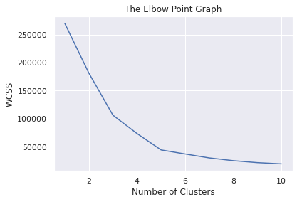
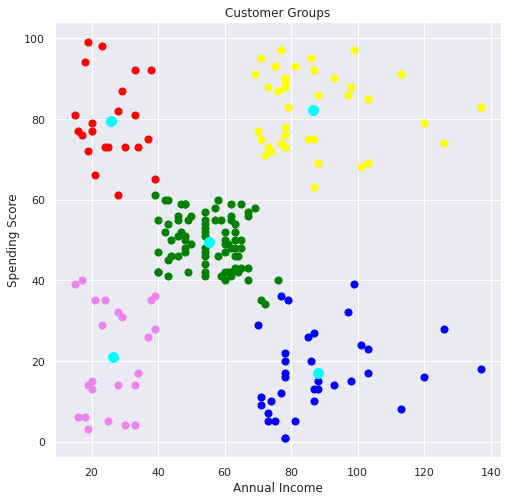

Importing the Dependencies

```python
import numpy as np
import pandas as pd
import matplotlib.pyplot as plt
import seaborn as sns
from sklearn.cluster import KMeans
```

Data Collection & Analysis

```python
# loading the data from csv file to a Pandas DataFrame
customer_data = pd.read_csv('/content/Mall_Customers.csv')
```

```python
# first 5 rows in the dataframe
customer_data.head()
```

```text
   CustomerID  Gender  Age  Annual Income (k$)  Spending Score (1-100)
0           1    Male   19                  15                      39
1           2    Male   21                  15                      81
2           3  Female   20                  16                       6
3           4  Female   23                  16                      77
4           5  Female   31                  17                      40```

```python
# finding the number of rows and columns
customer_data.shape
```

```text
(200, 5)```

```python
# getting some informations about the dataset
customer_data.info()
```

```text
<class 'pandas.core.frame.DataFrame'>
RangeIndex: 200 entries, 0 to 199
Data columns (total 5 columns):
 #   Column                  Non-Null Count  Dtype 
---  ------                  --------------  ----- 
 0   CustomerID              200 non-null    int64 
 1   Gender                  200 non-null    object
 2   Age                     200 non-null    int64 
 3   Annual Income (k$)      200 non-null    int64 
 4   Spending Score (1-100)  200 non-null    int64 
dtypes: int64(4), object(1)
memory usage: 7.9+ KB
```

```python
# checking for missing values
customer_data.isnull().sum()
```

```text
CustomerID                0
Gender                    0
Age                       0
Annual Income (k$)        0
Spending Score (1-100)    0
dtype: int64```

Choosing the Annual Income Column & Spending Score column

```python
X = customer_data.iloc[:,[3,4]].values
```

```python
print(X)
```

```text
[[ 15  39]
 [ 15  81]
 [ 16   6]
 [ 16  77]
 [ 17  40]
 [ 17  76]
 [ 18   6]
 [ 18  94]
 [ 19   3]
 [ 19  72]
 [ 19  14]
 [ 19  99]
 [ 20  15]
 [ 20  77]
 [ 20  13]
 [ 20  79]
 [ 21  35]
 [ 21  66]
 [ 23  29]
 [ 23  98]
 [ 24  35]
 [ 24  73]
 [ 25   5]
 [ 25  73]
 [ 28  14]
 [ 28  82]
 [ 28  32]
 [ 28  61]
 [ 29  31]
 [ 29  87]
 [ 30   4]
 [ 30  73]
 [ 33   4]
 [ 33  92]
 [ 33  14]
 [ 33  81]
 [ 34  17]
 [ 34  73]
 [ 37  26]
 [ 37  75]
 [ 38  35]
 [ 38  92]
 [ 39  36]
 [ 39  61]
 [ 39  28]
 [ 39  65]
 [ 40  55]
 [ 40  47]
 [ 40  42]
 [ 40  42]
 [ 42  52]
 [ 42  60]
 [ 43  54]
 [ 43  60]
 [ 43  45]
 [ 43  41]
 [ 44  50]
 [ 44  46]
 [ 46  51]
 [ 46  46]
 [ 46  56]
 [ 46  55]
 [ 47  52]
 [ 47  59]
 [ 48  51]
 [ 48  59]
 [ 48  50]
 [ 48  48]
 [ 48  59]
 [ 48  47]
 [ 49  55]
 [ 49  42]
 [ 50  49]
 [ 50  56]
 [ 54  47]
 [ 54  54]
 [ 54  53]
 [ 54  48]
 [ 54  52]
 [ 54  42]
 [ 54  51]
 [ 54  55]
 [ 54  41]
 [ 54  44]
 [ 54  57]
 [ 54  46]
 [ 57  58]
 [ 57  55]
 [ 58  60]
 [ 58  46]
 [ 59  55]
 [ 59  41]
 [ 60  49]
 [ 60  40]
 [ 60  42]
 [ 60  52]
 [ 60  47]
 [ 60  50]
 [ 61  42]
 [ 61  49]
 [ 62  41]
 [ 62  48]
 [ 62  59]
 [ 62  55]
 [ 62  56]
 [ 62  42]
 [ 63  50]
 [ 63  46]
 [ 63  43]
 [ 63  48]
 [ 63  52]
 [ 63  54]
 [ 64  42]
 [ 64  46]
 [ 65  48]
 [ 65  50]
 [ 65  43]
 [ 65  59]
 [ 67  43]
 [ 67  57]
 [ 67  56]
 [ 67  40]
 [ 69  58]
 [ 69  91]
 [ 70  29]
 [ 70  77]
 [ 71  35]
 [ 71  95]
 [ 71  11]
 [ 71  75]
 [ 71   9]
 [ 71  75]
 [ 72  34]
 [ 72  71]
 [ 73   5]
 [ 73  88]
 [ 73   7]
 [ 73  73]
 [ 74  10]
 [ 74  72]
 [ 75   5]
 [ 75  93]
 [ 76  40]
 [ 76  87]
 [ 77  12]
 [ 77  97]
 [ 77  36]
 [ 77  74]
 [ 78  22]
 [ 78  90]
 [ 78  17]
 [ 78  88]
 [ 78  20]
 [ 78  76]
 [ 78  16]
 [ 78  89]
 [ 78   1]
 [ 78  78]
 [ 78   1]
 [ 78  73]
 [ 79  35]
 [ 79  83]
 [ 81   5]
 [ 81  93]
 [ 85  26]
 [ 85  75]
 [ 86  20]
 [ 86  95]
 [ 87  27]
 [ 87  63]
 [ 87  13]
 [ 87  75]
 [ 87  10]
 [ 87  92]
 [ 88  13]
 [ 88  86]
 [ 88  15]
 [ 88  69]
 [ 93  14]
 [ 93  90]
 [ 97  32]
 [ 97  86]
 [ 98  15]
 [ 98  88]
 [ 99  39]
 [ 99  97]
 [101  24]
 [101  68]
 [103  17]
 [103  85]
 [103  23]
 [103  69]
 [113   8]
 [113  91]
 [120  16]
 [120  79]
 [126  28]
 [126  74]
 [137  18]
 [137  83]]
```

Choosing the number of clusters

WCSS  ->  Within Clusters Sum of Squares

```python
# finding wcss value for different number of clusters

wcss = []

for i in range(1,11):
  kmeans = KMeans(n_clusters=i, init='k-means++', random_state=42)
  kmeans.fit(X)

  wcss.append(kmeans.inertia_)
```

```python
# plot an elbow graph

sns.set()
plt.plot(range(1,11), wcss)
plt.title('The Elbow Point Graph')
plt.xlabel('Number of Clusters')
plt.ylabel('WCSS')
plt.show()
```



Optimum Number of Clusters = 5

Training the k-Means Clustering Model

```python
kmeans = KMeans(n_clusters=5, init='k-means++', random_state=0)

# return a label for each data point based on their cluster
Y = kmeans.fit_predict(X)

print(Y)
```

```text
[3 1 3 1 3 1 3 1 3 1 3 1 3 1 3 1 3 1 3 1 3 1 3 1 3 1 3 1 3 1 3 1 3 1 3 1 3
 1 3 1 3 1 3 0 3 1 0 0 0 0 0 0 0 0 0 0 0 0 0 0 0 0 0 0 0 0 0 0 0 0 0 0 0 0
 0 0 0 0 0 0 0 0 0 0 0 0 0 0 0 0 0 0 0 0 0 0 0 0 0 0 0 0 0 0 0 0 0 0 0 0 0
 0 0 0 0 0 0 0 0 0 0 0 0 2 4 2 0 2 4 2 4 2 0 2 4 2 4 2 4 2 4 2 0 2 4 2 4 2
 4 2 4 2 4 2 4 2 4 2 4 2 4 2 4 2 4 2 4 2 4 2 4 2 4 2 4 2 4 2 4 2 4 2 4 2 4
 2 4 2 4 2 4 2 4 2 4 2 4 2 4 2]
```

5 Clusters -  0, 1, 2, 3, 4

Visualizing all the Clusters

```python
# plotting all the clusters and their Centroids

plt.figure(figsize=(8,8))
plt.scatter(X[Y==0,0], X[Y==0,1], s=50, c='green', label='Cluster 1')
plt.scatter(X[Y==1,0], X[Y==1,1], s=50, c='red', label='Cluster 2')
plt.scatter(X[Y==2,0], X[Y==2,1], s=50, c='yellow', label='Cluster 3')
plt.scatter(X[Y==3,0], X[Y==3,1], s=50, c='violet', label='Cluster 4')
plt.scatter(X[Y==4,0], X[Y==4,1], s=50, c='blue', label='Cluster 5')

# plot the centroids
plt.scatter(kmeans.cluster_centers_[:,0], kmeans.cluster_centers_[:,1], s=100, c='cyan', label='Centroids')

plt.title('Customer Groups')
plt.xlabel('Annual Income')
plt.ylabel('Spending Score')
plt.show()
```



