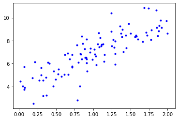
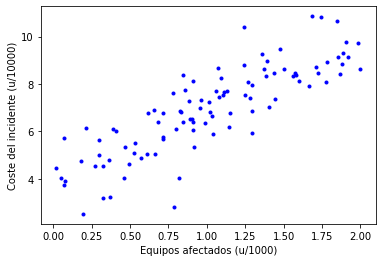
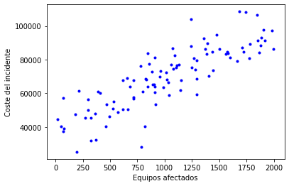
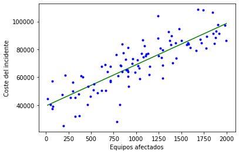

# Regresión Lineal: Coste de un incidente de seguridad

En este ejercicio se explican los fundamentos básicos de la regresión lineal aplicada a un caso de uso sencillo relacionado con la Ciberseguridad.

## Enunciado del ejercicio

El ejercicio consiste en predecir el coste de un incidente de seguridad en base al número de equipos que se han visto afectados. El conjunto de datos es generado de manera aleatoria.

### 1. Generación del conjunto de datos

```python
import numpy as np

X = 2 * np.random.rand(100, 1)
y = 4 + 3 * X + np.random.randn(100, 1)

print("La longitud del conjunto de datos es:", len(X))
```

```text
La longitud del conjunto de datos es: 100
```

### 2. Visualización del conjunto de datos

```python
import matplotlib.pyplot as plt
%matplotlib inline
```

```python
plt.plot(X, y, "b.")
plt.show()
```



```python
plt.plot(X, y, "b.")
plt.xlabel("Equipos afectados (u/1000)")
plt.ylabel("Coste del incidente (u/10000)")
plt.show()
```



### 3. Modificación del conjunto de datos

```python
import pandas as pd
```

```python
data = {'n_equipos_afectados': X.flatten(), 'coste': y.flatten()}
df = pd.DataFrame(data)
df.head(10)
```

```text
   n_equipos_afectados      coste
0             1.442465   7.382281
1             0.781135   7.633411
2             0.182799   4.748148
3             0.716641   5.780584
4             1.684457  10.860143
5             1.019292   6.798879
6             1.141977   6.176693
7             1.042593   5.879435
8             1.743933  10.819825
9             1.999811   8.614853```

```python
# Escalado del número de equipos afectados
df['n_equipos_afectados'] = df['n_equipos_afectados'] * 1000
df['n_equipos_afectados'] = df['n_equipos_afectados'].astype('int')
# Escalado del coste
df['coste'] = df['coste'] * 10000
df['coste'] = df['coste'].astype('int')
df.head(10)
```

```text
   n_equipos_afectados   coste
0                 1442   73822
1                  781   76334
2                  182   47481
3                  716   57805
4                 1684  108601
5                 1019   67988
6                 1141   61766
7                 1042   58794
8                 1743  108198
9                 1999   86148```

```python
# Representación gráfica del conjunto de datos
plt.plot(df['n_equipos_afectados'], df['coste'], "b.")
plt.xlabel("Equipos afectados")
plt.ylabel("Coste del incidente")
plt.show()
```



### 4. Construcción del modelo

```python
from sklearn.linear_model import LinearRegression
```

```python
# Construcción del modelo y ajuste de la función hipótesis
lin_reg = LinearRegression()
lin_reg.fit(df['n_equipos_afectados'].values.reshape(-1, 1), df['coste'].values)
```

```text
LinearRegression(copy_X=True, fit_intercept=True, n_jobs=None, normalize=False)```

```python
# Parámetro theta 0
lin_reg.intercept_
```

```text
39348.74902876436```

```python
# Parámetro theta 1
lin_reg.coef_
```

```text
array([29.62399252])```

```python
# Predicción para el valor mínimo y máximo del conjunto de datos de entrenamiento
X_min_max = np.array([[df["n_equipos_afectados"].min()], [df["n_equipos_afectados"].max()]])
y_train_pred = lin_reg.predict(X_min_max)
```

```python
# Representación gráfica de la función hipótesis generada
plt.plot(X_min_max, y_train_pred, "g-")
plt.plot(df['n_equipos_afectados'], df['coste'], "b.")
plt.xlabel("Equipos afectados")
plt.ylabel("Coste del incidente")
plt.show()
```



### 5. Predicción de nuevos ejemplos

```python
x_new = np.array([[1300]]) # 1300 equipos afectados

# Predicción del coste que tendría el incidente
coste = lin_reg.predict(x_new)

print("El coste del incidente sería:", int(coste[0]), "€")
```

```text
El coste del incidente sería: 77859 €
```

```python
plt.plot(df['n_equipos_afectados'], df['coste'], "b.")
plt.plot(X_min_max, y_train_pred, "g-")
plt.plot(x_new, coste, "rx")
plt.xlabel("Equipos afectados")
plt.ylabel("Coste del incidente")
plt.show()
```


```python

```

