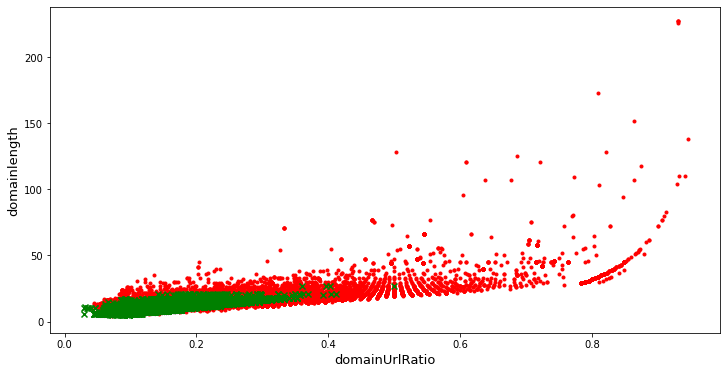
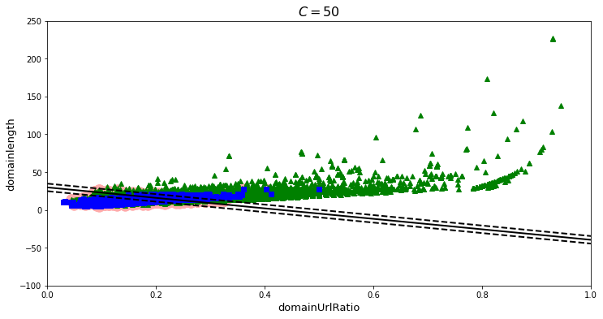
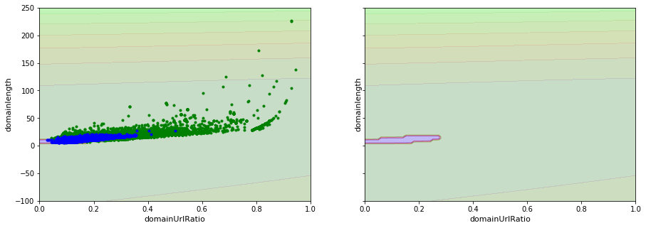
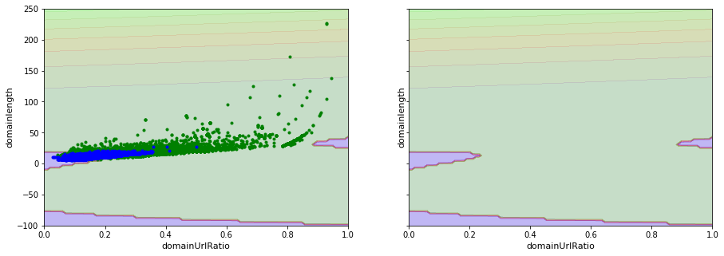
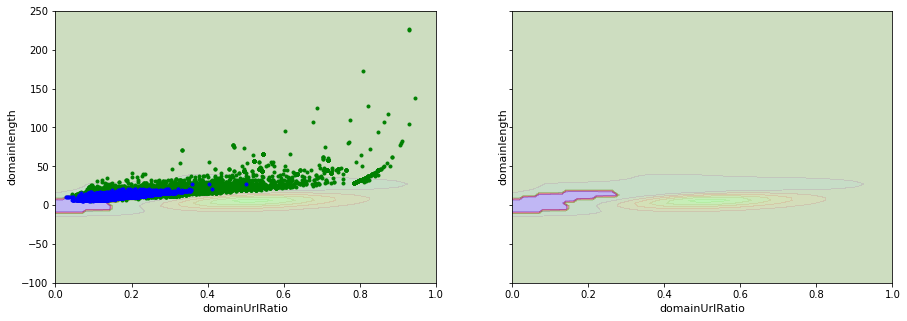

# Caso Práctico: _Support Vector Machine (SVM)_

## Conjunto de datos: Detección de URLs maliciosas

### Descripción
The Web has long become a major platform for online criminal activities. URLs are used as the main vehicle in this domain. To counter this issues security community focused its efforts on developing techniques for mostly blacklisting of malicious URLs.

While successful in protecting users from known malicious domains, this approach only solves part of the problem. The new malicious URLs that sprang up all over the web in masses commonly get a head start in this race. Besides that, Alexa ranked, trusted websites may convey compromised fraudulent URLs called defacement URL.

We study mainly five different types of URLs:

**Benign URLs**: Over 35,300 benign URLs were collected from Alexa top websites. The domains have been passed through a Heritrix web crawler to extract the URLs. Around half a million unique URLs are crawled initially and then passed to remove duplicate and domain only URLs. Later the extracted URLs have been checked through Virustotal to filter the benign URLs.

**Spam URLs**: Around 12,000 spam URLs were collected from the publicly available WEBSPAM-UK2007 dataset.

**Phishing URLs**: Around 10,000 phishing URLs were taken from OpenPhish which is a repository of active phishing sites.

**Malware URLs**: More than 11,500 URLs related to malware websites were obtained from DNS-BH which is a project that maintain list of malware sites.

**Defacement URLs**: More than 45,450 URLs belong to Defacement URL category. They are Alexa ranked trusted websites hosting fraudulent or hidden URL that contains both malicious web pages.

### Descarga de los ficheros de datos
https://www.unb.ca/cic/datasets/url-2016.html


## Imports

```python
%matplotlib inline
import matplotlib.pyplot as plt
import pandas as pd
from sklearn.model_selection import train_test_split
import numpy as np
from sklearn.metrics import f1_score
from sklearn.preprocessing import StandardScaler, RobustScaler
from sklearn.pipeline import Pipeline
```

## Funciones auxiliares

```python
# Construcción de una función que realice el particionado completo
def train_val_test_split(df, rstate=42, shuffle=True, stratify=None):
    strat = df[stratify] if stratify else None
    train_set, test_set = train_test_split(
        df, test_size=0.4, random_state=rstate, shuffle=shuffle, stratify=strat)
    strat = test_set[stratify] if stratify else None
    val_set, test_set = train_test_split(
        test_set, test_size=0.5, random_state=rstate, shuffle=shuffle, stratify=strat)
    return (train_set, val_set, test_set)
```

```python
# Representación gráfica del límite de decisión
def plot_svc_decision_boundary(svm_clf, xmin, xmax):
    w = svm_clf.coef_[0]
    b = svm_clf.intercept_[0]

    # At the decision boundary, w0*x0 + w1*x1 + b = 0
    # => x1 = -w0/w1 * x0 - b/w1
    x0 = np.linspace(xmin, xmax, 200)
    decision_boundary = -w[0]/w[1] * x0 - b/w[1]

    margin = 1/w[1]
    gutter_up = decision_boundary + margin
    gutter_down = decision_boundary - margin

    svs = svm_clf.support_vectors_
    plt.scatter(svs[:, 0], svs[:, 1], s=180, facecolors='#FFAAAA')
    plt.plot(x0, decision_boundary, "k-", linewidth=2)
    plt.plot(x0, gutter_up, "k--", linewidth=2)
    plt.plot(x0, gutter_down, "k--", linewidth=2)
```

## 1. Lectura del conjunto de datos

```python
df = pd.read_csv("datasets/FinalDataset/Phishing.csv")
```

## 2. Visualización preliminar de la información

```python
df.head(10)
```

```text
   Querylength  domain_token_count  path_token_count  avgdomaintokenlen  \
0            0                   2                12                5.5   
1            0                   3                12                5.0   
2            2                   2                11                4.0   
3            0                   2                 7                4.5   
4           19                   2                10                6.0   
5            0                   2                10                5.5   
6            0                   2                12                4.5   
7            0                   2                11                3.5   
8            0                   2                 9                2.5   
9            0                   2                13                4.5   

   longdomaintokenlen  avgpathtokenlen  tld  charcompvowels  charcompace  \
0                   8         4.083334    2              15            7   
1                  10         3.583333    3              12            8   
2                   5         4.750000    2              16           11   
3                   7         5.714286    2              15           10   
4                   9         2.250000    2               9            5   
5                   9         4.100000    2              15           11   
6                   6         5.333334    2              24            9   
7                   4         3.909091    2              15            6   
8                   3         4.555555    2               6            3   
9                   6         5.307692    2              16            9   

   ldl_url  ...  SymbolCount_FileName  SymbolCount_Extension  \
0        0  ...                    -1                     -1   
1        2  ...                     1                      0   
2        0  ...                     2                      0   
3        0  ...                     0                      0   
4        0  ...                     5                      4   
5        0  ...                    -1                     -1   
6        0  ...                     0                      0   
7        0  ...                     0                      0   
8        0  ...                     1                      0   
9        1  ...                    -1                     -1   

   SymbolCount_Afterpath  Entropy_URL  Entropy_Domain  Entropy_DirectoryName  \
0                     -1     0.676804        0.860529              -1.000000   
1                     -1     0.715629        0.776796               0.693127   
2                      1     0.677701        1.000000               0.677704   
3                     -1     0.696067        0.879588               0.818007   
4                      3     0.747202        0.833700               0.655459   
5                     -1     0.732981        0.860529              -1.000000   
6                     -1     0.692383        0.939794               0.910795   
7                     -1     0.707365        0.916667               0.916667   
8                     -1     0.742606        1.000000               0.785719   
9                     -1     0.734633        0.939794              -1.000000   

   Entropy_Filename  Entropy_Extension  Entropy_Afterpath  URL_Type_obf_Type  
0         -1.000000           -1.00000          -1.000000             benign  
1          0.738315            1.00000          -1.000000             benign  
2          0.916667            0.00000           0.898227             benign  
3          0.753585            0.00000          -1.000000             benign  
4          0.829535            0.83615           0.823008             benign  
5         -1.000000           -1.00000          -1.000000             benign  
6          0.673973            0.00000          -1.000000             benign  
7          0.690332            0.00000          -1.000000             benign  
8          0.808833            1.00000          -1.000000             benign  
9         -1.000000           -1.00000          -1.000000             benign  

[10 rows x 80 columns]```

```python
df.describe()
```

```text
        Querylength  domain_token_count  path_token_count  avgdomaintokenlen  \
count  15367.000000        15367.000000      15367.000000       15367.000000   
mean       3.446021            2.543698          8.477061           5.851956   
std       14.151453            0.944938          4.660250           2.064581   
min        0.000000            2.000000          0.000000           1.500000   
25%        0.000000            2.000000          5.000000           4.500000   
50%        0.000000            2.000000          8.000000           5.500000   
75%        0.000000            3.000000         11.000000           6.666666   
max      173.000000           19.000000         68.000000          29.500000   

       longdomaintokenlen  avgpathtokenlen           tld  charcompvowels  \
count        15367.000000     15096.000000  15367.000000    15367.000000   
mean            10.027461         5.289936      2.543698       12.659986   
std              5.281090         3.535097      0.944938        8.562206   
min              2.000000         0.000000      2.000000        0.000000   
25%              7.000000         3.800000      2.000000        6.000000   
50%              9.000000         4.500000      2.000000       11.000000   
75%             12.000000         5.571429      3.000000       17.000000   
max             63.000000       105.000000     19.000000       94.000000   

        charcompace       ldl_url  ...  SymbolCount_Directoryname  \
count  15367.000000  15367.000000  ...               15367.000000   
mean       8.398516      1.910913  ...                   2.120843   
std        6.329007      4.657731  ...                   2.777307   
min        0.000000      0.000000  ...                  -1.000000   
25%        4.000000      0.000000  ...                   1.000000   
50%        7.000000      0.000000  ...                   2.000000   
75%       11.000000      1.000000  ...                   3.000000   
max       62.000000     58.000000  ...                  24.000000   

       SymbolCount_FileName  SymbolCount_Extension  SymbolCount_Afterpath  \
count          15367.000000           15367.000000           15367.000000   
mean               1.124618               0.500813              -0.158782   
std                2.570246               2.261013               2.535939   
min               -1.000000              -1.000000              -1.000000   
25%                0.000000               0.000000              -1.000000   
50%                0.000000               0.000000              -1.000000   
75%                1.000000               0.000000              -1.000000   
max               31.000000              30.000000              29.000000   

        Entropy_URL  Entropy_Domain  Entropy_DirectoryName  Entropy_Filename  \
count  15367.000000    15367.000000           13541.000000      15177.000000   
mean       0.721684        0.854232               0.634859          0.682896   
std        0.049246        0.072641               0.510992          0.502288   
min        0.419560        0.561913              -1.000000         -1.000000   
25%        0.687215        0.798231               0.709532          0.707165   
50%        0.723217        0.859793               0.785949          0.814038   
75%        0.757949        0.916667               0.859582          0.916667   
max        0.869701        1.000000               0.962479          1.000000   

       Entropy_Extension  Entropy_Afterpath  
count       15364.000000       15364.000000  
mean            0.313617          -0.723793  
std             0.576910           0.649785  
min            -1.000000          -1.000000  
25%             0.000000          -1.000000  
50%             0.000000          -1.000000  
75%             1.000000          -1.000000  
max             1.000000           1.000000  

[8 rows x 79 columns]```

```python
df.info()
```

```text
<class 'pandas.core.frame.DataFrame'>
RangeIndex: 15367 entries, 0 to 15366
Data columns (total 80 columns):
 #   Column                           Non-Null Count  Dtype  
---  ------                           --------------  -----  
 0   Querylength                      15367 non-null  int64  
 1   domain_token_count               15367 non-null  int64  
 2   path_token_count                 15367 non-null  int64  
 3   avgdomaintokenlen                15367 non-null  float64
 4   longdomaintokenlen               15367 non-null  int64  
 5   avgpathtokenlen                  15096 non-null  float64
 6   tld                              15367 non-null  int64  
 7   charcompvowels                   15367 non-null  int64  
 8   charcompace                      15367 non-null  int64  
 9   ldl_url                          15367 non-null  int64  
 10  ldl_domain                       15367 non-null  int64  
 11  ldl_path                         15367 non-null  int64  
 12  ldl_filename                     15367 non-null  int64  
 13  ldl_getArg                       15367 non-null  int64  
 14  dld_url                          15367 non-null  int64  
 15  dld_domain                       15367 non-null  int64  
 16  dld_path                         15367 non-null  int64  
 17  dld_filename                     15367 non-null  int64  
 18  dld_getArg                       15367 non-null  int64  
 19  urlLen                           15367 non-null  int64  
 20  domainlength                     15367 non-null  int64  
 21  pathLength                       15367 non-null  int64  
 22  subDirLen                        15367 non-null  int64  
 23  fileNameLen                      15367 non-null  int64  
 24  this.fileExtLen                  15367 non-null  int64  
 25  ArgLen                           15367 non-null  int64  
 26  pathurlRatio                     15367 non-null  float64
 27  ArgUrlRatio                      15367 non-null  float64
 28  argDomanRatio                    15367 non-null  float64
 29  domainUrlRatio                   15367 non-null  float64
 30  pathDomainRatio                  15367 non-null  float64
 31  argPathRatio                     15367 non-null  float64
 32  executable                       15367 non-null  int64  
 33  isPortEighty                     15367 non-null  int64  
 34  NumberofDotsinURL                15367 non-null  int64  
 35  ISIpAddressInDomainName          15367 non-null  int64  
 36  CharacterContinuityRate          15367 non-null  float64
 37  LongestVariableValue             15367 non-null  int64  
 38  URL_DigitCount                   15367 non-null  int64  
 39  host_DigitCount                  15367 non-null  int64  
 40  Directory_DigitCount             15367 non-null  int64  
 41  File_name_DigitCount             15367 non-null  int64  
 42  Extension_DigitCount             15367 non-null  int64  
 43  Query_DigitCount                 15367 non-null  int64  
 44  URL_Letter_Count                 15367 non-null  int64  
 45  host_letter_count                15367 non-null  int64  
 46  Directory_LetterCount            15367 non-null  int64  
 47  Filename_LetterCount             15367 non-null  int64  
 48  Extension_LetterCount            15367 non-null  int64  
 49  Query_LetterCount                15367 non-null  int64  
 50  LongestPathTokenLength           15367 non-null  int64  
 51  Domain_LongestWordLength         15367 non-null  int64  
 52  Path_LongestWordLength           15367 non-null  int64  
 53  sub-Directory_LongestWordLength  15367 non-null  int64  
 54  Arguments_LongestWordLength      15367 non-null  int64  
 55  URL_sensitiveWord                15367 non-null  int64  
 56  URLQueries_variable              15367 non-null  int64  
 57  spcharUrl                        15367 non-null  int64  
 58  delimeter_Domain                 15367 non-null  int64  
 59  delimeter_path                   15367 non-null  int64  
 60  delimeter_Count                  15367 non-null  int64  
 61  NumberRate_URL                   15367 non-null  float64
 62  NumberRate_Domain                15367 non-null  float64
 63  NumberRate_DirectoryName         15358 non-null  float64
 64  NumberRate_FileName              15358 non-null  float64
 65  NumberRate_Extension             8012 non-null   float64
 66  NumberRate_AfterPath             15364 non-null  float64
 67  SymbolCount_URL                  15367 non-null  int64  
 68  SymbolCount_Domain               15367 non-null  int64  
 69  SymbolCount_Directoryname        15367 non-null  int64  
 70  SymbolCount_FileName             15367 non-null  int64  
 71  SymbolCount_Extension            15367 non-null  int64  
 72  SymbolCount_Afterpath            15367 non-null  int64  
 73  Entropy_URL                      15367 non-null  float64
 74  Entropy_Domain                   15367 non-null  float64
 75  Entropy_DirectoryName            13541 non-null  float64
 76  Entropy_Filename                 15177 non-null  float64
 77  Entropy_Extension                15364 non-null  float64
 78  Entropy_Afterpath                15364 non-null  float64
 79  URL_Type_obf_Type                15367 non-null  object 
dtypes: float64(21), int64(58), object(1)
memory usage: 9.4+ MB
```

```python
df["URL_Type_obf_Type"].value_counts()
```

```text
benign      7781
phishing    7586
Name: URL_Type_obf_Type, dtype: int64```

```python
# Comprobación de si existen valores nulos
is_null = df.isna().any()
is_null[is_null]
```

```text
avgpathtokenlen             True
NumberRate_DirectoryName    True
NumberRate_FileName         True
NumberRate_Extension        True
NumberRate_AfterPath        True
Entropy_DirectoryName       True
Entropy_Filename            True
Entropy_Extension           True
Entropy_Afterpath           True
dtype: bool```

```python
# Comprobación de la existencia de valores infinitos
is_inf = df.isin([np.inf, -np.inf]).any()
is_inf[is_inf]
```

```text
argPathRatio    True
dtype: bool```

```python
# Representación gráfica de dos características
plt.figure(figsize=(12, 6))
plt.scatter(df["domainUrlRatio"][df['URL_Type_obf_Type'] == "phishing"], df["domainlength"][df['URL_Type_obf_Type'] == "phishing"], c="r", marker=".")
plt.scatter(df["domainUrlRatio"][df['URL_Type_obf_Type'] == "benign"], df["domainlength"][df['URL_Type_obf_Type'] == "benign"], c="g", marker="x")
plt.xlabel("domainUrlRatio", fontsize=13)
plt.ylabel("domainlength", fontsize=13)
plt.show()
```



## 3. División del conjunto de datos

```python
# División del conjunto de datos
train_set, val_set, test_set = train_val_test_split(df)
```

```python
X_train = train_set.drop("URL_Type_obf_Type", axis=1)
y_train = train_set["URL_Type_obf_Type"].copy()

X_val = val_set.drop("URL_Type_obf_Type", axis=1)
y_val = val_set["URL_Type_obf_Type"].copy()

X_test = test_set.drop("URL_Type_obf_Type", axis=1)
y_test = test_set["URL_Type_obf_Type"].copy()
```

## 4. Preparación del conjunto de datos

```python
# Eliminamos el atributo que tiene valores infinitos
X_train = X_train.drop("argPathRatio", axis=1)
X_val = X_val.drop("argPathRatio", axis=1)
X_test = X_test.drop("argPathRatio", axis=1)
```

```python
# Rellenamos los valores nulos con la mediana
from sklearn.impute import SimpleImputer

imputer = SimpleImputer(strategy="median")
```

```python
# Rellenamos los valores nulos
X_train_prep = imputer.fit_transform(X_train)
X_val_prep = imputer.fit_transform(X_val)
X_test_prep = imputer.fit_transform(X_test)
```

```python
# Transformamos el resultado a un DataFrame de Pandas
X_train_prep = pd.DataFrame(X_train_prep, columns=X_train.columns, index=y_train.index)
X_val_prep = pd.DataFrame(X_val_prep, columns=X_val.columns, index=y_val.index)
X_test_prep = pd.DataFrame(X_test_prep, columns=X_test.columns, index=y_test.index)
```

```python
X_train_prep.head(10)
```

```text
       Querylength  domain_token_count  path_token_count  avgdomaintokenlen  \
2134           0.0                 2.0               6.0           2.000000   
9178           0.0                 4.0              18.0           3.250000   
13622          0.0                 3.0               3.0           6.666666   
15182          0.0                 3.0               5.0           3.333333   
8013          74.0                 2.0              13.0           9.500000   
12408          0.0                 3.0               4.0           8.333333   
509           20.0                 2.0              13.0           4.500000   
10714          0.0                 3.0               8.0           6.666666   
3986           0.0                 2.0               6.0           6.500000   
748            0.0                 2.0               8.0           4.000000   

       longdomaintokenlen  avgpathtokenlen  tld  charcompvowels  charcompace  \
2134                  2.0         8.666667  2.0            17.0         10.0   
9178                  5.0         1.000000  4.0            18.0         13.0   
13622                14.0         4.000000  3.0             1.0          1.0   
15182                 4.0         3.000000  3.0             5.0          2.0   
8013                 17.0         7.875000  2.0            21.0         29.0   
12408                19.0         3.750000  3.0             5.0          1.0   
509                   6.0         3.000000  2.0            24.0         17.0   
10714                14.0         4.250000  3.0            11.0          5.0   
3986                 10.0         4.500000  2.0             7.0          7.0   
748                   5.0         5.750000  2.0            14.0         14.0   

       ldl_url  ...  SymbolCount_Directoryname  SymbolCount_FileName  \
2134       0.0  ...                        2.0                   0.0   
9178       2.0  ...                       12.0                   3.0   
13622      1.0  ...                        1.0                   0.0   
15182      0.0  ...                        2.0                   1.0   
8013      26.0  ...                        4.0                   5.0   
12408      0.0  ...                        2.0                   0.0   
509        0.0  ...                        1.0                  14.0   
10714      0.0  ...                        4.0                   0.0   
3986       0.0  ...                        2.0                   0.0   
748        1.0  ...                        2.0                   0.0   

       SymbolCount_Extension  SymbolCount_Afterpath  Entropy_URL  \
2134                     0.0                   -1.0     0.681183   
9178                     0.0                    4.0     0.695232   
13622                    0.0                   -1.0     0.836006   
15182                    0.0                   -1.0     0.731804   
8013                     4.0                    3.0     0.653371   
12408                    0.0                   -1.0     0.726479   
509                     13.0                   12.0     0.678515   
10714                    0.0                   -1.0     0.745348   
3986                     0.0                   -1.0     0.760843   
748                      0.0                   -1.0     0.709062   

       Entropy_Domain  Entropy_DirectoryName  Entropy_Filename  \
2134         0.827729               0.702637          0.849605   
9178         0.820160               0.682849          0.875578   
13622        0.869991               0.879588          1.000000   
15182        0.796490               0.796658          1.000000   
8013         0.820569               0.758055          0.714969   
12408        0.789538               0.800705          1.000000   
509          0.796658               0.871049          0.695112   
10714        0.869991               0.788921          1.000000   
3986         0.798231               0.822491          0.796670   
748          0.929897               0.884735          0.674994   

       Entropy_Extension  Entropy_Afterpath  
2134            0.000000          -1.000000  
9178            0.000000           0.778747  
13622           0.000000          -1.000000  
15182           1.000000          -1.000000  
8013            0.712215           0.708031  
12408           0.000000          -1.000000  
509             0.701662           0.698106  
10714           0.000000          -1.000000  
3986            0.000000          -1.000000  
748             0.000000          -1.000000  

[10 rows x 78 columns]```

```python
# Comprobamos si hay valores nulos en el conjunto de datos de entrenamiento
is_null = X_train_prep.isna().any()
is_null[is_null]
```

```text
Series([], dtype: bool)```

## 5. SMV: Kernel lineal

### 5.1 Conjunto de datos reducido

**Entrenamiento del algoritmo con un conjunto de datos reducido**

```python
# Reducimos el conjunto de datos para representarlo gráficamente
X_train_reduced = X_train_prep[["domainUrlRatio", "domainlength"]].copy()
X_val_reduced = X_val_prep[["domainUrlRatio", "domainlength"]].copy()
```

```python
X_train_reduced
```

```text
       domainUrlRatio  domainlength
2134         0.072464           5.0
9178         0.166667          16.0
13622        0.511628          22.0
15182        0.315789          12.0
8013         0.107527          20.0
...               ...           ...
5191         0.116667          14.0
13418        0.477273          21.0
5390         0.157895           9.0
860          0.072917           7.0
7270         0.207547          11.0

[9220 rows x 2 columns]```

```python
from sklearn.svm import SVC

# SVM Large Margin Classification
svm_clf = SVC(kernel="linear", C=50)
svm_clf.fit(X_train_reduced, y_train)
```

```text
SVC(C=50, break_ties=False, cache_size=200, class_weight=None, coef0=0.0,
    decision_function_shape='ovr', degree=3, gamma='scale', kernel='linear',
    max_iter=-1, probability=False, random_state=None, shrinking=True,
    tol=0.001, verbose=False)```

**Representación del límite de decisión**

```python
def plot_svc_decision_boundary(svm_clf, xmin, xmax):
    w = svm_clf.coef_[0]
    b = svm_clf.intercept_[0]

    x0 = np.linspace(xmin, xmax, 200)
    decision_boundary = -w[0]/w[1] * x0 - b/w[1]

    margin = 1/w[1]
    gutter_up = decision_boundary + margin
    gutter_down = decision_boundary - margin

    svs = svm_clf.support_vectors_
    plt.scatter(svs[:, 0], svs[:, 1], s=180, facecolors='#FFAAAA')
    plt.plot(x0, decision_boundary, "k-", linewidth=2)
    plt.plot(x0, gutter_up, "k--", linewidth=2)
    plt.plot(x0, gutter_down, "k--", linewidth=2)
```

```python
plt.figure(figsize=(12, 6))
plt.plot(X_train_reduced.values[:, 0][y_train=="phishing"], X_train_reduced.values[:, 1][y_train=="phishing"], "g^")
plt.plot(X_train_reduced.values[:, 0][y_train=="benign"], X_train_reduced.values[:, 1][y_train=="benign"], "bs")
plot_svc_decision_boundary(svm_clf, 0, 1)
plt.title("$C = {}$".format(svm_clf.C), fontsize=16)
plt.axis([0, 1, -100, 250])
plt.xlabel("domainUrlRatio", fontsize=13)
plt.ylabel("domainlength", fontsize=13)
plt.show()
```



**Predicción con un conjunto de datos reducido**

```python
y_pred = svm_clf.predict(X_val_reduced)
```

```python
print("F1 Score:", f1_score(y_pred, y_val, pos_label='phishing'))
```

```text
F1 Score: 0.8142614601018675
```

Como se verá más adelante, para determinados kernels es muy importante escalar el conjunto de datos. En ese caso, para el kernel lineal, no es tan relevante, aunque es posible que proporciones mejores resultados.

```python
svm_clf_sc = Pipeline([
        ("scaler", RobustScaler()),
        ("linear_svc", SVC(kernel="linear", C=50)),
    ])

svm_clf_sc.fit(X_train_reduced, y_train)
```

```text
Pipeline(memory=None,
         steps=[('scaler',
                 RobustScaler(copy=True, quantile_range=(25.0, 75.0),
                              with_centering=True, with_scaling=True)),
                ('linear_svc',
                 SVC(C=50, break_ties=False, cache_size=200, class_weight=None,
                     coef0=0.0, decision_function_shape='ovr', degree=3,
                     gamma='scale', kernel='linear', max_iter=-1,
                     probability=False, random_state=None, shrinking=True,
                     tol=0.001, verbose=False))],
         verbose=False)```

```python
y_pred = svm_clf_sc.predict(X_val_reduced)
```

```python
print("F1 Score:", f1_score(y_pred, y_val, pos_label='phishing'))
```

```text
F1 Score: 0.8141592920353983
```

### 5.2 Conjunto de datos completo

```python
# Entrenamiento con todo el conjunto de datos
from sklearn.svm import SVC

svm_clf = SVC(kernel="linear", C=1)
svm_clf.fit(X_train_prep, y_train)
```

```text
SVC(C=1, break_ties=False, cache_size=200, class_weight=None, coef0=0.0,
    decision_function_shape='ovr', degree=3, gamma='scale', kernel='linear',
    max_iter=-1, probability=False, random_state=None, shrinking=True,
    tol=0.001, verbose=False)```

```python
y_pred = svm_clf.predict(X_val_prep)
```

```python
print("F1 Score:", f1_score(y_pred, y_val, pos_label='phishing'))
```

```text
F1 Score: 0.9611330698287219
```

## 6. SMV: Kernel no lineal

### 6.1. Polynomial Kernel (I)

**Entrenamiento del algoritmo con un conjunto de datos reducido**

```python
# Para representar el límite de decisión tenemos que pasar la variable objetivo a numérica
y_train_num = y_train.factorize()[0]
y_val_num = y_val.factorize()[0]
```

```python
from sklearn.datasets import make_moons
from sklearn.svm import LinearSVC
from sklearn.preprocessing import PolynomialFeatures

polynomial_svm_clf = Pipeline([
        ("poly_features", PolynomialFeatures(degree=3)),
        ("scaler", StandardScaler()),
        ("svm_clf", LinearSVC(C=20, loss="hinge", random_state=42, max_iter=100000))
    ])

polynomial_svm_clf.fit(X_train_reduced, y_train_num)
```

```text
Pipeline(memory=None,
         steps=[('poly_features',
                 PolynomialFeatures(degree=3, include_bias=True,
                                    interaction_only=False, order='C')),
                ('scaler',
                 StandardScaler(copy=True, with_mean=True, with_std=True)),
                ('svm_clf',
                 LinearSVC(C=20, class_weight=None, dual=True,
                           fit_intercept=True, intercept_scaling=1,
                           loss='hinge', max_iter=100000, multi_class='ovr',
                           penalty='l2', random_state=42, tol=0.0001,
                           verbose=0))],
         verbose=False)```

**Representación del límite de decisión**

```python
def plot_dataset(X, y):
    plt.plot(X[:, 0][y==1], X[:, 1][y==1], "g.")
    plt.plot(X[:, 0][y==0], X[:, 1][y==0], "b.")
```

```python
def plot_predictions(clf, axes):
    x0s = np.linspace(axes[0], axes[1], 100)
    x1s = np.linspace(axes[2], axes[3], 100)
    x0, x1 = np.meshgrid(x0s, x1s)
    X = np.c_[x0.ravel(), x1.ravel()]
    y_pred = clf.predict(X).reshape(x0.shape)
    y_decision = clf.decision_function(X).reshape(x0.shape)
    plt.contourf(x0, x1, y_pred, cmap=plt.cm.brg, alpha=0.2)
    plt.contourf(x0, x1, y_decision, cmap=plt.cm.brg, alpha=0.1)

fig, axes = plt.subplots(ncols=2, figsize=(15,5), sharey=True)
plt.sca(axes[0])
plot_dataset(X_train_reduced.values, y_train_num)
plot_predictions(polynomial_svm_clf, [0, 1, -100, 250])
plt.xlabel("domainUrlRatio", fontsize=11)
plt.ylabel("domainlength", fontsize=11)
plt.sca(axes[1])
plot_predictions(polynomial_svm_clf, [0, 1, -100, 250])
plt.xlabel("domainUrlRatio", fontsize=11)
plt.ylabel("domainlength", fontsize=11)
plt.show()
```



**Predicción con el conjunto de datos reducido**

```python
y_pred = polynomial_svm_clf.predict(X_val_reduced)
```

```python
print("F1 Score:", f1_score(y_pred, y_val_num))
```

```text
F1 Score: 0.8574514038876889
```

### 6.2. Polynomial Kernel (II)

Existe una forma más sencilla de entrenar un algoritmo SVM que utilize polynomial kernel utilizando el parámetro **kernel** de la propia función implementada en sklearn

**Entrenamiento del algoritmo con un conjunto de datos reducido**

```python
svm_clf = SVC(kernel="poly", degree=3, coef0=10, C=20)
svm_clf.fit(X_train_reduced, y_train_num)
```

```text
SVC(C=20, break_ties=False, cache_size=200, class_weight=None, coef0=10,
    decision_function_shape='ovr', degree=3, gamma='scale', kernel='poly',
    max_iter=-1, probability=False, random_state=None, shrinking=True,
    tol=0.001, verbose=False)```

**Representación del límite de decisión**

```python
fig, axes = plt.subplots(ncols=2, figsize=(15,5), sharey=True)
plt.sca(axes[0])
plot_dataset(X_train_reduced.values, y_train_num)
plot_predictions(svm_clf, [0, 1, -100, 250])
plt.xlabel("domainUrlRatio", fontsize=11)
plt.ylabel("domainlength", fontsize=11)
plt.sca(axes[1])
plot_predictions(svm_clf, [0, 1, -100, 250])
plt.xlabel("domainUrlRatio", fontsize=11)
plt.ylabel("domainlength", fontsize=11)
plt.show()
```



**Predicción con un conjunto de datos reducido**

```python
y_pred = svm_clf.predict(X_val_reduced)
```

```python
print("F1 Score:", f1_score(y_pred, y_val_num))
```

```text
F1 Score: 0.8249238062986793
```

**Predicción con el conjunto de datos completo**

```python
svm_clf = SVC(kernel="poly", degree=3, coef0=10, C=40)
svm_clf.fit(X_train_prep, y_train_num)
```

```text
SVC(C=40, break_ties=False, cache_size=200, class_weight=None, coef0=10,
    decision_function_shape='ovr', degree=3, gamma='scale', kernel='poly',
    max_iter=-1, probability=False, random_state=None, shrinking=True,
    tol=0.001, verbose=False)```

```python
y_pred = svm_clf.predict(X_val_prep)
```

```python
print("F1 Score:", f1_score(y_pred, y_val_num))
```

```text
F1 Score: 0.9715984147952443
```

### 6.2. Gaussian Kernel

**Entrenamiento del algoritmo con un conjunto de datos reducido**

```python
rbf_kernel_svm_clf = Pipeline([
            ("scaler", RobustScaler()),
            ("svm_clf", SVC(kernel="rbf", gamma=0.5, C=1000))
        ])

rbf_kernel_svm_clf.fit(X_train_reduced, y_train_num)
```

```text
Pipeline(memory=None,
         steps=[('scaler',
                 RobustScaler(copy=True, quantile_range=(25.0, 75.0),
                              with_centering=True, with_scaling=True)),
                ('svm_clf',
                 SVC(C=1000, break_ties=False, cache_size=200,
                     class_weight=None, coef0=0.0,
                     decision_function_shape='ovr', degree=3, gamma=0.5,
                     kernel='rbf', max_iter=-1, probability=False,
                     random_state=None, shrinking=True, tol=0.001,
                     verbose=False))],
         verbose=False)```

**Representación del límite de decisión**

```python
fig, axes = plt.subplots(ncols=2, figsize=(15,5), sharey=True)
plt.sca(axes[0])
plot_dataset(X_train_reduced.values, y_train_num)
plot_predictions(rbf_kernel_svm_clf, [0, 1, -100, 250])
plt.xlabel("domainUrlRatio", fontsize=11)
plt.ylabel("domainlength", fontsize=11)
plt.sca(axes[1])
plot_predictions(rbf_kernel_svm_clf, [0, 1, -100, 250])
plt.xlabel("domainUrlRatio", fontsize=11)
plt.ylabel("domainlength", fontsize=11)
plt.show()
```



**Predicción con un conjunto de datos reducido**

```python
y_pred = rbf_kernel_svm_clf.predict(X_val_reduced)
```

```python
print("F1 Score:", f1_score(y_pred, y_val_num))
```

```text
F1 Score: 0.8617363344051447
```

**Predicción con un conjunto de datos completo**

```python
rbf_kernel_svm_clf = Pipeline([
            ("scaler", RobustScaler()),
            ("svm_clf", SVC(kernel="rbf", gamma=0.05, C=1000))
        ])

rbf_kernel_svm_clf.fit(X_train_prep, y_train_num)
```

```text
Pipeline(memory=None,
         steps=[('scaler',
                 RobustScaler(copy=True, quantile_range=(25.0, 75.0),
                              with_centering=True, with_scaling=True)),
                ('svm_clf',
                 SVC(C=1000, break_ties=False, cache_size=200,
                     class_weight=None, coef0=0.0,
                     decision_function_shape='ovr', degree=3, gamma=0.05,
                     kernel='rbf', max_iter=-1, probability=False,
                     random_state=None, shrinking=True, tol=0.001,
                     verbose=False))],
         verbose=False)```

```python
y_pred = rbf_kernel_svm_clf.predict(X_val_prep)
```

```python
print("F1 Score:", f1_score(y_pred, y_val_num))
```

```text
F1 Score: 0.9640522875816993
```

```python

```

