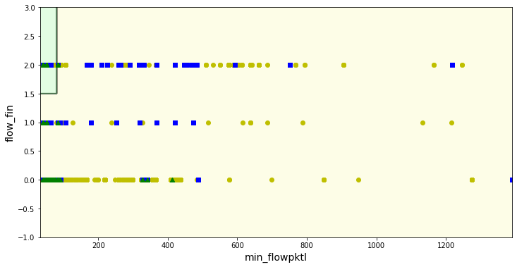

# Caso práctico: Árboles de decisión

En este caso de uso práctico se pretende resolver un problema de detección de malware en dispositivos Android mediante el análisis del tráfico de red que genera el dispositivo mediante el uso de árboles de decisión.

## Conjunto de datos: Detección de malware en Android

### Descripción
The sophisticated and advanced Android malware is able to identify the presence of the emulator used by the malware analyst and in response, alter its behavior to evade detection. To overcome this issue, we installed the Android applications on the real device and captured its network traffic. See our publicly available Android Sandbox.

CICAAGM dataset is captured by installing the Android apps on the real smartphones semi-automated. The dataset is generated from 1900 applications with the following three categories:

**1. Adware (250 apps)**
* Airpush: Designed to deliver unsolicited advertisements to the user’s systems for information stealing.
* Dowgin: Designed as an advertisement library that can also steal the user’s information.
* Kemoge: Designed to take over a user’s Android device. This adware is a hybrid of botnet and disguises itself as popular apps via repackaging.
* Mobidash: Designed to display ads and to compromise user’s personal information.
* Shuanet: Similar to Kemoge, Shuanet also is designed to take over a user’s device.

**2. General Malware (150 apps)**
* AVpass: Designed to be distributed in the guise of a Clock app.
* FakeAV: Designed as a scam that tricks user to purchase a full version of the software in order to re-mediate non-existing infections.
* FakeFlash/FakePlayer: Designed as a fake Flash app in order to direct users to a website (after successfully installed).
* GGtracker: Designed for SMS fraud (sends SMS messages to a premium-rate number) and information stealing.
* Penetho: Designed as a fake service (hacktool for Android devices that can be used to crack the WiFi password). The malware is also able to infect the user’s computer via infected email attachment, fake updates, external media and infected documents.

**3. Benign (1500 apps)**
* 2015 GooglePlay market (top free popular and top free new)
* 2016 GooglePlay market (top free popular and top free new)

### Ficheros de datos
* pcap files – the network traffic of both the malware and benign (20% malware and 80% benign)
* <span style="color:green">.csv files - the list of extracted network traffic features generated by the CIC-flowmeter</span>

### Descarga de los ficheros de datos
https://www.unb.ca/cic/datasets/android-adware.html

## Imports

```python
import pandas as pd
import numpy as np
from sklearn.model_selection import train_test_split
from sklearn.preprocessing import RobustScaler
from sklearn.metrics import confusion_matrix, recall_score, f1_score, precision_score
from pandas import DataFrame
```

## Funciones auxiliares

```python
# Construcción de una función que realice el particionado completo
def train_val_test_split(df, rstate=42, shuffle=True, stratify=None):
    strat = df[stratify] if stratify else None
    train_set, test_set = train_test_split(
        df, test_size=0.4, random_state=rstate, shuffle=shuffle, stratify=strat)
    strat = test_set[stratify] if stratify else None
    val_set, test_set = train_test_split(
        test_set, test_size=0.5, random_state=rstate, shuffle=shuffle, stratify=strat)
    return (train_set, val_set, test_set)
```

```python
def remove_labels(df, label_name):
    X = df.drop(label_name, axis=1)
    y = df[label_name].copy()
    return (X, y)
```

```python
def evaluate_result(y_pred, y, y_prep_pred, y_prep, metric):
    print(metric.__name__, "WITHOUT preparation:", metric(y_pred, y, average='weighted'))
    print(metric.__name__, "WITH preparation:", metric(y_prep_pred, y_prep, average='weighted'))
```

## 1. Lectura del conjunto de datos

```python
df = pd.read_csv('datasets/TotalFeatures-ISCXFlowMeter.csv')
```

## 2. Visualización del conjunto de datos

```python
df.head(10)
```

```text
   duration  total_fpackets  total_bpackets  total_fpktl  total_bpktl  \
0   1020586             668            1641        35692      2276876   
1     80794               1               1           75          124   
2       998               3               0          187            0   
3    189868               9               9         1448         6200   
4    110577               4               6          528         1422   
5    261876               7               6         1618          882   
6        14               2               0          104            0   
7     29675               1               1           71          213   
8    806635               4               0          239            0   
9     56620               3               2         1074          719   

   min_fpktl  min_bpktl  max_fpktl  max_bpktl  mean_fpktl  ...  mean_idle  \
0         52         52        679       1390   53.431138  ...        0.0   
1         75        124         75        124   75.000000  ...        0.0   
2         52         -1         83         -1   62.333333  ...        0.0   
3         52         52        706       1390  160.888889  ...        0.0   
4         52         52        331       1005  132.000000  ...        0.0   
5         52         52        730        477  231.142857  ...        0.0   
6         52         -1         52         -1   52.000000  ...        0.0   
7         71        213         71        213   71.000000  ...        0.0   
8         52         -1         83         -1   59.750000  ...        0.0   
9         52         52        592        667  358.000000  ...        0.0   

   max_idle  std_idle  FFNEPD  Init_Win_bytes_forward  \
0        -1       0.0       2                 4194240   
1        -1       0.0       2                       0   
2        -1       0.0       4                  101888   
3        -1       0.0       2                 4194240   
4        -1       0.0       2                  155136   
5        -1       0.0       2                 4194240   
6        -1       0.0       3                    5824   
7        -1       0.0       2                       0   
8        -1       0.0       5                  107008   
9        -1       0.0       3                  128512   

   Init_Win_bytes_backward  RRT_samples_clnt  Act_data_pkt_forward  \
0                  1853440              1640                   668   
1                        0                 0                     1   
2                       -1                 0                     3   
3                  2722560                 8                     9   
4                    31232                 5                     4   
5                   926720                 3                     7   
6                       -1                 0                     2   
7                        0                 0                     1   
8                       -1                 0                     4   
9                    10816                 1                     3   

   min_seg_size_forward   calss  
0                    32  benign  
1                     0  benign  
2                    32  benign  
3                    32  benign  
4                    32  benign  
5                    32  benign  
6                    32  benign  
7                     0  benign  
8                    32  benign  
9                    32  benign  

[10 rows x 80 columns]```

```python
df.info()
```

```text
<class 'pandas.core.frame.DataFrame'>
RangeIndex: 631955 entries, 0 to 631954
Data columns (total 80 columns):
 #   Column                   Non-Null Count   Dtype  
---  ------                   --------------   -----  
 0   duration                 631955 non-null  int64  
 1   total_fpackets           631955 non-null  int64  
 2   total_bpackets           631955 non-null  int64  
 3   total_fpktl              631955 non-null  int64  
 4   total_bpktl              631955 non-null  int64  
 5   min_fpktl                631955 non-null  int64  
 6   min_bpktl                631955 non-null  int64  
 7   max_fpktl                631955 non-null  int64  
 8   max_bpktl                631955 non-null  int64  
 9   mean_fpktl               631955 non-null  float64
 10  mean_bpktl               631955 non-null  float64
 11  std_fpktl                631955 non-null  float64
 12  std_bpktl                631955 non-null  float64
 13  total_fiat               631955 non-null  int64  
 14  total_biat               631955 non-null  int64  
 15  min_fiat                 631955 non-null  int64  
 16  min_biat                 631955 non-null  int64  
 17  max_fiat                 631955 non-null  int64  
 18  max_biat                 631955 non-null  int64  
 19  mean_fiat                631955 non-null  float64
 20  mean_biat                631955 non-null  float64
 21  std_fiat                 631955 non-null  float64
 22  std_biat                 631955 non-null  float64
 23  fpsh_cnt                 631955 non-null  int64  
 24  bpsh_cnt                 631955 non-null  int64  
 25  furg_cnt                 631955 non-null  int64  
 26  burg_cnt                 631955 non-null  int64  
 27  total_fhlen              631955 non-null  int64  
 28  total_bhlen              631955 non-null  int64  
 29  fPktsPerSecond           631955 non-null  float64
 30  bPktsPerSecond           631955 non-null  float64
 31  flowPktsPerSecond        631955 non-null  float64
 32  flowBytesPerSecond       631955 non-null  float64
 33  min_flowpktl             631955 non-null  int64  
 34  max_flowpktl             631955 non-null  int64  
 35  mean_flowpktl            631955 non-null  float64
 36  std_flowpktl             631955 non-null  float64
 37  min_flowiat              631955 non-null  int64  
 38  max_flowiat              631955 non-null  int64  
 39  mean_flowiat             631955 non-null  float64
 40  std_flowiat              631955 non-null  float64
 41  flow_fin                 631955 non-null  int64  
 42  flow_syn                 631955 non-null  int64  
 43  flow_rst                 631955 non-null  int64  
 44  flow_psh                 631955 non-null  int64  
 45  flow_ack                 631955 non-null  int64  
 46  flow_urg                 631955 non-null  int64  
 47  flow_cwr                 631955 non-null  int64  
 48  flow_ece                 631955 non-null  int64  
 49  downUpRatio              631955 non-null  float64
 50  avgPacketSize            631955 non-null  float64
 51  fAvgSegmentSize          631955 non-null  float64
 52  fHeaderBytes             631955 non-null  int64  
 53  fAvgBytesPerBulk         631955 non-null  int64  
 54  fAvgPacketsPerBulk       631955 non-null  int64  
 55  fAvgBulkRate             631955 non-null  int64  
 56  bVarianceDataBytes       631955 non-null  float64
 57  bAvgSegmentSize          631955 non-null  int64  
 58  bAvgBytesPerBulk         631955 non-null  int64  
 59  bAvgPacketsPerBulk       631955 non-null  int64  
 60  bAvgBulkRate             631955 non-null  int64  
 61  sflow_fpacket            631955 non-null  int64  
 62  sflow_fbytes             631955 non-null  int64  
 63  sflow_bpacket            631955 non-null  int64  
 64  sflow_bbytes             631955 non-null  int64  
 65  min_active               631955 non-null  int64  
 66  mean_active              631955 non-null  float64
 67  max_active               631955 non-null  int64  
 68  std_active               631955 non-null  float64
 69  min_idle                 631955 non-null  int64  
 70  mean_idle                631955 non-null  float64
 71  max_idle                 631955 non-null  int64  
 72  std_idle                 631955 non-null  float64
 73  FFNEPD                   631955 non-null  int64  
 74  Init_Win_bytes_forward   631955 non-null  int64  
 75  Init_Win_bytes_backward  631955 non-null  int64  
 76  RRT_samples_clnt         631955 non-null  int64  
 77  Act_data_pkt_forward     631955 non-null  int64  
 78  min_seg_size_forward     631955 non-null  int64  
 79  calss                    631955 non-null  object 
dtypes: float64(24), int64(55), object(1)
memory usage: 385.7+ MB
```

```python
df['calss'].value_counts()
```

```text
benign            471597
asware            155613
GeneralMalware      4745
Name: calss, dtype: int64```

### Buscando correlaciones

```python
# Copiamos el conjunto de datos y transformamos la variable de salida a numérica para calcular correlaciones
X = df.copy()
X['calss'] = X['calss'].factorize()[0]
```

```python
# Calculamos correlaciones
corr_matrix = X.corr()
corr_matrix["calss"].sort_values(ascending=False)
```

```text
calss                     1.000000
flow_fin                  0.286175
min_seg_size_forward      0.258352
Init_Win_bytes_forward    0.129425
std_fpktl                 0.123758
                            ...   
furg_cnt                       NaN
burg_cnt                       NaN
flow_urg                       NaN
flow_cwr                       NaN
flow_ece                       NaN
Name: calss, Length: 80, dtype: float64```

```python
X.corr()
```

```text
                         duration  total_fpackets  total_bpackets  \
duration                 1.000000        0.004837        0.004011   
total_fpackets           0.004837        1.000000        0.924622   
total_bpackets           0.004011        0.924622        1.000000   
total_fpktl              0.001673        0.425756        0.156780   
total_bpktl              0.003518        0.904007        0.997268   
...                           ...             ...             ...   
Init_Win_bytes_backward  0.029712        0.059224        0.058435   
RRT_samples_clnt         0.003785        0.902713        0.997580   
Act_data_pkt_forward     0.004838        0.999866        0.924746   
min_seg_size_forward     0.082955        0.018198        0.015124   
calss                    0.067066        0.018377        0.019430   

                         total_fpktl  total_bpktl  min_fpktl  min_bpktl  \
duration                    0.001673     0.003518  -0.064100  -0.027231   
total_fpackets              0.425756     0.904007  -0.018958   0.005252   
total_bpackets              0.156780     0.997268  -0.017667   0.006912   
total_fpktl                 1.000000     0.090082  -0.003099   0.000803   
total_bpktl                 0.090082     1.000000  -0.014926   0.005966   
...                              ...          ...        ...        ...   
Init_Win_bytes_backward     0.015991     0.053134  -0.268444   0.038319   
RRT_samples_clnt            0.088422     0.999616  -0.016659   0.006156   
Act_data_pkt_forward        0.425789     0.904129  -0.018947   0.005264   
min_seg_size_forward        0.005477     0.012139  -0.686154  -0.189824   
calss                       0.000679     0.019838  -0.271343   0.027032   

                         max_fpktl  max_bpktl  mean_fpktl  ...  mean_idle  \
duration                  0.008761   0.042925   -0.043746  ...   0.998901   
total_fpackets            0.024685   0.086255   -0.007910  ...   0.001614   
total_bpackets            0.018170   0.086886   -0.016104  ...   0.000922   
total_fpktl               0.021278   0.022088    0.022409  ...   0.000335   
total_bpktl               0.012560   0.079905   -0.017328  ...   0.000812   
...                            ...        ...         ...  ...        ...   
Init_Win_bytes_backward   0.429893   0.593143   -0.030004  ...   0.026959   
RRT_samples_clnt          0.015727   0.084280   -0.017595  ...   0.000893   
Act_data_pkt_forward      0.024705   0.086278   -0.007893  ...   0.001617   
min_seg_size_forward     -0.074763   0.217989   -0.524024  ...   0.077943   
calss                    -0.040019   0.073212   -0.211892  ...   0.066348   

                         max_idle  std_idle    FFNEPD  Init_Win_bytes_forward  \
duration                 0.999458  0.047582  0.016532                0.027610   
total_fpackets           0.002267  0.017229  0.016089                0.050201   
total_bpackets           0.001617  0.016230 -0.000493                0.048190   
total_fpktl              0.000609  0.009896  0.001657                0.013283   
total_bpktl              0.001452  0.014336 -0.000293                0.043571   
...                           ...       ...       ...                     ...   
Init_Win_bytes_backward  0.029512  0.097316 -0.052507                0.811204   
RRT_samples_clnt         0.001560  0.015200 -0.000437                0.046784   
Act_data_pkt_forward     0.002269  0.017233  0.000734                0.050220   
min_seg_size_forward     0.079324  0.048803  0.052177                0.394743   
calss                    0.066965  0.022790  0.018300                0.129425   

                         Init_Win_bytes_backward  RRT_samples_clnt  \
duration                                0.029712          0.003785   
total_fpackets                          0.059224          0.902713   
total_bpackets                          0.058435          0.997580   
total_fpktl                             0.015991          0.088422   
total_bpktl                             0.053134          0.999616   
...                                          ...               ...   
Init_Win_bytes_backward                 1.000000          0.056761   
RRT_samples_clnt                        0.056761          1.000000   
Act_data_pkt_forward                    0.059242          0.902834   
min_seg_size_forward                    0.333701          0.014299   
calss                                   0.069405          0.019679   

                         Act_data_pkt_forward  min_seg_size_forward     calss  
duration                             0.004838              0.082955  0.067066  
total_fpackets                       0.999866              0.018198  0.018377  
total_bpackets                       0.924746              0.015124  0.019430  
total_fpktl                          0.425789              0.005477  0.000679  
total_bpktl                          0.904129              0.012139  0.019838  
...                                       ...                   ...       ...  
Init_Win_bytes_backward              0.059242              0.333701  0.069405  
RRT_samples_clnt                     0.902834              0.014299  0.019679  
Act_data_pkt_forward                 1.000000              0.018229  0.018391  
min_seg_size_forward                 0.018229              1.000000  0.258352  
calss                                0.018391              0.258352  1.000000  

[80 rows x 80 columns]```

```python
# Se puede llegar a valorar quedarnos con aquellas que tienen mayor correlación
corr_matrix[corr_matrix["calss"] > 0.05]
```

```text
                         duration  total_fpackets  total_bpackets  \
duration                 1.000000        0.004837        0.004011   
max_bpktl                0.042925        0.086255        0.086886   
mean_bpktl               0.025117        0.139142        0.151761   
std_fpktl                0.039350        0.010172        0.002331   
std_bpktl                0.048743        0.020324        0.014005   
total_fiat               0.943898        0.002190        0.001718   
min_fiat                 0.841692       -0.001975       -0.002172   
max_fiat                 0.943438       -0.000420       -0.000714   
mean_fiat                0.918036       -0.001970       -0.002241   
std_flowpktl             0.036942        0.087741        0.087307   
min_flowiat              0.841666       -0.001972       -0.002169   
max_flowiat              0.999457        0.002273        0.001623   
mean_flowiat             0.949299       -0.002050       -0.002292   
flow_fin                 0.068154        0.005461        0.004894   
flow_syn                 0.020298        0.045730        0.043305   
flow_rst                -0.003951       -0.004097       -0.004343   
bVarianceDataBytes       0.042755        0.012731        0.006942   
bAvgSegmentSize          0.025105        0.139151        0.151778   
min_active               0.997972        0.002195        0.001495   
mean_active              0.998911        0.002580        0.001852   
max_active               0.999465        0.003261        0.002592   
min_idle                 0.997952        0.001258        0.000610   
mean_idle                0.998901        0.001614        0.000922   
max_idle                 0.999458        0.002267        0.001617   
Init_Win_bytes_forward   0.027610        0.050201        0.048190   
Init_Win_bytes_backward  0.029712        0.059224        0.058435   
min_seg_size_forward     0.082955        0.018198        0.015124   
calss                    0.067066        0.018377        0.019430   

                         total_fpktl  total_bpktl  min_fpktl  min_bpktl  \
duration                    0.001673     0.003518  -0.064100  -0.027231   
max_bpktl                   0.022088     0.079905  -0.277317   0.275923   
mean_bpktl                  0.018954     0.146437  -0.280648   0.465208   
std_fpktl                   0.011416    -0.003162  -0.245792   0.052877   
std_bpktl                   0.007763     0.007768  -0.225143   0.035371   
total_fiat                  0.000708     0.001546  -0.049879  -0.031218   
min_fiat                   -0.000746    -0.001820  -0.040046  -0.036619   
max_fiat                   -0.000389    -0.000548  -0.046977  -0.032630   
mean_fiat                  -0.000728    -0.001907  -0.042455  -0.036056   
std_flowpktl                0.024298     0.080666  -0.262968   0.338513   
min_flowiat                -0.000744    -0.001816  -0.039980  -0.036623   
max_flowiat                 0.000611     0.001458  -0.061004  -0.028758   
mean_flowiat               -0.000748    -0.001972  -0.044032  -0.035728   
flow_fin                   -0.001464     0.005112  -0.408271  -0.155843   
flow_syn                    0.012057     0.039253  -0.268203   0.010317   
flow_rst                   -0.001550    -0.003732  -0.098533  -0.063549   
bVarianceDataBytes          0.004947     0.002038  -0.184458   0.027897   
bAvgSegmentSize             0.018949     0.146457  -0.280510   0.465396   
min_active                  0.000434     0.001410  -0.058989  -0.028861   
mean_active                 0.000650     0.001724  -0.059924  -0.028800   
max_active                  0.000919     0.002409  -0.061083  -0.028773   
min_idle                    0.000113     0.000544  -0.058793  -0.028867   
mean_idle                   0.000335     0.000812  -0.059748  -0.028819   
max_idle                    0.000609     0.001452  -0.060904  -0.028800   
Init_Win_bytes_forward      0.013283     0.043571  -0.323350   0.007284   
Init_Win_bytes_backward     0.015991     0.053134  -0.268444   0.038319   
min_seg_size_forward        0.005477     0.012139  -0.686154  -0.189824   
calss                       0.000679     0.019838  -0.271343   0.027032   

                         max_fpktl  max_bpktl  mean_fpktl  ...  mean_idle  \
duration                  0.008761   0.042925   -0.043746  ...   0.998901   
max_bpktl                 0.492194   1.000000   -0.018358  ...   0.035413   
mean_bpktl                0.342392   0.895712   -0.096195  ...   0.018533   
std_fpktl                 0.817873   0.564243    0.259588  ...   0.031418   
std_bpktl                 0.534532   0.941626    0.051756  ...   0.042562   
total_fiat               -0.029233  -0.005961   -0.048869  ...   0.943668   
min_fiat                 -0.052289  -0.035963   -0.053811  ...   0.843330   
max_fiat                 -0.032606  -0.009878   -0.049032  ...   0.944412   
mean_fiat                -0.048712  -0.032412   -0.052892  ...   0.919653   
std_flowpktl              0.631466   0.911584    0.095976  ...   0.030013   
min_flowiat              -0.052221  -0.035917   -0.053744  ...   0.843311   
max_flowiat               0.005240   0.038796   -0.043865  ...   0.999602   
mean_flowiat             -0.048943  -0.031180   -0.054610  ...   0.950940   
flow_fin                 -0.126824   0.035163   -0.356749  ...   0.071426   
flow_syn                  0.388110   0.537187   -0.043379  ...   0.014644   
flow_rst                 -0.106686  -0.040593   -0.121735  ...  -0.002382   
bVarianceDataBytes        0.428040   0.900543    0.019958  ...   0.039000   
bAvgSegmentSize           0.342137   0.895560   -0.096229  ...   0.018527   
min_active                0.001318   0.033057   -0.044135  ...   0.999746   
mean_active               0.003287   0.035932   -0.043954  ...   0.999998   
max_active                0.005583   0.039286   -0.043762  ...   0.999596   
min_idle                  0.001028   0.032544   -0.044117  ...   0.999743   
mean_idle                 0.002983   0.035413   -0.043962  ...   1.000000   
max_idle                  0.005244   0.038732   -0.043786  ...   0.999601   
Init_Win_bytes_forward    0.409109   0.586742   -0.075007  ...   0.023865   
Init_Win_bytes_backward   0.429893   0.593143   -0.030004  ...   0.026959   
min_seg_size_forward     -0.074763   0.217989   -0.524024  ...   0.077943   
calss                    -0.040019   0.073212   -0.211892  ...   0.066348   

                         max_idle  std_idle    FFNEPD  Init_Win_bytes_forward  \
duration                 0.999458  0.047582  0.016532                0.027610   
max_bpktl                0.038732  0.127548 -0.044916                0.586742   
mean_bpktl               0.021519  0.114949 -0.045442                0.452735   
std_fpktl                0.033978  0.096844 -0.020885                0.558249   
std_bpktl                0.045450  0.113854 -0.033991                0.594790   
total_fiat               0.943339  0.015254  0.020302               -0.011637   
min_fiat                 0.842512 -0.005389  0.015316               -0.027350   
max_fiat                 0.943971  0.012557  0.017756               -0.012317   
mean_fiat                0.918797 -0.003523  0.016958               -0.025823   
std_flowpktl             0.033100  0.120257 -0.035737                0.580266   
min_flowiat              0.842493 -0.005388  0.015323               -0.027316   
max_flowiat              1.000000  0.043309  0.013884                0.026609   
mean_flowiat             0.950117 -0.002380  0.016349               -0.024163   
flow_fin                 0.071654  0.017388  0.048678                0.238759   
flow_syn                 0.018113  0.112752  0.012415                0.890695   
flow_rst                -0.002685 -0.009004  0.028905               -0.067341   
bVarianceDataBytes       0.041333  0.094613 -0.030463                0.516196   
bAvgSegmentSize          0.021512  0.114916 -0.045430                0.452305   
min_active               0.998771 -0.005581  0.012340                0.022190   
mean_active              0.999603  0.016879  0.012854                0.024362   
max_active               0.999998  0.043430  0.013858                0.027031   
min_idle                 0.998762 -0.005776  0.012279                0.021657   
mean_idle                0.999601  0.016744  0.012852                0.023865   
max_idle                 1.000000  0.043323  0.013880                0.026525   
Init_Win_bytes_forward   0.026525  0.095880 -0.021448                1.000000   
Init_Win_bytes_backward  0.029512  0.097316 -0.052507                0.811204   
min_seg_size_forward     0.079324  0.048803  0.052177                0.394743   
calss                    0.066965  0.022790  0.018300                0.129425   

                         Init_Win_bytes_backward  RRT_samples_clnt  \
duration                                0.029712          0.003785   
max_bpktl                               0.593143          0.084280   
mean_bpktl                              0.478823          0.150252   
std_fpktl                               0.532900          0.000140   
std_bpktl                               0.577954          0.012050   
total_fiat                             -0.016421          0.001615   
min_fiat                               -0.033944         -0.002037   
max_fiat                               -0.016206         -0.000644   
mean_fiat                              -0.032466         -0.002113   
std_flowpktl                            0.586355          0.084725   
min_flowiat                            -0.033903         -0.002033   
max_flowiat                             0.029591          0.001566   
mean_flowiat                           -0.030175         -0.002169   
flow_fin                                0.204597          0.005338   
flow_syn                                0.729790          0.042069   
flow_rst                               -0.064202         -0.004112   
bVarianceDataBytes                      0.507734          0.005591   
bAvgSegmentSize                         0.478400          0.150270   
min_active                              0.025199          0.001474   
mean_active                             0.027367          0.001808   
max_active                              0.029961          0.002520   
min_idle                                0.024794          0.000605   
mean_idle                               0.026959          0.000893   
max_idle                                0.029512          0.001560   
Init_Win_bytes_forward                  0.811204          0.046784   
Init_Win_bytes_backward                 1.000000          0.056761   
min_seg_size_forward                    0.333701          0.014299   
calss                                   0.069405          0.019679   

                         Act_data_pkt_forward  min_seg_size_forward     calss  
duration                             0.004838              0.082955  0.067066  
max_bpktl                            0.086278              0.217989  0.073212  
mean_bpktl                           0.139172              0.122226  0.064753  
std_fpktl                            0.010182              0.301237  0.123758  
std_bpktl                            0.020335              0.276055  0.072953  
total_fiat                           0.002190              0.065124  0.064770  
min_fiat                            -0.001974              0.051853  0.074491  
max_fiat                            -0.000418              0.061285  0.064875  
mean_fiat                           -0.001968              0.055151  0.071397  
std_flowpktl                         0.087764              0.219346  0.119375  
min_flowiat                         -0.001971              0.051763  0.074452  
max_flowiat                          0.002276              0.079417  0.066992  
mean_flowiat                        -0.002048              0.056882  0.072549  
flow_fin                             0.005479              0.551140  0.286175  
flow_syn                             0.045747              0.370962  0.115044  
flow_rst                            -0.004092              0.064160  0.058715  
bVarianceDataBytes                   0.012739              0.231281  0.056086  
bAvgSegmentSize                      0.139180              0.121997  0.064755  
min_active                           0.002198              0.077047  0.066001  
mean_active                          0.002582              0.078161  0.066552  
max_active                           0.003264              0.079542  0.067178  
min_idle                             0.001261              0.076794  0.065804  
mean_idle                            0.001617              0.077943  0.066348  
max_idle                             0.002269              0.079324  0.066965  
Init_Win_bytes_forward               0.050220              0.394743  0.129425  
Init_Win_bytes_backward              0.059242              0.333701  0.069405  
min_seg_size_forward                 0.018229              1.000000  0.258352  
calss                                0.018391              0.258352  1.000000  

[28 rows x 80 columns]```

## 3. División del conjunto de datos

```python
# Dividimos el conjunto de datos
train_set, val_set, test_set = train_val_test_split(X)
```

```python
X_train, y_train = remove_labels(train_set, 'calss')
X_val, y_val = remove_labels(val_set, 'calss')
X_test, y_test = remove_labels(test_set, 'calss')
```

## 4. Escalando el conjunto de datos

Es importante comprender que los árboles de decisión son algoritmos que **no requieren demasiada preparación de los datos** concretamente, no requieren la realización de escalado o normalización. En este ejercicio se va a realizar escalado al conjunto de datos y se van a comparar los resultados con el conjunto de datos sin escalar. De esta forma se demuestra como aplicar preprocesamientos como el escalado puede incluso llegar a afectar al rendimiento del modelo.

```python
scaler = RobustScaler()
X_train_scaled = scaler.fit_transform(X_train)
```

```python
scaler = RobustScaler()
X_test_scaled = scaler.fit_transform(X_test)
```

```python
scaler = RobustScaler()
X_val_scaled = scaler.fit_transform(X_val)
```

```python
# Transformación a un DataFrame de Pandas
X_train_scaled = DataFrame(X_train_scaled, columns=X_train.columns, index=X_train.index)
X_train_scaled.head(10)
```

```text
         duration  total_fpackets  total_bpackets  total_fpktl  total_bpktl  \
508881  -0.013646             0.0             1.0    -0.310056     1.556886   
208326  -0.013926             0.0             0.0     0.664804     0.000000   
107213  -0.013926             0.0             0.0     0.703911     0.000000   
466726  -0.000273             0.0             1.0    -0.363128     2.724551   
230085  -0.013926             0.0             0.0     0.664804     0.000000   
472961  34.421927             1.5             4.0     1.558659     3.868263   
482372  -0.013805             0.5             0.0    -0.136872     0.000000   
619993  17.578734             0.5             0.0    -0.050279     0.000000   
65344   -0.013926             0.0             0.0     0.703911     0.000000   
46666   -0.013926             0.0             0.0     0.505587     0.000000   

        min_fpktl  min_bpktl  max_fpktl  max_bpktl  mean_fpktl  ...  \
508881   0.375000   4.924528  -0.027100   2.250000   -0.032895  ...   
208326   6.607143   0.000000   0.918699   0.000000    1.115132  ...   
107213   6.857143   0.000000   0.956640   0.000000    1.161184  ...   
466726   0.035714   8.603774  -0.078591   3.931034   -0.095395  ...   
230085   6.607143   0.000000   0.918699   0.000000    1.115132  ...   
472961   0.000000   1.000000   1.341463   4.163793    0.337171  ...   
482372   0.000000   0.000000   0.000000   0.000000   -0.050987  ...   
619993   0.553571   0.000000   0.000000   0.000000    0.000000  ...   
65344    6.857143   0.000000   0.956640   0.000000    1.161184  ...   
46666    5.589286   0.000000   0.764228   0.000000    0.927632  ...   

         min_idle  mean_idle   max_idle  std_idle  FFNEPD  \
508881   0.000000   0.000000   0.000000       0.0     0.0   
208326   0.000000   0.000000   0.000000       0.0     0.0   
107213   0.000000   0.000000   0.000000       0.0     0.0   
466726   0.000000   0.000000   0.000000       0.0     0.0   
230085   0.000000   0.000000   0.000000       0.0     0.0   
472961  59.657102  48.116772  47.580946       0.0     0.0   
482372   0.000000   0.000000   0.000000       0.0     1.0   
619993  30.549478  24.617883  24.365465       0.0     1.0   
65344    0.000000   0.000000   0.000000       0.0     0.0   
46666    0.000000   0.000000   0.000000       0.0     0.0   

        Init_Win_bytes_forward  Init_Win_bytes_backward  RRT_samples_clnt  \
508881               -0.286342                 0.000011               0.0   
208326               -0.286342                 0.000000               0.0   
107213               -0.286342                 0.000000               0.0   
466726               -0.286342                 0.000011               0.0   
230085               -0.286342                 0.000000               0.0   
472961               13.421042                12.657580               3.0   
482372               -0.080736                 0.000000               0.0   
619993                0.063376                 0.000000               0.0   
65344                -0.286342                 0.000000               0.0   
46666                -0.286342                 0.000000               0.0   

        Act_data_pkt_forward  min_seg_size_forward  
508881                   0.0                  -1.0  
208326                   0.0                  -1.0  
107213                   0.0                  -1.0  
466726                   0.0                  -1.0  
230085                   0.0                  -1.0  
472961                   1.5                   0.0  
482372                   0.5                   0.0  
619993                   0.5                   0.0  
65344                    0.0                  -1.0  
46666                    0.0                  -1.0  

[10 rows x 79 columns]```

```python
X_train_scaled.describe()
```

```text
            duration  total_fpackets  total_bpackets    total_fpktl  \
count  379173.000000   379173.000000   379173.000000  379173.000000   
mean       12.543409        2.927643       10.762678       1.947184   
std       116.165117       92.319402      370.875546     185.549801   
min        -0.013936       -0.500000        0.000000      -0.513966   
25%        -0.013926        0.000000        0.000000      -0.321229   
50%         0.000000        0.000000        0.000000       0.000000   
75%         0.986074        1.000000        1.000000       0.678771   
max     25277.128872    24127.000000    74768.000000  113118.041899   

         total_bpktl      min_fpktl      min_bpktl      max_fpktl  \
count  379173.000000  379173.000000  379173.000000  379173.000000   
mean       75.104138       1.600682       0.855241       0.491724   
std      3071.968461       2.817301       1.676098       0.786500   
min         0.000000      -0.946429       0.000000      -0.227642   
25%         0.000000       0.000000       0.000000      -0.084011   
50%         0.000000       0.000000       0.000000       0.000000   
75%         1.000000       1.000000       1.000000       0.915989   
max    622288.473054      23.892857      26.245283       3.840108   

           max_bpktl     mean_fpktl  ...       min_idle      mean_idle  \
count  379173.000000  379173.000000  ...  379173.000000  379173.000000   
mean        1.591823       0.303639  ...      19.838596      16.279309   
std         3.210186       0.533388  ...     201.477623     162.562856   
min         0.000000      -0.273026  ...       0.000000       0.000000   
25%         0.000000      -0.101974  ...       0.000000       0.000000   
50%         0.000000       0.000000  ...       0.000000       0.000000   
75%         1.000000       0.898026  ...       1.000000       1.000000   
max        11.991379       4.299342  ...   43893.471528   35408.189283   

            max_idle      std_idle         FFNEPD  Init_Win_bytes_forward  \
count  379173.000000  3.791730e+05  379173.000000           379173.000000   
mean       16.441899  4.686618e+05       0.362658                2.861506   
std       160.822696  6.188642e+06       3.836035                5.577212   
min         0.000000  0.000000e+00       0.000000               -0.286345   
25%         0.000000  0.000000e+00       0.000000               -0.286342   
50%         0.000000  0.000000e+00       0.000000                0.000000   
75%         1.000000  0.000000e+00       0.000000                0.713658   
max     35008.286082  5.670000e+08    2267.000000               13.421042   

       Init_Win_bytes_backward  RRT_samples_clnt  Act_data_pkt_forward  \
count            379173.000000     379173.000000         379173.000000   
mean                  3.435883         10.087709              2.924548   
std                   7.354164        369.660712             92.301146   
min                   0.000000          0.000000             -0.500000   
25%                   0.000000          0.000000              0.000000   
50%                   0.000000          0.000000              0.000000   
75%                   1.000000          1.000000              1.000000   
max                  46.346741      74524.000000          24127.000000   

       min_seg_size_forward  
count         379173.000000  
mean              -0.376798  
std                0.466297  
min               -1.000000  
25%               -1.000000  
50%                0.000000  
75%                0.000000  
max                0.375000  

[8 rows x 79 columns]```

## 5. Árbol de decisión

```python
from sklearn.tree import DecisionTreeClassifier

MAX_DEPTH = 20

# Modelo entrenado con el conjunto de datos sin escalar
clf_tree = DecisionTreeClassifier(max_depth=MAX_DEPTH, random_state=42)
clf_tree.fit(X_train, y_train)
```

```text
DecisionTreeClassifier(ccp_alpha=0.0, class_weight=None, criterion='gini',
                       max_depth=20, max_features=None, max_leaf_nodes=None,
                       min_impurity_decrease=0.0, min_impurity_split=None,
                       min_samples_leaf=1, min_samples_split=2,
                       min_weight_fraction_leaf=0.0, presort='deprecated',
                       random_state=42, splitter='best')```

```python
# Modelo entrenado con el conjunto de datos escalado
clf_tree_scaled = DecisionTreeClassifier(max_depth=MAX_DEPTH, random_state=42)
clf_tree_scaled.fit(X_train_scaled, y_train)
```

```text
DecisionTreeClassifier(ccp_alpha=0.0, class_weight=None, criterion='gini',
                       max_depth=20, max_features=None, max_leaf_nodes=None,
                       min_impurity_decrease=0.0, min_impurity_split=None,
                       min_samples_leaf=1, min_samples_split=2,
                       min_weight_fraction_leaf=0.0, presort='deprecated',
                       random_state=42, splitter='best')```

Comenzar prediciendo con el propio conjunto de datos con el que se ha entrenado el algoritmo (train set), suele ser interesante para comprobar si se esta produciendo overfitting.

```python
# Predecimos con el conjunto de datos de entrenamiento
y_train_pred = clf_tree.predict(X_train)
y_train_prep_pred = clf_tree_scaled.predict(X_train_scaled)
```

```python
# Comparamos resultados entre escalado y sin escalar
evaluate_result(y_train_pred, y_train, y_train_prep_pred, y_train, f1_score)
```

```text
f1_score WITHOUT preparation: 0.9593915432471419
f1_score WITH preparation: 0.9593876451031004
```

```python
# Predecimos con el conjunto de datos de validación
y_pred = clf_tree.predict(X_val)
y_prep_pred = clf_tree_scaled.predict(X_val_scaled)
```

```python
# Comparamos resultados entre escalado y sin escalar
evaluate_result(y_pred, y_val, y_prep_pred, y_val, f1_score)
```

```text
f1_score WITHOUT preparation: 0.9335628011437564
f1_score WITH preparation: 0.7938732691267106
```

**A partir de este punto, y, en función de los resultados que hemos visto, nos quedamos con la opción de no escalar nuestros conjuntos de datos**

## 6. Visualizando el limite de decision

```python
# Reducimos el número de atributos del conjunto de datos para visualizarlo mejor
X_train_reduced = X_train[['min_flowpktl', 'flow_fin']]
```

```python
# Generamos un modelo con el conjunto de datos reducido
clf_tree_reduced = DecisionTreeClassifier(max_depth=2, random_state=42)
clf_tree_reduced.fit(X_train_reduced, y_train)
```

```text
DecisionTreeClassifier(ccp_alpha=0.0, class_weight=None, criterion='gini',
                       max_depth=2, max_features=None, max_leaf_nodes=None,
                       min_impurity_decrease=0.0, min_impurity_split=None,
                       min_samples_leaf=1, min_samples_split=2,
                       min_weight_fraction_leaf=0.0, presort='deprecated',
                       random_state=42, splitter='best')```

```python
# Representamos gráficamente el límite de decisión construido
from matplotlib.colors import ListedColormap
import matplotlib.pyplot as plt
%matplotlib inline

def plot_decision_boundary(clf, X, y, plot_training=True, resolution=1000):
    mins = X.min(axis=0) - 1
    maxs = X.max(axis=0) + 1
    x1, x2 = np.meshgrid(np.linspace(mins[0], maxs[0], resolution),
                         np.linspace(mins[1], maxs[1], resolution))
    X_new = np.c_[x1.ravel(), x2.ravel()]
    y_pred = clf.predict(X_new).reshape(x1.shape)
    custom_cmap = ListedColormap(['#fafab0','#9898ff','#a0faa0'])
    plt.contourf(x1, x2, y_pred, alpha=0.3, cmap=custom_cmap)
    custom_cmap2 = ListedColormap(['#7d7d58','#4c4c7f','#507d50'])
    plt.contour(x1, x2, y_pred, cmap=custom_cmap2, alpha=0.8)
    if plot_training:
        plt.plot(X[:, 0][y==0], X[:, 1][y==0], "yo", label="normal")
        plt.plot(X[:, 0][y==1], X[:, 1][y==1], "bs", label="adware")
        plt.plot(X[:, 0][y==2], X[:, 1][y==2], "g^", label="malware")
        plt.axis([mins[0], maxs[0], mins[1], maxs[1]])
    plt.xlabel('min_flowpktl', fontsize=14)
    plt.ylabel('flow_fin', fontsize=14, rotation=90)

plt.figure(figsize=(12, 6))
plot_decision_boundary(clf_tree_reduced, X_train_reduced.values, y_train)
plt.show()
```



```python
# Pintamos el árbol para compararlo con la representación gráfica anterior
from graphviz import Source
from sklearn.tree import export_graphviz
import os

export_graphviz(
        clf_tree_reduced,
        out_file="android_malware.dot",
        feature_names=X_train_reduced.columns,
        class_names=["benign", "adware", "malware"],
        rounded=True,
        filled=True
    )

Source.from_file("android_malware.dot")
```


```python

```

